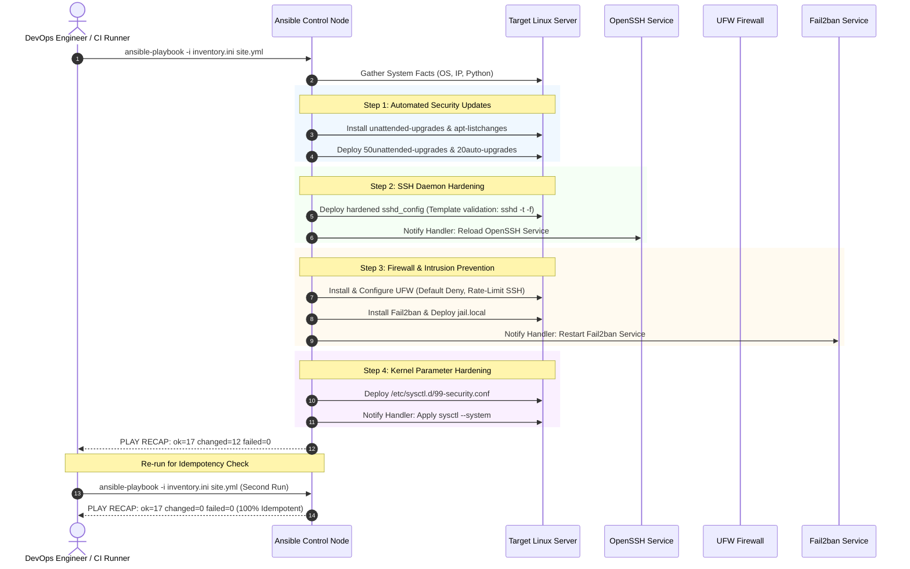

# Mini-Project 04: Ansible Baseline Server Hardening Playbook

<!-- markdownlint-disable MD013 MD033 MD051 -->

## 📋 Table of Contents

1. [Project Overview & Learning Objectives](#-project-overview--learning-objectives)
2. [Understanding Linux OS Hardening & CIS Benchmarks](#-understanding-linux-os-hardening--cis-benchmarks)
3. [The Five Pillars of Server Hardening](#-the-five-pillars-of-server-hardening)
4. [Architecture & Playbook Execution Flow](#-architecture--playbook-execution-flow)
5. [Directory & File Structure](#-directory--file-structure)
6. [Prerequisites & Environment Setup](#-prerequisites--environment-setup)
7. [Step-by-Step Hands-On Guide](#-step-by-step-hands-on-guide)
8. [Automated Audit & Idempotency Testing](#-automated-audit--idempotency-testing)
9. [Deploying to Production Cloud Servers (AWS EC2 / Bare Metal)](#-deploying-to-production-cloud-servers-aws-ec2--bare-metal)
10. [Troubleshooting & FAQs](#-troubleshooting--faqs)
11. [Teardown & Cleanup](#-teardown--cleanup)

---

## 🎯 Project Overview & Learning Objectives

When a fresh Linux server (Ubuntu, Debian, RHEL) is launched, default configurations prioritize immediate usability over security. Root login is often permitted, password authentication is enabled, unnecessary network ports remain accessible, and brute-force attacks on SSH port 22 begin within minutes of public exposure.

This mini-project provides an automated, production-grade **Baseline Server Hardening Playbook** built with **Ansible**. It establishes a secure operating system baseline compliant with **CIS (Center for Internet Security) Benchmarks**.

### What You Will Learn

- **CIS Benchmark Compliance**: Implementing industry-standard security controls across SSH, network firewalls, intrusion detection, and kernel parameters.
- **Ansible Role Architecture**: Designing modular, reusable roles with decoupled tasks, handlers, default variables, and Jinja2 templates.
- **Strict Idempotency**: Structuring automation tasks so subsequent runs produce zero configuration drift (`changed=0, failed=0`).
- **Defense-in-Depth Strategy**: Combining network perimeter filtering (UFW), active intrusion prevention (Fail2ban), cryptographic hygiene (OpenSSH), and kernel protections (sysctl).
- **Automated Security Auditing**: Verifying security controls using automated test suites in local zero-cost Docker test environments.

---

## 🧠 Understanding Linux OS Hardening & CIS Benchmarks

### What are CIS Benchmarks?

The **Center for Internet Security (CIS)** publishes vendor-agnostic, consensus-based best practice guidelines for securing operating systems, cloud environments, and software.

Manual hardening across dozens of servers is error-prone, untraceable, and quickly drifts over time. Ansible allows teams to declare their desired security baseline in code and enforce it continuously across all fleet instances.

---

## 🛡️ The Five Pillars of Server Hardening

```text
┌─────────────────────────────────────────────────────────────────────────┐
│                      LINUX SERVER SECURITY PERIMETER                    │
├───────────────────┬───────────────────┬─────────────────────────────────┤
│ 1. Perimeter / FW │ 2. Intrusion Prev │ 3. Remote Access / SSH          │
│    UFW (Default   │    Fail2ban (Auto │    PermitRootLogin: no          │
│    Deny Incoming) │    IP Ban on auth │    PasswordAuthentication: no   │
│                   │    failures)      │    Ciphers: ChaCha20/AES-GCM    │
├───────────────────┴───────────────────┼─────────────────────────────────┤
│ 4. Kernel Protection (sysctl)         │ 5. Automated Security Patching  │
│    SYN flood protection (syncookies)  │    unattended-upgrades          │
│    Reverse path filtering (anti-spoof)│    Automatic daily CVE patches  │
└───────────────────────────────────────┴─────────────────────────────────┘
```

### 1. SSH Daemon Hardening (CIS 5.2)

- **`PermitRootLogin no`**: Prevents attackers from targeting the ubiquitous `root` superuser directly.
- **`PasswordAuthentication no`**: Eliminates password-guessing and dictionary attacks; requires cryptographic SSH keys (ED25519 / RSA 4096).
- **`MaxAuthTries 3`**: Limits failed authentication attempts per connection before terminating the session.
- **`ClientAliveInterval 300` & `ClientAliveCountMax 2`**: Disconnects idle sessions after 10 minutes of inactivity.
- **Modern Cryptography**: Enforces authenticated encryption ciphers (`chacha20-poly1305`, `aes256-gcm`) and secure key exchange algorithms (`curve25519-sha256`).

### 2. Host Firewall with UFW (CIS 3.5)

- **Default Inbound Policy `DENY`**: Closes all unsolicited incoming ports by default.
- **Default Outbound Policy `ALLOW`**: Permits outbound traffic for package updates and telemetry.
- **Rate-Limited SSH**: Enables connection rate limiting to mitigate denial-of-service and aggressive connection floods.

### 3. Intrusion Prevention with Fail2ban

- Monitors `/var/log/auth.log` for repeated failed authentication attempts.
- Dynamically updates firewall rules to ban offending IP addresses for 1 hour (`bantime = 3600`) after 3 failures (`maxretry = 3`).

### 4. Kernel Security Hardening via Sysctl (CIS 3.1 & 3.2)

- **`net.ipv4.tcp_syncookies = 1`**: Protects the TCP stack against SYN flood DoS attacks.
- **`net.ipv4.conf.all.rp_filter = 1`**: Enables Reverse Path Filtering to prevent IP address spoofing.
- **`net.ipv4.conf.all.accept_source_route = 0`**: Disables source-routed packets.
- **`net.ipv4.conf.all.accept_redirects = 0`**: Prevents malicious ICMP redirect route tampering.

### 5. Automated Security Updates

- Deploys `unattended-upgrades` to automatically install critical security patches from upstream repositories without manual intervention.

---

## 🏛️ Architecture & Playbook Execution Flow

The following sequence illustrates how the master playbook orchestrates the modular hardening role:



---

## 📂 Directory & File Structure

```text
06-infrastructure-as-code/04-ansible-server-baseline-hardening/
├── .gitignore                      # Ignores generated SSH keys, caches, and local inventory
├── README.md                       # Comprehensive educational documentation (this file)
├── ansible.cfg                     # Local Ansible configuration (inventory path, roles, SSH tuning)
├── ansible_audit.sh                # 17-point automated E2E test & idempotency audit script
├── cleanup.sh                      # Standalone teardown script (removes containers, images, keys)
├── inventory.ini.example           # Example inventory targeting local and remote Linux hosts
├── site.yml                        # Top-level master playbook applying the hardening role
├── roles/
│   └── hardening/                  # Modular hardening role
│       ├── defaults/
│       │   └── main.yml            # Default variables (ports, ciphers, timeouts, policies)
│       ├── handlers/
│       │   └── main.yml            # Event-driven service reload/restart handlers
│       ├── tasks/
│       │   ├── main.yml            # Task coordinator importing modular sub-task files
│       │   ├── system_updates.yml  # Automated unattended security upgrades
│       │   ├── ssh_hardening.yml   # SSH daemon configuration & validation
│       │   ├── firewall_ufw.yml    # UFW firewall policy & port rate limiting
│       │   ├── fail2ban.yml        # Fail2ban intrusion prevention jails
│       │   └── sysctl_hardening.yml# Kernel security parameters (anti-spoof, SYN cookies)
│       └── templates/
│           ├── 50unattended-upgrades.j2 # Unattended upgrades template
│           ├── 99-security.conf.j2      # Sysctl kernel configuration template
│           ├── jail.local.j2            # Fail2ban jail template
│           └── sshd_config.j2           # Hardened OpenSSH daemon template
└── test_environment/
    ├── Dockerfile                  # Ubuntu 24.04 test node with OpenSSH server and sudo user
    └── entrypoint.sh               # Test node service supervisor
```

---

## 🛠️ Prerequisites & Environment Setup

Ensure the following tools are installed on your control workstation:

| Tool | Minimum Version | Purpose |
| :--- | :--- | :--- |
| **Ansible** / **Ansible-Core** | `2.15+` | Automation execution engine |
| **Docker** / **OrbStack** | `20.10+` | Ephemeral test container for local zero-cost verification |
| **OpenSSH Client** (`ssh`, `ssh-keygen`) | Any | Key generation and SSH connectivity testing |
| **Python 3** | `3.10+` | Python runtime for Ansible modules |

---

## 🚀 Step-by-Step Hands-On Guide

### Step 1: Generate Dedicated Test Key & Launch Local Target Node

To test locally without cloud costs, create an ephemeral Ubuntu container running OpenSSH on port `2222`:

```bash
# 1. Generate test SSH keypair
ssh-keygen -t ed25519 -N "" -f .ssh_test_key -C "ansible-local-test"
chmod 0600 .ssh_test_key

# 2. Build local test node image
docker build -t ansible-hardening-test-node:latest test_environment/

# 3. Start target container with network capabilities
docker run -d \
    --name ansible-hardening-target \
    --cap-add=NET_ADMIN \
    -p 2222:22 \
    ansible-hardening-test-node:latest

# 4. Copy public key to authorized_keys of ubuntu user
docker exec ansible-hardening-target bash -c "mkdir -p /home/ubuntu/.ssh && echo '$(cat .ssh_test_key.pub)' > /home/ubuntu/.ssh/authorized_keys && chown -R ubuntu:ubuntu /home/ubuntu/.ssh && chmod 0600 /home/ubuntu/.ssh/authorized_keys"
```

### Step 2: Configure Inventory

Create `inventory.ini` pointing to the local test node:

```ini
[hardened_servers]
target-node-01 ansible_host=127.0.0.1 ansible_port=2222 ansible_user=ubuntu ansible_ssh_private_key_file=.ssh_test_key ansible_python_interpreter=/usr/bin/python3

[hardened_servers:vars]
ansible_become=yes
ansible_become_method=sudo
```

Verify Ansible connectivity via the `ping` module:

```bash
ansible hardened_servers -m ping
```

*Expected Output:*

```json
target-node-01 | SUCCESS => {
    "ansible_facts": {
        "discovered_interpreter_python": "/usr/bin/python3"
    },
    "changed": false,
    "ping": "pong"
}
```

---

### Step 3: Run the Server Hardening Playbook

Execute the master playbook:

```bash
ansible-playbook -i inventory.ini site.yml
```

### Step 4: Verify Idempotency (The Second Run)

Execute the playbook a second time:

```bash
ansible-playbook -i inventory.ini site.yml
```

*Expected Recap:*

```text
PLAY RECAP *********************************************************************
target-node-01             : ok=17   changed=0    unreachable=0    failed=0    skipped=0
```

Notice that `changed=0`! The server is already in its declared desired state.

---

## 🧪 Automated Audit & Idempotency Testing

The repository includes a 17-point automated audit script (`ansible_audit.sh`) that validates syntax, boots the test node, executes the playbook, asserts strict idempotency, and tests security boundaries (including verifying that root password login is rejected).

```bash
# Run full automated test suite
./ansible_audit.sh
```

### Test Suite Execution Output

```text
======================================================================
  🛡️  Ansible Baseline Server Hardening Audit & Idempotency Suite
======================================================================

Phase 1: Tooling & Prerequisites Verification
  [PASS] Test 01: Docker engine is responsive
         ↳ Engine version: 29.4.0
  [PASS] Test 02: Ansible playbook engine detected
         ↳ ansible-playbook [core 2.20.0]
  [PASS] Test 03: SSH utilities available (ssh, ssh-keygen)
         ↳ Key generation and client tools ready

Phase 2: Playbook Syntax Validation
  [PASS] Test 04: Master playbook and role syntax validation (site.yml)
         ↳ Syntax is valid

Phase 3: Ephemeral Test Node Setup (Port 2222)
  Building test node image (ansible-hardening-test-node:latest)...
  [PASS] Test 05: Test node container image built successfully
         ↳ ansible-hardening-test-node:latest
  [PASS] Test 06: Test node container active and reachable via SSH
         ↳ 127.0.0.1:2222 (user: ubuntu)

Phase 4: Initial Hardening Playbook Execution
  [PASS] Test 07: Initial playbook execution completed without errors
         ↳ Applied 12 security configuration changes

Phase 5: Playbook Idempotency Verification
  [PASS] Test 08: Playbook idempotency confirmed (changed=0, failed=0)
         ↳ Zero configuration drift on second execution

Phase 6: Security Controls Verification
  [PASS] Test 09: SSH PermitRootLogin set to 'no' in sshd_config (CIS 5.2.5)
         ↳ PermitRootLogin no
  [PASS] Test 10: SSH PasswordAuthentication disabled in sshd_config (CIS 5.2.8)
         ↳ PasswordAuthentication no
  [PASS] Test 11: SSH MaxAuthTries restricted to 3 (CIS 5.2.6)
         ↳ MaxAuthTries 3
  [PASS] Test 12: SSH strong cryptographic ciphers enforced (CIS 5.2.14)
         ↳ Only modern authenticated ciphers permitted
  [PASS] Test 13: Kernel sysctl security parameters deployed (CIS 3.1 & 3.2)
         ↳ SYN flood protection & RP filtering configured
  [PASS] Test 14: Fail2ban SSH brute-force protection jail deployed (/etc/fail2ban/jail.local)
         ↳ Jail [sshd] active with 1h ban time
  [PASS] Test 15: Automated security updates configuration deployed (/etc/apt/apt.conf.d/)
         ↳ Unattended security upgrades enabled
  [PASS] Test 16: Root SSH connection blocked by SSH daemon (Defense-in-Depth)
         ↳ Direct root login rejected

Phase 7: Teardown & Environment Cleanup
  Stopping and removing test container (ansible-hardening-target)...
  [PASS] Test 17: Test container and ephemeral test credentials purged
         ↳ Environment returned to clean state

======================================================================
  TEST SUITE RESULTS SUMMARY
======================================================================
  Total Tests Executed : 17
  Passed Assertions    : 17
  Failed Assertions    : 0
======================================================================
🎉 ALL ANSIBLE HARDENING AUDIT TESTS PASSED PERFECTLY!
```

---

## ☁️ Deploying to Production Cloud Servers (AWS EC2 / Bare Metal)

To apply this hardening baseline to real cloud servers:

1. Update `inventory.ini` with your server IP addresses and SSH private key:

   ```ini
   [hardened_servers]
   web-prod-01  ansible_host=203.0.113.50 ansible_user=ubuntu ansible_ssh_private_key_file=~/.ssh/prod_key.pem
   db-prod-01   ansible_host=203.0.113.51 ansible_user=ubuntu ansible_ssh_private_key_file=~/.ssh/prod_key.pem

   [hardened_servers:vars]
   ansible_become=yes
   ansible_become_method=sudo
   ```

2. (Optional) Customize variables in `roles/hardening/defaults/main.yml` or via `group_vars/hardened_servers.yml`. For example, to open web ports:

   ```yaml
   hardening_ufw_allowed_ports:
     - { port: "22", proto: "tcp", rule: "limit", comment: "SSH" }
     - { port: "80", proto: "tcp", rule: "allow", comment: "HTTP" }
     - { port: "443", proto: "tcp", rule: "allow", comment: "HTTPS" }
   ```

3. Execute the playbook:

   ```bash
   ansible-playbook -i inventory.ini site.yml
   ```

---

## 🚨 Troubleshooting & FAQs

### 1. Error: Permission denied (publickey)

**Cause**: Password authentication is disabled and the client's public key is not registered in `/home/<user>/.ssh/authorized_keys`.

**Resolution**: Ensure your SSH public key is added to the user's `authorized_keys` before executing the hardening playbook.

---

### 2. Error: Failed to lock apt for exclusive access

**Cause**: Background OS processes (such as unattended updates or daily apt caches) hold the `/var/lib/dpkg/lock-frontend` lock.

**Resolution**: Wait a minute for the background update to complete, or configure `cache_valid_time` in Ansible apt tasks.

---

### 3. How do I test without destroying the container?

Pass the `--keep` flag to `./ansible_audit.sh`:

```bash
./ansible_audit.sh --keep
```

You can then log into the container manually via SSH:

```bash
ssh -i .ssh_test_key -p 2222 ubuntu@127.0.0.1
```

---

## 🧹 Teardown & Cleanup

To stop and remove all test containers, delete test SSH credentials, and clear temporary caches:

```bash
# Run standalone cleanup script
./cleanup.sh --all
```

Options:

- `./cleanup.sh`: Stops test containers, deletes temporary SSH keys, and purges logs.
- `./cleanup.sh --all`: Also deletes the cached Docker test image (`ansible-hardening-test-node:latest`), returning your machine to a 100% pristine state.
