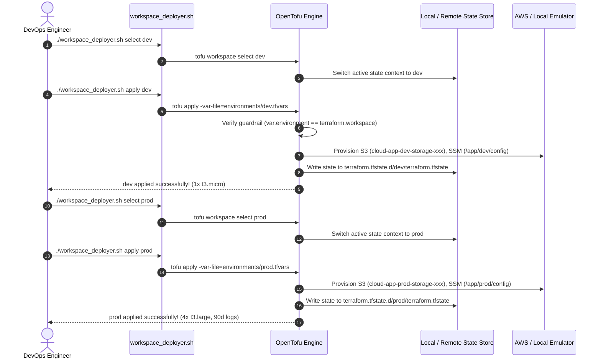

# Mini-Project 05: OpenTofu Multi-Environment Workspaces

<!-- markdownlint-disable MD013 MD033 MD051 -->

## 📋 Table of Contents

1. [Project Overview & Learning Objectives](#-project-overview--learning-objectives)
2. [What are OpenTofu Workspaces?](#-what-are-opentofu-workspaces)
3. [Architectural Comparison: Workspaces vs Directory-per-Environment](#-architectural-comparison-workspaces-vs-directory-per-environment)
4. [Multi-Environment Specification Matrix](#-multi-environment-specification-matrix)
5. [Architecture & Workspace Flow](#-architecture--workspace-flow)
6. [Directory & File Structure](#-directory--file-structure)
7. [Prerequisites & Environment Setup](#-prerequisites--environment-setup)
8. [Step-by-Step Hands-On Guide](#-step-by-step-hands-on-guide)
9. [Automated Multi-Environment Testing](#-automated-multi-environment-testing)
10. [Deploying to Real AWS Cloud](#-deploying-to-real-aws-cloud)
11. [Troubleshooting & FAQs](#-troubleshooting--faqs)
12. [Teardown & Cleanup](#-teardown--cleanup)

---

## 🎯 Project Overview & Learning Objectives

Engineering teams must deliver infrastructure across multiple discrete stages: development (`dev`) for rapid developer iteration, staging (`staging`) for pre-production validation and integration tests, and production (`prod`) for mission-critical, highly available customer traffic.

Duplicating HCL code across separate folders creates severe configuration drift, maintenance overhead, and copy-paste errors. **OpenTofu Workspaces** allow teams to maintain a **single DRY (Don't Repeat Yourself) codebase** while isolating state files and dynamically provisioning environment-tailored resources using `terraform.workspace` expressions and environment `.tfvars` files.

### What You Will Learn

- **Workspace State Mechanics**: Understanding how OpenTofu isolates state in `terraform.tfstate.d/<workspace>/` locally and under `env:/<workspace>/` in remote backends.
- **Dynamic Resource Sizing & Naming**: Writing flexible HCL that interpolates `terraform.workspace` for names, counts, instance sizes, retention windows, and deletion protection.
- **Safety Guardrails**: Implementing HCL `check` blocks and preconditions to prevent applying production configurations (`prod.tfvars`) against development workspaces (`dev`).
- **Workspace Deployment Tooling**: Utilizing a dedicated shell utility (`workspace_deployer.sh`) to automate workspace selection, speculative planning, and differential audits.
- **Zero-Cost Local Emulation**: Testing the full lifecycle locally against zero-cost AWS emulators before pushing to AWS Cloud.

---

## 🧠 What are OpenTofu Workspaces?

An **OpenTofu Workspace** is a distinct, named state instance sharing the exact same HCL configuration.

```text
                               ┌─── OpenTofu Code (main.tf, locals.tf) ───┐
                               │                                          │
                ┌──────────────┴──────────────┬───────────────────────────┴──────────────┐
                ▼                             ▼                                          ▼
     [ dev Workspace ]               [ staging Workspace ]                      [ prod Workspace ]
     ├── state: dev/state            ├── state: staging/state                   ├── state: prod/state
     ├── 1x t3.micro replica         ├── 2x t3.small replicas                   ├── 4x t3.large replicas
     ├── 3-day log retention         ├── 14-day log retention                   ├── 90-day log retention
     └── Internal security group     └── Internal security group                └── Public HTTPS ingress
```

Within your HCL code, the built-in variable `terraform.workspace` evaluates to the currently active workspace name (`dev`, `staging`, `prod`, or `default`).

---

## ⚖️ Architectural Comparison: Workspaces vs Directory-per-Environment

| Feature / Criteria | OpenTofu Workspaces (This Project) | Directory-per-Environment | Terragrunt / Stacks |
| :--- | :--- | :--- | :--- |
| **Code Duplication** | **Zero (100% DRY)** | High (Module calls duplicated per folder) | Zero (Wrapper keeps code DRY) |
| **State File Isolation** | **Complete** (`terraform.tfstate.d/`) | Complete (Separate folders) | Complete (Generated backend keys) |
| **Topology Differences** | Must use `count` / `for_each` toggles | Allows structural deviations | Allows structural deviations |
| **Blast Radius** | Small (state separated), but shared code | Minimal (isolated directory) | Minimal (isolated state & configs) |
| **Best Used For** | Similar infrastructure topologies across stages | Divergent architecture or multi-account setups | Enterprise scale & multi-account orchestration |

---

## 📊 Multi-Environment Specification Matrix

This project models three distinct environments parameterized through `environments/*.tfvars`:

| Specification | Development (`dev`) | Staging (`staging`) | Production (`prod`) |
| :--- | :--- | :--- | :--- |
| **Target Audience** | Software Developers | QA, Load Testing, SRE | End Customers (Live Traffic) |
| **Instance Type** | `t3.micro` (1 vCPU, 1GB RAM) | `t3.small` (2 vCPU, 2GB RAM) | `t3.large` (2 vCPU, 8GB RAM) |
| **Compute Replicas** | `1` instance | `2` instances | `4` instances |
| **Log Retention** | `3` days | `14` days | `90` days |
| **Backup Retention** | `0` days (none) | `7` days | `30` days |
| **S3 Versioning** | `Suspended` | `Enabled` | `Enabled` |
| **Deletion Protection** | `false` | `false` | `true` |
| **Ingress Scope** | Private (`10.0.0.0/8`) | Private (`10.0.0.0/8`) | Public (`0.0.0.0/0`) |

---

## 🏛️ Architecture & Workspace Flow

The sequence diagram below demonstrates how `workspace_deployer.sh` switches workspaces and applies environment configurations:



---

## 📂 Directory & File Structure

```text
06-infrastructure-as-code/05-opentofu-multi-env-workspaces/
├── .gitignore                      # Excludes local caches, logs, plans, and workspace states
├── .tflint.hcl                     # TFLint ruleset for AWS provider and HCL conventions
├── README.md                       # Comprehensive educational documentation (this file)
├── cleanup.sh                      # Standalone teardown script (purges workspaces & containers)
├── test_workspaces.sh              # 18-point automated E2E test suite
├── workspace_deployer.sh           # Operational CLI utility for workspace lifecycle management
├── versions.tf                     # OpenTofu (>= 1.5.0) and AWS/Random provider constraints
├── providers.tf                    # AWS provider with dynamic local emulator endpoint support
├── variables.tf                    # Parameterized variables (sizing, retention, protection)
├── locals.tf                       # Dynamic sizing maps, naming conventions, and tag merging
├── main.tf                         # S3 bucket, versioning, SSM parameters, Security Group, CloudWatch
├── outputs.tf                      # Workspace metadata, bucket ARNs, security groups, sizing summaries
└── environments/                   # Environment-specific variable definitions
    ├── dev.tfvars                  # Development tier configuration (cost-optimized)
    ├── staging.tfvars              # Staging tier configuration (pre-production mirror)
    └── prod.tfvars                 # Production tier configuration (high-availability)
```

---

## 🛠️ Prerequisites & Environment Setup

Ensure the following tools are installed on your workstation:

| Tool | Minimum Version | Purpose |
| :--- | :--- | :--- |
| **OpenTofu** / **Terraform** | `1.6.0+` / `1.5.0+` | Infrastructure as Code orchestration engine |
| **Docker** / **OrbStack** | `20.10+` | Runs the local zero-cost AWS emulator container (`motoserver/moto`) |
| **AWS CLI** (`aws`) | `2.0+` | Interacting with provisioned AWS resources |
| **jq** | `1.6+` | Parsing JSON metadata from AWS CLI and OpenTofu outputs |
| **tflint** | `0.50+` | Static linting and code quality analysis |

---

## 🚀 Step-by-Step Hands-On Guide

### Step 1: Start the Local AWS Emulator

Start the local zero-cost AWS emulator container:

```bash
docker run -d \
    --name localstack-workspaces-demo \
    -p 4566:5000 \
    motoserver/moto:latest
```

Verify that the emulator is active:

```bash
curl -s http://127.0.0.1:4566/
```

### Step 2: Compare Environment Specifications (`diff`)

Inspect the differential resource allocations across all environments:

```bash
./workspace_deployer.sh diff
```

*Output:*

```text
======================================================================
  📊 Multi-Environment Specification Matrix Comparison
======================================================================
Environment  | Instance     | Replicas       | Log Retention      | Backup Retention | Deletion Protection 
-------------------------------------------------------------------------------------------------------
dev          | t3.micro     | 1              | 3 days             | 0 days           | false               
staging      | t3.small     | 2              | 14 days            | 7 days           | false               
prod         | t3.large     | 4              | 90 days            | 30 days          | true                
=======================================================================================================
```

---

### Step 3: Deploy the Development (`dev`) Workspace

```bash
# Initialize OpenTofu
tofu init

# Select or create the dev workspace
./workspace_deployer.sh select dev

# Plan and apply dev infrastructure
./workspace_deployer.sh apply dev
```

Inspect the provisioned dev outputs:

```bash
tofu output
```

*Example Output:*

```text
cloudwatch_log_group   = "/aws/app/dev"
environment            = "dev"
instance_count         = 1
instance_type          = "t3.micro"
is_production          = false
log_retention_days     = 3
s3_storage_bucket_name = "cloud-app-dev-storage-kp9meb"
security_group_name    = "cloud-app-dev-sg"
workspace_name         = "dev"
```

---

### Step 4: Deploy the Production (`prod`) Workspace

Switch to the `prod` workspace and deploy without modifying any HCL code:

```bash
# Select prod workspace
./workspace_deployer.sh select prod

# Apply production infrastructure
./workspace_deployer.sh apply prod
```

Inspect the provisioned prod outputs:

```bash
tofu output
```

*Example Output:*

```text
cloudwatch_log_group   = "/aws/app/prod"
environment            = "prod"
instance_count         = 4
instance_type          = "t3.large"
is_production          = true
log_retention_days     = 90
s3_storage_bucket_name = "cloud-app-prod-storage-x9a2k1"
security_group_name    = "cloud-app-prod-sg"
workspace_name         = "prod"
```

Notice that both `dev` and `prod` infrastructure coexist simultaneously, isolated in separate state files inside `terraform.tfstate.d/`!

---

## 🧪 Automated Multi-Environment Testing

The project includes an automated 18-point test suite (`test_workspaces.sh`) that tests formatting, schema validation, local emulator provisioning, dev/staging/prod lifecycles, state isolation audits, and safety guardrails.

```bash
# Run full E2E test suite using OpenTofu
./test_workspaces.sh

# Or run with HashiCorp Terraform
./test_workspaces.sh --engine=terraform
```

### Test Suite Execution Output

```text
======================================================================
  🌐 OpenTofu Multi-Environment Workspaces E2E Test Suite
======================================================================

Phase 1: Tooling & Prerequisites Verification
  [PASS] Test 01: Docker engine is responsive
         ↳ Engine version: 29.4.0
  [PASS] Test 02: IaC engine detected (tofu)
         ↳ OpenTofu v1.12.6
  [PASS] Test 03: CLI utilities available (tflint, aws, jq, curl)
         ↳ All tools ready

Phase 2: Static Analysis & Validation
  [PASS] Test 04: HCL formatting validation (tofu fmt -check)
         ↳ Canonical formatting verified
  [PASS] Test 05: OpenTofu configuration schema validation
         ↳ Configuration is valid

Phase 3: Local AWS Emulator Bootstrap
  [PASS] Test 06: Local AWS emulator started successfully
         ↳ Endpoint: http://127.0.0.1:4566

Phase 4: Dev Workspace Lifecycle & Sizing Assertions
  [PASS] Test 07: Dev workspace applied with cost-optimized specifications
         ↳ 1x t3.micro, 3d log retention
  [PASS] Test 08: Dev resource naming dynamically prefixed with workspace identifier
         ↳ Bucket: cloud-app-dev-storage-vpnwpq

Phase 5: Staging Workspace Lifecycle & Sizing Assertions
  [PASS] Test 09: Staging workspace applied with pre-production specifications
         ↳ 2x t3.small, 14d log retention
  [PASS] Test 10: Staging storage bucket versioning enabled
         ↳ Status = Enabled

Phase 6: Production Workspace Lifecycle & Sizing Assertions
  [PASS] Test 11: Prod workspace applied with high-availability tier-1 specifications
         ↳ 4x t3.large, 90d logs, deletion protection active
  [PASS] Test 12: Production security group dynamically named and provisioned
         ↳ cloud-app-prod-sg
  [PASS] Test 13: SSM Parameter manifest stores verified production metadata
         ↳ instance_count = 4, environment = prod

Phase 7: State Isolation & Cross-Environment Audit
  [PASS] Test 14: Independent workspace state files isolated in terraform.tfstate.d/
         ↳ 3 independent state files verified
  [PASS] Test 15: Zero state cross-contamination confirmed between workspaces
         ↳ State strictly isolated per environment

Phase 8: Safety Guardrail Assertion
  [PASS] Test 16: Workspace safety guardrail caught environment mismatch
         ↳ Prevented applying prod.tfvars on dev workspace

Phase 9: Infrastructure Destruction & Teardown
  Destroying prod workspace...
  Destroying staging workspace...
  Destroying dev workspace...
  [PASS] Test 17: All workspace resources cleanly destroyed via IaC engine
         ↳ dev, staging, and prod destroyed
  [PASS] Test 18: Complete emulator container and state workspace cleanup
         ↳ All state caches and containers removed

======================================================================
  TEST SUITE RESULTS SUMMARY
======================================================================
  Total Tests Executed : 18
  Passed Assertions    : 18
  Failed Assertions    : 0
======================================================================
🎉 ALL OPENTOFU WORKSPACES TESTS PASSED PERFECTLY!
```

---

## ☁️ Deploying to Real AWS Cloud

To deploy to real AWS:

1. Configure your AWS credentials (`aws configure` or environment variables).
2. Set `aws_endpoint = ""` in `variables.tf` or via environment variable `TF_VAR_aws_endpoint=""`.
3. (Recommended) Configure a remote S3 backend in `versions.tf`:

   ```hcl
   terraform {
     backend "s3" {
       bucket         = "my-company-tofu-state"
       key            = "workspaces/app/terraform.tfstate"
       region         = "us-east-1"
       dynamodb_table = "tofu-locks"
       encrypt        = true
     }
   }
   ```

4. Deploy your desired environment:

   ```bash
   ./workspace_deployer.sh select prod
   ./workspace_deployer.sh apply prod
   ```

---

## 🚨 Troubleshooting & FAQs

### 1. Error: Variable environment does not match active OpenTofu workspace

**Cause**: You attempted to run `tofu apply -var-file=environments/prod.tfvars` while your active workspace was `dev`.

**Resolution**: Switch to the matching workspace first:

```bash
tofu workspace select prod
```

---

### 2. How do I delete an unused workspace?

You cannot delete the active workspace or the `default` workspace. Switch to `default` first, then delete:

```bash
tofu workspace select default
tofu workspace delete dev
```

---

## 🧹 Teardown & Cleanup

To destroy all infrastructure across `dev`, `staging`, and `prod`, remove local emulator containers, and purge state caches:

```bash
# Run standalone cleanup script
./cleanup.sh --all
```

Options:

- `./cleanup.sh`: Destroys all workspace resources, deletes custom workspaces, and stops the emulator container.
- `./cleanup.sh --all`: Also purges plugin caches (`.terraform/`, `.tofu/`) and lockfiles, leaving the workspace 100% clean.
