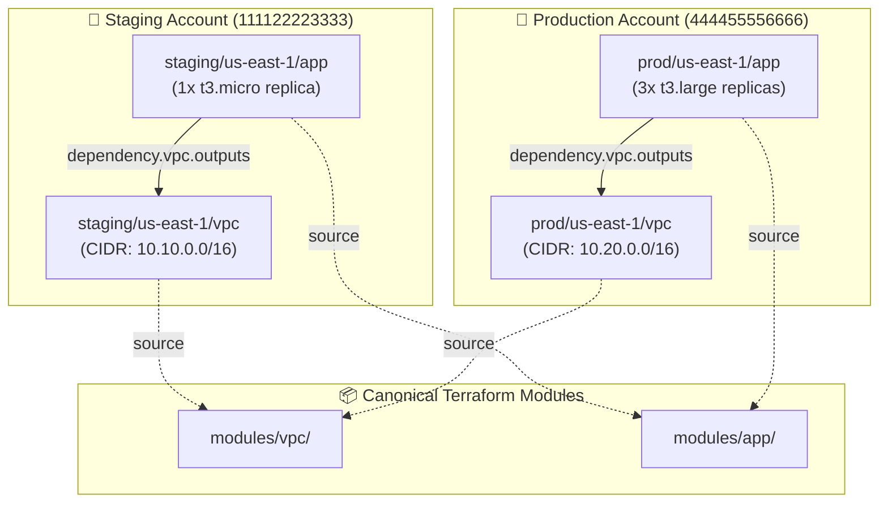
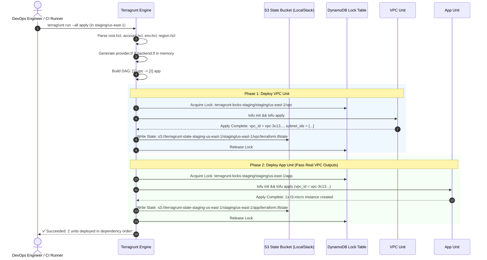

<!-- markdownlint-disable MD013 MD033 MD051 -->
# Mini-Project 07: DRY Multi-Account Architecture with Terragrunt

> **Domain**: 06. Infrastructure as Code (IaC)  
> **Level**: Intermediate to Advanced  
> **Infrastructure**: Local (LocalStack / Docker) or Cloud (AWS Multi-Account / Free Tier)  

---

## 📋 Table of Contents

1. [Project Overview & Learning Objectives](#-project-overview--learning-objectives)
2. [The Problem: The WET Anti-Pattern in Multi-Account IaC](#-the-problem-the-wet-anti-pattern-in-multi-account-iac)
3. [What is Terragrunt? Core Architecture & Philosophy](#-what-is-terragrunt-core-architecture--philosophy)
4. [The Four Pillars of DRY Terragrunt](#-the-four-pillars-of-dry-terragrunt)
5. [Inter-Module Dependencies & Directed Acyclic Graphs (DAG)](#-inter-module-dependencies--directed-acyclic-graphs-dag)
6. [Multi-Account Directory Hierarchy Explained](#-multi-account-directory-hierarchy-explained)
7. [Architecture & Execution Flow](#-architecture--execution-flow)
8. [Directory & File Structure](#-directory--file-structure)
9. [Prerequisites & Environment Setup](#-prerequisites--environment-setup)
10. [Step-by-Step Hands-On Guide](#-step-by-step-hands-on-guide)
11. [Deploying to Real Production AWS Accounts](#-deploying-to-real-production-aws-accounts)
12. [Automated Testing & Verification Suite](#-automated-testing--verification-suite)
13. [Troubleshooting & FAQs](#-troubleshooting--faqs)
14. [Teardown & Cleanup](#-teardown--cleanup)

---

## 🎯 Project Overview & Learning Objectives

Managing enterprise cloud infrastructure across multiple AWS accounts (`staging`, `production`, `shared-services`, `security`) and multiple regions (`us-east-1`, `eu-west-1`) using vanilla Terraform or OpenTofu leads to massive code duplication:

- Every single component repeats identical `backend "s3" { ... }` blocks with hardcoded bucket names and keys.
- Every directory repeats identical `provider "aws" { ... }` blocks and IAM `assume_role` definitions.
- Changes to common configurations require modifying dozens of scattered `.tf` files.

**Terragrunt** is a thin, open-source orchestration wrapper created by Gruntwork that enforces **DRY (Don't Repeat Yourself)** principles across your entire infrastructure codebase.

This mini-project demonstrates how to design, configure, and operate a **production-grade, DRY Multi-Account Terragrunt Architecture**. It provides zero-cost local AWS emulation via LocalStack / Moto alongside clear production guidelines for AWS Organizations.

```text
┌─────────────────────────────────────────────────────────────────────────────────────┐
│                       TERRAGRUNT DRY MULTI-ACCOUNT WORKFLOW                         │
├──────────────────────────┬───────────────────────────┬──────────────────────────────┤
│ 1. Root Inheritance      │ 2. Dynamic Backend/Provider│ 3. DAG Orchestration         │
│    • root.hcl centralizes│    • S3 key from path     │    • dependency blocks       │
│    • account/env/region  │    • AssumeRole & tags    │    • run-all plan / apply    │
│    • _envcommon patterns │    • Zero duplicated code │    • Reverse order destroy   │
└──────────────────────────┴───────────────────────────┴──────────────────────────────┘
```

### What You Will Learn

- **DRY Infrastructure Principles**: Eliminating copy-paste duplication across accounts, environments, and regions.
- **Root Configuration Inheritance**: Utilizing `find_in_parent_folders("root.hcl")` and `read_terragrunt_config` to pass metadata dynamically down the directory hierarchy.
- **Dynamic Remote State Generation**: Automatically configuring S3 remote state buckets, DynamoDB state locking tables, and relative S3 keys using `path_relative_to_include()`.
- **Dynamic Provider Generation**: Injecting `provider "aws"` blocks with account-specific `assume_role` ARNs, target regions, and unified default tags.
- **`_envcommon` Design Pattern**: Creating reusable Terragrunt module blueprints to share canonical module sources and default inputs.
- **DAG Dependency Management**: Defining explicit relationships between modules with `dependency` blocks and `mock_outputs` for seamless speculative planning.
- **Multi-Module Orchestration**: Executing concurrent, dependency-aware deployments using `terragrunt run --all plan` and `terragrunt run --all apply`.

---

## 🛑 The Problem: The WET Anti-Pattern in Multi-Account IaC

In vanilla Terraform/OpenTofu, maintaining separate accounts and environments typically results in a **WET (Write Everything Twice)** codebase:

```text
❌ Vanilla Terraform/OpenTofu (WET Anti-Pattern):
├── staging/us-east-1/vpc/
│   ├── main.tf              (Duplicated VPC resource code)
│   ├── provider.tf          (Duplicated provider config with hardcoded region)
│   └── backend.tf           (Duplicated backend with hardcoded S3 bucket & key)
├── staging/us-east-1/app/
│   ├── main.tf              (Duplicated App resource code)
│   ├── provider.tf          (Duplicated provider config)
│   └── backend.tf           (Duplicated backend config)
├── prod/us-east-1/vpc/
│   ├── main.tf              (Copy-pasted from staging!)
│   ├── provider.tf          (Copy-pasted with hardcoded account ARN)
│   └── backend.tf           (Copy-pasted with hardcoded S3 bucket & key)
└── prod/us-east-1/app/
    ├── main.tf              (Copy-pasted from staging!)
    ├── provider.tf          (Copy-pasted!)
    └── backend.tf           (Copy-pasted!)
```

### Why the WET Approach Fails at Scale

1. **State Key Collisions & Human Error**: Manually typing `key = "prod/vpc/terraform.tfstate"` in copy-pasted files frequently leads to overwriting another environment's state file.
2. **Provider Configuration Drift**: If default tags or AssumeRole configurations change, engineers must update dozens of files manually.
3. **No Native Multi-Module Orchestration**: Running `terraform apply` requires navigating into each folder manually and applying in the exact correct order (`vpc` first, then `app`).
4. **Maintenance Nightmare**: 10 accounts × 3 regions × 10 modules = **300 folders** with duplicated boilerplate!

---

## 💡 What is Terragrunt? Core Architecture & Philosophy

Terragrunt acts as a declarative configuration orchestrator that sits directly in front of OpenTofu / Terraform:

```text
                    ┌────────────────────────────────────┐
                    │      Developer / CI/CD Runner      │
                    └─────────────────┬──────────────────┘
                                      │
                                      ▼
                    ┌────────────────────────────────────┐
                    │          Terragrunt CLI            │
                    │  • Evaluates root.hcl & account.hcl│
                    │  • Builds Dependency Graph (DAG)   │
                    │  • Generates provider.tf & backend │
                    │  • Resolves inputs from _envcommon │
                    └─────────────────┬──────────────────┘
                                      │
                                      ▼
                    ┌────────────────────────────────────┐
                    │      OpenTofu / Terraform CLI      │
                    │  • Executes init, plan, apply      │
                    │  • Connects to S3 Remote Backend   │
                    │  • Talks to AWS APIs / LocalStack  │
                    └────────────────────────────────────┘
```

---

## 🏛️ The Four Pillars of DRY Terragrunt

### Pillar 1: Root Configuration & Hierarchical Inheritance

In modern Terragrunt, the root configuration file is named [`root.hcl`](root.hcl). Child units include this root file using `find_in_parent_folders("root.hcl")`.

`root.hcl` dynamically loads account, environment, and regional context by inspecting parent folders:

```hcl
locals {
  # Dynamically discover and parse parent configuration files
  account_vars = read_terragrunt_config(find_in_parent_folders("account.hcl"))
  env_vars     = read_terragrunt_config(find_in_parent_folders("env.hcl"))
  region_vars  = read_terragrunt_config(find_in_parent_folders("region.hcl"))

  account_name = local.account_vars.locals.account_name
  account_id   = local.account_vars.locals.account_id
  environment  = local.env_vars.locals.environment
  aws_region   = local.region_vars.locals.aws_region
}
```

### Pillar 2: Dynamic Backend Generation (`remote_state`)

Instead of writing `backend.tf` in every module, Terragrunt's `remote_state` block in [`root.hcl`](root.hcl) generates the backend configuration on the fly. The S3 state file key is computed automatically from the directory path using `path_relative_to_include()`:

```hcl
remote_state {
  backend = "s3"
  generate = {
    path      = "backend.tf"
    if_exists = "overwrite_terragrunt"
  }
  config = {
    encrypt        = true
    bucket         = "terragrunt-state-${local.account_name}-${local.aws_region}"
    key            = "${path_relative_to_include()}/terraform.tfstate"
    region         = local.aws_region
    dynamodb_table = "terragrunt-locks-${local.account_name}"
  }
}
```

- When executed in `staging/us-east-1/vpc`, the key is: `staging/us-east-1/vpc/terraform.tfstate`.
- When executed in `prod/us-east-1/app`, the key is: `prod/us-east-1/app/terraform.tfstate`.
- **Zero manual key management; state key collisions are mathematically impossible.**

### Pillar 3: Dynamic Provider Generation (`generate "provider"`)

Terragrunt generates the `provider.tf` file dynamically, configuring the target region, AssumeRole ARN, and global tags:

```hcl
generate "provider" {
  path      = "provider.tf"
  if_exists = "overwrite_terragrunt"
  contents  = <<EOF
provider "aws" {
  region = "${local.aws_region}"

  # Real AWS: Assume the administrator role in the target child account
  # assume_role {
  #   role_arn = "arn:aws:iam::${local.account_id}:role/OrganizationAccountAccessRole"
  # }

  default_tags {
    tags = {
      Account     = "${local.account_name}"
      Environment = "${local.environment}"
      Region      = "${local.aws_region}"
      ManagedBy   = "Terragrunt"
      Project     = "DevOps-SRE-Terragrunt-Fleet"
    }
  }
}
EOF
}
```

### Pillar 4: The `_envcommon` Blueprint Pattern

Instead of repeating module source URLs and shared input mappings, we define reusable blueprints in [`_envcommon/vpc.hcl`](_envcommon/vpc.hcl) and [`_envcommon/app.hcl`](_envcommon/app.hcl):

```hcl
# _envcommon/vpc.hcl
terraform {
  source = "${dirname(find_in_parent_folders("root.hcl"))}/modules/vpc"
}
```

Child units simply include the blueprint and provide environment-specific overrides:

```hcl
# staging/us-east-1/vpc/terragrunt.hcl
include "root" {
  path = find_in_parent_folders("root.hcl")
}

include "envcommon" {
  path = "${dirname(find_in_parent_folders("root.hcl"))}/_envcommon/vpc.hcl"
}

inputs = {
  name       = "staging-us-east-1"
  cidr_block = "10.10.0.0/16"
}
```

---

## 🔗 Inter-Module Dependencies & Directed Acyclic Graphs (DAG)

In multi-tier infrastructure, compute instances in the `app` module require outputs from the `vpc` module (such as `vpc_id` and `public_subnet_ids`).

Terragrunt provides the `dependency` block to link modules together:

```hcl
# staging/us-east-1/app/terragrunt.hcl
dependency "vpc" {
  config_path = "../vpc"

  # Mock outputs permit speculative 'terragrunt plan' before VPC is applied!
  mock_outputs = {
    vpc_id            = "vpc-mock-111122223333"
    public_subnet_ids = ["subnet-mock-01", "subnet-mock-02"]
  }
  mock_outputs_allowed_terraform_commands = ["validate", "plan"]
}

inputs = {
  name       = "staging-frontend"
  vpc_id     = dependency.vpc.outputs.vpc_id
  subnet_ids = dependency.vpc.outputs.public_subnet_ids
}
```



### The Power of `mock_outputs`

When planning a greenfield deployment where the VPC does not yet exist, vanilla Terraform fails with missing output errors. Terragrunt's `mock_outputs` allows `terragrunt run --all plan` to succeed smoothly by injecting mock values during planning, and switching to real outputs during `apply`!

---

## 📂 Multi-Account Directory Hierarchy Explained

The directory hierarchy mirrors real-world cloud governance structures:

```text
06-infrastructure-as-code/07-terragrunt-dry-architecture/
├── root.hcl                        # Root Terragrunt configuration (backend + provider)
├── _envcommon/                     # Reusable environment blueprints
│   ├── vpc.hcl                     # VPC module blueprint
│   └── app.hcl                     # App module blueprint
├── modules/                        # Canonical Terraform / OpenTofu modules
│   ├── vpc/                        # VPC, Subnets, IGW, Route Tables
│   └── app/                        # EC2 instances, Security Groups
├── staging/                        # Account Level: Staging Account
│   ├── account.hcl                 # Account ID: 111122223333, Profile: staging
│   ├── env.hcl                     # Environment: staging
│   └── us-east-1/                  # Region Level: us-east-1
│       ├── region.hcl              # Region: us-east-1
│       ├── vpc/                    # Module Level: Staging VPC Unit
│       │   └── terragrunt.hcl
│       └── app/                    # Module Level: Staging App Unit (depends on vpc)
│           └── terragrunt.hcl
└── prod/                           # Account Level: Production Account
    ├── account.hcl                 # Account ID: 444455556666, Profile: production
    ├── env.hcl                     # Environment: prod
    └── us-east-1/                  # Region Level: us-east-1
        ├── region.hcl              # Region: us-east-1
        ├── vpc/                    # Module Level: Production VPC Unit (CIDR: 10.20.0.0/16)
        │   └── terragrunt.hcl
        └── app/                    # Module Level: Production App Unit (3x t3.large replicas)
            └── terragrunt.hcl
```

---

## 🔄 Architecture & Execution Flow



---

## 💻 Prerequisites & Environment Setup

Ensure the following tools are installed:

1. **Docker / OrbStack**: Container runtime for local AWS emulation.
2. **Terragrunt (v1.0+)**: IaC orchestration engine (`brew install terragrunt`).
3. **OpenTofu (v1.6+) or Terraform (v1.6+)**: Underlying IaC execution binary.
4. **AWS CLI (`aws`) & `curl`**: CLI utilities to interact with AWS/LocalStack endpoints.

Verify installed versions:

```bash
docker --version
terragrunt --version
tofu version || terraform version
aws --version
```

---

## 🚀 Step-by-Step Hands-On Guide

### Step 1: Bootstrap Local AWS Emulation (Zero-Cost LocalStack)

Start the local emulator container and create the remote state S3 buckets and DynamoDB lock tables:

```bash
# Export test credentials and LocalStack endpoint
export AWS_ACCESS_KEY_ID="test"
export AWS_SECRET_ACCESS_KEY="test"
export AWS_DEFAULT_REGION="us-east-1"
export USE_LOCALSTACK="true"
export LOCALSTACK_ENDPOINT="http://127.0.0.1:4566"

# Start the emulator container
docker run -d --name localstack-terragrunt-demo -p 4566:5000 motoserver/moto:latest

# Create S3 remote state buckets for staging and production
aws --endpoint-url=http://127.0.0.1:4566 s3 mb s3://terragrunt-state-staging-us-east-1
aws --endpoint-url=http://127.0.0.1:4566 s3 mb s3://terragrunt-state-production-us-east-1

# Create DynamoDB state locking tables
aws --endpoint-url=http://127.0.0.1:4566 dynamodb create-table \
    --table-name terragrunt-locks-staging \
    --attribute-definitions AttributeName=LockID,AttributeType=S \
    --key-schema AttributeName=LockID,KeyType=HASH \
    --billing-mode PAY_PER_REQUEST

aws --endpoint-url=http://127.0.0.1:4566 dynamodb create-table \
    --table-name terragrunt-locks-production \
    --attribute-definitions AttributeName=LockID,AttributeType=S \
    --key-schema AttributeName=LockID,KeyType=HASH \
    --billing-mode PAY_PER_REQUEST
```

### Step 2: Visualize the Dependency Graph (DAG)

Inspect the execution order computed by Terragrunt in the staging directory:

```bash
cd staging/us-east-1
terragrunt dag graph
```

Output:

```text
digraph {
    "app" ;
    "app" -> "vpc";
    "vpc" ;
}
```

Notice how Terragrunt automatically detects that `app` depends on `vpc`!

### Step 3: Speculative Multi-Account Planning

Execute a speculative plan across all modules in staging:

```bash
terragrunt run --all plan --non-interactive
```

Observe:

1. Terragrunt plans `vpc` first.
2. Terragrunt plans `app` second, using mock outputs for `vpc_id` and `public_subnet_ids`.
3. All default tags (`Account = staging`, `Environment = staging`, `ManagedBy = Terragrunt`) are computed dynamically!

### Step 4: Deploy Staging Infrastructure

Apply the entire staging environment:

```bash
terragrunt run --all apply --non-interactive
```

Terragrunt provisions:

- `staging-us-east-1-vpc` (`10.10.0.0/16`) with public and private subnets.
- `staging-frontend-app-sg` and 1x `t3.micro` EC2 instance linked directly to the newly created VPC.

### Step 5: Verify Isolated Remote State in S3

List the state files created in the S3 backend:

```bash
aws --endpoint-url=http://127.0.0.1:4566 s3 ls s3://terragrunt-state-staging-us-east-1 --recursive
```

Output:

```text
staging/us-east-1/app/terraform.tfstate
staging/us-east-1/vpc/terraform.tfstate
```

Notice that the S3 keys match the exact directory hierarchy automatically.

### Step 6: Deploy Production Infrastructure (Environment-Specific Sizing)

Navigate to the production directory and deploy:

```bash
cd ../../prod/us-east-1
terragrunt run --all apply --non-interactive
```

Observe the production configuration:

- VPC CIDR: `10.20.0.0/16`.
- Sizing: **3 replicas** of **`t3.large`** instances.
- Tags: `Account = production`, `Environment = prod`.
- State Bucket: `terragrunt-state-production-us-east-1`.

### Step 7: Clean Destruction in Reverse Dependency Order

Destroy the staging and production infrastructure:

```bash
cd ../../staging/us-east-1
terragrunt run --all destroy --non-interactive

cd ../../prod/us-east-1
terragrunt run --all destroy --non-interactive
```

Notice the destruction order:

1. `app` is destroyed **first** (detaching compute from subnets and deleting security groups).
2. `vpc` is destroyed **second** (deleting subnets, IGW, route tables, and the VPC).

---

## ☁️ Deploying to Real Production AWS Accounts

When deploying to live AWS accounts (e.g. governed by **AWS Organizations** or **AWS Control Tower**):

### 1. Multi-Account IAM Architecture

In a production setup, your central deployment identity (e.g. CI/CD pipeline or AWS Identity Center SSO) assumes the `OrganizationAccountAccessRole` in the target account:

```text
┌───────────────────────────────┐
│     Management Account        │
│  (CI/CD / Identity Center)    │
└──────────────┬────────────────┘
               │ AssumeRole
       ┌───────┴───────┐
       ▼               ▼
┌──────────────┐ ┌──────────────┐
│ Staging Acct │ │  Prod Acct   │
│ 111122223333 │ │ 444455556666 │
└──────────────┘ └──────────────┘
```

### 2. Enable AssumeRole in `root.hcl`

Uncomment the `assume_role` block inside the `generate "provider"` section in [`root.hcl`](root.hcl):

```hcl
provider "aws" {
  region = "${local.aws_region}"

  assume_role {
    role_arn = "arn:aws:iam::${local.account_id}:role/OrganizationAccountAccessRole"
  }
}
```

### 3. Switch from LocalStack to Real AWS

Set `USE_LOCALSTACK="false"` in your environment:

```bash
export USE_LOCALSTACK="false"
export AWS_REGION="us-east-1"

# Authenticate via AWS CLI / SSO
aws sso login --profile management-admin

# Execute production deployment
cd prod/us-east-1
terragrunt run --all apply
```

Terragrunt will automatically provision real AWS S3 versioned buckets, DynamoDB lock tables, and deploy infrastructure directly into the respective AWS accounts.

---

## 🧪 Automated Testing & Verification Suite

The included test runner [`terragrunt_run_all_test.sh`](terragrunt_run_all_test.sh) executes an automated 12-step verification suite:

```bash
./terragrunt_run_all_test.sh
```

### Test Suite Execution Output

```text
======================================================================
  🧪 Terragrunt DRY Multi-Account Architecture - Test Suite
======================================================================

▶ Step 1: Checking system prerequisites...
  [PASS] Test 1: All prerequisites verified (Docker, Terragrunt, IaC engine, AWS CLI, jq)
         ↳ terragrunt version 1.1.3

▶ Step 2: Bootstrapping Local AWS Emulator & S3 state buckets...
  [PASS] Test 2: Local AWS emulator started & state infrastructure bootstrapped
         ↳ Port 4566 ready

▶ Step 3: Checking Terragrunt and Terraform HCL formatting...
  [PASS] Test 3: Terragrunt HCL syntax and canonical formatting verified

▶ Step 4: Resolving Directed Acyclic Graph (DAG) dependencies...
  [PASS] Test 4: Terragrunt correctly constructed DAG dependency: app -> vpc
         ↳ Execution order guaranteed

▶ Step 5: Executing speculative plan on staging (run-all plan)...
  [PASS] Test 5: Staging speculative plan generated in dependency order with mock outputs

▶ Step 6: Verifying dynamic provider.tf generation...
  [PASS] Test 6: provider.tf was dynamically generated with inherited environment tags
         ↳ Account=staging, ManagedBy=Terragrunt

▶ Step 7: Verifying dynamic backend.tf generation with relative key...
  [PASS] Test 7: backend.tf dynamically computed relative S3 state key path
         ↳ Key: staging/us-east-1/vpc/terraform.tfstate

▶ Step 8: Deploying staging infrastructure (run-all apply)...
  [PASS] Test 8: Staging VPC and App successfully provisioned in proper dependency order
         ↳ Real VPC ID passed to App module

▶ Step 9: Verifying S3 state persistence in LocalStack...
  [PASS] Test 9: Terragrunt persisted isolated state files in S3 without file collisions
         ↳ S3 state paths matched relative directory tree

▶ Step 10: Deploying production infrastructure (3x t3.large replicas)...
  [PASS] Test 10: Production deployed with production sizing (3 replicas, t3.large, 10.20.0.0/16)
         ↳ Environment isolation enforced

▶ Step 11: Testing reverse-dependency destruction (app before vpc)...
  [PASS] Test 11: Both staging and production destroyed cleanly in reverse DAG order

▶ Step 12: Testing cleanup script...
  [PASS] Test 12: cleanup.sh purged emulator container, caches, and state files

======================================================================
  🎉 ALL 12 TESTS PASSED! (12/12)
======================================================================
```

---

## ❓ Troubleshooting & FAQs

### 1. `Error: S3 bucket does not exist` during `terragrunt run-all plan`

- **Cause**: In LocalStack/offline mode, the backend S3 bucket was not bootstrapped prior to initialization.
- **Fix**: Run `./terragrunt_run_all_test.sh` (which creates the bucket automatically) or create it with `aws --endpoint-url=http://127.0.0.1:4566 s3 mb s3://<bucket-name>`.

### 2. `Using terragrunt.hcl as the root is an anti-pattern` warning

- **Explanation**: In Terragrunt 1.x, Gruntwork recommends naming root files [`root.hcl`](root.hcl) instead of `terragrunt.hcl` to avoid ambiguity with leaf unit files. This project strictly follows this modern standard.

### 3. How do I inspect the generated Terraform code?

- **Tip**: Terragrunt copies files to `.terragrunt-cache/`. You can view the generated `provider.tf` and `backend.tf` files inside each unit's `.terragrunt-cache` directory.

### 4. How do I keep the local environment running after tests?

- **Fix**: Pass the `--keep` flag to the test suite:

  ```bash
  ./terragrunt_run_all_test.sh --keep
  ```

---

## 🧹 Teardown & Cleanup

After finishing all tests and experiments, purge all containers, temporary caches, and generated files to leave your environment clean for the next mini-project:

### Fast Cleanup (Containers, Caches, State Files, and Generated HCL)

```bash
./cleanup.sh
```

### Full Purge (Including Base Images and Deep Caches)

```bash
./cleanup.sh --all
```

The cleanup script guarantees:

- The LocalStack emulator container (`localstack-terragrunt-demo`) is stopped and removed.
- All `.terragrunt-cache/` and `.terraform/` directories across the workspace are purged.
- All dynamically generated `provider.tf` and `backend.tf` files are removed.
- All local `*.tfstate`, `*.tfplan`, and log files are deleted.
- Zero leftover resources or files remain outside or inside the repository.
