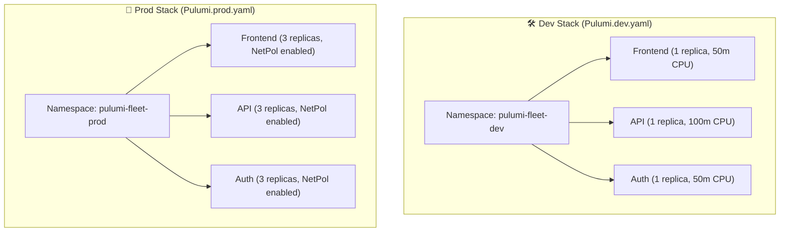
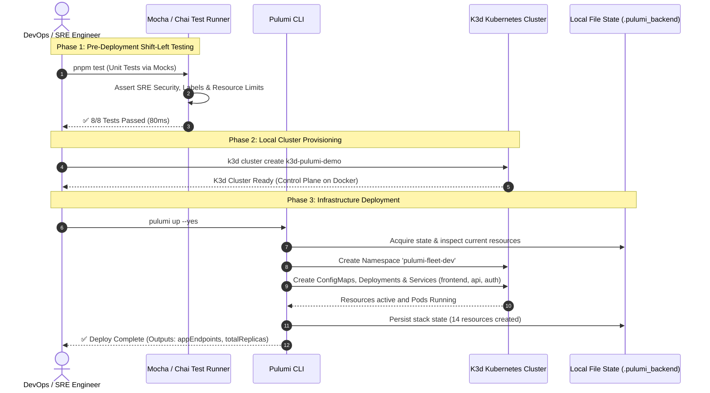

<!-- markdownlint-disable MD013 MD033 MD051 -->
# Mini-Project 08: Pulumi TypeScript Kubernetes Infrastructure

> **Domain**: 06. Infrastructure as Code (IaC)  
> **Level**: Intermediate to Advanced  
> **Infrastructure**: Local (K3d / Docker) or Cloud (AWS EKS / GKE / AKS)  

---

## 📋 Table of Contents

1. [Project Overview & Learning Objectives](#-project-overview--learning-objectives)
2. [Why General-Purpose Languages for IaC? (TypeScript vs YAML/HCL)](#-why-general-purpose-languages-for-iac-typescript-vs-yamlhcl)
3. [Pulumi Architecture & Core Principles](#-pulumi-architecture--core-principles)
4. [Custom ComponentResources: Reusable Microservice Abstraction](#-custom-componentresources-reusable-microservice-abstraction)
5. [Pre-Deployment Unit Testing with Pulumi Mocks](#-pre-deployment-unit-testing-with-pulumi-mocks)
6. [Multi-Environment Stacks & Dynamic Sizing](#-multi-environment-stacks--dynamic-sizing)
7. [Architecture & Execution Flow](#-architecture--execution-flow)
8. [Directory & File Structure](#-directory--file-structure)
9. [Prerequisites & Environment Setup](#-prerequisites--environment-setup)
10. [Step-by-Step Hands-On Guide](#-step-by-step-hands-on-guide)
11. [Deploying to Real Production Cloud Kubernetes (EKS / GKE / AKS)](#-deploying-to-real-production-cloud-kubernetes-eks--gke--aks)
12. [Automated Testing & Verification Suite](#-automated-testing--verification-suite)
13. [Troubleshooting & FAQs](#-troubleshooting--faqs)
14. [Teardown & Cleanup](#-teardown--cleanup)

---

## 🎯 Project Overview & Learning Objectives

Traditional Infrastructure as Code (IaC) tools often rely on domain-specific languages (DSL) like HCL or static configuration formats like YAML and JSON. While suitable for simple topologies, managing complex, multi-service Kubernetes platforms with static files leads to:

- **Massive YAML Duplication**: Copy-pasting boilerplate across dozens of microservices.
- **Fragile Templating**: Relying on string-interpolated Helm templates prone to syntax errors.
- **Lack of Native Unit Testing**: Inability to write automated unit tests with standard testing frameworks before running costly deployments.

**Pulumi** brings real programming languages (such as **TypeScript / JavaScript**, Python, Go, and C#) to cloud infrastructure.

This mini-project demonstrates how to build and operate a **production-ready Kubernetes platform using Pulumi TypeScript**. It implements custom `ComponentResources`, strict type checking, and **pre-deployment unit testing using Pulumi Mocks** running against an ephemeral local **K3d (K3s in Docker)** cluster with zero cloud costs.

```text
┌─────────────────────────────────────────────────────────────────────────────────────┐
│                       PULUMI TYPESCRIPT KUBERNETES WORKFLOW                         │
├──────────────────────────┬───────────────────────────┬──────────────────────────────┤
│ 1. Strong Type Safety    │ 2. Pulumi Mocks Unit Tests│ 3. Automated Deployment      │
│    • TypeScript classes  │    • In-memory Mocha suite│    • K3d local cluster       │
│    • ComponentResources  │    • Security policy check│    • Local state backend     │
│    • Dynamic loops/args  │    • 0ms cluster overhead │    • pulumi up & destroy     │
└──────────────────────────┴───────────────────────────┴──────────────────────────────┘
```

### What You Will Learn

- **Real Programming Languages for IaC**: Harnessing TypeScript loops, interfaces, conditionals, and classes to manage cloud fleets.
- **ComponentResource Pattern**: Encapsulating complex multi-resource patterns (Deployments, Services, ConfigMaps, and NetworkPolicies) into reusable TypeScript classes (`MicroserviceApp`).
- **Policy Enforcement via Unit Tests**: Writing fast in-memory unit tests using `pulumi.runtime.setMocks` and Mocha/Chai to enforce SRE security baselines (`runAsNonRoot`, CPU/Memory limits, liveness probes) before deployment.
- **Multi-Environment Stacks**: Managing `dev` and `prod` configurations with environment-driven replica scaling and network policies.
- **Local State Backend & Containment**: Executing Pulumi with self-managed local file backends (`file://./.pulumi_backend`) and local K3d clusters without cloud dependencies or telemetry leaks.
- **SRE Cluster Observability**: Asserting live Pod health, ClusterIP DNS service discovery, and structured stack outputs.

---

## 🧠 Why General-Purpose Languages for IaC? (TypeScript vs YAML/HCL)

| Feature | Static YAML (Kubernetes) | DSLs (Terraform / OpenTofu HCL) | Real Code (Pulumi TypeScript) |
| :--- | :--- | :--- | :--- |
| **Type Safety & Autocomplete** | ❌ None (Runtime schema errors) | ⚠️ Partial (HCL schema checks) | ✅ **Full IDE IntelliSense & Compile-Time Checks** |
| **Logic & Abstraction** | ❌ None (Repeated manifests) | ⚠️ Basic `for_each`, `count`, ternary | ✅ **Native loops, classes, functions, async/await** |
| **Modularity & OOP** | ❌ None | ⚠️ Module directories | ✅ **`ComponentResource` OOP inheritance & encapsulation** |
| **Unit Testing** | ❌ Hard (Conftest / OPA policies) | ⚠️ Terraform test (requires engine) | ✅ **Standard Mocha, Jest, Vitest in milliseconds** |
| **Package Management** | ❌ Helm repositories | ⚠️ Terraform Registry | ✅ **Standard npm / pnpm / yarn package ecosystem** |

### Code Comparison: Creating a Fleet of 3 Microservices

#### Vanilla Kubernetes YAML: ~250 lines of duplicate YAML

#### Pulumi TypeScript: 15 clean, typed lines

```typescript
const services = ["frontend", "api", "auth"];

for (const name of services) {
  new MicroserviceApp(name, {
    namespace: namespace.metadata.name,
    environment: "dev",
    replicas: 1,
    port: 8080,
  });
}
```

---

## 🏗️ Pulumi Architecture & Core Principles

```text
┌─────────────────────────────────────────────────────────────┐
│                     Pulumi CLI (`pulumi up`)                │
└──────────────────────────────┬──────────────────────────────┘
                               │
            ┌──────────────────┴──────────────────┐
            ▼                                     ▼
┌───────────────────────────────┐   ┌─────────────────────────┐
│     Language Host (Node.js)   │   │      Pulumi Engine      │
│  • Executes index.ts          │   │  • Compares desired vs  │
│  • Evaluates ComponentResources│◄──┤    actual state graph   │
│  • Registers resource inputs  │   │  • Calculates CRUD diff │
└───────────────────────────────┘   └─────────────┬───────────┘
                                                  │
                                                  ▼
                                    ┌─────────────────────────┐
                                    │    Resource Provider    │
                                    │  (@pulumi/kubernetes)   │
                                    └─────────────┬───────────┘
                                                  │
                                                  ▼
                                    ┌─────────────────────────┐
                                    │ Kubernetes API / K3d    │
                                    │  • Namespace            │
                                    │  • Deployments & Pods   │
                                    │  • ClusterIP Services   │
                                    │  • ConfigMaps & NetPols │
                                    └─────────────────────────┘
```

1. **Language Host**: Runs your TypeScript program. As resources are declared (`new k8s.apps.v1.Deployment(...)`), it sends resource declarations to the Pulumi Engine.
2. **Pulumi Engine**: Reconciles the resource graph against the state store (`.pulumi_backend`), computes an execution plan, and triggers create/update/delete operations.
3. **Resource Provider**: Translates Pulumi resource calls into Kubernetes API requests via `kubectl` / API client.
4. **State Storage**: Self-managed locally via `file://./.pulumi_backend` (or in cloud object storage like S3/GCS or Pulumi Cloud).

---

## 🧩 Custom ComponentResources: Reusable Microservice Abstraction

In Pulumi, a **ComponentResource** is a higher-level logical component that groups multiple individual cloud resources together as a single cohesive unit.

In this project, [`src/app.ts`](src/app.ts) creates `MicroserviceApp`:

```typescript
export class MicroserviceApp extends pulumi.ComponentResource {
  public readonly configMap: k8s.core.v1.ConfigMap;
  public readonly deployment: k8s.apps.v1.Deployment;
  public readonly service: k8s.core.v1.Service;
  public readonly networkPolicy?: k8s.networking.v1.NetworkPolicy;
  public readonly serviceEndpoint: pulumi.Output<string>;

  constructor(name: string, args: MicroserviceAppArgs, opts?: pulumi.ComponentResourceOptions) {
    super("custom:k8s:MicroserviceApp", name, {}, opts);
    // ... provisions ConfigMap, Deployment, Service, NetworkPolicy ...
  }
}
```

### Key Built-in SRE Standards

- **Security Context Hardening**:
  - `runAsNonRoot: true` (User UID 10001)
  - `allowPrivilegeEscalation: false`
  - `readOnlyRootFilesystem: true`
  - `capabilities: { drop: ["ALL"] }`
- **Reliability & Probes**:
  - `livenessProbe` and `readinessProbe` configured with HTTP health endpoints.
  - Mandatory CPU and Memory `requests` and `limits` to protect node capacity.
- **Service Discovery**:
  - Automatic `ClusterIP` Service exposing port 8080.
  - Exported DNS endpoint: `name-svc.namespace.svc.cluster.local:8080`.

---

## 🧪 Pre-Deployment Unit Testing with Pulumi Mocks

One of the biggest advantages of Pulumi is the ability to write **unit tests that run entirely in memory** without spinning up a cluster or making network calls.

Using `pulumi.runtime.setMocks(...)`, [`tests/infrastructure.spec.ts`](tests/infrastructure.spec.ts) intercepts resource registrations and verifies compliance against corporate SRE policies:

```typescript
// tests/infrastructure.spec.ts
describe("Kubernetes Infrastructure Unit Tests (Pulumi Mocks)", () => {
  before(async () => {
    pulumi.runtime.setMocks({
      newResource: (args) => ({ id: `${args.name}-mock-id`, state: args.inputs }),
      call: (args) => args.inputs,
    });
    infra = require("../index");
  });

  it("should enforce runAsNonRoot at pod securityContext level", async () => {
    for (const app of Object.values(infra.appInstances)) {
      const spec = await promiseOf(app.deployment.spec);
      expect(spec.template.spec.securityContext.runAsNonRoot).to.be.true;
    }
  });

  it("should require both CPU and Memory requests and limits for all containers", async () => {
    for (const app of Object.values(infra.appInstances)) {
      const spec = await promiseOf(app.deployment.spec);
      for (const c of spec.template.spec.containers) {
        expect(c.resources.requests.cpu).to.exist;
        expect(c.resources.limits.memory).to.exist;
      }
    }
  });
});
```

When running `pnpm test`, all assertions execute in under **80ms**!

---

## 🌍 Multi-Environment Stacks & Dynamic Sizing

Pulumi stacks isolate deployments across environments:



- **`dev` Stack**: Optimized for cost and fast feedback (1 replica per service, 3 total Pods, debug logging).
- **`prod` Stack**: High-availability configuration (3 replicas per service, 9 total Pods, NetworkPolicies enabled, info logging).

---

## 🔄 Architecture & Execution Flow



---

## 📂 Directory & File Structure

```text
06-infrastructure-as-code/08-pulumi-typescript-k8s-infrastructure/
├── package.json                      # Node.js project manifest and scripts
├── tsconfig.json                     # Strict TypeScript compiler options
├── Pulumi.yaml                       # Pulumi project definition (nodejs runtime)
├── Pulumi.dev.yaml                   # Development stack configuration (1 replica)
├── Pulumi.prod.yaml                  # Production stack configuration (3 replicas)
├── src/
│   └── app.ts                        # MicroserviceApp ComponentResource abstraction
├── tests/
│   └── infrastructure.spec.ts        # Pulumi Mocks unit test suite (8 test cases)
├── index.ts                          # Root stack entrypoint orchestrating fleet
├── pulumi_test.sh                    # Automated 12-test end-to-end test suite
├── cleanup.sh                        # Standalone sanitation and teardown script
├── .gitignore                        # Workspace isolation rules
└── README.md                         # This educational documentation
```

---

## 💻 Prerequisites & Environment Setup

Ensure the following tools are installed:

1. **Docker / OrbStack**: Container runtime for K3d.
2. **K3d (v5.0+)**: Fast, lightweight local Kubernetes cluster runner (`brew install k3d`).
3. **Kubectl**: Kubernetes CLI tool (`brew install kubectl`).
4. **Pulumi (v3.100+)**: Modern IaC CLI (`brew install pulumi`).
5. **Node.js (v20+) & pnpm (v9+)**: JavaScript runtime and fast package manager (`brew install pnpm`).

Verify installed versions:

```bash
docker --version
k3d version
kubectl version --client
pulumi version
pnpm --version
node --version
```

---

## 🚀 Step-by-Step Hands-On Guide

### Step 1: Install Dependencies and Compile TypeScript

Install project packages using `pnpm` and compile the TypeScript source files:

```bash
cd 06-infrastructure-as-code/08-pulumi-typescript-k8s-infrastructure

# Install dependencies
pnpm install

# Compile TypeScript to dist/
pnpm build
```

### Step 2: Run Shift-Left Unit Tests with Pulumi Mocks

Execute the in-memory unit tests to validate corporate SRE policies before interacting with any cluster:

```bash
pnpm test
```

Expected Output:

```text
  Kubernetes Infrastructure Unit Tests (Pulumi Mocks)
    1. Namespace Governance & Compliance
      ✔ should provision namespace with standard managed-by and environment labels
    2. SRE Workload Security Standards
      ✔ should enforce runAsNonRoot at pod securityContext level
      ✔ should enforce container security restrictions (no privilege escalation, drop all capabilities)
    3. Resource Limits & SRE Reliability
      ✔ should require both CPU and Memory requests and limits for all containers
      ✔ should configure both Liveness and Readiness HTTP probes
    4. Networking & Service Discovery
      ✔ should configure ClusterIP service on port 8080 matching container port
    5. Stack Output Integrity
      ✔ should export appEndpoints map containing internal cluster DNS records
      ✔ should assert total microservice and replica counts

  8 passing (75ms)
```

### Step 3: Bootstrap Ephemeral Local K3d Cluster

Create an isolated local Kubernetes cluster and configure local kubeconfig containment:

```bash
# Create local directories
mkdir -p .kube .pulumi_home .pulumi_backend

# Create K3d cluster
k3d cluster create k3d-pulumi-demo \
    --kubeconfig-switch-context=false \
    --kubeconfig-update-default=false \
    --wait

# Export kubeconfig strictly inside the project directory
k3d kubeconfig get k3d-pulumi-demo > .kube/config
chmod 600 .kube/config

# Verify cluster connectivity
KUBECONFIG="$(pwd)/.kube/config" kubectl get nodes
```

### Step 4: Configure Pulumi Local State Backend

Initialize Pulumi with local state file backend and select the `dev` stack:

```bash
export PULUMI_HOME="$(pwd)/.pulumi_home"
export PULUMI_CONFIG_PASSPHRASE=""
export KUBECONFIG="$(pwd)/.kube/config"

# Log into local file backend
pulumi login file://$(pwd)/.pulumi_backend

# Select / create dev stack
pulumi stack select dev --create
```

### Step 5: Run Speculative Infrastructure Preview

Inspect what resources Pulumi plans to create:

```bash
pulumi preview
```

Notice that Pulumi calculates:

- 1 Namespace (`pulumi-fleet-dev`)
- 3 ComponentResources (`frontend`, `api`, `auth`)
- 3 Deployments, 3 Services, 3 ConfigMaps
- Total: **14 resources to create**

### Step 6: Deploy Microservice Fleet

Deploy the live Kubernetes resources:

```bash
pulumi up --yes
```

Output:

```text
Resources:
    + 14 created

Duration: 12s
```

### Step 7: Live Cluster Inspection & SRE Observability

Verify the running workloads using `kubectl`:

```bash
kubectl get all -n pulumi-fleet-dev
```

Output:

```text
NAME                                      READY   STATUS    RESTARTS   AGE
pod/api-deployment-84c667dc58-4qbvn       1/1     Running   0          25s
pod/auth-deployment-7744f75847-x4q25      1/1     Running   0          25s
pod/frontend-deployment-9f8757c89-9ggwk   1/1     Running   0          25s

NAME                   TYPE        CLUSTER-IP      EXTERNAL-IP   PORT(S)    AGE
service/api-svc        ClusterIP   10.43.195.171   <none>        8080/TCP   25s
service/auth-svc       ClusterIP   10.43.152.234   <none>        8080/TCP   25s
service/frontend-svc   ClusterIP   10.43.188.156   <none>        8080/TCP   25s
```

Inspect the exported stack outputs:

```bash
pulumi stack output --json
```

### Step 8: Multi-Environment Production Preview

Test previewing the production stack with 3 replicas per service:

```bash
pulumi stack select prod --create
pulumi preview --config replicaCount=3 --config environment=prod
```

Notice that Pulumi plans:

- Namespace: `pulumi-fleet-prod`
- `totalReplicas: 9` (3 replicas × 3 services)
- `enableNetworkPolicy: true`

### Step 9: Clean Infrastructure Destruction

Tear down the Pulumi stacks:

```bash
pulumi stack select dev
pulumi destroy --yes

pulumi stack rm dev --yes
pulumi stack rm prod --yes
```

---

## ☁️ Deploying to Real Production Cloud Kubernetes (EKS / GKE / AKS)

To deploy this exact Pulumi TypeScript code to live cloud clusters:

### 1. AWS Elastic Kubernetes Service (EKS)

```bash
# Configure AWS credentials and kubeconfig
aws eks update-kubeconfig --region us-east-1 --name my-production-eks

# Deploy with Pulumi
pulumi stack select prod
pulumi up
```

### 2. Google Kubernetes Engine (GKE)

```bash
gcloud container clusters get-credentials my-gke-cluster --region us-central1
pulumi stack select prod
pulumi up
```

### 3. Using Pulumi Cloud State Service (Optional)

In team environments, switch from local file backend to Pulumi Cloud:

```bash
pulumi login
pulumi stack select my-org/k8s-pulumi-fleet/prod
pulumi up
```

---

## 🧪 Automated Testing & Verification Suite

Execute the complete end-to-end verification script:

```bash
./pulumi_test.sh
```

### Test Suite Execution Output

```text
======================================================================
  🧪 Pulumi TypeScript Kubernetes Infrastructure - Test Suite
======================================================================

▶ Step 1: Verifying system prerequisites...
  [PASS] Test 1: All prerequisites verified (Docker, K3d, Kubectl, Pulumi, pnpm, Node.js)
         ↳ Pulumi v3.259.0

▶ Step 2: Compiling TypeScript & validating types (pnpm build)...
  [PASS] Test 2: TypeScript build & strict type validation succeeded
         ↳ Clean compilation to dist/

▶ Step 3: Executing in-memory unit test suite with Pulumi Mocks (pnpm test)...
  [PASS] Test 3: Pulumi Mocks unit tests passed (8/8 assertions)
         ↳ Security hardening, labels & limits enforced

▶ Step 4: Bootstrapping local K3d cluster (k3d-pulumi-demo)...
  [PASS] Test 4: K3d cluster created with isolated kubeconfig containment
         ↳ Node: k3d-k3d-pulumi-demo-server-0

▶ Step 5: Initializing Pulumi local file state backend...
  [PASS] Test 5: Pulumi local file backend & 'dev' stack initialized
         ↳ Backend: file:///Users/fabian/Documents/CodeProjects/github.com/fabiankaraben/devops-sre-mini-projects/06-infrastructure-as-code/08-pulumi-typescript-k8s-infrastructure/.pulumi_backend

▶ Step 6: Running speculative preview (pulumi preview)...
  [PASS] Test 6: Pulumi preview correctly planned 14 resources (Namespace + 3 MicroserviceApps)

▶ Step 7: Deploying infrastructure to K3d (pulumi up --yes)...
  [PASS] Test 7: Pulumi up deployed 3 microservices and namespace into K3d

▶ Step 8: Verifying live resources in namespace 'pulumi-fleet-dev'...
  [PASS] Test 8: Live cluster verification: 3 Pods running, 3 Services, 3 ConfigMaps
         ↳ Namespace: pulumi-fleet-dev

▶ Step 9: Verifying Pulumi stack outputs...
  [PASS] Test 9: Stack outputs validated (namespace, totalReplicas=3, DNS endpoints)
         ↳ Endpoint: frontend-svc.pulumi-fleet-dev.svc.cluster.local:8080

▶ Step 10: Testing multi-environment production stack preview...
  [PASS] Test 10: Production environment preview asserts 3x replica scaling (9 total replicas)

▶ Step 11: Destroying Pulumi stacks (pulumi destroy --yes)...
  [PASS] Test 11: Pulumi stacks cleanly destroyed in reverse order without orphan resources

▶ Step 12: Running cleanup.sh...
  [PASS] Test 12: cleanup.sh purged K3d cluster, local state, and build artifacts

======================================================================
  🎉 ALL 12 TESTS PASSED! (12/12)
======================================================================
```

---

## ❓ Troubleshooting & FAQs

### 1. `error: no default kubeconfig found` during `pulumi up`

- **Cause**: The `KUBECONFIG` environment variable is not set to the local cluster configuration.
- **Fix**: Run `export KUBECONFIG="$(pwd)/.kube/config"`.

### 2. `error: passphrase required` when running Pulumi

- **Cause**: Pulumi prompts for an encryption passphrase for local backends.
- **Fix**: Set `export PULUMI_CONFIG_PASSPHRASE=""` in your shell or script.

### 3. How do I keep the K3d cluster running after running `./pulumi_test.sh`?

- **Fix**: Pass the `--keep` flag:

  ```bash
  ./pulumi_test.sh --keep
  ```

---

## 🧹 Teardown & Cleanup

After finishing all tests, purge all containers, clusters, and temporary files:

### Fast Cleanup (Cluster, Kubeconfig, State Backend, and Build Artifacts)

```bash
./cleanup.sh
```

### Full Purge (Including `node_modules` Dependencies)

```bash
./cleanup.sh --all
```

The cleanup script guarantees:

- The `k3d-pulumi-demo` K3d cluster, Docker containers, and bridge networks are removed.
- All `.pulumi_home/` and `.pulumi_backend/` local state stores are deleted.
- All `.kube/config` credential files are purged.
- All `dist/` compilation artifacts and log files are cleared.
- Zero leftover resources or files remain outside or inside the repository.
