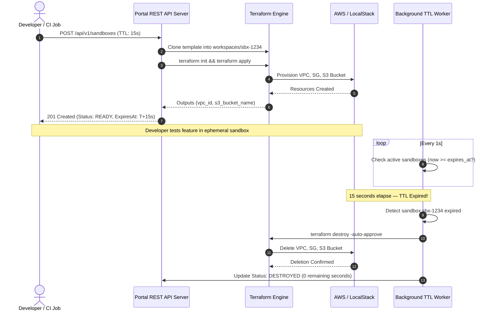

<!-- markdownlint-disable MD013 MD033 MD051 -->
# Mini-Project 10: Self-Service Cloud Sandbox Provisioning Portal

> **Domain**: 06. Infrastructure as Code (IaC)  
> **Level**: Advanced  
> **Infrastructure**: Local (Go / Python REST API + LocalStack / Docker) or Cloud (AWS Free Tier)  

---

## 📋 Table of Contents

1. [Project Overview & Learning Objectives](#-project-overview--learning-objectives)
2. [Why Internal Developer Platforms (IDP) & Self-Service Sandboxes?](#-why-internal-developer-platforms-idp--self-service-sandboxes)
3. [Ephemeral Sandbox Lifecycle & State Isolation](#-ephemeral-sandbox-lifecycle--state-isolation)
4. [Automated TTL Expiration & Zombie Resource Prevention](#-automated-ttl-expiration--zombie-resource-prevention)
5. [REST API Architecture & Endpoints](#-rest-api-architecture--endpoints)
6. [IaC Template Catalog (`web-app` & `microservice`)](#-iac-template-catalog-web-app--microservice)
7. [Architecture & Execution Flow](#-architecture--execution-flow)
8. [Directory & File Structure](#-directory--file-structure)
9. [Prerequisites & Environment Setup](#-prerequisites--environment-setup)
10. [Step-by-Step Hands-On Guide](#-step-by-step-hands-on-guide)
11. [Deploying to Real Production Cloud (AWS ECS / EKS / RDS)](#-deploying-to-real-production-cloud-aws-ecs--eks--rds)
12. [Automated Testing & Verification Suite](#-automated-testing--verification-suite)
13. [Troubleshooting & FAQs](#-troubleshooting--faqs)
14. [Teardown & Cleanup](#-teardown--cleanup)

---

## 🎯 Project Overview & Learning Objectives

In traditional engineering organizations, developers who need a cloud environment to test a feature or reproduce a bug must submit a ticket to the DevOps/SRE team. This leads to:

- **Slow Feedback Loops**: Waiting days or weeks for manual environment provisioning.
- **Runaway Cloud Costs**: Developers forget to delete test environments, leaving expensive orphaned resources ("zombie infrastructure") running indefinitely.
- **Configuration Inconsistency**: Manually created sandboxes drift from production standards.

**Self-Service Cloud Sandbox Portals** are a core pillar of modern **Internal Developer Platforms (IDP)**.

This project implements a complete **Self-Service Cloud Sandbox Provisioning Portal** with a REST API (available in **Go** and **Python**) that wraps Terraform/OpenTofu. Developers can request isolated, ephemeral cloud environments from pre-approved IaC templates with a custom Time-To-Live (TTL). A background worker continuously monitors timers and automatically executes `terraform destroy` when TTL expires, guaranteeing zero resource waste.

```text
┌─────────────────────────────────────────────────────────────────────────────────────┐
│                       SELF-SERVICE CLOUD SANDBOX PORTAL                             │
├──────────────────────────┬───────────────────────────┬──────────────────────────────┤
│ 1. Developer REST API    │ 2. Isolated IaC Workspaces│ 3. Automated TTL Worker      │
│    • POST /sandboxes     │    • workspaces/sbx-xxxx/ │    • Background goroutine    │
│    • GET /sandboxes/{id} │    • Copied HCL templates │    • Auto-destroy on timeout │
│    • DELETE /sandboxes   │    • Custom tfvars.json   │    • Zero zombie resources   │
└──────────────────────────┴───────────────────────────┴──────────────────────────────┘
```

### What You Will Learn

- **Platform Engineering & IDP Fundamentals**: Designing self-service APIs that empower developers while enforcing governance.
- **Dynamic IaC Automation**: Programmatically cloning templates, injecting variables (`terraform.tfvars.json`), and executing `init`, `apply`, and `output` in isolated workspaces.
- **Multi-Tenant State Isolation**: Managing concurrent, independent `terraform.tfstate` files across ephemeral environments.
- **Automated Lifecycle & TTL Management**: Implementing background ticker workers that monitor sandbox expiration timestamps and trigger automated teardowns.
- **Dual-Language REST Implementations**: Exploring high-concurrency **Go** (`net/http`, goroutines) and **Python** (`http.server`, threading) architectures.
- **End-to-End Integration Testing**: Writing client integration suites ([`sandbox_client_test.py`](sandbox_client_test.py)) validating API flows, live cloud resources, and automatic destruction in LocalStack / Moto.

---

## 🚀 Why Internal Developer Platforms (IDP) & Self-Service Sandboxes?

| Operational Model | Traditional Ticket-Based Ops | Self-Service Sandbox Portal |
| :--- | :--- | :--- |
| **Lead Time** | 2–5 business days | **Under 30 seconds** |
| **Teardown Process** | Manual (frequently forgotten) | **100% Automated on TTL Expiration** |
| **Resource Hygiene** | High zombie resource accumulation | **Zero orphaned cloud assets** |
| **Standardization** | Ad-hoc console clicks ("ClickOps") | **Audited, pre-approved IaC templates** |
| **Cost Control** | Unpredictable monthly cloud spikes | **Guaranteed cost ceilings via mandatory TTLs** |

```text
Developer Request ──► [ POST /api/v1/sandboxes ] ──► Portal API Server
                                                             │
                              ┌──────────────────────────────┴──────────────────────────────┐
                              ▼                                                             ▼
                   [ Workspace Isolation ]                                        [ Background TTL Worker ]
                   • Create ./workspaces/sbx-1234                                 • Monitor expires_at
                   • Copy templates/web-app                                       • Trigger auto-destroy
                   • Execute terraform apply                                      • Purge cloud assets
                              │
                              ▼
                   [ Cloud Resources Live ]
                   • VPC: 10.100.0.0/16
                   • Security Group: sg-xxxx
                   • S3 Bucket: sbx-1234-storage
```

---

## 📦 Ephemeral Sandbox Lifecycle & State Isolation

Every requested sandbox progresses through a deterministic lifecycle state machine:

```text
       ┌──────────────┐
       │   REQUEST    │ (POST /api/v1/sandboxes)
       └──────┬───────┘
              │
              ▼
      ┌────────────────┐
      │  PROVISIONING  │ ──► (terraform init && terraform apply)
      └──────┬─────────┘
             │
     ┌───────┴───────┐
     ▼               ▼
┌─────────┐     ┌────────┐
│  READY  │     │ FAILED │
└────┬────┘     └────────┘
     │
     ├───────────────────────────────────┐
     │ (Manual DELETE)                   │ (TTL Expiration: now >= expires_at)
     ▼                                   ▼
┌────────────────┐               ┌────────────────┐
│   DESTROYING   │               │   DESTROYING   │
└────────┬───────┘               └────────┬───────┘
         │                                │
         └───────────────┬────────────────┘
                         │ (terraform destroy -auto-approve)
                         ▼
                 ┌───────────────┐
                 │   DESTROYED   │
                 └───────────────┘
```

### Workspace Isolation Structure

Each sandbox operates in its own isolated subfolder under `workspaces/`:

```text
workspaces/
├── sbx-a1b2c3d4/                     # Sandbox 1 (web-app template)
│   ├── main.tf
│   ├── variables.tf
│   ├── outputs.tf
│   ├── terraform.tfvars.json         # Custom sandbox ID & developer params
│   └── terraform.tfstate             # Isolated local state file
└── sbx-e5f6g7h8/                     # Sandbox 2 (microservice template)
    ├── main.tf
    ├── variables.tf
    ├── outputs.tf
    ├── terraform.tfvars.json
    └── terraform.tfstate
```

This guarantees that destroying one sandbox will **never** interfere with another active sandbox.

---

## ⏰ Automated TTL Expiration & Zombie Resource Prevention

### The Zombie Resource Problem

In cloud development, forgotten test instances, idle databases, and unattached load balancers account for up to **35% of wasted enterprise cloud spend**.

### The Solution: Mandatory TTL Timers

When requesting a sandbox, developers specify a `ttl_seconds` parameter (e.g. `120` seconds for a quick test, or `1800` seconds for a 30-minute debug session).

1. The API calculates `expires_at = time.Now() + ttl_seconds`.
2. The background worker checks all active sandboxes every second:

   ```go
   for _, sbx := range store.List() {
       if sbx.Status == StatusReady && time.Now().After(sbx.ExpiresAt) {
           go engine.DestroySandbox(ctx, sbx)
       }
   }
   ```

3. When `time.Now().After(sbx.ExpiresAt)` is true, the worker transitions the sandbox to `DESTROYING` and executes `terraform destroy -auto-approve`.
4. Cloud resources are cleanly destroyed, and status is updated to `DESTROYED`.

---

## 🌐 REST API Architecture & Endpoints

| Method | Endpoint | Description | Status Codes |
| :--- | :--- | :--- | :--- |
| **`GET`** | `/healthz` | Health check & active sandbox count | `200 OK` |
| **`POST`** | `/api/v1/sandboxes` | Request new ephemeral sandbox | `201 Created`, `400 Bad Request` |
| **`GET`** | `/api/v1/sandboxes` | List all sandboxes with remaining TTL | `200 OK` |
| **`GET`** | `/api/v1/sandboxes/{id}` | Get detailed sandbox metadata & outputs | `200 OK`, `404 Not Found` |
| **`DELETE`** | `/api/v1/sandboxes/{id}` | Immediate early sandbox teardown | `200 OK`, `404 Not Found` |

### Sample JSON Request (`POST /api/v1/sandboxes`)

```json
{
  "name": "payment-api-benchmark",
  "developer_email": "dev-alice@company.local",
  "template": "web-app",
  "ttl_seconds": 120,
  "parameters": {
    "vpc_cidr": "10.100.0.0/16"
  }
}
```

### Sample JSON Response (`201 Created`)

```json
{
  "id": "sbx-801d071a",
  "name": "payment-api-benchmark",
  "developer_email": "dev-alice@company.local",
  "template": "web-app",
  "ttl_seconds": 120,
  "status": "READY",
  "created_at": "2026-08-26T09:37:00Z",
  "expires_at": "2026-08-26T09:39:00Z",
  "time_remaining_seconds": 120,
  "outputs": {
    "endpoint_url": "http://sbx-801d071a.dev-sandbox.internal:8080",
    "s3_bucket_name": "sbx-801d071a-storage",
    "security_group_id": "sg-0a1b2c3d",
    "vpc_id": "vpc-0123456789abcdef0"
  },
  "workspace_dir": ".../workspaces/sbx-801d071a",
  "log_file": ".../logs/sbx-801d071a.log"
}
```

---

## 📋 IaC Template Catalog (`web-app` & `microservice`)

### 1. `templates/web-app/`

- **Components**:
  - `aws_vpc` (`10.100.0.0/16`) with DNS hostnames.
  - `aws_subnet` public subnet.
  - `aws_security_group` allowing HTTP (80), HTTPS (443), and Dev (8080).
  - `aws_s3_bucket` for ephemeral assets storage.

### 2. `templates/microservice/`

- **Components**:
  - `aws_vpc` (`10.200.0.0/16`) backend service network.
  - `aws_security_group` allowing internal gRPC (50051) and REST API (8000).
  - `aws_s3_bucket` for backend data store.

---

## 🔄 Architecture & Execution Flow



---

## 📂 Directory & File Structure

```text
06-infrastructure-as-code/10-self-service-cloud-sandbox-portal/
├── cmd/
│   └── server/
│       └── main.go                   # Go REST API Server entrypoint
├── pkg/
│   └── portal/
│       ├── types.go                  # Data models and status definitions
│       ├── store.go                  # Thread-safe storage with disk persistence
│       ├── engine.go                 # Terraform / OpenTofu workspace orchestrator
│       ├── worker.go                 # Background TTL expiration monitor
│       └── handlers.go               # HTTP routing & REST API handlers
├── templates/
│   ├── web-app/                      # Web application IaC template
│   │   ├── versions.tf
│   │   ├── variables.tf
│   │   ├── main.tf
│   │   └── outputs.tf
│   └── microservice/                 # Microservice IaC template
│       ├── versions.tf
│       ├── variables.tf
│       ├── main.tf
│       └── outputs.tf
├── server.py                         # Python alternative REST API server
├── sandbox_client_test.py            # End-to-end integration test suite
├── portal_test.sh                    # Automated 6-phase test runner
├── sandbox_test.sh                   # Symlink to test runner
├── cleanup.sh                        # Standalone sanitation and teardown script
├── go.mod                            # Go module definition
├── .gitignore                        # Workspace isolation rules
└── README.md                         # This educational documentation
```

---

## 💻 Prerequisites & Environment Setup

Ensure the following tools are installed:

1. **Docker / OrbStack**: Container runtime for LocalStack.
2. **Go (v1.20+)** or **Python (v3.9+)**: Runtime for the portal REST API (`brew install go` or `brew install python`).
3. **OpenTofu (v1.6+) or Terraform (v1.6+)**: IaC execution engine (`brew install opentofu` or `brew install terraform`).
4. **AWS CLI (`aws`)**: Interacts with AWS/LocalStack APIs (`brew install awscli`).
5. **`curl` & `jq`**: Command line HTTP and JSON tools.

Verify installed versions:

```bash
docker --version
go version || python3 --version
tofu version || terraform version
aws --version
curl --version
jq --version
```

---

## 🚀 Step-by-Step Hands-On Guide

### Step 1: Start the Local AWS Emulator

Launch the zero-cost local cloud emulator container on port `4566`:

```bash
export AWS_ACCESS_KEY_ID="test"
export AWS_SECRET_ACCESS_KEY="test"
export AWS_DEFAULT_REGION="us-east-1"
export LOCALSTACK_ENDPOINT="http://127.0.0.1:4566"

docker run -d --name localstack-sandbox-portal -p 4566:5000 motoserver/moto:latest

# Verify health
curl -s http://127.0.0.1:4566/
```

### Step 2: Start the Portal REST API Server

Choose between the compiled **Go server** (recommended) or the **Python server**:

#### Option A: Run Go Server

```bash
go build -o portal-server ./cmd/server
./portal-server --port=8080 --ttl-interval=1s
```

#### Option B: Run Python Server

```bash
python3 server.py --port=8080
```

### Step 3: Check Portal Health

In another terminal window:

```bash
curl -s http://127.0.0.1:8080/healthz | jq .
```

Output:

```json
{
  "status": "healthy",
  "version": "1.0.0",
  "active_sandboxes": 0,
  "total_sandboxes": 0,
  "timestamp": "2026-08-26T09:40:00Z"
}
```

### Step 4: Request a 30-Second Ephemeral Sandbox

Request a sandbox using the `web-app` template:

```bash
curl -s -X POST http://127.0.0.1:8080/api/v1/sandboxes \
  -H "Content-Type: application/json" \
  -d '{
    "name": "feature-auth-test",
    "developer_email": "dev-carol@company.local",
    "template": "web-app",
    "ttl_seconds": 30
  }' | jq .
```

Output:

```json
{
  "id": "sbx-b2e43a97",
  "name": "feature-auth-test",
  "developer_email": "dev-carol@company.local",
  "template": "web-app",
  "ttl_seconds": 30,
  "status": "READY",
  "outputs": {
    "endpoint_url": "http://sbx-b2e43a97.dev-sandbox.internal:8080",
    "s3_bucket_name": "sbx-b2e43a97-storage",
    "security_group_id": "sg-3d9f8419",
    "vpc_id": "vpc-3d9f84193a1a15f18"
  }
}
```

### Step 5: Verify Live Cloud Infrastructure in AWS/LocalStack

Confirm that Terraform actually provisioned the VPC and S3 bucket:

```bash
# Query VPC
aws --endpoint-url=http://127.0.0.1:4566 ec2 describe-vpcs --vpc-ids vpc-3d9f84193a1a15f18

# Query S3 Bucket
aws --endpoint-url=http://127.0.0.1:4566 s3 ls
```

### Step 6: Request a Second Sandbox and Manually Destroy It

Create a microservice sandbox:

```bash
curl -s -X POST http://127.0.0.1:8080/api/v1/sandboxes \
  -H "Content-Type: application/json" \
  -d '{
    "name": "grpc-test",
    "template": "microservice",
    "ttl_seconds": 300
  }' | jq .
```

Manually destroy it before TTL expires:

```bash
curl -s -X DELETE http://127.0.0.1:8080/api/v1/sandboxes/sbx-08910c48 | jq .
```

Output confirms: `"message": "Sandbox sbx-08910c48 successfully destroyed"`.

### Step 7: Observe Automated TTL Expiration in Real Time

Watch the first sandbox (`sbx-b2e43a97`) as its 30-second TTL counts down:

```bash
curl -s http://127.0.0.1:8080/api/v1/sandboxes/sbx-b2e43a97 | jq '{status, time_remaining_seconds}'
```

Once the 30 seconds elapse, query again:

```json
{
  "status": "DESTROYED",
  "time_remaining_seconds": 0
}
```

Confirm the VPC has automatically vanished from LocalStack:

```bash
aws --endpoint-url=http://127.0.0.1:4566 ec2 describe-vpcs --vpc-ids vpc-3d9f84193a1a15f18
```

Output: `ClientError: The vpc ID 'vpc-3d9f84193a1a15f18' does not exist`.

### Step 8: View the Sandbox Audit Log

```bash
curl -s http://127.0.0.1:8080/api/v1/sandboxes | jq .
```

---

## ☁️ Deploying to Real Production Cloud (AWS ECS / EKS / RDS)

To run this portal as an enterprise production service:

1. **Deploy Portal Server**:
   - Containerize `cmd/server/main.go` and deploy to **AWS ECS Fargate** or **Kubernetes (EKS)**.
2. **Persistent Database**:
   - Replace the local JSON store with **Amazon RDS PostgreSQL** or **DynamoDB**.
3. **Remote S3 State**:
   - Update template configurations to write sandbox state directly to an **S3 backend** (`s3://company-sandboxes-state/sbx-xxxx/terraform.tfstate`) with DynamoDB state locking.
4. **Authentication & RBAC**:
   - Add OAuth2 / OIDC middleware (Okta, GitHub, or AWS Cognito) to validate developer identity.

---

## 🧪 Automated Testing & Verification Suite

Run the full end-to-end test suite:

```bash
# Test with Go server backend
./portal_test.sh

# Test with Python server backend
./portal_test.sh --python
```

### Test Suite Execution Output

```text
======================================================================
  🧪 Self-Service Cloud Sandbox Provisioning Portal - Test Suite
======================================================================

  Server Engine: go
  Portal URL:    http://127.0.0.1:8080
  Cloud Emulator: http://127.0.0.1:4566

▶ Step 1: Checking system prerequisites...
  [PASS] Test 1: All system prerequisites verified (Docker, IaC engine, AWS CLI, Python 3, Go)
         ↳ IaC: tofu

▶ Step 2: Validating Terraform template manifests...
  [PASS] Test 2: IaC templates formatted and syntactically valid (web-app, microservice)

▶ Step 3: Bootstrapping Local AWS Emulator...
  [PASS] Test 3: Local AWS emulator started & ready for EC2/S3 APIs
         ↳ Port 4566

▶ Step 4: Starting Portal REST API server (go)...
  [PASS] Test 4: Portal REST API server running in background with TTL worker
         ↳ PID: 62876

▶ Step 5: Executing sandbox lifecycle integration tests...

======================================================================
  🧪 Cloud Sandbox Provisioning Portal - Integration Test Suite
======================================================================

▶ Step 1: Checking API health endpoint (/healthz)...
  [PASS] Test 1: API Server health check (/healthz)
         ↳ Status: healthy, Version: 1.0.0

▶ Step 2: Requesting 15-second Ephemeral Sandbox ('web-app')...
  [PASS] Test 2: Provision ephemeral sandbox with 15s TTL (POST /api/v1/sandboxes)
         ↳ ID: sbx-b2e43a97, Status: READY, TTL: 15s

▶ Step 3: Validating Terraform stack outputs...
  [PASS] Test 3: Terraform outputs captured (vpc_id, s3_bucket_name, endpoint_url)
         ↳ VPC: vpc-3d9f84193a1a15f18, S3 Bucket: sbx-b2e43a97-storage

▶ Step 4: Verifying real cloud resources in LocalStack / Moto...
  [PASS] Test 4: Live cloud check: VPC 'vpc-3d9f84193a1a15f18' exists and active in AWS
         ↳ AWS describe-vpcs verified vpc-3d9f84193a1a15f18

▶ Step 5: Provisioning second sandbox ('microservice')...
  [PASS] Test 5: Multi-sandbox creation (isolated second sandbox provisioned)
         ↳ ID: sbx-08910c48, Template: microservice

▶ Step 6: Testing manual early deletion of second sandbox...
  [PASS] Test 6: Manual teardown (DELETE /api/v1/sandboxes/sbx-08910c48)
         ↳ Response message: Sandbox sbx-08910c48 successfully destroyed

▶ Step 7: Verifying cloud resource deletion for second sandbox...
  [PASS] Test 7: Cloud confirmation: VPC 'vpc-5864f510e2513d804' destroyed and removed from AWS
         ↳ VPC is no longer found in AWS describe-vpcs

▶ Step 8: Waiting for first sandbox TTL timer to expire (15s)...
  [PASS] Test 8: Background TTL Worker auto-destroyed expired sandbox 'sbx-b2e43a97'
         ↳ Automated terraform destroy executed on TTL expiration

▶ Step 9: Verifying cloud resources for first sandbox deleted...
  [PASS] Test 9: Cloud confirmation: VPC 'vpc-3d9f84193a1a15f18' automatically destroyed
         ↳ No orphan cloud resources remain in AWS

▶ Step 10: Querying sandbox inventory and audit list...
  [PASS] Test 10: Sandbox audit list endpoint (GET /api/v1/sandboxes)
         ↳ Total recorded: 2, Active: 0

======================================================================
  🎉 ALL 10 INTEGRATION TESTS PASSED! (10/10)
======================================================================

  [PASS] Test 5: All 10 client lifecycle integration assertions succeeded
         ↳ Provisioning, Live AWS check, Manual Delete, TTL Auto-Destroy

▶ Step 6: Performing teardown and sanitation...
  [PASS] Test 6: cleanup.sh stopped server and purged emulator, workspaces, and logs

======================================================================
  🎉 ALL 6 TEST PHASES PASSED! (6/6)
======================================================================
```

---

## ❓ Troubleshooting & FAQs

### 1. `error: port 8080 already in use`

- **Fix**: Run `./cleanup.sh` or `lsof -ti :8080 | xargs kill -9`.

### 2. Can I keep the server and cloud emulator running after running tests?

- **Fix**: Pass the `--keep` flag:

  ```bash
  ./portal_test.sh --keep
  ```

### 3. How do I add custom templates?

- **Tip**: Create a new directory under `templates/<your-template-name>/` with standard `main.tf`, `variables.tf`, and `outputs.tf`. Pass `"template": "<your-template-name>"` in the `POST /api/v1/sandboxes` payload.

---

## 🧹 Teardown & Cleanup

After completing all tests, remove all running processes, containers, ephemeral workspaces, and database files:

### Fast Cleanup (Server, Containers, Workspaces, Logs)

```bash
./cleanup.sh
```

### Full Purge (Including Binaries and Deep Caches)

```bash
./cleanup.sh --all
```

The cleanup script guarantees:

- The portal server process is stopped.
- The `localstack-sandbox-portal` emulator container is removed.
- All ephemeral `workspaces/` and `data/` directories are purged.
- All execution logs and compiled binaries are cleared.
- Zero leftover resources remain outside or inside the repository.
