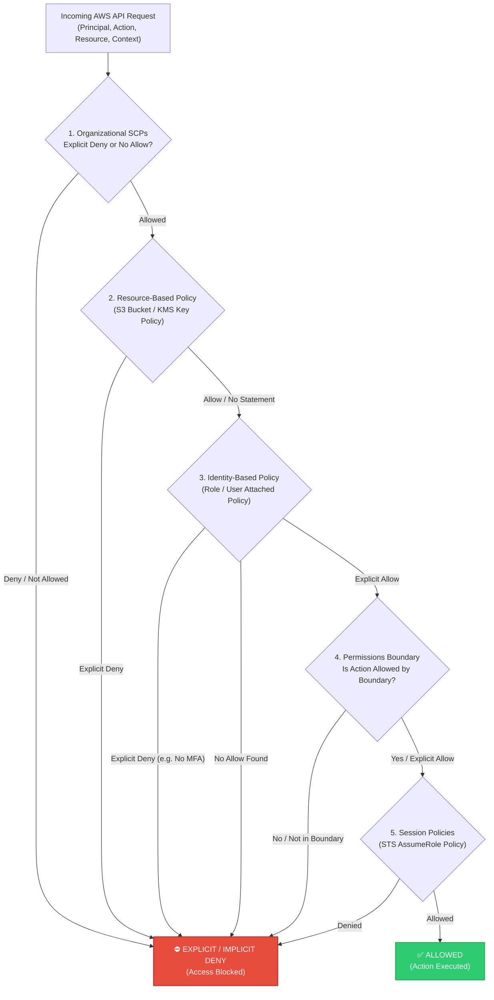
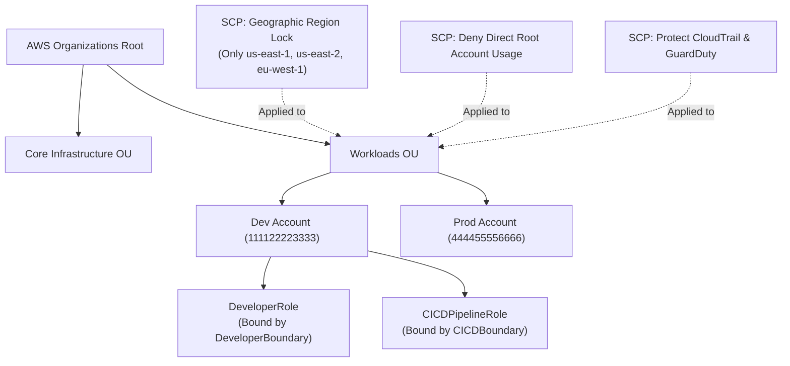
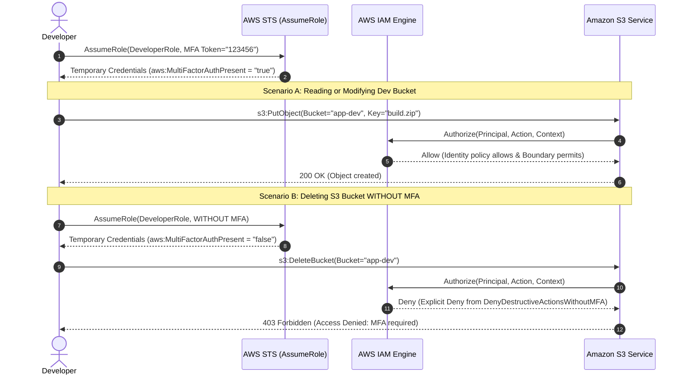

<!-- markdownlint-disable MD013 MD033 MD051 MD060 -->
# 01 - AWS IAM Least-Privilege & Role Boundaries

> A production-grade AWS Identity and Access Management (IAM) security framework implementing the **Principle of Least Privilege (PoLP)**, granular **Permissions Boundaries** to eliminate privilege escalation, **MFA-enforced role assumptions**, and organizational **Service Control Policies (SCPs)**, with a 100% offline deterministic Python IAM simulator and full Terraform / OpenTofu IaC manifests.

---

## 📋 Table of Contents

1. [Architectural Overview & Security Flow](#-architectural-overview--security-flow)
   - [IAM Policy Evaluation Logic](#iam-policy-evaluation-logic)
   - [Permissions Boundary Intersection Model](#permissions-boundary-intersection-model)
   - [Multi-Account Governance with SCPs](#multi-account-governance-with-scps)
   - [MFA-Enforced Action Flow](#mfa-enforced-action-flow)
2. [Theoretical Deep-Dive for Beginners](#-theoretical-deep-dive-for-beginners)
   - [What is AWS IAM?](#what-is-aws-iam)
   - [Structure of an IAM Policy](#structure-of-an-iam-policy)
   - [The Principle of Least Privilege (PoLP)](#the-principle-of-least-privilege-polp)
   - [Permissions Boundaries Explained](#permissions-boundaries-explained)
   - [Service Control Policies (SCPs) vs IAM Policies](#service-control-policies-scps-vs-iam-policies)
   - [Condition Keys & MFA Enforcement](#condition-keys--mfa-enforcement)
   - [Top IAM Privilege Escalation Vectors](#top-iam-privilege-escalation-vectors)
3. [Repository & Directory Structure](#-repository--directory-structure)
4. [Prerequisites & System Setup](#-prerequisites--system-setup)
5. [Quickstart Guide](#-quickstart-guide)
6. [Step-by-Step Hands-On Guide](#-step-by-step-hands-on-guide)
   - [Step 1: Inspect IAM JSON Policies](#step-1-inspect-iam-json-policies)
   - [Step 2: Run the Offline IAM Policy Evaluator](#step-2-run-the-offline-iam-policy-evaluator)
   - [Step 3: Run the Automated Security Test Suite](#step-3-run-the-automated-security-test-suite)
   - [Step 4: Provision Infrastructure with Terraform / OpenTofu](#step-4-provision-infrastructure-with-terraform--opentofu)
7. [Security Test Matrix & Verification](#-security-test-matrix--verification)
8. [Troubleshooting & Gotchas](#-troubleshooting--gotchas)
9. [Resource Teardown & Environment Cleanup](#-resource-teardown--environment-cleanup)

---

## 🏛️ Architectural Overview & Security Flow

AWS IAM evaluates permissions using a multi-layered decision engine. A request is only authorized if it passes through every security guardrail without triggering an explicit deny.

### IAM Policy Evaluation Logic



### Permissions Boundary Intersection Model

A **Permissions Boundary** establishes the maximum ceiling of permissions that an IAM identity can possess. The effective permission is the **intersection (AND)** between the identity-based policy and the boundary:

```text
  ┌─────────────────────────────────────────────────────────────┐
  │                 Attached Identity Policy                    │
  │   (e.g., AdministratorAccess: s3:*, ec2:*, iam:*, kms:*)    │
  │                                                             │
  │              ┌───────────────────────────────┐              │
  │              │     Permissions Boundary      │              │
  │              │  (Allowed: s3:*, ec2:*, kms:*)│              │
  │              │                               │              │
  │              │      ╔═════════════════╗      │              │
  │              │      ║    EFFECTIVE    ║      │              │
  │              │      ║   PERMISSIONS   ║      │              │
  │              │      ║ (s3:*, ec2:*)   ║      │              │
  │              │      ╚═════════════════╝      │              │
  │              │   ❌ iam:* BLOCKED            │              │
  │              └───────────────────────────────┘              │
  │                                                             │
  └─────────────────────────────────────────────────────────────┘
```

### Multi-Account Governance with SCPs

**Service Control Policies (SCPs)** enforce organization-wide guardrails across member accounts in AWS Organizations. Even the `root` account or administrators within a member account cannot bypass an SCP:



### MFA-Enforced Action Flow



---

## 🧠 Theoretical Deep-Dive for Beginners

### What is AWS IAM?

**AWS Identity and Access Management (IAM)** is a foundational cloud security service that controls authentication (who you are) and authorization (what you are allowed to do) across all AWS resources.

| Concept | Definition | Real-World Analogy |
| :--- | :--- | :--- |
| **Principal** | A person or application that makes an API request for an action on an AWS resource. | A person arriving at a secure office building. |
| **IAM User** | An identity with long-term credentials (password, access keys) representing a human or service. | An employee badge issued with a specific name. |
| **IAM Role** | An identity with temporary credentials assumed by users, applications, or AWS services. | A visitor badge or specialized technician vest worn only for specific duties. |
| **IAM Policy** | A JSON document explicitly declaring permissions (Allow/Deny). | The building access control rulebook. |
| **Permissions Boundary** | An advanced IAM policy that sets the maximum allowable permissions for a role or user. | The physical perimeter fence: you cannot go beyond it, regardless of what keys you carry. |
| **Service Control Policy (SCP)** | Organization-level JSON policy setting boundary limits across entire AWS accounts. | Government zoning laws that apply to all buildings in the district. |

---

### Structure of an IAM Policy

Every AWS IAM policy is structured around JSON statements composed of 5 core building blocks:

```json
{
  "Version": "2012-10-17",
  "Statement": [
    {
      "Sid": "AllowDeveloperS3DevAccess",
      "Effect": "Allow",
      "Action": [
        "s3:GetObject",
        "s3:PutObject"
      ],
      "Resource": [
        "arn:aws:s3:::company-app-dev/*"
      ],
      "Condition": {
        "Bool": {
          "aws:MultiFactorAuthPresent": "true"
        }
      }
    }
  ]
}
```

1. **`Version`**: Always set to `"2012-10-17"` (the current IAM policy language standard).
2. **`Sid` (Statement ID)**: An optional human-readable identifier describing the purpose of the statement.
3. **`Effect`**: Either `"Allow"` or `"Deny"`. Note that an explicit `"Deny"` **always overrides** any `"Allow"`.
4. **`Action`**: The specific AWS API operations permitted or forbidden (e.g. `s3:PutObject`, `ec2:DescribeInstances`). Wildcards (`*`) are supported.
5. **`Resource`**: The Amazon Resource Name (ARN) of the target resource (e.g. `arn:aws:s3:::my-bucket/*`).
6. **`Condition`**: Contextual constraints evaluated before granting access (e.g., source IP, MFA presence, current region, tags).

---

### The Principle of Least Privilege (PoLP)

The **Principle of Least Privilege** requires that every identity (developer, CI/CD runner, microservice) must only be granted the absolute minimum set of permissions necessary to perform its intended job function, and nothing more.

```text
❌ BAD: Over-Permissive Anti-Pattern
{
  "Effect": "Allow",
  "Action": "*",
  "Resource": "*"
}
💥 Risk: A compromised developer laptop or leaked CI/CD secret allows an attacker to
         delete databases, drop S3 buckets, and create rogue cryptomining instances!

✅ GOOD: Granular Least-Privilege Policy
{
  "Effect": "Allow",
  "Action": ["s3:GetObject", "s3:PutObject"],
  "Resource": "arn:aws:s3:::company-app-dev/*"
}
🛡️ Benefit: If compromised, the attacker can only read/write to the dev bucket.
           Production databases, IAM credentials, and KMS keys remain completely protected.
```

---

### Permissions Boundaries Explained

In modern DevOps teams, developers often need the ability to create IAM roles for their Lambda functions, ECS tasks, or CI/CD pipelines. However, granting developers `iam:CreateRole` and `iam:AttachRolePolicy` introduces a critical vulnerability: **Privilege Escalation**.

A malicious or compromised developer could create a new IAM role, attach `AdministratorAccess` to it, and assume the role to gain full control of the AWS account.

**How Permissions Boundaries solve this:**

1. The security administrator creates a **Permissions Boundary** (e.g. `DeveloperBoundary`).
2. The developer's IAM policy requires that **every role created by the developer must have the Permissions Boundary attached**:

   ```json
   {
     "Effect": "Allow",
     "Action": "iam:CreateRole",
     "Resource": "*",
     "Condition": {
       "StringEquals": {
         "iam:PermissionsBoundary": "arn:aws:iam::123456789012:policy/DeveloperBoundary"
       }
     }
   }
   ```

3. Even if the developer attaches `AdministratorAccess` (`*:*`) to the new role, the role can never execute permissions outside the boundary!

---

### Service Control Policies (SCPs) vs IAM Policies

| Feature | Service Control Policies (SCPs) | IAM Policies |
| :--- | :--- | :--- |
| **Scope** | Entire AWS Account, OU, or Organization | Specific IAM Role, User, or Group |
| **Location** | Defined in AWS Organizations management account | Defined within individual member accounts |
| **Root User Control** | **Restricts the Root account** | Cannot restrict the Root account |
| **Grants Permissions?** | **No** (Only defines the maximum allowable ceiling) | **Yes** (Grants actual API capabilities) |
| **Bypassable by Admin?** | **No** (Local account admins have no control over SCPs) | Yes (Local admins can modify local policies) |

---

### Condition Keys & MFA Enforcement

AWS IAM conditions provide dynamic context-based evaluation. The most critical condition key for human identities is `aws:MultiFactorAuthPresent`.

When enforced on destructive actions:

```json
{
  "Sid": "DenyDestructiveActionsWithoutMFA",
  "Effect": "Deny",
  "Action": [
    "s3:DeleteBucket",
    "s3:DeleteObject",
    "kms:ScheduleKeyDeletion",
    "ec2:TerminateInstances"
  ],
  "Resource": "*",
  "Condition": {
    "BoolIfExists": {
      "aws:MultiFactorAuthPresent": "false"
    }
  }
}
```

If an engineer's access key is leaked or stolen, the attacker cannot delete buckets, terminate EC2 instances, or schedule KMS key deletions because their session lacks the hardware/software TOTP MFA token.

---

### Top IAM Privilege Escalation Vectors

Understanding common attack vectors enables robust defense-in-depth:

1. **`iam:CreatePolicyVersion`**: Allows creating a new default policy version with `Effect: Allow, Action: *`.
2. **`iam:SetDefaultPolicyVersion`**: Switches an inactive permissive policy version to default.
3. **`iam:AttachUserPolicy` / `iam:AttachRolePolicy`**: Attaches managed admin policies to current user or role.
4. **`iam:PutUserPolicy` / `iam:PutRolePolicy`**: Injects inline admin policies.
5. **`iam:PassRole` + `lambda:CreateFunction` / `ec2:RunInstances`**: Passes a high-privilege IAM role to an EC2 instance or Lambda function and executes commands through that compute resource.

> [!IMPORTANT]
> The permissions boundaries in this project explicitly block all of the above privilege escalation vectors.

---

## 📂 Repository & Directory Structure

```text
07-cloud-providers/01-aws-iam-least-privilege-policies/
├── .gitignore                      # Ignores Terraform state, caches, logs, plans, and reports
├── .tflint.hcl                     # TFLint ruleset for AWS IAM and Terraform formatting
├── README.md                       # Comprehensive educational documentation (this file)
├── cleanup.sh                      # Automated teardown script for containers and cloud state
├── iam_policy_evaluator.py         # Pure Python IAM simulation engine & Boto3 test suite
├── main.tf                         # Terraform manifest provisioning S3, KMS, IAM roles & boundaries
├── outputs.tf                      # Terraform outputs exposing role ARNs, boundaries, and bucket IDs
├── terraform.tfvars.example        # Example variable values for customizable deployment
├── test_iam_policies.sh            # Automated bash validation & security test matrix runner
├── variables.tf                    # Configurable parameters (regions, naming prefix, tags)
├── versions.tf                     # Engine version constraints (Terraform >= 1.5, OpenTofu >= 1.6)
└── policies/                       # Curated library of production IAM JSON policies
    ├── identity-policies/
    │   ├── cicd-policy.json        # CI/CD deployment policy with artifact upload rights
    │   ├── developer-policy.json   # Dev policy granting dev S3/EC2/KMS with explicit prod deny
    │   ├── mfa-enforced-policy.json# Policy denying destructive actions without active MFA
    │   └── read-only-policy.json   # Broad auditor policy denying all mutating operations
    ├── permissions-boundaries/
    │   ├── cicd-boundary.json      # Boundary capping CI/CD actions to deployment scopes
    │   ├── developer-boundary.json # Boundary preventing developer privilege escalation & admin
    │   └── read-only-boundary.json # Boundary guaranteeing read-only ceiling regardless of policy
    ├── service-control-policies/
    │   ├── scp-deny-root-user.json # SCP blocking all direct API calls by root account
    │   ├── scp-protect-security-services.json # SCP preventing disabling CloudTrail/GuardDuty
    │   ├── scp-region-restriction.json       # SCP restricting actions to authorized AWS regions
    │   └── scp-require-imdsv2.json           # SCP enforcing EC2 IMDSv2 token usage
    └── trust-policies/
        ├── assume-role-cicd.json      # Trust policy for CI/CD runners & automation
        ├── assume-role-developer.json # Trust policy for developer role requiring MFA
        └── assume-role-read-only.json # Trust policy for read-only auditor role
```

---

## 🛠️ Prerequisites & System Setup

| Tool | Minimum Version | Purpose |
| :--- | :--- | :--- |
| **Python** | `3.9+` | Executes the deterministic offline IAM policy evaluator engine. |
| **Terraform** or **OpenTofu** | `>= 1.5.0` / `>= 1.6.0` | Provisions AWS IAM roles, boundaries, KMS keys, and S3 buckets. |
| **Docker** *(Optional)* | `20.10+` | Runs LocalStack emulator for optional live local testing. |
| **AWS CLI** *(Optional)* | `2.0+` | Used for interacting with real AWS Cloud or LocalStack endpoints. |

---

## 🚀 Quickstart Guide

Run the full security test suite locally in under **2 seconds** without needing AWS credentials or cloud infrastructure:

```bash
# Navigate to the project directory
cd 07-cloud-providers/01-aws-iam-least-privilege-policies

# Execute the automated security test suite
./test_iam_policies.sh
```

---

## 📖 Step-by-Step Hands-On Guide

### Step 1: Inspect IAM JSON Policies

Review the modular policies in `policies/` to understand how permissions boundaries, identity policies, and SCPs interact:

```bash
# View developer identity policy
cat policies/identity-policies/developer-policy.json

# View developer permissions boundary
cat policies/permissions-boundaries/developer-boundary.json

# View MFA enforcement policy
cat policies/identity-policies/mfa-enforced-policy.json

# View organizational region restriction SCP
cat policies/service-control-policies/scp-region-restriction.json
```

---

### Step 2: Run the Offline IAM Policy Evaluator

The `iam_policy_evaluator.py` script implements the exact AWS IAM authorization logic in Python, resolving explicit denies, identity permissions, boundary intersections, and condition keys:

```bash
# Run all 32 security test cases in offline mode
python3 iam_policy_evaluator.py --mode offline

# Run with verbose evaluation traces
python3 iam_policy_evaluator.py --mode offline --verbose

# Run only the developer role test suite
python3 iam_policy_evaluator.py --mode offline --suite developer

# Run only the permissions boundaries containment suite
python3 iam_policy_evaluator.py --mode offline --suite boundaries

# Run only the Service Control Policies (SCPs) suite
python3 iam_policy_evaluator.py --mode offline --suite scp

# Export structured JSON report
python3 iam_policy_evaluator.py --mode offline --json-output test_report.json
```

---

### Step 3: Run the Automated Security Test Suite

The `test_iam_policies.sh` test runner executes 5 distinct validation phases:

```bash
./test_iam_policies.sh
```

**What the test runner validates:**

1. **Tooling Prerequisites**: Confirms Python 3 and Terraform/OpenTofu availability.
2. **JSON Syntax & Linting**: Validates all 14 policy JSON documents for valid formatting.
3. **IaC Manifest Linting**: Checks Terraform syntax formatting and executes `terraform validate`.
4. **IAM Security Test Matrix**: Runs all 32 security test scenarios across Developer, Read-Only, CI/CD, MFA, Boundary, and SCP rules.
5. **Report Generation**: Outputs `test_report.json` with execution timestamps and results.

---

### Step 4: Provision Infrastructure with Terraform / OpenTofu

#### Option A: Local Testing with LocalStack

```bash
# 1. Start LocalStack container
docker run -d --name localstack-iam-demo \
    -p 4566:4566 \
    -e SERVICES=iam,sts,s3,kms,ec2 \
    localstack/localstack:latest

# 2. Initialize Terraform
terraform init -backend=false

# 3. Apply infrastructure against LocalStack
AWS_ACCESS_KEY_ID=mock_key \
AWS_SECRET_ACCESS_KEY=mock_secret \
AWS_DEFAULT_REGION=us-east-1 \
terraform apply -auto-approve \
    -var="aws_endpoint=http://127.0.0.1:4566" \
    -var="trusted_account_id=000000000000"
```

#### Option B: Deploying to Real AWS Cloud (Free Tier)

```bash
# 1. Configure AWS credentials
aws configure

# 2. Initialize Terraform
terraform init

# 3. Create speculative plan
terraform plan -out=tfplan

# 4. Apply changes
terraform apply tfplan
```

---

## 🧪 Security Test Matrix & Verification

The test suite validates 32 discrete security assertions across 5 core security suites:

| Suite | Test ID | Target Principal | Action | Resource | Context | Expected | Security Rationale |
| :--- | :--- | :--- | :--- | :--- | :--- | :--- | :--- |
| **Developer** | `DEV-01` | `DeveloperRole` | `s3:PutObject` | `*-dev/*` | MFA: Yes | `ALLOWED` | Devs can write to dev buckets |
| **Developer** | `DEV-02` | `DeveloperRole` | `s3:GetObject` | `*-dev/*` | MFA: Yes | `ALLOWED` | Devs can read dev bucket objects |
| **Developer** | `DEV-03` | `DeveloperRole` | `s3:PutObject` | `*-prod/*` | MFA: Yes | `DENIED` | Explicit Deny protects prod data |
| **Developer** | `DEV-04` | `DeveloperRole` | `s3:DeleteObject` | `*-dev/*` | MFA: **No** | `DENIED` | Deletion blocked without MFA |
| **Developer** | `DEV-05` | `DeveloperRole` | `s3:DeleteObject` | `*-dev/*` | MFA: **Yes** | `ALLOWED` | Deletion permitted when MFA active |
| **Developer** | `DEV-06` | `DeveloperRole` | `s3:DeleteBucket` | `*-dev` | MFA: **No** | `DENIED` | Bucket destruction blocked without MFA |
| **Developer** | `DEV-07` | `DeveloperRole` | `ec2:DescribeInstances` | `*` | Any | `ALLOWED` | Read EC2 instance metadata |
| **Developer** | `DEV-08` | `DeveloperRole` | `ec2:TerminateInstances` | `*` | MFA: **No** | `DENIED` | Terminate blocked without MFA |
| **Developer** | `DEV-09` | `DeveloperRole` | `kms:Encrypt` | KMS CMK | Same Acct | `ALLOWED` | Cryptographic ops with CMK |
| **Developer** | `DEV-10` | `DeveloperRole` | `kms:ScheduleKeyDeletion` | KMS CMK | MFA: **No** | `DENIED` | Key deletion blocked without MFA |
| **Read-Only** | `RO-01` | `ReadOnlyRole` | `ec2:DescribeInstances` | `*` | Any | `ALLOWED` | Describe EC2 instances |
| **Read-Only** | `RO-02` | `ReadOnlyRole` | `s3:ListBucket` | `*-prod` | Any | `ALLOWED` | List bucket metadata |
| **Read-Only** | `RO-03` | `ReadOnlyRole` | `kms:DescribeKey` | KMS CMK | Any | `ALLOWED` | View KMS key metadata |
| **Read-Only** | `RO-04` | `ReadOnlyRole` | `s3:PutObject` | `*-dev/*` | Any | `DENIED` | Explicit Deny blocks all writes |
| **Read-Only** | `RO-05` | `ReadOnlyRole` | `ec2:RunInstances` | `*` | Any | `DENIED` | Explicit Deny blocks instance launch |
| **Read-Only** | `RO-06` | `ReadOnlyRole` | `iam:CreateUser` | `*` | Any | `DENIED` | Explicit Deny blocks IAM changes |
| **CI/CD** | `CICD-01` | `CICDPipelineRole` | `s3:PutObject` | `*-artifacts/*` | Any | `ALLOWED` | Publish build artifacts |
| **CI/CD** | `CICD-02` | `CICDPipelineRole` | `kms:Encrypt` | KMS CMK | Any | `ALLOWED` | Encrypt release artifacts |
| **CI/CD** | `CICD-03` | `CICDPipelineRole` | `ecr:PutImage` | ECR Repo | Any | `ALLOWED` | Push container images |
| **CI/CD** | `CICD-04` | `CICDPipelineRole` | `iam:CreatePolicy` | `*` | Any | `DENIED` | Block pipeline from modifying IAM |
| **CI/CD** | `CICD-05` | `CICDPipelineRole` | `iam:AttachRolePolicy` | `*` | Any | `DENIED` | Prevent privilege escalation |
| **CI/CD** | `CICD-06` | `CICDPipelineRole` | `s3:DeleteBucket` | `*` | Any | `DENIED` | Block bucket destruction |
| **Boundaries** | `BND-01` | `DeveloperRole` | `iam:CreateUser` | `*` | Any | `DENIED` | Boundary prevents IAM user creation |
| **Boundaries** | `BND-02` | `DeveloperRole` | `iam:DeletePermissionsBoundary` | `*` | Any | `DENIED` | Boundary blocks removing itself |
| **Boundaries** | `BND-03` | `DeveloperRole` | `cloudtrail:StopLogging` | `*` | Any | `DENIED` | Boundary protects audit trail |
| **Boundaries** | `BND-04` | `DeveloperRole` | `billing:*` | `*` | Any | `DENIED` | Boundary blocks billing modifications |
| **SCPs** | `SCP-01` | `DeveloperRole` | `s3:PutObject` | `*-dev/*` | Region: `us-east-1` | `ALLOWED` | Approved compliance region |
| **SCPs** | `SCP-02` | `DeveloperRole` | `s3:PutObject` | `*-dev/*` | Region: `ap-southeast-1` | `DENIED` | Unapproved region blocked by SCP |
| **SCPs** | `SCP-03` | `DeveloperRole` | `iam:ListUsers` | `*` | Region: `ap-southeast-1` | `DENIED` | Global IAM service exempted from region SCP |
| **SCPs** | `SCP-04` | `AnyPrincipal` | `cloudtrail:DeleteTrail` | `*` | Any | `DENIED` | SCP protects CloudTrail across account |
| **SCPs** | `SCP-05` | `AnyPrincipal` | `guardduty:DeleteDetector` | `*` | Any | `DENIED` | SCP protects GuardDuty monitoring |
| **SCPs** | `SCP-06` | `RootUser` | `ec2:RunInstances` | `*` | Root Principal | `DENIED` | SCP enforces SSO / denies root user |

---

## 🔧 Troubleshooting & Gotchas

### 1. "Default Deny (no identity policy granted permission)"

- **Cause**: By default in AWS IAM, all actions are implicitly denied until an explicit `Allow` statement matches the action, resource, and conditions.
- **Solution**: Check that the action name matches AWS casing (e.g. `s3:PutObject`, not `s3:putobject`) and that the resource ARN pattern includes the expected wildcard (e.g. `arn:aws:s3:::bucket-name/*`).

### 2. "Action is allowed by Identity Policy but blocked by Permissions Boundary"

- **Cause**: The identity policy grants the action, but the role's attached Permissions Boundary does not include the action in its `Allow` statement or contains an explicit `Deny`.
- **Solution**: Ensure that any action intended for the role is included in both the attached IAM policy and the Permissions Boundary policy document.

### 3. "MFA Condition Failed on S3 Deletion"

- **Cause**: An explicit deny statement in `mfa-enforced-policy.json` checks `BoolIfExists: { "aws:MultiFactorAuthPresent": "false" }`. If an STS session was created without an MFA token, destructive operations are rejected with HTTP 403.
- **Solution**: When assuming the role via AWS CLI, provide the `--serial-number` and `--token-code` arguments:

  ```bash
  aws sts assume-role \
      --role-arn "arn:aws:iam::123456789012:role/iam-least-privilege-developer-role" \
      --role-session-name "dev-session" \
      --serial-number "arn:aws:iam::123456789012:mfa/username" \
      --token-code "123456"
  ```

---

## 🧹 Resource Teardown & Environment Cleanup

To ensure that no stray Docker containers, images, volumes, or Terraform state files remain on your system, execute the standalone `cleanup.sh` script:

### Basic Cleanup (Standard)

Destroys provisioned cloud/emulator resources, stops and removes the LocalStack container, and deletes temporary logs and Python caches:

```bash
./cleanup.sh
```

### Complete Purge (Leaves 100% Clean Workspace)

Destroys all resources and purges `.terraform/`, `.terraform.lock.hcl`, and `terraform.tfstate`:

```bash
./cleanup.sh --all
```

### Removing Docker Images

To also remove the LocalStack Docker image from your machine:

```bash
./cleanup.sh --all --prune-images
```

---

### Verification of Clean State

After running `./cleanup.sh --all`, verify that no dangling processes or containers remain:

```bash
# Check Docker containers
docker ps -a --filter "name=localstack-iam-demo"

# Check directory cleanliness
git status
```

Your environment is now completely clean and ready for the next mini-project! 🚀
