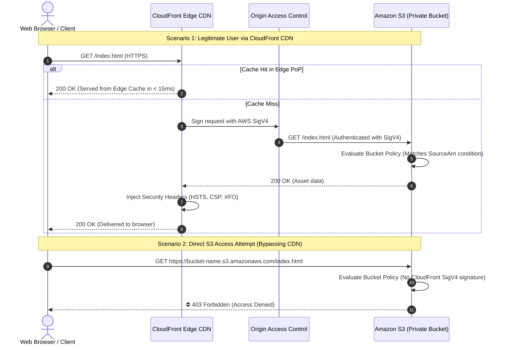
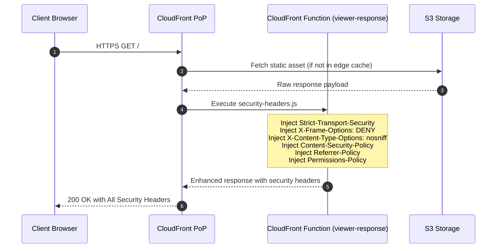
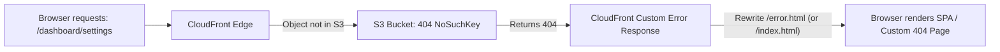

<!-- markdownlint-disable MD013 MD033 MD051 MD060 -->
# 02 - Secure Static Web Hosting with S3 and CloudFront

> A production-grade, highly secure static web hosting architecture combining **Amazon S3 private storage**, **CloudFront Content Delivery Network (CDN)**, **Origin Access Control (OAC)**, automated **sub-millisecond Edge Security Headers** via CloudFront Functions, and automated security audit test suites with 100% offline mock server support.

---

## 📋 Table of Contents

1. [Architectural Overview & Data Flow](#-architectural-overview--data-flow)
   - [CDN & Origin Access Control Architecture](#cdn--origin-access-control-architecture)
   - [Request Authorization & 403 Direct Block Flow](#request-authorization--403-direct-block-flow)
   - [Edge Security Header Injection Sequence](#edge-security-header-injection-sequence)
   - [Single-Page Application (SPA) Error Routing](#single-page-application-spa-error-routing)
2. [Theoretical Deep-Dive for Beginners](#-theoretical-deep-dive-for-beginners)
   - [Why Public S3 Buckets are a Security Anti-Pattern](#why-public-s3-buckets-are-a-security-anti-pattern)
   - [Origin Access Identity (OAI) vs Origin Access Control (OAC)](#origin-access-identity-oai-vs-origin-access-control-oac)
   - [The 7 Critical HTTP Security Headers Explained](#the-7-critical-http-security-headers-explained)
   - [CloudFront Functions vs Lambda@Edge](#cloudfront-functions-vs-lambdaedge)
   - [Caching & TTL Strategy for Single-Page Apps (SPAs)](#caching--ttl-strategy-for-single-page-apps-spas)
3. [Repository & Directory Structure](#-repository--directory-structure)
4. [Prerequisites & Tooling](#-prerequisites--tooling)
5. [Quickstart Guide](#-quickstart-guide)
6. [Step-by-Step Hands-On Guide](#-step-by-step-hands-on-guide)
   - [Step 1: Inspect Static Web Application Assets](#step-1-inspect-static-web-application-assets)
   - [Step 2: Inspect the CloudFront Security Function](#step-2-inspect-the-cloudfront-security-function)
   - [Step 3: Run the Local Offline Security Audit](#step-3-run-the-local-offline-security-audit)
   - [Step 4: Provision Cloud Infrastructure with Terraform](#step-4-provision-cloud-infrastructure-with-terraform)
   - [Step 5: Run Live CloudFront Security Verification](#step-5-run-live-cloudfront-security-verification)
7. [Security & Compliance Verification Matrix](#-security--compliance-verification-matrix)
8. [Troubleshooting & Gotchas](#-troubleshooting--gotchas)
9. [Resource Teardown & Environment Cleanup](#-resource-teardown--environment-cleanup)

---

## 🏛️ Architectural Overview & Data Flow

Traditional static website hosting directly from public S3 buckets exposes infrastructure to distributed denial-of-service (DDoS) attacks, lacks modern TLS cipher configuration, and cannot inject defensive HTTP headers. This project implements modern edge architecture utilizing **Amazon CloudFront** and **AWS Origin Access Control (OAC)**:

### CDN & Origin Access Control Architecture

```mermaid
flowchart TD
    subgraph Clients ["Public Internet"]
        USER["HTTPS Client / Web Browser"]
        ATTACKER["Malicious Actor / Scanner"]
    end

    subgraph AWS_Edge ["AWS Global Edge Network (CloudFront)"]
        CF_DIST["CloudFront Distribution<br/>(TLS 1.3 + Gzip/Brotli)"]
        CF_FUNC["CloudFront Function<br/>(viewer-response)<br/>Security Headers Injector"]
        OAC["Origin Access Control (OAC)<br/>(AWS SigV4 Signing)"]
    end

    subgraph AWS_Origin ["AWS Private Storage Layer"]
        S3_BUCKET["Private S3 Bucket<br/>(SSE-S3 AES-256)<br/>Public Access: BLOCKED"]
        S3_POLICY["S3 Bucket Policy<br/>(Condition: AWS:SourceArn = CF_ARN)"]
    end

    USER -- "1. HTTPS GET /index.html" --> CF_DIST
    CF_DIST -- "2. Cache Miss -> SigV4 Sign" --> OAC
    OAC -- "3. Authenticated Origin Request" --> S3_POLICY
    S3_POLICY --> S3_BUCKET
    S3_BUCKET -- "4. Raw HTML / Static Assets" --> CF_DIST
    CF_DIST -- "5. Trigger viewer-response" --> CF_FUNC
    CF_FUNC -- "6. Injects HSTS, CSP, XFO" --> CF_DIST
    CF_DIST -- "7. Encrypted Response + Headers" --> USER

    ATTACKER -. "Direct HTTP/HTTPS GET" .-> S3_BUCKET
    S3_BUCKET -- "⛔ 403 Forbidden (Blocked by Bucket Policy)" .-> ATTACKER

    style CF_DIST fill:#0284c7,stroke:#0369a1,stroke-width:2px,color:#fff
    style S3_BUCKET fill:#10b981,stroke:#059669,stroke-width:2px,color:#fff
    style CF_FUNC fill:#818cf8,stroke:#6366f1,stroke-width:2px,color:#fff
```

### Request Authorization & 403 Direct Block Flow



### Edge Security Header Injection Sequence



### Single-Page Application (SPA) Error Routing



---

## 🧠 Theoretical Deep-Dive for Beginners

### Why Public S3 Buckets are a Security Anti-Pattern

When AWS introduced Amazon S3 website hosting, buckets had to be configured with public read access (`"Principal": "*"`). While simple, this architecture introduces major production risks:

| Security Risk | S3 Direct Public Hosting | S3 + CloudFront + OAC (This Project) |
| :--- | :--- | :--- |
| **Public Exposure** | S3 bucket is open to the entire internet. Anyone can scan or scrape it. | **100% Private**. All public access blocks enabled. Direct S3 access returns `403 Forbidden`. |
| **Custom TLS / HTTPS** | Only supports `http://` or default `*.s3-website.amazonaws.com`. No custom TLS certs. | **Full TLS 1.3 support** via AWS Certificate Manager (ACM) on custom domains. |
| **DDoS Protection** | Vulnerable to direct S3 GET flood attacks leading to massive AWS billing spikes. | **AWS Shield Standard** and CloudFront edge caching absorb traffic before hitting S3. |
| **Security Headers** | S3 cannot dynamically inject HTTP security headers. | **CloudFront Functions** inject HSTS, CSP, and X-Frame-Options on every response. |
| **Latency & Performance** | Requests travel to a single AWS region (e.g. `us-east-1`). | Content cached across **450+ global edge Points of Presence (PoPs)**. |

---

### Origin Access Identity (OAI) vs Origin Access Control (OAC)

In 2022, AWS released **Origin Access Control (OAC)** to replace the legacy **Origin Access Identity (OAI)** mechanism:

```text
Feature Comparison:
─────────────────────────────────────────────────────────────────────────────
Feature                      Origin Access Identity (OAI)   Origin Access Control (OAC)
─────────────────────────────────────────────────────────────────────────────
Authentication Protocol      Legacy Custom Auth             AWS Signature Version 4 (SigV4)
AWS KMS Key Support (SSE)    ❌ Unsupported                ✅ Fully Supported
All AWS Regions              ❌ Limited in newer regions    ✅ Supported across all regions
HTTP Methods Supported       GET, HEAD                      GET, HEAD, POST, PUT, PATCH, DELETE
Security Model               Legacy XML principal           Modern IAM condition (AWS:SourceArn)
─────────────────────────────────────────────────────────────────────────────
```

> [!IMPORTANT]
> This project uses **Origin Access Control (OAC)** with `aws_cloudfront_origin_access_control`, guaranteeing compatibility with Server-Side Encryption (SSE-S3 / SSE-KMS) and strict IAM condition enforcement.

---

### The 7 Critical HTTP Security Headers Explained

HTTP Security Headers instruct client web browsers how to handle content and defend against common client-side attack vectors:

#### 1. `Strict-Transport-Security` (HSTS)

- **Value**: `max-age=63072000; includeSubDomains; preload`
- **Purpose**: Forces browsers to communicate exclusively over HTTPS for the next 2 years (`63,072,000` seconds).
- **Prevents**: SSL Stripping and Man-In-The-Middle (MITM) downgrade attacks.

#### 2. `X-Frame-Options`

- **Value**: `DENY`
- **Purpose**: Prohibits the website from being embedded inside an `<iframe>`, `<frame>`, or `<object>`.
- **Prevents**: **Clickjacking attacks**, where an attacker overlays transparent malicious buttons over your legitimate site.

#### 3. `X-Content-Type-Options`

- **Value**: `nosniff`
- **Purpose**: Forces the browser to strictly respect the declared `Content-Type` header instead of guessing (MIME sniffing).
- **Prevents**: Executable script injection disguised as image or text files.

#### 4. `Content-Security-Policy` (CSP)

- **Value**: `default-src 'self'; script-src 'self'; style-src 'self' 'unsafe-inline'; img-src 'self' data:;`
- **Purpose**: Defines an explicit whitelist of authorized sources from which scripts, styles, and images can load.
- **Prevents**: **Cross-Site Scripting (XSS)** and unauthorized third-party script injection.

#### 5. `Referrer-Policy`

- **Value**: `strict-origin-when-cross-origin`
- **Purpose**: Sends the full URL as a referrer for same-origin requests, but only sends the domain origin for cross-origin HTTPS requests.
- **Prevents**: Sensitive URL tokens, session IDs, or private paths from leaking to external websites.

#### 6. `Permissions-Policy`

- **Value**: `camera=(), microphone=(), geolocation=()`
- **Purpose**: Completely disables browser access to sensitive hardware sensors and APIs.
- **Prevents**: Rogue third-party dependencies from activating the user's camera, microphone, or tracking location.

#### 7. `X-XSS-Protection`

- **Value**: `1; mode=block`
- **Purpose**: Enables the browser's built-in XSS filter and blocks page rendering if an attack is detected (for legacy browsers).

---

### CloudFront Functions vs Lambda@Edge

| Dimension | CloudFront Functions (Used in this project) | Lambda@Edge |
| :--- | :--- | :--- |
| **Execution Location** | CloudFront Edge PoP (450+ locations) | Regional Edge Caches (13 locations) |
| **Execution Latency** | **Sub-millisecond (< 1ms)** | 10 – 50 ms |
| **Event Triggers** | `viewer-request`, `viewer-response` | `viewer-request`, `origin-request`, `origin-response`, `viewer-response` |
| **Runtime** | JavaScript (`cloudfront-js-2.0`) | Node.js, Python |
| **Maximum Execution Time** | 10 milliseconds | 5 seconds (viewer), 30 seconds (origin) |
| **Cost** | **1/6th the cost of Lambda@Edge** | Higher cost per million invocations |
| **Best Use Case** | Header manipulation, URL rewrites, token validation | Heavy compute, database calls, external API lookups |

---

### Caching & TTL Strategy for Single-Page Apps (SPAs)

Single-Page Applications (React, Vue, Vanilla SPA) have unique caching requirements:

```text
┌─────────────────────────┬──────────────────────────────────┬───────────────────────────────────────┐
│ Asset Type              │ Cache-Control Header             │ Strategy Rationale                    │
├─────────────────────────┼──────────────────────────────────┼───────────────────────────────────────┤
│ index.html              │ max-age=0, must-revalidate       │ Ensures clients always fetch latest   │
│                         │                                  │ release without stale index caching.  │
├─────────────────────────┼──────────────────────────────────┼───────────────────────────────────────┤
│ Static Assets           │ max-age=31536000, immutable      │ Cached indefinitely in browser and    │
│ (css/styles.css, *.js)  │                                  │ CDN edge. Fast instant loads.         │
└─────────────────────────┴──────────────────────────────────┴───────────────────────────────────────┘
```

When deploying a new version, update the static asset hashes and execute a CloudFront cache invalidation:

```bash
aws cloudfront create-invalidation --distribution-id <ID> --paths "/*"
```

---

## 📂 Repository & Directory Structure

```text
07-cloud-providers/02-s3-cloudfront-static-hosting/
├── .gitignore                      # Excludes Terraform state, plans, caches, and test logs
├── .tflint.hcl                     # TFLint configuration for AWS S3 and CloudFront rules
├── README.md                       # Comprehensive educational documentation (this file)
├── cleanup.sh                      # Teardown script destroying cloud resources & purging state
├── main.tf                         # Terraform manifest provisioning S3, OAC, CloudFront & objects
├── outputs.tf                      # Outputs exposing CloudFront URL, S3 direct URL, and OAC IDs
├── terraform.tfvars.example        # Example variable configuration file
├── test_static_hosting.sh          # Automated test runner validating assets, IaC, and security
├── variables.tf                    # Input variable definitions (regions, naming, pricing tiers)
├── verify_cdn_security.sh          # Automated security header and origin isolation audit tool
├── functions/                      # CloudFront edge functions
│   └── security-headers.js         # JavaScript function injecting HSTS, CSP, and XFO headers
└── website/                        # Production static web application
    ├── error.html                  # Custom branded 404/403 error page
    ├── index.html                  # Responsive HTML5 SPA with audit & latency widgets
    ├── css/
    │   └── styles.css              # Vanilla CSS design system with dark/light themes
    └── js/
        └── app.js                  # Client-side header verification & benchmark simulator
```

---

## 🛠️ Prerequisites & Tooling

| Tool | Minimum Version | Purpose |
| :--- | :--- | :--- |
| **cURL** | `7.0+` | Executes HTTP/HTTPS requests and extracts response headers. |
| **Python** | `3.9+` | Runs the local offline mock CDN test server for 100% offline verification. |
| **Terraform** or **OpenTofu** | `>= 1.5.0` / `>= 1.6.0` | Provisions AWS S3, OAC, CloudFront, and uploads web assets. |
| **AWS CLI** *(Optional)* | `2.0+` | Interacts with live AWS Cloud deployments and executes cache invalidations. |

---

## 🚀 Quickstart Guide

Validate the entire project, web assets, and security headers in **under 2 seconds** (100% offline, zero cloud credentials needed):

```bash
# Navigate to the project directory
cd 07-cloud-providers/02-s3-cloudfront-static-hosting

# Run the automated test runner
./test_static_hosting.sh
```

---

## 📖 Step-by-Step Hands-On Guide

### Step 1: Inspect Static Web Application Assets

Review the frontend assets located in `website/`:

```bash
# Inspect the main application page
cat website/index.html

# Inspect the modern design system stylesheet
cat website/css/styles.css

# Inspect the client-side JavaScript logic
cat website/js/app.js

# Inspect the custom error page
cat website/error.html
```

---

### Step 2: Inspect the CloudFront Security Function

Examine `functions/security-headers.js` to see how CloudFront injects security headers:

```bash
cat functions/security-headers.js
```

---

### Step 3: Run the Local Offline Security Audit

The `verify_cdn_security.sh` script includes a built-in Python mock server simulating CloudFront edge behavior and S3 OAC protection:

```bash
# Run security audit in offline mock mode
./verify_cdn_security.sh --mock

# Run with verbose header inspection logs
./verify_cdn_security.sh --mock --verbose

# Export audit findings to JSON
./verify_cdn_security.sh --mock --json-output test_report.json
```

---

### Step 4: Provision Cloud Infrastructure with Terraform

Deploy the infrastructure to your AWS account (eligible for AWS Free Tier: S3 + CloudFront 1TB/month data transfer):

```bash
# 1. Initialize Terraform
terraform init

# 2. Review the execution plan
terraform plan

# 3. Apply changes to provision S3, OAC, and CloudFront
terraform apply -auto-approve
```

> [!NOTE]
> CloudFront global distribution deployment typically takes **3 to 5 minutes** to propagate across all edge Points of Presence.

---

### Step 5: Run Live CloudFront Security Verification

Once deployed, audit your live AWS CloudFront distribution:

```bash
# Fetch the provisioned CloudFront URL and S3 direct URL
CF_URL=$(terraform output -raw cloudfront_url)
S3_URL=$(terraform output -raw s3_direct_url)

# Run the security audit against your live AWS endpoints
./verify_cdn_security.sh --url="$CF_URL" --s3-url="$S3_URL" --verbose
```

---

## 🧪 Security & Compliance Verification Matrix

The audit test runner asserts 11 key security and performance requirements:

| Test ID | Category | Target Endpoint | Evaluation Rule | Expected Status | Security Purpose |
| :--- | :--- | :--- | :--- | :--- | :--- |
| `CDN-01` | **Availability** | `GET /` | Returns `HTTP 200 OK` | `PASS` | Confirms website is served via CDN edge. |
| `CDN-02` | **Error Routing** | `GET /not-found` | Returns `HTTP 404` with custom page | `PASS` | Validates custom error response handling. |
| `OAC-01` | **Isolation** | `GET https://s3...` | Returns `HTTP 403 Forbidden` | `PASS` | Confirms S3 bucket is 100% private and protected. |
| `SEC-01` | **Encryption** | `Strict-Transport-Security` | `max-age >= 31536000; includeSubDomains` | `PASS` | Enforces HTTPS and prevents SSL stripping. |
| `SEC-02` | **Clickjacking** | `X-Frame-Options` | `DENY` or `SAMEORIGIN` | `PASS` | Prevents framing and UI redressing attacks. |
| `SEC-03` | **MIME Sniffing** | `X-Content-Type-Options`| `nosniff` | `PASS` | Blocks browser MIME confusion exploits. |
| `SEC-04` | **XSS Defense** | `Content-Security-Policy` | Contains `default-src 'self'` | `PASS` | Blocks unauthorized third-party scripts. |
| `SEC-05` | **Privacy** | `Referrer-Policy` | `strict-origin-when-cross-origin` | `PASS` | Protects sensitive URL paths from leaking. |
| `SEC-06` | **Hardware APIs** | `Permissions-Policy` | Restricts `camera`, `microphone`, `geo` | `PASS` | Disables browser hardware sensor access. |
| `SEC-07` | **Legacy XSS** | `X-XSS-Protection` | `1; mode=block` | `PASS` | Filters reflected XSS in older browsers. |
| `PRF-01` | **Performance** | `Cache-Control` | `max-age=0` (HTML) / `immutable` (CSS/JS)| `PASS` | Prevents stale SPA caching while speeding assets. |

---

## 🔧 Troubleshooting & Gotchas

### 1. "Direct S3 access returns 404 instead of 403"

- **Cause**: In Amazon S3, requesting a non-existent object in a private bucket returns `403 AccessDenied` (to prevent leaking whether an object exists), whereas a public bucket returns `404 NoSuchKey`.
- **Solution**: Ensure your S3 bucket policy strictly matches `aws_cloudfront_distribution.cdn.arn` in the `AWS:SourceArn` condition.

### 2. "CloudFront returns 403 Forbidden after applying Terraform"

- **Cause**: CloudFront OAC takes 1–2 minutes to establish SigV4 credentials with regional S3 endpoints, or the bucket policy has not yet propagated.
- **Solution**: Wait 60 seconds and re-request the CloudFront domain. Verify that `aws_s3_bucket_policy` has finished applying.

### 3. "Custom changes to `index.html` are not appearing"

- **Cause**: CloudFront edge caches retain assets until the TTL expires or a cache invalidation is executed.
- **Solution**: Run a cache invalidation:

  ```bash
  aws cloudfront create-invalidation \
      --distribution-id $(terraform output -raw cloudfront_distribution_id) \
      --paths "/*"
  ```

---

## 🧹 Resource Teardown & Environment Cleanup

To ensure that no stray Docker containers, temporary files, or AWS Cloud resources remain, execute the standalone `cleanup.sh` script:

### Basic Cleanup (Standard)

Terminates local mock test processes and cleans temporary logs and test reports:

```bash
./cleanup.sh
```

### Complete Cloud Teardown & State Purge

Destroys all provisioned S3 buckets, CloudFront distributions, and purges `.terraform/`, `.terraform.lock.hcl`, and `terraform.tfstate`:

```bash
./cleanup.sh --all
```

---

### Verification of Clean State

Verify that your workspace is completely clean:

```bash
# Verify no background mock processes remain
pgrep -f "MockCDNHandler" || echo "No mock processes running."
```

Your environment is now completely clean and ready for the next mini-project! 🚀
