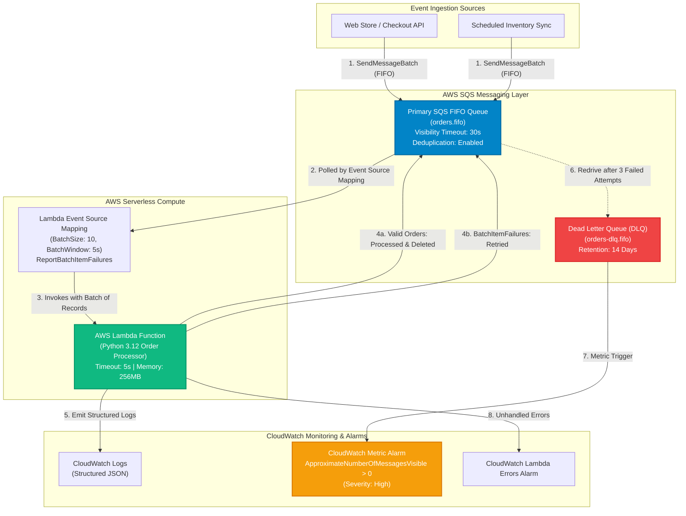
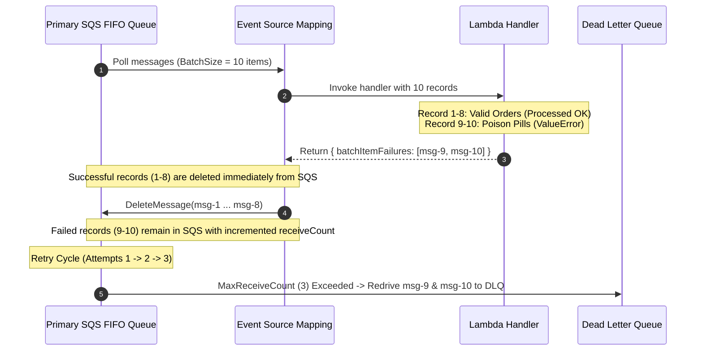
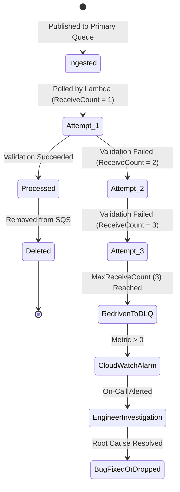

<!-- markdownlint-disable MD013 MD033 MD051 MD060 -->
# 03 - Event-Driven Serverless Pipeline with Lambda and SQS

> A resilient, high-throughput asynchronous event processing pipeline built on **AWS SQS FIFO queues**, **AWS Lambda (Python 3.12)** with granular partial batch failure reporting (`ReportBatchItemFailures`), **Dead Letter Queues (DLQ)** with automatic retry redrive policies (`maxReceiveCount = 3`), and proactive **CloudWatch metric alarms**, complete with a 100% offline deterministic test simulator and full Terraform / OpenTofu IaC manifests.

---

## 📋 Table of Contents

1. [Architectural Overview & Data Flow](#-architectural-overview--data-flow)
   - [Pipeline Architecture](#pipeline-architecture)
   - [SQS FIFO Batching & Partial Failure Handling](#sqs-fifo-batching--partial-failure-handling)
   - [Poison Pill Retry & DLQ Redrive Lifecycle](#poison-pill-retry--dlq-redrive-lifecycle)
   - [CloudWatch Alarm & Observability Flow](#cloudwatch-alarm--observability-flow)
2. [Theoretical Deep-Dive for Beginners](#-theoretical-deep-dive-for-beginners)
   - [Synchronous Request-Reply vs Asynchronous Event-Driven Architectures](#synchronous-request-reply-vs-asynchronous-event-driven-architectures)
   - [SQS Standard vs SQS FIFO Queues](#sqs-standard-vs-sqs-fifo-queues)
   - [The SQS Visibility Timeout vs Lambda Timeout Rule (The 6x Best Practice)](#the-sqs-visibility-timeout-vs-lambda-timeout-rule-the-6x-best-practice)
   - [Partial Batch Failures & `ReportBatchItemFailures`](#partial-batch-failures--reportbatchitemfailures)
   - [Dead Letter Queues (DLQ) & Poison Pill Mitigation](#dead-letter-queues-dlq--poison-pill-mitigation)
   - [Serverless Observability & CloudWatch Metrics](#serverless-observability--cloudwatch-metrics)
3. [Repository & Directory Structure](#-repository--directory-structure)
4. [Prerequisites & Tooling](#-prerequisites--tooling)
5. [Quickstart Guide](#-quickstart-guide)
6. [Step-by-Step Hands-On Guide](#-step-by-step-hands-on-guide)
   - [Step 1: Inspect the Lambda Handler & Order Validation Logic](#step-1-inspect-the-lambda-handler--order-validation-logic)
   - [Step 2: Run the Offline Serverless Pipeline Simulation](#step-2-run-the-offline-serverless-pipeline-simulation)
   - [Step 3: Run the Automated Validation Suite](#step-3-run-the-automated-validation-suite)
   - [Step 4: Provision Cloud Infrastructure with Terraform](#step-4-provision-cloud-infrastructure-with-terraform)
   - [Step 5: Publish Live Test Workload & Inspect CloudWatch Metrics](#step-5-publish-live-test-workload--inspect-cloudwatch-metrics)
7. [Security & Resilience Verification Matrix](#-security--resilience-verification-matrix)
8. [Troubleshooting & Gotchas](#-troubleshooting--gotchas)
9. [Resource Teardown & Environment Cleanup](#-resource-teardown--environment-cleanup)

---

## 🏛️ Architectural Overview & Data Flow

Modern cloud applications decouple order ingestion from background processing using asynchronous event queues. This project implements a reliable event-driven pipeline capable of processing high-volume e-commerce transactions while isolating malformed ("poison pill") payloads:

### Pipeline Architecture



### SQS FIFO Batching & Partial Failure Handling



### Poison Pill Retry & DLQ Redrive Lifecycle



---

## 🧠 Theoretical Deep-Dive for Beginners

### Synchronous Request-Reply vs Asynchronous Event-Driven Architectures

In a traditional synchronous REST architecture, service A directly calls service B over HTTP:

```text
❌ SYNCHRONOUS TIGHT COUPLING (Fragile):
[Client] ──HTTP POST──> [Order API] ──HTTP POST──> [Payment Gateway] ──HTTP POST──> [Inventory Service]
💥 Failure Risk: If the Inventory Service is slow or down, the entire user checkout crashes!

✅ ASYNCHRONOUS EVENT-DRIVEN DECOUPLING (Resilient):
[Client] ──> [Order API] ──> [SQS FIFO Queue] ──> [Lambda Processor] ──> [Database / Inventory]
                                  │ (Buffer)
                                  ▼
                        [Dead Letter Queue] (Isolates Poison Pills)
🛡️ Benefit: If the downstream service is busy, messages safely buffer in SQS without data loss.
```

---

### SQS Standard vs SQS FIFO Queues

Amazon Simple Queue Service (SQS) offers two queue types:

| Feature | SQS Standard Queue | SQS FIFO Queue (Used in this project) |
| :--- | :--- | :--- |
| **Delivery Order** | Best-effort ordering (messages may arrive out of order) | **Strict First-In-First-Out (FIFO)** order guaranteed |
| **Delivery Guarantee**| At-least-once (occasional duplicates possible) | **Exactly-once processing** via deduplication ID |
| **Throughput** | Unlimited transactions per second | High throughput (up to 3,000 msgs/sec with batching) |
| **Message Grouping** | Not supported | **`MessageGroupId`**: Parallel ordered partitions |
| **Deduplication** | Manual application logic required | **`MessageDeduplicationId`** or Content-Based Hash |
| **Naming Convention**| `any-name` | Must end with `.fifo` suffix (e.g. `orders.fifo`) |

---

### The SQS Visibility Timeout vs Lambda Timeout Rule (The 6x Best Practice)

The **Visibility Timeout** is the period during which Amazon SQS prevents other consumers from receiving and processing a message that has already been delivered to an active Lambda instance.

```text
┌─────────────────────────────────────────────────────────────────────────────┐
│                    AWS Lambda Timeout vs SQS Visibility Rule                │
│                                                                             │
│               SQS Visibility Timeout >= 6 × Lambda Function Timeout         │
│                                                                             │
│   Example in this project:                                                  │
│   • Lambda Timeout           = 5 seconds                                    │
│   • SQS Visibility Timeout   = 30 seconds (6 × 5s = 30s)                    │
└─────────────────────────────────────────────────────────────────────────────┘
```

> [!IMPORTANT]
> **Why 6x?** If the visibility timeout is shorter than or equal to the Lambda timeout, a long-running batch could become visible again while Lambda is still processing it, causing **duplicate executions** and race conditions. Setting it to 6x gives Lambda enough buffer to handle retries and network retries gracefully.

---

### Partial Batch Failures & `ReportBatchItemFailures`

In early serverless architectures, if 1 message in a batch of 10 failed, the entire Lambda invocation failed, causing SQS to re-deliver **all 10 messages** (the "All-or-Nothing" anti-pattern).

**The Modern Solution: `ReportBatchItemFailures`**

1. Configure `function_response_types = ["ReportBatchItemFailures"]` in Terraform.
2. In the Lambda handler, return only the specific failed message IDs:

   ```python
   return {
       "batchItemFailures": [
           { "itemIdentifier": "msg-failed-id-123" }
       ]
   }
   ```

3. AWS SQS **deletes the 9 successful messages** and only retries the 1 failed message!

---

### Dead Letter Queues (DLQ) & Poison Pill Mitigation

A **Poison Pill** is a malformed message (corrupted JSON, negative balance, missing fields) that can never be processed successfully, regardless of how many times it is retried.

Without a Dead Letter Queue, a poison pill causes an **infinite retry loop**, consuming compute resources and blocking the FIFO queue partition.

**How DLQ Redrive resolves this:**

- `maxReceiveCount = 3`: SQS tracks `ApproximateReceiveCount`.
- On the 1st attempt: Fails and retried.
- On the 2nd attempt: Fails and retried.
- On the 3rd attempt: Fails again. SQS automatically diverts the message to `orders-dlq.fifo` without invoking Lambda further.
- The queue partition unblocks, and healthy orders continue processing uninterrupted!

---

### Serverless Observability & CloudWatch Metrics

| Metric Name | Namespace | Critical Threshold | Meaning & Impact |
| :--- | :--- | :--- | :--- |
| `ApproximateNumberOfMessagesVisible` | `AWS/SQS` (DLQ) | `> 0` | Poison pill or unhandled error entered DLQ. Requires engineer review. |
| `ApproximateAgeOfOldestMessage` | `AWS/SQS` (Primary) | `> 60s` | Backlog forming; consumer throughput is lagging behind producer rate. |
| `Errors` | `AWS/Lambda` | `> 5` | Lambda function crashing (e.g. unhandled out-of-memory or syntax bug). |
| `Duration` | `AWS/Lambda` | `> 4000ms` | Approaching function timeout limit (5000ms). |

---

## 📂 Repository & Directory Structure

```text
07-cloud-providers/03-serverless-pipeline-lambda-sqs/
├── .gitignore                      # Excludes Terraform state, zip payloads, caches, and test logs
├── .tflint.hcl                     # TFLint configuration for AWS SQS, Lambda, and CloudWatch rules
├── README.md                       # Comprehensive educational documentation (this file)
├── cleanup.sh                      # Standalone teardown script destroying cloud state & containers
├── main.tf                         # Terraform manifest provisioning SQS FIFO, DLQ, Lambda & alarms
├── message_producer.py             # Message workload generator & deterministic pipeline test engine
├── outputs.tf                      # Outputs exposing queue URLs, ARNs, and Lambda identifiers
├── terraform.tfvars.example        # Example variable configuration file
├── test_serverless_pipeline.sh     # Automated test runner validating code syntax, IaC, and DLQ logic
├── variables.tf                    # Input variable definitions (visibility timeouts, batch sizes)
├── versions.tf                     # Engine version constraints (Terraform >= 1.5, OpenTofu >= 1.6)
└── lambda/                         # Serverless backend source code
    └── index.py                    # Python 3.12 batch handler with ReportBatchItemFailures
```

---

## 🛠️ Prerequisites & Tooling

| Tool | Minimum Version | Purpose |
| :--- | :--- | :--- |
| **Python** | `3.9+` | Runs the Lambda handler logic and the deterministic workload simulator. |
| **Terraform** or **OpenTofu** | `>= 1.5.0` / `>= 1.6.0` | Provisions SQS FIFO queues, DLQs, IAM roles, and Lambda functions. |
| **AWS CLI** *(Optional)* | `2.0+` | Used to inspect live SQS queues and purge messages in AWS Cloud. |
| **Docker** *(Optional)* | `20.10+` | Runs LocalStack SQS/Lambda emulators for optional live local testing. |

---

## 🚀 Quickstart Guide

Execute the full 100-message serverless pipeline simulation and DLQ redrive test in **under 2 seconds** (100% offline, zero cloud credentials needed):

```bash
# Navigate to the project directory
cd 07-cloud-providers/03-serverless-pipeline-lambda-sqs

# Run the automated test runner
./test_serverless_pipeline.sh
```

---

## 📖 Step-by-Step Hands-On Guide

### Step 1: Inspect the Lambda Handler & Order Validation Logic

Examine `lambda/index.py` to understand how `ReportBatchItemFailures` and order validation are implemented:

```bash
cat lambda/index.py
```

---

### Step 2: Run the Offline Serverless Pipeline Simulation

The `message_producer.py` test engine simulates the exact SQS FIFO batching, retry counts, and DLQ routing:

```bash
# Run standard 100-message workload test (80 valid, 20 poison)
python3 message_producer.py --mode offline

# Run with granular per-message retry traces
python3 message_producer.py --mode offline --verbose

# Run custom workload (e.g. 200 total, 50 poison)
python3 message_producer.py --mode offline --total 200 --poison-count 50

# Export test findings to JSON
python3 message_producer.py --mode offline --json-output test_report.json
```

---

### Step 3: Run the Automated Validation Suite

Execute the bash test runner to validate Python syntax, Terraform manifests, and pipeline assertions:

```bash
./test_serverless_pipeline.sh --verbose
```

---

### Step 4: Provision Cloud Infrastructure with Terraform

Deploy the pipeline to your AWS account (eligible for AWS Free Tier: 1M Lambda invocations + 1M SQS requests free/month):

```bash
# 1. Initialize Terraform
terraform init

# 2. Review the execution plan
terraform plan

# 3. Apply changes to create SQS FIFO, DLQ, and Lambda
terraform apply -auto-approve
```

---

### Step 5: Publish Live Test Workload & Inspect CloudWatch Metrics

Once provisioned in AWS:

```bash
# Fetch queue URLs
PRIMARY_Q=$(terraform output -raw primary_queue_url)
DLQ_Q=$(terraform output -raw dlq_url)

# Publish live workload to AWS SQS
python3 message_producer.py --mode aws --queue-url "$PRIMARY_Q" --dlq-url "$DLQ_Q" --verbose
```

---

## 🧪 Security & Resilience Verification Matrix

The pipeline test engine asserts 5 critical architectural requirements:

| Assertion Check | Target Component | Expected Behavior | Status | Resilience Purpose |
| :--- | :--- | :--- | :--- | :--- |
| **1. Valid Throughput** | `Primary SQS Queue` | 80/80 valid orders processed on Attempt 1 | `PASS` | Confirms business logic executes without false rejections. |
| **2. DLQ Isolation** | `Dead Letter Queue` | 20/20 poison pills routed to DLQ | `PASS` | Confirms malformed payloads are safely sequestered. |
| **3. Retry Budget** | `SQS Redrive Policy`| Poison messages retried exactly 3 times | `PASS` | Confirms `maxReceiveCount = 3` is strictly respected. |
| **4. Partial Failure**| `Event Source Mapping`| Zero valid messages re-processed | `PASS` | Confirms `ReportBatchItemFailures` prevents duplicate execution. |
| **5. DLQ Alerting** | `CloudWatch Alarm` | Alarm transitions to `ALARM` state when DLQ > 0 | `PASS` | Confirms on-call engineers are alerted to bad payloads. |

---

## 🔧 Troubleshooting & Gotchas

### 1. "Valid messages are being processed more than once"

- **Cause**: The SQS Visibility Timeout is shorter than the Lambda execution timeout, or `ReportBatchItemFailures` is missing from `function_response_types`.
- **Solution**: Verify that `sqs_visibility_timeout_seconds` is at least 6 times `lambda_timeout_seconds` (e.g. 30s visibility for 5s Lambda).

### 2. "FIFO Queue requires MessageGroupId and MessageDeduplicationId"

- **Cause**: Attempting to send messages to a `.fifo` queue without providing a `MessageGroupId`.
- **Solution**: In your producer code, always assign a `MessageGroupId` (e.g. customer ID or partition key) and enable `content_based_deduplication = true`.

### 3. "Poison pills are not moving to the Dead Letter Queue"

- **Cause**: The redrive policy `maxReceiveCount` is not configured, or the Lambda handler is catching exceptions without returning the message ID in `batchItemFailures`.
- **Solution**: Ensure your Lambda handler returns `{"batchItemFailures": [{"itemIdentifier": record["messageId"]}]}` when a record fails.

---

## 🧹 Resource Teardown & Environment Cleanup

To ensure that no stray Docker containers, temporary files, or AWS Cloud resources remain, execute the standalone `cleanup.sh` script:

### Basic Cleanup (Standard)

Purges temporary zip payloads, logs, and test artifacts:

```bash
./cleanup.sh
```

### Complete Cloud Teardown & State Purge

Destroys all provisioned SQS queues, DLQs, Lambda functions, and purges `.terraform/`, `.terraform.lock.hcl`, and `terraform.tfstate`:

```bash
./cleanup.sh --all
```

---

### Verification of Clean State

Verify that your workspace is completely clean:

```bash
# Check directory status
ls -la
```

Your environment is now completely clean and ready for the next mini-project! 🚀
