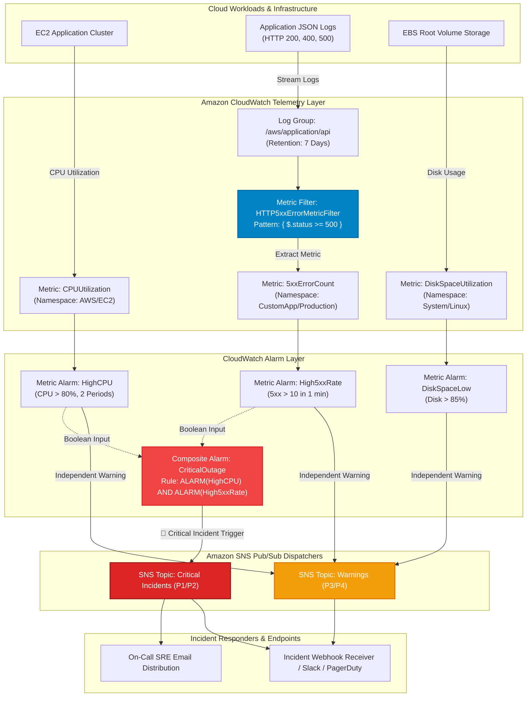
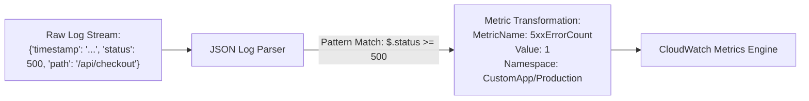
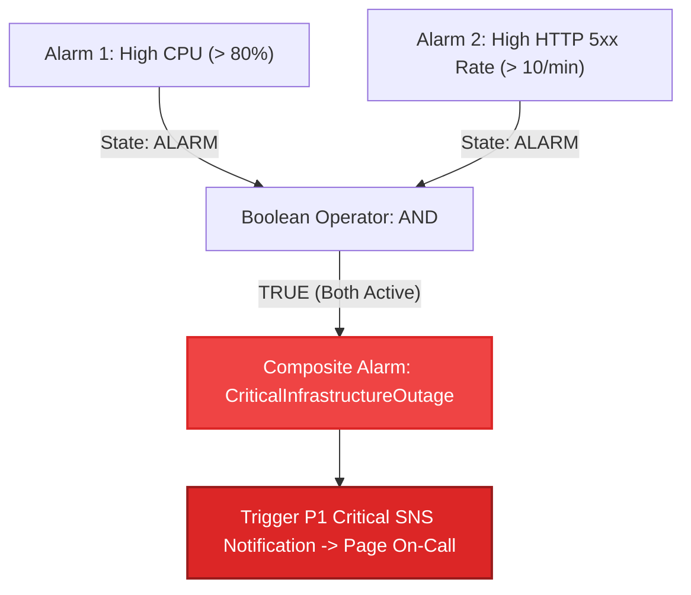
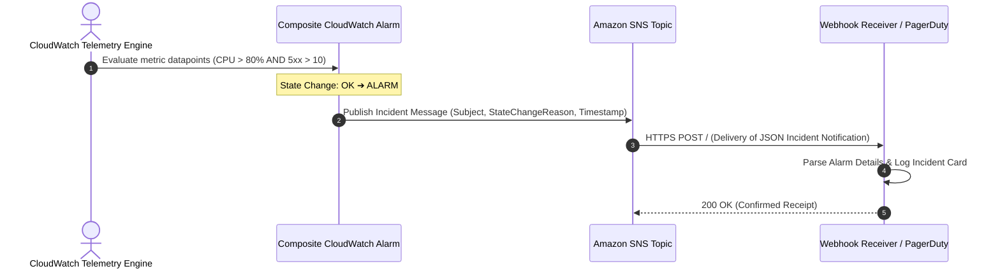

<!-- markdownlint-disable MD013 MD033 MD051 MD060 -->
# 04 - CloudWatch Alarms and SNS Incident Routing

> A production-grade cloud observability and incident response infrastructure implementing **CloudWatch Log Metric Filters**, **Individual Metric Alarms**, **Composite CloudWatch Alarms** (boolean alert correlation), and **Multi-Tier Amazon SNS Topic Routing** (P1 Critical vs P3 Warning) with an automated synthetic incident simulation suite and local webhook listener.

---

## 📋 Table of Contents

1. [Architectural Overview & Data Flow](#-architectural-overview--data-flow)
   - [Observability & Incident Routing Architecture](#observability--incident-routing-architecture)
   - [Log Metric Filter Extraction Flow](#log-metric-filter-extraction-flow)
   - [Composite Alarm Boolean Evaluation](#composite-alarm-boolean-evaluation)
   - [Incident Notification Sequence Flow](#incident-notification-sequence-flow)
2. [Theoretical Deep-Dive for Beginners](#-theoretical-deep-dive-for-beginners)
   - [The SRE Monitoring Pyramid & The Four Golden Signals](#the-sre-monitoring-pyramid--the-four-golden-signals)
   - [Metric Alarms vs Composite Alarms (Solving Alert Fatigue)](#metric-alarms-vs-composite-alarms-solving-alert-fatigue)
   - [CloudWatch Metric Filters Explained](#cloudwatch-metric-filters-explained)
   - [Amazon SNS Pub/Sub Fanout Architecture](#amazon-sns-pubsub-fanout-architecture)
   - [Alarm Evaluation Math: Periods, Datapoints, and Missing Data](#alarm-evaluation-math-periods-datapoints-and-missing-data)
   - [Actionable Alerting & Runbook Engineering](#actionable-alerting--runbook-engineering)
3. [Repository & Directory Structure](#-repository--directory-structure)
4. [Prerequisites & Tooling](#-prerequisites--tooling)
5. [Quickstart Guide](#-quickstart-guide)
6. [Step-by-Step Hands-On Guide](#-step-by-step-hands-on-guide)
   - [Step 1: Inspect the Webhook Listener](#step-1-inspect-the-webhook-listener)
   - [Step 2: Run the Incident Simulation Suite](#step-2-run-the-incident-simulation-suite)
   - [Step 3: Run the Automated Validation Suite](#step-3-run-the-automated-validation-suite)
   - [Step 4: Provision Cloud Infrastructure with Terraform](#step-4-provision-cloud-infrastructure-with-terraform)
   - [Step 5: Inject Synthetic Metrics with AWS CLI](#step-5-inject-synthetic-metrics-with-aws-cli)
7. [Incident Verification Matrix](#-incident-verification-matrix)
8. [Troubleshooting & Gotchas](#-troubleshooting--gotchas)
9. [Resource Teardown & Environment Cleanup](#-resource-teardown--environment-cleanup)

---

## 🏛️ Architectural Overview & Data Flow

In enterprise cloud operations, uncoordinated alerts flood on-call engineers with hundreds of notifications during a single incident (**Alert Fatigue**). This project implements intelligent multi-tier alerting using **CloudWatch Composite Alarms** to correlate multiple symptoms before triggering high-priority on-call alerts:

### Observability & Incident Routing Architecture



### Log Metric Filter Extraction Flow



### Composite Alarm Boolean Evaluation



### Incident Notification Sequence Flow



---

## 🧠 Theoretical Deep-Dive for Beginners

### The SRE Monitoring Pyramid & The Four Golden Signals

Google Site Reliability Engineering (SRE) categorizes observability telemetry into four essential signals:

```text
┌─────────────────────────────────────────────────────────────────────────────┐
│                       The 4 Golden Signals of SRE                           │
├───────────────────┬─────────────────────────────────────────────────────────┤
│ 1. Latency        │ The time it takes to service a request (e.g. p99 ms).   │
│ 2. Traffic        │ The demand on the system (e.g. HTTP requests/sec).      │
│ 3. Errors         │ The rate of requests that fail (e.g. HTTP 5xx errors).  │
│ 4. Saturation     │ How full the service is (e.g. CPU, RAM, Disk usage %).  │
└───────────────────┴─────────────────────────────────────────────────────────┘
```

This project implements alarms across **Errors** (`5xxErrorCount`), **Saturation** (`CPUUtilization`, `DiskSpaceUtilization`), and correlates them into actionable incidents.

---

### Metric Alarms vs Composite Alarms (Solving Alert Fatigue)

```text
┌─────────────────────────────────────────────────────────────────────────────┐
│                      The Alert Fatigue Problem & Solution                   │
├─────────────────────────────────────────────────────────────────────────────┤
│ ❌ WITHOUT COMPOSITE ALARMS:                                                │
│    • CPU spikes to 85% during batch job ➔ Pager alerts engineer at 3 AM!   │
│    • (False Alarm: The API was completely healthy, no user impact).         │
│                                                                             │
│ ✅ WITH COMPOSITE ALARMS:                                                   │
│    • Rule: ALARM(HighCPU) AND ALARM(High5xxErrors)                          │
│    • CPU spike alone = Warning log only (No 3 AM page).                     │
│    • CPU spike + 5xx error surge = Critical Outage (Engineer paged).        │
└─────────────────────────────────────────────────────────────────────────────┘
```

---

### CloudWatch Metric Filters Explained

A **Metric Filter** extracts numerical metrics from plain text or JSON logs as they are written to a CloudWatch Log Group, without requiring changes to the application source code:

- **JSON Pattern**: `{ $.status >= 500 }`
- **Matched Log**: `{"timestamp": "2026-08-22T07:30:00Z", "status": 503, "endpoint": "/pay"}`
- **Published Metric**: Increments `5xxErrorCount` in namespace `CustomApp/Production` by `1`.

---

### Amazon SNS Pub/Sub Fanout Architecture

Amazon Simple Notification Service (SNS) provides a decoupled Publisher/Subscriber architecture:

```text
               ┌─── CloudWatch Alarm (Publisher)
               │
               ▼
      [ Amazon SNS Topic ] (P1 Critical Dispatcher)
               │
       ┌───────┼───────────────────────────┐
       │       │                           │
       ▼       ▼                           ▼
  [ Webhook ] [ Email ]              [ AWS Lambda ]
  (PagerDuty/ (On-Call Distribution) (Auto-Remediation Script)
   Slack)
```

---

### Alarm Evaluation Math: Periods, Datapoints, and Missing Data

| Parameter | Configuration | Meaning & Rule |
| :--- | :--- | :--- |
| **`Period`** | `60 seconds` | Time window over which metric data is aggregated. |
| **`EvaluationPeriods`** | `2` | Number of recent periods evaluated against the threshold. |
| **`DatapointsToAlarm`** | `2 of 2` | All 2 periods must breach the threshold before triggering `ALARM`. |
| **`TreatMissingData`** | `notBreaching` | If an instance stops sending data, assume it is healthy (prevents false alerts on idle systems). |

---

### Actionable Alerting & Runbook Engineering

Every production alert must include a direct link to an actionable runbook in its description:

```text
Alarm Name       : cloud-incident-routing-composite-outage
Severity         : P1 (Critical Outage)
Alarm Description: CRITICAL P1 OUTAGE: High CPU correlated with HTTP 5xx surge.
                   Runbook: https://runbooks.internal/incident-p1-outage
```

---

## 📂 Repository & Directory Structure

```text
07-cloud-providers/04-cloudwatch-alarms-sns-routing/
├── .gitignore                      # Excludes Terraform state, plans, caches, and test logs
├── .tflint.hcl                     # TFLint configuration for AWS CloudWatch and SNS rules
├── README.md                       # Comprehensive educational documentation (this file)
├── cleanup.sh                      # Standalone teardown script destroying cloud state & webhooks
├── main.tf                         # Terraform manifest provisioning SNS, alarms & composite alarms
├── outputs.tf                      # Outputs exposing SNS topic ARNs, alarm names & rules
├── simulate_cloud_incident.sh      # Automated synthetic metric injection & incident simulator
├── terraform.tfvars.example        # Example variable configuration file
├── test_monitoring_pipeline.sh     # Automated test runner validating IaC, syntax, and alerts
├── variables.tf                    # Input variable definitions (thresholds, emails, webhooks)
├── versions.tf                     # Engine version constraints (Terraform >= 1.5, OpenTofu >= 1.6)
└── webhook_receiver.py             # Python HTTP webhook server capturing Amazon SNS alerts
```

---

## 🛠️ Prerequisites & Tooling

| Tool | Minimum Version | Purpose |
| :--- | :--- | :--- |
| **Python** | `3.9+` | Runs the webhook listener and offline metric evaluation engine. |
| **cURL** | `7.0+` | Dispatches simulated SNS webhook payloads to test notification delivery. |
| **Terraform** or **OpenTofu** | `>= 1.5.0` / `>= 1.6.0` | Provisions SNS topics, metric filters, and CloudWatch alarms. |
| **AWS CLI** *(Optional)* | `2.0+` | Injects live metrics via `aws cloudwatch put-metric-data` in AWS. |

---

## 🚀 Quickstart Guide

Execute the full 5-scenario incident simulation, alarm state transitions, and webhook routing in **under 2 seconds** (100% offline, zero cloud credentials needed):

```bash
# Navigate to the project directory
cd 07-cloud-providers/04-cloudwatch-alarms-sns-routing

# Run the automated test runner
./test_monitoring_pipeline.sh
```

---

## 📖 Step-by-Step Hands-On Guide

### Step 1: Inspect the Webhook Listener

Examine `webhook_receiver.py` to see how Amazon SNS `SubscriptionConfirmation` and `Notification` payloads are parsed:

```bash
cat webhook_receiver.py
```

---

### Step 2: Run the Incident Simulation Suite

Execute the simulator to inject synthetic anomalies and observe real-time incident alert cards:

```bash
# Run standard offline incident simulation
./simulate_cloud_incident.sh --mock

# Run with verbose HTTP payload traces
./simulate_cloud_incident.sh --mock --verbose

# Export test findings to JSON
./simulate_cloud_incident.sh --mock --json-output test_report.json
```

---

### Step 3: Run the Automated Validation Suite

Execute the bash test runner to validate Python syntax, Terraform manifests, and incident assertions:

```bash
./test_monitoring_pipeline.sh --verbose
```

---

### Step 4: Provision Cloud Infrastructure with Terraform

Deploy the monitoring infrastructure to your AWS account (eligible for AWS Free Tier: 10 CloudWatch alarms + 1M SNS requests free/month):

```bash
# 1. Initialize Terraform
terraform init

# 2. Review execution plan
terraform plan

# 3. Apply changes to create SNS topics, alarms, and composite alarms
terraform apply -auto-approve
```

---

### Step 5: Inject Synthetic Metrics with AWS CLI

Inject live metric anomalies into AWS CloudWatch to trigger the provisioned alarms:

```bash
# 1. Inject High CPU Utilization (95%)
aws cloudwatch put-metric-data \
    --namespace "AWS/EC2" \
    --metric-name "CPUUtilization" \
    --dimensions AutoScalingGroupName=production-app-asg \
    --value 95.0

# 2. Inject HTTP 5xx Error Spike (25 errors)
aws cloudwatch put-metric-data \
    --namespace "CustomApp/Production" \
    --metric-name "5xxErrorCount" \
    --value 25.0
```

---

## 🧪 Incident Verification Matrix

The test runner asserts 5 critical incident and recovery scenarios:

| Scenario ID | Incident Anomaly | Injected Value | Target Alarm | Expected State | Notification Route |
| :--- | :--- | :--- | :--- | :--- | :--- |
| `INCIDENT-01` | **EC2 CPU Surge** | `CPU = 95.5%` (> 80%) | `high_cpu` | `ALARM` | Warning SNS Topic |
| `INCIDENT-02` | **HTTP 5xx Error Surge** | `5xx = 28` (> 10/min) | `high_5xx_rate` | `ALARM` | Warning SNS Topic |
| `INCIDENT-03` | **Disk Space Exhaustion**| `Disk = 91.2%` (> 85%) | `disk_space_low` | `ALARM` | Warning SNS Topic |
| `INCIDENT-04` | **Correlated Outage** | `CPU > 80% AND 5xx > 10` | `critical_outage` | `ALARM` | **🚨 P1 Critical SNS Topic** |
| `INCIDENT-05` | **Auto-Recovery** | `CPU = 22%, 5xx = 0` | `critical_outage` | `OK` | Critical SNS Topic (Resolved) |

---

## 🔧 Troubleshooting & Gotchas

### 1. "CloudWatch Alarm does not publish to SNS topic"

- **Cause**: The SNS Topic Policy does not grant `sns:Publish` to `cloudwatch.amazonaws.com`.
- **Solution**: Ensure `aws_sns_topic_policy` attaches a policy with `principals = { type = "Service", identifiers = ["cloudwatch.amazonaws.com"] }`.

### 2. "Composite Alarm state remains in INSUFFICIENT_DATA"

- **Cause**: One of the underlying metric alarms is missing data points or has `treat_missing_data = "missing"`.
- **Solution**: Configure `treat_missing_data = "notBreaching"` on underlying alarms.

### 3. "Metric Filter does not match log events"

- **Cause**: JSON log attributes do not match filter pattern casing or field names.
- **Solution**: Test the pattern against sample JSON logs in the CloudWatch Logs Console using `{ $.status >= 500 }`.

---

## 🧹 Resource Teardown & Environment Cleanup

To ensure that no stray background webhook processes, temporary files, or AWS Cloud resources remain, execute the standalone `cleanup.sh` script:

### Basic Cleanup (Standard)

Terminates background webhook servers and removes temporary logs:

```bash
./cleanup.sh
```

### Complete Cloud Teardown & State Purge

Destroys all provisioned CloudWatch alarms, log groups, SNS topics, and purges `.terraform/`, `.terraform.lock.hcl`, and `terraform.tfstate`:

```bash
./cleanup.sh --all
```

---

### Verification of Clean State

Verify that your workspace is completely clean:

```bash
# Check directory status
ls -la
```

Your environment is now completely clean and ready for the next mini-project! 🚀
