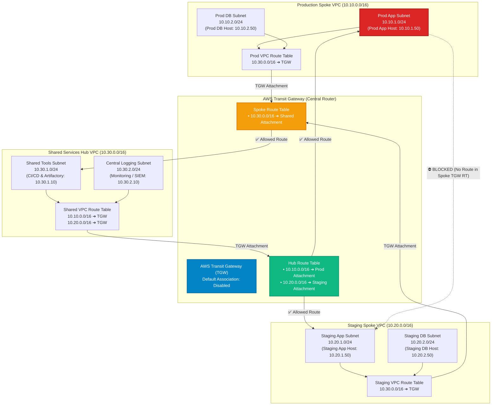
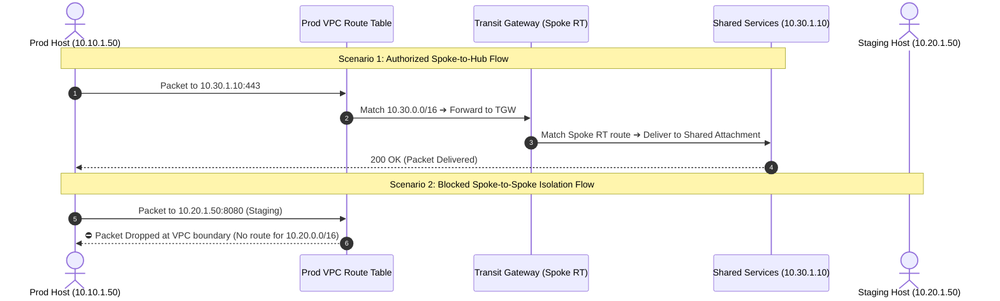
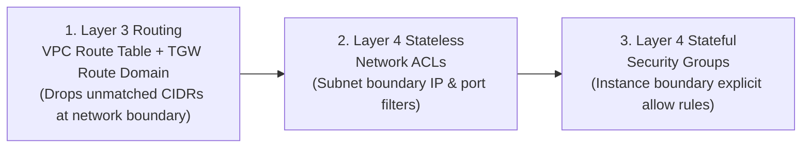

<!-- markdownlint-disable MD013 MD033 MD051 MD060 -->
# 05 - Multi-VPC Networking with Transit Gateway

> A production-grade multi-VPC cloud networking infrastructure implementing **non-overlapping RFC 1918 CIDR segmentation**, **AWS Transit Gateway (TGW) Hub-and-Spoke topology**, **Route Domain Segmentation** (Spoke-to-Hub allowed, Spoke-to-Spoke strictly isolated), and **Layer 4 Security Groups**, featuring a deterministic Layer 3/Layer 4 network routing simulator and full Terraform / OpenTofu IaC manifests.

---

## 📋 Table of Contents

1. [Architectural Overview & Topology](#-architectural-overview--topology)
   - [Hub-and-Spoke Multi-VPC Network Architecture](#hub-and-spoke-multi-vpc-network-architecture)
   - [Transit Gateway Route Table Segmentation](#transit-gateway-route-table-segmentation)
   - [Packet Flow & Isolation Sequence](#packet-flow--isolation-sequence)
   - [Defense-in-Depth Layering](#defense-in-depth-layering)
2. [Theoretical Deep-Dive for Beginners](#-theoretical-deep-dive-for-beginners)
   - [Why Multi-VPC Architecture? (Blast Radius Containment)](#why-multi-vpc-architecture-blast-radius-containment)
   - [RFC 1918 Private CIDR Allocation & Subnet Math](#rfc-1918-private-cidr-allocation--subnet-math)
   - [AWS Transit Gateway vs VPC Peering vs AWS PrivateLink](#aws-transit-gateway-vs-vpc-peering-vs-aws-privatelink)
   - [Transit Gateway Route Domains & Segmentation](#transit-gateway-route-domains--segmentation)
   - [The Non-Transitive Peering Rule](#the-non-transitive-peering-rule)
   - [Layer 3 Routing vs Layer 4 Security Groups](#layer-3-routing-vs-layer-4-security-groups)
3. [Repository & Directory Structure](#-repository--directory-structure)
4. [Prerequisites & Tooling](#-prerequisites--tooling)
5. [Quickstart Guide](#-quickstart-guide)
6. [Step-by-Step Hands-On Guide](#-step-by-step-hands-on-guide)
   - [Step 1: Inspect CIDR Allocation & Subnet Mapping](#step-1-inspect-cidr-allocation--subnet-mapping)
   - [Step 2: Run the Offline Network Reachability Simulator](#step-2-run-the-offline-network-reachability-simulator)
   - [Step 3: Run the Automated Validation Suite](#step-3-run-the-automated-validation-suite)
   - [Step 4: Provision Cloud Infrastructure with Terraform](#step-4-provision-cloud-infrastructure-with-terraform)
   - [Step 5: Verify Inter-VPC Reachability in AWS](#step-5-verify-inter-vpc-reachability-in-aws)
7. [Network Reachability & Isolation Verification Matrix](#-network-reachability--isolation-verification-matrix)
8. [Troubleshooting & Gotchas](#-troubleshooting--gotchas)
9. [Resource Teardown & Environment Cleanup](#-resource-teardown--environment-cleanup)

---

## 🏛️ Architectural Overview & Topology

In enterprise cloud architectures, deploying all workloads into a single monolithic VPC creates massive security risks: a compromised test environment could access production databases. This project deploys **three dedicated, non-overlapping VPCs** connected via an **AWS Transit Gateway** using custom **Route Tables (Route Domains)** to enforce strict environment isolation:

### Hub-and-Spoke Multi-VPC Network Architecture



### Transit Gateway Route Table Segmentation

```text
┌─────────────────────────────────────────────────────────────────────────────┐
│                    Transit Gateway Route Domain Matrix                      │
├──────────────────────┬────────────────────────┬─────────────────────────────┤
│ Route Table Domain   │ Associated VPCs        │ Route Entries & Destinations│
├──────────────────────┼────────────────────────┼─────────────────────────────┤
│ 1. Spoke Route Table │ • Production VPC       │ • 10.30.0.0/16 ➔ Shared VPC │
│                      │ • Staging VPC          │ (❌ NO route to other spoke)│
├──────────────────────┼────────────────────────┼─────────────────────────────┤
│ 2. Hub Route Table   │ • Shared Services VPC  │ • 10.10.0.0/16 ➔ Prod VPC   │
│                      │                        │ • 10.20.0.0/16 ➔ Staging VPC│
└──────────────────────┴────────────────────────┴─────────────────────────────┘
```

### Packet Flow & Isolation Sequence



### Defense-in-Depth Layering



---

## 🧠 Theoretical Deep-Dive for Beginners

### Why Multi-VPC Architecture? (Blast Radius Containment)

In cloud engineering, **Blast Radius** is the maximum disruption or damage that can occur when an infrastructure component fails or is compromised.

```text
❌ MONOLITHIC SINGLE VPC (High Risk):
┌─────────────────────────────────────────────────────────────────────────────┐
│ Single Huge VPC (10.0.0.0/16)                                               │
│   [ Dev / Staging Apps ] ───Can Ping / Exploit───> [ Production Databases ] │
│   💥 Risk: A zero-day exploit in staging compromises production data!       │
└─────────────────────────────────────────────────────────────────────────────┘

✅ MULTI-VPC HUB-AND-SPOKE (Zero Trust Isolation):
┌─────────────────────────┐  ┌─────────────────────────┐  ┌─────────────────────────┐
│ Production VPC          │  │ Shared Services Hub     │  │ Staging VPC             │
│ (10.10.0.0/16)          │  │ (10.30.0.0/16)          │  │ (10.20.0.0/16)          │
│ [ Prod DB: 10.10.2.50 ] │  │ [ CI/CD & Artifactory ] │  │ [ Staging Apps ]        │
└────────────┬────────────┘  └────────────┬────────────┘  └────────────┬────────────┘
             │                            │                            │
             └──────────────────> [ AWS Transit Gateway ] <────────────┘
                        (Enforces strict Spoke-to-Spoke Isolation)
```

---

### RFC 1918 Private CIDR Allocation & Subnet Math

RFC 1918 reserves three blocks of IPv4 address space for private networks:

- `10.0.0.0/8` (16,777,216 addresses) — *Best for enterprise multi-VPC architectures.*
- `172.16.0.0/12` (1,048,576 addresses).
- `192.168.0.0/16` (65,536 addresses).

#### CIDR Allocation Table for This Project

| VPC Name | Environment Role | VPC CIDR | Subnet Name | Subnet CIDR | Usable IPs |
| :--- | :--- | :--- | :--- | :--- | :--- |
| **`Production`** | Spoke | `10.10.0.0/16` | `prod-app-subnet` | `10.10.1.0/24` | 251 |
| | | | `prod-db-subnet` | `10.10.2.0/24` | 251 |
| **`Staging`** | Spoke | `10.20.0.0/16` | `staging-app-subnet` | `10.20.1.0/24` | 251 |
| | | | `staging-db-subnet` | `10.20.2.0/24` | 251 |
| **`Shared Services`**| Hub | `10.30.0.0/16` | `shared-tools-subnet` | `10.30.1.0/24` | 251 |
| | | | `shared-logging-subnet`| `10.30.2.0/24` | 251 |

> [!NOTE]
> AWS reserves **5 IP addresses** in every `/24` subnet:
>
> 1. `10.x.x.0`: Network Address.
> 2. `10.x.x.1`: VPC Router Gateway.
> 3. `10.x.x.2`: Amazon DNS Server.
> 4. `10.x.x.3`: Reserved by AWS for future use.
> 5. `10.x.x.255`: Network Broadcast Address.
>
> Therefore, a `/24` subnet has $256 - 5 = 251$ usable host IP addresses.

---

### AWS Transit Gateway vs VPC Peering vs AWS PrivateLink

| Dimension | AWS Transit Gateway (Used in this project) | VPC Peering | AWS PrivateLink |
| :--- | :--- | :--- | :--- |
| **Topology** | **Hub-and-Spoke (Centralized router)** | Full Mesh ($N \times (N-1)/2$ peerings) | Point-to-point Interface Endpoints |
| **Scalability** | Up to **5,000 VPC attachments** | Max 125 active peerings per VPC | Per-service endpoint scaling |
| **Transitive Routing**| **✅ Fully Supported** via Route Domains | ❌ Strictly Non-Transitive | N/A (Service level proxy) |
| **Segmentation** | **✅ Custom Route Tables** per attachment | Manual route table pairs per VPC | Consumer-to-Producer only |
| **Cost Model** | Hourly attachment fee + data processing | **Free peering** (only cross-AZ data) | Hourly endpoint fee + data |
| **Best Use Case** | Enterprise multi-account & multi-VPC | Simple 2-3 VPC interconnects | Secure third-party SaaS publishing |

---

### Transit Gateway Route Domains & Segmentation

By default, Transit Gateways enable `default_route_table_association = "enable"`, creating a **full mesh** where all VPCs can reach each other.

**In this project, we disable default propagation and create two isolated route tables:**

1. **`Spoke Route Table`**: Associated with Production and Staging. Contains **only one route**: `10.30.0.0/16 ➔ Shared Attachment`.
2. **`Hub Route Table`**: Associated with Shared Services. Contains **two routes**: `10.10.0.0/16 ➔ Prod Attachment` and `10.20.0.0/16 ➔ Staging Attachment`.

This guarantees that Production and Staging cannot communicate directly or transitively!

---

### The Non-Transitive Peering Rule

```text
┌─────────────────────────────────────────────────────────────────────────────┐
│                       The Non-Transitive Peering Rule                       │
├─────────────────────────────────────────────────────────────────────────────┤
│ In standard AWS VPC Peering:                                                │
│ • If VPC A is peered with VPC B, and VPC B is peered with VPC C:            │
│   ❌ VPC A CANNOT route packets to VPC C through VPC B!                     │
│                                                                             │
│ In AWS Transit Gateway:                                                     │
│ • Transitive routing IS supported, but ONLY when explicitly configured in   │
│   the Transit Gateway Route Table!                                          │
└─────────────────────────────────────────────────────────────────────────────┘
```

---

### Layer 3 Routing vs Layer 4 Security Groups

- **Layer 3 (Route Tables & TGW)**: Decides *where* a packet can physically travel based on IP destination. If no route exists, the packet is discarded immediately.
- **Layer 4 (Security Groups)**: Decides *which specific ports and protocols* are allowed into an instance (e.g. only port 443 TCP from `10.30.0.0/16`).

---

## 📂 Repository & Directory Structure

```text
07-cloud-providers/05-multi-vpc-transit-gateway/
├── .gitignore                      # Excludes Terraform state, plans, caches, and test logs
├── .tflint.hcl                     # TFLint configuration for AWS EC2 and VPC rules
├── README.md                       # Comprehensive educational documentation (this file)
├── cleanup.sh                      # Teardown script destroying TGW, VPCs, and state
├── main.tf                         # Terraform manifest provisioning 3 VPCs, TGW, attachments & routes
├── network_simulator.py            # Deterministic Layer 3/Layer 4 routing & reachability simulator
├── outputs.tf                      # Outputs exposing VPC IDs, CIDRs, TGW IDs, and topology summary
├── terraform.tfvars.example        # Example variable configuration file
├── test_multi_vpc.sh               # Automated test runner validating IaC and reachability rules
├── variables.tf                    # Input variable definitions (CIDRs, subnets, regions)
├── versions.tf                     # Engine version constraints (Terraform >= 1.5, OpenTofu >= 1.6)
└── vpc_reachability_test.sh        # Reachability test harness executing network_simulator.py
```

---

## 🛠️ Prerequisites & Tooling

| Tool | Minimum Version | Purpose |
| :--- | :--- | :--- |
| **Python** | `3.9+` | Runs the deterministic network simulator and IP routing logic. |
| **Terraform** or **OpenTofu** | `>= 1.5.0` / `>= 1.6.0` | Provisions VPCs, subnets, route tables, and Transit Gateway resources. |
| **AWS CLI** *(Optional)* | `2.0+` | Interacts with live AWS Transit Gateway and VPC route tables in AWS Cloud. |

---

## 🚀 Quickstart Guide

Execute the full 8-scenario multi-VPC reachability and isolation test in **under 2 seconds** (100% offline, zero cloud credentials needed):

```bash
# Navigate to the project directory
cd 07-cloud-providers/05-multi-vpc-transit-gateway

# Run the automated test runner
./test_multi_vpc.sh
```

---

## 📖 Step-by-Step Hands-On Guide

### Step 1: Inspect CIDR Allocation & Subnet Mapping

Review the non-overlapping CIDR definitions in `variables.tf`:

```bash
cat variables.tf
```

---

### Step 2: Run the Offline Network Reachability Simulator

Execute `network_simulator.py` to trace simulated packet flows across all VPC pairs:

```bash
# Run standard reachability tests
python3 network_simulator.py

# Run with granular packet tracer hop-by-hop logs
python3 network_simulator.py --verbose

# Export test findings to JSON
python3 network_simulator.py --json-output test_report.json
```

---

### Step 3: Run the Automated Validation Suite

Execute the bash test runner to validate Python syntax, Terraform formatting, and routing assertions:

```bash
./test_multi_vpc.sh --verbose
```

---

### Step 4: Provision Cloud Infrastructure with Terraform

Deploy the multi-VPC network infrastructure to your AWS account:

```bash
# 1. Initialize Terraform
terraform init

# 2. Review execution plan
terraform plan

# 3. Apply changes to provision VPCs, subnets, and Transit Gateway
terraform apply -auto-approve
```

---

### Step 5: Verify Inter-VPC Reachability in AWS

Once provisioned in AWS:

```bash
# View the provisioned topology summary
terraform output network_topology_summary
```

---

## 🧪 Network Reachability & Isolation Verification Matrix

The test runner asserts 8 critical routing and isolation requirements:

| Test ID | Source Endpoint | Destination Endpoint | Target Port | Expected Decision | Routing Rule / Reason |
| :--- | :--- | :--- | :--- | :--- | :--- |
| `NET-01` | `Prod App (10.10.1.50)` | `Shared Tools (10.30.1.10)` | `443` | `ALLOWED` | Prod to Shared Hub route active in Spoke TGW RT. |
| `NET-02` | `Shared Tools (10.30.1.10)`| `Prod App (10.10.1.50)` | `443` | `ALLOWED` | Hub to Prod Spoke route active in Hub TGW RT. |
| `NET-03` | `Staging App (10.20.1.50)`| `Shared Tools (10.30.1.10)` | `443` | `ALLOWED` | Staging to Shared Hub route active in Spoke TGW RT. |
| `NET-04` | `Shared Tools (10.30.1.10)`| `Staging App (10.20.1.50)` | `8080` | `ALLOWED` | Hub to Staging Spoke route active in Hub TGW RT. |
| `NET-05` | `Prod App (10.10.1.50)` | `Staging App (10.20.1.50)` | `8080` | `DROPPED` | **Lateral Movement Blocked**: No route in Spoke RT. |
| `NET-06` | `Staging App (10.20.1.50)`| `Prod App (10.10.1.50)` | `443` | `DROPPED` | **Blast Radius Containment**: No route in Spoke RT. |
| `NET-07` | `Prod (10.10.1.50)` | `Staging DB (10.20.2.99)` | `3306` | `DROPPED` | **Non-Transitive Hop Blocked**: Transit routing denied. |
| `NET-08` | `Prod App (10.10.1.50)` | `External (192.168.1.1)` | `80` | `DROPPED` | Non-VPC CIDR dropped at VPC route table boundary. |

---

## 🔧 Troubleshooting & Gotchas

### 1. "Overlapping CIDR blocks detected"

- **Cause**: Attaching two VPCs with the same or overlapping CIDR (e.g. both using `10.0.0.0/16`) to the same Transit Gateway route table creates non-deterministic routing.
- **Solution**: Always plan unique, non-overlapping RFC 1918 address spaces (`10.10.0.0/16`, `10.20.0.0/16`, `10.30.0.0/16`).

### 2. "Spokes can reach each other despite isolation requirements"

- **Cause**: The Transit Gateway was created with `default_route_table_association = "enable"`, creating a shared full-mesh route table.
- **Solution**: Set `default_route_table_association = "disable"` and create separate `Spoke` and `Hub` TGW route tables.

### 3. "Packets enter Transit Gateway but return packets are dropped"

- **Cause**: Asymmetric routing: Destination VPC route table lacks a return route back to the source VPC CIDR.
- **Solution**: Ensure bidirectional route table entries in both the VPC subnet route tables and the TGW route tables.

---

## 🧹 Resource Teardown & Environment Cleanup

To ensure that no stray cloud resources or temporary files remain, execute the standalone `cleanup.sh` script:

### Basic Cleanup (Standard)

Removes temporary logs and test reports:

```bash
./cleanup.sh
```

### Complete Cloud Teardown & State Purge

Destroys all provisioned Transit Gateways, VPC attachments, route tables, subnets, and VPCs, and purges `.terraform/`, `.terraform.lock.hcl`, and `terraform.tfstate`:

```bash
./cleanup.sh --all
```

---

### Verification of Clean State

Verify that your workspace is completely clean:

```bash
# Check directory status
ls -la
```

Your environment is now completely clean and ready for the next mini-project! 🚀
