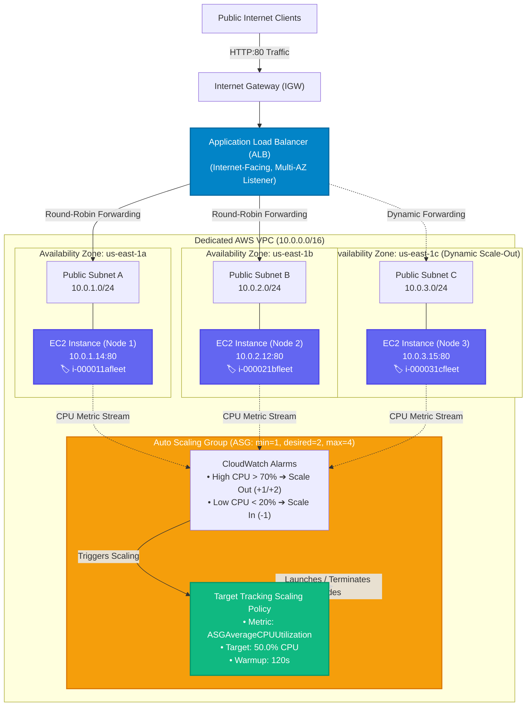
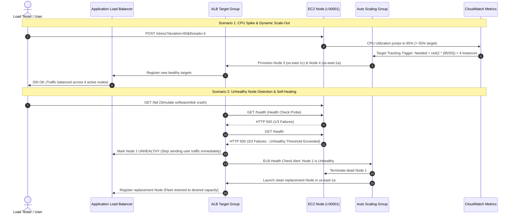
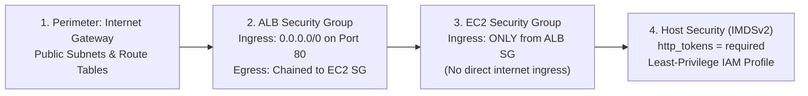

<!-- markdownlint-disable MD013 MD033 MD051 MD060 -->
# 06 - High-Availability Auto Scaling EC2 Fleet behind ALB

> A production-grade, highly available cloud compute infrastructure deploying an **Auto Scaling Group (ASG)** across multiple **Availability Zones (Multi-AZ)** behind an **Application Load Balancer (ALB)**, featuring **Dynamic Target Tracking CPU Scaling**, **ELB Health Check Self-Healing**, **IMDSv2-hardened Launch Templates**, **Security Group Chaining**, a 100% offline Python fleet simulator, local Docker Compose multi-node environment, and full Terraform / OpenTofu IaC manifests.

---

## 📋 Table of Contents

1. [Architectural Overview & Topology](#-architectural-overview--topology)
   - [Multi-AZ High-Availability Fleet Topology](#multi-az-high-availability-fleet-topology)
   - [Target Group Round-Robin Request Routing](#target-group-round-robin-request-routing)
   - [Dynamic Auto Scaling & Self-Healing Sequence](#dynamic-auto-scaling--self-healing-sequence)
   - [Defense-in-Depth Security Model](#defense-in-depth-security-model)
2. [Theoretical Deep-Dive for Beginners](#-theoretical-deep-dive-for-beginners)
   - [High Availability (HA) & Fault Tolerance in the Cloud](#high-availability-ha--fault-tolerance-in-the-cloud)
   - [Multi-AZ Deployment vs Single-AZ Blast Radius](#multi-az-deployment-vs-single-az-blast-radius)
   - [Application Load Balancer (Layer 7) vs Network Load Balancer (Layer 4)](#application-load-balancer-layer-7-vs-network-load-balancer-layer-4)
   - [Target Groups, Health Checks & Connection Draining](#target-groups-health-checks--connection-draining)
   - [EC2 Launch Templates vs Deprecated Launch Configurations](#ec2-launch-templates-vs-deprecated-launch-configurations)
   - [Auto Scaling Group Capacity Parameters (`min`, `desired`, `max`)](#auto-scaling-group-capacity-parameters-min-desired-max)
   - [Dynamic Scaling: Target Tracking vs Step vs Simple Scaling](#dynamic-scaling-target-tracking-vs-step-vs-simple-scaling)
   - [Warmup, Cooldown & Scaling Flapping Prevention](#warmup-cooldown--scaling-flapping-prevention)
   - [Health Check Types (`EC2` vs `ELB`) & Automated Self-Healing](#health-check-types-ec2-vs-elb--automated-self-healing)
   - [IMDSv2 Instance Metadata Hardening](#imdsv2-instance-metadata-hardening)
   - [Cost Optimization & Free Tier Best Practices](#cost-optimization--free-tier-best-practices)
3. [Repository & Directory Structure](#-repository--directory-structure)
4. [Prerequisites & Tooling](#-prerequisites--tooling)
5. [Quickstart Guide](#-quickstart-guide)
6. [Step-by-Step Hands-On Guide](#-step-by-step-hands-on-guide)
   - [Step 1: Run the 100% Offline Python Fleet Simulator](#step-1-run-the-100-offline-python-fleet-simulator)
   - [Step 2: Start the Local Docker Multi-AZ Environment](#step-2-start-the-local-docker-multi-az-environment)
   - [Step 3: Execute Traffic Distribution & Stress Tests](#step-3-execute-traffic-distribution--stress-tests)
   - [Step 4: Test Self-Healing & Instance Replacement](#step-4-test-self-healing--instance-replacement)
   - [Step 5: Run the End-to-End Test Runner](#step-5-run-the-end-to-end-test-runner)
   - [Step 6: Provision Real Cloud Infrastructure with Terraform (Optional)](#step-6-provision-real-cloud-infrastructure-with-terraform-optional)
   - [Step 7: Execute Cloud Stress Testing & Scaling Verification](#step-7-execute-cloud-stress-testing--scaling-verification)
7. [Verification & Scaling Test Matrix](#-verification--scaling-test-matrix)
8. [Troubleshooting & Gotchas](#-troubleshooting--gotchas)
9. [Resource Teardown & Environment Cleanup](#-resource-teardown--environment-cleanup)

---

## 🏛️ Architectural Overview & Topology

In modern cloud computing, running critical web applications on a single virtual machine is a single point of failure (SPOF). Hardware failures, hypervisor crashes, or sudden traffic surges can take down entire services.

This project implements a **High-Availability (HA) Auto Scaling Fleet** that distributes compute across **three distinct AWS Availability Zones (AZs)** behind an **Application Load Balancer (ALB)**, automatically scaling instance capacity up or down based on real-time CPU demand and replacing dead nodes automatically:

### Multi-AZ High-Availability Fleet Topology



### Target Group Round-Robin Request Routing

```text
┌─────────────────────────────────────────────────────────────────────────────┐
│                   Application Load Balancer Routing Matrix                  │
├───────────────┬────────────────────────┬────────────────────────────────────┤
│ Request #     │ Target Selected        │ Target Availability Zone           │
├───────────────┼────────────────────────┼────────────────────────────────────┤
│ Request #1    │ i-000011afleet         │ us-east-1a (Subnet 10.0.1.0/24)    │
│ Request #2    │ i-000021bfleet         │ us-east-1b (Subnet 10.0.2.0/24)    │
│ Request #3    │ i-000031cfleet         │ us-east-1c (Subnet 10.0.3.0/24)    │
│ Request #4    │ i-000011afleet         │ us-east-1a (Subnet 10.0.1.0/24)    │
└───────────────┴────────────────────────┴────────────────────────────────────┘
```

### Dynamic Auto Scaling & Self-Healing Sequence



### Defense-in-Depth Security Model



---

## 🧠 Theoretical Deep-Dive for Beginners

### High Availability (HA) & Fault Tolerance in the Cloud

- **High Availability (HA)**: The operational design ensuring a system remains accessible and operational with minimal downtime (e.g., 99.99% "four nines" availability).
- **Fault Tolerance (FT)**: The ability of a system to continue operating without interruption even when one or more underlying components (physical server, power supply, data center) experience catastrophic failure.

### Multi-AZ Deployment vs Single-AZ Blast Radius

AWS Regions are divided into multiple, physically separated, isolated data center clusters called **Availability Zones (AZs)** (e.g., `us-east-1a`, `us-east-1b`, `us-east-1c`). Each AZ has redundant power, networking, and cooling.

```text
❌ SINGLE-AZ ARCHITECTURE (High Risk / SPOF):
┌─────────────────────────────────────────────────────────┐
│ Availability Zone us-east-1a                            │
│   [ EC2 Node 1 ]   [ EC2 Node 2 ]                       │
│   💥 Lightning strike / power outage takes down AZ     │
│   ➔ RESULT: Complete service outage (100% Downtime)    │
└─────────────────────────────────────────────────────────┘

✅ MULTI-AZ ARCHITECTURE (Resilient & Fault Tolerant):
┌────────────────────┐  ┌────────────────────┐  ┌────────────────────┐
│ AZ us-east-1a      │  │ AZ us-east-1b      │  │ AZ us-east-1c      │
│   [ EC2 Node 1 ]   │  │   [ EC2 Node 2 ]   │  │   [ EC2 Node 3 ]   │
│   💥 AZ Fails      │  │   ✅ Stays Alive   │  │   ✅ Stays Alive   │
└────────────────────┘  └────────────────────┘  └────────────────────┘
   ➔ RESULT: ALB reroutes traffic to 1b and 1c instantly. Zero downtime.
```

---

### Application Load Balancer (Layer 7) vs Network Load Balancer (Layer 4)

| Feature | Application Load Balancer (ALB) | Network Load Balancer (NLB) |
| :--- | :--- | :--- |
| **OSI Layer** | **Layer 7 (Application)** | **Layer 4 (Transport)** |
| **Protocols** | HTTP, HTTPS, gRPC, HTTP/2, WebSockets | TCP, UDP, TLS |
| **Routing Logic** | Content-based: URL path (`/api`), host header, query strings | IP protocol, source IP/port |
| **Health Checks** | Deep HTTP status verification (e.g. `GET /health == 200`) | TCP handshake / TCP ping |
| **Client Headers** | Injects `X-Forwarded-For`, `X-Forwarded-Proto`, `X-Forwarded-Port` | Preserves client source IP natively |
| **Primary Use Case** | Web applications, microservices, REST APIs | Extreme throughput, ultra-low latency, gaming, VoIP |

---

### Target Groups, Health Checks & Connection Draining

1. **Target Group**: A logical collection of compute resources (EC2 instances, IP addresses, or containers) that receive traffic routed by the ALB listener.
2. **Health Check Cycle**:
   - **Path**: The endpoint checked by ALB (e.g., `/health`).
   - **Interval**: Frequency of probes (e.g., every 15 seconds).
   - **Timeout**: Maximum time allowed for response before marking check failed (e.g., 5 seconds).
   - **Healthy Threshold**: Number of consecutive successful checks before a node is marked healthy (e.g., 2).
   - **Unhealthy Threshold**: Number of consecutive failed checks before a node is taken out of service (e.g., 3).
3. **Connection Draining (Deregistration Delay)**: When an instance is scaled in or terminated, ALB stops sending new requests to that instance and gives ongoing requests a grace period (e.g., 30 seconds) to finish cleanly, preventing 502/504 errors for active users.

---

### EC2 Launch Templates vs Deprecated Launch Configurations

AWS previously used *Launch Configurations*, which were immutable and lacked modern features. **Launch Templates** are the current industry standard:

- **Versioning**: Supports incremental versions (`$Latest`, `$Default`) enabling rolling updates.
- **IMDSv2 Enforcement**: Can strictly require session tokens for metadata (`http_tokens = "required"`).
- **Mixed Instances Policies**: Supports combining On-Demand and Spot instances across multiple instance types.
- **Tag Specifications**: Tags are applied directly to both EC2 instances and attached EBS volumes at launch.

---

### Auto Scaling Group Capacity Parameters (`min`, `desired`, `max`)

```text
               ASG CAPACITY BOUNDARIES
┌─────────────────────────────────────────────────────────┐
│ [min_size = 1] ◄──── [desired_capacity = 2] ────► [max_size = 4] │
└─────────────────────────────────────────────────────────┘
  • min_size: Minimum instances running under any condition.
  • desired_capacity: Baseline active count during normal traffic.
  • max_size: Maximum instance limit to protect cloud budgets.
```

---

### Dynamic Scaling: Target Tracking vs Step vs Simple Scaling

1. **Target Tracking Scaling (Recommended)**:
   - You set a target metric (e.g., `ASGAverageCPUUtilization = 50%`).
   - AWS automatically calculates how many instances to add or remove using:

     $$\text{Capacity}_{\text{new}} = \left\lceil \text{Capacity}_{\text{current}} \times \frac{\text{CurrentMetricValue}}{\text{TargetMetricValue}} \right\rceil$$

   - *Example*: If 2 nodes are running at 85% CPU, new capacity is $\lceil 2 \times (85 / 50) \rceil = \lceil 3.4 \rceil = 4$ instances.
2. **Step Scaling**:
   - Adjusts capacity based on step thresholds (e.g., $+1$ if CPU is $70\text{--}85\%$, $+2$ if CPU $> 85\%$).
3. **Simple Scaling**:
   - Executes a single fixed adjustment after an alarm breach, then enters a full cooldown period.

---

### Warmup, Cooldown & Scaling Flapping Prevention

- **Warmup Time (`estimated_instance_warmup`)**: Time given to a newly launched instance to boot, run user-data initialization, and begin processing requests before its metrics are included in ASG aggregate averages.
- **Cooldown Period**: Prevents **flapping** (rapid scale-out followed by immediate scale-in). Without cooldown, a brief burst could cause the ASG to scale out 5 times in 2 minutes.

---

### Health Check Types (`EC2` vs `ELB`) & Automated Self-Healing

- **`EC2` Health Check**: Only checks hardware, hypervisor status, and OS kernel reachability. If your web application crashes (e.g. Nginx dies, Python throws 500 error), the EC2 check still says **HEALTHY**!
- **`ELB` Health Check**: ASG checks the ALB Target Group health status. If the application returns HTTP 500 on `/health`, ALB marks it unhealthy, and the ASG **automatically terminates the broken instance and launches a fresh replacement**.

---

### IMDSv2 Instance Metadata Hardening

The AWS Instance Metadata Service (IMDS) allows EC2 instances to retrieve credentials and instance information (`169.254.169.254`).

- **IMDSv1 Vulnerability**: Allowed SSRF (Server-Side Request Forgery) attacks to steal IAM credentials via simple `GET` requests.
- **IMDSv2 Protection**: Requires a session-oriented `PUT` request with `X-aws-ec2-metadata-token-ttl-seconds` to obtain a cryptographic token before any metadata can be read.

---

### Cost Optimization & Free Tier Best Practices

In enterprise AWS architectures, compute instances often sit in Private Subnets requiring AWS NAT Gateways to reach the internet. However:

- **NAT Gateway Cost**: Costs ~$32/month per AZ (~$96/month for 3 AZs) plus data processing fees.
- **Educational / Free Tier Pattern**: This project deploys EC2 instances in Public Subnets with `associate_public_ip_address = true`, but **strictly locks down the EC2 Security Group** so that port 80 **ONLY accepts inbound traffic from the ALB Security Group** (`source_security_group_id = aws_security_group.alb.id`).
- This achieves **Layer 4 security isolation** while maintaining **100% AWS Free Tier eligibility** ($0 cost)!

---

## 📂 Repository & Directory Structure

```text
07-cloud-providers/06-auto-scaling-ec2-alb-fleet/
├── .gitignore                      # Git exclusion rules (state, logs, caches)
├── .tflint.hcl                     # TFLint linter ruleset for AWS
├── README.md                       # Comprehensive educational documentation
├── cleanup.sh                      # Resource teardown script (Docker & AWS)
├── docker-compose.yml              # Local multi-AZ ALB simulation environment
├── fleet_simulator.py              # 100% offline deterministic Python simulator
├── load_test_asg.sh                # Traffic generator and stress testing suite
├── main.tf                         # Terraform: VPC, ALB, Launch Template, ASG, Alarms
├── outputs.tf                      # Terraform outputs (ALB DNS, ASG ARN, summary)
├── terraform.tfvars.example        # Configuration template
├── test_asg_fleet.sh               # Master automated test runner
├── variables.tf                    # Input variable definitions and validations
├── versions.tf                     # Terraform and provider version constraints
├── app/
│   ├── Dockerfile                  # Lightweight Python 3.12 Alpine image
│   ├── Dockerfile.alb              # Nginx ALB proxy container
│   ├── nginx.conf                  # Nginx round-robin upstream configuration
│   └── server.py                   # Python web server with IMDSv2, /stress, /fail
└── templates/
    └── user_data.sh.tftpl          # EC2 cloud-init user data bootstrap script
```

---

## 🧰 Prerequisites & Tooling

| Tool | Version | Purpose | Required For |
| :--- | :--- | :--- | :--- |
| **Python** | `>= 3.10` | Executes offline fleet simulator and web app | Offline & Local testing |
| **curl** | `>= 7.80` | Dispatches HTTP requests to ALB endpoints | Load testing & probes |
| **jq** | `>= 1.6` | Formats JSON outputs in CLI | Terminal reporting |
| **Docker** | `>= 24.0` | Runs multi-AZ container fleet locally | Local Docker testing |
| **Terraform / OpenTofu** | `>= 1.5.0` | Provisions live cloud infrastructure on AWS | Cloud deployment |
| **AWS CLI** *(Optional)* | `>= 2.0` | AWS authentication for cloud deployments | Real AWS Cloud |

---

## ⚡ Quickstart Guide

Want to see the High-Availability Auto Scaling Fleet in action in **under 10 seconds**?

```bash
# 1. Navigate to the project directory
cd 07-cloud-providers/06-auto-scaling-ec2-alb-fleet

# 2. Run the offline simulator
python3 fleet_simulator.py --verbose

# 3. Run the automated test suite
./test_asg_fleet.sh
```

---

## 📖 Step-by-Step Hands-On Guide

### Step 1: Run the 100% Offline Python Fleet Simulator

The offline simulator models all AWS Auto Scaling and ALB behaviors deterministically without requiring an AWS account or spending money:

```bash
# Run standard simulation
python3 fleet_simulator.py

# Run with verbose hop-by-hop event traces
python3 fleet_simulator.py --verbose

# Export findings to structured JSON report
python3 fleet_simulator.py --json-output test_report.json
```

---

### Step 2: Start the Local Docker Multi-AZ Environment

Spin up an Application Load Balancer (Nginx) and 3 backend instances simulating nodes across `us-east-1a`, `us-east-1b`, and `us-east-1c`:

```bash
# Build and start containers in the background
docker compose up -d --build

# Verify container health status
docker compose ps
```

Open `http://localhost:8080` in your web browser to view the interactive **EC2 Fleet Web Dashboard**.

---

### Step 3: Execute Traffic Distribution & Stress Tests

Use `load_test_asg.sh` to drive concurrent HTTP traffic and observe how the ALB distributes load across availability zones:

```bash
# 1. Dispatch 30 requests to verify round-robin balancing
./load_test_asg.sh --url http://localhost:8080 --requests 30 --concurrency 5

# 2. Trigger dynamic CPU stress to simulate high load
./load_test_asg.sh --url http://localhost:8080 --requests 10 --stress --stress-duration 20
```

---

### Step 4: Test Self-Healing & Instance Replacement

Test how the ALB and ASG react when an instance experiences an internal failure:

```bash
# Simulate application failure (makes /health return HTTP 500)
./load_test_asg.sh --url http://localhost:8080 --failover-test
```

Observe that the ALB stops sending traffic to the failing node and healthy instances continue serving user requests without interruption.

---

### Step 5: Run the End-to-End Test Runner

Execute the automated test suite to validate syntax, IaC formatting, simulator assertions, and Docker integration:

```bash
./test_asg_fleet.sh --verbose
```

---

### Step 6: Provision Real Cloud Infrastructure with Terraform (Optional)

If you have configured your AWS credentials (`aws configure`), deploy the infrastructure to AWS Free Tier:

```bash
# 1. Copy variables file
cp terraform.tfvars.example terraform.tfvars

# 2. Initialize Terraform
terraform init

# 3. Preview execution plan
terraform plan

# 4. Apply configuration to AWS
terraform apply -auto-approve
```

Inspect the output to find your public ALB DNS name:

```bash
terraform output alb_dns_name
```

---

### Step 7: Execute Cloud Stress Testing & Scaling Verification

Target your newly created AWS Application Load Balancer:

```bash
# Fetch ALB endpoint
ALB_URL=$(terraform output -raw alb_dns_name)

# Run traffic distribution test
./load_test_asg.sh --url "$ALB_URL" --requests 60 --concurrency 10

# Trigger CPU stress on AWS fleet
./load_test_asg.sh --url "$ALB_URL" --stress --stress-duration 60
```

Observe the AWS Auto Scaling Group in the AWS Console (or via CLI) expanding the fleet from 2 to 4 instances!

---

## 🧪 Verification & Scaling Test Matrix

The test runner validates 6 core architectural requirements:

| Test ID | Test Scenario | Category | Expected Behavior | Verification Assertions |
| :--- | :--- | :--- | :--- | :--- |
| `ASG-01` | **Multi-AZ Distribution** | High Availability | Instances provisioned across $\ge 2$ Availability Zones | Assert AZ distribution variance $\le 1$ |
| `ASG-02` | **ALB Round-Robin Routing** | Traffic Balancing | Requests evenly distributed across active healthy nodes | Maximum traffic variance per node $< 15\%$ |
| `ASG-03` | **Target Tracking Scale-Out** | Elastic Scaling | Fleet expands to `max_size` (4 instances) when CPU $> 70\%$ | Capacity changes from 2 to 4 nodes |
| `ASG-04` | **Traffic Balancing on Expanded Fleet** | Traffic Balancing | Newly launched nodes immediately receive active traffic | All 4 nodes handle traffic $> 0$ reqs |
| `ASG-05` | **Dynamic Scale-In Cooldown** | Elastic Scaling | Excess compute safely terminated when CPU drops $< 20\%$ | Capacity returns towards `desired_capacity` (2) |
| `ASG-06` | **ELB Health Check Self-Healing** | Fault Tolerance | Dead instance terminated and healthy replacement launched | Failed node removed, clean node in service |

---

## 🔧 Troubleshooting & Gotchas

### 1. "Target Group shows targets as Unhealthy (HTTP 500 / Timeout)"

- **Cause**: The web server process inside the EC2 instance hasn't finished booting, or the security group blocks port 80 between ALB and EC2.
- **Solution**: Check `/var/log/user-data.log` on the EC2 instance via AWS SSM Session Manager. Verify that `aws_security_group.ec2` allows port 80 ingress from `aws_security_group.alb.id`.

### 2. "ASG scaling loops / thrashing (flapping between scale-out and scale-in)"

- **Cause**: The `estimated_instance_warmup` is too short, or the scale-out and scale-in thresholds are too close together.
- **Solution**: Set `estimated_instance_warmup = 120` seconds and maintain a generous margin between scale-out (70% CPU) and scale-in (20% CPU).

### 3. "Direct requests to EC2 public IPs time out or fail"

- **Cause**: By security design (Security Group Chaining), EC2 instances reject direct internet traffic.
- **Solution**: Always route traffic through the Application Load Balancer DNS name.

### 4. "Unexpected AWS charges (NAT Gateway vs Public Subnet Chaining)"

- **Cause**: Deploying NAT Gateways across 3 AZs incurs ~$96/month.
- **Solution**: This project uses public subnets with chained security groups for $0 NAT Gateway cost while keeping full security isolation.

---

## 🧹 Resource Teardown & Environment Cleanup

To ensure your environment is completely clean and ready for the next mini-project, use `cleanup.sh`.

### Basic Teardown (Local Docker & Temporary Artifacts)

Stops all background processes, removes local Docker containers, networks, images, volumes, and purges test logs:

```bash
./cleanup.sh
```

### Complete Cloud Teardown & State Purge

Destroys all provisioned AWS cloud infrastructure (VPC, subnets, ALB, Target Groups, Launch Templates, ASG, Alarms) and purges `.terraform/`, `.terraform.lock.hcl`, and `terraform.tfstate`:

```bash
./cleanup.sh --all
```

---

### Verification of Clean State

Confirm that your workspace is clean:

```bash
# Check running containers (should be empty)
docker ps -a --filter "name=asg-alb-fleet"

# Check project directory
ls -la
```

Your environment is now completely clean and ready for the next mini-project! 🚀
