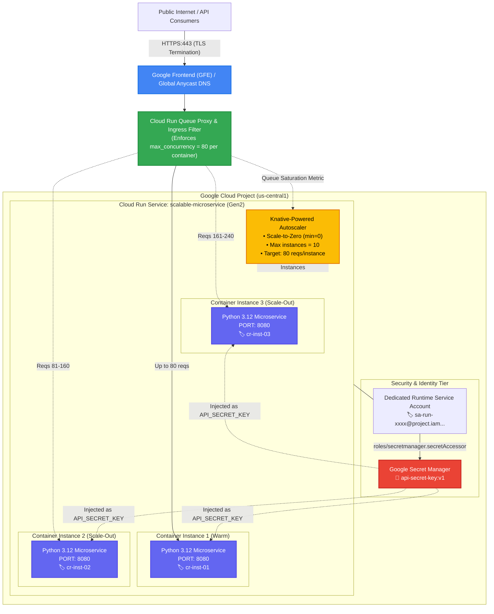
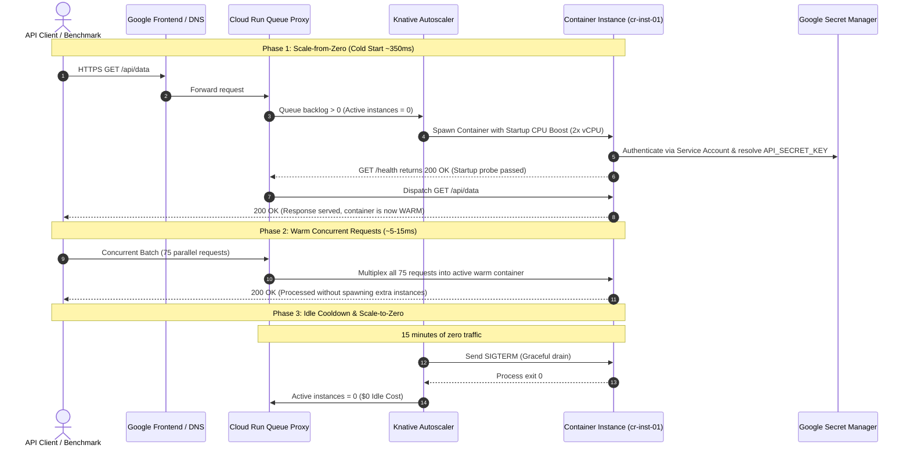
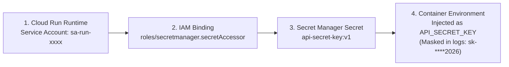

<!-- markdownlint-disable MD013 MD033 MD051 MD060 -->
# 07 - GCP Cloud Run Scalable Microservice

> A production-ready, serverless containerized microservice deployed to **Google Cloud Run (v2 API)** featuring **fine-grained concurrency tuning (80 reqs/instance)**, **true Scale-to-Zero ($0 idle cost)**, **Google Secret Manager integration**, **least-privilege IAM runtime service accounts**, **Startup CPU Boost**, a 100% offline Python Knative simulator, a local Docker Compose testbed, automated benchmarking (`benchmark_cloud_run.sh`), and complete Terraform / OpenTofu IaC manifests.

---

## 📋 Table of Contents

1. [Architectural Overview & Topology](#-architectural-overview--topology)
   - [Serverless Container Ingress & Autoscaling Architecture](#serverless-container-ingress--autoscaling-architecture)
   - [Concurrency-Based Multiplexing & Scale-Out Math](#concurrency-based-multiplexing--scale-out-math)
   - [Request Lifecycle & Cold Start Sequence](#request-lifecycle--cold-start-sequence)
   - [Secret Manager & Least-Privilege IAM Boundary](#secret-manager--least-privilege-iam-boundary)
2. [Theoretical Deep-Dive for Beginners](#-theoretical-deep-dive-for-beginners)
   - [What is Serverless Containerization? (Knative & gVisor)](#what-is-serverless-containerization-knative--gvisor)
   - [Scale-to-Zero vs Always-On (`min_instances = 0`)](#scale-to-zero-vs-always-on-min_instances--0)
   - [Concurrency Tuning: Cloud Run (80 req/container) vs AWS Lambda (1 req/worker)](#concurrency-tuning-cloud-run-80-reqcontainer-vs-aws-lambda-1-reqworker)
   - [Cold Starts, Initialization Phases & Startup CPU Boost](#cold-starts-initialization-phases--startup-cpu-boost)
   - [Google Secret Manager vs Plaintext Environment Variables](#google-secret-manager-vs-plaintext-environment-variables)
   - [IAM Least Privilege: Custom Service Account vs Default Compute SA](#iam-least-privilege-custom-service-account-vs-default-compute-sa)
   - [Ingress Control & IAM Invocation Security (`roles/run.invoker`)](#ingress-control--iam-invocation-security-rolesruninvoker)
   - [Revisions, Traffic Splitting & Blue/Green Deployments](#revisions-traffic-splitting--bluegreen-deployments)
   - [GCP Free Tier Best Practices & Cost Governance](#gcp-free-tier-best-practices--cost-governance)
3. [Repository & Directory Structure](#-repository--directory-structure)
4. [Prerequisites & Tooling](#-prerequisites--tooling)
5. [Quickstart Guide](#-quickstart-guide)
6. [Step-by-Step Hands-On Guide](#-step-by-step-hands-on-guide)
   - [Step 1: Run the 100% Offline Knative / Cloud Run Simulator](#step-1-run-the-100-offline-knative--cloud-run-simulator)
   - [Step 2: Start the Local Docker Microservice Environment](#step-2-start-the-local-docker-microservice-environment)
   - [Step 3: Execute Concurrency & Latency Benchmarks](#step-3-execute-concurrency--latency-benchmarks)
   - [Step 4: Verify Secret Manager Resolution & Masking](#step-4-verify-secret-manager-resolution--masking)
   - [Step 5: Run the End-to-End Automated Test Suite](#step-5-run-the-end-to-end-automated-test-suite)
   - [Step 6: Deploy to Google Cloud Platform via Terraform (Optional)](#step-6-deploy-to-google-cloud-platform-via-terraform-optional)
   - [Step 7: Benchmark Live GCP Cloud Run Endpoint](#step-7-benchmark-live-gcp-cloud-run-endpoint)
7. [Verification & Benchmark Test Matrix](#-verification--benchmark-test-matrix)
8. [Troubleshooting & Gotchas](#-troubleshooting--gotchas)
9. [Resource Teardown & Environment Cleanup](#-resource-teardown--environment-cleanup)

---

## 🏛️ Architectural Overview & Topology

Google Cloud Run is a managed compute platform that enables developers to run stateless containers directly on top of Google's scalable infrastructure without provisioning or managing virtual machines, Kubernetes clusters, or autoscaler daemon sets.

### Serverless Container Ingress & Autoscaling Architecture



### Concurrency-Based Multiplexing & Scale-Out Math

Unlike traditional FaaS (e.g. AWS Lambda) where each incoming request forces a new isolated execution environment, Google Cloud Run allows **multiple concurrent requests** inside a single container instance:

```text
┌─────────────────────────────────────────────────────────────────────────────┐
│                    Cloud Run Autoscaling Capacity Math                      │
├───────────────────────┬────────────────────────┬────────────────────────────┤
│ Concurrent Requests   │ Calculation Formula    │ Required Instances Spawned │
├───────────────────────┼────────────────────────┼────────────────────────────┤
│ 0 reqs (Idle)         │ min_instances = 0      │ 0 instances ($0 Cost)      │
│ 1 request             │ ceil(1 / 80)           │ 1 instance (Cold Start)    │
│ 75 requests           │ ceil(75 / 80)          │ 1 instance (Warm Reuse)    │
│ 160 requests          │ ceil(160 / 80)         │ 2 instances                │
│ 250 requests          │ ceil(250 / 80)         │ 4 instances                │
│ 850 requests          │ ceil(850 / 80) -> cap  │ 10 instances (max_size)    │
└───────────────────────┴────────────────────────┴────────────────────────────┘
```

### Request Lifecycle & Cold Start Sequence



### Secret Manager & Least-Privilege IAM Boundary



---

## 🧠 Theoretical Deep-Dive for Beginners

### What is Serverless Containerization? (Knative & gVisor)

Traditional serverless computing (Functions as a Service / FaaS) restricted developers to specific programming language runtimes, small zip file uploads, and rigid 1-request-per-invocation concurrency models.

**Google Cloud Run** is built on open-source **Knative Serving** standards and executes containers inside **gVisor** (a secure, lightweight application kernel sandbox). This provides:

- **Any Language or Binary**: Python, Go, Node.js, Rust, C++, Java, or custom Linux binaries.
- **Portability**: Standard Open Container Initiative (OCI) Docker images run identically locally on Docker and in the cloud.
- **Instant Elasticity**: Compute capacity scales automatically from 0 to hundreds of instances in seconds.

---

### Scale-to-Zero vs Always-On (`min_instances = 0`)

```text
❌ ALWAYS-ON VM / KUBERNETES NODE:
┌─────────────────────────────────────────────────────────┐
│ Fixed VM (2 vCPU, 4GB RAM) running 24/7/365             │
│   • Nighttime traffic: 0 requests / hour                │
│   ➔ RESULT: You pay $40 - $120/month even when idle!     │
└─────────────────────────────────────────────────────────┘

✅ SERVERLESS SCALE-TO-ZERO (min_instances = 0):
┌─────────────────────────────────────────────────────────┐
│ Cloud Run Container Instance                            │
│   • Traffic present : Billed per 100ms of CPU/RAM used  │
│   • Traffic idle    : 0 containers running ($0.00 bill) │
│   ➔ RESULT: 100% Free for personal & low-traffic apps   │
└─────────────────────────────────────────────────────────┘
```

---

### Concurrency Tuning: Cloud Run (80 req/container) vs AWS Lambda (1 req/worker)

In AWS Lambda, if 100 users make a request at the exact same second, AWS must provision **100 distinct Lambda execution environments**, triggering 100 cold starts and multiplying memory usage:

```text
AWS Lambda (Concurrency = 1):
  100 concurrent requests ➔ 100 isolated workers spawned ➔ 100x Memory footprint

Google Cloud Run (Concurrency = 80):
  100 concurrent requests ➔ ceil(100 / 80) = 2 containers ➔ 98% Fewer containers!
```

> [!TIP]
> Setting `max_instance_request_concurrency = 80` significantly lowers infrastructure costs and optimizes memory utilization for I/O-bound web microservices (APIs querying databases or external services).

---

### Cold Starts, Initialization Phases & Startup CPU Boost

1. **Cold Start**: When traffic arrives at a service with 0 running instances, Cloud Run must:
   - Download the container image layer from Artifact Registry.
   - Initialize the gVisor sandbox.
   - Start the container process (`CMD ["python3", "/app/main.py"]`).
   - Pass the startup health check probe (`/health`).
2. **Startup CPU Boost**: A Cloud Run feature enabled in this project (`startup_cpu_boost = true`) that temporarily doubles allocated vCPUs during container boot time, slashing cold start latency from ~2 seconds down to **sub-second times (~300-400ms)** at no extra cost.

---

### Google Secret Manager vs Plaintext Environment Variables

- **Insecure Approach**: Storing API keys, database passwords, or JWT secrets in plaintext in `variables.tf` or Docker environment files exposes credentials in version control, logs, and build artifacts.
- **Production Pattern**: Store sensitive values in **Google Secret Manager**. Cloud Run fetches the secret dynamically during container startup using native IAM service account credentials.

---

### IAM Least Privilege: Custom Service Account vs Default Compute SA

By default, GCP services often fall back to the default Compute Engine service account (`<project-number>-compute@developer.gserviceaccount.com`), which historically holds broad `Editor` permissions across the entire project.

**The DevOps / SRE Standard (Enforced in this project)**:

- Create a dedicated runtime Service Account: `sa-run-xxxx@<project-id>.iam.gserviceaccount.com`.
- Grant **ONLY** `roles/secretmanager.secretAccessor` for the specific secret.
- Deny all other GCP permissions.

---

### Ingress Control & IAM Invocation Security (`roles/run.invoker`)

Cloud Run allows granular access management:

- **Public Services (`allow_unauthenticated = true`)**: `roles/run.invoker` is granted to `allUsers`. Anyone on the public internet can send HTTP requests.
- **Private Microservices (`allow_unauthenticated = false`)**: Callers must provide an OpenID Connect (OIDC) identity token in the `Authorization: Bearer <ID_TOKEN>` header.

---

### Revisions, Traffic Splitting & Blue/Green Deployments

Each deployment to a Cloud Run service creates an immutable **Revision** (e.g. `scalable-microservice-00001-abc`). Cloud Run provides native **Traffic Splitting**:

- Route `90%` of traffic to stable `v1` and `10%` to canary `v2`.
- Instant rollback in $< 1$ second if error rates spike.

---

### GCP Free Tier Best Practices & Cost Governance

Google Cloud Run includes a generous **Always-Free Tier** renewed every month:

- **2 Million Requests / month** (100% Free)
- **360,000 GiB-seconds Memory / month** (100% Free)
- **180,000 vCPU-seconds Compute / month** (100% Free)
- **1 GB Ingress/Egress / month** (100% Free)

By keeping `min_instances = 0` and testing locally with the provided offline simulator and Docker container, this project can be learned and tested with **$0 cloud expenditure**.

---

## 📂 Repository & Directory Structure

```text
07-cloud-providers/07-gcp-cloud-run-microservice/
├── .gitignore                      # Git exclusion rules (state, keys, caches)
├── .tflint.hcl                     # TFLint linter ruleset for Terraform
├── README.md                       # Comprehensive educational documentation
├── benchmark_cloud_run.sh          # Performance, cold start & throughput benchmarking
├── cleanup.sh                      # Teardown script (Docker, images, volumes, GCP)
├── cloud_run_simulator.py          # 100% offline Knative & concurrency simulator
├── docker-compose.yml              # Local container execution environment
├── main.tf                         # Terraform: Cloud Run v2, Secret Manager, IAM
├── outputs.tf                      # Terraform outputs (URL, SA email, secret ID)
├── terraform.tfvars.example        # Variable configuration template
├── test_cloud_run.sh               # Master automated test runner
├── variables.tf                    # Input variable definitions and validations
├── versions.tf                     # Terraform and Google provider constraints
└── app/
    ├── Dockerfile                  # Lightweight Python 3.12 Alpine container
    └── main.py                     # Python microservice (health, concurrency, secrets)
```

---

## 🧰 Prerequisites & Tooling

| Tool | Version | Purpose | Required For |
| :--- | :--- | :--- | :--- |
| **Python** | `>= 3.10` | Runs offline Knative simulator & microservice | Offline & Local testing |
| **curl** | `>= 7.80` | Dispatches HTTP probes and benchmark load | Benchmarking |
| **jq** | `>= 1.6` | Formats JSON outputs in CLI | Terminal reporting |
| **Docker** | `>= 24.0` | Containerizes and runs microservice locally | Local Docker testing |
| **Terraform / OpenTofu** | `>= 1.5.0` | Provisions live Cloud Run & Secret Manager | Cloud deployment |
| **gcloud CLI** *(Optional)* | `>= 450.0` | Google Cloud CLI for authentication | Real GCP Cloud |

---

## ⚡ Quickstart Guide

Want to see the Cloud Run Concurrency & Scaling Engine in action in **under 5 seconds**?

```bash
# 1. Navigate to the project directory
cd 07-cloud-providers/07-gcp-cloud-run-microservice

# 2. Run the offline Knative & Cloud Run simulator
python3 cloud_run_simulator.py --verbose

# 3. Run the master test runner
./test_cloud_run.sh
```

---

## 📖 Step-by-Step Hands-On Guide

### Step 1: Run the 100% Offline Knative / Cloud Run Simulator

The simulator deterministically models Knative autoscaler math, cold starts, and concurrency boundaries without requiring GCP credentials:

```bash
# Run standard simulation
python3 cloud_run_simulator.py

# Run with verbose trace logging
python3 cloud_run_simulator.py --verbose

# Export findings to JSON report
python3 cloud_run_simulator.py --json-output test_report.json
```

---

### Step 2: Start the Local Docker Microservice Environment

Spin up the containerized microservice simulating Google Cloud Run execution parameters and environment variable bindings:

```bash
# Build and run container in background
docker compose up -d --build

# Verify container status
docker compose ps
```

Open `http://localhost:8080` in your browser to explore the interactive **Cloud Run Web Dashboard**.

---

### Step 3: Execute Concurrency & Latency Benchmarks

Use `benchmark_cloud_run.sh` to measure throughput, P50/P95/P99 latencies, and cold start differences:

```bash
# 1. Benchmark 50 requests across 10 concurrent threads
./benchmark_cloud_run.sh --url http://localhost:8080 --requests 50 --concurrency 10

# 2. Measure cold start vs warm request latency delta
./benchmark_cloud_run.sh --url http://localhost:8080 --cold-start

# 3. Simulate heavy backend workload with 100ms artificial delay
./benchmark_cloud_run.sh --url http://localhost:8080 --requests 30 --concurrency 5 --workload-delay 100
```

---

### Step 4: Verify Secret Manager Resolution & Masking

Verify that secret data is resolved and presented securely without leaking raw credentials:

```bash
./benchmark_cloud_run.sh --url http://localhost:8080 --test-secret
```

---

### Step 5: Run the End-to-End Automated Test Suite

Execute the master test suite to validate syntax, Terraform manifests, simulator assertions, and Docker integration:

```bash
./test_cloud_run.sh --verbose
```

---

### Step 6: Deploy to Google Cloud Platform via Terraform (Optional)

If you have a Google Cloud account and the `gcloud` CLI authenticated:

```bash
# 1. Authenticate with GCP
gcloud auth application-default login
gcloud config set project YOUR_PROJECT_ID

# 2. Copy and configure variables
cp terraform.tfvars.example terraform.tfvars
# Edit terraform.tfvars with your project_id

# 3. Initialize and apply Terraform
terraform init
terraform plan
terraform apply -auto-approve
```

---

### Step 7: Benchmark Live GCP Cloud Run Endpoint

Fetch your live HTTPS service URL from Terraform outputs and run benchmarks:

```bash
# Fetch live URL
SERVICE_URL=$(terraform output -raw service_url)

# Run high-concurrency benchmark against Google Cloud Run
./benchmark_cloud_run.sh --url "$SERVICE_URL" --requests 100 --concurrency 20 --cold-start --test-secret
```

---

## 🧪 Verification & Benchmark Test Matrix

The test runner validates 6 core architectural requirements:

| Test ID | Test Scenario | Category | Expected Behavior | Verification Assertions |
| :--- | :--- | :--- | :--- | :--- |
| `CR-01` | **Scale-to-Zero Idle State** | Serverless Lifecycle | 0 running containers during idle periods | `active_instances == 0`, $0 idle cost |
| `CR-02` | **Scale-from-Zero & Cold Start** | Cold Start Optimization | 1st request initiates cold container spinup | Latency measured $\approx 300\text{--}400\text{ ms}$, container marked warm |
| `CR-03` | **High Concurrency in 1 Container** | Concurrency Tuning | 75 concurrent requests served by 1 container | Assert instances spawned $= 1 \le 80\text{ limit}$ |
| `CR-04` | **Concurrency Scale-Out** | Autoscaling Math | 250 concurrent requests trigger scale to 4 containers | Capacity $= \lceil 250 / 80 \rceil = 4\text{ instances}$ |
| `CR-05` | **Secret Manager Integration** | Security & IAM | Secret resolved via IAM and masked in output | Assert masked string (`sk-****2026`) and SHA256 checksum |
| `CR-06` | **Idle Cooldown & Scale-to-Zero** | Cost Governance | Containers safely deprovisioned after idle period | Fleet capacity returns to `0` |

---

## 🔧 Troubleshooting & Gotchas

### 1. "HTTP 403 Forbidden on Cloud Run URL"

- **Cause**: Unauthenticated access is disabled (`allow_unauthenticated = false`) and the request lacks an `Authorization: Bearer $(gcloud auth print-identity-token)` header.
- **Solution**: Set `allow_unauthenticated = true` in `variables.tf` or provide an IAM identity token.

### 2. "Container Failed to Start / Startup Probe Failed"

- **Cause**: The application did not bind to `0.0.0.0:${PORT}` within the specified startup probe timeout.
- **Solution**: Ensure your server reads `os.environ.get("PORT", "8080")` and listens on `0.0.0.0` (not `127.0.0.1`).

### 3. "Permission Denied accessing Secret Manager"

- **Cause**: The Cloud Run Service Account lacks `roles/secretmanager.secretAccessor` permission on the secret.
- **Solution**: Check `google_secret_manager_secret_iam_member.sa_secret_access` in `main.tf`.

### 4. "High Cold Start Latency (> 3 seconds)"

- **Cause**: Large Docker image layers or heavy module imports during startup.
- **Solution**: Use lightweight Alpine base images (`python:3.12-alpine`) and enable `startup_cpu_boost = true`.

---

## 🧹 Resource Teardown & Environment Cleanup

To ensure your environment is completely clean and ready for the next mini-project, use `cleanup.sh`.

### Basic Teardown (Local Docker & Temporary Artifacts)

Stops background processes, removes local Docker containers, networks, images, volumes, and deletes test benchmark logs:

```bash
./cleanup.sh
```

### Complete Cloud Teardown & State Purge

Destroys all provisioned GCP cloud infrastructure (Cloud Run v2 service, Secret Manager secrets, IAM Service Accounts) and purges `.terraform/` and state files:

```bash
./cleanup.sh --all
```

---

### Verification of Clean State

Confirm that your workspace is clean:

```bash
# Check running containers (should be empty)
docker ps -a --filter "name=gcp-cloud-run"

# Check project directory
ls -la
```

Your environment is now completely clean and ready for the next mini-project! 🚀
