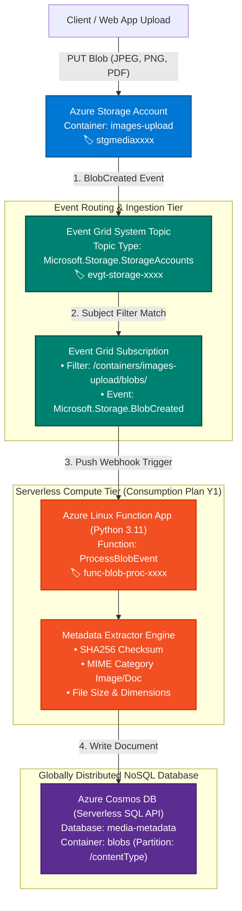
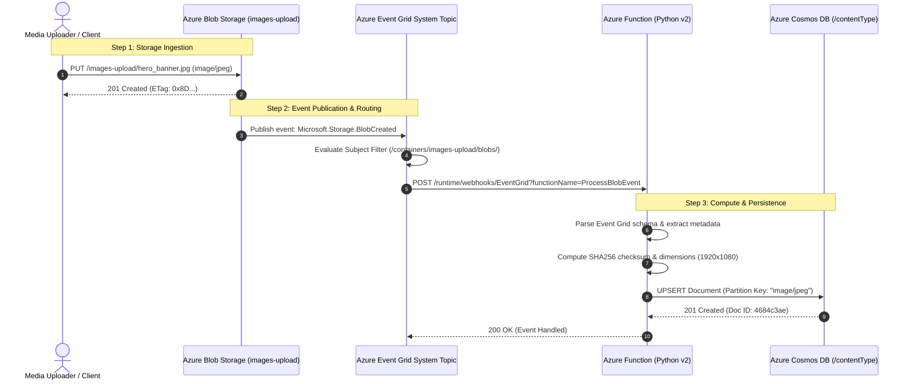

<!-- markdownlint-disable MD013 MD033 MD051 MD060 -->
# 08 - Azure Functions Event Grid Blob Processor

> A production-grade serverless event-driven processing pipeline on **Microsoft Azure**, integrating **Azure Blob Storage**, **Azure Event Grid System Topics**, **Azure Functions (Python v2 on Consumption Plan Y1)**, and **Azure Cosmos DB (Serverless SQL API with `/contentType` partitioning)**. Features a 100% offline Python Event Grid simulator, local Docker container environment, automated test ingestion suite (`upload_test_blobs.py`), and complete Terraform / OpenTofu IaC manifests.

---

## 📋 Table of Contents

1. [Architectural Overview & Topology](#-architectural-overview--topology)
   - [Event-Driven Serverless Pipeline Topology](#event-driven-serverless-pipeline-topology)
   - [Event Grid Push-Push Request Flow](#event-grid-push-push-request-flow)
   - [End-to-End Ingestion & Processing Sequence](#end-to-end-ingestion--processing-sequence)
   - [Cosmos DB Document Schema & Partitioning](#cosmos-db-document-schema--partitioning)
2. [Theoretical Deep-Dive for Beginners](#-theoretical-deep-dive-for-beginners)
   - [What is Event-Driven Architecture (EDA)?](#what-is-event-driven-architecture-eda)
   - [Azure Event Grid vs Service Bus vs Event Hubs](#azure-event-grid-vs-service-bus-vs-event-hubs)
   - [Push-Push Reactive Delivery vs Polling](#push-push-reactive-delivery-vs-polling)
   - [Event Grid Schema & CloudEvents 1.0 Standard](#event-grid-schema--cloudevents-10-standard)
   - [Subscription Validation Handshake (`SubscriptionValidationEvent`)](#subscription-validation-handshake-subscriptionvalidationevent)
   - [Subject Filtering: Path Prefix & Suffix Matching](#subject-filtering-path-prefix--suffix-matching)
   - [Azure Functions Serverless Model (Consumption Plan `Y1`)](#azure-functions-serverless-model-consumption-plan-y1)
   - [Cosmos DB Serverless Mode & Partition Key Strategy](#cosmos-db-serverless-mode--partition-key-strategy)
   - [Managed Identity & Azure Role-Based Access Control (RBAC)](#managed-identity--azure-role-based-access-control-rbac)
   - [Azure Free Tier Best Practices & Cost Governance](#azure-free-tier-best-practices--cost-governance)
3. [Repository & Directory Structure](#-repository--directory-structure)
4. [Prerequisites & Tooling](#-prerequisites--tooling)
5. [Quickstart Guide](#-quickstart-guide)
6. [Step-by-Step Hands-On Guide](#-step-by-step-hands-on-guide)
   - [Step 1: Run the 100% Offline Event Grid Simulator](#step-1-run-the-100-offline-event-grid-simulator)
   - [Step 2: Start the Local Docker Container Environment](#step-2-start-the-local-docker-container-environment)
   - [Step 3: Execute Test Blob Ingestion & Metadata Validation](#step-3-execute-test-blob-ingestion--metadata-validation)
   - [Step 4: Run the End-to-End Automated Test Suite](#step-4-run-the-end-to-end-automated-test-suite)
   - [Step 5: Deploy to Microsoft Azure with Terraform (Optional)](#step-5-deploy-to-microsoft-azure-with-terraform-optional)
   - [Step 6: Ingest Blobs & Query Cosmos DB in Live Azure Cloud](#step-6-ingest-blobs--query-cosmos-db-in-live-azure-cloud)
7. [Verification & Test Matrix](#-verification--test-matrix)
8. [Troubleshooting & Gotchas](#-troubleshooting--gotchas)
9. [Resource Teardown & Environment Cleanup](#-resource-teardown--environment-cleanup)

---

## 🏛️ Architectural Overview & Topology

In modern cloud systems, batch-processing media files via periodic polling cron jobs introduces unwanted latency, resource waste, and API throttling.

This project implements a **reactive, real-time event-driven pipeline** on Microsoft Azure. When a client uploads an image or document to **Azure Blob Storage**, a `Microsoft.Storage.BlobCreated` event is published to **Azure Event Grid**, which instantly triggers a serverless **Azure Function** to inspect the file header, calculate SHA256 checksums, and store structured metadata in **Azure Cosmos DB**:

### Event-Driven Serverless Pipeline Topology



### Event Grid Push-Push Request Flow

```text
┌─────────────────────────────────────────────────────────────────────────────┐
│                       Azure Event Grid Routing Matrix                       │
├─────────────────────┬──────────────────────────┬────────────────────────────┤
│ Blob Upload Subject │ Subject Filter Result    │ Action Taken               │
├─────────────────────┼──────────────────────────┼────────────────────────────┤
│ .../images-upload/  │ MATCH (Begins with prefix│ PUSH event to Function App │
│ hero_banner.jpg     │                          │ -> Processed in < 50ms     │
├─────────────────────┼──────────────────────────┼────────────────────────────┤
│ .../images-upload/  │ MATCH (Begins with prefix│ PUSH event to Function App │
│ brand_logo.png      │                          │ -> Processed in < 50ms     │
├─────────────────────┼──────────────────────────┼────────────────────────────┤
│ .../internal-logs/  │ NO MATCH (Prefix mismatch│ Event dropped immediately  │
│ access.log          │                          │ ($0 Function invocations)  │
└─────────────────────┴──────────────────────────┴────────────────────────────┘
```

### End-to-End Ingestion & Processing Sequence



### Cosmos DB Document Schema & Partitioning

```json
{
  "id": "4684c3ae-1f48-43d7-8d39-389178491c10",
  "blobName": "hero_landscape.jpg",
  "blobUrl": "https://stgmedia123.blob.core.windows.net/images-upload/hero_landscape.jpg",
  "storageContainer": "images-upload",
  "contentType": "image/jpeg",
  "mediaCategory": "image",
  "fileSizeBytes": 4106,
  "fileSizeReadable": "4.01 KB",
  "sha256": "f88734c4296d11f8b449...",
  "eTag": "0x8D9921471AA",
  "dimensions": {
    "width": 1920,
    "height": 1080,
    "aspectRatio": "16:9"
  },
  "eventGridEventId": "be71c123-4824-45e5-995e-7cc4215c81db",
  "processedAt": "2026-08-26T15:23:15.123Z",
  "status": "METADATA_EXTRACTED"
}
```

---

## 🧠 Theoretical Deep-Dive for Beginners

### What is Event-Driven Architecture (EDA)?

In a traditional request-response model, systems are tightly coupled: service A calls service B synchronously and waits for a response. If service B is slow or down, service A fails.

In **Event-Driven Architecture (EDA)**:

- **Producers (Publishers)** emit events announcing that something happened (*"A blob was created"*).
- **Brokers (Event Routers)** filter and deliver events to interested parties.
- **Consumers (Subscribers)** process events asynchronously without the producer knowing or caring who consumed the event.

---

### Azure Event Grid vs Service Bus vs Event Hubs

Microsoft Azure provides three messaging services tailored for distinct architectural requirements:

| Feature | Azure Event Grid | Azure Service Bus | Azure Event Hubs |
| :--- | :--- | :--- | :--- |
| **Primary Concept** | **Discrete Events (Reactive)** | **High-Value Enterprise Messaging** | **Big Data Telemetry Streaming** |
| **Delivery Model** | **Push-Push** (HTTP Webhooks) | **Pull** (Queue / Topic / Subscription) | **Pull / Partition-based Stream** |
| **Typical Payload** | Light ($< 64\text{ KB}$, notification only) | Full transaction message ($< 1\text{ MB}$) | High-throughput data stream (millions/sec) |
| **Key Use Case** | Storage triggers, IoT events, serverless glue | Financial transactions, order processing | Log analytics, clickstream data, IoT telemetry |
| **Ordering & Transactions** | No strict FIFO, at-least-once delivery | Strict FIFO, sessions, 2-phase transactions | Partition-based ordering |

---

### Push-Push Reactive Delivery vs Polling

```text
❌ OLD POLLING PATTERN (Wasteful & Slow):
┌─────────────────────────────────────────────────────────┐
│ Cron job runs every 60 seconds:                         │
│   "Are there new blobs? No." (Waste CPU / API costs)    │
│   "Are there new blobs? No."                            │
│   "Are there new blobs? Yes!" (Up to 60s delay!)        │
└─────────────────────────────────────────────────────────┘

✅ EVENT GRID REACTIVE PUSH-PUSH:
┌─────────────────────────────────────────────────────────┐
│ Storage emits event ➔ Event Grid pushes HTTP POST to    │
│ Function within 20 milliseconds. Zero wasted compute!   │
└─────────────────────────────────────────────────────────┘
```

---

### Event Grid Schema & CloudEvents 1.0 Standard

Azure Event Grid supports both the native **Event Grid Schema** and the CNCF **CloudEvents 1.0** open standard. The native schema structure contains:

- `topic`: Full ARM resource ID of the event source.
- `subject`: Specific resource path (e.g. `/blobServices/default/containers/images-upload/blobs/pic.jpg`).
- `eventType`: The action that occurred (`Microsoft.Storage.BlobCreated` or `Microsoft.Storage.BlobDeleted`).
- `eventTime`: ISO-8601 UTC timestamp.
- `id`: Globally unique GUID for deduplication.
- `data`: Source-specific dictionary (`url`, `contentType`, `contentLength`, `eTag`).

---

### Subscription Validation Handshake (`SubscriptionValidationEvent`)

To protect webhook endpoints from denial-of-service (DoS) and ensure that only authorized subscribers receive events, Azure Event Grid performs a **Handshake Validation** upon subscription creation:

1. Event Grid sends an HTTP POST containing:

   ```json
   {
     "eventType": "Microsoft.EventGrid.SubscriptionValidationEvent",
     "data": { "validationCode": "512d38b6-d7b8-40c8-8752-9f7396429db8" }
   }
   ```

2. The endpoint must synchronously return HTTP 200 with the validation code echoed back:

   ```json
   { "validationResponse": "512d38b6-d7b8-40c8-8752-9f7396429db8" }
   ```

This logic is implemented natively in `function/function_app.py`.

---

### Subject Filtering: Path Prefix & Suffix Matching

Event Grid subscriptions allow filtering at the broker layer before events reach compute:

- `subject_begins_with`: `/blobServices/default/containers/images-upload/blobs/` ensures that uploads to other containers (e.g., `temp-cache/` or `logs/`) do NOT trigger the Azure Function, preventing unnecessary execution charges.
- `subject_ends_with`: (Optional) Can filter strictly for image extensions like `.jpg` or `.png`.

---

### Azure Functions Serverless Model (Consumption Plan `Y1`)

- **Billed on Execution**: Pay only for execution time measured in gigabyte-seconds (GB-s) and total executions.
- **Scale-to-Zero**: When no events arrive, active instances scale to 0.
- **Automatic Scale-Out**: When 100 blobs are uploaded simultaneously, Event Grid dispatches 100 concurrent webhook calls; Azure Functions scales out instances automatically.

---

### Cosmos DB Serverless Mode & Partition Key Strategy

Azure Cosmos DB is a globally distributed, multi-model NoSQL database.

- **Serverless Tier**: Eliminates fixed hourly costs. You pay strictly per Request Unit (RU) consumed by read/write queries.
- **Partition Key (`/contentType`)**: Groups items by their MIME type (`image/jpeg`, `image/png`, `application/pdf`). Queries filtering by `contentType` hit a single physical partition, achieving sub-10ms point-reads at lowest RU cost.

---

### Managed Identity & Azure Role-Based Access Control (RBAC)

Rather than embedding storage connection strings or Cosmos DB master keys in code, production systems utilize **Azure Managed Identity**:

- The Azure Function gets a **System-Assigned Managed Identity**.
- Azure RBAC grants `Storage Blob Data Reader` on the Storage Account and `Cosmos DB Built-in Data Contributor` on Cosmos DB.
- Tokens are retrieved automatically via Azure Instance Metadata Service (IMDS).

---

### Azure Free Tier Best Practices & Cost Governance

Microsoft Azure provides generous **Free Tier allowances**:

- **Azure Functions**: 1 Million executions + 400,000 GB-seconds memory per month (Always Free).
- **Azure Event Grid**: 100,000 operations per month (Always Free).
- **Azure Cosmos DB**: 1,000 RU/s throughput + 25 GB storage free for the lifetime of the account.
- **Azure Blob Storage**: 5 GB LRS storage for the first 12 months.

---

## 📂 Repository & Directory Structure

```text
07-cloud-providers/08-azure-functions-eventgrid-processor/
├── .gitignore                      # Git exclusion rules (state, logs, temp blobs)
├── .tflint.hcl                     # TFLint linter ruleset
├── README.md                       # Comprehensive educational documentation
├── cleanup.sh                      # Teardown script (Docker, Azure, temp logs)
├── docker-compose.yml              # Local container execution environment
├── eventgrid_blob_simulator.py     # 100% offline deterministic Event Grid simulator
├── main.tf                         # Terraform: Storage, Cosmos DB, Event Grid, Function
├── outputs.tf                      # Terraform outputs (endpoints, database names)
├── terraform.tfvars.example        # Variable configuration template
├── test_eventgrid_processor.sh     # Master automated test runner
├── upload_test_blobs.py            # Test ingestion script & Cosmos DB validator
├── variables.tf                    # Input variable definitions and validations
├── versions.tf                     # Terraform and Azure provider constraints
└── function/
    ├── Dockerfile                  # Lightweight Python 3.11 Alpine container
    ├── function_app.py             # Azure Function code (Event Grid trigger & Cosmos writer)
    ├── host.json                   # Azure Functions host configuration
    └── requirements.txt            # Python SDK dependencies
```

---

## 🧰 Prerequisites & Tooling

| Tool | Version | Purpose | Required For |
| :--- | :--- | :--- | :--- |
| **Python** | `>= 3.10` | Runs offline simulator & test ingestion script | Offline & Local testing |
| **curl** | `>= 7.80` | Dispatches HTTP probes and queries | Health probes |
| **Docker** | `>= 24.0` | Runs local containerized Azure Function | Local Docker testing |
| **Terraform / OpenTofu** | `>= 1.5.0` | Provisions live Azure infrastructure | Cloud deployment |
| **Azure CLI (`az`)** *(Optional)* | `>= 2.50` | Azure authentication for cloud deployments | Real Azure Cloud |

---

## ⚡ Quickstart Guide

Want to run the complete Event Grid & Cosmos DB pipeline in **under 5 seconds**?

```bash
# 1. Navigate to the project directory
cd 07-cloud-providers/08-azure-functions-eventgrid-processor

# 2. Run the offline Event Grid simulator
python3 eventgrid_blob_simulator.py --verbose

# 3. Run the master test runner
./test_eventgrid_processor.sh
```

---

## 📖 Step-by-Step Hands-On Guide

### Step 1: Run the 100% Offline Event Grid Simulator

The simulator models Blob Storage uploads, Event Grid filtering, validation handshakes, metadata calculation, and Cosmos DB document storage with 0 cloud dependencies:

```bash
# Run standard simulation
python3 eventgrid_blob_simulator.py

# Run with verbose trace logs
python3 eventgrid_blob_simulator.py --verbose

# Export findings to JSON report
python3 eventgrid_blob_simulator.py --json-output test_report.json
```

---

### Step 2: Start the Local Docker Container Environment

Spin up the local containerized Azure Function:

```bash
# Build and start container in background
docker compose up -d --build

# Verify container health
docker compose ps
```

Open `http://localhost:8080` in your web browser to view the interactive **Azure Function Web Dashboard**.

---

### Step 3: Execute Test Blob Ingestion & Metadata Validation

Use `upload_test_blobs.py` to ingest synthetic test files (JPEG, PNG, PDF, WebP) and assert Cosmos DB metadata extraction:

```bash
# 1. Ingest 4 test media blobs
python3 upload_test_blobs.py --url http://localhost:8080 --count 4

# 2. Query Cosmos DB endpoint directly for stored documents
curl -s http://localhost:8080/api/metadata | jq .
```

---

### Step 4: Run the End-to-End Automated Test Suite

Execute the master test suite to validate syntax, Terraform manifests, offline simulation assertions, and Docker integration:

```bash
./test_eventgrid_processor.sh --verbose
```

---

### Step 5: Deploy to Microsoft Azure with Terraform (Optional)

If you have an active Azure subscription and Azure CLI configured (`az login`):

```bash
# 1. Copy and configure variables
cp terraform.tfvars.example terraform.tfvars

# 2. Initialize and apply Terraform
terraform init
terraform plan
terraform apply -auto-approve
```

---

### Step 6: Ingest Blobs & Query Cosmos DB in Live Azure Cloud

Fetch your live Azure Function endpoint and run the ingestion tool against Azure:

```bash
# Fetch live endpoint
FUNC_URL=$(terraform output -raw function_default_hostname)

# Ingest test blobs to live Azure Function
python3 upload_test_blobs.py --url "$FUNC_URL" --count 4
```

---

## 🧪 Verification & Test Matrix

The test runner validates 6 core architectural requirements:

| Test ID | Test Scenario | Category | Expected Behavior | Verification Assertions |
| :--- | :--- | :--- | :--- | :--- |
| `AZ-01` | **Storage Blob Creation & Event** | Storage Source | Blob uploaded & `Microsoft.Storage.BlobCreated` event generated | Assert event type, length, and blob URL match |
| `AZ-02` | **Webhook Handshake Validation** | Event Grid Protocol | Echo `validationResponse == validationCode` | Synchronous HTTP 200 handshake response |
| `AZ-03` | **Subject Prefix Filtering** | Event Filtering | Blobs in `images-upload` routed; other containers dropped | Filter `/containers/images-upload/blobs/` |
| `AZ-04` | **Media Metadata Extraction** | Serverless Compute | Extract category (`image`), dimensions, and SHA256 | Assert SHA256 checksum and metadata dictionary |
| `AZ-05` | **Cosmos DB Document Persistence** | Data Persistence | Record written to Cosmos DB container partitioned by `/contentType` | Point-query document by partition key |
| `AZ-06` | **Dead-Letter & Retry Policy** | Fault Tolerance | Failed events routed to Dead-Letter Queue upon retry exhaustion | Dead-letter item logged on failure |

---

## 🔧 Troubleshooting & Gotchas

### 1. "Event Grid Webhook Validation Handshake Failed (HTTP 400)"

- **Cause**: The Azure Function did not return the `validationResponse` JSON payload during subscription creation.
- **Solution**: Ensure your function checks for `eventType == "Microsoft.EventGrid.SubscriptionValidationEvent"` and returns `{"validationResponse": validationCode}`.

### 2. "Cosmos DB Partition Key Mismatch"

- **Cause**: The container was created with `partition_key_paths = ["/contentType"]`, but the document JSON was missing the `contentType` property.
- **Solution**: Always include `"contentType": "image/jpeg"` (or equivalent) in the document body.

### 3. "BlobCreated Event Delay / Missing Invocations"

- **Cause**: Event Grid subscription filter mismatch or case-sensitivity issue in subject prefix.
- **Solution**: Set `case_sensitive = false` in `azurerm_eventgrid_system_topic_event_subscription.subject_filter`.

### 4. "Permission Denied accessing Storage / Cosmos DB"

- **Cause**: RBAC role assignment takes up to 2-3 minutes to propagate in Azure AD.
- **Solution**: Verify Managed Identity role assignments (`Storage Blob Data Reader` and `Cosmos DB Built-in Data Contributor`).

---

## 🧹 Resource Teardown & Environment Cleanup

To ensure your environment is completely clean and ready for the next mini-project, use `cleanup.sh`.

### Basic Teardown (Local Docker & Temporary Artifacts)

Stops background processes, removes local Docker containers, networks, images, volumes, and deletes test logs:

```bash
./cleanup.sh
```

### Complete Cloud Teardown & State Purge

Destroys all provisioned Azure cloud infrastructure (Resource Group, Storage Account, Cosmos DB, Event Grid, Function App) and purges `.terraform/` and state files:

```bash
./cleanup.sh --all
```

---

### Verification of Clean State

Confirm that your workspace is clean:

```bash
# Check running containers (should be empty)
docker ps -a --filter "name=azure"

# Check project directory
ls -la
```

Your environment is now completely clean and ready for the next mini-project! 🚀
