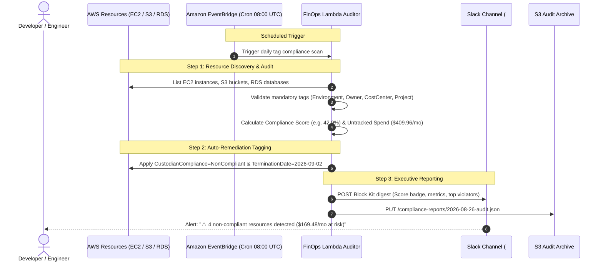

<!-- markdownlint-disable MD013 MD033 MD051 MD060 -->
# 09 - Cloud Cost Governance and Tag Compliance Engine

> A production-grade **FinOps Cloud Cost Governance & Tag Compliance Engine** built on **AWS** and **Cloud Custodian (c7n)**. Continuously scans, audits, and enforces mandatory billing tags (`Environment`, `Owner`, `CostCenter`, `Project`) across **Amazon EC2, S3, and RDS**, quantifies untracked cloud financial risk ($/month), applies automated remediation with grace periods, and generates executive Slack digests and S3 compliance archives. Includes a 100% offline Python simulator, local Docker container environment, synthetic workload generator (`provision_untagged_resources.sh`), and complete Terraform / OpenTofu IaC.

---

## 📋 Table of Contents

1. [Architectural Overview & Topology](#-architectural-overview--topology)
   - [FinOps Governance & Tagging Pipeline](#finops-governance--tagging-pipeline)
   - [Tag Compliance Lifecycle & State Machine](#tag-compliance-lifecycle--state-machine)
   - [Automated Audit & Notification Sequence](#automated-audit--notification-sequence)
   - [Executive Slack Digest & Compliance Schema](#executive-slack-digest--compliance-schema)
2. [Theoretical Deep-Dive for Beginners](#-theoretical-deep-dive-for-beginners)
   - [What is FinOps & Cloud Cost Governance?](#what-is-finops--cloud-cost-governance)
   - [The Critical Role of Mandatory Billing Tags](#the-critical-role-of-mandatory-billing-tags)
   - [Tag Taxonomies, Schema Validation & Regex Rules](#tag-taxonomies-schema-validation--regex-rules)
   - [Cloud Custodian Architecture & Declarative YAML Policies](#cloud-custodian-architecture--declarative-yaml-policies)
   - [Automated Remediation Lifecycle: Audit vs Enforce](#automated-remediation-lifecycle-audit-vs-enforce)
   - [Cloud Custodian vs AWS Config vs AWS Organizations SCPs](#cloud-custodian-vs-aws-config-vs-aws-organizations-scps)
   - [AWS Cost Allocation Tags & Cost Categories](#aws-cost-allocation-tags--cost-categories)
   - [Amazon EventBridge Scheduled & Event-Driven Triggers](#amazon-eventbridge-scheduled--event-driven-triggers)
   - [Serverless Auditor on AWS Lambda & Least-Privilege IAM](#serverless-auditor-on-aws-lambda--least-privilege-iam)
   - [Key FinOps Metrics: Compliance Score & Untracked Spend](#key-finops-metrics-compliance-score--untracked-spend)
3. [Repository & Directory Structure](#-repository--directory-structure)
4. [Prerequisites & Tooling](#-prerequisites--tooling)
5. [Quickstart Guide](#-quickstart-guide)
6. [Step-by-Step Hands-On Guide](#-step-by-step-hands-on-guide)
   - [Step 1: Run the 100% Offline FinOps Simulator](#step-1-run-the-100-offline-finops-simulator)
   - [Step 2: Start the Local Docker Container & Web Dashboard](#step-2-start-the-local-docker-container--web-dashboard)
   - [Step 3: Provision Test Resources & Trigger Compliance Audit](#step-3-provision-test-resources--trigger-compliance-audit)
   - [Step 4: Run the End-to-End Automated Test Suite](#step-4-run-the-end-to-end-automated-test-suite)
   - [Step 5: Deploy to Amazon Web Services with Terraform (Optional)](#step-5-deploy-to-amazon-web-services-with-terraform-optional)
   - [Step 6: Execute Live AWS Cloud Scans & S3 Report Archiving](#step-6-execute-live-aws-cloud-scans--s3-report-archiving)
7. [Verification & Test Matrix](#-verification--test-matrix)
8. [Troubleshooting & Gotchas](#-troubleshooting--gotchas)
9. [Resource Teardown & Environment Cleanup](#-resource-teardown--environment-cleanup)

---

## 🏛️ Architectural Overview & Topology

In enterprise cloud environments, untagged resources represent a significant **financial and operational blind spot**. When resources lack ownership or cost center tags, finance teams cannot allocate monthly invoices, identify project spend, or detect orphaned development instances running 24/7.

This project implements an **automated FinOps governance engine** that continuously audits AWS resources against strict tagging policies, estimates untracked monthly cloud spend, marks non-compliant resources with a remediation grace period, and notifies stakeholders via Slack and Amazon SNS:

### FinOps Governance & Tagging Pipeline

```mermaid
flowchart TD
    subgraph TRIGGERS ["Audit Trigger Mechanisms"]
        CRON["Amazon EventBridge Rule<br/>(Scheduled: cron 0 8 * * ? *)"]
        EVENT["CloudTrail / EventBridge<br/>(Reactive: EC2 RunInstances / S3 Create)"]
        CLI["Local CLI / CI/CD Gate<br/>(Docker & Simulator Engine)"]
    end

    subgraph FINOPS_ENGINE ["FinOps Governance & Tag Engine"]
        LAMBDA["AWS Lambda Auditor<br/>(Python 3.11 Serverless Engine)<br/>🏷️ cost-governance-auditor"]
        CUSTODIAN["Cloud Custodian (c7n)<br/>Declarative YAML Policies"]
        RULES["Tag Policy Validator:<br/>• Environment (prod/stage/dev/sandbox)<br/>• Owner (valid email format)<br/>• CostCenter (CC-XXXX)<br/>• Project (slug identifier)"]
    end

    subgraph AWS_ESTATE ["Audited Cloud Resources"]
        EC2["Amazon EC2 & EBS<br/>🏷️ Instances & Volumes"]
        S3["Amazon S3<br/>🏷️ Storage Buckets"]
        RDS["Amazon RDS<br/>🏷️ DB Instances & Clusters"]
    end

    subgraph REMEDIATION_TIER ["Remediation & Executive Digest Tier"]
        TAG["Automated Remediation Tagging:<br/>• CustodianCompliance=NonCompliant<br/>• TerminationDate=YYYY-MM-DD"]
        SLACK["Slack Executive Digest<br/>(Block Kit Cards with Severity Badges)"]
        SNS["Amazon SNS Topic<br/>(FinOps Team Alerts)"]
        S3_LOGS["S3 Audit Log Archive<br/>(Encrypted JSON Reports)"]
    end

    CRON --> LAMBDA
    EVENT --> LAMBDA
    CLI --> FINOPS_ENGINE
    LAMBDA --> RULES
    CUSTODIAN --> RULES
    LAMBDA --> |"1. Scan Tags"| EC2
    LAMBDA --> |"1. Scan Tags"| S3
    LAMBDA --> |"1. Scan Tags"| RDS
    CUSTODIAN --> |"Audit & Filter"| EC2
    CUSTODIAN --> |"Audit & Filter"| S3
    CUSTODIAN --> |"Audit & Filter"| RDS
    LAMBDA --> |"2. Tag Non-Compliant"| TAG
    LAMBDA --> |"3. Dispatch Webhook"| SLACK
    LAMBDA --> |"4. Publish Alert"| SNS
    LAMBDA --> |"5. Archive JSON"| S3_LOGS

    style CRON fill:#008272,stroke:#004e45,stroke-width:2px,color:#fff
    style LAMBDA fill:#f25022,stroke:#d83b01,stroke-width:2px,color:#fff
    style CUSTODIAN fill:#0078d4,stroke:#005a9e,stroke-width:2px,color:#fff
    style RULES fill:#5c2d91,stroke:#4b1f77,stroke-width:2px,color:#fff
    style EC2 fill:#ff9900,stroke:#d98200,stroke-width:2px,color:#fff
    style S3 fill:#527fff,stroke:#3b5ecc,stroke-width:2px,color:#fff
    style RDS fill:#3b48cc,stroke:#2b3599,stroke-width:2px,color:#fff
    style SLACK fill:#4a154b,stroke:#350d36,stroke-width:2px,color:#fff
```



---

### Tag Compliance Lifecycle & State Machine

```text
┌─────────────────────────────────────────────────────────────────────────────┐
│                    FinOps Tag Compliance State Machine                      │
└─────────────────────────────────────────────────────────────────────────────┘

  [New Resource Created]
           │
           ▼
  ┌──────────────────┐
  │  Daily Tag Scan  │ ──(All mandatory tags valid)──► [🟢 STATUS: COMPLIANT]
  └──────────────────┘                                  (100% Cost Allocated)
           │
           │ (Missing tag / Invalid enum / Bad regex)
           ▼
  ┌────────────────────────────────────────┐
  │ 🟡 STATUS: NON-COMPLIANT               │
  │ • Apply CustodianCompliance=NonCompliant│
  │ • Apply TerminationDate = Today + 7d   │
  │ • Send Slack Alert to Team             │
  └────────────────────────────────────────┘
           │
           ├──────────────────────────────┐
           │ (Owner fixes tags within 7d)  │ (Grace period expires without fix)
           ▼                              ▼
  [🟢 STATUS: COMPLIANT]         ┌─────────────────────────────────┐
  (Remediation tags removed)     │ 🔴 ACTION: AUTO-REMEDIATION     │
                                 │ • Stop dev/staging EC2 instances│
                                 │ • Schedule unattached EBS purge │
                                 │ • Escalate to Engineering Lead  │
                                 └─────────────────────────────────┘
```

---

### Automated Audit & Notification Sequence



---

### Executive Slack Digest & Compliance Schema

```json
{
  "timestamp": "2026-08-26T15:57:32Z",
  "summary": {
    "total_resources": 7,
    "compliant_resources": 3,
    "non_compliant_resources": 4,
    "compliance_score_percent": 42.9,
    "total_estimated_monthly_spend_usd": 704.08,
    "untracked_at_risk_spend_usd": 409.96,
    "untracked_spend_percent": 58.2
  },
  "service_breakdown": {
    "ec2": { "total": 3, "compliant": 1, "untracked_cost": 275.36 },
    "s3": { "total": 2, "compliant": 1, "untracked_cost": 85.00 },
    "rds": { "total": 2, "compliant": 1, "untracked_cost": 49.60 }
  }
}
```

---

## 🧠 Theoretical Deep-Dive for Beginners

### What is FinOps & Cloud Cost Governance?

**FinOps (Cloud Financial Operations)** is an operational cultural framework that brings financial accountability to the variable spend model of cloud computing. Instead of IT procurement buying static hardware every 3-5 years, engineering teams provision virtual machines, serverless functions, and storage on demand.

**Cloud Cost Governance** ensures that:

1. **Every dollar is attributed**: No resource exists in the cloud without a designated owner, business project, and cost center.
2. **Waste is detected early**: Idle test instances and unattached storage volumes are automatically flagged.
3. **Guardrails are continuous**: Rather than waiting for the monthly AWS bill, compliance is audited hourly or daily.

---

### The Critical Role of Mandatory Billing Tags

Tags are **key-value metadata pairs** assigned to cloud resources. The four foundational tags enforced by this engine are:

| Tag Key | Expected Value Format | Purpose & FinOps Impact |
| :--- | :--- | :--- |
| `Environment` | `production`, `staging`, `development`, `sandbox` | Separates production SLA spend from R&D experimentation; enables off-hours auto-stop policies. |
| `Owner` | Valid Email (`sre-team@company.com`) | Identifies the technical contact responsible for lifecycle management and cost alerts. |
| `CostCenter` | `CC-1001`, `CC-2002` | Used by corporate accounting for cost center chargeback/showback reports. |
| `Project` | Lowercase slug (`storefront-api`) | Maps cloud infrastructure directly to product roadmaps and business initiatives. |

---

### Tag Taxonomies, Schema Validation & Regex Rules

Common tagging pitfalls in organizations include:

- **Case-sensitivity drift**: `environment` vs `Environment` vs `Env`.
- **Typo-ridden values**: `prod`, `production`, `Production`, `PRD`.
- **Anonymous handles**: `owner: test` instead of an actionable email address.

This engine enforces strict **schema validation**:

- `Environment` must match the exact lowercase enum: `["production", "staging", "development", "sandbox"]`.
- `Owner` must pass email regex: `^[a-zA-Z0-9_.+-]+@[a-zA-Z0-9-]+\.[a-zA-Z0-9-.]+$`.
- `CostCenter` must match standard accounting format: `^CC-\d{3,6}$`.

---

### Cloud Custodian Architecture & Declarative YAML Policies

**Cloud Custodian (`c7n`)** is a CNCF open-source rules engine for cloud security, governance, and cost optimization. Instead of writing thousands of lines of bespoke script code, Cloud Custodian uses **declarative YAML policies**:

```yaml
policies:
  - name: ec2-tag-compliance-audit
    resource: aws.ec2
    filters:
      - or:
          - "tag:Environment": absent
          - "tag:Owner": absent
          - "tag:CostCenter": absent
          - "tag:Project": absent
    actions:
      - type: tag
        tags:
          CustodianCompliance: "NonCompliant"
```

Cloud Custodian translates this YAML into optimized AWS API calls with built-in client rate-limiting and pagination.

---

### Automated Remediation Lifecycle: Audit vs Enforce

```text
┌─────────────────────────────────────────────────────────┐
│                    Remediation Modes                    │
├──────────────────────────┬──────────────────────────────┤
│ 1. Audit Only (Dry-Run)  │ Scans resources and generates│
│                          │ reports. Zero cloud mutation.│
├──────────────────────────┼──────────────────────────────┤
│ 2. Tag & Notify          │ Applies warning tags and     │
│    (Grace Period)        │ sets a 7-day expiration date.│
├──────────────────────────┼──────────────────────────────┤
│ 3. Active Enforcement    │ Stops untagged dev EC2 nodes;│
│                          │ purges orphan EBS volumes.   │
└──────────────────────────┴──────────────────────────────┘
```

---

### Cloud Custodian vs AWS Config vs AWS Organizations SCPs

| Capability | Cloud Custodian | AWS Config Rules | AWS Organizations SCPs |
| :--- | :--- | :--- | :--- |
| **Execution Model** | Stateless (Cron / Lambda / CLI) | State recording & snapshot rules | Preventive IAM authorization gate |
| **Cost** | Free (Open Source) | Charged per configuration item recorded | Free with AWS Organizations |
| **Remediation** | Native declarative actions (`tag`, `stop`, `delete`) | Requires Systems Manager Automation | Preventive only (blocks API call) |
| **Multi-Cloud** | AWS, Azure, GCP supported | AWS only | AWS only |

---

### AWS Cost Allocation Tags & Cost Categories

When tags are created in AWS, they are not automatically included in billing reports:

1. You must navigate to **AWS Billing Console ➔ Cost Allocation Tags**.
2. Activate `Environment`, `Owner`, `CostCenter`, and `Project` as **User-Defined Cost Allocation Tags**.
3. AWS Cost Explorer and AWS Cost & Usage Reports (CUR) will begin breaking down spend by these dimensions within 24 hours.

---

### Amazon EventBridge Scheduled & Event-Driven Triggers

The FinOps auditor supports two execution models:

- **Scheduled Governance (Batch)**: An EventBridge rule (`cron(0 8 * * ? *)`) triggers the Lambda function every morning at 08:00 UTC to evaluate the entire fleet.
- **Reactive Governance (Real-Time)**: AWS CloudTrail events (e.g. `RunInstances`, `CreateBucket`) trigger EventBridge rules within seconds of resource creation, allowing immediate notification before costs accumulate.

---

### Serverless Auditor on AWS Lambda & Least-Privilege IAM

The engine executes in **AWS Lambda** (Python 3.11) with a strictly scoped IAM role:

- `tag:GetResources`, `tag:TagResources`: Tag query and update permissions.
- `ec2:Describe*`, `ec2:CreateTags`: EC2 and EBS tagging.
- `s3:GetBucketTagging`, `s3:PutBucketTagging`: S3 tagging.
- `rds:ListTagsForResource`, `rds:AddTagsToResource`: RDS tagging.
- `s3:PutObject` on the audit archive bucket.
- `sns:Publish` on the alert topic.

---

### Key FinOps Metrics: Compliance Score & Untracked Spend

The governance engine calculates two core key performance indicators (KPIs):

$$\text{FinOps Compliance Score} = \left( \frac{\text{Compliant Resources}}{\text{Total Resources}} \right) \times 100\%$$

$$\text{Untracked Spend Risk} = \sum \text{Monthly Spend of Non-Compliant Assets}$$

---

## 📂 Repository & Directory Structure

```text
07-cloud-providers/09-cloud-cost-tagging-governance-engine/
├── .gitignore                          # Git exclusion rules (state, logs, caches)
├── .tflint.hcl                         # TFLint configuration for AWS ruleset
├── README.md                           # Comprehensive educational documentation
├── cleanup.sh                          # Full environment teardown script
├── docker-compose.yml                  # Local Docker Compose governance stack
├── governance_simulator.py             # 100% offline deterministic FinOps simulator
├── main.tf                             # Terraform: Lambda, IAM, EventBridge, S3, SNS
├── outputs.tf                          # Terraform outputs (Lambda ARN, S3 bucket)
├── provision_untagged_resources.sh     # Synthetic workload generator for tag testing
├── terraform.tfvars.example            # Example variable definitions
├── test_governance_engine.sh           # Master automated test runner
├── variables.tf                        # Terraform input variables & validations
├── versions.tf                         # Terraform & AWS provider constraints
├── engine/
│   ├── Dockerfile                      # Lightweight Alpine container for local engine
│   ├── lambda_function.py              # FinOps Lambda handler & standalone web server
│   └── requirements.txt                # Python dependencies (boto3, c7n, urllib3)
└── policies/
    ├── custodian_master.yml            # Unified Cloud Custodian master policy
    ├── ec2_tag_compliance.yml          # EC2 & EBS tagging rules
    ├── rds_tag_compliance.yml          # RDS database tagging rules
    └── s3_tag_compliance.yml           # S3 bucket tagging rules
```

---

## 🧰 Prerequisites & Tooling

| Tool | Version | Purpose | Required For |
| :--- | :--- | :--- | :--- |
| **Python** | `>= 3.10` | Runs offline simulator & FinOps engine | Offline & Local testing |
| **curl** | `>= 7.80` | Dispatches REST audit and health probes | Local testing |
| **Docker** | `>= 24.0` | Runs local containerized governance stack | Local Docker testing |
| **Terraform / OpenTofu** | `>= 1.5.0` | Provisions AWS Lambda & EventBridge IaC | Cloud deployment |
| **AWS CLI (`aws`)** *(Optional)* | `>= 2.10` | AWS authentication for cloud deployments | Real AWS Cloud |

---

## ⚡ Quickstart Guide

Run the full FinOps governance simulation in **under 5 seconds**:

```bash
# 1. Navigate to the project directory
cd 07-cloud-providers/09-cloud-cost-tagging-governance-engine

# 2. Run the offline FinOps simulator
python3 governance_simulator.py --verbose

# 3. Run the master test runner
./test_governance_engine.sh
```

---

## 📖 Step-by-Step Hands-On Guide

### Step 1: Run the 100% Offline FinOps Simulator

The offline simulator executes without AWS credentials, asserting all 6 compliance test cases:

```bash
# Standard test run
python3 governance_simulator.py

# Verbose trace mode
python3 governance_simulator.py --verbose

# Export JSON summary report
python3 governance_simulator.py --json-output test_report.json
```

---

### Step 2: Start the Local Docker Container & Web Dashboard

Spin up the containerized governance engine with built-in web dashboard:

```bash
# Build and launch container in background
docker compose up -d --build

# Verify container health
docker compose ps
```

Open `http://localhost:8080` in your web browser to explore the interactive **FinOps Tag Governance Dashboard**.

---

### Step 3: Provision Test Resources & Trigger Compliance Audit

Use `provision_untagged_resources.sh` to inject synthetic compliant and non-compliant cloud workloads:

```bash
# Trigger compliance audit against local Docker engine
./provision_untagged_resources.sh --url http://localhost:8080

# Query compliance JSON directly
curl -s http://localhost:8080/api/compliance | jq .summary
```

---

### Step 4: Run the End-to-End Automated Test Suite

Execute the master test suite to validate syntax, Terraform IaC, offline simulation assertions, and Docker integration:

```bash
./test_governance_engine.sh --verbose
```

---

### Step 5: Deploy to Amazon Web Services with Terraform (Optional)

If you have configured AWS credentials (`aws configure`):

```bash
# 1. Copy variable template
cp terraform.tfvars.example terraform.tfvars

# 2. Initialize and deploy infrastructure
terraform init
terraform plan
terraform apply -auto-approve
```

---

### Step 6: Execute Live AWS Cloud Scans & S3 Report Archiving

Trigger the deployed AWS Lambda function to scan your actual AWS account:

```bash
# Fetch Lambda function name
LAMBDA_NAME=$(terraform output -raw lambda_function_name)

# Invoke Lambda via AWS CLI
aws lambda invoke --function-name "$LAMBDA_NAME" response.json
cat response.json | jq .
```

---

## 🧪 Verification & Test Matrix

The test runner asserts 6 core governance test cases:

| Test ID | Test Scenario | Category | Expected Behavior | Verification Assertions |
| :--- | :--- | :--- | :--- | :--- |
| `GOV-01` | **Multi-Service Discovery** | Discovery & Ingestion | Discover EC2, S3, and RDS resources across accounts | Enumerate assets across all three service APIs |
| `GOV-02` | **Mandatory Tag Presence** | Policy Enforcement | Detect resources missing `Environment`, `Owner`, `CostCenter` | Assert 3 non-compliant items flagged |
| `GOV-03` | **Syntax & Enum Validation** | Data Quality | Catch invalid enum (`local_dev`), bad email, and bad CostCenter | Assert 3 syntax errors caught on test node |
| `GOV-04` | **FinOps Spend Attribution** | FinOps Metrics | Compute compliance score (42.9%) and untracked spend | Quantify unallocated risk spend ($409.96/mo) |
| `GOV-05` | **Auto-Remediation Tagging** | Auto-Remediation | Apply `CustodianCompliance` and `TerminationDate` | Assert 7-day grace window applied to violators |
| `GOV-06` | **Executive Report Export** | Reporting & Alerting | Generate structured JSON audit log and Slack cards | Assert valid JSON report and executive metrics |

---

## 🔧 Troubleshooting & Gotchas

### 1. "Tag Key Case Sensitivity Mismatches"

- **Cause**: An engineer tagged an EC2 instance with `environment=production` (lowercase `e`), but the policy expects `Environment`.
- **Solution**: Standardize on PascalCase (`Environment`, `Owner`, `CostCenter`, `Project`) and use Cloud Custodian filters to normalize keys.

### 2. "S3 Bucket Tagging Permission Error (AccessDenied)"

- **Cause**: The IAM role lacks `s3:GetBucketTagging` or `s3:PutBucketTagging`.
- **Solution**: Ensure your Lambda IAM policy grants `s3:GetBucketTagging` and `s3:PutBucketTagging` on `arn:aws:s3:::*`.

### 3. "EventBridge Schedule Timezone Confusion"

- **Cause**: EventBridge cron expressions always evaluate in **UTC**, not your local system timezone.
- **Solution**: `cron(0 8 * * ? *)` fires at 08:00 UTC (05:00 ART / 04:00 EDT).

### 4. "Slack Webhook Rate Limiting"

- **Cause**: Sending a separate Slack message for each individual non-compliant resource causes Slack API throttling (HTTP 429).
- **Solution**: Aggregate all non-compliant resources into a single daily executive digest using Slack Block Kit.

---

## 🧹 Resource Teardown & Environment Cleanup

To ensure your environment is completely clean and ready for the next mini-project, use `cleanup.sh`.

### Basic Teardown (Local Docker & Temporary Artifacts)

Stops background processes, removes local Docker containers, images, volumes, and deletes test reports:

```bash
./cleanup.sh
```

### Complete Cloud Teardown & State Purge

Destroys all provisioned AWS cloud infrastructure (Lambda, EventBridge, S3 audit bucket, SNS) and purges `.terraform/` cache and state files:

```bash
./cleanup.sh --all
```

---

### Verification of Clean State

Confirm that your workspace is clean:

```bash
# Check running containers (should be empty)
docker ps -a --filter "name=finops"

# Check project directory
ls -la
```

Your environment is now completely clean and ready for the next mini-project! 🚀
