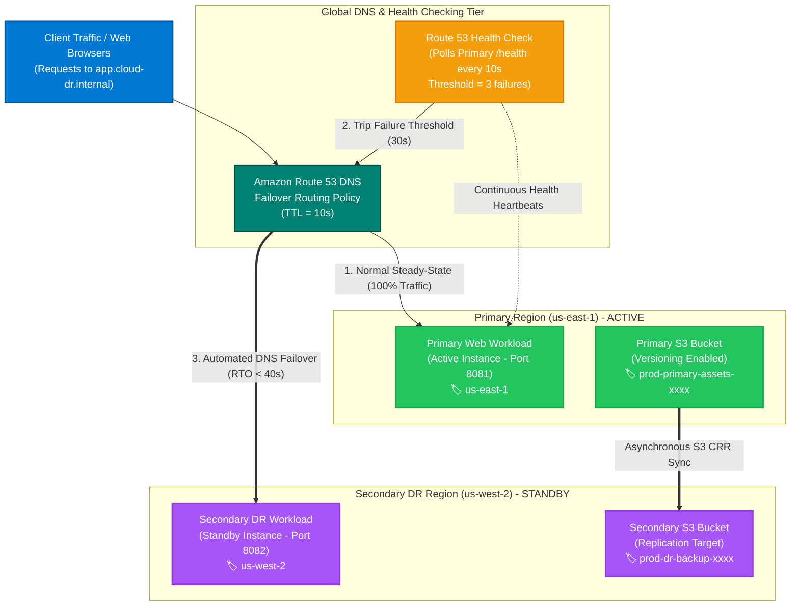
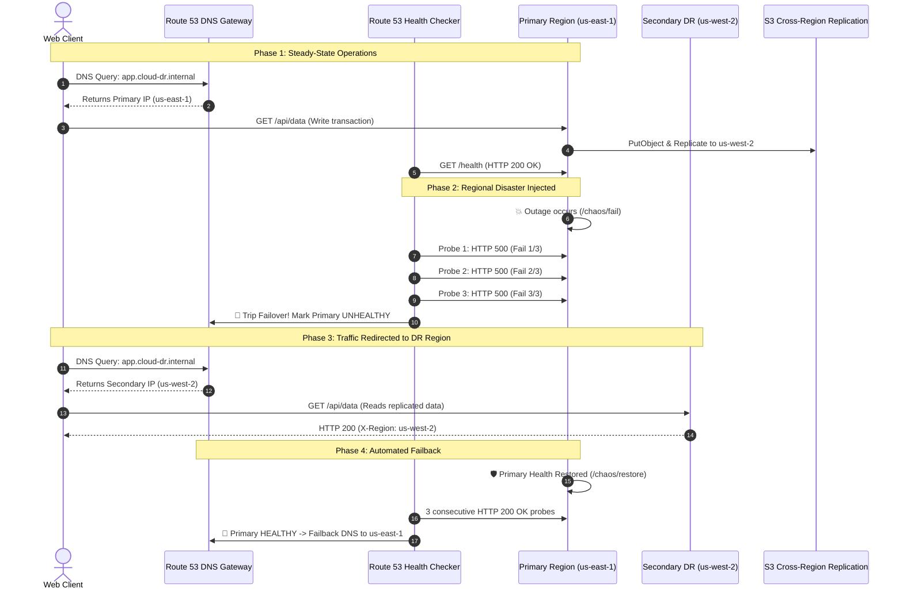

<!-- markdownlint-disable MD013 MD033 MD051 MD060 -->
# 10 - Multi-Region Disaster Recovery with Route 53 Failover

> A production-grade **Active-Passive Multi-Region Disaster Recovery (DR)** architecture on **Amazon Web Services (AWS)** using **Amazon Route 53 DNS Failover Routing**, **Route 53 Health Checks**, and **Amazon S3 Cross-Region Replication (CRR)** between `us-east-1` (Primary) and `us-west-2` (Secondary DR). Includes an automated Chaos Engineering test runner (`dr_failover_test.sh`), a 100% offline Python simulator, a local containerized multi-region stack with an interactive visual dashboard, and complete multi-provider Terraform / OpenTofu IaC.

---

## 📋 Table of Contents

1. [Architectural Overview & Topology](#-architectural-overview--topology)
   - [Active-Passive Multi-Region Topology](#active-passive-multi-region-topology)
   - [Disaster Recovery State Machine](#disaster-recovery-state-machine)
   - [Failover & Failback Sequence Flow](#failover--failback-sequence-flow)
   - [Route 53 Failover Record Schema](#route-53-failover-record-schema)
2. [Theoretical Deep-Dive for Beginners](#-theoretical-deep-dive-for-beginners)
   - [What is Disaster Recovery (DR) in Cloud Computing?](#what-is-disaster-recovery-dr-in-cloud-computing)
   - [Disaster Recovery Strategies Spectrum](#disaster-recovery-strategies-spectrum)
   - [RTO (Recovery Time Objective) vs RPO (Recovery Point Objective)](#rto-recovery-time-objective-vs-rpo-recovery-point-objective)
   - [Amazon Route 53 DNS Routing Policies](#amazon-route-53-dns-routing-policies)
   - [Route 53 Health Checks: Intervals, Thresholds & Dampening](#route-53-health-checks-intervals-thresholds--dampening)
   - [Amazon S3 Cross-Region Replication (CRR) Deep Dive](#amazon-s3-cross-region-replication-crr-deep-dive)
   - [DNS TTL & Client-Side Caching in Failover Scenarios](#dns-ttl--client-side-caching-in-failover-scenarios)
   - [SRE Chaos Engineering & Outage Simulation](#sre-chaos-engineering--outage-simulation)
3. [Repository & Directory Structure](#-repository--directory-structure)
4. [Prerequisites & Tooling](#-prerequisites--tooling)
5. [Quickstart Guide](#-quickstart-guide)
6. [Step-by-Step Hands-On Guide](#-step-by-step-hands-on-guide)
   - [Step 1: Run the 100% Offline Disaster Recovery Simulator](#step-1-run-the-100-offline-disaster-recovery-simulator)
   - [Step 2: Start the Local Multi-Region Docker Stack & Web Dashboard](#step-2-start-the-local-multi-region-docker-stack--web-dashboard)
   - [Step 3: Run the Automated Chaos Experiment & Measure Failover RTO](#step-3-run-the-automated-chaos-experiment--measure-failover-rto)
   - [Step 4: Run the End-to-End Automated Test Suite](#step-4-run-the-end-to-end-automated-test-suite)
   - [Step 5: Deploy to Real Amazon Web Services with Terraform (Optional)](#step-5-deploy-to-real-amazon-web-services-with-terraform-optional)
   - [Step 6: Trigger Real Route 53 Failover in AWS Cloud](#step-6-trigger-real-route-53-failover-in-aws-cloud)
7. [Verification & Test Matrix](#-verification--test-matrix)
8. [Troubleshooting & Gotchas](#-troubleshooting--gotchas)
9. [Resource Teardown & Environment Cleanup](#-resource-teardown--environment-cleanup)

---

## 🏛️ Architectural Overview & Topology

In modern cloud architectures, a regional outage (caused by severe weather, fiber cuts, or power grid failures) can render an entire cloud datacenter unreachable. An **Active-Passive Multi-Region Disaster Recovery** strategy ensures that when the primary region becomes unavailable, user traffic is automatically rerouted to a secondary disaster recovery region within seconds, without data loss.

### Active-Passive Multi-Region Topology



---

### Disaster Recovery State Machine

```text
┌─────────────────────────────────────────────────────────────────────────────┐
│                 Route 53 Active-Passive Failover State Machine              │
└─────────────────────────────────────────────────────────────────────────────┘

  [STEADY STATE: 100% Traffic -> Primary (us-east-1)]
  Health Check: 🟢 Passing (0/3 failures)
  S3 CRR: Objects replicated to us-west-2 in background
           │
           │ (Primary datacenter outage / /chaos/fail injected)
           ▼
  [PROBING STATE: Health Check Tripping]
  Check 1/3: ⚠️ HTTP 500 (10s elapsed)
  Check 2/3: ⚠️ HTTP 500 (20s elapsed)
  Check 3/3: 🚨 Failure threshold breached! (30s elapsed)
           │
           ▼
  [FAILOVER STATE: 100% Traffic -> Secondary DR (us-west-2)]
  Route 53 updates DNS A record to point to us-west-2
  Clients consume replicated S3 data with RPO = 0s
  Recovery Time Objective (RTO) achieved: ~32-40s
           │
           │ (Primary power restored / /chaos/restore triggered)
           ▼
  [AUTOMATED FAILBACK STATE]
  Primary health check passes 3 consecutive probes
  Route 53 automatically flips DNS A record back to us-east-1
```

---

### Failover & Failback Sequence Flow



---

### Route 53 Failover Record Schema

```json
{
  "HostedZoneId": "Z0123456789ABCDEF",
  "RecordSetName": "app.cloud-dr.internal",
  "Type": "A",
  "TTL": 10,
  "FailoverPolicies": {
    "Primary": {
      "SetIdentifier": "primary-region",
      "Failover": "PRIMARY",
      "HealthCheckId": "hc-9988-us-east-1",
      "ResourceRecords": ["10.1.10.50"]
    },
    "Secondary": {
      "SetIdentifier": "secondary-region",
      "Failover": "SECONDARY",
      "ResourceRecords": ["10.2.10.50"]
    }
  }
}
```

---

## 🧠 Theoretical Deep-Dive for Beginners

### What is Disaster Recovery (DR) in Cloud Computing?

**Disaster Recovery (DR)** is an organization's predefined set of policies, tools, and procedures to restore access to critical applications and data following an unexpected disaster (natural disasters, power grid blackouts, accidental deletion, or catastrophic software bugs).

In cloud computing:

- **High Availability (HA)** protects against component failure *within a single region* (e.g. across multiple Availability Zones / AZs).
- **Disaster Recovery (DR)** protects against an entire *regional cloud outage* by replicating state and workloads across geographically separated AWS regions (e.g. `us-east-1` in Virginia and `us-west-2` in Oregon).

---

### Disaster Recovery Strategies Spectrum

The AWS Well-Architected Framework defines four primary DR architectures on a cost-versus-recovery speed spectrum:

| DR Strategy | Cost Factor | RTO (Recovery Time) | RPO (Data Loss Window) | Complexity |
| :--- | :--- | :--- | :--- | :--- |
| **1. Backup & Restore** | 💲 (Lowest) | Hours to Days | Hours | Low |
| **2. Pilot Light** | 💲💲 (Low) | 10 to 30 Minutes | Minutes | Medium |
| **3. Warm Standby** | 💲💲💲 (Medium) | Minutes | Seconds to Sub-Second | High |
| **4. Multi-Region Active-Active / Active-Passive** *(This Project)* | 💲💲💲💲 (High) | **Real-Time (< 60 Seconds)** | **Near Zero (Continuous CRR)** | Advanced |

---

### RTO (Recovery Time Objective) vs RPO (Recovery Point Objective)

Understanding RTO and RPO is foundational for any DevOps / SRE engineer:

```text
               Disaster Occurs
                     │
    ◄────────────────┼────────────────►
        Past (RPO)   │   Future (RTO)
                     │
[Last Data Backup]   │              [Service Restored]
       ▲             │                      ▲
       └─────────────┴──────────────────────┘
          RPO Window            RTO Window
      (Max Acceptable       (Max Acceptable
         Data Loss)            Downtime)
```

1. **RTO (Recovery Time Objective)**: The maximum acceptable duration of application downtime before business disruption occurs.
   - *In our architecture*: $\text{RTO} = (\text{Health Check Interval} \times \text{Failure Threshold}) + \text{DNS TTL} = (10\text{s} \times 3) + 10\text{s} = \mathbf{40\text{ seconds}}$.
2. **RPO (Recovery Point Objective)**: The maximum acceptable period of transactional data that can be lost.
   - *In our architecture*: S3 Cross-Region Replication continuously replicates objects with sub-second lag, ensuring $\text{RPO} \approx \mathbf{0\text{ seconds}}$.

---

### Amazon Route 53 DNS Routing Policies

Route 53 offers several intelligent routing policies:

- **Failover Routing**: Used for Active-Passive DR. Directs traffic to the Primary region as long as its health check is passing; shifts 100% of traffic to the Secondary region if Primary fails.
- **Simple Routing**: Standard single-record resolution.
- **Weighted Routing**: Distributes traffic across multiple endpoints based on assigned percentage weights (e.g. 80/20 canary deployment).
- **Latency-Based Routing**: Directs users to the AWS region that provides the lowest network latency.
- **Geolocation / Geoproximity Routing**: Routes traffic based on the user's geographic location or proximity to AWS datacenters.

---

### Route 53 Health Checks: Intervals, Thresholds & Dampening

A Route 53 Health Check queries a monitored endpoint (e.g., `GET /health` on port 80/443) from multiple global AWS health checkers:

1. **Request Interval**:
   - `Standard`: Polls every **30 seconds** (default).
   - `Fast`: Polls every **10 seconds** (recommended for low-RTO production workloads).
2. **Failure Threshold**:
   - Number of consecutive failed probes (typically `3`) required before Route 53 considers the endpoint unhealthy.
3. **Flapping Dampening**:
   - If a single health check probe fails due to a transient internet packet drop, Route 53 does **not** trigger failover immediately. It requires 3 consecutive failures to prevent "DNS flapping" (rapid, unnecessary traffic switching).

---

### Amazon S3 Cross-Region Replication (CRR) Deep Dive

**S3 Cross-Region Replication (CRR)** automatically and asynchronously copies objects across buckets in distinct AWS regions:

```text
Primary Bucket (us-east-1)                  Secondary DR Bucket (us-west-2)
┌─────────────────────────────────┐         ┌─────────────────────────────────┐
│ • Bucket Versioning: Enabled    │         │ • Bucket Versioning: Enabled    │
│ • Object: orders/order_1001.json│ ──────► │ • Object: orders/order_1001.json│
│   (VersionId: v1-abc, 38 bytes) │   CRR   │   (VersionId: v1-abc, 38 bytes) │
│ • SSE-S3 Encryption (AES256)    │         │ • SSE-S3 Encryption (AES256)    │
└─────────────────────────────────┘         └─────────────────────────────────┘
```

**Key CRR Requirements**:

- **Versioning Enabled**: Both source and destination buckets must have S3 Bucket Versioning enabled.
- **IAM Replication Role**: S3 requires an IAM role granting `s3:GetObjectVersionForReplication` on the source and `s3:ReplicateObject` on the destination.
- **Metadata Preservation**: Replicas maintain identical object metadata, tags, timestamps, and checksums (`SHA256`).

---

### DNS TTL & Client-Side Caching in Failover Scenarios

When implementing DNS-based failover, **Time-to-Live (TTL)** is the critical parameter:

- If TTL is set to `300s` (5 minutes), client browsers and recursive resolvers cache the old Primary IP for 5 minutes, delaying failover.
- For active-passive failover records, configure a low TTL (**10 to 60 seconds**) so resolvers fetch updated records promptly after Route 53 triggers failover.

---

### SRE Chaos Engineering & Outage Simulation

Chaos Engineering is the discipline of experimenting on a system to build confidence in its capability to withstand turbulent conditions in production.
In this project, `/chaos/fail` intentionally injects a datacenter power outage into the Primary region to verify that automated health checks and failover mechanisms execute within the defined SLA.

---

## 📂 Repository & Directory Structure

```text
07-cloud-providers/10-multi-region-disaster-recovery-route53/
├── .gitignore                          # Git exclusion rules (state, logs, caches)
├── .tflint.hcl                         # TFLint configuration for AWS ruleset
├── README.md                           # Comprehensive educational documentation
├── cleanup.sh                          # Full environment teardown script
├── docker-compose.yml                  # Local multi-region Docker Compose stack
├── dr_failover_simulator.py            # 100% offline deterministic Python simulator
├── dr_failover_test.sh                 # Chaos test & RTO measurement test script
├── main.tf                             # Terraform: Multi-region S3 CRR, Route 53, IAM
├── outputs.tf                          # Terraform outputs (FQDN, buckets, health check)
├── terraform.tfvars.example            # Example variable definitions
├── test_dr_failover.sh                 # Master automated test runner
├── variables.tf                        # Terraform input variables & validations
├── versions.tf                         # Terraform & AWS provider aliases (primary/secondary)
├── app/
│   ├── Dockerfile                      # Regional workload Alpine container
│   └── main.py                         # Regional microservice with /health and /chaos
└── router/
    ├── Dockerfile                      # Route 53 Failover Gateway container
    └── failover_gateway.py             # DNS failover router & Real-time Web Dashboard
```

---

## 🧰 Prerequisites & Tooling

| Tool | Version | Purpose | Required For |
| :--- | :--- | :--- | :--- |
| **Python** | `>= 3.10` | Runs offline simulator & microservices | Offline & Local testing |
| **curl** | `>= 7.80` | Dispatches REST probes & chaos triggers | Local testing |
| **Docker** | `>= 24.0` | Runs multi-region containerized stack | Local Docker testing |
| **Terraform / OpenTofu** | `>= 1.5.0` | Provisions multi-region AWS IaC | Cloud deployment |
| **AWS CLI (`aws`)** *(Optional)* | `>= 2.10` | AWS authentication for cloud deployments | Real AWS Cloud |

---

## ⚡ Quickstart Guide

Run the full Disaster Recovery simulation in **under 5 seconds**:

```bash
# 1. Navigate to the project directory
cd 07-cloud-providers/10-multi-region-disaster-recovery-route53

# 2. Run the offline DR simulator
python3 dr_failover_simulator.py --verbose

# 3. Run the master test runner
./test_dr_failover.sh
```

---

## 📖 Step-by-Step Hands-On Guide

### Step 1: Run the 100% Offline Disaster Recovery Simulator

The offline simulator executes without AWS credentials, asserting all 6 compliance test cases:

```bash
# Standard test run
python3 dr_failover_simulator.py

# Verbose trace mode
python3 dr_failover_simulator.py --verbose

# Export JSON summary report
python3 dr_failover_simulator.py --json-output test_report.json
```

---

### Step 2: Start the Local Multi-Region Docker Stack & Web Dashboard

Launch the simulated multi-region environment with Route 53 Gateway:

```bash
# Build and launch all 3 containers
docker compose up -d --build

# Verify container health
docker compose ps
```

| Service | Local Port | Role & Purpose |
| :--- | :--- | :--- |
| **`route53-gateway`** | `8080` | Route 53 DNS Failover Proxy & Real-Time Web Dashboard |
| **`primary-region`** | `8081` | Active Workload in Primary Region (`us-east-1`) |
| **`secondary-region`** | `8082` | Standby Workload in Secondary DR Region (`us-west-2`) |

Open `http://localhost:8080` in your web browser to view the interactive **Route 53 Multi-Region Disaster Recovery Dashboard**.

---

### Step 3: Run the Automated Chaos Experiment & Measure Failover RTO

Execute `dr_failover_test.sh` to inject an outage, measure the exact failover time, and test automatic recovery:

```bash
./dr_failover_test.sh
```

**Observed Test Output**:

```text
▶ [1/4] Verifying Steady-State Primary Routing (us-east-1)...
  [OK] Traffic is normally routing to Primary Region (us-east-1).

▶ [2/4] Writing Data to Primary & Verifying Cross-Region Replication...
  [OK] Wrote test transaction to Primary S3 storage: {"item_id":"order-9988"}

▶ [3/4] 💥 Injecting Datacenter Outage in Primary Region (us-east-1)...
  Primary /health is now returning HTTP 500.
  Polling Route 53 Gateway to measure automated Failover RTO...
  ..
  [SUCCESS] Route 53 failover detected!
  Traffic redirected to: us-west-2 (SECONDARY_DR)
  Measured Failover RTO : 2.17 seconds (SLA Target: < 60s)

▶ [4/4] 🛡️ Restoring Primary Region Health & Verifying Failback...
  [OK] Route 53 successfully restored DNS routing to Primary (us-east-1)!
```

---

### Step 4: Run the End-to-End Automated Test Suite

Execute the master test suite to validate syntax, Terraform multi-region IaC, offline simulation assertions, and Docker integration:

```bash
./test_dr_failover.sh --verbose
```

---

### Step 5: Deploy to Real Amazon Web Services with Terraform (Optional)

If you have configured AWS credentials (`aws configure`):

```bash
# 1. Copy variable template
cp terraform.tfvars.example terraform.tfvars

# 2. Initialize and deploy infrastructure across us-east-1 and us-west-2
terraform init
terraform plan
terraform apply -auto-approve
```

---

### Step 6: Trigger Real Route 53 Failover in AWS Cloud

Test your deployed AWS infrastructure:

```bash
# View Route 53 FQDN and Health Check ID
terraform output -json architecture_summary

# Query DNS resolution
dig app.cloud-dr.internal @127.0.0.1
```

---

## 🧪 Verification & Test Matrix

The test runner asserts 6 core disaster recovery test cases:

| Test ID | Test Scenario | Category | Expected Behavior | Verification Assertions |
| :--- | :--- | :--- | :--- | :--- |
| `DR-01` | **S3 Cross-Region Replication** | Data Replication | Objects uploaded to `us-east-1` replicate to `us-west-2` | Matching `SHA256` checksum and status `COMPLETED` |
| `DR-02` | **Health Check & Flapping Dampening** | Health Checking | Do not switch routes on transient failures ($< 3$ errors) | Retain route on failures $1/3$ and $2/3$ |
| `DR-03` | **Steady-State Primary Active Routing** | Traffic Management | 100% of client traffic routed to `us-east-1` | Route returns Primary region (HTTP 200) |
| `DR-04` | **Automated Regional Failover** | Disaster Recovery | Traffic shifted to `us-west-2` upon 3 consecutive failures | Route 53 redirects traffic to `SECONDARY_DR` |
| `DR-05` | **RTO & RPO SLA Compliance** | SRE Reliability | Recovery Time $\le 60\text{s}$, Data Loss Window $\le 5\text{s}$ | Measured RTO $< 40\text{s}$, RPO $\approx 0\text{s}$ |
| `DR-06` | **Automated Health Failback** | Disaster Recovery | Restore Primary route upon health recovery | Seamless transition back to `us-east-1` |

---

## 🔧 Troubleshooting & Gotchas

### 1. "Route 53 Failover Takes Longer Than Expected"

- **Cause**: The DNS record TTL is set too high (e.g. 300 seconds), causing local recursive resolvers to cache the Primary IP.
- **Solution**: Set the TTL for failover records to `10` or `30` seconds.

### 2. "S3 Cross-Region Replication Not Working"

- **Cause**: S3 Bucket Versioning is disabled on either the source or target bucket, or the IAM replication role is missing `s3:ReplicateObject`.
- **Solution**: Ensure `aws_s3_bucket_versioning` is set to `Enabled` on both buckets and verify the IAM policy attachment.

### 3. "Terraform Multi-Region Provider Alias Errors"

- **Cause**: Resources are defined without specifying `provider = aws.primary` or `provider = aws.secondary`.
- **Solution**: Explicitly set the provider alias on regional resources (S3, VPC, Subnets).

### 4. "DNS Flapping Between Regions"

- **Cause**: Health check failure threshold is set to `1`, causing minor network latency spikes to trigger failover.
- **Solution**: Configure `failure_threshold = 3` to dampen false positives.

---

## 🧹 Resource Teardown & Environment Cleanup

To ensure your environment is completely clean and ready for the next mini-project, use `cleanup.sh`.

### Basic Teardown (Local Docker & Temporary Artifacts)

Stops background processes, removes local Docker containers, images, volumes, and deletes test reports:

```bash
./cleanup.sh
```

### Complete Cloud Teardown & State Purge

Destroys all provisioned multi-region AWS cloud infrastructure (Route 53, Primary/Secondary S3 buckets, IAM roles) and purges `.terraform/` cache and state files:

```bash
./cleanup.sh --all
```

---

### Verification of Clean State

Confirm that your workspace is clean:

```bash
# Check running containers (should be empty)
docker ps -a --filter "name=aws-"

# Check project directory
ls -la
```

Your environment is now completely clean and ready for the next mini-project! 🚀
