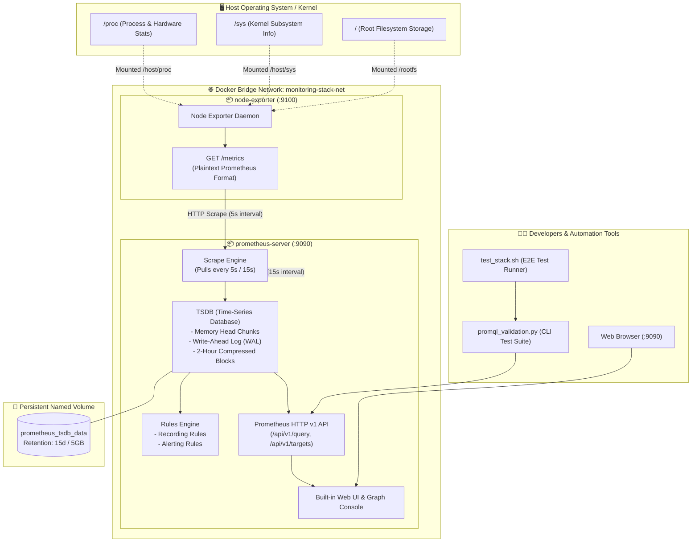

<!-- markdownlint-disable MD013 MD033 MD051 MD060 -->
# 01 - Prometheus & Node Exporter Monitoring Stack

> A production-grade local monitoring stack deploying **Prometheus** and **Node Exporter** with Docker Compose, featuring customized scrape intervals, TSDB retention policies (15 days / 5GB), precomputed recording rules, operational alerting rules, and a zero-dependency Python PromQL validation test suite.

---

## 📋 Table of Contents

1. [Architectural Overview & Metrics Flow](#-architectural-overview--metrics-flow)
   - [Monitoring Architecture Diagram](#monitoring-architecture-diagram)
   - [Data Scraping & Storage Lifecycle](#data-scraping--storage-lifecycle)
2. [Theoretical Deep-Dive for Beginners](#-theoretical-deep-dive-for-beginners)
   - [What is Prometheus? Pull vs. Push Architecture](#what-is-prometheus-pull-vs-push-architecture)
   - [The Dimensional Data Model](#the-dimensional-data-model)
   - [The 4 Core Prometheus Metric Types](#the-4-core-prometheus-metric-types)
   - [Prometheus TSDB Internals & Retention Policies](#prometheus-tsdb-internals--retention-policies)
   - [Node Exporter Internals & Host Subsystem Mounts](#node-exporter-internals--host-subsystem-mounts)
   - [PromQL Syntax & Query Calculation Mechanics](#promql-syntax--query-calculation-mechanics)
   - [Recording Rules vs. Alerting Rules](#recording-rules-vs-alerting-rules)
3. [Repository & Directory Structure](#-repository--directory-structure)
4. [Prerequisites & System Setup](#-prerequisites--system-setup)
5. [Quickstart Guide](#-quickstart-guide)
6. [Step-by-Step Hands-On Guide](#-step-by-step-hands-on-guide)
   - [Step 1: Inspect Prometheus & Scrape Configuration](#step-1-inspect-prometheus--scrape-configuration)
   - [Step 2: Start the Monitoring Stack](#step-2-start-the-monitoring-stack)
   - [Step 3: Inspect Raw Metrics from Node Exporter](#step-3-inspect-raw-metrics-from-node-exporter)
   - [Step 4: Explore the Prometheus Web UI](#step-4-explore-the-prometheus-web-ui)
   - [Step 5: Run Practical PromQL Queries](#step-5-run-practical-promql-queries)
   - [Step 6: Execute the Python Validation Test Suite](#step-6-execute-the-python-validation-test-suite)
   - [Step 7: Test Zero-Downtime Hot-Reloading](#step-7-test-zero-downtime-hot-reloading)
7. [PromQL Query Cheat Sheet](#-promql-query-cheat-sheet)
8. [Troubleshooting & Common Gotchas](#-troubleshooting--common-gotchas)
9. [Resource Teardown & Complete Cleanup](#-resource-teardown--complete-cleanup)

---

## 🏛️ Architectural Overview & Metrics Flow

### Monitoring Architecture Diagram



### Data Scraping & Storage Lifecycle

1. **Host Metrics Collection**: Node Exporter reads host CPU, memory, network interfaces, and disk counters directly from `/proc` and `/sys` host filesystems mounted read-only into its container.
2. **Pull Ingestion**: Every 5 seconds, Prometheus sends an HTTP GET request to `http://node-exporter:9100/metrics`.
3. **Parsing & TSDB Ingestion**: Prometheus parses each plaintext line, attaches configured labels (`instance="host-node"`, `tier="infrastructure"`), and writes the timestamped sample into active memory (Head Chunk) and the Write-Ahead Log (WAL).
4. **Rule Evaluation**: Every 15 seconds, the Prometheus Rules Engine evaluates recording rules (e.g., precalculating CPU percentage) and checks alert conditions.
5. **Consumption**: Users and validation scripts query the `/api/v1/query` endpoint using PromQL to extract instant metrics, time-series vectors, and system statistics.

---

## 🧠 Theoretical Deep-Dive for Beginners

### What is Prometheus? Pull vs. Push Architecture

**Prometheus** is an open-source, metrics-based monitoring and alerting system originally developed at SoundCloud. Unlike traditional monitoring systems that wait for servers to push telemetry data to a central collector, Prometheus operates primarily on a **Pull-Based (Scrape) Architecture**.

```text
┌─────────────────────────────────────────────────────────────────────────┐
│                      PULL vs. PUSH COMPARISON                           │
├─────────────────────────────────────────────────────────────────────────┤
│  PULL MODEL (Prometheus)               PUSH MODEL (StatsD, CloudWatch)  │
│                                                                         │
│  [Prometheus]                          [Application Target]             │
│      │                                          │                       │
│      ├─ 1. HTTP GET /metrics ──▶ [Target]       ├─ 1. Push Metric ─────▶│
│      │                           (Exposes state)│                       │
│      ◀─ 2. HTTP 200 (Text payload) ─────────────┘                       ▼
│                                                                  [Central Collector]
│  Advantages:                           Advantages:                      │
│  • Automatic health / up-down status   • Works easily behind firewalls  │
│  • Prometheus controls scrape rate     • Suitable for short-lived jobs  │
│  • Targets are simple HTTP endpoints     (batch / lambda)               │
│  • Prevents collector overload                                          │
└─────────────────────────────────────────────────────────────────────────┘
```

- **Health Detection by Design**: If a scrape fails, Prometheus immediately marks `up == 0`. No separate heartbeat daemon is needed.
- **Scrape Rate Control**: Central configuration dictates how often metrics are collected. A rogue application cannot flood the monitoring server with metric events.

### The Dimensional Data Model

Every time series stored in Prometheus is uniquely identified by its **metric name** and an arbitrary set of **key-value label pairs**:

$$\text{Time Series Identifier} = \text{Metric Name} + \{\text{label\_name}_1 = \text{"value"}_1, \dots, \text{label\_name}_n = \text{"value"}_n\}$$

#### Example Metric Notation

```text
node_cpu_seconds_total{cpu="0", mode="idle", instance="host-node", job="node_exporter"} 148293.42
│                      │                                                                 │
└── Metric Name        └── Dimensional Labels (Key/Value pairs)                          └── Sample Value (Float64)
```

Each sample consists of:

- A **Float64** numeric value (e.g., `148293.42`).
- A **Millisecond-precision** timestamp (e.g., `1771618800000`).

### The 4 Core Prometheus Metric Types

| Metric Type | Description | Mathematical Behavior | Real-World Use Case |
| :--- | :--- | :--- | :--- |
| **Counter** | A cumulative metric that can **only increase** or be reset to zero upon restart. | Monotonically increasing. Evaluated using `rate()` or `increase()`. | Total HTTP requests, CPU active seconds, disk read bytes. |
| **Gauge** | A metric that represents a **single numerical value** that can arbitrarily go up or down. | Instantaneous snapshot. | Available memory, CPU temperature, queue depth, disk usage %. |
| **Histogram** | Samples observations (usually request durations or response sizes) and counts them in configurable buckets (`le`). Also calculates `_sum` and `_count`. | Bucket aggregation. Evaluated using `histogram_quantile()`. | Request latency (p95, p99), payload sizes. |
| **Summary** | Similar to Histogram, but calculates configurable quantiles (e.g. φ=0.5, 0.9, 0.99) directly on the client side. | Client-side quantile estimation. | Legacy request duration profiling. |

### Prometheus TSDB Internals & Retention Policies

Prometheus uses a custom, highly optimized on-disk Time Series Database (TSDB):

```text
/prometheus (Storage Directory)
├── 01HY74V50B2XYZ.../         <-- Immutable 2-hour compacted block
│   ├── chunks/
│   │   └── 000001             <-- Compressed sample chunks (Gorilla encoding)
│   ├── index                  <-- Inverted inverted index (postings list for labels)
│   ├── meta.json              <-- Block metadata (min/max time, compaction level)
│   └── tombstones             <-- Soft deletion records
├── wal/                       <-- Write-Ahead Log (WAL)
│   └── 00000001               <-- Crash-recovery append log for in-memory Head chunks
└── lock
```

- **Head Chunk**: Current in-memory segment holding active writes.
- **Write-Ahead Log (WAL)**: Incoming samples are immediately appended to disk in 128KB WAL segments to prevent data loss across crashes.
- **Compaction**: Every 2 hours, memory chunks are written out to disk as immutable blocks. Background compaction merges older blocks into larger intervals.
- **Retention Policies**: Configured via `--storage.tsdb.retention.time` (e.g., `15d`) and `--storage.tsdb.retention.size` (e.g., `5GB`). Prometheus automatically removes the oldest 2-hour blocks when either limit is reached.

### Node Exporter Internals & Host Subsystem Mounts

**Node Exporter** is an official Prometheus collector for Linux/Unix hardware and OS metrics. It does not run kernel modules; instead, it reads text interfaces exposed by the Linux virtual filesystems:

- `/proc/stat` $\rightarrow$ CPU core execution times broken down by mode (`user`, `system`, `idle`, `iowait`, `irq`).
- `/proc/meminfo` $\rightarrow$ Total memory, available memory, buffers, cached pages.
- `/proc/diskstats` $\rightarrow$ Disk read/write operations, sectors, time spent doing I/O.
- `/proc/net/dev` $\rightarrow$ Network interface packet counters and byte throughput.
- `/sys/class/net/*` $\rightarrow$ Hardware NIC link speed and duplex status.

#### Mounting in Docker Containers

To monitor the actual **host machine** (and not just the isolated container namespace), Node Exporter requires specific host volume bind mounts:

```yaml
volumes:
  - /proc:/host/proc:ro      # Read-only access to host process/system stats
  - /sys:/host/sys:ro        # Read-only access to host kernel subsystem info
  - /:/rootfs:ro             # Read-only access to host root filesystem
command:
  - '--path.procfs=/host/proc'
  - '--path.sysfs=/host/sys'
  - '--path.rootfs=/rootfs'
  - '--collector.filesystem.mount-points-exclude=^/(sys|proc|dev|host|etc)($$|/)'
```

### PromQL Syntax & Query Calculation Mechanics

**PromQL (Prometheus Query Language)** is a functional expression language designed for slicing and dicing multi-dimensional time series.

#### 1. Instant Vectors vs. Range Vectors

- **Instant Vector**: A set of time series containing a single sample for each time series, all at the same instant in time.
  - Example: `node_memory_MemFree_bytes`
- **Range Vector**: A set of time series containing a range of data points going back in time for each series.
  - Example: `node_cpu_seconds_total[1m]` (Captures 1 minute of sample points).

#### 2. The `rate()` Function for Counters

Counters continuously increase. To compute the per-second rate of increase over a time window, use `rate()`:

$$\text{rate}(v[1m]) = \frac{\Delta v}{\Delta t}$$

PromQL's `rate()` function automatically handles **counter resets** (e.g., when a service restarts and its counter drops back to 0).

#### 3. Calculating Percentage CPU Utilization

```promql
100 - (avg by (instance) (rate(node_cpu_seconds_total{mode="idle"}[1m])) * 100)
```

- `rate(node_cpu_seconds_total{mode="idle"}[1m])`: Fraction of a second spent idle per real second.
- `avg by (instance) (...)`: Averages the idle rate across all CPU cores on each host instance.
- `* 100`: Converts idle fraction to a percentage (e.g., 85%).
- `100 - ...`: Inverts idle percentage to get active utilization percentage (e.g., 15%).

### Recording Rules vs. Alerting Rules

```text
┌────────────────────────────────────────────────────────────────────────┐
│                        PROMETHEUS RULES ENGINE                         │
├────────────────────────────────────────────────────────────────────────┤
│                                                                        │
│  1. RECORDING RULES (Precompute expensive PromQL expressions)         │
│     • Run periodically (e.g., every 15s)                              │
│     • Result saved as a brand-new time series metric                   │
│     • Example: instance:node_cpu_utilization:percent                   │
│     • Benefit: Fast dashboard queries & reduced TSDB CPU load         │
│                                                                        │
│  2. ALERTING RULES (Detect operational incidents)                     │
│     • Evaluated on every interval                                     │
│     • Lifecycle states: INACTIVE ──▶ PENDING ──▶ FIRING               │
│     • Example: HighMemoryUtilization (utilization > 90% for 2m)       │
│     • Benefit: Proactive incident alerting to SRE teams               │
│                                                                        │
└────────────────────────────────────────────────────────────────────────┘
```

---

## 📂 Repository & Directory Structure

```text
08-observability-and-monitoring/01-prometheus-node-exporter-stack/
├── Dockerfile                  # Self-contained Prometheus image build manifest
├── README.md                   # Comprehensive guide and beginner documentation
├── cleanup.sh                  # Automated resource teardown and cleanup script
├── docker-compose.yml          # Multi-container stack (Prometheus + Node Exporter)
├── prometheus.yml              # Prometheus server configuration & scrape jobs
├── promql_validation.py        # Python 3 PromQL validation test suite (zero-dependency)
├── rules/
│   └── node_rules.yml          # Prometheus recording and alerting rules definitions
└── test_stack.sh               # End-to-End automated validation test runner
```

---

## ⚙️ Prerequisites & System Setup

Ensure you have the following installed on your machine:

1. **Docker Engine**: Installed via [OrbStack](https://orbstack.dev/) (macOS recommended), Docker Desktop, or Podman.
2. **Docker Compose**: Modern compose plugin (`docker compose`) or standalone binary (`docker-compose`).
3. **Python 3**: Python 3.8+ (used by the standalone validation suite).
4. **curl**: Command-line HTTP utility.

---

## ⚡ Quickstart Guide

To start the monitoring stack, run validation, and explore in under 60 seconds:

```bash
# 1. Navigate to the project directory
cd 08-observability-and-monitoring/01-prometheus-node-exporter-stack

# 2. Run the automated end-to-end test suite
./test_stack.sh

# 3. Open Prometheus in your web browser
open http://localhost:9090
```

---

## 📖 Step-by-Step Hands-On Guide

### Step 1: Inspect Prometheus & Scrape Configuration

Inspect [`prometheus.yml`](file:///Users/fabian/Documents/CodeProjects/github.com/fabiankaraben/devops-sre-mini-projects/08-observability-and-monitoring/01-prometheus-node-exporter-stack/prometheus.yml) to see how scrape jobs are defined:

```yaml
global:
  scrape_interval: 15s      # Default scrape interval
  evaluation_interval: 15s  # Rule evaluation interval
  external_labels:
    environment: 'local-development'

rule_files:
  - "/etc/prometheus/rules/*.yml"

scrape_configs:
  - job_name: 'prometheus'
    scrape_interval: 15s
    static_configs:
      - targets: ['localhost:9090']

  - job_name: 'node_exporter'
    scrape_interval: 5s     # High-frequency host scraping
    static_configs:
      - targets: ['node-exporter:9100']
        labels:
          instance: 'host-node'
          tier: 'infrastructure'
```

### Step 2: Start the Monitoring Stack

Launch the stack using Docker Compose:

```bash
docker compose up -d --build
```

Verify that both containers are running and healthy:

```bash
docker compose ps
```

Expected output:

```text
NAME                IMAGE                               COMMAND                  SERVICE         STATUS
node-exporter       prom/node-exporter:v1.8.2           "/bin/node_exporter …"   node-exporter   Up (healthy)
prometheus-server   prometheus-custom-stack:v2.54.1     "/bin/prometheus --c…"   prometheus      Up (healthy)
```

### Step 3: Inspect Raw Metrics from Node Exporter

Node Exporter exposes raw plaintext metrics at `/metrics`. You can query it directly using `curl`:

```bash
# Fetch the first 25 metric entries from Node Exporter
curl -s http://localhost:9100/metrics | head -n 25
```

Notice the `# HELP` and `# TYPE` annotations accompanying each metric:

```text
# HELP node_cpu_seconds_total Seconds the CPUs spent in each mode.
# TYPE node_cpu_seconds_total counter
node_cpu_seconds_total{cpu="0",mode="idle"} 12401.55
node_cpu_seconds_total{cpu="0",mode="system"} 341.22
node_cpu_seconds_total{cpu="0",mode="user"} 812.11
```

### Step 4: Explore the Prometheus Web UI

Navigate to `http://localhost:9090` in your web browser:

1. **Check Scrape Targets**: Click **Status** $\rightarrow$ **Targets** (`http://localhost:9090/targets`). Confirm that both `prometheus` and `node_exporter` show state **UP** with green status badges.
2. **Check Configuration**: Click **Status** $\rightarrow$ **Configuration** (`http://localhost:9090/config`) to view active YAML settings and retention parameters.
3. **Check Rules**: Click **Status** $\rightarrow$ **Rules** (`http://localhost:9090/rules`) to inspect loaded recording and alerting rules.
4. **Execute Queries**: Click **Graph** (`http://localhost:9090/graph`) to run interactive PromQL queries.

### Step 5: Run Practical PromQL Queries

Try running the following queries in the Prometheus expression input:

#### Query 1: Total Host CPU Cores

```promql
count(count by (cpu) (node_cpu_seconds_total{job="node_exporter"}))
```

#### Query 2: Real-time CPU Utilization Percentage

```promql
100 - (avg by (instance) (rate(node_cpu_seconds_total{mode="idle"}[1m])) * 100)
```

#### Query 3: RAM Memory Utilization Percentage

```promql
100 * (1 - (node_memory_MemAvailable_bytes / node_memory_MemTotal_bytes))
```

#### Query 4: Total Disk Capacity in Gigabytes

```promql
node_filesystem_size_bytes{mountpoint="/rootfs"} / (1024 * 1024 * 1024)
```

#### Query 5: Read Precomputed Recording Rule

```promql
instance:node_cpu_utilization:percent
```

### Step 6: Execute the Python Validation Test Suite

Execute [`promql_validation.py`](file:///Users/fabian/Documents/CodeProjects/github.com/fabiankaraben/devops-sre-mini-projects/08-observability-and-monitoring/01-prometheus-node-exporter-stack/promql_validation.py) to programmatically assert system health, scrape status, PromQL metric evaluation, and rules engine state:

```bash
# Run with verbose diagnostic output
python3 promql_validation.py --verbose

# Run with machine-readable JSON output
python3 promql_validation.py --json
```

Sample output:

```text
======================================================================
  🚀 Running Prometheus & Node Exporter Validation Test Suite
======================================================================

▶ [1/4] Checking Prometheus Health & System Endpoints...
  [PASS] Prometheus server is healthy and ready to accept queries.
  [PASS] Prometheus Server Version: v2.54.1
  [PASS] Retention policy verified: time=15d, size=5GiB, lifecycle=true

▶ [2/4] Verifying Active Scrape Targets & Scrape Health...
  [PASS] Scrape Target 'prometheus' is UP (http://localhost:9090/metrics)
  [PASS] Scrape Target 'node_exporter' is UP (http://node-exporter:9100/metrics, latency: 0.0384s)

▶ [3/4] Querying PromQL Host Hardware & System Metrics...
  ── CPU Metrics ──
  [PASS] Detected Host CPU Cores: 8 cores
  [PASS] Overall Host CPU Utilization: 70.65%
  ── Memory (RAM) Metrics ──
  [PASS] Total RAM: 7.82 GB | Used: 0.54 GB (6.9%) | Available: 7.28 GB
  ── Filesystem & Disk Metrics ──
  [PASS] Mountpoint '/opt/orbstack-guest/data' (btrfs): Total: 69.50 GB | Free: 66.34 GB | Used: 4.5%
  ── Network & Disk I/O Metrics ──
  [PASS] Cumulative Network Traffic Received: 0.00 MB
  [PASS] Cumulative Disk Read Ops/Bytes: 77,086

▶ [4/4] Verifying Prometheus Recording & Alert Rules Engine...
  [PASS] Rule Groups Loaded: 2 group(s)
  [PASS] Recording Rules Active: 7
  [PASS] Alerting Rules Active: 4
  [PASS] Recording rule 'instance:node_cpu_utilization:percent' evaluates to: 72.52%

======================================================================
  📊 PROMETHEUS VALIDATION TEST SUMMARY
======================================================================
  Total Tests Executed : 13
  Tests Passed         : 13
  Tests Failed         : 0
  Success Rate         : 100.0%
----------------------------------------------------------------------
  🎉 ALL VALIDATION TESTS PASSED SUCCESSFULLY!
```

### Step 7: Test Zero-Downtime Hot-Reloading

Because the stack is launched with the `--web.enable-lifecycle` flag, configuration changes can be loaded immediately without restarting the container:

```bash
# Trigger hot-reload via HTTP POST
curl -s -X POST http://localhost:9090/-/reload
```

A status of `HTTP 200` confirms that Prometheus re-read its YAML configurations and rules from disk while maintaining all in-memory time-series data intact.

---

## 📊 PromQL Query Cheat Sheet

| Metric / Objective | PromQL Expression | Units / Output |
| :--- | :--- | :--- |
| **CPU Core Count** | `count(node_cpu_seconds_total{mode="idle"})` | Integer (cores) |
| **Total CPU Usage %** | `100 - (avg(rate(node_cpu_seconds_total{mode="idle"}[1m])) * 100)` | Percentage (0-100%) |
| **Per-Core CPU Usage %** | `100 - (rate(node_cpu_seconds_total{mode="idle"}[1m]) * 100)` | Per-core % |
| **RAM Available (GB)** | `node_memory_MemAvailable_bytes / (1024^3)` | Gigabytes (GB) |
| **RAM Used %** | `100 * (1 - (node_memory_MemAvailable_bytes / node_memory_MemTotal_bytes))` | Percentage (0-100%) |
| **Swap Usage %** | `100 * (1 - (node_memory_SwapFree_bytes / node_memory_SwapTotal_bytes))` | Percentage (0-100%) |
| **Disk Free Space (GB)** | `node_filesystem_avail_bytes{mountpoint="/rootfs"} / (1024^3)` | Gigabytes (GB) |
| **Disk Utilization %** | `100 - (node_filesystem_avail_bytes / node_filesystem_size_bytes * 100)` | Percentage (0-100%) |
| **Disk Read Rate (MB/s)** | `sum(rate(node_disk_read_bytes_total[1m])) / (1024^2)` | Megabytes/sec |
| **Disk Write Rate (MB/s)** | `sum(rate(node_disk_written_bytes_total[1m])) / (1024^2)` | Megabytes/sec |
| **Network RX Rate (KB/s)** | `sum(rate(node_network_receive_bytes_total[1m])) / 1024` | Kilobytes/sec |
| **Network TX Rate (KB/s)** | `sum(rate(node_network_transmit_bytes_total[1m])) / 1024` | Kilobytes/sec |
| **Target Up/Down Status** | `up{job="node_exporter"}` | 1 = UP, 0 = DOWN |

---

## 🛠️ Troubleshooting & Common Gotchas

### 1. `up{job="node_exporter"}` returns 0 (Scrape Failure)

- **Cause**: Prometheus cannot reach port 9100 on `node-exporter`.
- **Solution**: Ensure both containers are attached to the same Docker bridge network (`monitoring-stack-net`). Verify with `docker network inspect monitoring-stack-net`.

### 2. Node Exporter reports container metrics instead of host metrics

- **Cause**: Missing `/proc`, `/sys`, or `rootfs` volume mounts in `docker-compose.yml`.
- **Solution**: Ensure `--path.procfs=/host/proc` and `/proc:/host/proc:ro` are properly configured.

### 3. Rules Engine syntax error

- **Cause**: Invalid YAML indentation or malformed PromQL expression inside rule files.
- **Solution**: Run syntax validation via container:

  ```bash
  docker run --rm --entrypoint promtool prometheus-custom-stack:v2.54.1 check rules /etc/prometheus/rules/node_rules.yml
  ```

---

## 🧹 Resource Teardown & Complete Cleanup

To leave your local environment completely clean and ready for the next mini-project, choose either the automated cleanup script or manual teardown commands:

### Method A: Automated Cleanup Script (Recommended)

```bash
# Standard cleanup: Stops containers, deletes networks, and removes the TSDB named volume
./cleanup.sh

# Complete cleanup: Also removes downloaded Prometheus & Node Exporter Docker images
./cleanup.sh --all
```

### Method B: Manual Teardown Step-by-Step

```bash
# 1. Stop and remove containers, networks, and named storage volumes
docker compose down -v --remove-orphans

# 2. (Optional) Remove Docker images to free disk space
docker rmi prometheus-custom-stack:v2.54.1 prom/node-exporter:v1.8.2 prom/prometheus:v2.54.1 2>/dev/null || true

# 3. Clean local Python temporary files and caches
find . -type d -name "__pycache__" -exec rm -rf {} + 2>/dev/null || true
find . -type f -name "*.pyc" -delete 2>/dev/null || true
```

### Verification Checklist

Confirm that no lingering resources remain:

```bash
# 1. Verify no containers are running
docker ps -a --filter "name=prometheus-server" --filter "name=node-exporter"

# 2. Verify TSDB volume is removed
docker volume ls --filter "name=prometheus_tsdb_data"

# 3. Verify monitoring network is deleted
docker network ls --filter "name=monitoring-stack-net"
```

All three commands should return empty lists, confirming a 100% clean environment.
