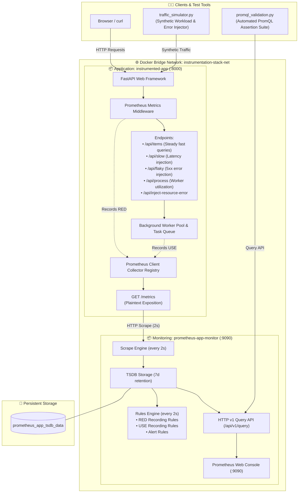

<!-- markdownlint-disable MD013 MD033 MD051 MD060 -->
# 02 - Application RED & USE Metrics Instrumentation

> A production-grade monitoring and telemetry framework implementing the **RED Method** (Rate, Errors, Duration) for request-driven microservices and the **USE Method** (Utilization, Saturation, Errors) for internal resource pools using official Prometheus client libraries, multi-scenario synthetic traffic injection, and automated PromQL percentile validation.

---

## 📋 Table of Contents

1. [Architectural Overview & Metrics Flow](#-architectural-overview--metrics-flow)
   - [System Architecture Diagram](#system-architecture-diagram)
   - [Telemetry Lifecycle: RED & USE Ingestion](#telemetry-lifecycle-red--use-ingestion)
2. [Theoretical Deep-Dive for Beginners](#-theoretical-deep-dive-for-beginners)
   - [The RED Method (Request-Driven Observability)](#the-red-method-request-driven-observability)
   - [The USE Method (Resource-Driven Observability)](#the-use-method-resource-driven-observability)
   - [RED vs. USE vs. Google SRE Four Golden Signals](#red-vs-use-vs-google-sre-four-golden-signals)
   - [How Histograms Work & Calculating Percentiles (p95/p99)](#how-histograms-work--calculating-percentiles-p95p99)
   - [Gauges vs. Counters in Service Instrumentation](#gauges-vs-counters-in-service-instrumentation)
   - [Recording Rules for Precomputing Complex Rates](#recording-rules-for-precomputing-complex-rates)
3. [Repository & Directory Structure](#-repository--directory-structure)
4. [Prerequisites & System Setup](#-prerequisites--system-setup)
5. [Quickstart Guide](#-quickstart-guide)
6. [Step-by-Step Hands-On Guide](#-step-by-step-hands-on-guide)
   - [Step 1: Understand Microservice Instrumentation](#step-1-understand-microservice-instrumentation)
   - [Step 2: Start the Application & Prometheus Stack](#step-2-start-the-application--prometheus-stack)
   - [Step 3: Inspect Plaintext Exposition Format](#step-3-inspect-plaintext-exposition-format)
   - [Step 4: Generate Synthetic Workloads & Failures](#step-4-generate-synthetic-workloads--failures)
   - [Step 5: Query RED & USE Metrics in Prometheus Web UI](#step-5-query-red--use-metrics-in-prometheus-web-ui)
   - [Step 6: Run the Automated Validation Test Suite](#step-6-run-the-automated-validation-test-suite)
7. [PromQL Query Cheat Sheet for RED & USE](#-promql-query-cheat-sheet-for-red--use)
8. [Troubleshooting & Common Gotchas](#-troubleshooting--common-gotchas)
9. [Resource Teardown & Complete Cleanup](#-resource-teardown--complete-cleanup)

---

## 🏛️ Architectural Overview & Metrics Flow

### System Architecture Diagram



### Telemetry Lifecycle: RED & USE Ingestion

1. **Request Interception (RED)**: Every incoming HTTP request passes through the ASGI metrics middleware. The middleware increments the active in-flight gauge, measures execution time via `time.perf_counter()`, increments `http_requests_total` with endpoint and HTTP status labels, and records duration into `http_request_duration_seconds` histogram buckets.
2. **Resource Tracking (USE)**: Background tasks submitted to `/api/process` modify `app_task_queue_depth` (Saturation) and `app_worker_pool_active_workers` (Utilization). Internal subsystem failures increment `app_resource_errors_total` (Errors).
3. **Scrape Pull**: Prometheus scrapes `http://app:8000/metrics` every 2 seconds.
4. **Rule Computation**: The rules engine evaluates recording rules every 2 seconds, precomputing request rates, error percentages, and p95/p99 latencies without recalculating over raw bucket samples during interactive queries.

---

## 🧠 Theoretical Deep-Dive for Beginners

### The RED Method (Request-Driven Observability)

Proposed by **Tom Wilkie**, the **RED Method** is tailored for request-driven architectures (such as REST APIs, gRPC microservices, and web servers). It focuses on what users experience:

```text
┌────────────────────────────────────────────────────────────────────────┐
│                        THE RED METHOD OVERVIEW                         │
├────────────────────────────────────────────────────────────────────────┤
│  R - RATE        Number of requests per second the service is serving. │
│                  Metric: http_requests_total (Counter)                 │
│                  Formula: sum(rate(http_requests_total[1m]))           │
│                                                                        │
│  E - ERRORS      Number of failing requests per second.                │
│                  Metric: http_requests_total{status_code=~"5.."}       │
│                  Formula: sum(rate(5xx[1m])) / sum(rate(total[1m]))*100│
│                                                                        │
│  D - DURATION    Amount of time requests take to execute (Latency).    │
│                  Metric: http_request_duration_seconds (Histogram)     │
│                  Formula: histogram_quantile(0.95, sum(rate(...)))     │
└────────────────────────────────────────────────────────────────────────┘
```

- **Why it matters**: If Rate drops unexpectedly, an upstream component is broken. If Errors increase, the application has a bug or outage. If Duration increases, customers experience poor performance.

### The USE Method (Resource-Driven Observability)

Formulated by **Brendan Gregg**, the **USE Method** focuses on resources and subsystems (CPU cores, memory allocators, database connection pools, background thread pools, disk queues):

```text
┌────────────────────────────────────────────────────────────────────────┐
│                        THE USE METHOD OVERVIEW                         │
├────────────────────────────────────────────────────────────────────────┤
│  U - UTILIZATION Percentage of time the resource was busy servicing    │
│                  work (e.g. 80% active worker threads).                │
│                  Metric: app_worker_pool_active_workers (Gauge)        │
│                                                                        │
│  S - SATURATION  The degree to which the resource has extra work       │
│                  queued that it cannot service immediately.            │
│                  Metric: app_task_queue_depth (Gauge)                  │
│                                                                        │
│  E - ERRORS      The count of error events in the underlying resource  │
│                  (e.g. pool exhausted, memory allocation failed).     │
│                  Metric: app_resource_errors_total (Counter)           │
└────────────────────────────────────────────────────────────────────────┘
```

- **Why it matters**: The USE method is the first diagnostic step for investigating performance bottlenecks. High saturation (e.g. queue buildup) directly causes high RED Duration.

### RED vs. USE vs. Google SRE Four Golden Signals

| Observability Paradigm | Scope | Core Focus Areas | Best Suited For |
| :--- | :--- | :--- | :--- |
| **RED Method** | Service / Request Level | **R**ate, **E**rrors, **D**uration | Microservices, REST APIs, GraphQL, Edge gateways |
| **USE Method** | Hardware / Resource Level | **U**tilization, **S**aturation, **E**rrors | Host systems, thread pools, DB pools, disk queues |
| **Four Golden Signals** (Google SRE) | Unified Service & Resource | **Latency**, **Traffic**, **Errors**, **Saturation** | End-to-end distributed system monitoring |

### How Histograms Work & Calculating Percentiles (p95/p99)

A Prometheus **Histogram** samples observations (e.g., request durations) and divides them into cumulative upper-bounded buckets (`le` = less than or equal to).

#### 1. The Raw Histogram Structure

When an application instruments `http_request_duration_seconds` with buckets `[0.05, 0.1, 0.5, 1.0]`, Prometheus generates three metrics:

1. `http_request_duration_seconds_bucket{le="0.05"}` (Count of requests taking $\le$ 50ms)
2. `http_request_duration_seconds_bucket{le="0.1"}` (Count of requests taking $\le$ 100ms)
3. `http_request_duration_seconds_bucket{le="0.5"}` (Count of requests taking $\le$ 500ms)
4. `http_request_duration_seconds_bucket{le="+Inf"}` (Count of all requests)
5. `http_request_duration_seconds_sum` (Total execution seconds of all requests)
6. `http_request_duration_seconds_count` (Total number of observed requests)

#### 2. The `histogram_quantile()` Function

To calculate the **95th percentile ($p95$) latency** (the latency threshold that 95% of users experienced or beat):

```promql
histogram_quantile(0.95, sum by (le) (rate(http_request_duration_seconds_bucket[1m])))
```

- `rate(...[1m])`: Calculates the rate of bucket increments per second over the last minute.
- `sum by (le) (...)`: Sums across instances while preserving the `le` dimension.
- `histogram_quantile(0.95, ...)`: Performs linear interpolation within the bucket where the 95th percentile falls to estimate the exact latency in seconds.

### Gauges vs. Counters in Service Instrumentation

- **Counter** (`http_requests_total`, `app_resource_errors_total`): Can only go UP (or reset to 0). Always query using `rate()` or `increase()`. Never query raw counters directly for rates.
- **Gauge** (`app_worker_pool_active_workers`, `app_task_queue_depth`, `http_requests_in_flight`): Can arbitrarily rise or fall. Represents an instant snapshot value. Query directly or average over time using `avg_over_time()`.

### Recording Rules for Precomputing Complex Rates

Evaluating `histogram_quantile` or complex error percentages on raw data across hundreds of pods puts heavy CPU load on Prometheus when rendering dashboards.

**Recording rules** solve this by precomputing the formula every evaluation cycle (e.g. every 2 seconds) and storing the result as a new metric:

```yaml
- record: job:http_request_duration_p95:seconds
  expr: histogram_quantile(0.95, sum by (le) (rate(http_request_duration_seconds_bucket[1m])))
```

Dashboards and alerts simply query `job:http_request_duration_p95:seconds` with zero computational overhead.

---

## 📂 Repository & Directory Structure

```text
08-observability-and-monitoring/02-application-metrics-instrumentation/
├── Dockerfile                  # (Optional root ref)
├── README.md                   # Comprehensive guide and beginner documentation
├── app/
│   ├── Dockerfile              # Microservice container definition (Python 3.11-slim)
│   ├── main.py                 # FastAPI microservice with RED & USE Prometheus client code
│   └── requirements.txt        # fastapi, uvicorn, prometheus-client
├── cleanup.sh                  # Automated resource teardown and cleanup script
├── docker-compose.yml          # Multi-container stack (App + Prometheus)
├── prometheus/
│   ├── Dockerfile              # Prometheus image packaging config & rules
│   ├── prometheus.yml          # Scrape configuration (2s interval)
│   └── rules/
│       └── app_rules.yml       # RED & USE recording and alerting rules
├── promql_validation.py        # Python 3 PromQL validation test suite (zero external dependencies)
├── test_stack.sh               # E2E automated test runner and traffic generator
├── traffic_simulator.py        # Multi-threaded synthetic workload & fault injection generator
└── .gitignore                  # Ignores test artifacts, bytecode, and logs
```

---

## ⚙️ Prerequisites & System Setup

1. **Docker Engine**: [OrbStack](https://orbstack.dev/) (recommended on macOS), Docker Desktop, or Podman.
2. **Docker Compose**: `docker compose` CLI plugin or `docker-compose`.
3. **Python 3**: Python 3.8+ installed locally.
4. **curl**: Standard command-line HTTP tool.

---

## ⚡ Quickstart Guide

Run the full end-to-end workflow (build, start, traffic generation, and metric validation) in a single command:

```bash
# 1. Navigate to the project directory
cd 08-observability-and-monitoring/02-application-metrics-instrumentation

# 2. Run the automated end-to-end test runner
./test_stack.sh

# 3. Explore Prometheus Web UI
open http://localhost:9090
```

---

## 📖 Step-by-Step Hands-On Guide

### Step 1: Understand Microservice Instrumentation

Inspect [`app/main.py`](file:///Users/fabian/Documents/CodeProjects/github.com/fabiankaraben/devops-sre-mini-projects/08-observability-and-monitoring/02-application-metrics-instrumentation/app/main.py) to see how RED and USE metrics are initialized and recorded:

```python
# RED Method Metrics
HTTP_REQUESTS_TOTAL = Counter(
    "http_requests_total",
    "Total HTTP requests processed by endpoint and status",
    ["method", "endpoint", "status_code", "status_class"],
)

HTTP_REQUEST_DURATION_SECONDS = Histogram(
    "http_request_duration_seconds",
    "HTTP request execution latency in seconds",
    ["method", "endpoint", "status_class"],
    buckets=(0.005, 0.01, 0.025, 0.05, 0.1, 0.25, 0.5, 1.0, 2.5, 5.0),
)

# USE Method Metrics
WORKER_POOL_ACTIVE = Gauge(
    "app_worker_pool_active_workers",
    "Number of worker threads currently processing background workload",
)
TASK_QUEUE_DEPTH = Gauge(
    "app_task_queue_depth",
    "Current number of pending tasks waiting in the execution queue",
)
```

### Step 2: Start the Application & Prometheus Stack

Launch the stack in detached mode:

```bash
docker compose up -d --build
```

Verify that both containers are running and healthy:

```bash
docker compose ps
```

Expected output:

```text
NAME                     IMAGE                                COMMAND                  SERVICE      STATUS
instrumented-app         mini-proj-08-02-app:local            "uvicorn main:app --…"   app          Up (healthy)
prometheus-app-monitor   mini-proj-08-02-prometheus:local     "/bin/prometheus --c…"   prometheus   Up (healthy)
```

### Step 3: Inspect Plaintext Exposition Format

Query the `/metrics` endpoint directly to see the Prometheus exposition text format:

```bash
curl -s http://localhost:8000/metrics | head -n 30
```

Notice the Prometheus metadata and sample values:

```text
# HELP http_requests_total Total HTTP requests processed by endpoint and status
# TYPE http_requests_total counter
http_requests_total{endpoint="/api/items",method="GET",status_class="2xx",status_code="200"} 45.0
# HELP http_request_duration_seconds HTTP request execution latency in seconds
# TYPE http_request_duration_seconds histogram
http_request_duration_seconds_bucket{endpoint="/api/items",le="0.01",method="GET",status_class="2xx"} 28.0
http_request_duration_seconds_bucket{endpoint="/api/items",le="0.025",method="GET",status_class="2xx"} 45.0
```

### Step 4: Generate Synthetic Workloads & Failures

Use [`traffic_simulator.py`](file:///Users/fabian/Documents/CodeProjects/github.com/fabiankaraben/devops-sre-mini-projects/08-observability-and-monitoring/02-application-metrics-instrumentation/traffic_simulator.py) to simulate diverse traffic patterns:

```bash
# Scenario A: Steady traffic (pure 2xx responses)
python3 traffic_simulator.py --scenario steady --duration 10

# Scenario B: Latency spike (simulating slow queries > 800ms)
python3 traffic_simulator.py --scenario latency-spike --duration 10

# Scenario C: Error burst (simulating 500/503 server faults)
python3 traffic_simulator.py --scenario error-burst --duration 10

# Scenario D: Worker pool queue saturation (simulating task queue backlogs)
python3 traffic_simulator.py --scenario queue-saturation --duration 10

# Scenario E: Combined multi-pattern traffic
python3 traffic_simulator.py --scenario all --duration 15 --concurrency 6
```

### Step 5: Query RED & USE Metrics in Prometheus Web UI

Navigate to `http://localhost:9090` in your web browser:

1. **Request Rate (RPS)**:

   ```promql
   sum(rate(http_requests_total[1m]))
   ```

2. **Per-Endpoint Throughput Breakdown**:

   ```promql
   sum by (endpoint) (rate(http_requests_total[1m]))
   ```

3. **HTTP 5xx Error Percentage**:

   ```promql
   (sum(rate(http_requests_total{status_code=~"5.."}[1m])) / sum(rate(http_requests_total[1m]))) * 100
   ```

4. **p95 Request Duration (Latency)**:

   ```promql
   histogram_quantile(0.95, sum by (le) (rate(http_request_duration_seconds_bucket[1m])))
   ```

5. **Worker Pool Utilization % (USE)**:

   ```promql
   (app_worker_pool_active_workers / app_worker_pool_max_workers) * 100
   ```

6. **Task Queue Saturation Depth (USE)**:

   ```promql
   app_task_queue_depth
   ```

### Step 6: Run the Automated Validation Test Suite

Run [`promql_validation.py`](file:///Users/fabian/Documents/CodeProjects/github.com/fabiankaraben/devops-sre-mini-projects/08-observability-and-monitoring/02-application-metrics-instrumentation/promql_validation.py) to verify all telemetry assertions:

```bash
# Verbose console output
python3 promql_validation.py --verbose

# JSON output mode
python3 promql_validation.py --json
```

---

## 📊 PromQL Query Cheat Sheet for RED & USE

| Category | SRE Metric / Objective | PromQL Expression | Unit |
| :--- | :--- | :--- | :--- |
| **RED - Rate** | Total Throughput | `sum(rate(http_requests_total[1m]))` | req/s |
| **RED - Rate** | Throughput by Endpoint | `sum by (endpoint) (rate(http_requests_total[1m]))` | req/s |
| **RED - Rate** | Throughput by Status Class | `sum by (status_class) (rate(http_requests_total[1m]))` | req/s |
| **RED - Errors** | 5xx Error Rate % | `(sum(rate(http_requests_total{status_code=~"5.."}[1m])) / sum(rate(http_requests_total[1m]))) * 100` | % |
| **RED - Duration** | Median ($p50$) Latency | `histogram_quantile(0.50, sum by (le) (rate(http_request_duration_seconds_bucket[1m])))` | seconds |
| **RED - Duration** | 90th Percentile ($p90$) | `histogram_quantile(0.90, sum by (le) (rate(http_request_duration_seconds_bucket[1m])))` | seconds |
| **RED - Duration** | 95th Percentile ($p95$) | `histogram_quantile(0.95, sum by (le) (rate(http_request_duration_seconds_bucket[1m])))` | seconds |
| **RED - Duration** | 99th Percentile ($p99$) | `histogram_quantile(0.99, sum by (le) (rate(http_request_duration_seconds_bucket[1m])))` | seconds |
| **RED - In-Flight** | Active Concurrent Requests | `sum(http_requests_in_flight)` | gauge |
| **USE - Utilization** | Worker Pool Busy % | `(app_worker_pool_active_workers / app_worker_pool_max_workers) * 100` | % |
| **USE - Saturation** | Backlog Queue Depth | `app_task_queue_depth` | items |
| **USE - Errors** | Resource Failure Rate | `sum by (resource) (rate(app_resource_errors_total[1m]))` | errors/s |

---

## 🛠️ Troubleshooting & Common Gotchas

### 1. `histogram_quantile()` returns `NaN`

- **Cause**: No request observations were made within the range vector window (`[1m]`).
- **Solution**: Run `traffic_simulator.py` to send traffic into the microservice before querying quantiles.

### 2. High Cardinality Warning with Dynamic Path Parameters

- **Anti-Pattern**: Using raw paths with IDs (e.g. `endpoint="/api/items/98721"`). This creates thousands of unique time series and exhausts Prometheus memory.
- **Solution**: Normalize route templates in middleware (e.g. `endpoint="/api/items/{id}"` or `endpoint="/api/items"`).

### 3. Rate calculation returns 0 immediately after startup

- **Cause**: The `rate()` function requires at least two samples within the time window.
- **Solution**: Allow 2-4 scrape intervals (4-8 seconds with a 2s scrape config) before asserting rates.

---

## 🧹 Resource Teardown & Complete Cleanup

To leave your local machine 100% clean for the next mini-project:

### Option A: Automated Cleanup Script (Recommended)

```bash
# Standard cleanup: Removes containers, bridge networks, and TSDB volumes
./cleanup.sh

# Complete cleanup: Also purges application and Prometheus container images
./cleanup.sh --all
```

### Option B: Manual Teardown Step-by-Step

```bash
# 1. Stop and remove containers, networks, and named storage volumes
docker compose down -v --remove-orphans

# 2. (Optional) Purge locally built Docker images
docker rmi mini-proj-08-02-app:local mini-proj-08-02-prometheus:local 2>/dev/null || true

# 3. Clean Python bytecode caches and test logs
find . -type d -name "__pycache__" -exec rm -rf {} + 2>/dev/null || true
find . -type f -name "*.pyc" -delete 2>/dev/null || true
```

### Verification Checklist

Run these commands to verify that no orphaned resources remain:

```bash
# 1. Verify no containers are running
docker ps -a --filter "name=instrumented-app" --filter "name=prometheus-app-monitor"

# 2. Verify TSDB volume is deleted
docker volume ls --filter "name=prometheus_app_tsdb_data"

# 3. Verify bridge network is removed
docker network ls --filter "name=instrumentation-stack-net"
```

All three commands should return empty tables.
