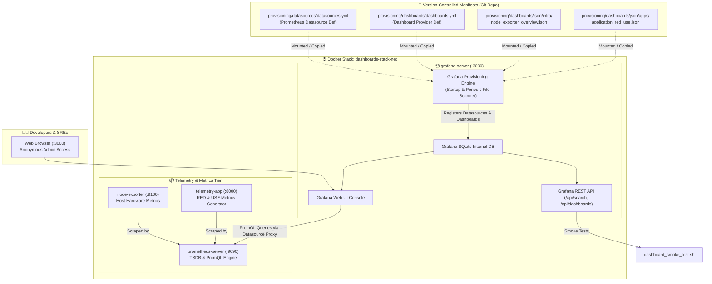

<!-- markdownlint-disable MD013 MD033 MD051 MD060 -->
# 03 - Grafana Dashboards as Code Provisioning

> A production-grade **Dashboards as Code (DaC)** monitoring framework automating the provisioning of **Grafana** datasources and multi-tier dashboards (Infrastructure Host Overview and Application RED & USE Telemetry) from declarative YAML configurations and version-controlled JSON models without manual UI setup.

---

## 📋 Table of Contents

1. [Architectural Overview & Provisioning Flow](#-architectural-overview--provisioning-flow)
   - [Dashboards as Code Architecture Diagram](#dashboards-as-code-architecture-diagram)
   - [Declarative Provisioning Lifecycle](#declarative-provisioning-lifecycle)
2. [Theoretical Deep-Dive for Beginners](#-theoretical-deep-dive-for-beginners)
   - [What is Dashboards as Code (DaC)?](#what-is-dashboards-as-code-dac)
   - [The Danger of "Snowflake Dashboards"](#the-danger-of-snowflake-dashboards)
   - [Grafana Provisioning Subsystems](#grafana-provisioning-subsystems)
   - [Anatomy of a Grafana Dashboard JSON Model](#anatomy-of-a-grafana-dashboard-json-model)
   - [Grid Layout Coordinate System (gridPos)](#grid-layout-coordinate-system-gridpos)
   - [Field Configurations, Units, and Threshold Rules](#field-configurations-units-and-threshold-rules)
3. [Repository & Directory Structure](#-repository--directory-structure)
4. [Prerequisites & System Setup](#-prerequisites--system-setup)
5. [Quickstart Guide](#-quickstart-guide)
6. [Step-by-Step Hands-On Guide](#-step-by-step-hands-on-guide)
   - [Step 1: Inspect Datasource & Provider Definitions](#step-1-inspect-datasource--provider-definitions)
   - [Step 2: Inspect Dashboard JSON Models](#step-2-inspect-dashboard-json-models)
   - [Step 3: Launch the Stack with Docker Compose](#step-3-launch-the-stack-with-docker-compose)
   - [Step 4: Explore Live Dashboards in the Grafana UI](#step-4-explore-live-dashboards-in-the-grafana-ui)
   - [Step 5: Test Live Dashboard File Hot-Reloading](#step-5-test-live-dashboard-file-hot-reloading)
   - [Step 6: Run the Automated Smoke Test Suite](#step-6-run-the-automated-smoke-test-suite)
7. [Dashboard Schema Reference Table](#-dashboard-schema-reference-table)
8. [Troubleshooting & Common Gotchas](#-troubleshooting--common-gotchas)
9. [Resource Teardown & Complete Cleanup](#-resource-teardown--complete-cleanup)

---

## 🏛️ Architectural Overview & Provisioning Flow

### Dashboards as Code Architecture Diagram



### Declarative Provisioning Lifecycle

1. **Container Initialization**: When `grafana-server` starts, its built-in provisioning engine scans `/etc/grafana/provisioning/datasources/` and `/etc/grafana/provisioning/dashboards/`.
2. **Datasource Registration**: The `datasources.yml` configuration registers the default Prometheus datasource pointing to `http://prometheus:9090` without requiring manual credentials or UI setup.
3. **Dashboard Provider Parsing**: The `dashboards.yml` provider reads all JSON model files from the configured directory paths, assigns them to their target folders (`Infrastructure` and `Microservices`), and sets an automatic polling interval (`updateIntervalSeconds: 10`).
4. **Immediate Telemetry Rendering**: As soon as users open the Grafana web console (`http://localhost:3000`), dashboards load with live metric visualizations populated by Prometheus, Node Exporter, and the microservice.

---

## 🧠 Theoretical Deep-Dive for Beginners

### What is Dashboards as Code (DaC)?

**Dashboards as Code (DaC)** is the practice of treating monitoring dashboards, visualizations, and alerts as software artifacts stored in version control (Git) rather than manually configured database records in a web UI.

```text
┌────────────────────────────────────────────────────────────────────────┐
│                   MANUAL UI vs. DASHBOARDS AS CODE                     │
├────────────────────────────────────────────────────────────────────────┤
│  MANUAL UI SETUP (Anti-Pattern)        DASHBOARDS AS CODE (Production) │
│                                                                        │
│  [Developer clicks in Web UI]          [JSON / YAML Code in Git]       │
│        │                                        │                      │
│        ▼                                        ├─ 1. Git Code Review  │
│  [Stored in mutable local DB]                   ├─ 2. CI/CD Validation │
│        │                                        ▼                      │
│        ├─ ❌ No version history          [Automated Provisioning]      │
│        ├─ ❌ No rollback capability             │                      │
│        ├─ ❌ Configuration drift                ▼                      │
│        └─ ❌ Cannot replicate across   [Identical Across All Envs]     │
│              Dev / Staging / Prod      (Dev, Staging, Prod, Disaster)  │
└────────────────────────────────────────────────────────────────────────┘
```

### The Danger of "Snowflake Dashboards"

In organizations without DaC, engineers create "snowflake dashboards"—dashboards built by clicking around in the UI that nobody knows how to recreate, update safely, or back up.

When the Grafana container crashes or the database volume is destroyed, all operational visibility is lost. DaC guarantees that any environment can be rebuilt from scratch in seconds with **100% parity**.

### Grafana Provisioning Subsystems

Grafana supports two primary declarative provisioning subsystems:

#### 1. Datasource Provisioning (`datasources.yml`)

Declares connections to metric backends (Prometheus, InfluxDB, Loki, Tempo):

```yaml
apiVersion: 1
datasources:
  - name: Prometheus
    type: prometheus
    access: proxy
    url: http://prometheus:9090
    isDefault: true
    editable: false
    jsonData:
      httpMethod: POST
      timeInterval: 5s
```

- `access: proxy`: Grafana server backend proxies queries to Prometheus (no direct client browser access required).
- `editable: false`: Prevents users from accidentally modifying or deleting the datasource via the UI.

#### 2. Dashboard Provider Provisioning (`dashboards.yml`)

Declares folder mappings and filesystem paths for dashboard JSON files:

```yaml
apiVersion: 1
providers:
  - name: 'Infrastructure Dashboards'
    orgId: 1
    folder: 'Infrastructure'
    type: file
    disableDeletion: false
    editable: true
    updateIntervalSeconds: 10
    options:
      path: /etc/grafana/provisioning/dashboards/json/infra
```

- `updateIntervalSeconds: 10`: Grafana periodically scans the folder on disk. If a JSON file is edited, Grafana reloads the dashboard automatically.

### Anatomy of a Grafana Dashboard JSON Model

Every dashboard in Grafana is represented as a structured JSON document:

```text
{
  "uid": "unique-dashboard-identifier",     <-- Stable URL identifier (/d/UID)
  "title": "Human Readable Title",
  "tags": ["infrastructure", "linux"],      <-- Search and category tags
  "schemaVersion": 39,                      <-- Grafana JSON schema version
  "refresh": "5s",                          <-- Automatic UI refresh rate
  "time": { "from": "now-15m", "to": "now" },
  "panels": [                               <-- Array of visualization panels
    {
      "id": 1,
      "title": "CPU Utilization %",
      "type": "gauge",                      <-- Panel type (timeseries, stat, gauge, bar)
      "gridPos": { "h": 4, "w": 6, "x": 6, "y": 1 },
      "targets": [                          <-- PromQL query definitions
        {
          "datasource": { "type": "prometheus", "uid": "prometheus" },
          "expr": "100 - (avg(rate(node_cpu_seconds_total{mode=\"idle\"}[1m])) * 100)",
          "legendFormat": "CPU %"
        }
      ]
    }
  ]
}
```

### Grid Layout Coordinate System (gridPos)

Grafana uses a 24-column grid layout:

```text
  0                  6                  12                 18                 24
0 ┌──────────────────┬──────────────────┬──────────────────┬──────────────────┐
  │ Panel 1 (w:6,h:4)│ Panel 2 (w:6,h:4)│ Panel 3 (w:6,h:4)│ Panel 4 (w:6,h:4)│
4 ├──────────────────┴──────────────────┼──────────────────┴──────────────────┤
  │ Panel 5: CPU Timeseries (w:12, h:8) │ Panel 6: RAM Timeseries (w:12, h:8) │
12└─────────────────────────────────────┴─────────────────────────────────────┘
```

- `w` (width): Column span from 1 to 24 (full width = 24).
- `h` (height): Row height units.
- `x` (x-coordinate): Horizontal starting position (0 to 23).
- `y` (y-coordinate): Vertical starting row offset.

### Field Configurations, Units, and Threshold Rules

- **Standard Units**: Format numbers appropriately (e.g. `percent` for 0-100%, `decbytes` for bytes, `reqps` for requests/second, `s` for seconds).
- **Threshold Rules**: Assign color markers based on severity:
  - Green (Normal): `< 70%`
  - Yellow (Warning): `70% - 85%`
  - Red (Critical): `> 85%`

---

## 📂 Repository & Directory Structure

```text
08-observability-and-monitoring/03-grafana-dashboards-as-code/
├── README.md                   # Comprehensive guide and beginner documentation
├── app/
│   ├── Dockerfile              # Microservice container definition
│   ├── main.py                 # Telemetry microservice generating live RED & USE metrics
│   └── requirements.txt        # Python dependencies (fastapi, uvicorn, prometheus-client)
├── cleanup.sh                  # Automated resource teardown and cleanup script
├── dashboard_smoke_test.sh     # Grafana REST API automated verification test suite
├── docker-compose.yml          # Multi-container stack (Grafana, Prometheus, Node Exp, App)
├── grafana/
│   └── Dockerfile              # Grafana image packaging provisioning configs and models
├── prometheus/
│   ├── Dockerfile              # Prometheus image packaging scrape configuration
│   └── prometheus.yml          # Scrape jobs (Grafana, Node Exporter, App)
├── provisioning/
│   ├── dashboards/
│   │   ├── dashboards.yml      # Declarative dashboard providers definition
│   │   └── json/
│   │       ├── apps/
│   │       │   └── application_red_use.json       # Microservices RED/USE dashboard model
│   │       └── infra/
│   │           └── node_exporter_overview.json    # Host & Node Exporter dashboard model
│   └── datasources/
│       └── datasources.yml     # Declarative Prometheus datasource definition
├── test_stack.sh               # Master E2E runner validating JSON, stack, and smoke tests
└── .gitignore                  # Ignores test artifacts, bytecode, and logs
```

---

## ⚙️ Prerequisites & System Setup

1. **Docker Engine**: [OrbStack](https://orbstack.dev/) (recommended on macOS), Docker Desktop, or Podman.
2. **Docker Compose**: `docker compose` plugin or `docker-compose`.
3. **Python 3**: Python 3.8+ for JSON validation and test utilities.
4. **curl**: Command-line HTTP client.

---

## ⚡ Quickstart Guide

Launch the entire stack and verify all dashboards in under 30 seconds:

```bash
# 1. Navigate to the project directory
cd 08-observability-and-monitoring/03-grafana-dashboards-as-code

# 2. Run the automated master test suite
./test_stack.sh

# 3. Open Grafana in your web browser
open http://localhost:3000
```

---

## 📖 Step-by-Step Hands-On Guide

### Step 1: Inspect Datasource & Provider Definitions

Inspect [`provisioning/datasources/datasources.yml`](file:///Users/fabian/Documents/CodeProjects/github.com/fabiankaraben/devops-sre-mini-projects/08-observability-and-monitoring/03-grafana-dashboards-as-code/provisioning/datasources/datasources.yml):

```yaml
apiVersion: 1
datasources:
  - name: Prometheus
    type: prometheus
    access: proxy
    uid: prometheus
    url: http://prometheus:9090
    isDefault: true
    editable: false
```

Inspect [`provisioning/dashboards/dashboards.yml`](file:///Users/fabian/Documents/CodeProjects/github.com/fabiankaraben/devops-sre-mini-projects/08-observability-and-monitoring/03-grafana-dashboards-as-code/provisioning/dashboards/dashboards.yml) to see how JSON models are organized into Grafana folders (`Infrastructure` and `Microservices`).

### Step 2: Inspect Dashboard JSON Models

View the JSON dashboard models:

1. **Host Overview**: [`provisioning/dashboards/json/infra/node_exporter_overview.json`](file:///Users/fabian/Documents/CodeProjects/github.com/fabiankaraben/devops-sre-mini-projects/08-observability-and-monitoring/03-grafana-dashboards-as-code/provisioning/dashboards/json/infra/node_exporter_overview.json)
2. **Application RED/USE**: [`provisioning/dashboards/json/apps/application_red_use.json`](file:///Users/fabian/Documents/CodeProjects/github.com/fabiankaraben/devops-sre-mini-projects/08-observability-and-monitoring/03-grafana-dashboards-as-code/provisioning/dashboards/json/apps/application_red_use.json)

### Step 3: Launch the Stack with Docker Compose

Build and launch all 4 containers:

```bash
docker compose up -d --build
```

Verify that all services are healthy:

```bash
docker compose ps
```

Expected output:

```text
NAME                     IMAGE                                COMMAND                  SERVICE         STATUS
grafana-server           mini-proj-08-03-grafana:local        "/run.sh"                grafana         Up (healthy)
node-exporter            prom/node-exporter:v1.8.2            "/bin/node_exporter …"   node-exporter   Up (healthy)
prometheus-server        mini-proj-08-03-prometheus:local     "/bin/prometheus --c…"   prometheus      Up (healthy)
telemetry-app            mini-proj-08-03-app:local            "uvicorn main:app --…"   app             Up (healthy)
```

### Step 4: Explore Live Dashboards in the Grafana UI

Open `http://localhost:3000` in your web browser:

1. **No Login Required**: The stack is configured with anonymous admin access for immediate exploration.
2. **Navigate to Dashboards**: Click **Dashboards** in the left sidebar.
3. **Folder: Infrastructure**: Open `Infrastructure - Host & Node Exporter Overview` to inspect CPU gauges, memory distribution, disk I/O, and network bandwidth.
4. **Folder: Microservices**: Open `Microservices - Application RED & USE Telemetry` to inspect real-time request rates, HTTP 5xx error percentages, latency percentiles ($p50, p90, p95, p99$), and worker pool utilization.

### Step 5: Test Live Dashboard File Hot-Reloading

Because `updateIntervalSeconds: 10` is enabled in `dashboards.yml`, changes to JSON files on disk are automatically loaded into Grafana without restarting the container:

```bash
# Example: Grafana detects modifications to provisioned files on disk within 10 seconds.
```

### Step 6: Run the Automated Smoke Test Suite

Execute [`dashboard_smoke_test.sh`](file:///Users/fabian/Documents/CodeProjects/github.com/fabiankaraben/devops-sre-mini-projects/08-observability-and-monitoring/03-grafana-dashboards-as-code/dashboard_smoke_test.sh) to programmatically assert all DaC endpoints:

```bash
./dashboard_smoke_test.sh
```

Sample output:

```text
======================================================================
  📊 Grafana Dashboards as Code - Automated Smoke Test Suite
======================================================================

▶ [1/5] Verifying Grafana Server Health...
  [PASS] Grafana Health: Server is healthy (Version: v11.2.0, DB: ok)

▶ [2/5] Verifying Declarative Datasource Provisioning...
  [PASS] Datasource Provisioning: Prometheus datasource (UID: prometheus, Default: true) found.
  [PASS] Datasource Health: Grafana successfully queried Prometheus endpoint (Status: OK)

▶ [3/5] Inspecting Provisioned Dashboards & Folders...
  [PASS] Dashboard Discovery: Discovered 2 provisioned dashboards in catalog.

▶ [4/5] Validating Dashboard JSON Models & Panel Definitions...
  [PASS] Infra Dashboard Schema: Node Exporter Dashboard loaded with 11 visual panels & rows.
  [PASS] App RED/USE Dashboard Schema: Application Dashboard loaded with 12 visual panels & rows.

▶ [5/5] Verifying Metric Telemetry Data Availability...
  [PASS] Application Telemetry: Prometheus scraped 83 HTTP transaction metric samples.
  [PASS] Host Telemetry: Prometheus scraped 64 Node Exporter metric series.

======================================================================
  📊 SMOKE TEST SUMMARY
======================================================================
  Total Tests Executed : 8
  Passed               : 8
  Failed               : 0
----------------------------------------------------------------------
  🎉 ALL GRAFANA PROVISIONING TESTS PASSED!
```

---

## 📊 Dashboard Schema Reference Table

| Dashboard Title | Target Folder | UID | Primary Visual Panels | Key PromQL Queries |
| :--- | :--- | :--- | :--- | :--- |
| **Host & Node Exporter Overview** | `Infrastructure` | `node-exporter-infra-overview` | CPU Gauge, RAM Gauge, Disk Stat, CPU Breakdown, Memory Stack, Disk I/O, Network Bandwidth | `node_cpu_seconds_total`, `node_memory_MemAvailable_bytes`, `node_filesystem_avail_bytes` |
| **Application RED & USE Telemetry** | `Microservices` | `application-red-use-overview` | RPS Stat, 5xx Error %, p95 Latency Stat, In-Flight Stat, Endpoint Rate Graph, Latency Percentiles ($p50-p99$), Worker Utilization, Queue Depth | `rate(http_requests_total[1m])`, `histogram_quantile(0.95, ...)`, `app_worker_pool_active_workers` |

---

## 🛠️ Troubleshooting & Common Gotchas

### 1. Dashboards do not appear in the Grafana UI

- **Cause**: Path mismatch in `dashboards.yml` or invalid JSON syntax in dashboard files.
- **Solution**: Validate JSON files with `python3 -m json.tool <file.json>`. Ensure `options.path` in `dashboards.yml` matches the directory inside the Grafana container.

### 2. Datasource shows "HTTP Error Not Found" or connection refused

- **Cause**: Incorrect datasource URL.
- **Solution**: Inside Docker Compose, containers communicate via service DNS names (`http://prometheus:9090`), not `localhost:9090`.

### 3. Dashboard edits in UI are lost upon container restart

- **Cause**: This is the intended behavior of Dashboards as Code.
- **Solution**: Make edits in the JSON model files on disk. If editing in the UI, use the **Dashboard Settings** $\rightarrow$ **JSON Model** feature to copy changes back into Git.

---

## 🧹 Resource Teardown & Complete Cleanup

To leave your local environment completely clean and ready for the next mini-project:

### Option A: Automated Cleanup Script (Recommended)

```bash
# Standard cleanup: Removes containers, networks, and named storage volumes
./cleanup.sh

# Complete cleanup: Also removes all built Docker images
./cleanup.sh --all
```

### Option B: Manual Teardown Step-by-Step

```bash
# 1. Stop and remove containers, networks, and storage volumes
docker compose down -v --remove-orphans

# 2. (Optional) Purge locally built Docker images
docker rmi mini-proj-08-03-grafana:local mini-proj-08-03-prometheus:local mini-proj-08-03-app:local prom/node-exporter:v1.8.2 2>/dev/null || true

# 3. Clean temporary Python files and test logs
find . -type d -name "__pycache__" -exec rm -rf {} + 2>/dev/null || true
find . -type f -name "*.pyc" -delete 2>/dev/null || true
```

### Verification Checklist

Confirm that no lingering resources remain:

```bash
# 1. Verify no containers are running
docker ps -a --filter "name=grafana-server" --filter "name=prometheus-server" --filter "name=telemetry-app"

# 2. Verify storage volumes are deleted
docker volume ls --filter "name=grafana_storage_data" --filter "name=prometheus_storage_data"

# 3. Verify bridge network is deleted
docker network ls --filter "name=dashboards-stack-net"
```

All three commands should return empty tables.
