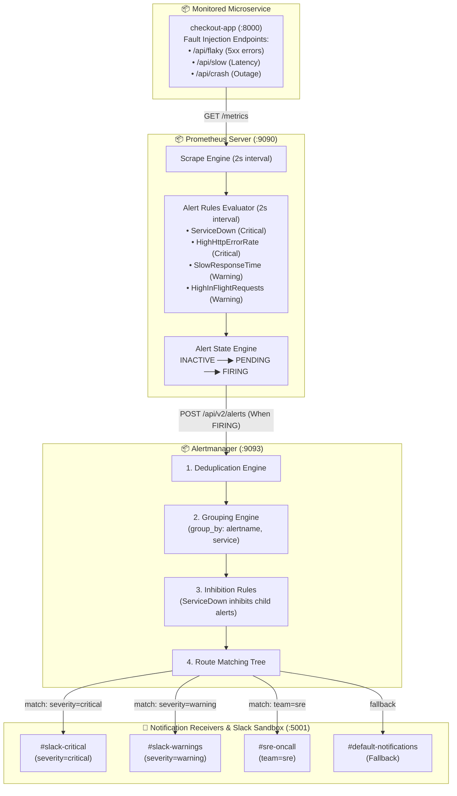

<!-- markdownlint-disable MD013 MD033 MD051 MD060 -->
# 04 - Prometheus Alertmanager Routing & Slack Notifications

> A production-grade incident management and alerting pipeline integrating **Prometheus Alerting Rules**, **Alertmanager Routing Trees**, **Alert Grouping**, **Cascading Failure Inhibition Rules**, and a **Mock Slack Webhook Sandbox** for deterministic local verification.

---

## 📋 Table of Contents

1. [Architectural Overview & Alerting Pipeline](#-architectural-overview--alerting-pipeline)
   - [Alertmanager Pipeline Architecture Diagram](#alertmanager-pipeline-architecture-diagram)
   - [The End-to-End Alert Lifecycle](#the-end-to-end-alert-lifecycle)
2. [Theoretical Deep-Dive for Beginners](#-theoretical-deep-dive-for-beginners)
   - [Why Separate Metric Evaluation from Notification Delivery?](#why-separate-metric-evaluation-from-notification-delivery)
   - [Anatomy of a Prometheus Alerting Rule](#anatomy-of-a-prometheus-alerting-rule)
   - [Alertmanager Pipeline Mechanics: 4 Critical Stages](#alertmanager-pipeline-mechanics-4-critical-stages)
   - [Alert Routing Trees & Matcher Semantics](#alert-routing-trees--matcher-semantics)
   - [Inhibition Rules: Eliminating Alert Storms](#inhibition-rules-eliminating-alert-storms)
   - [SRE Alerting Best Practices: Fighting Pager Fatigue](#sre-alerting-best-practices-fighting-pager-fatigue)
3. [Repository & Directory Structure](#-repository--directory-structure)
4. [Prerequisites & System Setup](#-prerequisites--system-setup)
5. [Quickstart Guide](#-quickstart-guide)
6. [Step-by-Step Hands-On Guide](#-step-by-step-hands-on-guide)
   - [Step 1: Inspect Alerting Rules & Thresholds](#step-1-inspect-alerting-rules--thresholds)
   - [Step 2: Inspect Alertmanager Routing & Inhibition](#step-2-inspect-alertmanager-routing--inhibition)
   - [Step 3: Launch the Stack with Docker Compose](#step-3-launch-the-stack-with-docker-compose)
   - [Step 4: Explore Prometheus & Alertmanager Web Consoles](#step-4-explore-prometheus--alertmanager-web-consoles)
   - [Step 5: Trigger Incident 1: HTTP 5xx Error Burst](#step-5-trigger-incident-1-http-5xx-error-burst)
   - [Step 6: Trigger Incident 2: Latency Spike](#step-6-trigger-incident-2-latency-spike)
   - [Step 7: Trigger Incident 3: Cascading Failure & Inhibition Test](#step-7-trigger-incident-3-cascading-failure--inhibition-test)
   - [Step 8: Test Auto-Resolution & Recovery](#step-8-test-auto-resolution--recovery)
   - [Step 9: Run the Automated Test Suite](#step-9-run-the-automated-test-suite)
7. [Alert Routing & Notification Matrix](#-alert-routing--notification-matrix)
8. [Troubleshooting & Common Gotchas](#-troubleshooting--common-gotchas)
9. [Resource Teardown & Complete Cleanup](#-resource-teardown--complete-cleanup)

---

## 🏛️ Architectural Overview & Alerting Pipeline

### Alertmanager Pipeline Architecture Diagram



### The End-to-End Alert Lifecycle

1. **Condition Detection**: Prometheus evaluates the PromQL expression in `alerts.yml` every 2 seconds (e.g. `error_rate > 15%`).
2. **Pending State**: The expression evaluates to `true`. The alert enters state **PENDING**. Prometheus awaits the duration specified by `for: 10s` to confirm it is not a momentary transient spike.
3. **Firing State**: The condition remains true for $\ge 10$ seconds. The alert transitions to **FIRING** and Prometheus dispatches an HTTP POST request containing alert metadata to Alertmanager (`http://alertmanager:9093/api/v2/alerts`).
4. **Alertmanager Processing**:
   - **Deduplication**: Merges identical alerts from redundant Prometheus instances.
   - **Grouping**: Waits `group_wait: 3s` to bundle related alert events into a single notification digest.
   - **Inhibition**: Checks if a higher-priority blocking alert (such as `ServiceDown`) is active. If so, dependent symptom alerts are muted.
   - **Routing**: Matches labels (`severity`, `team`) to determine target webhook destinations.
5. **Dispatch & Notification**: Formatted notification cards are posted to the target channel (e.g. `#slack-critical`).
6. **Auto-Resolution**: Once the microservice recovers, Prometheus marks the alert **INACTIVE** and sends a `RESOLVED` webhook to notify engineers that the incident has ended.

---

## 🧠 Theoretical Deep-Dive for Beginners

### Why Separate Metric Evaluation from Notification Delivery?

In modern Site Reliability Engineering, alerting is deliberately decoupled into two specialized components:

```text
┌──────────────────────────────────┐      ┌──────────────────────────────────┐
│        PROMETHEUS ENGINE         │      │       ALERTMANAGER ENGINE        │
├──────────────────────────────────┤      ├──────────────────────────────────┤
│ • Collects time-series metrics   │      │ • Deduplicates alerts across HA  │
│ • Evaluates boolean PromQL rules │ ──▶  │ • Groups related notifications   │
│ • Tracks Pending vs. Firing state│      │ • Applies Inhibition rules       │
│ • Knows NOTHING about Slack/SMS  │      │ • Routes to Teams & Receivers    │
└──────────────────────────────────┘      └──────────────────────────────────┘
```

- **Separation of Concerns**: Prometheus focuses entirely on TSDB math and threshold evaluations. It does not handle email SMTP, Slack tokens, PagerDuty APIs, or rate-limiting notification providers.
- **High-Availability Deduplication**: If you run two redundant Prometheus servers scraping the same infrastructure, Alertmanager deduplicates the duplicate alerts into a **single notification**.

### Anatomy of a Prometheus Alerting Rule

```yaml
- alert: HighHttpErrorRate              # Unique Alert Identifier
  expr: (sum(rate(5xx[1m])) / sum(rate(total[1m]))) * 100 > 15   # PromQL Condition
  for: 10s                              # Time threshold must remain true before firing
  labels:                               # Routing and ownership metadata
    severity: critical
    team: backend
    service: checkout-api
  annotations:                          # Human-readable incident details
    summary: "High HTTP 5xx error rate on checkout-api"
    description: "Over 15% of requests are failing with 5xx server errors."
    runbook_url: "https://wiki.internal/runbooks/http-error-rate"
```

- **`expr`**: The PromQL boolean query. Evaluates to an instant vector of failing series.
- **`for`**: Prevents flapping alerts caused by momentary blips.
- **`labels`**: Used by Alertmanager's routing tree to steer alerts to the right teams.
- **`annotations`**: Descriptive fields that populate the alert notification message.

### Alertmanager Pipeline Mechanics: 4 Critical Stages

```text
┌────────────────────────────────────────────────────────────────────────┐
│                     ALERTMANAGER PROCESSING STAGES                     │
├────────────────────────────────────────────────────────────────────────┤
│  1. DEDUPLICATION   Merges identical alerts sharing the same label set │
│                     into one single incident record.                   │
│                                                                        │
│  2. GROUPING        Groups alerts by labels (e.g. service, cluster).   │
│                     • group_wait (3s): Initial wait to bundle alerts.  │
│                     • group_interval (6s): Interval between updates.   │
│                     • repeat_interval (30m): Time before re-notifying. │
│                                                                        │
│  3. INHIBITION      Suppresses lower-priority alerts when a root-cause │
│                     outage alert is already active.                    │
│                                                                        │
│  4. ROUTING         Traverses the route tree from root to leaf nodes   │
│                     to determine destination receivers (Slack, Pager). │
└────────────────────────────────────────────────────────────────────────┘
```

### Alert Routing Trees & Matcher Semantics

Alertmanager uses a hierarchical routing tree. Every alert enters at the root node and evaluates child routes:

```yaml
route:
  receiver: 'default-webhook'
  group_by: ['alertname', 'service', 'severity']
  routes:
    - receiver: 'slack-critical'
      matchers:
        - severity = critical
      continue: true          # continue: true evaluates subsequent sibling routes

    - receiver: 'slack-warnings'
      matchers:
        - severity = warning

    - receiver: 'sre-oncall'
      matchers:
        - team = sre
```

### Inhibition Rules: Eliminating Alert Storms

When an entire server or Kubernetes node crashes, dozens of downstream alerts fire simultaneously (e.g., `HighHttpLatency`, `ConnectionTimeout`, `QueueDepthHigh`).

**Inhibition** silences the symptom alerts if the root outage alert is already firing:

```yaml
inhibit_rules:
  - source_matchers:          # The ROOT CAUSE alert
      - alertname = ServiceDown
      - severity = critical
    target_matchers:          # The SYMPTOM alerts to mute
      - alertname =~ "SlowResponseTime|HighHttpErrorRate|HighInFlightRequests"
    equal: ['service']        # Only inhibit if 'service' label matches
```

### SRE Alerting Best Practices: Fighting Pager Fatigue

1. **Alert on Symptoms, Not Causes**: Page on high customer-facing error rates ($> 1\%$) or user-visible latency ($p99 > 1s$), not on arbitrary CPU spikes that don't affect users.
2. **Include Runbooks Everywhere**: Every alert must include a `runbook_url` explaining diagnostic steps and remediation procedures.
3. **Use Muting Silences During Deployments**: Set temporary silences via the Alertmanager UI during scheduled maintenance.

---

## 📂 Repository & Directory Structure

```text
08-observability-and-monitoring/04-alertmanager-routing-slack/
├── README.md                   # Comprehensive guide and beginner documentation
├── alertmanager/
│   ├── Dockerfile              # Alertmanager image packaging routing configuration
│   └── alertmanager.yml        # Routing tree, grouping, inhibition rules, and receivers
├── app/
│   ├── Dockerfile              # Target microservice image definition
│   ├── main.py                 # FastAPI microservice with metrics and fault injection APIs
│   └── requirements.txt        # Python dependencies (fastapi, uvicorn, prometheus-client)
├── cleanup.sh                  # Automated resource teardown and cleanup script
├── docker-compose.yml          # Multi-container stack (Prometheus, Alertmanager, Receiver, App)
├── prometheus/
│   ├── Dockerfile              # Prometheus image packaging alert rules and scrape config
│   ├── alerts.yml              # Prometheus alerting rules (ServiceDown, ErrorRate, Latency)
│   └── prometheus.yml          # Scrape jobs and Alertmanager backend endpoint target
├── test_stack.sh               # Master E2E automated test runner and verification suite
├── trigger_synthetic_alert.sh  # CLI tool to trigger specific incident scenarios
├── webhook_receiver/
│   ├── Dockerfile              # Webhook receiver image definition
│   ├── app.py                  # Mock Slack sandbox logging formatted alert cards
│   └── requirements.txt        # Python dependencies
└── .gitignore                  # Ignores test artifacts, bytecode, and logs
```

---

## ⚙️ Prerequisites & System Setup

1. **Docker Engine**: [OrbStack](https://orbstack.dev/) (recommended on macOS), Docker Desktop, or Podman.
2. **Docker Compose**: `docker compose` plugin or `docker-compose`.
3. **Python 3**: Python 3.8+ installed locally.
4. **curl**: Standard command-line HTTP utility.

---

## ⚡ Quickstart Guide

Run the full end-to-end alerting test workflow in under 45 seconds:

```bash
# 1. Navigate to the project directory
cd 08-observability-and-monitoring/04-alertmanager-routing-slack

# 2. Run the automated master test suite
./test_stack.sh

# 3. View Alertmanager Web Console
open http://localhost:9093
```

---

## 📖 Step-by-Step Hands-On Guide

### Step 1: Inspect Alerting Rules & Thresholds

Inspect [`prometheus/alerts.yml`](file:///Users/fabian/Documents/CodeProjects/github.com/fabiankaraben/devops-sre-mini-projects/08-observability-and-monitoring/04-alertmanager-routing-slack/prometheus/alerts.yml) to see how alert expressions are structured:

```yaml
- alert: HighHttpErrorRate
  expr: (sum(rate(http_requests_total{status_code=~"5.."}[1m])) / sum(rate(http_requests_total[1m]))) * 100 > 15
  for: 10s
  labels:
    severity: critical
    team: backend
    service: checkout-api
```

### Step 2: Inspect Alertmanager Routing & Inhibition

Inspect [`alertmanager/alertmanager.yml`](file:///Users/fabian/Documents/CodeProjects/github.com/fabiankaraben/devops-sre-mini-projects/08-observability-and-monitoring/04-alertmanager-routing-slack/alertmanager/alertmanager.yml) to see how alerts are matched to receivers (`#slack-critical`, `#slack-warnings`, `#sre-oncall`) and how `inhibit_rules` suppress cascading alert storms.

### Step 3: Launch the Stack with Docker Compose

Build and start all 4 services:

```bash
docker compose up -d --build
```

Verify that all containers are healthy:

```bash
docker compose ps
```

Expected output:

```text
NAME                  IMAGE                                       SERVICE            STATUS
alertmanager-server   mini-proj-08-04-alertmanager:local          alertmanager       Up (healthy)
checkout-app          mini-proj-08-04-app:local                   app                Up (healthy)
prometheus-server     mini-proj-08-04-prometheus:local            prometheus         Up (healthy)
webhook-receiver      mini-proj-08-04-webhook-receiver:local      webhook-receiver   Up (healthy)
```

### Step 4: Explore Prometheus & Alertmanager Web Consoles

Open the following consoles in your browser:

- **Prometheus Alerts Console**: `http://localhost:9090/alerts` (Inspect all 4 rules in green `INACTIVE` state).
- **Alertmanager Console**: `http://localhost:9093` (Inspect active routing, silences, and cluster status).
- **Mock Slack Receiver Logs**: `http://localhost:5001/api/alerts/received` (Live JSON feed of delivered webhooks).

### Step 5: Trigger Incident 1: HTTP 5xx Error Burst

Trigger a burst of 500 server errors on the checkout service:

```bash
./trigger_synthetic_alert.sh --scenario errors --duration 12
```

1. Open `http://localhost:9090/alerts`. Watch `HighHttpErrorRate` turn red (**FIRING**).
2. Open `http://localhost:9093`. Confirm Alertmanager receives the alert and groups it.
3. Check the Mock Webhook console logs:

```bash
docker logs webhook-receiver --tail 25
```

You will see the formatted Slack notification card:

```text
┌────────────────────────────────────────────────────────────────────────┐
│ 🚨 [SLACK NOTIFICATION] Channel: #slack-critical      Status: FIRING     │
├────────────────────────────────────────────────────────────────────────┤
│ Alert #1: HighHttpErrorRate [CRITICAL] Service: checkout-api
│ Summary    : High HTTP 5xx error rate on checkout-api: 88.50%
│ Description: Over 15% of requests to checkout-api are failing with 5xx.
└────────────────────────────────────────────────────────────────────────┘
```

### Step 6: Trigger Incident 2: Latency Spike

Inject slow responses into the microservice:

```bash
./trigger_synthetic_alert.sh --scenario latency --duration 12
```

- Prometheus transitions `SlowResponseTime` to **FIRING**.
- Alertmanager routes the notification to channel `#slack-warnings`.

### Step 7: Trigger Incident 3: Cascading Failure & Inhibition Test

Trigger a complete service crash:

```bash
./trigger_synthetic_alert.sh --scenario crash
```

1. `ServiceDown` fires with `severity: critical`.
2. Notice that `SlowResponseTime` and `HighHttpErrorRate` are **INHIBITED** by Alertmanager, preventing a barrage of duplicate notifications!

### Step 8: Test Auto-Resolution & Recovery

Restore the microservice to a healthy operational state:

```bash
./trigger_synthetic_alert.sh --scenario recover
```

Alertmanager will automatically dispatch a `RESOLVED` webhook card to inform the team that the outage has ended.

### Step 9: Run the Automated Test Suite

Execute the master verification script:

```bash
./test_stack.sh
```

---

## 📊 Alert Routing & Notification Matrix

| Alert Name | Severity | Condition | Target Channel | Inhibition Behavior |
| :--- | :--- | :--- | :--- | :--- |
| **`ServiceDown`** | `critical` | Target `up == 0` for 10s | `#slack-critical` & `#sre-oncall` | **Source**: Inhibits all child alerts on service |
| **`HighHttpErrorRate`** | `critical` | HTTP 5xx errors $> 15\%$ for 10s | `#slack-critical` | **Target**: Muted if `ServiceDown` is firing |
| **`SlowResponseTime`** | `warning` | p95 Latency $> 500\text{ms}$ for 10s | `#slack-warnings` | **Target**: Muted if `ServiceDown` is firing |
| **`HighInFlightRequests`**| `warning` | In-Flight requests $> 15$ for 10s | `#slack-warnings` & `#sre-oncall` | **Target**: Muted if `ServiceDown` is firing |

---

## 🛠️ Troubleshooting & Common Gotchas

### 1. Alert stays in PENDING state and never FIRES

- **Cause**: The `for: 10s` duration has not elapsed yet, or the traffic generator stopped before reaching the duration threshold.
- **Solution**: Run `./trigger_synthetic_alert.sh --duration 15` to ensure the fault persists longer than the `for` window.

### 2. Inhibition rule is not muting child alerts

- **Cause**: Missing matching label in `equal: ['service']`. Both the source alert and target alert must possess identical label values for the keys specified in `equal`.
- **Solution**: Verify that both `ServiceDown` and child alerts contain `service: checkout-api`.

### 3. Alertmanager returns "Client.Timeout exceeded while awaiting headers"

- **Cause**: The webhook receiver URL in `alertmanager.yml` is unreachable or incorrect.
- **Solution**: Inside Docker Compose, use the service container DNS name (`http://webhook-receiver:5001`), not `localhost:5001`.

---

## 🧹 Resource Teardown & Complete Cleanup

To leave your local environment 100% clean for the next mini-project:

### Option A: Automated Cleanup Script (Recommended)

```bash
# Standard cleanup: Removes containers, networks, and named storage volumes
./cleanup.sh

# Complete cleanup: Also removes all built Docker images
./cleanup.sh --all
```

### Option B: Manual Teardown Step-by-Step

```bash
# 1. Stop and remove containers, networks, and storage volumes
docker compose down -v --remove-orphans

# 2. (Optional) Purge locally built Docker images
docker rmi mini-proj-08-04-prometheus:local mini-proj-08-04-alertmanager:local mini-proj-08-04-webhook-receiver:local mini-proj-08-04-app:local 2>/dev/null || true

# 3. Clean temporary Python files and test logs
find . -type d -name "__pycache__" -exec rm -rf {} + 2>/dev/null || true
find . -type f -name "*.pyc" -delete 2>/dev/null || true
```

### Verification Checklist

Confirm that no lingering resources remain:

```bash
# 1. Verify no containers are running
docker ps -a --filter "name=alertmanager-server" --filter "name=prometheus-server" --filter "name=webhook-receiver"

# 2. Verify storage volumes are deleted
docker volume ls --filter "name=alertmanager_storage_data" --filter "name=prometheus_alerting_data"

# 3. Verify bridge network is deleted
docker network ls --filter "name=alerting-stack-net"
```

All three commands should return empty tables.
