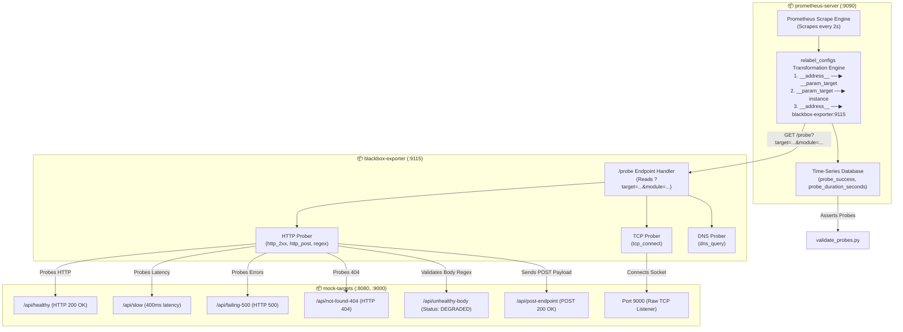

<!-- markdownlint-disable MD013 MD033 MD051 MD060 -->
# 05 - Prometheus Blackbox Exporter Endpoint Uptime Probing

> A production-grade **Synthetic External Uptime Monitoring** framework leveraging **Prometheus Blackbox Exporter**, advanced **Prometheus Relabeling Configurations**, and multi-protocol probing (**HTTP GET/POST**, **Response Body Regex Validation**, and **Raw TCP Sockets**) against instrumented mock target endpoints.

---

## 📋 Table of Contents

1. [Architectural Overview & Probing Flow](#-architectural-overview--probing-flow)
   - [Synthetic Monitoring Architecture Diagram](#synthetic-monitoring-architecture-diagram)
   - [How Blackbox Probing Executes](#how-blackbox-probing-executes)
2. [Theoretical Deep-Dive for Beginners](#-theoretical-deep-dive-for-beginners)
   - [Blackbox (Synthetic) vs. Whitebox Monitoring](#blackbox-synthetic-vs-whitebox-monitoring)
   - [The Prometheus Relabeling Trick Explained](#the-prometheus-relabeling-trick-explained)
   - [Multi-Protocol Probe Modules](#multi-protocol-probe-modules)
   - [Key Probe Metrics & SSL Certificate Expiration](#key-probe-metrics--ssl-certificate-expiration)
3. [Repository & Directory Structure](#-repository--directory-structure)
4. [Prerequisites & System Setup](#-prerequisites--system-setup)
5. [Quickstart Guide](#-quickstart-guide)
6. [Step-by-Step Hands-On Guide](#-step-by-step-hands-on-guide)
   - [Step 1: Inspect Blackbox Exporter Modules](#step-1-inspect-blackbox-exporter-modules)
   - [Step 2: Inspect Prometheus Relabeling Configurations](#step-2-inspect-prometheus-relabeling-configurations)
   - [Step 3: Launch the Stack with Docker Compose](#step-3-launch-the-stack-with-docker-compose)
   - [Step 4: Explore Prometheus Targets & Blackbox Debug UI](#step-4-explore-prometheus-targets--blackbox-debug-ui)
   - [Step 5: Query Live Probe Metrics in Prometheus](#step-5-query-live-probe-metrics-in-prometheus)
   - [Step 6: Run the Automated Probe Validation Suite](#step-6-run-the-automated-probe-validation-suite)
7. [Probe Metrics Reference & Alert Rules Matrix](#-probe-metrics-reference--alert-rules-matrix)
8. [Troubleshooting & Common Gotchas](#-troubleshooting--common-gotchas)
9. [Resource Teardown & Complete Cleanup](#-resource-teardown--complete-cleanup)

---

## 🏛️ Architectural Overview & Probing Flow

### Synthetic Monitoring Architecture Diagram



### How Blackbox Probing Executes

1. **Scrape Trigger**: Prometheus decides to scrape a target (e.g. `http://mock-targets:8080/api/healthy`).
2. **Relabeling Translation**:
   - The destination target is placed into query parameter `?target=http://mock-targets:8080/api/healthy`.
   - The label `instance` is set to `http://mock-targets:8080/api/healthy`.
   - The actual network request is redirected to `http://blackbox-exporter:9115/probe`.
3. **External Probe Execution**: Blackbox Exporter opens a real network connection to the target, performs DNS resolution, TCP handshake, TLS negotiation (if HTTPS), HTTP request dispatch, and response validation.
4. **Metrics Generation**: Blackbox Exporter returns time-series metrics (`probe_success`, `probe_duration_seconds`, `probe_http_status_code`) back to Prometheus in Prometheus text exposition format.

---

## 🧠 Theoretical Deep-Dive for Beginners

### Blackbox (Synthetic) vs. Whitebox Monitoring

```text
┌────────────────────────────────────────────────────────────────────────┐
│               WHITEBOX MONITORING vs. BLACKBOX MONITORING              │
├────────────────────────────────────────────────────────────────────────┤
│  WHITEBOX (From the Inside Out)        BLACKBOX (From the Outside In)  │
│                                                                        │
│  [Application Internals]               [External Client / User POV]    │
│        │                                        │                      │
│        ├─ Memory allocations                    ├─ DNS resolution time │
│        ├─ Garbage Collection (GC)               ├─ TCP connect latency │
│        ├─ Database connection pools             ├─ TLS handshake & SSL │
│        └─ Internal function latencies           ├─ HTTP status code    │
│                                                 └─ Response payload    │
│                                                                        │
│  ⚠️ Caveat: If the app crashes or the   ✅ Benefit: Tests the exact    │
│     network breaks, /metrics cannot be     customer experience from    │
│     reached at all!                        the network perimeter.      │
└────────────────────────────────────────────────────────────────────────┘
```

Both paradigms are essential in production:

- **Whitebox monitoring** tells you *why* an application is failing (e.g. out of memory, slow database query).
- **Blackbox monitoring** tells you *that* the application is broken from the user's perspective (e.g. DNS failure, HTTP 500 error, expired SSL certificate).

### The Prometheus Relabeling Trick Explained

Prometheus was designed to scrape endpoints that expose metrics directly at `/metrics`. However, Blackbox Exporter acts as a **proxy**: it probes external systems and reports metrics on their behalf.

To achieve this without changing how Prometheus works, we use `relabel_configs`:

```yaml
scrape_configs:
  - job_name: 'probe_http_healthy'
    metrics_path: /probe                    # 1. Scrape /probe endpoint instead of /metrics
    params:
      module: [http_2xx]                    # 2. Add ?module=http_2xx query parameter
    static_configs:
      - targets:
          - 'http://mock-targets:8080/api/healthy'   # The TARGET to probe
    relabel_configs:
      # Step A: Copy original target address to ?target= query parameter
      - source_labels: [__address__]
        target_label: __param_target

      # Step B: Copy target address to the human-readable 'instance' label
      - source_labels: [__param_target]
        target_label: instance

      # Step C: Replace the network scrape address with the Blackbox Exporter host:port
      - target_label: __address__
        replacement: blackbox-exporter:9115
```

```text
Target specified in config : http://mock-targets:8080/api/healthy
              │
              ▼ (relabel_configs)
Prometheus executes HTTP GET : http://blackbox-exporter:9115/probe?module=http_2xx&target=http%3A%2F%2Fmock-targets%3A8080%2Fapi%2Fhealthy
              │
              ▼
Resulting time-series label  : probe_success{instance="http://mock-targets:8080/api/healthy", job="probe_http_healthy"} 1
```

### Multi-Protocol Probe Modules

Blackbox Exporter supports 5 prober types:

1. **`http`**: HTTP and HTTPS requests. Supports custom methods (GET, POST, PUT), header injection, cookies, redirects, basic auth, bearer tokens, body regex validation, and TLS verification.
2. **`tcp`**: Connects to raw TCP ports (e.g. Redis `:6379`, MySQL `:3306`, SSH `:22`), supports query/response sequences (e.g. sending `PING\r\n` and expecting `+PONG\r\n`).
3. **`dns`**: Sends DNS queries over UDP or TCP to evaluate resolver latency and DNS record correctness.
4. **`icmp`**: ICMP echo requests (ping) to measure packet loss and Round-Trip Time (RTT).
5. **`grpc`**: Evaluates gRPC health checking protocol endpoints.

### Key Probe Metrics & SSL Certificate Expiration

| Metric Name | Type | Description |
| :--- | :--- | :--- |
| **`probe_success`** | Gauge | `1` if probe succeeded according to module rules, `0` if probe failed |
| **`probe_duration_seconds`** | Gauge | Total time taken for the entire probe execution in seconds |
| **`probe_http_status_code`** | Gauge | HTTP response status code (e.g. 200, 404, 500) |
| **`probe_ssl_earliest_cert_expiry`** | Gauge | Unix timestamp when the earliest SSL certificate expires |
| **`probe_dns_lookup_time_seconds`** | Gauge | Time spent performing DNS resolution |
| **`probe_http_content_length`** | Gauge | Length of the received HTTP response body |

#### SSL Certificate Expiry Alert Rule (Production Standard)

```yaml
- alert: SSLCertExpiringSoon
  expr: (probe_ssl_earliest_cert_expiry - time()) / 86400 < 14
  for: 1h
  labels:
    severity: warning
  annotations:
    summary: "SSL Certificate for {{ $labels.instance }} expires in less than 14 days"
```

---

## 📂 Repository & Directory Structure

```text
08-observability-and-monitoring/05-blackbox-exporter-uptime-probing/
├── README.md                   # Comprehensive educational documentation
├── blackbox/
│   ├── Dockerfile              # Blackbox Exporter image definition
│   └── blackbox.yml            # Probe module definitions (http_2xx, post, regex, tcp, dns)
├── cleanup.sh                  # Automated resource teardown and cleanup script
├── docker-compose.yml          # Multi-container stack (Prometheus, Blackbox, Mock Targets)
├── mock_target_endpoints/
│   ├── Dockerfile              # Mock Target service image definition
│   ├── app.py                  # FastAPI + TCP socket server simulating varied endpoints
│   └── requirements.txt        # Python dependencies (fastapi, uvicorn)
├── prometheus/
│   ├── Dockerfile              # Prometheus server image definition
│   ├── probe_rules.yml         # Alerting rules for probe failures and latency breaches
│   └── prometheus.yml          # Scrape configuration with Blackbox relabeling
├── test_stack.sh               # Master automated E2E test runner
├── validate_probes.py          # Programmatic PromQL probe validation test suite
└── .gitignore                  # Ignores test artifacts, bytecode, and logs
```

---

## ⚙️ Prerequisites & System Setup

1. **Docker Engine**: [OrbStack](https://orbstack.dev/) (recommended on macOS), Docker Desktop, or Podman.
2. **Docker Compose**: `docker compose` plugin or `docker-compose`.
3. **Python 3**: Python 3.8+ installed locally.
4. **curl**: Standard command-line HTTP utility.

---

## ⚡ Quickstart Guide

Launch the entire stack and validate all synthetic probes in under 30 seconds:

```bash
# 1. Navigate to the project directory
cd 08-observability-and-monitoring/05-blackbox-exporter-uptime-probing

# 2. Run the automated master test suite
./test_stack.sh

# 3. View Prometheus Targets & Probe States
open http://localhost:9090/targets
```

---

## 📖 Step-by-Step Hands-On Guide

### Step 1: Inspect Blackbox Exporter Modules

Inspect [`blackbox/blackbox.yml`](file:///Users/fabian/Documents/CodeProjects/github.com/fabiankaraben/devops-sre-mini-projects/08-observability-and-monitoring/05-blackbox-exporter-uptime-probing/blackbox/blackbox.yml):

- `http_2xx`: Tests standard HTTP 2xx response.
- `http_post_2xx`: Sends JSON body payload.
- `http_custom_match`: Asserts response body matches `.*"status":\s*"UP".*` via `fail_if_body_not_matches_regexp`.
- `tcp_connect`: Probes TCP port connectivity.

### Step 2: Inspect Prometheus Relabeling Configurations

Inspect [`prometheus/prometheus.yml`](file:///Users/fabian/Documents/CodeProjects/github.com/fabiankaraben/devops-sre-mini-projects/08-observability-and-monitoring/05-blackbox-exporter-uptime-probing/prometheus/prometheus.yml) to review how `relabel_configs` passes the destination target as `__param_target` and rewrites `__address__` to `blackbox-exporter:9115`.

### Step 3: Launch the Stack with Docker Compose

Build and launch all containers:

```bash
docker compose up -d --build
```

Verify that all services are healthy:

```bash
docker compose ps
```

Expected output:

```text
NAME                IMAGE                                  SERVICE             STATUS
blackbox-exporter   mini-proj-08-05-blackbox:local         blackbox-exporter   Up (healthy)
mock-targets        mini-proj-08-05-mock-targets:local     mock-targets        Up (healthy)
prometheus-server   mini-proj-08-05-prometheus:local       prometheus          Up (healthy)
```

### Step 4: Explore Prometheus Targets & Blackbox Debug UI

Open your browser:

1. **Prometheus Targets Page**: `http://localhost:9090/targets`
   - Review all probe jobs (`probe_http_healthy`, `probe_http_slow`, `probe_http_failing`, `probe_http_body_match`, `probe_tcp_socket`).
2. **Blackbox Exporter Debug UI**: `http://localhost:9115`
   - Click on recent probe logs to inspect raw HTTP requests, TCP connection latency, and regex validation outputs in real time.

### Step 5: Query Live Probe Metrics in Prometheus

Navigate to `http://localhost:9090/graph` and execute the following PromQL queries:

#### 1. Uptime Success Ratio Across All Endpoints

```promql
probe_success
```

- Returns `1` for `/api/healthy`, `/api/slow`, `/api/post-endpoint`, and `mock-targets:9000`.
- Returns `0` for `/api/failing-500`, `/api/not-found-404`, and `/api/unhealthy-body`.

#### 2. Probe Latency Breakdown

```promql
probe_duration_seconds
```

- Displays the exact time taken to probe each service. Notice `/api/slow` taking $\approx 0.40\text{s}$.

#### 3. HTTP Status Codes Captured by Synthetic Probes

```promql
probe_http_status_code
```

- Returns `200`, `404`, and `500` respectively.

### Step 6: Run the Automated Probe Validation Suite

Run [`validate_probes.py`](file:///Users/fabian/Documents/CodeProjects/github.com/fabiankaraben/devops-sre-mini-projects/08-observability-and-monitoring/05-blackbox-exporter-uptime-probing/validate_probes.py) to assert all probe metrics programmatically:

```bash
python3 validate_probes.py
```

Sample output:

```text
======================================================================
  🔍 Prometheus Blackbox Exporter - Synthetic Probes Test Suite
======================================================================

▶ Awaiting initial Blackbox scrape cycles...

▶ [1/6] Verifying Healthy HTTP Endpoint Probing...
  [PASS] Healthy HTTP Probe: probe_success == 1.0 for http://mock-targets:8080/api/healthy

▶ [2/6] Verifying Failing Endpoints (500 Error & 404 Not Found)...
  [PASS] HTTP 500 Failure Probe: Correctly identified probe_success == 0.0 on 500 error.
  [PASS] HTTP 404 Failure Probe: Correctly identified probe_success == 0.0 on 404 Not Found.

▶ [3/6] Verifying HTTP Response Body Regex Matching (http_custom_match)...
  [PASS] Content Match (Valid): probe_success == 1.0 when response body matched regex.
  [PASS] Content Match (Mismatch): probe_success == 0.0 when response body contained DEGRADED status.

▶ [4/6] Verifying HTTP POST Probing (http_post_2xx)...
  [PASS] HTTP POST Probe: probe_success == 1.0 for JSON POST payload probe.

▶ [5/6] Verifying Raw TCP Socket Probing (tcp_connect)...
  [PASS] TCP Socket Probe: probe_success == 1.0 for TCP port mock-targets:9000

▶ [6/6] Verifying Probe Latency Metrics (probe_duration_seconds)...
  [PASS] Slow Probe Latency: Accurately captured synthetic delay: 0.4071s (>= 0.35s)

======================================================================
  📊 SYNTHETIC PROBE TEST SUMMARY
======================================================================
  Total Probe Tests Executed : 8
  Passed                     : 8
  Failed                     : 0
----------------------------------------------------------------------
  🎉 ALL BLACKBOX SYNTHETIC PROBES PASSED!
```

---

## 📊 Probe Metrics Reference & Alert Rules Matrix

| Target Endpoint | Module | Expected `probe_success` | Expected Latency | Alert Triggered |
| :--- | :--- | :--- | :--- | :--- |
| `http://mock-targets:8080/api/healthy` | `http_2xx` | `1.0` | $< 50\text{ms}$ | None (Healthy) |
| `http://mock-targets:8080/api/slow` | `http_2xx` | `1.0` | $\ge 400\text{ms}$ | `EndpointHighLatency` (Warning) |
| `http://mock-targets:8080/api/failing-500` | `http_2xx` | `0.0` | $< 50\text{ms}$ | `EndpointDown` (Critical) |
| `http://mock-targets:8080/api/not-found-404` | `http_2xx` | `0.0` | $< 50\text{ms}$ | `EndpointDown` (Critical) |
| `http://mock-targets:8080/api/unhealthy-body`| `http_custom_match` | `0.0` | $< 50\text{ms}$ | `HttpContentMismatch` (Critical) |
| `http://mock-targets:8080/api/post-endpoint` | `http_post_2xx` | `1.0` | $< 50\text{ms}$ | None (Healthy) |
| `mock-targets:9000` | `tcp_connect` | `1.0` | $< 20\text{ms}$ | None (TCP Reachable) |

---

## 🛠️ Troubleshooting & Common Gotchas

### 1. Prometheus reports "connection refused" on probe scrape

- **Cause**: The `__address__` replacement in `relabel_configs` points to an incorrect hostname or port.
- **Solution**: Inside Docker Compose, use `blackbox-exporter:9115`, not `localhost:9115`.

### 2. Regex body match fails on valid JSON

- **Cause**: Unescaped quotes or spacing mismatch in `fail_if_body_not_matches_regexp`.
- **Solution**: Use flexible regex patterns like `.*"status":\s*"UP".*` to account for variable whitespace.

### 3. Blackbox Exporter logs "field fail_if_not_matches_regexp not found"

- **Cause**: Field syntax changed across Blackbox versions.
- **Solution**: Use `fail_if_body_not_matches_regexp` for response body validation in `v0.25.0+`.

---

## 🧹 Resource Teardown & Complete Cleanup

To leave your local environment completely clean for the next mini-project:

### Option A: Automated Cleanup Script (Recommended)

```bash
# Standard cleanup: Removes containers, networks, and named storage volumes
./cleanup.sh

# Complete cleanup: Also removes all built Docker images
./cleanup.sh --all
```

### Option B: Manual Teardown Step-by-Step

```bash
# 1. Stop and remove containers, networks, and storage volumes
docker compose down -v --remove-orphans

# 2. (Optional) Purge locally built Docker images
docker rmi mini-proj-08-05-prometheus:local mini-proj-08-05-blackbox:local mini-proj-08-05-mock-targets:local 2>/dev/null || true

# 3. Clean temporary Python files and test logs
find . -type d -name "__pycache__" -exec rm -rf {} + 2>/dev/null || true
find . -type f -name "*.pyc" -delete 2>/dev/null || true
```

### Verification Checklist

Confirm that no lingering resources remain:

```bash
# 1. Verify no containers are running
docker ps -a --filter "name=prometheus-server" --filter "name=blackbox-exporter" --filter "name=mock-targets"

# 2. Verify storage volumes are deleted
docker volume ls --filter "name=prometheus_blackbox_data"

# 3. Verify bridge network is deleted
docker network ls --filter "name=probing-stack-net"
```

All three commands should return empty tables.
