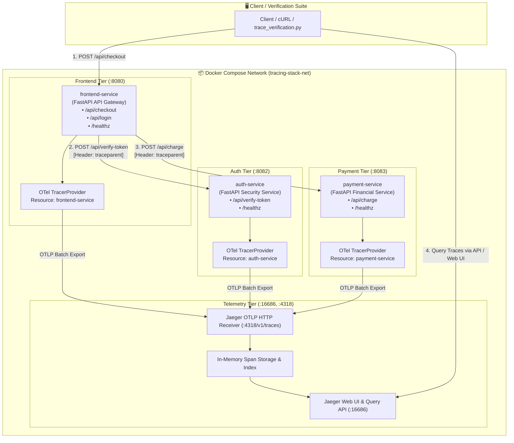
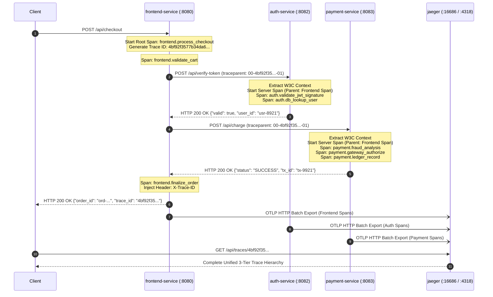

<!-- markdownlint-disable MD013 MD033 MD051 MD060 -->
# 06 - Distributed Tracing with OpenTelemetry and Jaeger

> A production-grade **Distributed Tracing** architecture across a multi-tier microservice system (**Frontend API Gateway** ➔ **Auth Service** ➔ **Payment Service**) instrumented with the **OpenTelemetry Python SDK**, propagating **W3C Trace Context** across network boundaries, exporting traces to **Jaeger All-in-One**, and providing an automated validation suite.

---

## 📋 Table of Contents

1. [Architectural Overview & Tracing Flow](#-architectural-overview--tracing-flow)
   - [System Topology Diagram](#system-topology-diagram)
   - [W3C Context Propagation Sequence](#w3c-context-propagation-sequence)
2. [Theoretical Deep-Dive for Beginners](#-theoretical-deep-dive-for-beginners)
   - [Why Distributed Tracing? The Limits of Metrics and Logs](#why-distributed-tracing-the-limits-of-metrics-and-logs)
   - [Core Primitives: Traces, Spans, and Context](#core-primitives-traces-spans-and-context)
   - [The W3C Trace Context Standard Explained](#the-w3c-trace-context-standard-explained)
   - [Context Injection and Extraction Mechanics](#context-injection-and-extraction-mechanics)
   - [OpenTelemetry SDK Architecture](#opentelemetry-sdk-architecture)
   - [Telemetry Attributes, Events, and Status Codes](#telemetry-attributes-events-and-status-codes)
   - [Jaeger Architecture & UI Capabilities](#jaeger-architecture--ui-capabilities)
3. [Repository & Directory Structure](#-repository--directory-structure)
4. [Prerequisites & System Setup](#-prerequisites--system-setup)
5. [Quickstart Guide](#-quickstart-guide)
6. [Step-by-Step Hands-On Guide](#-step-by-step-hands-on-guide)
   - [Step 1: Inspect OpenTelemetry Initialization in Code](#step-1-inspect-opentelemetry-initialization-in-code)
   - [Step 2: Start the Distributed Stack with Docker Compose](#step-2-start-the-distributed-stack-with-docker-compose)
   - [Step 3: Trigger a Successful E-Commerce Checkout Transaction](#step-3-trigger-a-successful-e-commerce-checkout-transaction)
   - [Step 4: Explore Traces & Waterfalls in the Jaeger Web UI](#step-4-explore-traces--waterfalls-in-the-jaeger-web-ui)
   - [Step 5: Trigger & Inspect an Authentication Failure Trace](#step-5-trigger--inspect-an-authentication-failure-trace)
   - [Step 6: Trigger & Inspect a Payment Decline / Exception Trace](#step-6-trigger--inspect-a-payment-decline--exception-trace)
   - [Step 7: Analyze Latency Bottlenecks via Waterfall Breakdown](#step-7-analyze-latency-bottlenecks-via-waterfall-breakdown)
   - [Step 8: Run the Automated End-to-End Verification Suite](#step-8-run-the-automated-end-to-end-verification-suite)
7. [Sampling Strategies & Production Best Practices](#-sampling-strategies--production-best-practices)
8. [Troubleshooting & Common Gotchas](#-troubleshooting--common-gotchas)
9. [Resource Teardown & Complete Cleanup](#-resource-teardown--complete-cleanup)

---

## 🏛️ Architectural Overview & Tracing Flow

### System Topology Diagram



### W3C Context Propagation Sequence



---

## 🧠 Theoretical Deep-Dive for Beginners

### Why Distributed Tracing? The Limits of Metrics and Logs

In traditional monolithic architectures, debugging a slow or failed request was straightforward: all logs were written to a single machine or log stream with a unified call stack.

In modern **microservice architectures**, a single user click (e.g. *"Complete Purchase"*) can trigger dozens of asynchronous network requests, database queries, and third-party API calls across multiple services written in different programming languages:

```text
┌─────────────────────────────────────────────────────────────────────────────┐
│                   THE THREE PILLARS OF OBSERVABILITY                        │
├─────────────────────────────────────────────────────────────────────────────┤
│ 1. METRICS (Aggregates)   │ "Our HTTP 500 error rate spiked to 12% across   │
│    Prometheus, StatsD     │ the cluster between 14:00 and 14:05."           │
│                           │ ❌ Doesn't tell you WHICH specific user request  │
│                           │ failed or the root cause across services.       │
├───────────────────────────┼─────────────────────────────────────────────────┤
│ 2. LOGS (Events)          │ "Payment gateway timeout at 14:02:11."          │
│    Loki, Elasticsearch    │ ❌ Millions of disconnected log lines per minute │
│                           │ without correlation make finding cause needle-  │
│                           │ in-a-haystack work.                             │
├───────────────────────────┼─────────────────────────────────────────────────┤
│ 3. TRACES (Request Paths) │ "User Jane Doe's checkout (Trace ID 4bf92f...)  │
│    OpenTelemetry, Jaeger  │ spent 12ms in Frontend, 15ms in Auth, and then  │
│                           │ timed out after 3000ms in Payment Gateway."     │
│                           │ ✅ Reconstructs the exact end-to-end journey!    │
└───────────────────────────┴─────────────────────────────────────────────────┘
```

---

### Core Primitives: Traces, Spans, and Context

Distributed tracing models user journeys using a directed acyclic graph (DAG) of **Spans**:

```text
[TRACE: 4bf92f3577b34da6a3ce929d0e0e4736 (Total Duration: 350ms)]
│
├── [SPAN 1 (Root): POST /api/checkout] ───────────────────────────────────▶ (350ms)
│   ├── [SPAN 2: frontend.validate_cart] ──▶ (15ms)
│   │
│   ├── [SPAN 3: frontend.authenticate_user] ──────────────────────────────▶ (45ms)
│   │   └── [SPAN 4 (Auth): POST /api/verify-token] ───────────────────────▶ (42ms)
│   │       ├── [SPAN 5: auth.validate_jwt_signature] ──▶ (10ms)
│   │       └── [SPAN 6: auth.db_lookup_user] ──────────▶ (25ms)
│   │
│   └── [SPAN 7: frontend.execute_payment] ────────────────────────────────▶ (280ms)
│       └── [SPAN 8 (Payment): POST /api/charge] ──────────────────────────▶ (275ms)
│           ├── [SPAN 9: payment.fraud_analysis] ──▶ (12ms)
│           ├── [SPAN 10: payment.gateway_authorize] ──────────────────────▶ (250ms)
│           └── [SPAN 11: payment.ledger_record] ──▶ (8ms)
```

1. **Trace**: The end-to-end journey of a request through the distributed system. Identified by a globally unique 128-bit hex string (**Trace ID**).
2. **Span**: A single named unit of contiguous work (e.g. executing an HTTP handler, performing a database query, or checking a cache). Identified by a 64-bit hex string (**Span ID**).
3. **Parent Span ID**: Points to the span that initiated the current span, forming a parent-child tree hierarchy.
4. **Span Context**: The immutable state containing the `Trace ID`, `Span ID`, and `Trace Flags` passed between threads and across network boundaries.

---

### The W3C Trace Context Standard Explained

Historically, tracing tools used vendor-proprietary HTTP headers (e.g. Zipkin's `X-B3-TraceId`, AWS X-Ray's `X-Amzn-Trace-Id`, Jaeger's `uber-trace-id`). This caused vendor lock-in and made cross-organization tracing impossible.

The **W3C Trace Context Specification** is the vendor-neutral standard adopted by OpenTelemetry:

```text
HTTP Request Header:
traceparent: 00-4bf92f3577b34da6a3ce929d0e0e4736-00f067aa0ba902b7-01
             │  └──────────────┬────────────────┘ └───────┬────────┘ └─┬┘
             │                 │                          │            │
          Version           Trace ID                   Parent ID    Trace Flags
          (2 hex)           (32 hex)                   (16 hex)       (2 hex)
          Current: 00     Unique request ID        Calling span ID   01 = Sampled
```

- **`version` (00)**: Specification version (currently `00`).
- **`trace_id` (4bf92f3577b34da6a3ce929d0e0e4736)**: 16-byte (32 hex character) unique trace identifier. Remains unchanged across the entire multi-service journey.
- **`parent_id` / `span_id` (00f067aa0ba902b7)**: 8-byte (16 hex character) identifier of the calling span.
- **`trace_flags` (01)**: 8-bit field. `01` indicates the trace is **recorded and sampled** (should be exported to the collector).
- **`tracestate`**: An optional comma-separated list of opaque key-value pairs (`rojo=1,congo=2`) for vendor-specific routing metadata.

---

### Context Injection and Extraction Mechanics

To maintain trace continuity across network boundaries, OpenTelemetry uses **Propagators**:

```text
[Frontend Service]                              [Auth Service]
─────────────────                              ──────────────
1. Active Span: "frontend.auth_call"
2. Propagator: INJECT SpanContext
   into HTTP Request Headers:
   traceparent: 00-abc...-span1-01
              │
              └──────── HTTP POST /api/verify-token ───────▶ 3. Propagator: EXTRACT SpanContext
                                                                from HTTP Request Headers
                                                             4. Create Child Server Span:
                                                                - trace_id = abc... (inherited)
                                                                - parent_span_id = span1
                                                                - span_id = span2 (new)
```

- **Injection (`inject`)**: Serializes the current SpanContext into outgoing carrier formats (HTTP headers, Kafka message metadata, gRPC metadata).
- **Extraction (`extract`)**: Deserializes carrier metadata into a SpanContext to make incoming requests children of the remote caller.

---

### OpenTelemetry SDK Architecture

The OpenTelemetry SDK provides a modular, pluggable pipeline:

```text
┌─────────────────────────────────────────────────────────────────────────────┐
│                          OPENTELEMETRY SDK PIPELINE                         │
├─────────────────────────────────────────────────────────────────────────────┤
│                                                                             │
│   Application Code / Instrumentations (FastAPI, HTTPX, DB Client)          │
│                                  │                                          │
│                                  ▼                                          │
│                         [TracerProvider]                                    │
│             (Resource: service.name="frontend-service")                     │
│                                  │                                          │
│                                  ▼                                          │
│                        [SpanProcessor]                                      │
│                                  │                                          │
│         ┌────────────────────────┴────────────────────────┐                 │
│         ▼                                                 ▼                 │
│  BatchSpanProcessor                            SimpleSpanProcessor          │
│  (Buffers spans in background queue,            (Exports synchronously      │
│   flushes periodically - PRODUCTION)            on span end - TESTING ONLY) │
│         │                                                                   │
│         ▼                                                                   │
│  [OTLPSpanExporter] (Sends Protobuf payloads via HTTP/gRPC)                 │
│         │                                                                   │
│         ▼                                                                   │
│  Telemetry Backend (Jaeger / OpenTelemetry Collector / Tempo)               │
└─────────────────────────────────────────────────────────────────────────────┘
```

---

### Telemetry Attributes, Events, and Status Codes

OpenTelemetry spans can be enriched with structured contextual metadata:

1. **Span Attributes (Key-Value metadata)**:
   - Follow [OpenTelemetry Semantic Conventions](https://opentelemetry.io/docs/specs/semconv/):
     - `http.method`: `"POST"`
     - `http.status_code`: `200`
     - `db.system`: `"postgresql"`
     - `db.statement`: `"SELECT * FROM users WHERE id = ?"`
   - Custom business dimensions:
     - `order.id`: `"ord-89312"`
     - `order.total_amount`: `124.50`
     - `user.tier`: `"gold"`
2. **Span Events (In-Span Structured Logs)**:
   - Timestamped annotations inside a span representing an instant milestone:
     - `span.add_event("cart_validated", {"item_count": 2, "amount": 124.5})`
     - `span.add_event("gateway_authorized", {"auth_code": "AUTH_OK"})`
3. **Span Status & Exceptions**:
   - `StatusCode.UNSET`: Default normal state.
   - `StatusCode.OK`: Explicitly marked as successful.
   - `StatusCode.ERROR`: Marked as failed. Triggers visual error flags in Jaeger.
   - `span.record_exception(e)`: Automatically serializes exception type, message, and full stack trace into span event logs.

---

### Jaeger Architecture & UI Capabilities

**Jaeger** is an open-source, CNCF-graduated distributed tracing platform:

- **Jaeger Collector**: Ingests traces from OpenTelemetry agents via OTLP (`:4317` gRPC, `:4318` HTTP).
- **Storage**: In-memory (for local dev/testing), Elasticsearch, OpenSearch, or Cassandra.
- **Jaeger Query**: Exposes a REST API (`/api/traces`) and Web UI (`:16686`).
- **Core UI Capabilities**:
  - **Trace Search**: Filter traces by service name, operation, duration, tags (e.g. `error=true`, `order.id=ord-123`), and time range.
  - **Timeline Waterfall**: Visual representation of span durations and nesting. Instantly identifies the critical path and latency bottlenecks.
  - **DAG Dependency Graph**: Automatically computes service-to-service communication dependencies.
  - **Trace Comparison**: Diff two traces side-by-side to understand performance regressions.

---

## 📁 Repository & Directory Structure

```text
08-observability-and-monitoring/06-opentelemetry-distributed-tracing-jaeger/
├── .gitignore
├── README.md                      # Comprehensive project guide (this document)
├── cleanup.sh                     # Teardown script for containers, networks & images
├── test_stack.sh                  # Automated master build, healthcheck & test runner
├── trace_verification.py          # Zero-dependency Python verification suite
├── docker-compose.yml             # Orchestrates Jaeger, Frontend, Auth & Payment services
└── services/
    ├── frontend/                  # Tier 1: API Gateway (Port 8080)
    │   ├── Dockerfile
    │   ├── main.py                # FastAPI app + HTTPX client + OTel spans
    │   ├── telemetry.py           # OTel TracerProvider & W3C setup
    │   └── requirements.txt
    ├── auth/                      # Tier 2: Authentication Service (Port 8082)
    │   ├── Dockerfile
    │   ├── main.py                # Token verification + JWT & DB child spans
    │   ├── telemetry.py
    │   └── requirements.txt
    └── payment/                   # Tier 3: Payment Service (Port 8083)
        ├── Dockerfile
        ├── main.py                # Fraud check + Gateway + Ledger child spans
        ├── telemetry.py
        └── requirements.txt
```

---

## ⚙️ Prerequisites & System Setup

Ensure your local development environment has the following installed:

- **Docker Engine** (or Docker Desktop / OrbStack on macOS): $\ge 24.0$
- **Docker Compose**: $\ge 2.20$
- **Python 3**: $\ge 3.8$ (used by `trace_verification.py`)
- **cURL** or **HTTPie** (for manual HTTP exploration)
- **pnpm** (optional, used for local documentation linting, e.g. `pnpm dlx markdownlint-cli README.md`)

Verify Docker and Python are ready:

```bash
docker --version
docker compose version
python3 --version
```

---

## 🚀 Quickstart Guide

Get the entire distributed tracing environment running and verified in 3 simple commands:

```bash
cd 08-observability-and-monitoring/06-opentelemetry-distributed-tracing-jaeger

# 1. Run the automated test runner (builds images, starts stack & validates traces)
./test_stack.sh

# 2. Open the Jaeger UI in your browser
open http://localhost:16686

# 3. Clean up all resources when finished
./cleanup.sh --purge-images
```

---

## 📖 Step-by-Step Hands-On Guide

### Step 1: Inspect OpenTelemetry Initialization in Code

Every microservice initializes the OpenTelemetry SDK in its `telemetry.py` module:

```python
from opentelemetry import trace
from opentelemetry.sdk.trace import TracerProvider
from opentelemetry.sdk.trace.export import BatchSpanProcessor
from opentelemetry.exporter.otlp.proto.http.trace_exporter import OTLPSpanExporter
from opentelemetry.trace.propagation.tracecontext import TraceContextTextMapPropagator
from opentelemetry.propagate import set_global_textmap

# 1. Register W3C TraceContext as the global propagator
set_global_textmap(TraceContextTextMapPropagator())

# 2. Create TracerProvider with semantic Resource attributes
provider = TracerProvider(resource=Resource.create({"service.name": "frontend-service"}))

# 3. Attach OTLP HTTP exporter pointing to Jaeger (:4318/v1/traces)
exporter = OTLPSpanExporter(endpoint="http://jaeger:4318/v1/traces")
provider.add_span_processor(BatchSpanProcessor(exporter, schedule_delay_millis=500))
trace.set_tracer_provider(provider)
```

In `main.py`, FastAPI and HTTP clients are instrumented:

```python
# Automatic server span extraction & creation
FastAPIInstrumentor.instrument_app(app)

# Automatic client span injection for outgoing HTTP calls
HTTPXClientInstrumentor().instrument()
```

---

### Step 2: Start the Distributed Stack with Docker Compose

Launch Jaeger and the three microservices in the background:

```bash
docker compose up -d --build
```

Verify that all 4 containers are running and healthy:

```bash
docker compose ps
```

*Expected Output:*

```text
NAME                IMAGE                                   COMMAND                  SERVICE             STATUS              PORTS
auth-service        mini-proj-08-06-auth-service:local      "uvicorn main:app --…"   auth-service        running (healthy)   0.0.0.0:8082->8082/tcp
frontend-service    mini-proj-08-06-frontend-service:local  "uvicorn main:app --…"   frontend-service    running (healthy)   0.0.0.0:8080->8080/tcp
jaeger-tracing      jaegertracing/all-in-one:1.57.0         "/go/bin/all-in-one-…"   jaeger              running (healthy)   0.0.0.0:4317-4318->4317-4318/tcp, 0.0.0.0:16686->16686/tcp
payment-service     mini-proj-08-06-payment-service:local   "uvicorn main:app --…"   payment-service     running (healthy)   0.0.0.0:8083->8083/tcp
```

---

### Step 3: Trigger a Successful E-Commerce Checkout Transaction

Send an HTTP `POST` request to `frontend-service` with a valid user token and cart items:

```bash
curl -i -X POST http://localhost:8080/api/checkout \
  -H "Content-Type: application/json" \
  -d '{
    "user_token": "valid-token-user-gold-101",
    "cart_id": "cart-demo-99",
    "items": [
      {"item_id": "item-book-1", "name": "Observability Engineering", "unit_price": 50.0, "quantity": 1},
      {"item_id": "item-swag-2", "name": "Jaeger Plushie", "unit_price": 25.0, "quantity": 2}
    ],
    "currency": "USD",
    "payment_method": {
      "card_number": "4242-4242-4242-4242",
      "cardholder_name": "Jane Doe",
      "expiry": "12/28",
      "cvv": "123",
      "gateway": "stripe_mock"
    }
  }'
```

*Response Header and Body:*

```text
HTTP/1.1 200 OK
content-type: application/json
x-trace-id: 3c8e4d2bfb2149b58309a473f3248671
x-span-id: a3b24f5c9081e7d2

{
  "status": "SUCCESS",
  "message": "Order processed successfully across all microservices",
  "order_id": "ord-7f12a8b9",
  "cart_id": "cart-demo-99",
  "total_amount": 100.0,
  "currency": "USD",
  "user": {
    "user_id": "usr-8921",
    "email": "devops.engineer@example.com",
    "tier": "gold"
  },
  "payment": {
    "transaction_id": "tx-e1a2f901c234",
    "status": "SUCCESS",
    "gateway": "stripe_mock",
    "fraud_score": 0.02
  },
  "trace_id": "3c8e4d2bfb2149b58309a473f3248671",
  "jaeger_url": "http://localhost:16686/trace/3c8e4d2bfb2149b58309a473f3248671"
}
```

Notice the `x-trace-id` in the response header and body. This allows immediate correlation between API responses and Jaeger UI searches.

---

### Step 4: Explore Traces & Waterfalls in the Jaeger Web UI

1. Open your browser to **[http://localhost:16686](http://localhost:16686)**.
2. In the **Service** dropdown on the left panel, select `frontend-service`.
3. Click the blue **Find Traces** button.
4. Click on the top trace corresponding to `POST /api/checkout`.

#### What to Inspect in the Trace Waterfall

- **Service Diversity**: Notice spans from `frontend-service` (green), `auth-service` (blue), and `payment-service` (magenta).
- **Span Hierarchy**:
  - `POST /api/checkout` (Root Span)
    - `frontend.process_checkout`
      - `frontend.validate_cart` (Event: `cart_validated`)
      - `frontend.authenticate_user`
        - `POST /api/verify-token`
          - `auth.validate_jwt_signature`
          - `auth.db_lookup_user` (Tags: `db.system=postgresql`)
          - `auth.check_permissions`
      - `frontend.execute_payment`
        - `POST /api/charge`
          - `payment.fraud_analysis` (Tag: `fraud.score=0.02`)
          - `payment.gateway_authorize`
          - `payment.ledger_record` (Tag: `db.statement=INSERT INTO...`)
      - `frontend.finalize_order`
- **Click any span** to inspect its:
  - **Tags**: `order.id`, `payment.transaction_id`, `user.tier`, `db.statement`.
  - **Events / Logs**: Timestamped markers such as `auth_verified` and `gateway_authorized`.
- **System Architecture Graph**: Click the **System Architecture** or **Dependencies** tab in the top navigation to view the automatically derived DAG topology graph: `frontend-service` ➔ `auth-service` and `frontend-service` ➔ `payment-service`.

---

### Step 5: Trigger & Inspect an Authentication Failure Trace

Simulate an unauthorized request by sending an invalid bearer token (`invalid-token-xyz`):

```bash
curl -i -X POST http://localhost:8080/api/checkout \
  -H "Content-Type: application/json" \
  -d '{
    "user_token": "invalid-token-tampered-sig",
    "cart_id": "cart-auth-fail",
    "items": [{"item_id": "item-1", "name": "Test Item", "unit_price": 15.0, "quantity": 1}],
    "currency": "USD"
  }'
```

*Response:*

```text
HTTP/1.1 401 Unauthorized
x-trace-id: 8d1f73b610c4418eb6249e01865a9821

{
  "status": "FAILED",
  "error": "Authentication failed",
  "step": "auth-service",
  "trace_id": "8d1f73b610c4418eb6249e01865a9821",
  "jaeger_url": "http://localhost:16686/trace/8d1f73b610c4418eb6249e01865a9821"
}
```

#### Inspecting the Failure in Jaeger

1. Search for Trace ID `8d1f73b610c4418eb6249e01865a9821` (or filter by `Tags: error=true`).
2. Observe that:
   - The trace displays red warning badges indicating `error=true`.
   - `auth.validate_jwt_signature` is marked with `StatusCode.ERROR`.
   - Span events show `token_validation_failed` with reason `INVALID_SIGNATURE`.
   - The trace **short-circuited**: `payment-service` was **never called**, proving that no downstream resources or financial charges were wasted.

---

### Step 6: Trigger & Inspect a Payment Decline / Exception Trace

Simulate a declined payment by using a card number ending in `4002` (simulating insufficient funds):

```bash
curl -i -X POST http://localhost:8080/api/checkout \
  -H "Content-Type: application/json" \
  -d '{
    "user_token": "valid-token-user-101",
    "cart_id": "cart-decline-demo",
    "items": [{"item_id": "item-1", "name": "Item", "unit_price": 89.0, "quantity": 1}],
    "currency": "USD",
    "payment_method": {
      "card_number": "4242-4242-4242-4002",
      "cardholder_name": "Card Decliner"
    }
  }'
```

*Response:*

```text
HTTP/1.1 402 Payment Required
x-trace-id: 5a9b7c81d23e4811a7f01982b6c5e312

{
  "status": "FAILED",
  "error": "Payment processing failed",
  "step": "payment-service",
  "details": {
    "status": "DECLINED",
    "error": "Card declined by issuing bank (Insufficient funds)"
  },
  "trace_id": "5a9b7c81d23e4811a7f01982b6c5e312",
  "jaeger_url": "http://localhost:16686/trace/5a9b7c81d23e4811a7f01982b6c5e312"
}
```

#### Inspecting the Exception in Jaeger

1. Open the trace in Jaeger.
2. Observe that `auth-service` succeeded (green), but `payment-service` ➔ `payment.gateway_authorize` failed (red).
3. Expand `payment.gateway_authorize` and inspect:
   - Tag: `error=true`
   - Tag: `otel.status_code=ERROR`
   - Event: `exception` containing the exact error string: `Card issuer rejected authorization code: 51 (Insufficient Funds)`.

---

### Step 7: Analyze Latency Bottlenecks via Waterfall Breakdown

Inject an artificial delay (e.g. 350ms) into the payment gateway step:

```bash
curl -i -X POST http://localhost:8080/api/checkout \
  -H "Content-Type: application/json" \
  -d '{
    "user_token": "valid-token-user-101",
    "cart_id": "cart-latency-test",
    "items": [{"item_id": "item-slow", "name": "Heavy Processing Item", "unit_price": 99.0, "quantity": 1}],
    "currency": "USD",
    "simulate_delay_ms": 350
  }'
```

#### Inspecting the Waterfall in Jaeger

In the Jaeger timeline view, notice how the horizontal bar for `payment.gateway_authorize` stretches across $\approx 350\text{ ms}$, representing $\approx 90\%$ of total trace execution time:

```text
POST /api/checkout [372ms]
├── frontend.validate_cart [8ms]
├── frontend.authenticate_user [24ms]
│   └── POST /api/verify-token [22ms]
└── frontend.execute_payment [340ms]
    └── POST /api/charge [338ms]
        ├── payment.fraud_analysis [6ms]
        ├── payment.gateway_authorize [350ms] ████████████████████ (Bottleneck!)
        └── payment.ledger_record [8ms]
```

This demonstrates why distributed tracing is the single most effective tool for performance optimization and SRE latency budget analysis.

---

### Step 8: Run the Automated End-to-End Verification Suite

The repository includes `trace_verification.py`, a zero-dependency automated test suite that executes all 4 transaction scenarios and queries the Jaeger REST API (`/api/traces/{trace_id}`) to assert:

- Trace collection and indexing in Jaeger.
- Span counts and multi-tier service participation (`frontend-service`, `auth-service`, `payment-service`).
- W3C `traceparent` consistency across all child spans.
- Span attribute enrichment and custom span events.
- Error recording and pipeline short-circuiting.
- Latency waterfall bottleneck detection.
- Visual ASCII trace tree generation.

Run the test suite directly:

```bash
python3 trace_verification.py
```

*Sample Terminal Output:*

```text
============================================================================
  🔭 OpenTelemetry & Jaeger - Distributed Tracing Verification Suite
============================================================================
  Target Frontend Service: http://localhost:8080
  Target Jaeger Query API: http://localhost:16686/api

▶ Step 1: Validating Services & Jaeger Health...
  [PASS] Health Check: Frontend Service is reachable and healthy at http://localhost:8080/healthz
  [PASS] Health Check: Auth Service is reachable and healthy at http://localhost:8082/healthz
  [PASS] Health Check: Payment Service is reachable and healthy at http://localhost:8083/healthz
  [PASS] Health Check: Jaeger Query API is reachable and healthy at http://localhost:16686/api/services

▶ Step 2: Executing Happy Path Checkout (Frontend ➔ Auth ➔ Payment)...
  [PASS] Checkout HTTP Response: Transaction completed successfully. Order ID: ord-8a91b2c3
  [PASS] Trace ID Generated: Active transaction Trace ID: 3c8e4d2bfb2149b58309a473f3248671
  [PASS] Jaeger Trace Retrieval: Trace indexed in Jaeger with 14 total spans

── Trace Visualization Tree (Trace ID: 3c8e4d2bfb2149b58309a473f3248671) ──
└── [frontend-service] POST /api/checkout (32.41ms) [OK]
    └── [frontend-service] frontend.process_checkout (31.85ms) [OK]
        ├── [frontend-service] frontend.validate_cart (0.82ms) [OK]
        ├── [frontend-service] frontend.authenticate_user (12.15ms) [OK]
        │   └── [frontend-service] POST http://auth-service:8082/api/verify-token (11.60ms) [OK]
        │       └── [auth-service] POST /api/verify-token (10.95ms) [OK]
        │           └── [auth-service] auth.verify_token (10.42ms) [OK]
        │               ├── [auth-service] auth.validate_jwt_signature (0.35ms) [OK]
        │               ├── [auth-service] auth.db_lookup_user (9.80ms) [OK]
        │               └── [auth-service] auth.check_permissions (0.15ms) [OK]
        ├── [frontend-service] frontend.execute_payment (17.50ms) [OK]
        │   └── [frontend-service] POST http://payment-service:8083/api/charge (16.90ms) [OK]
        │       └── [payment-service] POST /api/charge (16.20ms) [OK]
        │           └── [payment-service] payment.process_charge (15.80ms) [OK]
        │               ├── [payment-service] payment.fraud_analysis (0.45ms) [OK]
        │               ├── [payment-service] payment.gateway_authorize (10.20ms) [OK]
        │               └── [payment-service] payment.ledger_record (4.90ms) [OK]
        └── [frontend-service] frontend.finalize_order (0.25ms) [OK]
──────────────────────────────────────────────────────────────────────────

  [PASS] Multi-Tier Service Span Coverage: All 3 microservices participated in trace: auth-service, frontend-service, payment-service
  [PASS] W3C Context Propagation: All 14 spans correctly share identical root Trace ID (3c8e4d2bfb2149b58309a473f3248671)
  [PASS] Custom Telemetry Enrichment: Spans include business attributes ('order.id', 'payment.transaction_id') and events ('cart_validated')

▶ Step 3: Testing Authentication Failure Span & Context Propagation...
  [PASS] Auth Error Response: Frontend correctly returned HTTP 401 Unauthorized: Authentication failed
  [PASS] Pipeline Short-Circuit: Trace includes frontend-service and auth-service; payment-service correctly omitted on 401
  [PASS] Span Error Status: Error flags ('error=true' / 'otel.status_code=ERROR') correctly recorded on 2 spans

▶ Step 4: Testing Payment Decline & Exception Recording...
  [PASS] Payment Decline Response: Frontend returned HTTP 402 Payment Required: Payment processing failed
  [PASS] Payment Error Recording: Payment service correctly flagged span error and recorded decline exception details

▶ Step 5: Testing Latency Waterfall Breakdown (Simulated Delay: 300ms)...
  [PASS] Latency Simulation Execution: Request completed in 318.5ms (expected >= 300ms)
  [PASS] Waterfall Bottleneck Detection: Accurately identified bottleneck span 'payment.gateway_authorize' taking 302.10ms (>= 300ms)

============================================================================
  📊 Distributed Tracing Verification Summary
============================================================================
  Total Test Assertions: 16
  Passed Assertions:     16
  Failed Assertions:     0

✅ SUCCESS: Distributed tracing pipeline is operating flawlessly across all tiers!
```

---

## 🎯 Sampling Strategies & Production Best Practices

In high-throughput production environments (e.g. 100,000 requests/sec), storing 100% of traces is cost-prohibitive. OpenTelemetry supports several sampling strategies:

```text
┌─────────────────────────────────────────────────────────────────────────────┐
│                       OPENTELEMETRY SAMPLING STRATEGIES                     │
├─────────────────────────────────────────────────────────────────────────────┤
│ 1. ALWAYS_ON / ALWAYS_OFF │ Traces everything or nothing. Ideal for dev/     │
│                           │ testing, but dangerous at high scale.           │
├───────────────────────────┼─────────────────────────────────────────────────┤
│ 2. RATIO-BASED            │ Samples a fixed percentage (e.g. 5% or 1%).     │
│    (TraceIdRatioBased)    │ Deterministically samples based on Trace ID     │
│                           │ hash so child services make identical decisions.│
├───────────────────────────┼─────────────────────────────────────────────────┤
│ 3. PARENT_BASED           │ Respects the sampling decision of upstream      │
│    (ParentBased)          │ services (W3C trace_flags: 01), only making a   │
│                           │ new sampling decision at the root gateway.      │
├───────────────────────────┼─────────────────────────────────────────────────┤
│ 4. TAIL-BASED             │ Evaluates the trace at the OpenTelemetry        │
│    (OTel Collector)       │ Collector AFTER all spans finish. Keeps 100% of │
│                           │ ERROR traces and slow traces, drops normal ones!│
└───────────────────────────┴─────────────────────────────────────────────────┘
```

---

## 🛠️ Troubleshooting & Common Gotchas

### 1. Spans Do Not Appear in Jaeger Immediately

- **Root Cause**: `BatchSpanProcessor` buffers spans in memory and exports them in batches every `schedule_delay_millis` (default: 5000ms in production, configured to 500ms in this project).
- **Fix**: Wait 1–2 seconds after triggering requests before querying the Jaeger API, or use `trace_verification.py` which automatically polls with backoff.

### 2. Missing Context / Broken Traces Across Services

- **Symptom**: Jaeger displays 3 separate disconnected traces instead of 1 unified trace.
- **Root Cause**: The HTTP client did not inject the W3C `traceparent` header, or a reverse proxy/firewall stripped custom headers.
- **Verification**: Check outgoing HTTP headers using `curl -v` or verify that `HTTPXClientInstrumentor().instrument()` is called before creating any client instances.

### 3. Port Conflicts

- **Symptom**: `docker compose up` errors with `port is already allocated`.
- **Fix**: Check if existing services are bound to ports `8080`, `8082`, `8083`, `16686`, `4317`, or `4318`: `lsof -i :8080 -i :8082 -i :8083 -i :16686 -i :4318`

---

## 🧹 Resource Teardown & Complete Cleanup

To clean up all Docker containers, networks, volumes, and temporary files generated during this mini-project, follow the steps below.

### Standard Teardown (Containers & Networks)

```bash
./cleanup.sh
```

### Complete Teardown (Including Built Docker Images)

To remove all created containers, networks, volumes, and purge locally built Docker container images (`mini-proj-08-06-*` and `jaegertracing/all-in-one`), execute:

```bash
./cleanup.sh --purge-images
```

Or via direct Docker Compose commands:

```bash
# 1. Stop and remove all containers and networks
docker compose down -v --remove-orphans

# 2. Remove locally built container images
docker rmi -f \
  mini-proj-08-06-frontend-service:local \
  mini-proj-08-06-auth-service:local \
  mini-proj-08-06-payment-service:local \
  jaegertracing/all-in-one:1.57.0

# 3. Clean temporary test artifacts and Python caches
find . -type d -name "__pycache__" -exec rm -rf {} +
find . -type f -name "*.py[cod]" -delete
find . -type f -name "*.log" -delete
```

Verify that no containers or networks remain active:

```bash
docker ps -a --filter "name=frontend-service" --filter "name=auth-service" --filter "name=payment-service" --filter "name=jaeger-tracing"
```
