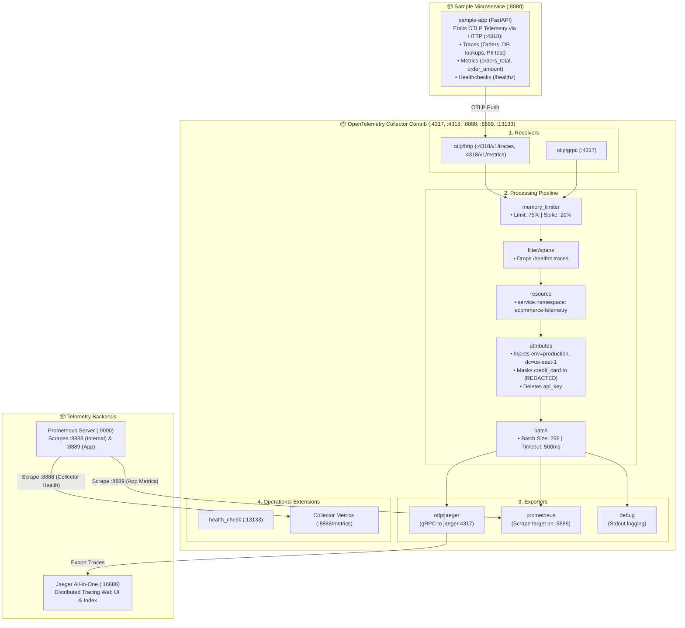
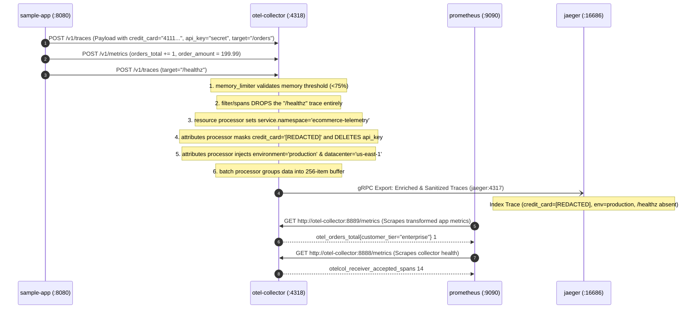

<!-- markdownlint-disable MD013 MD033 MD051 MD060 -->
# 07 - OpenTelemetry Collector Telemetry Pipeline

> A production-grade **OpenTelemetry Collector Telemetry Pipeline** configured to receive, batch, enrich, filter, sanitize, and export multi-signal telemetry (**Metrics**, **Traces**, and **Logs**) to multiple backend destinations (**Prometheus** for metrics, **Jaeger** for traces, and stdout debug logs), accompanied by an instrumented sample application and automated pipeline health validation.

---

## 📋 Table of Contents

1. [Architectural Overview & Pipeline Flow](#-architectural-overview--pipeline-flow)
   - [Pipeline Topology Diagram](#pipeline-topology-diagram)
   - [Telemetry Transformation Sequence](#telemetry-transformation-sequence)
2. [Theoretical Deep-Dive for Beginners](#-theoretical-deep-dive-for-beginners)
   - [What is the OpenTelemetry Collector?](#what-is-the-opentelemetry-collector)
   - [Why Use a Collector Instead of Direct SDK Export?](#why-use-a-collector-instead-of-direct-sdk-export)
   - [The Core Anatomy: Receivers, Processors, Exporters, Extensions](#the-core-anatomy-receivers-processors-exporters-extensions)
   - [Processor Deep-Dive: Memory Limiter, Batching, Attributes & Filtering](#processor-deep-dive-memory-limiter-batching-attributes--filtering)
   - [Collector Deployment Patterns: Agent vs. Gateway](#collector-deployment-patterns-agent-vs-gateway)
   - [Internal Collector Metrics & Operational Observability](#internal-collector-metrics--operational-observability)
3. [Repository & Directory Structure](#-repository--directory-structure)
4. [Prerequisites & System Setup](#-prerequisites--system-setup)
5. [Quickstart Guide](#-quickstart-guide)
6. [Step-by-Step Hands-On Guide](#-step-by-step-hands-on-guide)
   - [Step 1: Inspect the Declarative Collector Configuration](#step-1-inspect-the-declarative-collector-configuration)
   - [Step 2: Start the Distributed Telemetry Pipeline with Docker Compose](#step-2-start-the-distributed-telemetry-pipeline-with-docker-compose)
   - [Step 3: Verify Collector Health Extension & Internal Prometheus Metrics](#step-3-verify-collector-health-extension--internal-prometheus-metrics)
   - [Step 4: Stream Workloads from the Sample Application](#step-4-stream-workloads-from-the-sample-application)
   - [Step 5: Query Application Metrics in Prometheus (:9090)](#step-5-query-application-metrics-in-prometheus-9090)
   - [Step 6: Inspect Sanitized & Enriched Traces in Jaeger (:16686)](#step-6-inspect-sanitized--enriched-traces-in-jaeger-16686)
   - [Step 7: Verify Trace Filtering (/healthz Dropped)](#step-7-verify-trace-filtering-healthz-dropped)
   - [Step 8: Run the Automated Pipeline Verification Suite](#step-8-run-the-automated-pipeline-verification-suite)
7. [Production Best Practices & Tuning](#-production-best-practices--tuning)
8. [Troubleshooting & Common Gotchas](#-troubleshooting--common-gotchas)
9. [Resource Teardown & Complete Cleanup](#-resource-teardown--complete-cleanup)

---

## 🏛️ Architectural Overview & Pipeline Flow

### Pipeline Topology Diagram



### Telemetry Transformation Sequence



---

## 🧠 Theoretical Deep-Dive for Beginners

### What is the OpenTelemetry Collector?

The **OpenTelemetry Collector** is a high-performance, proxy-like proxy daemon written in Go that acts as the vendor-agnostic ingestion, processing, and routing pipeline for all telemetry signals (**Metrics**, **Logs**, and **Traces**).

In a naive architecture without a collector, every microservice must embed specialized exporter libraries for each storage vendor:

```text
┌─────────────────────────────────────────────────────────────────────────────┐
│                      WITHOUT OPENTELEMETRY COLLECTOR                        │
│                   (Tightly Coupled / Fragile Architecture)                   │
├─────────────────────────────────────────────────────────────────────────────┤
│                                                                             │
│                    ┌──────────────▶ Prometheus (Scrapes :8000/metrics)      │
│                    │                                                        │
│  [Microservice A]  ├──────────────▶ Jaeger (Direct OTLP gRPC :4317)         │
│  (Loads 4 SDKs)    │                                                        │
│                    ├──────────────▶ Datadog / New Relic (Vendor API)        │
│                    │                                                        │
│                    └──────────────▶ Elasticsearch / Loki (Direct HTTP Log)  │
│                                                                             │
│  ⚠️ Problems:                                                               │
│  • App CPU/Memory wasted serializing to 4 different formats                 │
│  • Upgrading a backend requires recompiling & redeploying all microservices │
│  • Cannot sanitize PII or filter noise globally in one central place        │
└─────────────────────────────────────────────────────────────────────────────┘
```

With the **OpenTelemetry Collector**, applications export only once using the open **OTLP** standard:

```text
┌─────────────────────────────────────────────────────────────────────────────┐
│                       WITH OPENTELEMETRY COLLECTOR                          │
│                      (Decoupled / Enterprise Pipeline)                      │
├─────────────────────────────────────────────────────────────────────────────┤
│                                                                             │
│  [Microservice A] ────┐                                                     │
│                       ├────▶ [OpenTelemetry Collector] ───┬─▶ Prometheus    │
│  [Microservice B] ────┤      • Memory Protection          ├─▶ Jaeger        │
│                       │      • PII Data Redaction         ├─▶ Tempo / Loki  │
│  [Microservice C] ────┘      • Intelligent Batching       └─▶ Cloud Vendor  │
│      (Pure OTLP)             • Noise Filtering                              │
│                                                                             │
│  ✅ Benefits:                                                               │
│  • Zero vendor lock-in; switch backends via YAML without touching app code  │
│  • Centralized security governance (redact credit cards & tokens globally)  │
│  • High-throughput batching offloaded from application runtimes             │
└─────────────────────────────────────────────────────────────────────────────┘
```

---

### The Core Anatomy: Receivers, Processors, Exporters, Extensions

The Collector configuration revolves around five fundamental building blocks:

```text
┌─────────────────────────────────────────────────────────────────────────────┐
│                        COLLECTOR COMPONENT TAXONOMY                         │
├─────────────────────────────────────────────────────────────────────────────┤
│ 1. RECEIVERS   │ Ingests telemetry into the collector.                      │
│    (Push/Pull) │ • Push: otlp (gRPC :4317, HTTP :4318), jaeger, zipkin      │
│                │ • Pull: prometheus (scrapes endpoints), hostmetrics        │
├────────────────┼────────────────────────────────────────────────────────────┤
│ 2. PROCESSORS  │ Modifies, filters, batches, or drops telemetry in memory.  │
│   (Ordered!)   │ • memory_limiter, batch, attributes, filter, transform     │
├────────────────┼────────────────────────────────────────────────────────────┤
│ 3. EXPORTERS   │ Dispatches processed telemetry to target destinations.     │
│    (Push/Pull) │ • Push: otlp (Jaeger, Tempo), otlphttp, kafka, elastic     │
│                │ • Pull: prometheus (exposes a :8889 scrape endpoint)       │
├────────────────┼────────────────────────────────────────────────────────────┤
│ 4. EXTENSIONS  │ Auxiliary services that do NOT handle telemetry data.      │
│                │ • health_check (:13133), zpages (:55679), pprof, bearerauth│
├────────────────┼────────────────────────────────────────────────────────────┤
│ 5. PIPELINES   │ Binds Receivers ➔ Processors ➔ Exporters for a signal type │
│                │ (service.pipelines.traces, service.pipelines.metrics)      │
└────────────────┴────────────────────────────────────────────────────────────┘
```

---

### Processor Deep-Dive: Memory Limiter, Batching, Attributes & Filtering

#### 1. `memory_limiter` (Must be FIRST in pipeline)

Monitors the Collector's heap memory usage. If memory usage spikes above `limit_percentage` (e.g. 75%), the processor begins dropping incoming data and returns error codes to upstream clients, preventing an ungraceful container Out-Of-Memory (OOM) crash.

#### 2. `filter` (Early in pipeline)

Uses OTTL (OpenTelemetry Transformation Language) expressions to drop low-value, high-frequency telemetry before it consumes network or storage bandwidth:

```yaml
filter/spans:
  error_mode: ignore
  traces:
    span:
      - 'attributes["http.target"] == "/healthz"'
      - 'name == "GET /healthz"'
```

#### 3. `attributes` & `resource` (Transformation)

Applies business and compliance mutations:

- **Enrichment**: Injects `environment: production` and `datacenter: us-east-1` so engineers can segment telemetry in Grafana/Jaeger without configuring each app.
- **Data Privacy & Compliance (GDPR/PCI-DSS)**: Replaces `credit_card` numbers with `[REDACTED]` and permanently strips `api_key` or authorization tokens.

#### 4. `batch` (Must be LAST before Exporters)

Buffers individual telemetry items into larger multi-megabyte payloads (`send_batch_size: 256`, `timeout: 500ms`). This reduces network socket creation overhead, compression CPU cycles, and HTTP request count by up to $90\%$.

---

### Collector Deployment Patterns: Agent vs. Gateway

```text
┌─────────────────────────────────────────────────────────────────────────────┐
│                    DEPLOYMENT ARCHITECTURE PATTERNS                         │
├─────────────────────────────────────────────────────────────────────────────┤
│ PATTERN 1: AGENT / SIDECAR PATTERN (Per Node or Per Pod)                    │
│                                                                             │
│  [App Pod 1] ──(localhost)──▶ [OTel Agent Sidecar] ──▶ Backend / Gateway    │
│  • Pros: Minimal network latency, enriches host/K8s metadata automatically. │
│  • Cons: Higher total memory usage across cluster.                          │
├─────────────────────────────────────────────────────────────────────────────┤
│ PATTERN 2: GATEWAY PATTERN (Centralized Standalone Cluster)                 │
│                                                                             │
│  [App 1] ──┐                                                                │
│  [App 2] ──┼──(Load Balancer)──▶ [OTel Collector Cluster] ──▶ Backends      │
│  [App 3] ──┘                                                                │
│  • Pros: Centralized management of credentials, sampling, and routing.      │
│  • Cons: Additional network hop.                                            │
├─────────────────────────────────────────────────────────────────────────────┤
│ PATTERN 3: HYBRID ENTERPRISE PATTERN (Recommended in Production)            │
│                                                                             │
│  [Apps] ──▶ [Local DaemonSet Agents] ──▶ [Gateway Cluster] ──▶ Backends     │
└─────────────────────────────────────────────────────────────────────────────┘
```

---

### Internal Collector Metrics & Operational Observability

The Collector monitors itself by exposing Prometheus metrics on port `8888`:

| Metric Name | Type | Description |
| :--- | :--- | :--- |
| `otelcol_receiver_accepted_spans` | Counter | Total number of spans received and accepted by the receiver |
| `otelcol_receiver_refused_spans` | Counter | Spans rejected (e.g. by memory limiter) |
| `otelcol_processor_batch_batch_size` | Histogram | Distribution of batch sizes sent to exporters |
| `otelcol_exporter_sent_spans` | Counter | Spans successfully delivered to destinations |
| `otelcol_exporter_enqueue_failed_spans` | Counter | Spans dropped due to exporter queue overflow |
| `otelcol_process_uptime` | Gauge | Collector process uptime in seconds |

---

## 📁 Repository & Directory Structure

```text
08-observability-and-monitoring/07-opentelemetry-collector-pipeline/
├── .gitignore
├── README.md                      # Comprehensive project guide (this document)
├── cleanup.sh                     # Teardown script for containers, volumes & images
├── test_stack.sh                  # Automated master build, healthcheck & test runner
├── pipeline_health_check.sh       # Comprehensive pipeline assertion script
├── docker-compose.yml             # Orchestration for Collector, App, Prometheus & Jaeger
├── otel-collector-config.yaml     # Declarative OpenTelemetry Collector pipeline config
├── prometheus/
│   ├── Dockerfile
│   └── prometheus.yml             # Scrapes Collector :8888 (internal) & :8889 (app metrics)
└── app/
    ├── Dockerfile
    ├── main.py                    # FastAPI sample app emitting OTLP Traces, Metrics & Logs
    ├── telemetry.py               # OTel SDK configuration for Traces & Metrics
    └── requirements.txt
```

---

## ⚙️ Prerequisites & System Setup

Ensure your local development environment has the following installed:

- **Docker Engine** (or Docker Desktop / OrbStack on macOS): $\ge 24.0$
- **Docker Compose**: $\ge 2.20$
- **cURL**: Standard command-line HTTP client
- **Python 3**: $\ge 3.8$ (used for JSON response validation)
- **pnpm** (optional, used for local documentation linting, e.g. `pnpm dlx markdownlint-cli README.md`)

Verify Docker and Python are ready:

```bash
docker --version
docker compose version
python3 --version
```

---

## 🚀 Quickstart Guide

Get the entire OpenTelemetry Collector pipeline running and verified in 3 simple commands:

```bash
cd 08-observability-and-monitoring/07-opentelemetry-collector-pipeline

# 1. Run the automated test runner (builds images, starts stack & validates pipeline)
./test_stack.sh

# 2. Open the Jaeger and Prometheus dashboards
open http://localhost:16686  # Jaeger UI (Distributed Traces)
open http://localhost:9090   # Prometheus UI (Metrics)

# 3. Clean up all resources when finished
./cleanup.sh --purge-images
```

---

## 📖 Step-by-Step Hands-On Guide

### Step 1: Inspect the Declarative Collector Configuration

Open `otel-collector-config.yaml` to observe the pipeline structure:

```yaml
receivers:
  otlp:
    protocols:
      grpc: { endpoint: 0.0.0.0:4317 }
      http: { endpoint: 0.0.0.0:4318 }

processors:
  memory_limiter: { check_interval: 1s, limit_percentage: 75, spike_limit_percentage: 20 }
  filter/spans:
    traces:
      span: ['attributes["http.target"] == "/healthz"', 'name == "GET /healthz"']
  resource:
    attributes: [{ key: service.namespace, value: ecommerce-telemetry, action: upsert }]
  attributes:
    actions:
      - { key: environment, value: production, action: insert }
      - { key: datacenter, value: us-east-1, action: insert }
      - { key: credit_card, value: "[REDACTED]", action: update }
      - { key: api_key, action: delete }
  batch: { send_batch_size: 256, timeout: 500ms }

exporters:
  otlp/jaeger: { endpoint: "jaeger:4317", tls: { insecure: true } }
  prometheus: { endpoint: "0.0.0.0:8889", namespace: "otel" }
  debug: { verbosity: basic }

service:
  extensions: [health_check, zpages]
  telemetry:
    metrics: { address: 0.0.0.0:8888 }
  pipelines:
    traces:
      receivers: [otlp]
      processors: [memory_limiter, filter/spans, resource, attributes, batch]
      exporters: [otlp/jaeger, debug]
    metrics:
      receivers: [otlp]
      processors: [memory_limiter, resource, attributes, batch]
      exporters: [prometheus, debug]
```

---

### Step 2: Start the Distributed Telemetry Pipeline with Docker Compose

Launch the stack in detached mode:

```bash
docker compose up -d --build
```

Verify that all 4 containers are running and healthy:

```bash
docker compose ps
```

*Expected Output:*

```text
NAME                        IMAGE                                         COMMAND                  STATUS              PORTS
jaeger-pipeline             jaegertracing/all-in-one:1.57.0               "/go/bin/all-in-one-…"   running (healthy)   0.0.0.0:16686->16686/tcp
otel-collector-pipeline     otel/opentelemetry-collector-contrib:0.95.0   "/otelcol-contrib --…"   running (healthy)   0.0.0.0:4317-4318->4317-4318/tcp, 0.0.0.0:8888-8889->8888-8889/tcp, 0.0.0.0:13133->13133/tcp
prometheus-pipeline         mini-proj-08-07-prometheus:local              "/bin/prometheus --c…"   running (healthy)   0.0.0.0:9090->9090/tcp
sample-app-pipeline         mini-proj-08-07-sample-app:local              "uvicorn main:app --…"   running (healthy)   0.0.0.0:8080->8080/tcp
```

---

### Step 3: Verify Collector Health Extension & Internal Prometheus Metrics

Query the Collector's health extension on port `13133`:

```bash
curl -i http://localhost:13133/
```

*Response:*

```text
HTTP/1.1 200 OK
Content-Type: application/json
{"status":"Server available"}
```

Query the Collector's internal performance metrics on port `8888`:

```bash
curl -s http://localhost:8888/metrics | grep -E "otelcol_receiver_accepted|otelcol_process_uptime"
```

*Sample Output:*

```text
# HELP otelcol_process_uptime Uptime of the process
# TYPE otelcol_process_uptime counter
otelcol_process_uptime 45.12
# HELP otelcol_receiver_accepted_spans Number of spans successfully pushed into the pipeline.
# TYPE otelcol_receiver_accepted_spans counter
otelcol_receiver_accepted_spans{receiver="otlp",transport="http"} 0
```

---

### Step 4: Stream Workloads from the Sample Application

#### 1. Emit a Standard Order Transaction

```bash
curl -s -X POST http://localhost:8080/api/orders \
  -H "Content-Type: application/json" \
  -d '{
    "customer_id": "cust-gold-101",
    "customer_tier": "enterprise",
    "items": [
      {"item_id": "prod-1", "name": "Cloud Native Observability", "price": 49.99, "quantity": 1}
    ],
    "currency": "USD"
  }' | python3 -m json.tool
```

#### 2. Emit a Sensitive Order (Contains Raw Credit Card & API Key)

```bash
curl -s -X POST http://localhost:8080/api/orders/sensitive \
  -H "Content-Type: application/json" \
  -d '{
    "customer_id": "cust-pii-99",
    "credit_card": "4111-2222-3333-4444",
    "api_key": "sk_live_secretkey_998811",
    "amount": 299.00
  }' | python3 -m json.tool
```

#### 3. Emit a Burst of Traffic to Stream Metrics & Traces

```bash
curl -s -X POST "http://localhost:8080/api/simulate-load?count=15" | python3 -m json.tool
```

#### 4. Ping the Health Check Route (Which the Collector Should Filter Out)

```bash
curl -s http://localhost:8080/healthz
```

---

### Step 5: Query Application Metrics in Prometheus (:9090)

1. Open **[http://localhost:9090](http://localhost:9090)** in your browser.
2. In the query box, enter `otel_orders_total` (or `otel_order_amount_count`).
3. Click **Execute** and switch to the **Table** tab.

*Observed Metric Output:*

```text
otel_orders_total{customer_tier="enterprise", currency="USD", status="success", instance="otel-collector:8889", job="otel-collector-app-metrics"}  1
otel_orders_total{customer_tier="standard", currency="USD", status="success", instance="otel-collector:8889", job="otel-collector-app-metrics"}    5
otel_orders_total{customer_tier="vip", currency="USD", status="sensitive_test", instance="otel-collector:8889", job="otel-collector-app-metrics"}  1
```

Notice that:

- The metric name is prefixed with `otel_` (as configured by `namespace: otel` in the Collector's Prometheus exporter).
- Labels emitted in Python (`customer_tier`, `currency`) were preserved by the collector pipeline.

Now query the Collector's self-monitoring metrics:

```promql
otelcol_receiver_accepted_spans
```

You will see the total count of spans received by the collector dynamically increasing.

---

### Step 6: Inspect Sanitized & Enriched Traces in Jaeger (:16686)

1. Open **[http://localhost:16686](http://localhost:16686)**.
2. Select **Service**: `sample-order-service`.
3. Select **Operation**: `order.process_sensitive` and click **Find Traces**.
4. Open the trace.

#### Verifying Collector Pipeline Transformations

- **Enrichment**: Inspect the span tags. Notice that the Collector's `attributes` processor inserted:
  - `environment`: `"production"`
  - `datacenter`: `"us-east-1"`
- **Resource Namespace**: Under the Process section, observe:
  - `service.namespace`: `"ecommerce-telemetry"`
- **Data Masking (PII Protection)**:
  - Look at tag `credit_card`: The value is **`[REDACTED]`** (the raw `4111-2222-3333-4444` was safely replaced).
- **Secret Deletion**:
  - Check the tags list: `api_key` is **completely absent** (deleted by the Collector before reaching Jaeger).

---

### Step 7: Verify Trace Filtering (/healthz Dropped)

In the Jaeger UI search panel:

1. Select **Operation**: `GET /healthz`.
2. Click **Find Traces**.
3. **Result**: `No traces found`.

The `filter/spans` processor in the Collector dropped all spans where `http.target == "/healthz"` or `name == "GET /healthz"`, saving storage capacity while preserving visibility on real business transactions.

---

### Step 8: Run the Automated Pipeline Verification Suite

The repository includes `pipeline_health_check.sh`, which automatically executes workloads and asserts health probes, Prometheus metric ingestion, Jaeger trace delivery, attribute injection, PII redaction, and filter dropping:

```bash
./pipeline_health_check.sh
```

*Sample Output:*

```text
======================================================================
  🔭 OpenTelemetry Collector Pipeline - Automated Health Check
======================================================================

▶ [1/5] Checking Collector Health Extensions & Internal Metrics...
  [PASS] Collector Health Extension: Health probe returned HTTP 200 OK at http://localhost:13133
  [PASS] Collector Internal Metrics: Successfully scraped internal operational metrics from http://localhost:8888/metrics
  [PASS] Application Health: Sample application is reachable at http://localhost:8080

▶ [2/5] Emitting Synthetic Workloads to OTel Collector Pipeline...
  [1/4] Dispatched standard order transaction...
  [PASS] Order Transaction: Created standard order. Trace ID: a891b2c3d4e5f60718293a4b5c6d7e8f
  [2/4] Dispatched sensitive order transaction (PII / Secrets testing)...
  [PASS] Sensitive Transaction: Emitted sensitive payload. Trace ID: f1e2d3c4b5a697887766554433221100
  [3/4] Dispatched product catalog browsing requests...
  [4/4] Dispatched load burst simulation...

▶ [3/5] Awaiting Collector Batch Processor & Prometheus Scrape Cycle (4s)...

▶ [4/5] Validating Metrics Delivery in Prometheus TSDB (:9090)...
  [PASS] Prometheus Exporter (:8889): OTel Collector successfully transformed and exposed 'otel_orders_total' on port 8889
  [PASS] Prometheus App Metric Query: Query 'otel_orders_total' returned active series with accumulated count: 17
  [PASS] Collector Pipeline Performance: Collector metric 'otelcol_receiver_accepted_spans' confirmed 35 spans processed

▶ [5/5] Validating Traces in Jaeger, Attribute Ingestion & Masking...
  [PASS] Jaeger Trace Delivery: Standard trace (a891b2c3d4e5f60718293a4b5c6d7e8f) indexed in Jaeger with 3 spans
  [PASS] Attribute Processor Injection: Collector successfully injected 'environment=production' and 'datacenter=us-east-1'
  [PASS] PII & Secret Sanitization: Collector masked 'credit_card' to '[REDACTED]' and deleted 'api_key' attribute
  [PASS] Span Filter Processor: Filter processor successfully dropped noisy 'GET /healthz' spans (0 in Jaeger)

======================================================================
  📊 Pipeline Verification Summary
======================================================================
  Total Test Assertions: 11
  Passed Assertions:     11
  Failed Assertions:     0

✅ SUCCESS: OpenTelemetry Collector Telemetry Pipeline is operating perfectly!
```

---

## 🎯 Production Best Practices & Tuning

```text
┌─────────────────────────────────────────────────────────────────────────────┐
│                    PRODUCTION PIPELINE DESIGN CHECKLIST                     │
├─────────────────────────────────────────────────────────────────────────────┤
│ 1. MEMORY LIMITER FIRST   │ Always declare memory_limiter as the very first │
│                           │ processor in every pipeline.                    │
├───────────────────────────┼─────────────────────────────────────────────────┤
│ 2. BATCH PROCESSOR LAST   │ Place batch as the final processor before       │
│                           │ exporters to maximize batch compression.        │
├───────────────────────────┼─────────────────────────────────────────────────┤
│ 3. HEALTH PROBES IN K8S   │ Use extension health_check (:13133) for K8s     │
│                           │ livenessProbe and readinessProbe.               │
├───────────────────────────┼─────────────────────────────────────────────────┤
│ 4. QUEUE SIZE TUNING      │ Configure sending_queue in exporters:           │
│                           │ sending_queue: { enabled: true, queue_size: 1000│
├───────────────────────────┼─────────────────────────────────────────────────┤
│ 5. GOMEMLIMIT & GOMAXPROCS│ Set env GOMEMLIMIT=1800MiB for 2GiB containers  │
│                           │ so Go GC runs aggressively before OOM limits.   │
└───────────────────────────┴─────────────────────────────────────────────────┘
```

---

## 🛠️ Troubleshooting & Common Gotchas

### 1. Collector Fails to Start: "unknown processor" or "unknown exporter"

- **Cause**: Using core `otel/opentelemetry-collector` instead of `otel/opentelemetry-collector-contrib`.
- **Fix**: Ensure your image is `otel/opentelemetry-collector-contrib:<version>`. Contrib includes processors like `attributes`, `filter`, and exporters like `prometheus`.

### 2. Spans Reaching Collector But Missing from Jaeger

- **Cause**: Exporter misconfigured with TLS enabled against plaintext gRPC port.
- **Fix**: In `otel-collector-config.yaml`, ensure `otlp/jaeger` specifies `tls.insecure: true`.

### 3. Port Conflicts

- **Symptom**: `port is already allocated`.
- **Fix**: Verify ports `4317`, `4318`, `8080`, `8888`, `8889`, `9090`, `13133`, `16686` are free: `lsof -i :4317 -i :4318 -i :8080 -i :8888 -i :8889 -i :9090 -i :13133 -i :16686`

---

## 🧹 Resource Teardown & Complete Cleanup

To clean up all Docker containers, networks, volumes, and temporary files generated during this mini-project, follow the steps below.

### Standard Teardown (Containers & Networks)

```bash
./cleanup.sh
```

### Complete Teardown (Including Built Docker Images)

To remove all created containers, networks, volumes, and purge locally built Docker container images, execute:

```bash
./cleanup.sh --purge-images
```

Or via direct Docker Compose commands:

```bash
# 1. Stop and remove all containers and networks
docker compose down -v --remove-orphans

# 2. Remove locally built container images
docker rmi -f \
  mini-proj-08-07-sample-app:local \
  mini-proj-08-07-prometheus:local \
  mini-proj-08-07-otel-collector:local \
  otel/opentelemetry-collector-contrib:0.95.0 \
  jaegertracing/all-in-one:1.57.0

# 3. Clean temporary test artifacts and Python caches
find . -type d -name "__pycache__" -exec rm -rf {} +
find . -type f -name "*.py[cod]" -delete
find . -type f -name "*.log" -delete
```

Verify that no containers remain active:

```bash
docker ps -a --filter "name=otel-collector-pipeline" --filter "name=sample-app-pipeline" --filter "name=prometheus-pipeline" --filter "name=jaeger-pipeline"
```
