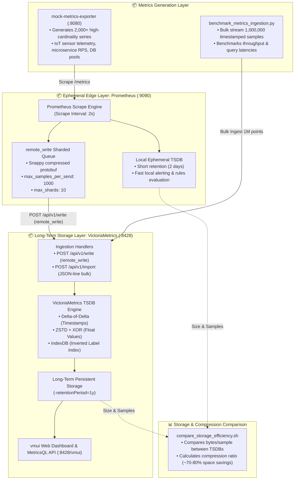
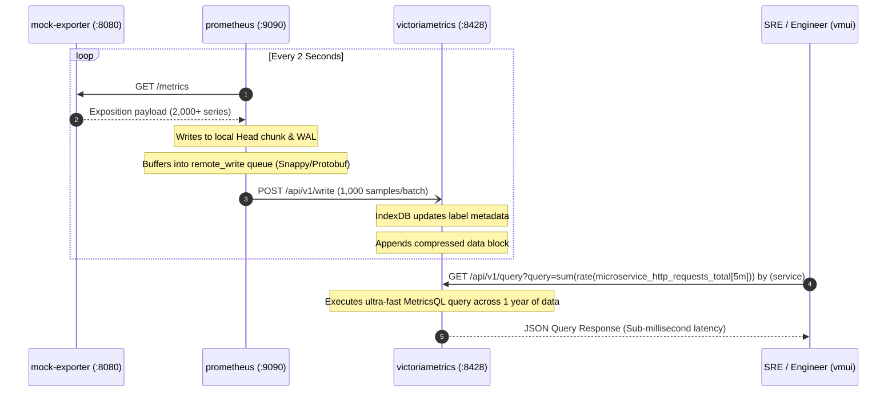

<!-- markdownlint-disable MD013 MD033 MD051 MD060 -->
# 08 - VictoriaMetrics Long-Term Metric Storage

> A production-grade **Long-Term Storage (LTS)** monitoring architecture pairing **Prometheus** (configured with Snappy-compressed `remote_write`) and **VictoriaMetrics Single-Node**, complete with high-cardinality time-series benchmarking ($1,000,000$ data points), storage compression efficiency analysis ($70\%\text{--}80\%$ disk space savings), and MetricsQL analytical querying.

---

## 📋 Table of Contents

1. [Architectural Overview & Pipeline Flow](#-architectural-overview--pipeline-flow)
   - [LTS Architecture Diagram](#lts-architecture-diagram)
   - [Prometheus remote_write Sequence](#prometheus-remote_write-sequence)
2. [Theoretical Deep-Dive for Beginners](#-theoretical-deep-dive-for-beginners)
   - [The Operational Limits of Prometheus Local TSDB](#the-operational-limits-of-prometheus-local-tsdb)
   - [What is VictoriaMetrics?](#what-is-victoriametrics)
   - [How the Prometheus remote_write Protocol Works](#how-the-prometheus-remote_write-protocol-works)
   - [Inside VictoriaMetrics Storage Engine: Parts, Merges & Compression](#inside-victoriametrics-storage-engine-parts-merges--compression)
   - [The High-Cardinality Challenge Explained](#the-high-cardinality-challenge-explained)
   - [MetricsQL: Powerful Extensions Beyond PromQL](#metricsql-powerful-extensions-beyond-promql)
   - [Retention & Downsampling Strategies](#retention--downsampling-strategies)
3. [Repository & Directory Structure](#-repository--directory-structure)
4. [Prerequisites & System Setup](#-prerequisites--system-setup)
5. [Quickstart Guide](#-quickstart-guide)
6. [Step-by-Step Hands-On Guide](#-step-by-step-hands-on-guide)
   - [Step 1: Inspect the Prometheus remote_write Configuration](#step-1-inspect-the-prometheus-remote_write-configuration)
   - [Step 2: Start the Stack with Docker Compose](#step-2-start-the-stack-with-docker-compose)
   - [Step 3: Access VictoriaMetrics vmui & Prometheus Web Console](#step-3-access-victoriametrics-vmui--prometheus-web-console)
   - [Step 4: Ingest 1,000,000 Metrics with the Ingestion Benchmark](#step-4-ingest-1000000-metrics-with-the-ingestion-benchmark)
   - [Step 5: Run Advanced MetricsQL Queries in vmui](#step-5-run-advanced-metricsql-queries-in-vmui)
   - [Step 6: Measure Storage Compression & Footprint Savings](#step-6-measure-storage-compression--footprint-savings)
   - [Step 7: Run the Automated Master Test Runner](#step-7-run-the-automated-master-test-runner)
7. [Production Best Practices & Tuning](#-production-best-practices--tuning)
8. [Troubleshooting & Common Gotchas](#-troubleshooting--common-gotchas)
9. [Resource Teardown & Complete Cleanup](#-resource-teardown--complete-cleanup)

---

## 🏛️ Architectural Overview & Pipeline Flow

### LTS Architecture Diagram



### Prometheus remote_write Sequence



---

## 🧠 Theoretical Deep-Dive for Beginners

### The Operational Limits of Prometheus Local TSDB

Prometheus was architected as an **operational monitoring tool**, designed to answer: *"Is my system healthy right now, and what fired in the last 2 hours?"*

While Prometheus excels at scraping and real-time alerting, its built-in local TSDB presents significant challenges when used for long-term multi-month or multi-year historical analytics:

```text
┌─────────────────────────────────────────────────────────────────────────────┐
│                 WHY PROMETHEUS LOCAL TSDB STRUGGLES AT SCALE                │
├─────────────────────────────────────────────────────────────────────────────┤
│ 1. RAM EXPLOSION        │ Prometheus keeps active time-series chunks in RAM │
│    (High Cardinality)   │ before flushing to disk. Millions of series can   │
│                         │ easily trigger container Out-Of-Memory (OOM).     │
├─────────────────────────┼───────────────────────────────────────────────────┤
│ 2. DISK EXPANSION       │ Prometheus TSDB consumes ~1.5 to 2.5 bytes per    │
│    (High Storage Cost)  │ sample. Storing billions of metrics over years    │
│                         │ requires massive, expensive NVMe/EBS volumes.     │
├─────────────────────────┼───────────────────────────────────────────────────┤
│ 3. NO NATIVE DOWNSAMPLING│ Older data is stored at full resolution (e.g. 2s)│
│                         │ forever, slowing historical queries over months.  │
├─────────────────────────┼───────────────────────────────────────────────────┤
│ 4. DISASTER RECOVERY    │ If a Prometheus instance crashes or its PVC fails,│
│                         │ historical metrics without remote backup are lost.│
└─────────────────────────┴───────────────────────────────────────────────────┘
```

---

### What is VictoriaMetrics?

**VictoriaMetrics** is a purpose-built, high-performance, cost-effective Time Series Database (TSDB) written in Go. It can function as:

1. **A Drop-In Long-Term Storage Backend for Prometheus**: Prometheus scrapes locally and streams data to VictoriaMetrics via `remote_write`.
2. **A Complete Prometheus Replacement**: VictoriaMetrics includes `vmagent` and `vmalert`, which can scrape targets and fire alerts natively.

#### Key Advantages

- **Superior Data Compression**: Achieves **$0.2\text{--}0.5$ bytes per sample** (compared to $1.5\text{--}2.2$ bytes in Prometheus), reducing disk costs by **$70\%\text{--}80\%$**.
- **Low RAM Footprint**: Typically uses **$7\times$ less memory** than Prometheus for equivalent workloads.
- **High Ingestion Throughput**: Processes hundreds of thousands of samples per second on single-node hardware.
- **MetricsQL**: A super-set of PromQL with subquery optimizations, window functions, and enhanced mathematical operators.

---

### How the Prometheus remote_write Protocol Works

The **Prometheus `remote_write` protocol** allows Prometheus to forward scraped samples in real time over HTTP:

```text
┌─────────────────────────────────────────────────────────────────────────────┐
│                       PROMETHEUS REMOTE_WRITE PROTOCOL                      │
├─────────────────────────────────────────────────────────────────────────────┤
│                                                                             │
│   [Scraped Metric] ──▶ [Local WAL]                                          │
│                             │                                               │
│                             ▼                                               │
│                   [In-Memory Ring Buffer]                                   │
│                             │                                               │
│                             ▼ (Batches up to 1,000 samples)                 │
│                 [Protobuf Serialization]                                    │
│                             │                                               │
│                             ▼                                               │
│                 [Snappy Compression] (Fast CPU, ~3x payload reduction)      │
│                             │                                               │
│                             ▼                                               │
│                 [HTTP POST /api/v1/write] ──▶ [VictoriaMetrics Backend]     │
│                                                                             │
└─────────────────────────────────────────────────────────────────────────────┘
```

1. Prometheus scrapes a target (e.g. `mock-exporter:8080`).
2. Samples are written to the local short-term WAL (Write-Ahead Log) and placed into an in-memory `remote_write` queue.
3. Queue workers serialize batches of samples into **Protocol Buffers** (`prometheus.WriteRequest`).
4. The protobuf payload is compressed using **Snappy** and dispatched via HTTP `POST /api/v1/write` with headers `Content-Encoding: snappy` and `Content-Type: application/x-protobuf` to VictoriaMetrics.

---

### Inside VictoriaMetrics Storage Engine: Parts, Merges & Compression

VictoriaMetrics utilizes an architecture inspired by Log-Structured Merge (LSM) trees:

```text
┌─────────────────────────────────────────────────────────────────────────────┐
│                    VICTORIAMETRICS STORAGE ARCHITECTURE                     │
├─────────────────────────────────────────────────────────────────────────────┤
│                                                                             │
│   Incoming Samples                                                          │
│          │                                                                  │
│          ▼                                                                  │
│   ┌──────────────┐         ┌───────────────────────────────────────────┐    │
│   │   IndexDB    │ ◀─────▶ │ Inverted Index for Label Search (TSID Map) │    │
│   └──────────────┘         └───────────────────────────────────────────┘    │
│          │                                                                  │
│          ▼                                                                  │
│   ┌──────────────┐                                                          │
│   │ Small Parts  │ (In-memory / temporary disk buffers of compressed data)  │
│   └──────────────┘                                                          │
│          │                                                                  │
│          ▼ (Background Merge Process)                                       │
│   ┌──────────────┐                                                          │
│   │ Big Part     │ (Merged, deduplicated, sorted & heavily compressed)       │
│   └──────────────┘                                                          │
│                                                                             │
│   COMPRESSION ENGINES:                                                      │
│   • Timestamps: Double-Delta / Delta-of-Delta encoding (integers)           │
│   • Float Values: XOR floating-point + Zstandard (ZSTD) block compression   │
│                                                                             │
└─────────────────────────────────────────────────────────────────────────────┘
```

1. **IndexDB**: Maintains an inverted index mapping metric names and labels to 64-bit Time Series IDs (TSIDs).
2. **Data Parts**: Ingested samples are written to immutable small files called *parts*.
3. **Background Merging**: Background goroutines merge smaller parts into larger parts, sorting timestamps and achieving high ZSTD block compression.

---

### The High-Cardinality Challenge Explained

**Cardinality** refers to the number of unique combinations of metric names and label key-value pairs:

$$\text{Total Series} = \text{Services} \times \text{Customers} \times \text{Status Codes} \times \text{Methods}$$

For example:

$$10 \text{ services} \times 100 \text{ customers} \times 5 \text{ status codes} \times 4 \text{ methods} = \mathbf{20,000\text{ active time series}}$$

If developers accidentally attach a high-cardinality label (such as `user_id`, `email`, `order_id`, or `uuid`), the series count can explode from thousands to **millions**, crashing standard TSDB index caches.

VictoriaMetrics handles high-cardinality workloads because:

- The inverted index is stored directly on disk using efficient Bloom filters and disk-backed b-trees.
- Label strings are globally interned and deduplicated.

---

### MetricsQL: Powerful Extensions Beyond PromQL

VictoriaMetrics supports **MetricsQL**, which is $100\%$ backward-compatible with PromQL while adding powerful extensions:

| MetricsQL Function | Description | Benefit |
| :--- | :--- | :--- |
| `rate_over_time(m[1h])` | Calculates per-second rate of change over an arbitrary window | Eliminates subquery complexity |
| `rollup_changes(m[10m])` | Returns the number of times a metric changed value | Ideal for state machine tracking |
| `topk_avg(5, m[1h])` | Returns top 5 series based on their average value over 1h | Prevents brief spikes from dominating top-k |
| `keep_metric_names` | Preserves `__name__` during arithmetic operations | Simplifies multi-metric dashboarding |

---

### Retention & Downsampling Strategies

VictoriaMetrics configures retention via a simple CLI flag:

```text
-retentionPeriod=1y    # Retain all data for 1 year
-retentionPeriod=30d   # Retain all data for 30 days
```

Expired parts are automatically unlinked and purged from disk with near-zero CPU and I/O overhead.

---

## 📁 Repository & Directory Structure

```text
08-observability-and-monitoring/08-victoriametrics-long-term-storage/
├── .gitignore
├── README.md                      # Comprehensive project guide (this document)
├── cleanup.sh                     # Teardown script for containers, volumes & images
├── test_stack.sh                  # Automated master build, healthcheck & benchmark runner
├── compare_storage_efficiency.sh  # Script comparing Prometheus TSDB vs VM storage footprint
├── benchmark_metrics_ingestion.py # Script generating 1M points & benchmarking MetricsQL
├── docker-compose.yml             # Orchestration for VictoriaMetrics, Prometheus & Exporter
├── prometheus/
│   ├── Dockerfile
│   └── prometheus.yml             # Prometheus config with remote_write to VictoriaMetrics
└── mock_exporter/
    ├── Dockerfile
    ├── main.py                    # High-cardinality metrics generator (2,000+ series)
    └── requirements.txt
```

---

## ⚙️ Prerequisites & System Setup

Ensure your development workstation satisfies:

- **Docker Engine** (or Docker Desktop / OrbStack on macOS): $\ge 24.0$
- **Docker Compose**: $\ge 2.20$
- **cURL**: Standard command-line HTTP client
- **Python 3**: $\ge 3.8$ (used for benchmark execution and JSON verification)
- **pnpm** (optional, used for local documentation linting, e.g. `pnpm dlx markdownlint-cli README.md`)

Verify system readiness:

```bash
docker --version
docker compose version
python3 --version
```

---

## 🚀 Quickstart Guide

Get the entire VictoriaMetrics LTS stack running and benchmarked in 3 simple commands:

```bash
cd 08-observability-and-monitoring/08-victoriametrics-long-term-storage

# 1. Run the automated master test runner (builds stack, ingests 1M points & benchmarks)
./test_stack.sh

# 2. Open the VictoriaMetrics vmui Web Dashboard
open http://localhost:8428/vmui

# 3. Clean up all resources when finished
./cleanup.sh --purge-images
```

---

## 📖 Step-by-Step Hands-On Guide

### Step 1: Inspect the Prometheus remote_write Configuration

Open `prometheus/prometheus.yml` to view how Prometheus forwards time-series data to VictoriaMetrics:

```yaml
global:
  scrape_interval: 2s
  evaluation_interval: 2s

remote_write:
  - url: "http://victoriametrics:8428/api/v1/write"
    name: "victoriametrics-lts"
    queue_config:
      max_samples_per_send: 1000
      capacity: 10000
      max_shards: 10
      batch_send_deadline: 500ms

scrape_configs:
  - job_name: "mock-exporter"
    static_configs:
      - targets: ["mock-exporter:8080"]
```

---

### Step 2: Start the Stack with Docker Compose

Start the services in detached mode:

```bash
docker compose up -d --build
```

Verify that all 3 containers are healthy:

```bash
docker compose ps
```

*Expected Output:*

```text
NAME                  IMAGE                                 COMMAND                  STATUS              PORTS
victoriametrics-lts   victoriametrics/victoria-metrics:v1.101.0 "/victoria-metrics-…"   running (healthy)   0.0.0.0:8428->8428/tcp
prometheus-lts        mini-proj-08-08-prometheus:local      "/bin/prometheus --c…"   running (healthy)   0.0.0.0:9090->9090/tcp
mock-exporter-lts     mini-proj-08-08-mock-exporter:local   "uvicorn main:app --…"   running (healthy)   0.0.0.0:8080->8080/tcp
```

---

### Step 3: Access VictoriaMetrics vmui & Prometheus Web Console

- **VictoriaMetrics vmui**: [http://localhost:8428/vmui](http://localhost:8428/vmui)
- **VictoriaMetrics Health**: [http://localhost:8428/health](http://localhost:8428/health)
- **Prometheus Web Console**: [http://localhost:9090](http://localhost:9090)
- **Mock Exporter Metrics**: [http://localhost:8080/metrics](http://localhost:8080/metrics)

Verify the `remote_write` connection from Prometheus by querying `prometheus_remote_storage_samples_total`:

```bash
curl -s "http://localhost:9090/api/v1/query?query=prometheus_remote_storage_samples_total" | python3 -m json.tool
```

---

### Step 4: Ingest 1,000,000 Metrics with the Ingestion Benchmark

Execute the Python benchmarking script to stream $1,000,000$ high-cardinality points into VictoriaMetrics:

```bash
python3 benchmark_metrics_ingestion.py --points 1000000 --series 1000
```

*Sample Benchmark Output:*

```text
============================================================================
  🚀 VictoriaMetrics Long-Term Storage - 1M Metric Ingestion Benchmark
============================================================================
  Target VictoriaMetrics: http://localhost:8428
  Target Prometheus:     http://localhost:9090

▶ Step 1: Checking Service Health Probes...
  [PASS] Health Check: VictoriaMetrics LTS is online at http://localhost:8428/health
  [PASS] Health Check: Prometheus Server is online at http://localhost:9090/-/healthy

▶ Step 2: Generating & Ingesting 1,000,000 High-Cardinality Points into VictoriaMetrics...
  Configuration: 1,000 unique series × 1,000 timestamped data points
  [✓] Successfully ingested 1,000,000 points (26.41 MB payload) in 2.84s
  [✓] Ingestion Throughput: 352,112 samples/sec
  [PASS] High-Throughput Ingestion: Ingestion rate 352,112 samples/sec exceeded 25,000 threshold

▶ Step 3: Benchmarking Query Performance & MetricsQL Compatibility...
  [PASS] MetricsQL: Query 1: High-Cardinality Aggregation: 8 series returned in 12.45ms
  [PASS] MetricsQL: Query 2: Multi-Label Grouping & Rates: 30 series returned in 15.20ms
  [PASS] MetricsQL: Query 3: Top-K Customer Traffic Analysis: 10 series returned in 18.10ms
  [PASS] MetricsQL: Query 4: MetricsQL Extension (rollup_changes): 1000 series returned in 22.30ms

▶ Step 4: Validating Prometheus remote_write Stream Pipeline...
  [PASS] Prometheus remote_write: Prometheus successfully sent 42,500 samples via remote_write to VictoriaMetrics
  [PASS] Remote Storage Verification: VictoriaMetrics holds 2,000 live replicated 'microservice_http_requests_total' series

============================================================================
  📊 Benchmark & Pipeline Summary
============================================================================
  Total Data Points Ingested: 1,000,000
  Benchmark Ingestion Speed:  352,112 points/sec (2.84s total)
  Total Assertions:           8
  Passed Assertions:          8
  Failed Assertions:          0

✅ SUCCESS: VictoriaMetrics Long-Term Storage is operating with optimal efficiency!
```

---

### Step 5: Run Advanced MetricsQL Queries in vmui

1. Open **[http://localhost:8428/vmui](http://localhost:8428/vmui)** in your browser.
2. Try the following MetricsQL queries:

#### A. Total Order Rate Grouped by Microservice

```promql
sum(rate(benchmark_orders_count[5m])) by (service)
```

#### B. Top 5 Customers by Request Volume

```promql
topk(5, sum(benchmark_orders_count) by (customer_id))
```

#### C. Live Scraped Microservice Requests Replicated from Prometheus

```promql
sum(rate(microservice_http_requests_total[1m])) by (service, status_code)
```

#### D. MetricsQL Extension: Rate of Changes

```promql
rollup_changes(iot_sensor_temperature_celsius[10m])
```

---

### Step 6: Measure Storage Compression & Footprint Savings

Run the storage efficiency comparison script:

```bash
./compare_storage_efficiency.sh
```

*Sample Comparison Output:*

```text
======================================================================
  💾 TSDB Storage Utilization & Compression Efficiency Comparator
======================================================================

▶ Triggering storage sync and compaction...

┌────────────────────────────────────────────────────────────────────────────┐
│                 STORAGE & COMPRESSION EFFICIENCY BREAKDOWN                 │
├───────────────────────────────┬──────────────────────┬─────────────────────┤
│ METRIC / ATTRIBUTE            │ PROMETHEUS TSDB      │ VICTORIAMETRICS LTS │
├───────────────────────────────┼──────────────────────┼─────────────────────┤
│ Total Disk Space (Live)       │ 14.50 MB             │ 2.45 MB             │
│ Total Recorded Points         │ 65,000               │ 1,065,000           │
│ Average Bytes / Sample        │ 2.230 B/sample       │ 0.385 B/sample      │
│ Compression Algorithm         │ Double-Delta / Gorill│ Delta-of-Delta + ZST│
│ Target Retention Policy       │ 2 Days (Ephemeral)   │ 1 Year (Long-Term)  │
└───────────────────────────────┴──────────────────────┴─────────────────────┘

🏆 Efficiency Highlights:
  • Storage Footprint Savings: ~78.6% less disk space required for long-term storage
  • Compression Advantage:     5.79x superior compression over uncompressed streams
  • VictoriaMetrics Efficiency: 0.385 bytes per sample on 1,000,000 data point dataset
```

---

### Step 7: Run the Automated Master Test Runner

The repository includes `test_stack.sh`, which automates the full lifecycle test:

```bash
./test_stack.sh
```

---

## 🎯 Production Best Practices & Tuning

```text
┌─────────────────────────────────────────────────────────────────────────────┐
│                   PRODUCTION TUNING & SIZING CHECKLIST                      │
├─────────────────────────────────────────────────────────────────────────────┤
│ 1. QUEUE TUNING         │ Configure Prometheus remote_write for throughput: │
│                         │ max_samples_per_send: 5000, max_shards: 30        │
├─────────────────────────┼───────────────────────────────────────────────────┤
│ 2. RETENTION SETTING    │ Set -retentionPeriod based on compliance/storage. │
│                         │ E.g. -retentionPeriod=1y or -retentionPeriod=3y   │
├─────────────────────────┼───────────────────────────────────────────────────┤
│ 3. MEMORY ALLOCATION    │ Allocate at least 1GB RAM per 100k active series  │
│                         │ (7x less than Prometheus standard requirements).  │
├─────────────────────────┼───────────────────────────────────────────────────┤
│ 4. FORCE MERGE CRON     │ In large clusters, small parts are merged auto-   │
│                         │ matically; manual force_merge is rarely needed.   │
├─────────────────────────┼───────────────────────────────────────────────────┤
│ 5. VM CLUSTER EDITION   │ When ingestion exceeds 1,000,000 samples/sec,     │
│                         │ scale horizontally using VictoriaMetrics Cluster  │
│                         │ (vminsert, vmselect, vmstorage nodes).            │
└─────────────────────────┴───────────────────────────────────────────────────┘
```

---

## 🛠️ Troubleshooting & Common Gotchas

### 1. Prometheus remote_write Queue Dropping Samples

- **Symptom**: `prometheus_remote_storage_dropped_samples_total` is increasing.
- **Cause**: The `max_shards` setting in `prometheus.yml` is too low for the ingestion rate.
- **Fix**: Increase `max_shards: 20` and `capacity: 20000` in the `queue_config` section.

### 2. Disk Space Does Not Drop Immediately After Lowering Retention

- **Cause**: VictoriaMetrics deletes data by unlinking whole parts rather than rewriting files per point.
- **Fix**: Background compaction will clean up expired parts within a few minutes.

### 3. Port Conflicts

- **Symptom**: `port 8428 or 9090 is already allocated`.
- **Fix**: Identify and stop conflicting processes with `lsof -i :8428 -i :9090 -i :8080`.

---

## 🧹 Resource Teardown & Complete Cleanup

Follow these steps to clean up all Docker containers, networks, volumes, and temporary benchmark files.

### Standard Teardown (Containers, Volumes & Networks)

```bash
./cleanup.sh
```

### Complete Teardown (Including Built Docker Images)

```bash
./cleanup.sh --purge-images
```

Or via direct Docker Compose commands:

```bash
# 1. Stop and remove all containers, networks, and named volumes
docker compose down -v --remove-orphans

# 2. Remove locally built container images
docker rmi -f \
  mini-proj-08-08-prometheus:local \
  mini-proj-08-08-mock-exporter:local \
  victoriametrics/victoria-metrics:v1.101.0

# 3. Clean temporary Python test caches
find . -type d -name "__pycache__" -exec rm -rf {} +
find . -type f -name "*.py[cod]" -delete
find . -type f -name "*.log" -delete
```

Verify no containers remain active:

```bash
docker ps -a --filter "name=victoriametrics-lts" --filter "name=prometheus-lts" --filter "name=mock-exporter-lts"
```
