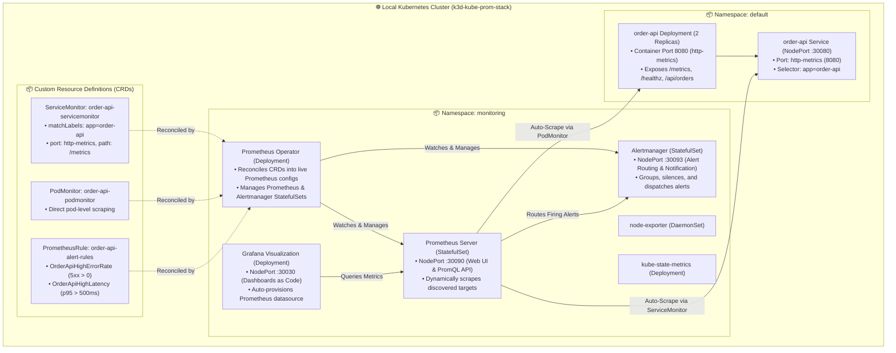
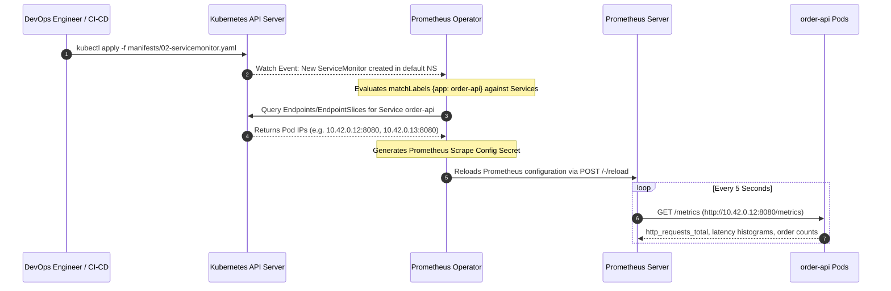

<!-- markdownlint-disable MD013 MD033 MD051 MD060 -->
# 09 - Kubernetes Observability with kube-prometheus-stack

> A production-grade **Kubernetes Monitoring & Observability Stack** powered by the **`kube-prometheus-stack`** Helm chart on a local **k3d / OrbStack Kubernetes** cluster, featuring declarative **`ServiceMonitor`**, **`PodMonitor`**, and **`PrometheusRule`** Custom Resource Definitions (CRDs), an instrumented microservice, and automated target discovery and alert validation.

---

## 📋 Table of Contents

1. [Architectural Overview & Component Topology](#-architectural-overview--component-topology)
   - [Kubernetes Monitoring Architecture](#kubernetes-monitoring-architecture)
   - [Operator Target Discovery Lifecycle](#operator-target-discovery-lifecycle)
2. [Theoretical Deep-Dive for Beginners](#-theoretical-deep-dive-for-beginners)
   - [The Kubernetes Operator Pattern Explained](#the-kubernetes-operator-pattern-explained)
   - [Why Static Prometheus Configs Fail in Kubernetes](#why-static-prometheus-configs-fail-in-kubernetes)
   - [Anatomy of kube-prometheus-stack](#anatomy-of-kube-prometheus-stack)
   - [Deep-Dive on Monitoring CRDs](#deep-dive-on-monitoring-crds)
     - [ServiceMonitor](#1-servicemonitor)
     - [PodMonitor](#2-podmonitor)
     - [PrometheusRule](#3-prometheusrule)
   - [How Prometheus Operator Builds Dynamic Scrape Configs](#how-prometheus-operator-builds-dynamic-scrape-configs)
3. [Repository & Directory Structure](#-repository--directory-structure)
4. [Prerequisites & System Setup](#-prerequisites--system-setup)
5. [Quickstart Guide](#-quickstart-guide)
6. [Step-by-Step Hands-On Guide](#-step-by-step-hands-on-guide)
   - [Step 1: Inspect the Declarative Helm Values Configuration](#step-1-inspect-the-declarative-helm-values-configuration)
   - [Step 2: Inspect the Custom ServiceMonitor & PrometheusRule CRDs](#step-2-inspect-the-custom-servicemonitor--prometheusrule-crds)
   - [Step 3: Provision the Local Cluster & Deploy the Stack with test_stack.sh](#step-3-provision-the-local-cluster--deploy-the-stack-with-test_stacksh)
   - [Step 4: Access Prometheus, Grafana, and Alertmanager Web Consoles](#step-4-access-prometheus-grafana-and-alertmanager-web-consoles)
   - [Step 5: Verify Dynamic Target Discovery in Prometheus UI (:30090)](#step-5-verify-dynamic-target-discovery-in-prometheus-ui-30090)
   - [Step 6: Inject Traffic & Observe Metric Ingestion](#step-6-inject-traffic--observe-metric-ingestion)
   - [Step 7: Trigger Simulated 500 Errors & Observe Alert Transitions](#step-7-trigger-simulated-500-errors--observe-alert-transitions)
   - [Step 8: Run the Automated Validation Test Suite](#step-8-run-the-automated-validation-test-suite)
7. [Production Best Practices & Tuning](#-production-best-practices--tuning)
8. [Troubleshooting & Common Gotchas](#-troubleshooting--common-gotchas)
9. [Resource Teardown & Complete Cleanup](#-resource-teardown--complete-cleanup)

---

## 🏛️ Architectural Overview & Component Topology

### Kubernetes Monitoring Architecture



### Operator Target Discovery Lifecycle



---

## 🧠 Theoretical Deep-Dive for Beginners

### The Kubernetes Operator Pattern Explained

In standard software, human operators manually configure servers, reload configuration files, manage backup rotations, and scale replicas.

The **Kubernetes Operator Pattern** encodes this human domain knowledge directly into software:

```text
┌─────────────────────────────────────────────────────────────────────────────┐
│                       THE KUBERNETES OPERATOR PATTERN                       │
├─────────────────────────────────────────────────────────────────────────────┤
│                                                                             │
│   1. OBSERVE        2. ANALYZE DIFFERENCE          3. ACT & RECONCILE       │
│  ┌───────────┐      ┌─────────────────────────┐    ┌────────────────────┐   │
│  │ Watch CRD │ ───▶ │ Compare Desired State   │───▶│ Generate Config &  │   │
│  │ Events    │      │ vs. Current Live State  │    │ Reload Prometheus  │   │
│  └───────────┘      └─────────────────────────┘    └────────────────────┘   │
│        ▲                                                     │              │
│        └─────────────────────────────────────────────────────┘              │
│                            Reconciliation Loop                              │
│                                                                             │
└─────────────────────────────────────────────────────────────────────────────┘
```

An Operator consists of:

1. **Custom Resource Definitions (CRDs)**: Extensions to the Kubernetes API that introduce domain-specific types (e.g., `ServiceMonitor`, `PrometheusRule`).
2. **Custom Controller**: A continuous loop running inside a pod that watches for CRD additions, updates, or deletions, and brings the cluster to the desired state.

---

### Why Static Prometheus Configs Fail in Kubernetes

In traditional infrastructure (VMs/Bare Metal), server IP addresses rarely change. You can maintain a static `prometheus.yml` file listing hostnames:

```yaml
# Traditional Static Scrape Config (Fails in Kubernetes!)
scrape_configs:
  - job_name: "order-service"
    static_configs:
      - targets: ["192.168.1.10:8080", "192.168.1.11:8080"]
```

In Kubernetes, this approach breaks down because:

1. **Ephemeral IP Addresses**: Pods are constantly created, rescheduled, scaled up/down, or replaced. Static IPs become obsolete within minutes.
2. **Developer Decentralization**: Microservice teams should own their scraping rules and alerts in their own application repositories, without needing to submit PRs to a central `prometheus.yml` repository.
3. **Decoupled Configuration**: Using CRDs lets you package `ServiceMonitor` and `PrometheusRule` manifests alongside your application's `Deployment.yaml`.

---

### Anatomy of kube-prometheus-stack

The `kube-prometheus-stack` (formerly `prometheus-operator`) is an all-in-one collection of Kubernetes manifests and Helm charts providing:

| Component | Responsibility |
| :--- | :--- |
| **Prometheus Operator** | Manages the full lifecycle of Prometheus, Alertmanager, and monitoring CRDs. |
| **Prometheus** | Highly available TSDB scraping metrics, executing PromQL queries, and evaluating alerting rules. |
| **Alertmanager** | De-duplicates, groups, and routes alert notifications (to Slack, PagerDuty, Webhooks). |
| **Grafana** | Visualization platform pre-configured with Kubernetes dashboards and Prometheus datasource. |
| **kube-state-metrics** | Listens to the Kubernetes API and generates metrics about object health (Pod restarts, Deployments, PVCs). |
| **node-exporter** | Gathers OS-level host metrics (CPU, Memory, Disk I/O, Network bandwidth). |

---

### Deep-Dive on Monitoring CRDs

#### 1. `ServiceMonitor`

A `ServiceMonitor` declaratively defines how groups of dynamic endpoints should be monitored by Prometheus. It uses **label selectors** to match a Kubernetes `Service`:

```yaml
apiVersion: monitoring.coreos.com/v1
kind: ServiceMonitor
metadata:
  name: order-api-servicemonitor
  namespace: default
spec:
  selector:
    matchLabels:
      app: order-api       # Matches Service with label 'app: order-api'
  endpoints:
    - port: http-metrics   # Matches the named port in the Service definition
      path: /metrics       # Scrape path
      interval: 5s         # Scrape frequency
```

#### 2. `PodMonitor`

A `PodMonitor` discovers and scrapes Pods directly without requiring a Kubernetes Service. This is ideal for:

- Short-lived batch jobs.
- Workers consuming from a queue (e.g. Celery / Kafka consumers) that do not expose public network ports.
- StatefulSets where direct pod targeting is preferred.

```yaml
apiVersion: monitoring.coreos.com/v1
kind: PodMonitor
metadata:
  name: order-api-podmonitor
  namespace: default
spec:
  selector:
    matchLabels:
      app: order-api
  podMetricsEndpoints:
    - port: http-metrics
      path: /metrics
      interval: 5s
```

#### 3. `PrometheusRule`

Defines alerting and recording rules evaluated natively by Prometheus:

```yaml
apiVersion: monitoring.coreos.com/v1
kind: PrometheusRule
metadata:
  name: order-api-alert-rules
  namespace: default
spec:
  groups:
    - name: order-api.alerts
      rules:
        - alert: OrderApiHighErrorRate
          expr: sum(rate(http_requests_total{status=~"5.."}[1m])) by (endpoint) > 0
          for: 5s
          labels:
            severity: critical
          annotations:
            summary: "High HTTP 5xx Error Rate on Order API"
```

---

### How Prometheus Operator Builds Dynamic Scrape Configs

When you apply a `ServiceMonitor`:

1. The Prometheus Operator reconciles the `ServiceMonitor` object.
2. It queries the Kubernetes API for Services matching `.spec.selector.matchLabels`.
3. It discovers all associated `EndpointSlices` / `Endpoints` backing that Service.
4. It dynamically builds an internal Prometheus configuration snippet in a Kubernetes Secret (`prometheus-kube-prometheus-stack-prometheus`).
5. Prometheus watches this secret and reloads its scrape configuration without restarting the container.

---

## 📁 Repository & Directory Structure

```text
08-observability-and-monitoring/09-kube-prometheus-stack-helm-k8s/
├── .gitignore
├── README.md                      # Comprehensive project guide (this document)
├── cleanup.sh                     # Teardown script for k3d cluster, Helm release & images
├── test_stack.sh                  # Automated master build, deploy & test runner
├── k8s_monitoring_test.sh         # Validation suite for CRDs, discovery & alerts
├── helm/
│   └── values.yaml                # Custom Helm values for kube-prometheus-stack
├── manifests/
│   ├── 01-sample-app.yaml         # Deployment & Service for instrumented order-api
│   ├── 02-servicemonitor.yaml     # Custom ServiceMonitor CRD definition
│   ├── 03-podmonitor.yaml         # Custom PodMonitor CRD definition
│   └── 04-prometheusrule.yaml     # Custom PrometheusRule alerting CRD
└── app/
    ├── Dockerfile
    ├── main.py                    # FastAPI sample app emitting Prometheus RED metrics
    └── requirements.txt
```

---

## ⚙️ Prerequisites & System Setup

Ensure your local development environment has the following tools installed:

- **Docker Engine** (or Docker Desktop / OrbStack on macOS): $\ge 24.0$
- **k3d**: $\ge v5.0$ (used to provision isolated, lightweight local k3s clusters)
- **kubectl**: $\ge v1.28$ (standard Kubernetes CLI)
- **Helm 3**: $\ge v3.12$ (Kubernetes package manager)
- **cURL**: Standard HTTP client
- **Python 3**: $\ge 3.8$ (for automated test assertion evaluation)
- **pnpm** (optional, for markdown linting validation)

Verify tool readiness:

```bash
docker --version
k3d --version
kubectl version --client
helm version
python3 --version
```

---

## 🚀 Quickstart Guide

Get the entire Kubernetes observability stack running, instrumented, and verified in 3 simple commands:

```bash
cd 08-observability-and-monitoring/09-kube-prometheus-stack-helm-k8s

# 1. Run the automated master runner (spins up k3d, deploys Helm, builds app & runs tests)
./test_stack.sh

# 2. Explore the web dashboards
open http://localhost:30090  # Prometheus Web UI (Status -> Targets)
open http://localhost:30030  # Grafana Dashboard (User: admin / Pass: prom-operator)
open http://localhost:30093  # Alertmanager UI

# 3. Clean up all resources when finished
./cleanup.sh --purge-images
```

---

## 📖 Step-by-Step Hands-On Guide

### Step 1: Inspect the Declarative Helm Values Configuration

Open `helm/values.yaml` to observe how `kube-prometheus-stack` is configured for global CRD discovery:

```yaml
prometheus:
  service:
    type: NodePort
    nodePort: 30090
  prometheusSpec:
    scrapeInterval: "5s"
    evaluationInterval: "5s"
    # CRITICAL: Disables filtering by Helm release label so any ServiceMonitor is discovered
    serviceMonitorSelectorNilUsesHelmValues: false
    podMonitorSelectorNilUsesHelmValues: false
    ruleSelectorNilUsesHelmValues: false

grafana:
  adminPassword: "prom-operator"
  service:
    type: NodePort
    nodePort: 30030

alertmanager:
  service:
    type: NodePort
    nodePort: 30093
```

---

### Step 2: Inspect the Custom ServiceMonitor & PrometheusRule CRDs

Open `manifests/02-servicemonitor.yaml`:

```yaml
apiVersion: monitoring.coreos.com/v1
kind: ServiceMonitor
metadata:
  name: order-api-servicemonitor
  namespace: default
spec:
  selector:
    matchLabels:
      app: order-api
  endpoints:
    - port: http-metrics
      path: /metrics
      interval: 5s
```

Notice that:

- It targets the `default` namespace.
- It matches any Service with label `app: order-api`.
- It scrapes port `http-metrics` (`8080`) on path `/metrics` every 5 seconds.

---

### Step 3: Provision the Local Cluster & Deploy the Stack with test_stack.sh

Execute the master runner script:

```bash
./test_stack.sh
```

This script will:

1. Create a local k3d cluster (`k3d-kube-prom-stack`) with port mappings `:30090`, `:30030`, `:30093`, `:30080`.
2. Add the `prometheus-community` Helm repository.
3. Deploy `kube-prometheus-stack` to namespace `monitoring`.
4. Build `order-api:local` and import it into the k3d cluster.
5. Apply all manifests in `manifests/`.
6. Run the automated assertion suite.

---

### Step 4: Access Prometheus, Grafana, and Alertmanager Web Consoles

Once deployed, access the services using their pre-configured NodePort mappings:

- **Prometheus Web UI**: [http://localhost:30090](http://localhost:30090)
- **Grafana Visualization**: [http://localhost:30030](http://localhost:30030) *(Credentials: `admin` / `prom-operator`)*
- **Alertmanager UI**: [http://localhost:30093](http://localhost:30093)
- **Order API Swagger Docs**: [http://localhost:30080/docs](http://localhost:30080/docs)

---

### Step 5: Verify Dynamic Target Discovery in Prometheus UI (:30090)

1. Open **[http://localhost:30090/targets](http://localhost:30090/targets)** in your browser.
2. Search for `serviceMonitor/default/order-api-servicemonitor/0`.
3. Notice that:
   - **State**: `UP` (Green badge).
   - **Labels**: `app="order-api"`, `instance="<pod-ip>:8080"`, `job="order-api"`, `namespace="default"`, `service="order-api"`.
   - **Scrape Duration**: Typically `< 10ms`.

Prometheus Operator discovered both pod replicas automatically without writing a single line of static scrape configuration!

---

### Step 6: Inject Traffic & Observe Metric Ingestion

Emit a series of orders to the running microservice:

```bash
for i in {1..10}; do
  curl -s -X POST http://localhost:30080/api/orders \
    -H "Content-Type: application/json" \
    -d '{
      "customer_id": "cust-9988",
      "customer_tier": "enterprise",
      "currency": "USD",
      "amount": 189.50
    }' | python3 -m json.tool
done
```

Now query Prometheus via PromQL in the UI or via cURL:

```bash
curl -s -G "http://localhost:30090/api/v1/query" \
  --data-urlencode "query=sum(rate(http_requests_total[1m])) by (endpoint, status)" | python3 -m json.tool
```

---

### Step 7: Trigger Simulated 500 Errors & Observe Alert Transitions

Simulate application failures to verify that the `OrderApiHighErrorRate` rule fires:

```bash
for i in {1..6}; do
  curl -s -X POST http://localhost:30080/api/simulate-error
done
```

1. Open **[http://localhost:30090/alerts](http://localhost:30090/alerts)** in your browser.
2. Locate the alert rule **`OrderApiHighErrorRate`**.
3. Observe the alert state transition:
   - **`Inactive`** $\longrightarrow$ **`Pending`** (threshold exceeded, waiting for `for: 5s` grace period) $\longrightarrow$ **`Firing`** (Red badge).
4. Open **[http://localhost:30093](http://localhost:30093)** (Alertmanager):
   - Notice the active alert grouped with labels: `alertname="OrderApiHighErrorRate"`, `severity="critical"`, `team="sre-ecommerce"`.

---

### Step 8: Run the Automated Validation Test Suite

To run the verification suite independently at any time:

```bash
./k8s_monitoring_test.sh
```

*Sample Test Output:*

```text
======================================================================
  ☸️ kube-prometheus-stack Observability - Automated Validation
======================================================================

▶ [1/5] Checking Kubernetes Cluster & Prometheus Operator Health...
  [PASS] CRD Available: CustomResourceDefinition 'servicemonitors.monitoring.coreos.com' is registered
  [PASS] CRD Available: CustomResourceDefinition 'podmonitors.monitoring.coreos.com' is registered
  [PASS] CRD Available: CustomResourceDefinition 'prometheusrules.monitoring.coreos.com' is registered
  [PASS] Monitoring Stack: Core monitoring pods are running in 'monitoring' namespace

▶ [2/5] Checking Instrumented Workload (order-api)...
  [PASS] order-api Deployment: Workload is running with 2 ready replicas

▶ [3/5] Verifying Prometheus Operator Dynamic Target Discovery...
  [PASS] Target Discovery: Prometheus Operator dynamically discovered order-api ServiceMonitor target
  [PASS] Target Health: Prometheus successfully scrapes order-api endpoints (health: up)

▶ [4/5] Emitting Synthetic Workloads & Testing Metric Ingestion...
  Waiting for Prometheus scrape cycle (6s)...
  [PASS] Metric Ingestion: PromQL query 'orders_processed_total' returned accumulated count: 24
  [PASS] 5xx Error Metrics: PromQL query recorded 12 simulated HTTP 500 error samples

▶ [5/5] Validating PrometheusRule Alerts & Grafana Health...
  [PASS] PrometheusRule Loaded: Prometheus Operator successfully loaded 'OrderApiHighErrorRate' alert rule
  [PASS] Grafana Health: Grafana dashboard service is online and healthy at http://localhost:30030

======================================================================
  📊 Kubernetes Observability Verification Summary
======================================================================
  Total Test Assertions: 10
  Passed Assertions:     10
  Failed Assertions:     0

✅ SUCCESS: kube-prometheus-stack is operating with full CRD auto-discovery!
```

---

## 🎯 Production Best Practices & Tuning

```text
┌─────────────────────────────────────────────────────────────────────────────┐
│                 KUBERNETES OBSERVABILITY BEST PRACTICES                     │
├─────────────────────────────────────────────────────────────────────────────┤
│ 1. NAMESPACE SELECTORS   │ Restrict ServiceMonitors to specific namespaces  │
│                         │ in multi-tenant clusters to avoid rogue scrapes.  │
├─────────────────────────┼───────────────────────────────────────────────────┤
│ 2. METRIC RELABELINGS   │ Drop high-cardinality or sensitive labels at the  │
│                         │ ServiceMonitor level using metricRelabelings.     │
├─────────────────────────┼───────────────────────────────────────────────────┤
│ 3. PERSISTENT STORAGE   │ Always configure StorageClasses and volumeClaim-  │
│                         │ Templates in production Prometheus StatefulSets.  │
├─────────────────────────┼───────────────────────────────────────────────────┤
│ 4. SCRAPE TIMEOUTS      │ Ensure scrapeTimeout (e.g. 3s) is always lower    │
│                         │ than scrapeInterval (e.g. 5s) to avoid pile-ups.  │
├─────────────────────────┼───────────────────────────────────────────────────┤
│ 5. RBAC & POD SECURITY  │ Run monitored application pods as non-root UIDs   │
│                         │ with read-only root filesystems where possible.   │
└─────────────────────────┴───────────────────────────────────────────────────┘
```

---

## 🛠️ Troubleshooting & Common Gotchas

### 1. Prometheus Target Status is Missing or Dropped

- **Symptom**: `order-api` does not appear in `http://localhost:30090/targets`.
- **Cause**: In `values.yaml`, `serviceMonitorSelectorNilUsesHelmValues` was set to `true`, forcing Prometheus to ignore ServiceMonitors that lack the `release: <helm-release-name>` label.
- **Fix**: Set `serviceMonitorSelectorNilUsesHelmValues: false` in `values.yaml` or ensure your `ServiceMonitor` contains `labels.release: kube-prometheus-stack`.

### 2. Scrape Target Reports "Connection Refused" or "Port Not Found"

- **Cause**: The `port` field in `ServiceMonitor.spec.endpoints[0].port` must match the **name** of the port defined in the Kubernetes `Service` object (e.g. `http-metrics`), NOT the numeric port number (`8080`).

### 3. Port Conflicts on Local Host

- **Symptom**: `Failed to create k3d cluster: port 30090 or 30030 already in use`.
- **Fix**: Check for active processes on the host: `lsof -i :30090 -i :30030 -i :30093 -i :30080`.

---

## 🧹 Resource Teardown & Complete Cleanup

To remove the local k3d Kubernetes cluster, all deployed containers, images, volumes, and temporary test artifacts, follow the steps below.

### Standard Teardown (Deletes k3d Cluster & Manifests)

```bash
./cleanup.sh
```

### Complete Teardown (Including Built Docker Images)

```bash
./cleanup.sh --purge-images
```

Or via direct CLI commands:

```bash
# 1. Delete manifests and uninstall Helm chart
kubectl delete -f manifests/ --ignore-not-found=true
helm uninstall kube-prometheus-stack -n monitoring --ignore-not-found=true

# 2. Delete the k3d cluster
k3d cluster delete k3d-kube-prom-stack

# 3. Purge local Docker images
docker rmi -f order-api:local

# 4. Clean temporary Python test caches
find . -type d -name "__pycache__" -exec rm -rf {} +
find . -type f -name "*.py[cod]" -delete
find . -type f -name "*.log" -delete
```

Verify that the k3d cluster is deleted:

```bash
k3d cluster list | grep "k3d-kube-prom-stack" || echo "Cluster deleted successfully."
```
