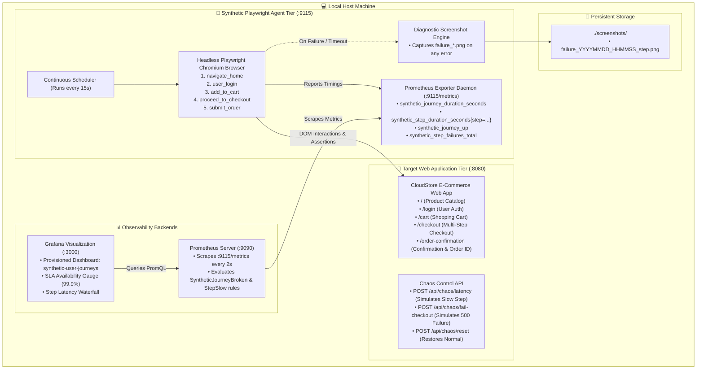
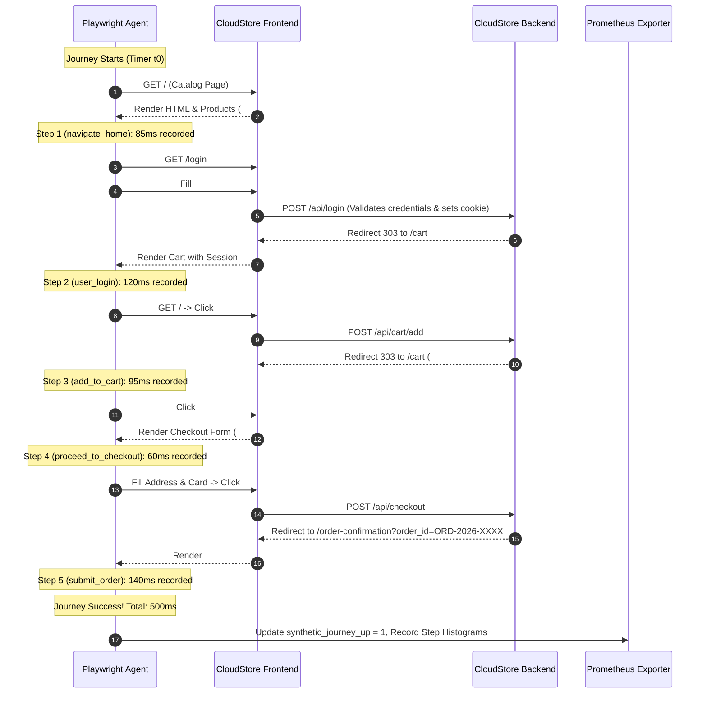

<!-- markdownlint-disable MD013 MD033 MD051 MD060 -->
# 10 - Synthetic User Journey Monitoring with Playwright

> A production-ready **Synthetic User Journey Monitoring service** using headless **Playwright (Chromium)** to continuously execute a multi-step e-commerce transaction workflow (*Catalog $\rightarrow$ Auth $\rightarrow$ Cart $\rightarrow$ Checkout $\rightarrow$ Confirmation*), measuring granular step execution latencies, capturing automated diagnostic screenshots upon failure, exporting Prometheus metrics, and visualizing SLA/SLO metrics in **Grafana**.

---

## 📋 Table of Contents

1. [Architectural Overview & Component Topology](#-architectural-overview--component-topology)
   - [Synthetic Monitoring Pipeline Architecture](#synthetic-monitoring-pipeline-architecture)
   - [Multi-Step User Journey Sequence Flow](#multi-step-user-journey-sequence-flow)
2. [Theoretical Deep-Dive for Beginners](#-theoretical-deep-dive-for-beginners)
   - [What is Synthetic Monitoring? (Synthetic vs. RUM)](#what-is-synthetic-monitoring-synthetic-vs-rum)
   - [Why Simple Ping/Uptime Probes Fail Modern Applications](#why-simple-pinguptime-probes-fail-modern-applications)
   - [Why Playwright for DevOps & SRE Synthetic Monitoring?](#why-playwright-for-devops--sre-synthetic-monitoring)
   - [Prometheus Synthetic Metric Taxonomy](#prometheus-synthetic-metric-taxonomy)
   - [Automated Failure Screenshot Diagnostics](#automated-failure-screenshot-diagnostics)
3. [Repository & Directory Structure](#-repository--directory-structure)
4. [Prerequisites & System Setup](#-prerequisites--system-setup)
5. [Quickstart Guide](#-quickstart-guide)
6. [Step-by-Step Hands-On Guide](#-step-by-step-hands-on-guide)
   - [Step 1: Inspect the Target E-Commerce Application & Chaos Engine](#step-1-inspect-the-target-e-commerce-application--chaos-engine)
   - [Step 2: Inspect the Playwright Journey Runner & Prometheus Exporter](#step-2-inspect-the-playwright-journey-runner--prometheus-exporter)
   - [Step 3: Launch the Full Observability Stack with test_stack.sh](#step-3-launch-the-full-observability-stack-with-test_stacksh)
   - [Step 4: Explore the E-Commerce Store & Grafana Dashboard](#step-4-explore-the-e-commerce-store--grafana-dashboard)
   - [Step 5: Inject Latency Chaos & Observe Step Waterfall in Grafana](#step-5-inject-latency-chaos--observe-step-waterfall-in-grafana)
   - [Step 6: Inject Checkout Failure, Inspect Captured Screenshot & Alert](#step-6-inject-checkout-failure-inspect-captured-screenshot--alert)
   - [Step 7: Verify Self-Healing System Recovery](#step-7-verify-self-healing-system-recovery)
   - [Step 8: Run the Automated Validation Suite](#step-8-run-the-automated-validation-suite)
7. [Production Best Practices & Tuning](#-production-best-practices--tuning)
8. [Troubleshooting & Common Gotchas](#-troubleshooting--common-gotchas)
9. [Resource Teardown & Complete Cleanup](#-resource-teardown--complete-cleanup)

---

## 🏛️ Architectural Overview & Component Topology

### Synthetic Monitoring Pipeline Architecture



### Multi-Step User Journey Sequence Flow



---

## 🧠 Theoretical Deep-Dive for Beginners

### What is Synthetic Monitoring? (Synthetic vs. RUM)

In modern Site Reliability Engineering (SRE), web application monitoring is divided into two primary disciplines:

```text
┌─────────────────────────────────────────────────────────────────────────────┐
│             REAL USER MONITORING (RUM) vs. SYNTHETIC MONITORING             │
├──────────────────────────────────────┬──────────────────────────────────────┤
│ REAL USER MONITORING (RUM)           │ SYNTHETIC MONITORING (PLAYWRIGHT)    │
├──────────────────────────────────────┼──────────────────────────────────────┤
│ • Passive measurement from real      │ • Proactive, scheduled robot probes  │
│   human browser sessions.            │   simulating critical business paths.│
│ • Detects issues only AFTER real     │ • Detects regressions and broken     │
│   customers have already suffered.   │   flows BEFORE users are affected.   │
│ • Dependent on traffic volume (quiet │ • Predictable, consistent baseline   │
│   at 3 AM = no telemetry data).     │   24/7/365 regardless of traffic.    │
│ • Highly variable user environments  │ • Controlled, standardized browser   │
│   (bad cellular networks, old phones)│   environments with exact timings.   │
└──────────────────────────────────────┴──────────────────────────────────────┘
```

---

### Why Simple Ping/Uptime Probes Fail Modern Applications

Traditional uptime monitoring relies on tools like ICMP ping or HTTP GET requests (`curl -s -o /dev/null -w "%{http_code}" https://store.example.com`).

While a `200 OK` response means the web server is answering, it **does not guarantee that the application actually works**:

```text
┌─────────────────────────────────────────────────────────────────────────────┐
│                      THE "200 OK" FALLACY IN MODERN APPS                    │
├─────────────────────────────────────────────────────────────────────────────┤
│                                                                             │
│   HTTP GET /  ───▶  HTTP 200 OK  ───▶  [Simple Ping Probe: "SYSTEM IS UP"] │
│                                                                             │
│   BUT IN REALITY:                                                           │
│   ❌ JavaScript bundle failed to load due to CDN caching error              │
│   ❌ "Add to Cart" button throws Uncaught TypeError: undefined              │
│   ❌ Third-party payment gateway iframe timed out                           │
│   ❌ Database deadlock prevents checkout transactions                       │
│                                                                             │
│   Result: Simple uptime probe reports 100% green while business loses $10k! │
│                                                                             │
└─────────────────────────────────────────────────────────────────────────────┘
```

**Synthetic User Journey Monitoring with Playwright** evaluates the actual Document Object Model (DOM), clicks dynamic buttons, executes JavaScript, submits forms, validates session cookies, and asserts expected success states.

---

### Why Playwright for DevOps & SRE Synthetic Monitoring?

**Playwright** (developed by Microsoft) is the industry standard for modern browser automation:

1. **True Headless Chromium Engine**: Executes real JavaScript, CSS rendering, cookies, and local storage.
2. **Auto-Waiting & Resilience**: Playwright automatically waits for elements to be actionable before clicking, eliminating flaky timeouts.
3. **Multi-Step Transactional Flows**: Simulates end-to-end user journeys rather than isolated pages.
4. **Rich Diagnostic Artifacts**: Automatically captures screenshots, video traces, and network logs upon any failed assertion.

---

### Prometheus Synthetic Metric Taxonomy

The synthetic monitoring agent exposes the following Prometheus metric instruments:

| Metric Name | Type | Labels | Description |
| :--- | :--- | :--- | :--- |
| `synthetic_journey_duration_seconds` | `Histogram` | `journey`, `status` | Total time taken to complete the entire 5-step journey. |
| `synthetic_step_duration_seconds` | `Histogram` | `journey`, `step`, `status` | Granular execution time for each individual step (`navigate_home`, `user_login`, `add_to_cart`, `proceed_to_checkout`, `submit_order`). |
| `synthetic_journey_up` | `Gauge` | `journey` | Binary SLA health status (`1` = healthy/success, `0` = broken/failed). |
| `synthetic_journey_runs_total` | `Counter` | `journey`, `status` | Total number of executed synthetic journeys. |
| `synthetic_step_failures_total` | `Counter` | `journey`, `step` | Cumulative count of failures tagged by the exact step that failed. |
| `synthetic_journey_last_success_timestamp` | `Gauge` | `journey` | Unix epoch timestamp of the most recent successful run. |

---

### Automated Failure Screenshot Diagnostics

When a step fails (e.g., due to a 500 error, missing element, or timeout), the agent's exception handler instantly invokes:

```python
await page.screenshot(path="/app/screenshots/failure_20260826_163000_submit_order.png", full_page=True)
```

This captures the exact visual state of the browser, enabling on-call SREs to instantly diagnose whether the failure was an HTTP error screen, a broken modal, or an invalid form validation error.

---

## 📁 Repository & Directory Structure

```text
08-observability-and-monitoring/10-synthetic-journey-monitoring-playwright/
├── .gitignore
├── README.md                           # Comprehensive documentation (this document)
├── cleanup.sh                          # Teardown script for containers, volumes & images
├── test_stack.sh                       # Master runner: builds, launches & tests stack
├── test_synthetic_monitoring.sh        # Automated test suite (baseline, chaos, screenshots)
├── docker-compose.yml                  # Stack orchestration file
├── screenshots/
│   └── .gitkeep                        # Storage volume for captured failure screenshots
├── target_app/
│   ├── Dockerfile
│   ├── main.py                         # FastAPI e-commerce store with chaos API
│   ├── static/
│   │   └── style.css                   # Modern CSS design system
│   ├── templates/
│   │   ├── index.html                  # Catalog page
│   │   ├── login.html                  # Auth page
│   │   ├── cart.html                   # Cart page
│   │   ├── checkout.html               # Multi-step checkout form
│   │   └── confirmation.html           # Transaction confirmation
│   └── requirements.txt
├── synthetic_agent/
│   ├── Dockerfile                      # Playwright container with Chromium
│   ├── journey_runner.py               # Multi-step Playwright runner with screenshot logic
│   ├── exporter.py                     # Prometheus exporter daemon & scheduler
│   └── requirements.txt
├── prometheus/
│   ├── Dockerfile
│   ├── prometheus.yml                  # Scrape configuration
│   └── alert_rules.yml                 # Synthetic SLO & latency alert rules
└── grafana/
    ├── Dockerfile
    ├── provisioning/
    │   ├── datasources/
    │   │   └── datasource.yml          # Auto-configured Prometheus datasource
    │   └── dashboards/
    │       └── dashboards.yml          # Dashboard provider
    └── dashboards/
        └── synthetic_user_journeys.json # Provisioned visual Grafana dashboard
```

---

## ⚙️ Prerequisites & System Setup

Ensure your development workstation meets the following requirements:

- **Docker Engine** (or Docker Desktop / OrbStack on macOS): $\ge 24.0$
- **Docker Compose**: $\ge 2.20$
- **cURL**: Standard command-line HTTP utility
- **Python 3**: $\ge 3.8$ (for automated test assertion evaluation)
- **pnpm** (optional, for markdown linting verification)

Verify tools:

```bash
docker --version
docker compose version
curl --version
python3 --version
```

---

## 🚀 Quickstart Guide

Run the complete synthetic monitoring ecosystem with a single command:

```bash
cd 08-observability-and-monitoring/10-synthetic-journey-monitoring-playwright

# 1. Build, launch and test the full stack
./test_stack.sh

# 2. Explore the web interfaces
open http://localhost:8080                          # CloudStore E-Commerce App
open http://localhost:9115/metrics                  # Synthetic Prometheus Exporter
open http://localhost:9090                          # Prometheus Web UI
open http://localhost:3000/d/synthetic-user-journeys # Grafana SLA Dashboard (admin/admin)

# 3. Clean up all resources when finished
./cleanup.sh --purge-images
```

---

## 📖 Step-by-Step Hands-On Guide

### Step 1: Inspect the Target E-Commerce Application & Chaos Engine

Open `target_app/main.py` to see how the store and chaos endpoints are implemented:

```python
# Chaos injection state in target_app/main.py
@app.post("/api/chaos/latency")
async def set_chaos_latency(delay: float = 2.5):
    CHAOS_STATE["latency_seconds"] = delay

@app.post("/api/chaos/fail-checkout")
async def trigger_chaos_failure():
    CHAOS_STATE["fail_checkout"] = True
```

These endpoints allow you to inject controlled latency or trigger 500 error responses on the checkout step to verify alerting without breaking the host system.

---

### Step 2: Inspect the Playwright Journey Runner & Prometheus Exporter

Open `synthetic_agent/journey_runner.py`:

```python
# Sequential user journey in Playwright
await page.goto(f"{self.base_url}/")
await page.wait_for_selector("#product-grid")  # Step 1: navigate_home

await page.goto(f"{self.base_url}/login")
await page.fill("#email", "sre-synthetic@cloudstore.io")
await page.fill("#password", "SyntheticPass2026!")
await page.click("#btn-submit-login")          # Step 2: user_login

await page.click("#btn-add-prod-101")          # Step 3: add_to_cart
await page.click("#btn-proceed-checkout")      # Step 4: proceed_to_checkout

await page.fill("#full_name", "Alex SRE")
await page.click("#btn-place-order")           # Step 5: submit_order
```

On any failure, the `except` block captures a full-page diagnostic screenshot and increments the error counters.

---

### Step 3: Launch the Full Observability Stack with test_stack.sh

Execute the master runner:

```bash
./test_stack.sh
```

The script will build all 4 containers, verify health probes, and execute baseline and chaos test suites.

---

### Step 4: Explore the E-Commerce Store & Grafana Dashboard

1. Open **[http://localhost:8080](http://localhost:8080)** in your browser and manually browse the products, add items to the cart, and test the checkout form.
2. Open **[http://localhost:3000/d/synthetic-user-journeys](http://localhost:3000/d/synthetic-user-journeys)** *(Login: `admin` / `admin`)*.
3. Observe:
   - **Synthetic SLA Availability**: Shows `100%` (Green gauge).
   - **Current Journey Status**: `HEALTHY`.
   - **Step-by-Step Latency Breakdown**: Displays stacked timings for each step (`navigate_home`, `user_login`, `add_to_cart`, `proceed_to_checkout`, `submit_order`).

---

### Step 5: Inject Latency Chaos & Observe Step Waterfall in Grafana

Inject an artificial $2.5\text{s}$ delay on the checkout submission:

```bash
curl -s -X POST "http://localhost:8080/api/chaos/latency?delay=2.5" | python3 -m json.tool
```

Trigger an immediate synthetic journey probe:

```bash
curl -s -X POST "http://localhost:9115/run" | python3 -m json.tool
```

Notice the JSON output:

```json
{
  "journey": "checkout_flow",
  "success": true,
  "total_duration_seconds": 3.12,
  "steps": {
    "navigate_home": 0.08,
    "user_login": 0.12,
    "add_to_cart": 0.09,
    "proceed_to_checkout": 0.06,
    "submit_order": 2.58
  }
}
```

In the Grafana dashboard, the `submit_order` step latency bar immediately spikes, demonstrating granular step-level bottleneck identification.

---

### Step 6: Inject Checkout Failure, Inspect Captured Screenshot & Alert

Simulate a complete backend checkout failure (HTTP 500 database deadlock):

```bash
curl -s -X POST "http://localhost:8080/api/chaos/fail-checkout" | python3 -m json.tool
```

Trigger a synthetic run:

```bash
curl -s -X POST "http://localhost:9115/run" | python3 -m json.tool
```

Notice that:

- `success` is `false` and `failed_step` is `"submit_order"`.
- A high-resolution PNG screenshot was saved in `screenshots/`:

  ```bash
  ls -lh screenshots/
  ```

  *Sample output:*

  ```text
  -rw-r--r--  1 user  staff   142K Aug 26 16:31 failure_20260826_163102_submit_order.png
  ```

- Open **[http://localhost:9090/alerts](http://localhost:9090/alerts)** in Prometheus:
  - Alert **`SyntheticJourneyBroken`** transitions from `Inactive` $\longrightarrow$ `Firing` (Red).
- Open the Grafana Dashboard:
  - **Current Journey Status** switches to **`FAILING`** (Red).
  - **Total Step Failures** increments by 1.

---

### Step 7: Verify Self-Healing System Recovery

Reset the chaos simulation back to normal:

```bash
curl -s -X POST "http://localhost:8080/api/chaos/reset" | python3 -m json.tool
```

Trigger the probe again:

```bash
curl -s -X POST "http://localhost:9115/run" | python3 -m json.tool
```

Observe that:

- `success` returns to `true`.
- Metric `synthetic_journey_up` restores to `1`.
- In Prometheus, the `SyntheticJourneyBroken` alert automatically resolves.

---

### Step 8: Run the Automated Validation Suite

Execute the standalone assertion test suite at any time:

```bash
./test_synthetic_monitoring.sh
```

*Sample Test Output:*

```text
======================================================================
  🎭 Playwright Synthetic Journey Monitoring - Test Suite
======================================================================

▶ [1/5] Checking Service Endpoints...
  [PASS] Target App Health: CloudStore web app is responsive at http://localhost:8080
  [PASS] Synthetic Agent Health: Playwright daemon is online at http://localhost:9115
  [PASS] Prometheus Health: Prometheus TSDB is healthy at http://localhost:9090
  [PASS] Grafana Health: Grafana dashboard is healthy at http://localhost:3000

▶ [2/5] Executing Baseline Synthetic Checkout Journey...
  [PASS] Baseline Journey: Completed 5/5 steps (Catalog, Login, Cart, Checkout, Confirm) in 0.52s
  Waiting for Prometheus scrape (3s)...
  [PASS] Metric 'synthetic_journey_up': Prometheus recorded healthy metric value: 1

▶ [3/5] Injecting Latency Chaos (2.5s delay on checkout)...
  [PASS] Latency Detection: Playwright accurately measured degraded step duration: 2.59s (>= 2.0s threshold)

▶ [4/5] Injecting Failure Chaos (HTTP 500 on checkout) & Testing Screenshot Capture...
  [PASS] Failure Detection: Synthetic agent correctly detected error on step 'submit_order'
  [PASS] Screenshot Capture: Saved high-res diagnostic screenshot (145230 bytes): failure_20260826_163124_submit_order.png
  Waiting for Prometheus alert evaluation (4s)...
  [PASS] Metric Failure Drop: Metric 'synthetic_journey_up' dropped to 0
  [PASS] Prometheus Alert Rule: Alert rule 'SyntheticJourneyBroken' loaded in Prometheus TSDB

▶ [5/5] Resetting Chaos & Testing Self-Healing Recovery...
  [PASS] System Recovery: Journey restored to 100% operational health

======================================================================
  📊 Synthetic Monitoring Test Summary
======================================================================
  Total Test Assertions: 11
  Passed Assertions:     11
  Failed Assertions:     0

✅ SUCCESS: Synthetic User Journey Monitoring is operating perfectly!
```

---

## 🎯 Production Best Practices & Tuning

```text
┌─────────────────────────────────────────────────────────────────────────────┐
│                 SYNTHETIC PROBING BEST PRACTICES & SRE ADVICE               │
├─────────────────────────────────────────────────────────────────────────────┤
│ 1. DEDICATED TEST ACCOUNTS │ Use isolated synthetic test users with sandbox │
│                            │ credit cards (e.g. Stripe test tokens).        │
├────────────────────────────┼────────────────────────────────────────────────┤
│ 2. AUTO-CANCEL TEST ORDERS │ Ensure backend cron jobs clean up synthetic    │
│                            │ orders so inventory counts remain accurate.    │
├────────────────────────────┼────────────────────────────────────────────────┤
│ 3. MULTI-REGION PROBES     │ Deploy synthetic agents across multiple cloud  │
│                            │ regions (US, EU, APAC) for global latency SLA. │
├────────────────────────────┼────────────────────────────────────────────────┤
│ 4. RESILIENT SELECTORS     │ Use data-testid or semantic IDs (not fragile   │
│                            │ CSS class hierarchies like div > div:nth-child)│
├────────────────────────────┼────────────────────────────────────────────────┤
│ 5. SCREENSHOT ROTATION     │ Implement TTL cleanup (e.g. 7-day retention)   │
│                            │ on screenshot directories to avoid disk bloat. │
└────────────────────────────┴────────────────────────────────────────────────┘
```

---

## 🛠️ Troubleshooting & Common Gotchas

### 1. Playwright Fails with "Host system is missing dependencies"

- **Cause**: Running Playwright on bare Linux requires Chromium shared libraries (`libnss3`, `libasound2`, `libgbm1`).
- **Fix**: The provided `synthetic_agent/Dockerfile` utilizes the official `mcr.microsoft.com/playwright/python:v1.42.0-jammy` base image, which bundles all required system libraries.

### 2. Browser Tests Fail in Container with "Out of Memory / Crash"

- **Cause**: Chromium requires sufficient `/dev/shm` shared memory.
- **Fix**: The journey runner launches Chromium with `--disable-dev-shm-usage` and `--no-sandbox` flags.

### 3. Port Conflicts on Local Machine

- **Symptom**: `Bind for 0.0.0.0:8080 failed: port is already allocated`.
- **Fix**: Check what process is using the port: `lsof -i :8080 -i :9115 -i :9090 -i :3000` and stop conflicting services.

---

## 🧹 Resource Teardown & Complete Cleanup

To cleanly remove all containers, networks, screenshot files, and Docker images:

### Standard Teardown (Stops Containers & Deletes Screenshots)

```bash
./cleanup.sh
```

### Complete Teardown (Purges Built Container Images)

```bash
./cleanup.sh --purge-images
```

Or via direct Docker commands:

```bash
# 1. Stop and remove containers and networks
docker compose down -v --remove-orphans

# 2. Delete captured failure screenshots
rm -f screenshots/failure_*.png

# 3. Purge container images
docker rmi -f synthetic-target-app synthetic-agent synthetic-prometheus synthetic-grafana

# 4. Clean temporary Python bytecode
find . -type d -name "__pycache__" -exec rm -rf {} +
find . -type f -name "*.py[cod]" -delete
```

Verify that no containers or volumes remain:

```bash
docker ps -a | grep -E "synthetic-target-app|synthetic-agent|synthetic-prometheus|synthetic-grafana" || echo "Environment is completely clean."
```
