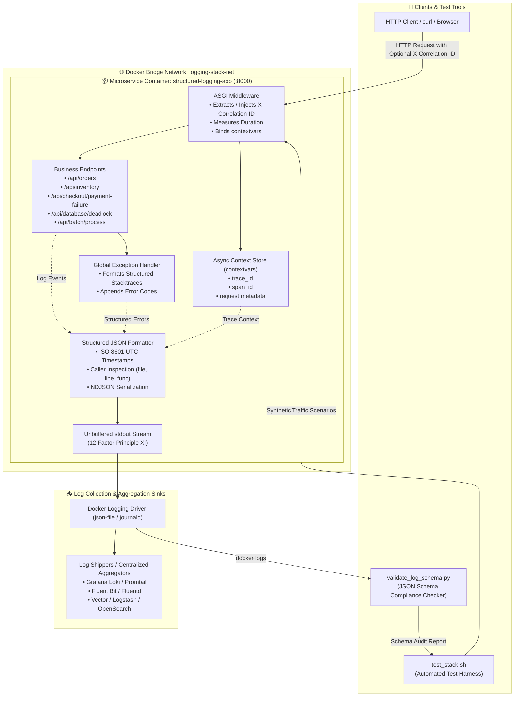

<!-- markdownlint-disable MD013 MD033 MD051 MD060 -->
# 01 - Structured JSON Logging Framework

> A production-grade structured logging framework for microservices implementing standardized JSON event formatting, ISO 8601 UTC timestamps, distributed trace correlation IDs, caller source inspection, structured exception handling, and automated JSON Schema validation.

---

## 📋 Table of Contents

1. [Architectural Overview & Data Flow](#-architectural-overview--data-flow)
   - [System Architecture Diagram](#system-architecture-diagram)
   - [Structured Logging Lifecycle](#structured-logging-lifecycle)
2. [Theoretical Deep-Dive for Beginners](#-theoretical-deep-dive-for-beginners)
   - [Why Unstructured Text Logs Fail at Scale](#why-unstructured-text-logs-fail-at-scale)
   - [Anatomy of a Production-Grade JSON Log Event](#anatomy-of-a-production-grade-json-log-event)
   - [Distributed Tracing & Correlation IDs (`trace_id`, `span_id`)](#distributed-tracing--correlation-ids-trace_id-span_id)
   - [Structured Exceptions vs Unparsed Multiline Tracebacks](#structured-exceptions-vs-unparsed-multiline-tracebacks)
   - [12-Factor App Principle XI (Logs as Event Streams)](#12-factor-app-principle-xi-logs-as-event-streams)
   - [Centralized Log Collectors (Loki, Fluent Bit, Vector, ELK)](#centralized-log-collectors-loki-fluent-bit-vector-elk)
3. [Repository & Directory Structure](#-repository--directory-structure)
4. [Prerequisites & System Setup](#-prerequisites--system-setup)
5. [Quickstart Guide](#-quickstart-guide)
6. [Step-by-Step Hands-On Guide](#-step-by-step-hands-on-guide)
   - [Step 1: Inspect the Logging Library & Formatter](#step-1-inspect-the-logging-library--formatter)
   - [Step 2: Build & Start the Microservice Container](#step-2-build--start-the-microservice-container)
   - [Step 3: Trigger Multi-Step Business Transactions](#step-3-trigger-multi-step-business-transactions)
   - [Step 4: Test Distributed Correlation ID Propagation](#step-4-test-distributed-correlation-id-propagation)
   - [Step 5: Inject Realistic Error & Failure Scenarios](#step-5-inject-realistic-error--failure-scenarios)
   - [Step 6: Run the Automated JSON Schema Validator](#step-6-run-the-automated-json-schema-validator)
7. [JSON Schema Field Specification Reference](#-json-schema-field-specification-reference)
8. [Troubleshooting & Common Gotchas](#-troubleshooting--common-gotchas)
9. [Resource Teardown & Complete Cleanup](#-resource-teardown--complete-cleanup)

---

## 🏛️ Architectural Overview & Data Flow

### System Architecture Diagram



### Structured Logging Lifecycle

1. **Request Interception & Context Binding**: An incoming HTTP request arrives at the ASGI middleware. The middleware inspects headers for `X-Correlation-ID` or `X-Request-ID`. If missing, it generates a fresh UUIDv4 and 16-hex `span_id`, binding them to asynchronous `contextvars`.
2. **Business Event Logging**: Application code emits logs (`logger.info(...)`, `logger.warning(...)`, `logger.error(...)`) with arbitrary business key-value dictionaries.
3. **Automatic Context & Caller Enrichment**: The `StructuredJSONFormatter` automatically queries the active `contextvars` to retrieve `trace_id` and `span_id`, inspects the Python stack frame for caller location (`file`, `line`, `func`), and formats the timestamp in ISO 8601 UTC (`YYYY-MM-DDTHH:MM:SS.sssZ`).
4. **Structured Error Serialization**: If an exception occurs, the error handler serializes the exception class (`error.type`), message (`error.message`), and stack trace frames (`error.stacktrace`) directly into JSON objects without multiline breaking.
5. **Standard Out Emission**: The formatted JSON log line is written to `stdout` as a single newline-delimited JSON (NDJSON) string.
6. **Schema Validation**: The validator (`validate_log_schema.py`) ingests the stream, asserts 100% compliance against `schema/log_event_schema.json`, and verifies zero non-JSON pollution.

---

## 🧠 Theoretical Deep-Dive for Beginners

### Why Unstructured Text Logs Fail at Scale

In traditional monoliths, developers frequently used unstructured text logging (e.g., `print("Order 123 failed: invalid item")` or `log.Printf("User %s logged in", user)`). While readable in a local terminal, this approach causes severe operational failure in modern cloud-native architectures:

```text
┌─────────────────────────────────────────────────────────────────────────────┐
│                 UNSTRUCTURED TEXT LOGS VS. STRUCTURED JSON                  │
├─────────────────────────────────────────────────────────────────────────────┤
│ ❌ UNSTRUCTURED PLAINTEXT:                                                  │
│ 2026-08-22 19:30:15 [INFO] User cust_881 bought item SKU-99 for $49.99     │
│ 2026-08-22 19:30:16 [ERROR] Payment failed on gateway stripe: timeout      │
│ Traceback (most recent call last):                                          │
│   File "app/main.py", line 42, in process_payment                          │
│     raise TimeoutError("connection dropped")                                │
│ TimeoutError: connection dropped                                            │
│                                                                             │
│ Problems:                                                                   │
│ • Requires brittle, CPU-intensive regex (Grok) to extract fields.           │
│ • Multiline stack traces get fragmented across distributed log shippers.    │
│ • Impossible to index high-cardinality metadata efficiently.                │
├─────────────────────────────────────────────────────────────────────────────┤
│ ✅ STRUCTURED JSON (NDJSON):                                                │
│ {"timestamp":"2026-08-22T19:30:15.123Z","level":"INFO","logger":"order",   │
│  "service":"order-service","environment":"production","trace_id":"e18c4...",│
│  "message":"Order completed","context":{"customer_id":"cust_881",           │
│  "sku":"SKU-99","total_amount":49.99},"caller":{"file":"main.py","line":42,│
│  "func":"create_order"}}                                                    │
│                                                                             │
│ Benefits:                                                                   │
│ • Native parsing in Grafana Loki, Elasticsearch, OpenSearch, Datadog.      │
│ • Zero regex overhead on log collectors (Fluent Bit, Promtail, Vector).     │
│ • Stacktraces remain a single atomic JSON record.                           │
│ • Easy metric extraction (e.g. sum by customer_id or status_code).          │
└─────────────────────────────────────────────────────────────────────────────┘
```

### Anatomy of a Production-Grade JSON Log Event

Every log event in a distributed system must answer five fundamental SRE questions:

- **When did it happen?** (`timestamp`: ISO 8601 UTC with millisecond precision).
- **What is the severity?** (`level`: `DEBUG`, `INFO`, `WARNING`, `ERROR`, `CRITICAL`).
- **Which component emitted it?** (`service`, `environment`, `logger`, `caller`).
- **Which end-to-end transaction does it belong to?** (`trace_id`, `span_id`).
- **What happened and in what context?** (`message`, `context`, `http`, `error`).

```json
{
  "timestamp": "2026-08-22T22:36:25.123Z",
  "level": "ERROR",
  "logger": "app.service",
  "message": "Database transaction aborted due to deadlock",
  "service": "order-processing-service",
  "environment": "production",
  "trace_id": "550e8400-e29b-41d4-a716-446655440000",
  "span_id": "a1b2c3d4e5f60718",
  "caller": {
    "file": "main.py",
    "line": 145,
    "func": "handle_db_deadlock"
  },
  "context": {
    "error_code": "ERR_DB_DEADLOCK_40001",
    "table": "accounts_ledger",
    "transaction_id": "tx_9f81a20b",
    "retryable": true
  },
  "http": {
    "method": "GET",
    "path": "/api/database/deadlock",
    "status_code": 500,
    "duration_ms": 14.82,
    "client_ip": "192.168.1.100",
    "user_agent": "curl/8.4.0"
  },
  "error": {
    "type": "DatabaseDeadlockError",
    "message": "Deadlock detected on table 'accounts_ledger' during transaction 'tx_9f81a20b'.",
    "stacktrace": [
      "Traceback (most recent call last):\n",
      "  File \"/app/app/main.py\", line 280, in simulate_deadlock\n    raise DatabaseDeadlockError(...)\n"
    ],
    "code": "ERR_DB_DEADLOCK_40001"
  }
}
```

### Distributed Tracing & Correlation IDs (`trace_id`, `span_id`)

When a user clicks "Checkout", their request might traverse a Frontend Proxy, an API Gateway, an Order Microservice, an Inventory Service, and a Payment Processor.

- **`trace_id` (Correlation ID)**: A globally unique identifier (UUIDv4) that stays constant across all microservices involved in that single business transaction. If the transaction fails, searching `{trace_id="550e8400-..."}` in Loki or Elasticsearch instantly brings up the entire distributed call graph.
- **`span_id`**: Identifies the specific execution unit or network boundary inside that service.
- **Context Propagation**: Using Python's `contextvars` module, the `trace_id` is automatically attached to any log statement emitted during an asynchronous task, without requiring developers to manually pass `trace_id` as an argument to every function.

### Structured Exceptions vs Unparsed Multiline Tracebacks

In plaintext logs, a Python traceback spans 10 to 30 separate lines. Log aggregators (like Promtail or Fluentd) reading standard container logs often treat each line as an independent log event, scattering the stacktrace across the log viewer and corrupting log timestamps.

In this structured logging framework:

1. Stack traces are captured as structured arrays or JSON-escaped strings within the `error.stacktrace` field.
2. The entire log entry—including the full stack trace—remains **one single atomic line of JSON**.
3. Log collectors ingest it without line-joining heuristics (`multiline` parsers) or race conditions.

### 12-Factor App Principle XI (Logs as Event Streams)

According to **The Twelve-Factor App** methodology:

> *"A twelve-factor app never concerns itself with routing or storage of its output stream. It should not attempt to write to or manage logfiles. Instead, each running process writes its event stream, unbuffered, to `stdout`."*

Our microservice writes all JSON directly to `stdout`. The container runtime (Docker / containerd) captures this stream, automatically handles log rotation, and forwards it to centralized log agents.

### Centralized Log Collectors (Loki, Fluent Bit, Vector, ELK)

By emitting standard JSON:

- **Fluent Bit / Vector**: Parses the payload instantly using zero-copy SIMD JSON parsers (`json` filter), requiring negligible CPU.
- **Grafana Loki**: Automatically extracts labels and JSON fields using `| json` queries in LogQL.
- **Elasticsearch / OpenSearch**: Ingests the JSON payload directly into inverted index documents without needing Logstash Grok patterns.

---

## 📁 Repository & Directory Structure

```text
09-logging/01-structured-json-logging-framework/
├── .gitignore                      # Python bytecode and temporary file exclusions
├── Dockerfile                      # Multi-stage lightweight non-root container image
├── README.md                       # Comprehensive educational documentation & guide
├── cleanup.sh                      # Resource teardown & Docker image purger script
├── docker-compose.yml              # Service orchestration & healthcheck definitions
├── requirements.txt                # Pinned dependencies (FastAPI, Uvicorn, jsonschema)
├── test_stack.sh                   # End-to-end test runner & workload injector
├── validate_log_schema.py          # Standalone CLI JSON schema validation tool
├── app/
│   ├── __init__.py                 # Package declaration
│   ├── config.py                   # Environment variable loader (Settings dataclass)
│   ├── logger.py                   # Structured JSON formatter & contextvars engine
│   ├── main.py                     # FastAPI service with realistic failure endpoints
│   └── middleware.py               # ASGI request correlation & access log middleware
└── schema/
    └── log_event_schema.json       # Draft-07 JSON Schema definition
```

---

## 🔧 Prerequisites & System Setup

Ensure the following tools are installed on your host machine:

- **Docker Engine** (or **OrbStack** / **Docker Desktop**): `v20.10+`
- **Docker Compose**: `v2.0+`
- **Python 3**: `v3.9+` (for running the validation script locally)
- **curl**: For sending test HTTP requests

Verify your local environment:

```bash
docker --version
docker compose version
python3 --version
curl --version
```

---

## ⚡ Quickstart Guide

To execute the entire end-to-end build, start the containers, run synthetic workloads, and validate 100% JSON schema compliance with a single command:

```bash
cd 09-logging/01-structured-json-logging-framework
./test_stack.sh
```

When finished, clean up all created resources:

```bash
./cleanup.sh --all
```

---

## 📖 Step-by-Step Hands-On Guide

### Step 1: Inspect the Logging Library & Formatter

Examine `app/logger.py` to see how standard Python logging records are intercepted and transformed into structured JSON:

```bash
cat app/logger.py | head -n 45
```

Notice the key features:

- **`StructuredJSONFormatter`**: Extracts caller file, line, function, and UTC timestamp.
- **`contextvars`**: Provides thread-safe and async-safe propagation of `trace_id` and `span_id`.
- **`setup_logging()`**: Redirects root, FastAPI, and Uvicorn loggers through the structured JSON formatter so no plain text escapes to stdout.

### Step 2: Build & Start the Microservice Container

Launch the application container using Docker Compose:

```bash
docker compose up -d --build
```

Verify that the container is healthy and listening on port 8000:

```bash
docker compose ps
```

Expected output:

```text
NAME                     IMAGE                                  COMMAND                  SERVICE   CREATED         STATUS                   PORTS
structured-logging-app   mini-proj-09-01-json-logger:local      "python -m app.main"     app       5 seconds ago   Up 5 seconds (healthy)   0.0.0.0:8000->8000/tcp
```

### Step 3: Trigger Multi-Step Business Transactions

Submit a realistic e-commerce order payload:

```bash
curl -i -X POST http://localhost:8000/api/orders \
  -H "Content-Type: application/json" \
  -d '{
    "customer_id": "cust_10293",
    "items": [
      {"sku": "LAPTOP-PRO-16", "quantity": 1, "unit_price": 1899.00},
      {"sku": "USB-C-DOCK", "quantity": 2, "unit_price": 79.50}
    ],
    "payment_method": "credit_card"
  }'
```

Inspect the container logs to view the multi-step structured events:

```bash
docker logs structured-logging-app | tail -n 5
```

Notice how every step (`order_received`, `inventory_reservation`, `payment_authorization`, `order_completed`) shares the **same `trace_id`** and contains structured context fields (`sku`, `quantity`, `total_amount`).

### Step 4: Test Distributed Correlation ID Propagation

Pass an explicit custom `X-Correlation-ID` header (as an API gateway or upstream frontend would):

```bash
curl -i -X POST http://localhost:8000/api/orders \
  -H "Content-Type: application/json" \
  -H "X-Correlation-ID: my-custom-distributed-trace-999" \
  -d '{
    "customer_id": "cust_vip",
    "items": [{"sku": "KEYBOARD-RGB", "quantity": 1, "unit_price": 120.00}]
  }'
```

Check the emitted log lines:

```bash
docker logs structured-logging-app | grep "my-custom-distributed-trace-999"
```

The service preserved your exact correlation ID in both the log entries and the HTTP response header `X-Correlation-ID`.

### Step 5: Inject Realistic Error & Failure Scenarios

Test how the framework structures different error conditions:

#### 1. Cache Miss Warning (HTTP 200 with Warning Log)

```bash
curl -i "http://localhost:8000/api/inventory/item_99?simulate_miss=true"
```

#### 2. Resource Not Found (HTTP 404)

```bash
curl -i "http://localhost:8000/api/users/missing"
```

#### 3. Upstream Payment Gateway Timeout (HTTP 502 with Retry Logs)

```bash
curl -i -X POST "http://localhost:8000/api/checkout/payment-failure"
```

#### 4. Database Deadlock Exception (HTTP 500 with Structured Stacktrace)

```bash
curl -i "http://localhost:8000/api/database/deadlock"
```

#### 5. Upstream Rate Limiting (HTTP 429)

```bash
curl -i "http://localhost:8000/api/external/rate-limit"
```

#### 6. Security Event / Authentication Failure (HTTP 401)

```bash
curl -i "http://localhost:8000/api/auth/unauthorized"
```

#### 7. Partial Batch Processing Failures

```bash
curl -i -X POST http://localhost:8000/api/batch/process \
  -H "Content-Type: application/json" \
  -d '{
    "batch_name": "nightly_sync",
    "items": [
      {"id": "doc-01", "action": "index", "should_fail": false},
      {"id": "doc-02", "action": "encrypt", "should_fail": true},
      {"id": "doc-03", "action": "archive", "should_fail": false}
    ]
  }'
```

### Step 6: Run the Automated JSON Schema Validator

Validate all generated container logs against the formal JSON Schema:

```bash
python3 validate_log_schema.py --docker structured-logging-app
```

Expected output:

```text
======================================================================
  📊 STRUCTURED JSON LOG SCHEMA VALIDATION REPORT
======================================================================

  Engine: jsonschema (Draft-7)
  Schema Path: .../schema/log_event_schema.json
  Total Lines Scanned: 48
  Valid JSON Log Events: 48
  Schema Violations: 0
  Non-JSON / Corrupted Lines: 0
  Compliance Rate: 100.00%

  Log Level Distribution:
  ----------------------------------------
  DEBUG     :     2  ██
  INFO      :    34  █████████████████████
  WARNING   :     8  █████
  ERROR     :     4  ██
  CRITICAL  :     0  

  Discovered Metadata:
  • Services (1): order-processing-service
  • Loggers (2): app.middleware.access, app.service
  • Unique Trace Correlation IDs: 12
  • HTTP Status Codes: 200: 4, 201: 2, 401: 1, 404: 1, 429: 1, 500: 1, 502: 1

======================================================================

✅ SUCCESS: 100% of scanned log entries strictly conform to the schema!
```

---

## 📊 JSON Schema Field Specification Reference

The log events conform to `schema/log_event_schema.json` (JSON Schema Draft-07):

| Field Name | Type | Required? | Description | Example |
| :--- | :--- | :--- | :--- | :--- |
| `timestamp` | `string` | **Yes** | ISO 8601 UTC timestamp with millisecond precision | `"2026-08-22T22:36:25.123Z"` |
| `level` | `string` | **Yes** | Standard log level (`DEBUG`, `INFO`, `WARNING`, `ERROR`, `CRITICAL`) | `"INFO"` |
| `logger` | `string` | **Yes** | Emitting component or logger name | `"app.service"` |
| `message` | `string` | **Yes** | Human-readable event description | `"Order ord_123 created"` |
| `service` | `string` | **Yes** | Microservice name | `"order-processing-service"` |
| `environment`| `string` | **Yes** | Deployment environment (`production`, `staging`, `dev`) | `"production"` |
| `trace_id` | `string` | **Yes** | Distributed correlation ID | `"550e8400-e29b-41d4-a716-446655440000"` |
| `span_id` | `string` | No | Operation / boundary span ID | `"a1b2c3d4e5f60718"` |
| `caller.file`| `string` | **Yes** | Source code file name | `"main.py"` |
| `caller.line`| `integer`| **Yes** | Source code line number | `185` |
| `caller.func`| `string` | **Yes** | Executing function name | `"create_order"` |
| `context` | `object` | **Yes** | Domain-specific key-value metadata | `{"customer_id": "cust_42"}` |
| `http` | `object` | No | HTTP request/response metrics (method, path, status, duration) | `{"method": "POST", "status_code": 201, ...}` |
| `error` | `object` | No | Exception details (`type`, `message`, `stacktrace`, `code`) | `{"type": "TimeoutError", ...}` |

---

## 🛠️ Troubleshooting & Common Gotchas

### 1. Plaintext Pollution / Unparsed Lines

- **Symptom**: `validate_log_schema.py` reports `Non-JSON / Corrupted Lines: > 0`.
- **Cause**: Code used `print()` instead of `logger.info()` or third-party libraries (e.g. Uvicorn, SQLAlchemy) bypassed the custom formatter.
- **Fix**: In `app/logger.py`, ensure `setup_logging()` intercepts all named loggers (`uvicorn`, `uvicorn.access`, `fastapi`) and sets `sys.stdout` buffering off (`PYTHONUNBUFFERED=1`).

### 2. Trace Context Lost Across Asynchronous Tasks

- **Symptom**: Internal functions or background workers show `trace_id: "00000000-0000-..."`.
- **Cause**: Using thread-local storage (`threading.local`) instead of Python `contextvars.ContextVar`.
- **Fix**: Use `contextvars` which natively propagate across async tasks, event loops, and coroutines.

### 3. Non-Serializable Context Objects

- **Symptom**: `TypeError: Object of type Decimal is not JSON serializable` crashes the logger.
- **Fix**: Pass `default=str` to `json.dumps()` in `StructuredJSONFormatter.format()`, ensuring arbitrary classes or dates are converted safely to strings.

### 4. Timestamp Precision & UTC Offsets

- **Symptom**: Log collector fails to parse timestamps due to missing UTC indicators or local time drift.
- **Fix**: Always format timestamps explicitly in UTC with trailing `Z` (`datetime.datetime.now(datetime.timezone.utc).strftime('%Y-%m-%dT%H:%M:%S.%f')[:-3] + 'Z'`).

---

## 🧹 Resource Teardown & Complete Cleanup

To guarantee your system remains clean and ready for subsequent mini-projects, use `cleanup.sh`.

### Standard Cleanup (Stops Containers & Removes Networks)

```bash
./cleanup.sh
```

### Complete Purge (Removes Built Docker Images & Caches)

```bash
./cleanup.sh --all
```

### Verification of Clean Environment

Verify that no containers, images, or volumes remain:

```bash
docker ps -a --filter "name=structured-logging-app"
docker images "mini-proj-09-01-json-logger"
docker network ls --filter "name=logging-stack-net"
```

Expected output: Zero running containers, zero dangling networks.
