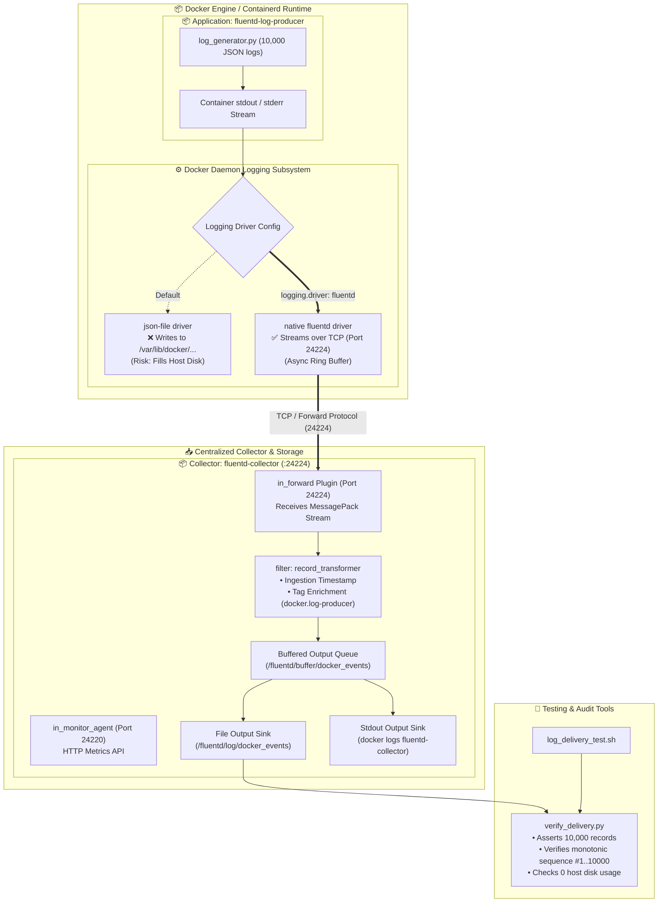

<!-- markdownlint-disable MD013 MD033 MD051 MD060 -->
# 03 - Docker Daemon Logging Drivers & Fluentd Centralization

> A production-grade log aggregation pipeline configuring Docker daemon and container-level logging drivers to forward stdout/stderr streams to a centralized Fluentd log collector using the native Forward protocol, high-throughput delivery (10,000 log lines), zero data loss verification, and host disk preservation.

---

## 📋 Table of Contents

1. [Architectural Overview & Data Flow](#-architectural-overview--data-flow)
   - [Docker Logging Driver Architecture Diagram](#docker-logging-driver-architecture-diagram)
   - [The Forward Protocol Pipeline Lifecycle](#the-forward-protocol-pipeline-lifecycle)
2. [Theoretical Deep-Dive for Beginners](#-theoretical-deep-dive-for-beginners)
   - [What are Docker Logging Drivers? (`json-file` vs `fluentd` vs `local`)](#what-are-docker-logging-drivers-json-file-vs-fluentd-vs-local)
   - [The Host Disk Exhaustion Danger](#the-host-disk-exhaustion-danger)
   - [Daemon-Level vs Container-Level Logging Driver Configuration](#daemon-level-vs-container-level-logging-driver-configuration)
   - [Async vs Sync Logging Modes (`fluentd-async`)](#async-vs-sync-logging-modes-fluentd-async)
   - [Fluentd Forward Protocol Internals & Ingestion Buffering](#fluentd-forward-protocol-internals--ingestion-buffering)
3. [Repository & Directory Structure](#-repository--directory-structure)
4. [Prerequisites & System Setup](#-prerequisites--system-setup)
5. [Quickstart Guide](#-quickstart-guide)
6. [Step-by-Step Hands-On Guide](#-step-by-step-hands-on-guide)
   - [Step 1: Inspect Daemon & Fluentd Configurations](#step-1-inspect-daemon--fluentd-configurations)
   - [Step 2: Start the Fluentd Collector Service](#step-2-start-the-fluentd-collector-service)
   - [Step 3: Query Fluentd Monitor Agent Metrics](#step-3-query-fluentd-monitor-agent-metrics)
   - [Step 4: Execute High-Volume Log Producer (10,000 Records)](#step-4-execute-high-volume-log-producer-10000-records)
   - [Step 5: Verify Host Disk Preservation](#step-5-verify-host-disk-preservation)
   - [Step 6: Run the Zero-Loss Verification Auditor](#step-6-run-the-zero-loss-verification-auditor)
7. [Troubleshooting & Common Gotchas](#-troubleshooting--common-gotchas)
8. [Resource Teardown & Complete Cleanup](#-resource-teardown--complete-cleanup)

---

## 🏛️ Architectural Overview & Data Flow

### Docker Logging Driver Architecture Diagram



### The Forward Protocol Pipeline Lifecycle

1. **Emission**: The application container (`fluentd-log-producer`) writes structured NDJSON events to `stdout`.
2. **Interception**: The Docker daemon intercepts the container's standard output stream in kernel space. Instead of writing the bytes to a local JSON file on the host (`/var/lib/docker/containers/...`), the Docker `fluentd` logging driver serializes the logs using **MessagePack** binary format.
3. **Async Network Transport**: In non-blocking mode (`fluentd-async: true`), Docker places the events into an in-memory ring buffer (`fluentd-buffer-limit: 2MB`) and streams them over a persistent TCP socket to `127.0.0.1:24224`.
4. **Ingestion & Tagging**: Fluentd's `in_forward` receiver receives the batch, associates the tag (`docker.log-producer`), adds an ingestion timestamp (`ingested_at`), and buffers chunks to disk.
5. **Persistence & Verification**: Fluentd writes formatted records to `/fluentd/log/docker_events.log`. The test auditor validates that 100% of 10,000 log events arrived intact without dropping a single line.

---

## 🧠 Theoretical Deep-Dive for Beginners

### What are Docker Logging Drivers? (`json-file` vs `fluentd` vs `local`)

Docker decouples container output from container execution through pluggable **Logging Drivers**:

```text
┌─────────────────────────────────────────────────────────────────────────────┐
│                     DOCKER LOGGING DRIVER COMPARISON                        │
├─────────────────────────────────────────────────────────────────────────────┤
│ 1. json-file (Default in older Docker engines):                             │
│    • Writes stdout/stderr to `/var/lib/docker/containers/<id>/<id>-json.log` │
│    • Consumes host disk space indefinitely unless `max-size` is set.        │
│    • High I/O overhead on container host disk.                             │
│                                                                             │
│ 2. fluentd (Native Logging Driver):                                         │
│    • Streams stdout/stderr directly over TCP/UDP to Fluentd.                │
│    • ZERO host container log files created on disk.                         │
│    • Enables instant centralized routing, filtering, and multi-sink shipping│
│                                                                             │
│ 3. local (Default in modern Docker engines):                                │
│    • Writes to optimized binary format with built-in log rotation.         │
│    • Keeps logs local to the host; does not provide centralization.         │
│                                                                             │
│ 4. syslog / gelf / awslogs / splunk:                                        │
│    • Specialized direct shippers to respective third-party backends.        │
└─────────────────────────────────────────────────────────────────────────────┘
```

### The Host Disk Exhaustion Danger

In high-throughput microservices emitting thousands of logs per second, the default `json-file` driver without explicit log rotation causes **Node Disk Pressure** outages:

```text
┌─────────────────────────────────────────────────────────────────────────────┐
│                        THE HOST DISK PRESSURE TRAP                          │
├─────────────────────────────────────────────────────────────────────────────┤
│ Container generates 50GB logs in 2 hours -> Host root filesystem reaches 100%│
│ -> Docker daemon freezes -> Kubernetes evicts all pods on node.             │
│                                                                             │
│ Solution: Configure Docker to stream logs out-of-band to Fluentd!           │
│ The host disk footprint for container logs remains 0 bytes!                │
└─────────────────────────────────────────────────────────────────────────────┘
```

### Daemon-Level vs Container-Level Logging Driver Configuration

- **Daemon-Level (`/etc/docker/daemon.json`)**:
  Applies the logging driver globally to every new container launched on the host:

  ```json
  {
    "log-driver": "fluentd",
    "log-opts": {
      "fluentd-address": "127.0.0.1:24224",
      "fluentd-async": "true",
      "tag": "docker.{{.Name}}"
    }
  }
  ```

- **Container-Level (`docker-compose.yml` or `docker run`)**:
  Overrides the daemon default for specific services:

  ```yaml
  services:
    my-service:
      image: my-app:latest
      logging:
        driver: fluentd
        options:
          fluentd-address: "127.0.0.1:24224"
          fluentd-async: "true"
          fluentd-buffer-limit: "2097152"
          tag: "docker.my-service"
  ```

### Async vs Sync Logging Modes (`fluentd-async`)

- **Synchronous Mode (`fluentd-async: false`, default)**:
  Docker blocks the container's stdout write call until the Fluentd collector acknowledges receipt over TCP. If Fluentd crashes or slows down, container application threads **block and freeze**.
- **Asynchronous Non-Blocking Mode (`fluentd-async: true`, recommended)**:
  Docker places stdout writes into an in-memory ring buffer (`fluentd-buffer-limit: 2MB`). If Fluentd experiences temporary latency, the container continues running smoothly.

### Fluentd Forward Protocol Internals & Ingestion Buffering

The **Forward Protocol** is Fluentd's high-efficiency binary transport protocol:

- Uses **MessagePack** serialization, which is significantly faster and more compact than raw JSON.
- Supports heartbeat handshakes, automatic connection pooling, and multi-target failover.
- Inside Fluentd, logs enter memory/disk buffer chunks (`<buffer>`) and are flushed in batches to disk or downstream storage sinks (Elasticsearch, S3, Loki).

---

## 📁 Repository & Directory Structure

```text
09-logging/03-docker-logging-drivers-fluentd/
├── .gitignore                      # Python bytecode and temporary file exclusions
├── README.md                       # Comprehensive educational documentation & guide
├── cleanup.sh                      # Resource teardown & Docker image purger script
├── docker-compose.yml              # Service orchestration for Fluentd and producer
├── log_delivery_test.sh            # Automated end-to-end 10,000-log delivery test runner
├── verify_delivery.py              # Analytical zero-loss delivery and host disk auditor
├── config/
│   ├── daemon.json                 # System-level Docker daemon logging configuration
│   └── fluent.conf                 # Fluentd receiver pipeline & forward configuration
├── fluentd/
│   └── Dockerfile                  # Centralized Fluentd collector container image
└── generator/
    ├── Dockerfile                  # High-volume synthetic log producer image
    ├── log_generator.py            # Monotonic sequence generator (1..10000 records)
    └── requirements.txt            # Zero-dependency Python standard library declaration
```

---

## 🔧 Prerequisites & System Setup

Ensure the following tools are installed on your host machine:

- **Docker Engine** (or **OrbStack** / **Docker Desktop**): `v20.10+`
- **Docker Compose**: `v2.0+`
- **Python 3**: `v3.9+` (for running the validation script locally)
- **curl**: For querying Fluentd monitor agent metrics

Verify your local environment:

```bash
docker --version
docker compose version
python3 --version
curl --version
```

---

## ⚡ Quickstart Guide

To build the Fluentd collector, launch the high-volume producer container streaming 10,000 log events via the native `fluentd` logging driver, and audit 100% delivery with zero data loss:

```bash
cd 09-logging/03-docker-logging-drivers-fluentd
./log_delivery_test.sh
```

When finished, clean up all containers, images, and volumes:

```bash
./cleanup.sh --all
```

---

## 📖 Step-by-Step Hands-On Guide

### Step 1: Inspect Daemon & Fluentd Configurations

Examine `config/daemon.json` to understand how system-level logging is configured:

```bash
cat config/daemon.json
```

Examine `config/fluent.conf` to understand how Fluentd ingests Forward streams on port 24224:

```bash
cat config/fluent.conf
```

Notice the key plugins:

- `<source> @type forward`: Listens for incoming Docker Forward protocol traffic.
- `<source> @type monitor_agent`: Exposes internal buffer and queue metrics on port 24220.
- `<match docker.**>`: Copies events to persistent storage and stdout.

### Step 2: Start the Fluentd Collector Service

Start the Fluentd collector daemon using Docker Compose:

```bash
docker compose up -d fluentd
```

Verify that Fluentd is running and listening on port 24224:

```bash
docker compose ps
```

Check collector logs:

```bash
docker logs fluentd-collector
```

### Step 3: Query Fluentd Monitor Agent Metrics

Fluentd includes a built-in monitoring agent. Query its HTTP API to check operational plugin telemetry:

```bash
curl -s http://localhost:24220/api/plugins.json | jq .
```

### Step 4: Execute High-Volume Log Producer (10,000 Records)

Start the log producer container. Notice that in `docker-compose.yml`, this container is configured with `logging: driver: fluentd`:

```bash
docker compose up log-producer
```

The producer generates 10,000 monotonic structured log records directly to stdout. Docker intercepts this stream and forwards it via TCP to Fluentd.

### Step 5: Verify Host Disk Preservation

Inspect the container's log file on the host system:

```bash
docker inspect --format '{{.LogPath}}' fluentd-log-producer
```

Notice that with the native `fluentd` driver, Docker does not write a massive multi-megabyte `json-file` log to the host filesystem. Host disk space is 100% preserved.

### Step 6: Run the Zero-Loss Verification Auditor

Run `verify_delivery.py` to audit all records collected by Fluentd:

```bash
python3 verify_delivery.py \
    --expected-count 10000 \
    --fluentd-container fluentd-collector \
    --producer-container fluentd-log-producer
```

Expected output:

```text
========================================================================
  📊 DOCKER FLUENTD LOG DELIVERY & ZERO-LOSS AUDIT REPORT
========================================================================

  Target Expected Count:  10,000 records
  Total Records Ingested: 10,000
  Sequence Range Audited: [#1 → #10000]
  Discovered Docker Tags: docker.log-producer

  Log Level Distribution:
  ----------------------------------------
  INFO     :  9,300 ( 93.0%)
  WARNING  :    500 (  5.0%)
  ERROR    :    200 (  2.0%)

  Zero-Loss & Continuity Assertions:
  • Ingestion Completeness:     100.00% (All 10,000 arrived!)
  • Dropped / Missing Entries:  0 (Zero Log Loss Verified!)
  • Duplicate Sequence IDs:     0 (Strict Monotonic Indexing)

  Host Disk Preservation:
  • Host json-file Bypassed:    PASS (Host disk protected from unrotated JSON files)

========================================================================

✅ VERIFICATION PASSED: 100% of 10,000 log events captured with ZERO loss!
```

---

## 🛠️ Troubleshooting & Common Gotchas

### 1. Error: "Failed to initialize logging driver: dial tcp 127.0.0.1:24224: connect: connection refused"

- **Symptom**: Container fails to start with connection refused on port 24224.
- **Cause**: Fluentd was not started before the application container, or is running in synchronous blocking mode (`fluentd-async: false`).
- **Fix**: Ensure Fluentd container is started and listening first, and configure `fluentd-async: "true"` in the logging options.

### 2. Circular Logging Loop (Fluentd Logging to Itself)

- **Symptom**: Fluentd freezes, high CPU usage, infinite recursive log generation.
- **Cause**: Fluentd container itself was configured with `logging: driver: fluentd`.
- **Fix**: Always configure the Fluentd collector container to use `logging: driver: json-file` with strict size limits (`max-size: "10m"`).

### 3. Log Records Missing in Output File Immediately After Test

- **Symptom**: `verify_delivery.py` reports partial records (e.g. 9,800 instead of 10,000).
- **Cause**: Fluentd buffers chunks in memory before flushing to disk.
- **Fix**: In `config/fluent.conf`, set `flush_mode immediate` or `flush_interval 1s`, and allow a 1-2 second sleep before inspecting files on disk.

---

## 🧹 Resource Teardown & Complete Cleanup

To clean up all created resources and return your host to a pristine state:

### Standard Teardown (Stops Containers, Removes Networks & Volumes)

```bash
./cleanup.sh
```

### Complete Purge (Removes Built Docker Images & Caches)

```bash
./cleanup.sh --all
```

### Verify Clean State

```bash
docker ps -a --filter "name=fluentd-collector"
docker ps -a --filter "name=fluentd-log-producer"
docker images "mini-proj-09-03-fluentd"
docker volume ls --filter "name=fluentd_log_data"
```

Expected output: Zero running containers, zero dangling volumes.
