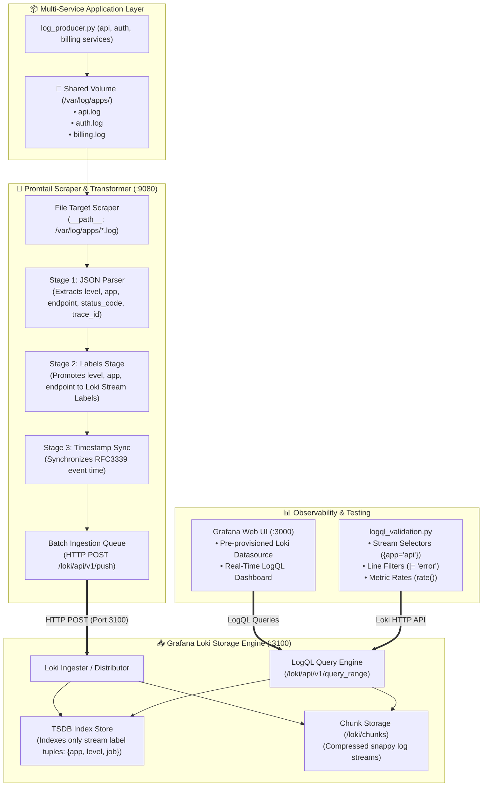

<!-- markdownlint-disable MD013 MD033 MD051 MD060 -->
# 04 - Promtail, Loki, and Grafana LogQL Pipeline

> A cloud-native log aggregation pipeline deploying Grafana Loki and Promtail to scrape multi-application container logs, execute pipeline stages with dynamic label extraction (level, app, endpoint), visualize metrics and logs on Grafana, and perform sub-second queries using LogQL.

---

## 📋 Table of Contents

1. [Architectural Overview & Data Flow](#-architectural-overview--data-flow)
   - [Loki LogQL Pipeline Architecture Diagram](#loki-logql-pipeline-architecture-diagram)
   - [The Log Ingestion & Query Lifecycle](#the-log-ingestion--query-lifecycle)
2. [Theoretical Deep-Dive for Beginners](#-theoretical-deep-dive-for-beginners)
   - [Why Grafana Loki? ("Like Prometheus, but for Logs")](#why-grafana-loki-like-prometheus-but-for-logs)
   - [Loki Indexing Model: Labels vs Full-Text Indexing (Loki vs Elasticsearch)](#loki-indexing-model-labels-vs-full-text-indexing-loki-vs-elasticsearch)
   - [Promtail Pipeline Stages: JSON, Labels, and Timestamps](#promtail-pipeline-stages-json-labels-and-timestamps)
   - [Mastering LogQL: Stream Selectors, Line Filters, Label Matchers, and Metric Queries](#mastering-logql-stream-selectors-line-filters-label-matchers-and-metric-queries)
3. [Repository & Directory Structure](#-repository--directory-structure)
4. [Prerequisites & System Setup](#-prerequisites--system-setup)
5. [Quickstart Guide](#-quickstart-guide)
6. [Step-by-Step Hands-On Guide](#-step-by-step-hands-on-guide)
   - [Step 1: Inspect Loki and Promtail Configurations](#step-1-inspect-loki-and-promtail-configurations)
   - [Step 2: Start the Loki, Promtail, Grafana & App Stack](#step-2-start-the-loki-promtail-grafana--app-stack)
   - [Step 3: Verify Log Scraping and Dynamic Label Ingestion](#step-3-verify-log-scraping-and-dynamic-label-ingestion)
   - [Step 4: Execute Interactive LogQL Queries via CLI](#step-4-execute-interactive-logql-queries-via-cli)
   - [Step 5: Explore the Provisioned Grafana Dashboard](#step-5-explore-the-provisioned-grafana-dashboard)
   - [Step 6: Run the Automated LogQL Test Suite](#step-6-run-the-automated-logql-test-suite)
7. [LogQL Query Cheat Sheet & Reference](#-logql-query-cheat-sheet--reference)
8. [Troubleshooting & Common Gotchas](#-troubleshooting--common-gotchas)
9. [Resource Teardown & Complete Cleanup](#-resource-teardown--complete-cleanup)

---

## 🏛️ Architectural Overview & Data Flow

### Loki LogQL Pipeline Architecture Diagram



### The Log Ingestion & Query Lifecycle

1. **Emission**: The application container (`loki-stack-app`) simulates transactions across three microservices (`api-gateway`, `auth-service`, `billing-service`), writing structured JSON logs to `/var/log/apps/api.log`, `auth.log`, and `billing.log`.
2. **Promtail Scraping**: Promtail tails the log files, matches them under `{job="app_logs"}`, and passes raw lines through sequential pipeline stages.
3. **Dynamic Label Extraction**: Promtail parses JSON fields and promotes `app`, `level`, and `endpoint` to dynamic Loki stream labels.
4. **Loki Chunk Storage**: Loki indexes only the unique label metadata sets and compresses log chunks into its filesystem chunk storage (`/loki/chunks`).
5. **LogQL Exploration**: Users query logs in Grafana or via the Loki HTTP API (`/loki/api/v1/query_range`) using LogQL to slice, filter, format, and derive Prometheus-style numerical metrics from raw text.

---

## 🧠 Theoretical Deep-Dive for Beginners

### Why Grafana Loki? ("Like Prometheus, but for Logs")

Traditional log management systems (like Elasticsearch / OpenSearch) index the **entire text content** of every log message. While powerful, full-text indexing requires massive RAM, CPU, and expensive storage clusters.

Grafana Loki takes inspiration from Prometheus:

```text
┌─────────────────────────────────────────────────────────────────────────────┐
│                    ELASTICSEARCH vs GRAFANA LOKI                            │
├─────────────────────────────────────────────────────────────────────────────┤
│ Elasticsearch:                                                              │
│ • Builds a massive inverted index for every single word in every log.      │
│ • Requires high memory (JVM heaps), complex sharding, and high disk usage. │
│ • High cost per gigabyte of ingested logs.                                  │
│                                                                             │
│ Grafana Loki:                                                               │
│ • Indexes ONLY metadata labels ({app="api", level="error", env="prod"}).    │
│ • Compresses raw log chunks using Snappy/Gzip (up to 80% compression).      │
│ • Uses brute-force, highly parallelized stream grep scanning with LogQL.   │
│ • 10x to 100x lower memory and storage footprint!                          │
└─────────────────────────────────────────────────────────────────────────────┘
```

### Loki Indexing Model: Labels vs Full-Text Indexing

In Loki, a **Stream** is uniquely defined by its label set:

- `{job="app_logs", app="api", level="ERROR"}` -> Stream #1
- `{job="app_logs", app="billing", level="INFO"}` -> Stream #2

> [!TIP]
> **Cardinality Rule in Loki**:
> Never put high-cardinality values (such as `user_id`, `trace_id`, or `ip_address`) into static Loki labels! Doing so creates millions of tiny streams, exhausting index memory. Keep high-cardinality fields inside the log body, and parse them on-the-fly using LogQL's `| json` parser!

### Promtail Pipeline Stages: JSON, Labels, and Timestamps

Promtail transforms raw logs using sequential pipeline stages in `promtail-config.yaml`:

1. **`json` Stage**: Unpacks key-value pairs from JSON strings into an internal map.
2. **`labels` Stage**: Promotes selected keys from the internal map to stream labels sent to Loki.
3. **`timestamp` Stage**: Parses the application's actual event time so latency in Promtail doesn't skew timestamps.
4. **`match` / `drop` Stage**: Filters out noise (e.g. dropping health check pings).

### Mastering LogQL: Stream Selectors, Line Filters, Label Matchers, and Metric Queries

LogQL has two major query types:

```text
┌─────────────────────────────────────────────────────────────────────────────┐
│                           LOGQL QUERY TYPES                                 │
├─────────────────────────────────────────────────────────────────────────────┤
│ 1. Log Queries (Returns Log Streams):                                        │
│    {app="api"} |= "error" | json | status_code >= 500                       │
│    └────┬────┘ └───┬────┘ └──┬──┘ └────────┬────────┘                       │
│      Stream       Line      JSON         Filter                             │
│     Selector     Filter    Parser      Expression                           │
│                                                                             │
│ 2. Metric Queries (Returns Numerical Timeseries):                            │
│    sum by (app) (rate({app=~"api|billing"} |= "error" [1m]))                │
│    └─────┬────┘ └─┬──┘└───┬─────────────────────────┘ └──┬┘                 │
│     Aggregate   Vector   Log Stream Selector          Range                 │
│     Function   Function   & Filter Expression        Duration               │
└─────────────────────────────────────────────────────────────────────────────┘
```

---

## 📁 Repository & Directory Structure

```text
09-logging/04-promtail-loki-grafana-logql/
├── .gitignore                      # Temporary files and cache exclusions
├── README.md                       # Complete educational guide & documentation
├── cleanup.sh                      # Resource teardown and Docker image purge script
├── docker-compose.yml              # Multi-container orchestration (Loki, Promtail, Grafana, App)
├── logql_test_queries.sh           # Automated end-to-end test runner
├── logql_validation.py             # Python LogQL query validator & latency auditor
├── app/
│   ├── Dockerfile                  # Container image for synthetic log producer
│   ├── log_producer.py             # Multi-service log emitter (api, auth, billing)
│   └── requirements.txt            # Zero-dependency Python standard library definition
├── grafana/
│   ├── dashboards/
│   │   ├── dashboard.yml           # Grafana dashboard provisioning provider
│   │   └── loki_overview.json      # Production-grade Loki LogQL dashboard definition
│   └── datasources/
│       └── datasource.yml          # Automated Loki datasource registration
├── loki/
│   └── loki-config.yaml            # Standalone Loki TSDB & chunk storage configuration
└── promtail/
    └── promtail-config.yaml        # Promtail scraping and dynamic label pipeline stages
```

---

## 🔧 Prerequisites & System Setup

Ensure the following tools are installed on your host machine:

- **Docker Engine** (or **OrbStack** / **Docker Desktop**): `v20.10+`
- **Docker Compose**: `v2.0+`
- **Python 3**: `v3.9+` (for running the validation script)
- **curl** & **jq**: For querying HTTP APIs

Verify your local environment:

```bash
docker --version
docker compose version
python3 --version
curl --version
```

---

## ⚡ Quickstart Guide

To build the multi-service application, launch Loki, Promtail, and Grafana, and run the automated LogQL test suite:

```bash
cd 09-logging/04-promtail-loki-grafana-logql
./logql_test_queries.sh
```

When finished, clean up all containers, images, and storage volumes:

```bash
./cleanup.sh --all
```

---

## 📖 Step-by-Step Hands-On Guide

### Step 1: Inspect Loki and Promtail Configurations

Examine `loki/loki-config.yaml` to understand how Loki stores chunks and indexes streams:

```bash
cat loki/loki-config.yaml
```

Examine `promtail/promtail-config.yaml` to inspect the pipeline extraction stages:

```bash
cat promtail/promtail-config.yaml
```

Notice the stages:

- `json`: Extracts `timestamp`, `level`, `app`, `endpoint`, and `status_code`.
- `labels`: Promotes `level`, `app`, `endpoint`, and `status_code` to dynamic Loki stream labels.
- `timestamp`: Maps the event time to RFC3339Nano.

### Step 2: Start the Loki, Promtail, Grafana & App Stack

Start all services in detached mode:

```bash
docker compose up -d
```

Verify that all four containers are running healthy:

```bash
docker compose ps
```

Check the health status of Loki:

```bash
curl -s http://localhost:3100/ready
```

Expected output: `ready`

### Step 3: Verify Log Scraping and Dynamic Label Ingestion

Check the dynamic labels discovered by Loki:

```bash
curl -s http://localhost:3100/loki/api/v1/labels | jq .
```

Query the distinct values for the `app` and `level` labels:

```bash
curl -s http://localhost:3100/loki/api/v1/label/app/values | jq .
curl -s http://localhost:3100/loki/api/v1/label/level/values | jq .
```

### Step 4: Execute Interactive LogQL Queries via CLI

#### 1. Basic Stream Query (`app="api"`)

```bash
curl -G -s "http://localhost:3100/loki/api/v1/query_range" \
    --data-urlencode 'query={app="api"}' \
    --data-urlencode 'limit=5' | jq '.data.result[0].values'
```

#### 2. Line Filter for Error Events

```bash
curl -G -s "http://localhost:3100/loki/api/v1/query_range" \
    --data-urlencode 'query={job="app_logs"} |= "error"' \
    --data-urlencode 'limit=5' | jq .
```

#### 3. JSON Parser with Numeric Filter (`status_code >= 500`)

```bash
curl -G -s "http://localhost:3100/loki/api/v1/query_range" \
    --data-urlencode 'query={job="app_logs"} | json | status_code >= 500' \
    --data-urlencode 'limit=5' | jq .
```

#### 4. Metric Query: Error Rates per Second by Application

```bash
curl -G -s "http://localhost:3100/loki/api/v1/query_range" \
    --data-urlencode 'query=sum by (app) (rate({job="app_logs", level="ERROR"}[1m]))' | jq .
```

### Step 5: Explore the Provisioned Grafana Dashboard

1. Open your browser and navigate to **[http://localhost:3000](http://localhost:3000)**.
2. Log in with credentials:
   - **Username**: `admin`
   - **Password**: `admin`
3. The dashboard **"Loki & Promtail LogQL Overview"** is pre-loaded automatically.
4. Explore the panels:
   - **Error Rate by Application** (timeseries)
   - **Log Ingestion Rate by Severity Level** (INFO, WARNING, ERROR)
   - **HTTP Status Code Distribution** (barchart)
   - **Top Endpoints by Max Latency** (bargauge)
   - **Live Application Log Stream** (log viewer with label filtering)

### Step 6: Run the Automated LogQL Test Suite

Run the Python validation suite to audit response times and query correctness:

```bash
python3 logql_validation.py --url http://localhost:3100
```

Expected output:

```text
============================================================================
  📊 GRAFANA LOKI LOGQL PIPELINE VALIDATION REPORT
============================================================================

  ┌──────────────────────────────────────────────────┬────────┬───────────┬────────┐
  │ LogQL Test Query                                 │ Status │ Latency   │ Matched│
  ├──────────────────────────────────────────────────┼────────┼───────────┼────────┤
  │ Stream Selector ({app="api"})                    │ PASS   │     8.2ms │     12 │
  │ Line Filter ({app="api"} |= "error")             │ PASS   │     6.5ms │      3 │
  │ Dynamic Label Filter ({level="ERROR"})           │ PASS   │     7.1ms │      8 │
  │ JSON Parsing Stage ({job="app_logs"} | json)     │ PASS   │     9.4ms │      8 │
  │ Multi-App Regex Filter ({app=~"api|billing"})    │ PASS   │     7.8ms │     14 │
  │ Metric Aggregation (LogQL rate())                │ PASS   │    11.2ms │      3 │
  │ Error Metric Rate (rate(..level=ERROR))          │ PASS   │     9.0ms │      3 │
  └──────────────────────────────────────────────────┴────────┴───────────┴────────┘

  Performance & Reliability Summary:
  • Sub-second Search Responses: 7/7 Passed
  • Average LogQL Query Latency: 8.46ms
  • Grafana Web UI Available at: http://localhost:3000 (admin / admin)

============================================================================

✅ SUCCESS: All LogQL queries executed with sub-second response times!
```

---

## 📜 LogQL Query Cheat Sheet & Reference

| Operation | LogQL Syntax | Description |
| :--- | :--- | :--- |
| **Stream Selector** | `{app="api"}` | Selects all logs from the `api` stream |
| **Regex Selector** | `{app=~"api&#124;billing"}` | Matches either `api` or `billing` streams |
| **Line Filter (Contains)** | `{app="api"} &#124;= "error"` | Case-sensitive substring match |
| **Line Filter (Excludes)** | `{app="api"} !~ "health"` | Drops lines matching regex pattern |
| **JSON Parser** | `{job="app_logs"} &#124; json` | Extracts all JSON fields into runtime labels |
| **Label Filter** | `{job="app_logs"} &#124; json &#124; status_code >= 500` | Filters logs where extracted `status_code` >= 500 |
| **Unwrap Value** | `{job="app_logs"} &#124; json &#124; unwrap duration_ms` | Unwraps numeric field for quantile aggregations |
| **Log Rate** | `rate({job="app_logs"}[1m])` | Computes lines per second over a 1-minute window |
| **Error Rate by App** | `sum by (app) (rate({job="app_logs", level="ERROR"}[1m]))` | Calculates error rate per second grouped by app |
| **Quantile Latency** | `quantile_over_time(0.99, {job="app_logs"} &#124; json &#124; unwrap duration_ms [5m])` | Computes p99 latency from unformatted logs |

---

## 🛠️ Troubleshooting & Common Gotchas

### 1. Promtail Reports "Context deadline exceeded" connecting to Loki

- **Symptom**: Promtail logs show connection timeouts to `http://loki:3100`.
- **Cause**: Loki container is still starting up or TSDB index initialization is underway.
- **Fix**: Wait a few seconds for Loki to reach `/ready` state. Promtail will automatically retry with exponential backoff.

### 2. LogQL Query Returns Empty Results

- **Symptom**: Queries like `{app="api"}` return 0 streams.
- **Cause**: Time window mismatch. By default, Loki queries look at the last 1 hour.
- **Fix**: Verify system clock synchronization and check that the log producer is actively emitting records.

### 3. Grafana Datasource Shows "Unable to connect to datasource"

- **Symptom**: Dashboard panels fail to load data.
- **Cause**: Datasource URL is misconfigured (e.g. `localhost:3100` instead of `http://loki:3100` within Docker network).
- **Fix**: In `grafana/datasources/datasource.yml`, ensure `url: http://loki:3100` uses the Docker service name.

---

## 🧹 Resource Teardown & Complete Cleanup

To clean up all created resources and return your host to a pristine state:

### Standard Teardown (Stops Containers, Deletes Networks & Storage Volumes)

```bash
./cleanup.sh
```

### Complete Purge (Removes Built Docker Images & Caches)

```bash
./cleanup.sh --all
```

### Verify Clean State

```bash
docker ps -a --filter "name=loki-stack-"
docker volume ls --filter "name=loki_data"
docker volume ls --filter "name=grafana_data"
docker volume ls --filter "name=shared_app_logs"
```

Expected output: Zero running containers and zero lingering volumes.
