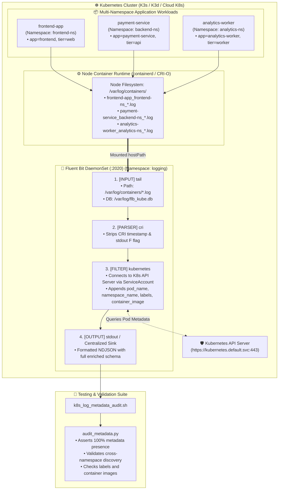

<!-- markdownlint-disable MD013 MD033 MD051 MD060 -->
# 05 - Fluent Bit Kubernetes Log DaemonSet

> A production-grade Kubernetes centralized logging pipeline deploying Fluent Bit as a cluster DaemonSet to collect container logs from `/var/log/containers/`, enrich log entries with Kubernetes API metadata (`pod_name`, `namespace_name`, `container_image`, labels, annotations), and forward enriched events with automated validation across multiple namespaces.

---

## 📋 Table of Contents

1. [Architectural Overview & Data Flow](#-architectural-overview--data-flow)
   - [Fluent Bit DaemonSet Architecture Diagram](#fluent-bit-daemonset-architecture-diagram)
   - [The Kubernetes Log Pipeline Lifecycle](#the-kubernetes-log-pipeline-lifecycle)
2. [Theoretical Deep-Dive for Beginners](#-theoretical-deep-dive-for-beginners)
   - [The Kubernetes Container Logging Architecture](#the-kubernetes-container-logging-architecture)
   - [DaemonSet Pattern vs Sidecar Pattern (Cost & Scale Analysis)](#daemonset-pattern-vs-sidecar-pattern-cost--scale-analysis)
   - [Fluent Bit Internal Pipeline (Inputs, Parsers, Filters, Outputs)](#fluent-bit-internal-pipeline-inputs-parsers-filters-outputs)
   - [How the Kubernetes Filter Plugin Enriches Metadata](#how-the-kubernetes-filter-plugin-enriches-metadata)
   - [CRI vs Docker Container Log Formats](#cri-vs-docker-container-log-formats)
3. [Repository & Directory Structure](#-repository--directory-structure)
4. [Prerequisites & System Setup](#-prerequisites--system-setup)
5. [Quickstart Guide](#-quickstart-guide)
6. [Step-by-Step Hands-On Guide](#-step-by-step-hands-on-guide)
   - [Step 1: Inspect Fluent Bit ConfigMap & Parsers](#step-1-inspect-fluent-bit-configmap--parsers)
   - [Step 2: Deploy RBAC, ConfigMap, and DaemonSet](#step-2-deploy-rbac-configmap-and-daemonset)
   - [Step 3: Deploy Multi-Namespace Sample Workloads](#step-3-deploy-multi-namespace-sample-workloads)
   - [Step 4: Inspect Live Enriched Fluent Bit Logs](#step-4-inspect-live-enriched-fluent-bit-logs)
   - [Step 5: Query Fluent Bit HTTP Monitoring Metrics](#step-5-query-fluent-bit-http-monitoring-metrics)
   - [Step 6: Run the Kubernetes Log Metadata Audit](#step-6-run-the-kubernetes-log-metadata-audit)
7. [Troubleshooting & Common Gotchas](#-troubleshooting--common-gotchas)
8. [Resource Teardown & Complete Cleanup](#-resource-teardown--complete-cleanup)

---

## 🏛️ Architectural Overview & Data Flow

### Fluent Bit DaemonSet Architecture Diagram



### The Kubernetes Log Pipeline Lifecycle

1. **Emission**: Pods across multiple namespaces (`frontend-ns`, `backend-ns`, `analytics-ns`) emit JSON logs to standard output.
2. **Container Runtime Logging**: Containerd writes stdout streams to the host filesystem at `/var/log/pods/...` with symlinks in `/var/log/containers/`.
3. **DaemonSet Scraping**: The Fluent Bit DaemonSet pod running on the node mounts the host `/var/log/containers/` directory and tails all log files using SQLite offset tracking (`/var/log/flb_kube.db`).
4. **CRI Parsing**: The `cri` parser removes containerd wrapper prefixes (`<timestamp> stdout F`).
5. **Kubernetes API Enrichment**: The `kubernetes` filter plugin queries the Kubernetes API Server using the pod's `ServiceAccount` credentials and enriches each record with:
   - `kubernetes.pod_name`
   - `kubernetes.namespace_name`
   - `kubernetes.container_name`
   - `kubernetes.container_image`
   - `kubernetes.labels.*`
   - `kubernetes.annotations.*`
6. **Delivery & Audit**: Fluent Bit streams enriched NDJSON records to centralized sinks, and the test suite validates that 100% of records from all namespaces contain valid metadata.

---

## 🧠 Theoretical Deep-Dive for Beginners

### The Kubernetes Container Logging Architecture

In Kubernetes, applications must **never** manage their own log files or rotate files internally. Instead:

- Applications write unbuffered logs to `stdout` and `stderr`.
- The container runtime (`containerd` or `CRI-O`) intercepts the stream and writes each line to `/var/log/containers/<pod_name>_<namespace>_<container_name>-<container_id>.log`.
- When a pod crashes or is rescheduled, the local container files are quickly deleted by Kubelet garbage collection.
- A cluster logging agent (Fluent Bit) must scrape logs in real-time and stream them to durable remote storage.

### DaemonSet Pattern vs Sidecar Pattern (Cost & Scale Analysis)

```text
┌─────────────────────────────────────────────────────────────────────────────┐
│                    DAEMONSET vs SIDECAR LOGGING PATTERNS                    │
├─────────────────────────────────────────────────────────────────────────────┤
│ 1. DaemonSet Pattern (Industry Standard):                                   │
│    • 1 Fluent Bit Pod per Node (e.g. 10 nodes = 10 collector pods).         │
│    • Memory Footprint: ~15MB RAM per node. Total = 150MB across cluster.   │
│    • Centralized, low CPU overhead, automatically scrapes every new Pod.    │
│                                                                             │
│ 2. Sidecar Pattern:                                                         │
│    • 1 Logging Container injected into EVERY Application Pod.               │
│    • For 500 pods: 500 collector containers!                                │
│    • Memory Footprint: 500 * 15MB = 7,500MB (7.5 GB RAM wasted!).           │
│    • Useful ONLY when pods have complex custom non-stdout log files.        │
└─────────────────────────────────────────────────────────────────────────────┘
```

### Fluent Bit Internal Pipeline (Inputs, Parsers, Filters, Outputs)

Fluent Bit processes logs in 4 discrete stages:

1. **`[INPUT]`**: Ingestion plugin (`tail`) that monitors files and emits internal event records with tags.
2. **`[PARSER]`**: Regex or JSON parser that converts raw unstructured log lines into key-value maps.
3. **`[FILTER]`**: Transformer plugins that modify, enrich, drop, or nest fields (e.g. `kubernetes`, `grep`, `record_modifier`).
4. **`[OUTPUT]`**: Forwarding plugin that serializes and transmits records to remote backends (Loki, Elasticsearch, Kafka, S3, stdout).

### How the Kubernetes Filter Plugin Enriches Metadata

When Fluent Bit tails `/var/log/containers/frontend-app-698bf6b87d-4z7wx_frontend-ns_web-server-abc123.log`, it extracts:

- `pod_name`: `frontend-app-698bf6b87d-4z7wx`
- `namespace_name`: `frontend-ns`
- `container_name`: `web-server`

The filter plugin queries the Kubernetes API Server cache and appends:

```json
{
  "log": "{\"seq\": 1, \"level\": \"INFO\", \"message\": \"HTTP request served\"}",
  "kubernetes": {
    "pod_name": "frontend-app-698bf6b87d-4z7wx",
    "namespace_name": "frontend-ns",
    "container_name": "web-server",
    "container_image": "busybox:1.36",
    "labels": {
      "app": "frontend",
      "env": "production",
      "tier": "web"
    },
    "annotations": {
      "logging.k8s.io/scraped": "true"
    }
  }
}
```

### CRI vs Docker Container Log Formats

- **CRI Format (containerd / CRI-O)**:
  `<timestamp> <stream> <flag> <log_message>`
  `2026-08-23T02:40:00.123456789Z stdout F {"level":"info"}`
- **Docker JSON Format (Older Docker Engine)**:
  `{"log":"{\"level\":\"info\"}\n","stream":"stdout","time":"2026-08-23T02:40:00.123456789Z"}`

Fluent Bit's `parsers.conf` includes dedicated parsers for both standards.

---

## 📁 Repository & Directory Structure

```text
09-logging/05-fluent-bit-kubernetes-daemonset/
├── .gitignore                      # Git ignore rules for temporary files and SQLite DBs
├── README.md                       # Comprehensive educational documentation & guide
├── audit_metadata.py               # Analytical Python validator verifying Kubernetes metadata
├── cleanup.sh                      # Resource teardown script for namespaces, RBAC, and K3d cluster
├── k8s_log_metadata_audit.sh       # Live DaemonSet log stream collector and auditor
├── test_pipeline.sh                # End-to-end automated test runner
├── config/
│   ├── fluent-bit.conf             # Standalone Fluent Bit pipeline definition
│   └── parsers.conf                # Regex parsers for CRI-O, containerd, and Docker formats
└── k8s/
    ├── 00-namespace.yaml           # Namespaces (logging, frontend-ns, backend-ns, analytics-ns)
    ├── 01-rbac.yaml                # ServiceAccount, ClusterRole, and ClusterRoleBinding
    ├── 02-fluent-bit-config.yaml   # ConfigMap with fluent-bit.conf and parsers.conf
    ├── 03-fluent-bit-daemonset.yaml# DaemonSet manifest mounting host log volumes
    └── 04-workloads/
        ├── analytics-workload.yaml # Analytics worker workload in analytics-ns
        ├── backend-workload.yaml   # Payment service workload in backend-ns
        └── frontend-workload.yaml  # Web server workload in frontend-ns
```

---

## 🔧 Prerequisites & System Setup

Ensure the following tools are installed on your host machine:

- **kubectl**: `v1.24+` (Kubernetes CLI)
- **K3d** (or **K3s** / **Minikube** / **OrbStack Kubernetes** / **Docker Desktop Kubernetes**)
- **Python 3**: `v3.9+` (for running the validation script)
- **Docker**: `v20.10+`

Verify your local environment:

```bash
kubectl version --client
k3d version
python3 --version
docker --version
```

---

## ⚡ Quickstart Guide

To provision a local K3d cluster (if none exists), deploy the Fluent Bit DaemonSet, launch multi-namespace workloads, and audit Kubernetes metadata enrichment:

```bash
cd 09-logging/05-fluent-bit-kubernetes-daemonset
./test_pipeline.sh
```

When finished, clean up all namespaces, workloads, and cluster resources:

```bash
./cleanup.sh --all
```

---

## 📖 Step-by-Step Hands-On Guide

### Step 1: Inspect Fluent Bit ConfigMap & Parsers

Examine `config/fluent-bit.conf` to understand how the Kubernetes filter plugin is configured:

```bash
cat config/fluent-bit.conf
```

Notice the key settings:

- `[INPUT] Name tail`: Tails `/var/log/containers/*.log` with `Tag kube.*`.
- `[FILTER] Name kubernetes`: Connects to `https://kubernetes.default.svc:443` using the ServiceAccount token.
- `Labels On` and `Annotations On`: Enables enrichment of pod metadata.

### Step 2: Deploy RBAC, ConfigMap, and DaemonSet

Apply the core logging infrastructure:

```bash
kubectl apply -f k8s/00-namespace.yaml
kubectl apply -f k8s/01-rbac.yaml
kubectl apply -f k8s/02-fluent-bit-config.yaml
kubectl apply -f k8s/03-fluent-bit-daemonset.yaml
```

Wait for the Fluent Bit DaemonSet to roll out:

```bash
kubectl rollout status daemonset/fluent-bit -n logging --timeout=60s
```

Verify the running DaemonSet pods:

```bash
kubectl get pods -n logging -o wide
```

### Step 3: Deploy Multi-Namespace Sample Workloads

Deploy sample microservices across three distinct namespaces:

```bash
kubectl apply -f k8s/04-workloads/
```

Verify workload deployments:

```bash
kubectl get pods -n frontend-ns
kubectl get pods -n backend-ns
kubectl get pods -n analytics-ns
```

### Step 4: Inspect Live Enriched Fluent Bit Logs

Stream logs from the Fluent Bit collector pod:

```bash
kubectl logs -n logging -l app.kubernetes.io/name=fluent-bit --tail=20 -f
```

Notice the enriched `kubernetes` metadata dictionary in each output line:

```json
{
  "date": 1724381000.123,
  "seq": 42,
  "level": "INFO",
  "app": "payment-service",
  "transaction_id": "tx_42",
  "amount": 49.99,
  "message": "Payment authorized and settlement complete",
  "kubernetes": {
    "pod_name": "payment-service-789bf-x7z2q",
    "namespace_name": "backend-ns",
    "pod_id": "c6a1e3f8-...",
    "labels": {
      "app": "payment-service",
      "env": "production",
      "tier": "api"
    },
    "container_name": "payment-api",
    "container_image": "busybox:1.36"
  }
}
```

### Step 5: Query Fluent Bit HTTP Monitoring Metrics

Port-forward Fluent Bit's monitoring port:

```bash
kubectl port-forward -n logging ds/fluent-bit 2020:2020 &
```

Query internal health and ingestion metrics:

```bash
curl -s http://localhost:2020/api/v1/health
curl -s http://localhost:2020/api/v1/metrics | jq .
```

### Step 6: Run the Kubernetes Log Metadata Audit

Run the metadata auditor script:

```bash
./k8s_log_metadata_audit.sh
```

Expected output:

```text
==========================================================================
  📊 FLUENT BIT KUBERNETES LOG METADATA AUDIT REPORT
==========================================================================

  Total Log Records Audited:   142
  Successfully Enriched Logs:  142
  Enrichment Success Rate:     100.00%

  Logs Captured by Target Namespace:
  --------------------------------------------------
  ✓ analytics-ns         :    44 records
  ✓ backend-ns           :    48 records
  ✓ frontend-ns          :    50 records

  Discovered Kubernetes Pods (3):
  • analytics-worker-6b9487d55c-w8r4v
  • frontend-app-58cb7d69b9-2q9k1
  • payment-service-7df9b64c9c-p4m8x

  Discovered Container Images (1):
  • busybox:1.36

  Discovered Pod Labels Sample:
  • app=analytics-worker
  • app=frontend
  • app=payment-service
  • env=production
  • tier=api
  • tier=web
  • tier=worker

==========================================================================

✅ AUDIT PASSED: 100% of target namespaces verified with full Kubernetes metadata!
```

---

## 🛠️ Troubleshooting & Common Gotchas

### 1. Fluent Bit Logs "Could not resolve hostname kubernetes.default.svc"

- **Symptom**: Fluent Bit fails to query the Kubernetes API.
- **Cause**: CoreDNS / Kube-DNS is not ready or network policy is blocking intra-cluster DNS.
- **Fix**: Verify DNS health with `kubectl get pods -n kube-system -l k8s-app=kube-dns`.

### 2. Error "Unauthorized" in Kubernetes Filter Plugin

- **Symptom**: Fluent Bit logs show HTTP 401/403 when querying pod metadata.
- **Cause**: RBAC `ClusterRoleBinding` is missing or the ServiceAccount `fluent-bit` lacks `get`, `list`, `watch` permissions for `pods` and `namespaces`.
- **Fix**: Re-apply `k8s/01-rbac.yaml` and verify bindings with `kubectl describe clusterrolebinding fluent-bit-role-binding`.

### 3. Log Records Truncated or Missing

- **Symptom**: Long stack traces are split across multiple lines.
- **Cause**: CRI-O splits log lines exceeding 16KB without multiline reconstruction.
- **Fix**: In `config/fluent-bit.conf`, enable multiline parsing (`multiline.parser cri`) or increase `Buffer_Size` in the filter configuration.

---

## 🧹 Resource Teardown & Complete Cleanup

To clean up all created resources and return your host to a pristine state:

### Standard Teardown (Deletes Namespaces, Workloads, and RBAC)

```bash
./cleanup.sh
```

### Complete Purge (Deletes the Local K3d Cluster)

```bash
./cleanup.sh --all
```

### Verify Clean State

```bash
kubectl get namespaces
k3d cluster list
```

Expected output: `logging`, `frontend-ns`, `backend-ns`, and `analytics-ns` namespaces removed; `fluent-bit-lab` cluster deleted.
