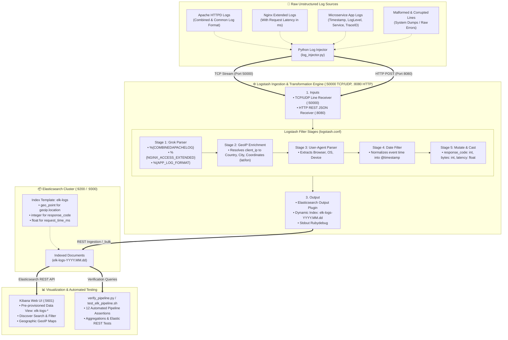

<!-- markdownlint-disable MD013 MD033 MD051 MD060 -->
# 06 - ELK Stack with Logstash Grok Parsers

> Deploy a containerized Elasticsearch, Logstash, and Kibana (ELK) stack, configuring Logstash Grok filter pipelines to parse unstructured legacy access logs into indexed, searchable fields with GeoIP enrichment, user-agent parsing, and date normalization.

---

## 📋 Table of Contents

1. [Architectural Overview & Data Flow](#-architectural-overview--data-flow)
   - [ELK Log Aggregation Architecture Diagram](#elk-log-aggregation-architecture-diagram)
   - [The Log Ingestion, Parsing & Indexing Lifecycle](#the-log-ingestion-parsing--indexing-lifecycle)
2. [Theoretical Deep-Dive for Beginners](#-theoretical-deep-dive-for-beginners)
   - [What is the ELK Stack? (Elasticsearch, Logstash, Kibana)](#what-is-the-elk-stack-elasticsearch-logstash-kibana)
   - [Logstash Processing Architecture: Inputs, Filters, and Outputs](#logstash-processing-architecture-inputs-filters-and-outputs)
   - [Understanding Grok: Turning Unstructured Text into Structured Data](#understanding-grok-turning-unstructured-text-into-structured-data)
   - [The Oniguruma Regular Expression Engine & Grok Syntax](#the-oniguruma-regular-expression-engine--grok-syntax)
   - [GeoIP Geolocation Enrichment: Translating IPs into Map Coordinates](#geoip-geolocation-enrichment-translating-ips-into-map-coordinates)
   - [The Critical Role of the Date Filter: Event Time vs Ingestion Time](#the-critical-role-of-the-date-filter-event-time-vs-ingestion-time)
   - [Elasticsearch Index Templates & Field Data Types](#elasticsearch-index-templates--field-data-types)
3. [Repository & Directory Structure](#-repository--directory-structure)
4. [Prerequisites & System Setup](#-prerequisites--system-setup)
5. [Quickstart Guide](#-quickstart-guide)
6. [Step-by-Step Hands-On Guide](#-step-by-step-hands-on-guide)
   - [Step 1: Inspect the Logstash Pipeline & Grok Configurations](#step-1-inspect-the-logstash-pipeline--grok-configurations)
   - [Step 2: Start the Elasticsearch, Logstash & Kibana Stack](#step-2-start-the-elasticsearch-logstash--kibana-stack)
   - [Step 3: Stream Unstructured Access Logs with the Log Injector](#step-3-stream-unstructured-access-logs-with-the-log-injector)
   - [Step 4: Query Elasticsearch REST API Directly](#step-4-query-elasticsearch-rest-api-directly)
   - [Step 5: Explore & Visualize Parsed Logs in Kibana](#step-5-explore--visualize-parsed-logs-in-kibana)
   - [Step 6: Run the Automated Pipeline Verification Test Suite](#step-6-run-the-automated-pipeline-verification-test-suite)
7. [Grok Pattern Cheat Sheet & Reference](#-grok-pattern-cheat-sheet--reference)
8. [Troubleshooting & Common Gotchas](#-troubleshooting--common-gotchas)
9. [Resource Teardown & Complete Cleanup](#-resource-teardown--complete-cleanup)

---

## 🏛️ Architectural Overview & Data Flow

### ELK Log Aggregation Architecture Diagram



### The Log Ingestion, Parsing & Indexing Lifecycle

1. **Emission**: Legacy applications, web servers (Apache HTTPD, Nginx), and microservices produce unstructured text log lines to standard output or local files.
2. **Transmission**: The `log_injector.py` client streams raw log lines directly to Logstash over TCP (port `50000`) or HTTP REST POST (port `8080`).
3. **Grok Parsing**: Logstash tests incoming lines against sequential Grok regular expression patterns (`NGINX_ACCESS_EXTENDED`, `APACHE_COMBINED_CUSTOM`, `APP_LOG_FORMAT`). When a match occurs, named variables (`client_ip`, `request_method`, `request_path`, `response_code`, `request_time_ms`) are extracted into discrete document fields.
4. **GeoIP & User-Agent Enrichment**: The extracted `client_ip` is looked up in MaxMind GeoLite2 databases to append `geoip.country_name`, `geoip.city_name`, and geographic latitude/longitude coordinates (`geoip.location`). The user agent string is unpacked into browser, operating system, and hardware device family.
5. **Timestamp Normalization**: The `date` filter parses the original event timestamp string and updates `@timestamp`, ensuring historical logs appear at their actual time of occurrence rather than the ingestion time.
6. **Index Template Application & Storage**: Elasticsearch applies the pre-configured `elk-logs` index template, setting `geoip.location` as `geo_point` and numeric fields as `integer`/`float`, enabling fast aggregations and geographic mapping.
7. **Exploration**: DevOps and SRE engineers query the indexed documents in Kibana (`http://localhost:5601`) or execute automated assertions using `verify_pipeline.py`.

---

## 🧠 Theoretical Deep-Dive for Beginners

### What is the ELK Stack? (Elasticsearch, Logstash, Kibana)

The **ELK Stack** is the industry standard open-source platform for centralized log management, real-time analytics, and search:

```text
┌─────────────────────────────────────────────────────────────────────────────┐
│                             THE ELK TRIAD                                   │
├─────────────────────────────────────────────────────────────────────────────┤
│ 1. ELASTICSEARCH (The Brain & Storage Engine):                              │
│    • Distributed, JSON-based search and analytics engine built on Lucene.   │
│    • Provides sub-second full-text search and real-time aggregations.       │
│    • Stores data as schema-flexible JSON documents organized into indices.  │
│                                                                             │
│ 2. LOGSTASH (The Data Processing & Transformation Pipeline):                │
│    • Server-side data processing pipeline that ingests data from multiple   │
│      sources simultaneously, transforms it, and forwards it to a stash.     │
│    • Utilizes Grok regex patterns to turn unstructured logs into JSON.      │
│                                                                             │
│ 3. KIBANA (The Visualization & Analytics Window):                           │
│    • Web interface enabling interactive exploration of Elasticsearch data.  │
│    • Provides histograms, pie charts, geographic maps, and saved queries.   │
└─────────────────────────────────────────────────────────────────────────────┘
```

---

### Logstash Processing Architecture: Inputs, Filters, and Outputs

A Logstash processing pipeline consists of three sequential phases:

```text
  ┌──────────────┐      ┌─────────────────────────┐      ┌──────────────────┐
  │    INPUTS    │ ───▶ │         FILTERS         │ ───▶ │     OUTPUTS      │
  └──────────────┘      └─────────────────────────┘      └──────────────────┘
  • TCP / UDP Socket    • grok (regex pattern matching)  • elasticsearch
  • HTTP REST POST      • geoip (IP geolocation)         • stdout (rubydebug)
  • Beats / Syslog      • useragent (browser detection)  • S3 / Kafka / File
  • File / S3           • date (timestamp alignment)
                        • mutate (type conversion)
```

1. **Inputs**: Ingest events from external sources into Logstash. In our project, we enable TCP port `50000`, UDP port `50000`, and HTTP port `8080`.
2. **Filters**: Perform in-flight transformations, regex extractions, metric computations, and contextual enrichments on every single event.
3. **Outputs**: Serialize and push transformed events to final destinations like Elasticsearch or local debug consoles.

---

### Understanding Grok: Turning Unstructured Text into Structured Data

Unstructured text logs are difficult to query, aggregate, and alert upon:

```text
Raw Legacy Apache Log:
185.199.108.153 - admin [26/Aug/2026:10:15:35 +0000] "GET /api/v1/products HTTP/1.1" 200 4523 "https://google.com" "Mozilla/5.0 Chrome/120.0"
```

Without parsing, querying *"Show me all requests with HTTP status 500 for /api/v1/checkout"* requires full-text scanning through millions of string lines.

With **Grok**, Logstash breaks that single string into structured JSON:

```json
{
  "@timestamp": "2026-08-26T10:15:35.000Z",
  "client_ip": "185.199.108.153",
  "auth_user": "admin",
  "request_method": "GET",
  "request_path": "/api/v1/products",
  "http_version": "1.1",
  "response_code": 200,
  "bytes_sent": 4523,
  "referrer": "https://google.com",
  "user_agent": "Mozilla/5.0 Chrome/120.0",
  "log_type": "apache_combined",
  "geoip": {
    "country_name": "United States",
    "city_name": "San Francisco",
    "location": { "lat": 37.7749, "lon": -122.4194 }
  }
}
```

---

### The Oniguruma Regular Expression Engine & Grok Syntax

Grok uses named pattern macros powered by the **Oniguruma** regular expression engine. The fundamental Grok syntax is:

$$\%\{\text{SYNTAX}:\text{SEMANTIC}[:\text{TYPE}]\}$$

- **`SYNTAX`**: The name of the predefined regex pattern (e.g. `IP`, `WORD`, `NUMBER`, `HTTPDATE`).
- **`SEMANTIC`**: The identifier / key you want to assign to the extracted value (e.g. `client_ip`, `status_code`).
- **`TYPE`** *(Optional)*: In-line type conversion (e.g. `:int`, `:float`).

#### Anatomy of a Grok Match

```text
Pattern: %{IP:client_ip} %{WORD:method} %{URIPATH:path} %{NUMBER:status:int}
Log:     192.168.1.50   GET          /users          200

Resulting Document:
{
  "client_ip": "192.168.1.50",
  "method": "GET",
  "path": "/users",
  "status": 200
}
```

---

### GeoIP Geolocation Enrichment: Translating IPs into Map Coordinates

When an IP address is extracted into `client_ip`, Logstash's `geoip` plugin references built-in MaxMind GeoLite2 databases:

```ruby
geoip {
  source => "client_ip"
  target => "geoip"
  tag_on_failure => ["_geoip_lookup_failure"]
}
```

This enriches the document with:

- `geoip.country_name`: e.g. `"Germany"`, `"Japan"`, `"Brazil"`.
- `geoip.city_name`: e.g. `"Frankfurt"`, `"Tokyo"`, `"Buenos Aires"`.
- `geoip.location`: Latitude and longitude object `{ "lat": 50.1109, "lon": 8.6821 }`.

> [!IMPORTANT]
> To visualize these coordinates on Kibana Maps, `geoip.location` **must** be explicitly mapped as a `geo_point` type in the Elasticsearch index template!

---

### The Critical Role of the Date Filter: Event Time vs Ingestion Time

By default, Logstash assigns `@timestamp` to the current system time when Logstash *received* the log (ingestion time).

If an application generates logs at 10:00:00 AM, but network backpressure or batch processing delays delivery to 10:05:00 AM, using ingestion time skews monitoring metrics and breaks distributed incident correlation.

The `date` filter resolves this by parsing the actual log event timestamp and overwriting `@timestamp`:

```ruby
date {
  match => [ "timestamp", "dd/MMM/yyyy:HH:mm:ss Z", "ISO8601" ]
  target => "@timestamp"
  remove_field => [ "timestamp" ]
}
```

---

### Elasticsearch Index Templates & Field Data Types

Elasticsearch dynamically detects field types, but dynamic mapping can choose suboptimal types (e.g., mapping numbers as text or geographic coordinates as separate floats).

An **Index Template** (`logstash/templates/elk_logs_template.json`) defines strict schema rules before documents are written:

| Field Name | Elasticsearch Mapping Type | Benefit |
| :--- | :--- | :--- |
| `geoip.location` | `geo_point` | Enables geospatial distance queries and Kibana heatmaps |
| `response_code` | `integer` | Allows range queries (`response_code >= 500`) and numeric histograms |
| `request_time_ms` | `float` | Enables average, p95, and p99 latency metric aggregations |
| `request_path` | `keyword` + `text` multi-field | Enables exact-match grouping (`/api/v1/checkout`) and full-text keyword searches |
| `client_ip` | `ip` | Enables CIDR block searches (e.g. `client_ip: "192.168.1.0/24"`) |

---

## 📁 Repository & Directory Structure

```text
09-logging/06-elk-stack-logstash-grok-parsers/
├── .gitignore                          # Ignores temporary Python cache and local test outputs
├── .markdownlint.json                  # Markdownlint rule configurations
├── docker-compose.yml                  # Elasticsearch, Logstash, and Kibana stack definition
├── cleanup.sh                          # Resource teardown script (containers, networks, volumes, images)
├── log_injector.py                     # Synthetic and fixture log streaming tool (TCP/HTTP)
├── verify_pipeline.py                  # Automated test suite asserting Grok and Elasticsearch schema
├── test_elk_pipeline.sh                # End-to-end automated test runner and orchestrator
├── logstash/
│   ├── Dockerfile                      # Self-contained Logstash image definition with pipelines & configs
│   ├── config/
│   │   ├── logstash.yml                # Logstash daemon settings (monitoring, ecs_compatibility)
│   │   └── pipelines.yml               # Pipeline registry and concurrency settings
│   ├── pipeline/
│   │   └── logstash.conf               # Multi-stage Grok, GeoIP, UserAgent, Date & Mutate pipeline
│   ├── patterns/
│   │   └── custom_patterns             # Custom Grok patterns for Nginx extended and App logs
│   └── templates/
│       └── elk_logs_template.json      # Index template with geo_point and numeric field mappings
└── sample_logs/
    ├── raw_apache_access.log           # Sample raw Apache Combined log fixture
    ├── raw_nginx_access.log            # Sample raw Nginx log fixture with response times
    ├── raw_app_errors.log              # Sample raw microservice application error logs
    └── malformed_logs.log              # Sample unparseable logs for _grokparsefailure testing
```

---

## 🔧 Prerequisites & System Setup

Ensure the following tools are installed on your host machine:

1. **Docker Engine & Docker Compose**:
   - Docker version `20.10+` or `OrbStack` / `Docker Desktop`.
   - Ensure Docker has at least **3 GB of RAM allocated** to run Elasticsearch, Logstash, and Kibana comfortably.
2. **Python 3**: Python `3.8+` (uses standard library modules: `socket`, `urllib`, `json`, `argparse`).
3. **curl & bash**: For API queries and script execution.
4. **pnpm** *(Optional)*: For verifying Markdown documentation formatting via `pnpm dlx markdownlint-cli`.

---

## ⚡ Quickstart Guide

To start the ELK stack, stream sample logs, and run all verification tests in one command:

```bash
cd 09-logging/06-elk-stack-logstash-grok-parsers
./test_elk_pipeline.sh
```

Once the test completes, open Kibana in your browser:
👉 **[http://localhost:5601](http://localhost:5601)**

---

## 📖 Step-by-Step Hands-On Guide

### Step 1: Inspect the Logstash Pipeline & Grok Configurations

Explore the Logstash filter configuration in `logstash/pipeline/logstash.conf`:

```bash
cat logstash/pipeline/logstash.conf
```

Observe how:

1. The `grok` filter loads pattern files from `/usr/share/logstash/patterns`.
2. Matches are tested against `NGINX_ACCESS_EXTENDED`, `APACHE_COMBINED_CUSTOM`, `APACHE_COMMON_CUSTOM`, and `APP_LOG_FORMAT`.
3. The `geoip` filter enriches `client_ip` with latitude and longitude coordinates.
4. The `date` filter replaces `@timestamp` with the log's original event timestamp.
5. The `mutate` filter converts `response_code` to `integer` and `request_time_ms` to `float`.

Inspect the custom Grok patterns in `logstash/patterns/custom_patterns`:

```bash
cat logstash/patterns/custom_patterns
```

---

### Step 2: Start the Elasticsearch, Logstash & Kibana Stack

Start all services in detached mode using Docker Compose:

```bash
docker compose up -d
```

Check the health status of the containers:

```bash
docker compose ps
```

Wait until all three services report `healthy`:

```bash
# Check Elasticsearch health
curl -s "http://127.0.0.1:9200/_cluster/health?pretty"

# Check Logstash pipeline statistics
curl -s "http://127.0.0.1:9600/_node/stats/pipelines?pretty"

# Check Kibana status
curl -s "http://127.0.0.1:5601/api/status" | grep -o '"level":"available"'
```

---

### Step 3: Stream Unstructured Access Logs with the Log Injector

The `log_injector.py` utility can generate realistic synthetic traffic or stream existing log fixture files.

#### Option A: Stream a burst of 100 synthetic logs via TCP

```bash
python3 log_injector.py --host 127.0.0.1 --tcp-port 50000 --count 100 --rate 50
```

#### Option B: Stream curated sample log fixture files

```bash
# Stream Apache Combined access logs
python3 log_injector.py --sample-file sample_logs/raw_apache_access.log --tcp-port 50000

# Stream Nginx access logs with response times
python3 log_injector.py --sample-file sample_logs/raw_nginx_access.log --tcp-port 50000

# Stream microservice application error logs
python3 log_injector.py --sample-file sample_logs/raw_app_errors.log --tcp-port 50000

# Stream unparseable malformed logs (to test error resilience)
python3 log_injector.py --sample-file sample_logs/malformed_logs.log --tcp-port 50000
```

#### Option C: Stream continuously to simulate real-time live traffic

```bash
python3 log_injector.py --tcp-port 50000 --rate 10 --continuous
# (Press Ctrl+C to terminate live streaming)
```

---

### Step 4: Query Elasticsearch REST API Directly

Refresh the Elasticsearch index so all ingested documents are immediately searchable:

```bash
curl -X POST "http://127.0.0.1:9200/elk-logs-*/_refresh"
```

#### 1. Check total count of parsed documents

```bash
curl -s "http://127.0.0.1:9200/elk-logs-*/_count?pretty"
```

#### 2. Query a parsed Nginx document with latency metrics

```bash
curl -s -X POST "http://127.0.0.1:9200/elk-logs-*/_search?pretty" \
  -H "Content-Type: application/json" \
  -d '{
    "query": { "term": { "log_type": "nginx_access" } },
    "_source": ["client_ip", "request_method", "request_path", "response_code", "request_time_ms", "geoip.country_name"],
    "size": 2
  }'
```

#### 3. Run an Elasticsearch Aggregation on HTTP Response Codes

```bash
curl -s -X POST "http://127.0.0.1:9200/elk-logs-*/_search?pretty" \
  -H "Content-Type: application/json" \
  -d '{
    "size": 0,
    "aggs": {
      "http_status_codes": {
        "terms": { "field": "response_code" }
      },
      "avg_latency_ms": {
        "avg": { "field": "request_time_ms" }
      }
    }
  }'
```

#### 4. Query Documents by Geographic Country

```bash
curl -s -X POST "http://127.0.0.1:9200/elk-logs-*/_search?pretty" \
  -H "Content-Type: application/json" \
  -d '{
    "query": { "term": { "geoip.country_name": "Japan" } },
    "_source": ["client_ip", "request_path", "geoip"],
    "size": 1
  }'
```

---

### Step 5: Explore & Visualize Parsed Logs in Kibana

1. Open your web browser and navigate to:
   👉 **`http://localhost:5601`**
2. Click on the left-hand navigation menu (☰) and select **Discover**.
3. The **`elk-logs-*`** Data View is automatically pre-configured.
4. Add columns to the table by clicking the **+** icon beside fields in the left field list:
   - `client_ip`
   - `request_method`
   - `request_path`
   - `response_code`
   - `request_time_ms`
   - `geoip.country_name`
5. In the search bar at the top (KQL - Kibana Query Language), test queries such as:
   - `response_code >= 400`
   - `log_type : "nginx_access" and request_time_ms > 100`
   - `geoip.country_name : "Brazil"`
   - `tags : "_grokparsefailure"`

---

### Step 6: Run the Automated Pipeline Verification Test Suite

Execute the Python-based automated assertion test suite:

```bash
python3 verify_pipeline.py
```

Expected output:

```text
======================================================================
  🧪 ELK Stack & Logstash Grok Pipeline Verification Suite
======================================================================

▶ [Phase 1] Stack Health & Connectivity Checks...
  [PASS] Elasticsearch Cluster Health (1.2ms)
  [PASS] Logstash Pipeline Engine Health (3.4ms)
  [PASS] Kibana Web UI Health (2.8ms)

▶ [Phase 2] Data Ingestion & Storage Assertions...
  [PASS] Elasticsearch Log Ingestion Count (1.9ms)

▶ [Phase 3] Grok Regex Pattern & Schema Assertions...
  [PASS] Apache Grok Parser Extraction (2.5ms)
  [PASS] Nginx Grok Extended Parser (Latency) (2.1ms)
  [PASS] Application Structured Grok Parser (1.8ms)

▶ [Phase 4] Pipeline Enrichment & Normalization Assertions...
  [PASS] GeoIP Location Enrichment (2.4ms)
  [PASS] User-Agent Filter Details (2.0ms)
  [PASS] Date Filter Event Time Normalization (1.7ms)
  [PASS] Grok Parse Failure Resilience (1.6ms)

▶ [Phase 5] Elasticsearch Analytics Aggregations...
  [PASS] Elasticsearch Analytics Aggregations (4.1ms)

▶ Auto-Provisioning Kibana Data View 'elk-logs-*'...
  [PROVISIONED] Kibana Data View created (ID: elk-logs-*).

======================================================================
  📊 Pipeline Verification Results: 12/12 Passed
======================================================================

🎉 ALL ELK GROK PIPELINE ASSERTIONS SUCCEEDED!
```

---

## 📊 Grok Pattern Cheat Sheet & Reference

| Grok Syntax Pattern | Matches | Example Match |
| :--- | :--- | :--- |
| `%{IP:client_ip}` | IPv4 or IPv6 IP address | `192.168.1.1` or `8.8.8.8` |
| `%{WORD:request_method}` | Single alphanumeric word | `GET`, `POST`, `DELETE` |
| `%{NOTSPACE:request_path}` | Non-whitespace string / URL | `/api/v1/checkout?sku=10` |
| `%{NUMBER:response_code:int}` | Positive/negative numeric value cast to integer | `200`, `404`, `500` |
| `%{NUMBER:request_time_ms:float}` | Floating-point decimal number cast to float | `24.5`, `1502.8` |
| `%{HTTPDATE:timestamp}` | Standard Apache/Nginx timestamp format | `26/Aug/2026:10:15:30 +0000` |
| `%{TIMESTAMP_ISO8601:log_timestamp}` | ISO 8601 formatted timestamp | `2026-08-26T10:15:30.120Z` |
| `%{LOGLEVEL:log_level}` | Standard log severity levels | `INFO`, `WARN`, `ERROR`, `DEBUG` |
| `%{GREEDYDATA:log_message}` | Everything remaining in the line | `Unhandled Exception at line 42` |
| `%{COMBINEDAPACHELOG}` | Built-in macro for Apache Combined access log | Complete combined access string |

---

## 🛠️ Troubleshooting & Common Gotchas

### 1. Elasticsearch Fails to Start with "max virtual memory areas vm.max_map_count is too low"

- **Symptom**: Elasticsearch exits immediately with code `137` or error `max virtual memory areas vm.max_map_count [65530] is too low`.
- **Cause**: Linux kernel limit on virtual memory maps is below Elasticsearch's minimum requirement of `262144`.
- **Fix**:
  - On Linux hosts, execute:

    ```bash
    sudo sysctl -w vm.max_map_count=262144
    ```

  - On macOS (Docker Desktop / OrbStack), virtual memory limits are managed automatically by the hypervisor VM.

### 2. Logstash Reports "_grokparsefailure" on Ingested Logs

- **Symptom**: Documents in Elasticsearch contain the tag `_grokparsefailure` in the `tags` array.
- **Cause**: The incoming log line does not strictly match any pattern defined in the `grok.match` array.
- **Fix**: Inspect the unparsed log line stored in the `message` field. Validate spacing, quotation marks, and date formats against your Grok pattern using the Kibana Dev Tools Grok Debugger (`Management > Dev Tools > Grok Debugger`).

### 3. GeoIP Fields are Missing in Elasticsearch Documents

- **Symptom**: `geoip.country_name` or `geoip.location` are `null` or missing.
- **Cause**: The IP address being tested is a private/local IP (such as `127.0.0.1`, `10.0.0.1`, or `192.168.1.1`). MaxMind GeoIP databases only resolve **public internet routable IP addresses**.
- **Fix**: Ensure your test logs contain public IPs (e.g. `8.8.8.8`, `1.1.1.1`, `185.199.108.153`), which the provided `log_injector.py` generates by default.

### 4. Kibana Reports "Elasticsearch cluster status is RED or YELLOW"

- **Symptom**: Kibana web UI shows "Kibana server is not ready yet".
- **Cause**: Elasticsearch single-node mode requires time to initialize Lucene index structures and disk watermarks.
- **Fix**: Wait 20–30 seconds for the cluster to finish starting, or verify logs with `docker compose logs -f elasticsearch`.

---

## 🧹 Resource Teardown & Complete Cleanup

To clean up all created resources and return your host to a pristine state:

### Standard Teardown (Stops Containers, Deletes Networks & Storage Volumes)

```bash
./cleanup.sh
```

This will:

- Stop and delete containers `elk-stack-elasticsearch`, `elk-stack-logstash`, and `elk-stack-kibana`.
- Remove the Docker network `elk-stack-net`.
- Delete the persistent volume `elk_es_data`.
- Remove temporary Python cache files and test logs.

### Complete Purge (Removes Built/Downloaded Docker Images)

To additionally delete the Elasticsearch, Logstash, and Kibana Docker container images from disk:

```bash
./cleanup.sh --all
```

### Verify Clean State

Verify that no containers or volumes remain:

```bash
docker ps -a --filter "name=elk-stack-"
docker volume ls --filter "name=elk_es_data"
docker network ls --filter "name=elk-stack-net"
```

Expected output: Zero running containers, zero lingering volumes, and zero lingering networks.
