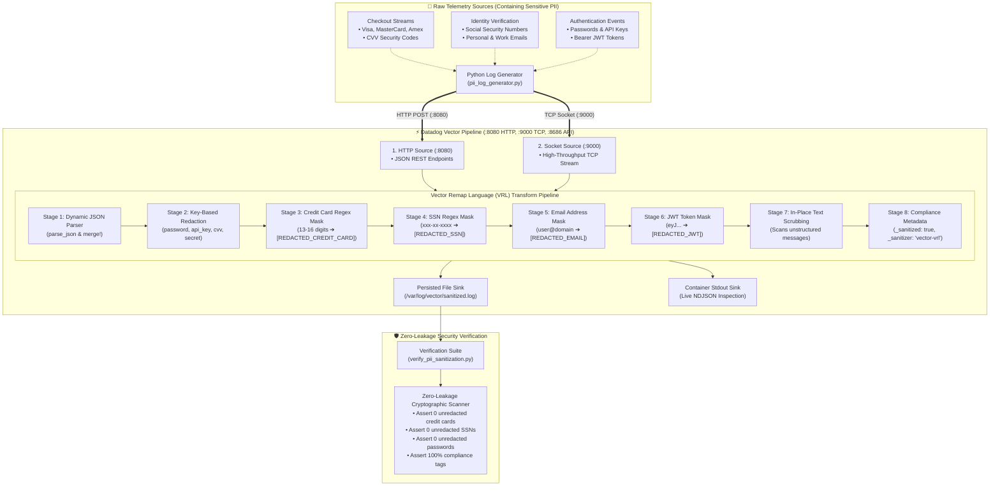

# 🛡️ Vector Log Sanitization and PII Masking

A hands-on, production-grade DevOps & SRE educational project demonstrating in-flight Personally Identifiable Information (PII) redaction and telemetry sanitization using **Datadog Vector** and the **Vector Remap Language (VRL)**.

---

## 📋 Table of Contents

- [🛡️ Vector Log Sanitization and PII Masking](#️-vector-log-sanitization-and-pii-masking)
  - [📋 Table of Contents](#-table-of-contents)
  - [🎯 Project Overview \& Goals](#-project-overview--goals)
  - [🏗️ Pipeline Architecture \& Data Flow](#️-pipeline-architecture--data-flow)
  - [🧠 Core Concepts for Beginners](#-core-concepts-for-beginners)
    - [1. Why In-Flight Telemetry Sanitization Matters](#1-why-in-flight-telemetry-sanitization-matters)
    - [2. What is Datadog Vector?](#2-what-is-datadog-vector)
    - [3. Vector Pipeline Anatomy (Sources, Transforms, Sinks)](#3-vector-pipeline-anatomy-sources-transforms-sinks)
    - [4. Vector Remap Language (VRL) Masterclass](#4-vector-remap-language-vrl-masterclass)
    - [5. Compliance Standards: PCI-DSS 3.4 \& GDPR](#5-compliance-standards-pci-dss-34--gdpr)
  - [📁 Repository \& Directory Structure](#-repository--directory-structure)
  - [⚙️ Prerequisites \& Requirements](#️-prerequisites--requirements)
  - [🚀 Quickstart: One-Command Testing](#-quickstart-one-command-testing)
  - [🔬 Step-by-Step Hands-On Guide](#-step-by-step-hands-on-guide)
    - [Step 1: Build \& Start the Vector Container](#step-1-build--start-the-vector-container)
    - [Step 2: Inspect Vector Health \& API Metrics](#step-2-inspect-vector-health--api-metrics)
    - [Step 3: Test Interactive In-Flight Redaction with cURL](#step-3-test-interactive-in-flight-redaction-with-curl)
    - [Step 4: Stream High-Speed Logs over TCP Socket (:9000)](#step-4-stream-high-speed-logs-over-tcp-socket-9000)
    - [Step 5: Inspect Sanitized Sinks \& File Persistence](#step-5-inspect-sanitized-sinks--file-persistence)
    - [Step 6: Run the Zero-Leakage Security Audit Suite](#step-6-run-the-zero-leakage-security-audit-suite)
  - [📊 VRL Redaction \& Transformation Reference](#-vrl-redaction--transformation-reference)
  - [🩺 Troubleshooting \& Common Gotchas](#-troubleshooting--common-gotchas)
  - [🧹 Clean Teardown \& Environment Reset](#-clean-teardown--environment-reset)

---

## 🎯 Project Overview & Goals

Modern distributed architectures generate millions of telemetry events every minute across web applications, microservices, and databases. Accidental leakage of sensitive credentials and customer data into centralized logging backends (such as Elasticsearch, Loki, or Datadog) introduces severe security vulnerabilities and regulatory penalties:

- **Primary Account Numbers (PAN / Credit Cards)** violate **PCI-DSS Requirement 3.4**.
- **Social Security Numbers (SSNs), phone numbers, and personal emails** violate **GDPR Article 5(1)(f)** and **HIPAA**.
- **Plaintext passwords, API keys, and Bearer JWT tokens** compromise authentication boundaries.

This project builds an ultra-fast, memory-safe in-flight redaction pipeline using **Datadog Vector**. Incoming telemetry streams are inspected and scrubbed in real time *before* they are persisted to storage or forwarded to third-party analytics platforms.

---

## 🏗️ Pipeline Architecture & Data Flow



---

## 🧠 Core Concepts for Beginners

### 1. Why In-Flight Telemetry Sanitization Matters

Traditionally, organizations attempted to redact sensitive data either:

1. **At the application source**: Inflexible, requiring constant code redeployment across hundreds of microservices whenever a new field is added.
2. **At the storage backend**: Dangerous, because sensitive data has already traversed public networks, caches, message brokers (Kafka), and index buffers before being cleaned.

**In-flight edge sanitization** with an observability router intercepts events as they leave application pods or virtual machines, scrubbing them in memory with zero disk leakage.

---

### 2. What is Datadog Vector?

[Vector](https://vector.dev/) is an open-source, high-performance telemetry router developed originally by Timber.io (now Datadog).

| Metric / Feature | Datadog Vector | Logstash (JVM) | Fluentd (Ruby) |
| :--- | :--- | :--- | :--- |
| **Implementation Language** | **Rust** (Memory-safe, Zero GC) | Java / JRuby | Ruby + C extensions |
| **Memory Footprint** | **~25 MB - 50 MB** | 512 MB - 2 GB | 100 MB - 300 MB |
| **Garbage Collection Pauses** | **None** (Deterministic) | Stop-the-world GC | Ruby GC cycles |
| **Regex Performance** | **SIMD-accelerated** (Rust `regex`) | Oniguruma (JVM) | Onigmo (C) |
| **Transformation Language** | **VRL** (Vector Remap Language) | Ruby DSL / Grok | Ruby filters |

---

### 3. Vector Pipeline Anatomy (Sources, Transforms, Sinks)

A Vector pipeline is composed of three interconnected topology primitives configured in `vector.toml`:

1. **Sources**: Define where data comes from (e.g. `http_server`, `socket`, `kafka`, `file`, `syslog`, `datadog_agent`).
2. **Transforms**: Modify, parse, sample, filter, or enrich events in-flight (e.g. `remap`, `filter`, `aggregate`, `geoip`).
3. **Sinks**: Define where sanitized data is shipped (e.g. `file`, `console`, `elasticsearch`, `aws_s3`, `loki`, `kafka`).

---

### 4. Vector Remap Language (VRL) Masterclass

**VRL** is an expression-oriented, Turing-incomplete programming language designed specifically for transforming observability data.

#### The Root Object (`.`)

In VRL, `.` represents the entire event currently being processed. If you assign `.username = "Alice"`, you set the field `username` on the output event.

#### Fallible vs Infallible Operations (`!`)

Certain operations might fail at runtime (e.g. parsing a corrupt JSON string). VRL enforces compile-time safety:

- `parsed, err = parse_json(.message)`: Safe handling. Returns `err` if parsing fails without crashing the pipeline.
- `merge!(., parsed)`: The `!` instructs Vector to abort the remap for that event if merging cannot be completed, ensuring type safety.

#### Pattern Masking with `replace`

VRL supports Rust-compatible regular expressions using raw string literals `r'...'`:

```rust
# Masking standard 16-digit credit cards with dashes or spaces
.credit_card = replace(
    to_string!(.credit_card),
    r'\b(?:4[0-9]{12}(?:[0-9]{3})?|5[1-5][0-9]{14}|3[47][0-9]{13}|6(?:011|5[0-9]{2})[0-9]{12}|(?:[0-9]{4}[ -]?){3}[0-9]{4})\b',
    "[REDACTED_CREDIT_CARD]"
)
```

---

### 5. Compliance Standards: PCI-DSS 3.4 & GDPR

- **PCI-DSS Requirement 3.4**: *"Render PAN unreadable anywhere it is stored (including on portable digital media, backup media, and in logs)."*
- **GDPR Article 5(1)(f)**: Requires organizations to maintain appropriate security, confidentiality, and protection against unauthorized processing of personal identity information.

---

## 📁 Repository & Directory Structure

```text
09-logging/07-vector-log-sanitization-pii-masking/
├── .gitignore                          # Ignores temporary Python cache and local test outputs
├── .markdownlint.json                  # Markdownlint formatting rules
├── docker-compose.yml                  # Vector service definition, volumes, and port mappings
├── cleanup.sh                          # Resource teardown script (containers, networks, volumes, images)
├── pii_log_generator.py                # Synthetic PII log generator (HTTP, TCP, and fixture streaming)
├── verify_pii_sanitization.py          # Automated zero-leakage security audit scanner
├── pii_sanitization_test.sh            # End-to-end test runner and benchmark orchestrator
├── vector/
│   ├── Dockerfile                      # Self-contained Vector container image
│   └── config/
│       └── vector.toml                 # Complete Vector pipeline configuration & VRL programs
└── sample_logs/
    ├── raw_credit_card_logs.log        # Raw e-commerce checkout logs with Visa/MasterCard/Amex
    ├── raw_ssn_identity_logs.log       # Raw user registration logs with SSNs
    ├── raw_auth_secrets_logs.log       # Raw logs containing passwords, API tokens, and JWTs
    └── raw_unstructured_mixed.log      # Raw mixed unstructured logs with multi-PII strings
```

---

## ⚙️ Prerequisites & Requirements

- **Operating System**: macOS, Linux, or WSL2.
- **Docker & Docker Compose**: Docker Engine `20.10+` with Docker Compose V2.
- **Python Runtime**: Python `3.9+` (uses standard libraries only: `urllib`, `socket`, `json`, `re`).
- **Network Ports**:
  - `8080`: Vector HTTP log ingestion endpoint.
  - `9000`: Vector TCP socket log ingestion endpoint.
  - `8686`: Vector API and health check endpoint.

---

## 🚀 Quickstart: One-Command Testing

To build the Vector container, stream synthetic and fixture PII logs, and run the 11 security audit assertions automatically:

```bash
cd 09-logging/07-vector-log-sanitization-pii-masking
chmod +x pii_sanitization_test.sh cleanup.sh
./pii_sanitization_test.sh
```

---

## 🔬 Step-by-Step Hands-On Guide

### Step 1: Build & Start the Vector Container

Build the container image packaging `vector.toml` and launch it in detached mode:

```bash
docker compose up -d --build
```

Verify that the `vector-sanitizer` container is running:

```bash
docker compose ps
```

Expected output:

```text
NAME               IMAGE                          COMMAND                  SERVICE   CREATED         STATUS                   PORTS
vector-sanitizer   mini-proj-09-07-vector:local   "vector --config /et…"   vector    2 seconds ago   Up 2 seconds (healthy)   0.0.0.0:8080->8080/tcp, 0.0.0.0:8686->8686/tcp, 0.0.0.0:9000->9000/tcp
```

---

### Step 2: Inspect Vector Health & API Metrics

Vector exposes a lightweight internal API for health checks and topology monitoring:

```bash
curl -i http://localhost:8686/health
```

Expected response:

```http
HTTP/1.1 200 OK
content-type: text/plain
content-length: 2

ok
```

---

### Step 3: Test Interactive In-Flight Redaction with cURL

Send an un-sanitized JSON event containing a real-format credit card number, a password, and a Social Security Number via HTTP POST:

```bash
curl -X POST http://localhost:8080 \
  -H "Content-Type: application/json" \
  -d '{"user_id": "usr_99", "email": "victim@bank.com", "credit_card": "4532-1234-5678-9012", "password": "PlaintextPassword!", "ssn": "123-45-6789", "amount": 250.00}'
```

Inspect container logs to see the in-flight transformed record:

```bash
docker logs --tail 1 vector-sanitizer
```

Observed output:

```json
{
  "_sanitized": true,
  "_sanitized_at": "2026-08-26T19:59:34.555276907Z",
  "_sanitizer": "vector-vrl",
  "amount": 250.0,
  "credit_card": "[REDACTED_CREDIT_CARD]",
  "email": "[REDACTED_EMAIL]",
  "password": "[REDACTED]",
  "ssn": "[REDACTED_SSN]",
  "user_id": "usr_99"
}
```

Notice that:

1. `credit_card`, `password`, `ssn`, and `email` are completely masked.
2. Non-sensitive operational data (`amount: 250.0`, `user_id: "usr_99"`) remains intact.
3. Vector stamped compliance metadata `_sanitized: true` and `_sanitizer: "vector-vrl"`.

---

### Step 4: Stream High-Speed Logs over TCP Socket (:9000)

Stream test fixtures directly through the high-performance TCP socket:

```bash
python3 pii_log_generator.py --protocol tcp --tcp-port 9000 --sample-file sample_logs/raw_auth_secrets_logs.log
```

Expected output:

```text
  Loaded 5 records from sample_logs/raw_auth_secrets_logs.log.
  Connecting to Vector TCP endpoint 127.0.0.1:9000...
  [CONNECTED] Streaming raw records over TCP...
  [SUCCESS] Streamed 5 records via TCP in 0.00s (229452.5 lines/sec).
Successfully forwarded 5 PII records to Vector!
```

---

### Step 5: Inspect Sanitized Sinks & File Persistence

Vector writes all sanitized records to `/var/log/vector/sanitized.log` inside the container:

```bash
docker exec vector-sanitizer tail -n 3 /var/log/vector/sanitized.log
```

---

### Step 6: Run the Zero-Leakage Security Audit Suite

Execute the security audit scanner to verify that zero raw PII has leaked into storage:

```bash
python3 verify_pii_sanitization.py
```

Expected output:

```text
======================================================================
  🛡️  Vector PII Sanitization & Zero-Leakage Security Audit
======================================================================

▶ [Phase 1] Checking Vector Service Health...
  [PASS] Vector Pipeline Daemon Health (12.4ms)

▶ [Phase 2] Fetching & Inspecting Sanitized Sinks...
  [PASS] Sanitized Sinks Retrieval (70.0ms)

▶ [Phase 3] Zero-Leakage Cryptographic & Regex Assertions...
  [PASS] Zero Credit Card Number Leakage (PCI-DSS 3.4) (0.9ms)
  [PASS] Zero Social Security Number Leakage (GDPR / PII) (0.6ms)
  [PASS] Zero Password & API Secret Key Leakage (1.0ms)
  [PASS] Zero Bearer JWT Token & Authorization Header Leakage (0.1ms)
  [PASS] Email Address Sanitization (0.0ms)
  [PASS] Phone Number Sanitization (0.0ms)
  [PASS] CVV & Card Security Code Redaction (0.0ms)

▶ [Phase 4] Data Integrity & Compliance Metadata Assertions...
  [PASS] Non-Sensitive Business Metadata Integrity (0.0ms)
  [PASS] Regulatory Compliance Audit Tagging (0.0ms)

======================================================================
  📊 Audit Results: 11/11 Passed (0 Leaks Detected)
======================================================================

🎉 ZERO DATA LEAKAGE CONFIRMED! VECTOR PII PIPELINE IS 100% COMPLIANT.
```

---

## 📊 VRL Redaction & Transformation Reference

| Sensitive Field / Data Type | Detection Method | Raw Pattern Example | Sanitized Replacement |
| :--- | :--- | :--- | :--- |
| **Credit Card (Visa/MasterCard/Amex/Discover)** | Regex Masking | `4532-1234-5678-9012` | `[REDACTED_CREDIT_CARD]` |
| **Social Security Number (SSN)** | Regex Masking | `123-45-6789` | `[REDACTED_SSN]` |
| **Personal & Work Email** | Regex Masking | `alice.smith@company.com` | `[REDACTED_EMAIL]` |
| **Card CVV / Security Code** | Key Redaction | `"cvv": "482"` | `[REDACTED_CVV]` |
| **Plaintext Password** | Key Redaction | `"password": "Secret!"` | `[REDACTED]` |
| **API Secret / Stripe Key** | Key & Regex | `sk_live_51Hz928472...` | `[REDACTED_API_KEY]` |
| **Bearer JWT Token** | Regex Masking | `Bearer eyJhbGciOi...` | `[REDACTED_JWT]` |
| **US / Intl Phone Numbers** | Regex Masking | `+1 (555) 234-5678` | `[REDACTED_PHONE]` |
| **Unstructured Strings** | In-Place Regex | `User ssn=123-45-6789 card=4...` | `User ssn=[REDACTED_SSN] card=[REDACTED_CREDIT_CARD]` |

---

## 🩺 Troubleshooting & Common Gotchas

### 1. Vector Fails to Start with `x Missing environment variable in config. name = "1"`

- **Cause**: Vector's TOML parser interprets `$1`, `$2` inside double-quoted strings as environment variable interpolations rather than regex capture group backreferences.
- **Fix**: In VRL `replace()`, use explicit literal replacements (e.g. `"password=[REDACTED]"`) or escape with `$$1`.

### 2. VRL Compilation Error: `error[E103]: unhandled fallible assignment`

- **Cause**: In VRL, functions like `merge()` can fail if the input is not guaranteed to be an object at compile time.
- **Fix**: Use the infallible abort operator `merge!(., parsed)` or safely catch the error: `., err = merge(., parsed)`.

### 3. File Permissions on macOS with Docker Volumes

- **Cause**: Binding host directories located in restricted macOS folders (`~/Documents`, `~/Desktop`) can trigger `Operation not permitted` errors.
- **Fix**: The project uses a dedicated named Docker volume (`vector_sanitized_data`) and packages the configuration directly inside the image via `vector/Dockerfile`.

---

## 🧹 Clean Teardown & Environment Reset

When testing is complete, clean up all created Docker resources, containers, volumes, and temporary files:

```bash
# Standard cleanup: removes containers, networks, volumes, and cache files
./cleanup.sh
```

To also delete the compiled and base Docker images (`mini-proj-09-07-vector:local` and `timberio/vector:0.41.0-alpine`):

```bash
# Full purge: removes containers, networks, volumes, and Docker images
./cleanup.sh --all
```

Verify that the environment is completely clean:

```bash
docker ps -a --filter "name=vector-sanitizer"
docker volume ls --filter "name=vector_sanitized_data"
```
