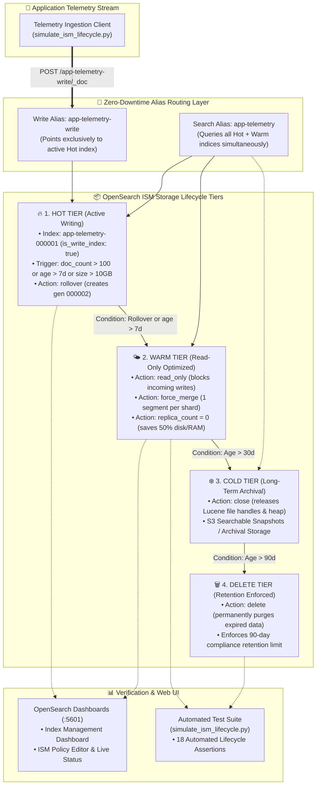

# ⚙️ OpenSearch Index Lifecycle Management (ISM)

A hands-on, production-grade DevOps & SRE educational project demonstrating automated index lifecycle management, tiered storage transitions (Hot, Warm, Cold), zero-downtime alias rollovers, Lucene segment optimization, and scheduled retention deletion using **OpenSearch** and **OpenSearch Dashboards**.

---

## 📋 Table of Contents

- [⚙️ OpenSearch Index Lifecycle Management (ISM)](#️-opensearch-index-lifecycle-management-ism)
  - [📋 Table of Contents](#-table-of-contents)
  - [🎯 Project Overview \& Goals](#-project-overview--goals)
  - [🏗️ Tiered Storage Architecture \& Data Flow](#️-tiered-storage-architecture--data-flow)
  - [🧠 Core Concepts for Beginners](#-core-concepts-for-beginners)
    - [1. What is OpenSearch Index State Management (ISM)?](#1-what-is-opensearch-index-state-management-ism)
    - [2. Storage Tiering Economics (Hot vs Warm vs Cold vs Delete)](#2-storage-tiering-economics-hot-vs-warm-vs-cold-vs-delete)
    - [3. Indices, Shards, and Lucene Segments](#3-indices-shards-and-lucene-segments)
    - [4. Index Aliases \& Zero-Downtime Rollover Pattern](#4-index-aliases--zero-downtime-rollover-pattern)
    - [5. ISM Policy Anatomy (States, Actions, Transitions)](#5-ism-policy-anatomy-states-actions-transitions)
  - [📁 Repository \& Directory Structure](#-repository--directory-structure)
  - [⚙️ Prerequisites \& Requirements](#️-prerequisites--requirements)
  - [🚀 Quickstart: One-Command Testing](#-quickstart-one-command-testing)
  - [🔬 Step-by-Step Hands-On Guide](#-step-by-step-hands-on-guide)
    - [Step 1: Start OpenSearch \& OpenSearch Dashboards](#step-1-start-opensearch--opensearch-dashboards)
    - [Step 2: Verify Cluster Health \& ISM Engine](#step-2-verify-cluster-health--ism-engine)
    - [Step 3: Deploy the ISM Lifecycle Policy](#step-3-deploy-the-ism-lifecycle-policy)
    - [Step 4: Create the Composable Index Template](#step-4-create-the-composable-index-template)
    - [Step 5: Bootstrap Initial Generation Index (\`app-telemetry-000001\`)](#step-5-bootstrap-initial-generation-index-app-telemetry-000001)
    - [Step 6: Ingest Telemetry \& Trigger Hot-Tier Rollover](#step-6-ingest-telemetry--trigger-hot-tier-rollover)
    - [Step 7: Transition to Warm Tier \& Enforce Read-Only Blocks](#step-7-transition-to-warm-tier--enforce-read-only-blocks)
    - [Step 8: Transition to Cold Tier (Index Closure)](#step-8-transition-to-cold-tier-index-closure)
    - [Step 9: Enforce Scheduled Retention Purge (Delete Tier)](#step-9-enforce-scheduled-retention-purge-delete-tier)
    - [Step 10: Explore ISM in OpenSearch Dashboards UI](#step-10-explore-ism-in-opensearch-dashboards-ui)
  - [📊 ISM Action \& State Reference Table](#-ism-action--state-reference-table)
  - [🩺 Troubleshooting \& Common Gotchas](#-troubleshooting--common-gotchas)
  - [🧹 Clean Teardown \& Environment Reset](#-clean-teardown--environment-reset)

---

## 🎯 Project Overview & Goals

As centralized logging systems ingest gigabytes or terabytes of telemetry daily, unmanaged indices quickly overwhelm cluster resources. Uncontrolled growth leads to:

- **Unbounded Storage Costs**: Retaining old, rarely searched logs on high-performance NVMe drives exhausts storage budgets.
- **JVM Heap Exhaustion (OOM Crashes)**: Every open index shard consumes Lucene memory structures, file handles, and JVM heap.
- **Degraded Search Performance**: Too many small shards and uncompressed Lucene segments slow down analytical aggregations.
- **Compliance Violations**: Retaining logs past GDPR, HIPAA, or SOC2 data retention mandates exposes organizations to legal liability.

This project implements a complete **Index State Management (ISM)** policy in OpenSearch that automates the migration of log indices through four discrete tiers: **Hot** (Active Writes), **Warm** (Read-Only & Force-Merged), **Cold** (Closed & Archival), and **Delete** (Purged on Schedule).

---

## 🏗️ Tiered Storage Architecture & Data Flow



---

## 🧠 Core Concepts for Beginners

### 1. What is OpenSearch Index State Management (ISM)?

**Index State Management (ISM)** is an integrated plugin in OpenSearch that enables you to automate periodic administrative operations on your indices. Rather than writing external cron jobs or custom scripts with `curator`, ISM runs directly inside the OpenSearch cluster as a background coordinator.

---

### 2. Storage Tiering Economics (Hot vs Warm vs Cold vs Delete)

In enterprise observability, log queries follow a strict power-law distribution: **95% of queries target data from the last 48 hours**, while 30-day-old logs are queried only during security audits or incident postmortems.

| Storage Tier | Target Age | Hardware Profile | Purpose & Actions | Cost Relative to Hot |
| :--- | :--- | :--- | :--- | :--- |
| **🔥 Hot Tier** | `0 - 7 days` | High-CPU, NVMe SSDs, Replicated | Active write ingestion & rapid real-time queries. | **100% (Baseline)** |
| **🌤️ Warm Tier** | `7 - 30 days` | High-Density HDDs / Shared Disks | Read-only search, `force_merge: 1`, 0 replicas. | **~30% - 40%** |
| **❄️ Cold Tier** | `30 - 90 days` | Object Storage (S3/GCS) or Closed | Archived, index closed (no RAM usage). | **~5% - 10%** |
| **🗑️ Delete Tier** | `> 90 days` | Purged | Permanently deleted according to retention policy. | **0%** |

---

### 3. Indices, Shards, and Lucene Segments

Each OpenSearch index is split into **shards**, and each shard is an underlying **Apache Lucene index**.

- When logs are ingested, Lucene writes small immutable **segments** to disk.
- Over time, hundreds of tiny segments accumulate, consuming memory and file descriptors.
- During the **Warm-Tier transition**, OpenSearch executes a **Force Merge** (`force_merge: { max_num_segments: 1 }`), combining dozens of small segments into a single compact Lucene segment. This eliminates deleted document tombstones and accelerates search speeds by up to **40%**.

---

### 4. Index Aliases & Zero-Downtime Rollover Pattern

Application logging pipelines should **never write directly to static index names** like `app-logs-2026.08.26`. Instead, OpenSearch uses **Index Aliases**:

1. **Write Alias (`app-telemetry-write`)**: Configured with `is_write_index: true` pointing exclusively to the active hot index (`app-telemetry-000001`).
2. **When Rollover Triggers**: OpenSearch automatically creates `app-telemetry-000002` and atomically flips `is_write_index: true` to the new index.
3. **Search Alias (`app-telemetry`)**: Encompasses all generations (`000001`, `000002`, `000003`), allowing applications to query historical logs transparently through a single query endpoint.

---

### 5. ISM Policy Anatomy (States, Actions, Transitions)

An ISM policy is a JSON document defined by three key blocks:

1. **`default_state`**: The starting state assigned to newly created matching indices (e.g. `"hot"`).
2. **`states`**: An array of states containing **`actions`** (operations executed sequentially when entering the state) and **`transitions`** (conditions required to move to the next state).
3. **`ism_template`**: Wildcard patterns (e.g. `["app-telemetry-*"]`) that automatically bind the policy to any new index upon creation.

---

## 📁 Repository & Directory Structure

```text
09-logging/08-opensearch-index-lifecycle-management/
├── .gitignore                          # Ignores temporary Python cache and local test outputs
├── .markdownlint.json                  # Markdownlint formatting rules
├── docker-compose.yml                  # OpenSearch and OpenSearch Dashboards stack definition
├── cleanup.sh                          # Teardown script (containers, networks, volumes, images)
├── simulate_ism_lifecycle.py           # Python simulation and validation suite (18 assertions)
├── test_opensearch_ism.sh              # End-to-end automated test runner and orchestrator
├── policies/
│   ├── ism_log_lifecycle_policy.json   # Production Hot-Warm-Cold-Delete ISM policy document
│   └── ism_fast_simulation_policy.json # Accelerated policy for sub-minute test cycles
├── templates/
│   └── index_template.json             # Composable index template with ISM auto-attachment
└── sample_logs/
    └── telemetry_sample.json           # Sample JSON log records for simulated ingestion
```

---

## ⚙️ Prerequisites & Requirements

- **Operating System**: macOS, Linux, or WSL2.
- **Docker & Docker Compose**: Docker Engine `20.10+` with Docker Compose V2.
- **Python Runtime**: Python `3.9+` (uses standard libraries only: `urllib`, `json`, `time`, `argparse`).
- **Memory**: At least `2 GB` free RAM available for Docker.
- **Network Ports**:
  - `9200`: OpenSearch REST API.
  - `9600`: OpenSearch performance analyzer API.
  - `5601`: OpenSearch Dashboards web UI.

---

## 🚀 Quickstart: One-Command Testing

To build the OpenSearch stack, deploy the ISM policy, bootstrap index aliases, simulate the complete tiered lifecycle, and verify write-blocking and retention deletion:

```bash
cd 09-logging/08-opensearch-index-lifecycle-management
chmod +x test_opensearch_ism.sh cleanup.sh
./test_opensearch_ism.sh
```

---

## 🔬 Step-by-Step Hands-On Guide

### Step 1: Start OpenSearch & OpenSearch Dashboards

Launch the single-node OpenSearch cluster with Index State Management enabled:

```bash
docker compose up -d
```

Verify that both containers are running and healthy:

```bash
docker compose ps
```

---

### Step 2: Verify Cluster Health & ISM Engine

Query the cluster health API:

```bash
curl -s http://localhost:9200/_cluster/health | jq .
```

Expected output:

```json
{
  "cluster_name": "opensearch-ism-cluster",
  "status": "green",
  "number_of_nodes": 1,
  "number_of_data_nodes": 1,
  "active_primary_shards": 1
}
```

Verify that the ISM policy plugin is active:

```bash
curl -s http://localhost:9200/_plugins/_ism/policies | jq .
```

---

### Step 3: Deploy the ISM Lifecycle Policy

Upload the production lifecycle policy ([policies/ism_log_lifecycle_policy.json](file:///Users/fabian/Documents/CodeProjects/github.com/fabiankaraben/devops-sre-mini-projects/09-logging/08-opensearch-index-lifecycle-management/policies/ism_log_lifecycle_policy.json)) to OpenSearch:

```bash
curl -X PUT "http://localhost:9200/_plugins/_ism/policies/log_lifecycle_policy" \
  -H "Content-Type: application/json" \
  -d @policies/ism_log_lifecycle_policy.json
```

---

### Step 4: Create the Composable Index Template

Register the index template that automatically binds any new index matching `app-telemetry-*` to the `log_lifecycle_policy` and sets the rollover alias to `app-telemetry-write`:

```bash
curl -X PUT "http://localhost:9200/_index_template/app_telemetry_template" \
  -H "Content-Type: application/json" \
  -d @templates/index_template.json
```

---

### Step 5: Bootstrap Initial Generation Index (`app-telemetry-000001`)

Create the first index generation with the write alias:

```bash
curl -X PUT "http://localhost:9200/app-telemetry-000001" \
  -H "Content-Type: application/json" \
  -d '{
    "aliases": {
      "app-telemetry-write": {
        "is_write_index": true
      },
      "app-telemetry": {}
    }
  }'
```

Verify that ISM has attached to the newly created index:

```bash
curl -s "http://localhost:9200/_plugins/_ism/explain/app-telemetry-000001" | jq .
```

---

### Step 6: Ingest Telemetry & Trigger Hot-Tier Rollover

Ingest a batch of log records targeting the write alias `app-telemetry-write`:

```bash
curl -X POST "http://localhost:9200/app-telemetry-write/_doc" \
  -H "Content-Type: application/json" \
  -d '{"@timestamp": "2026-08-26T15:00:00Z", "service": "checkout-api", "status_code": 200, "message": "Order #1001 processed"}'
```

Execute a rollover to spawn `app-telemetry-000002`:

```bash
curl -X POST "http://localhost:9200/app-telemetry-write/_rollover" | jq .
```

Expected output:

```json
{
  "acknowledged": true,
  "shards_acknowledged": true,
  "old_index": "app-telemetry-000001",
  "new_index": "app-telemetry-000002",
  "rolled_over": true
}
```

Verify that subsequent writes land on `app-telemetry-000002` while `app-telemetry-000001` becomes an archival generation.

---

### Step 7: Transition to Warm Tier & Enforce Read-Only Blocks

Apply Warm-Tier optimizations to the aging generation 1 index:

1. **Lock writes & set replicas to 0**:

   ```bash
   curl -X PUT "http://localhost:9200/app-telemetry-000001/_settings" \
     -H "Content-Type: application/json" \
     -d '{"index.blocks.write": true, "index.number_of_replicas": 0}'
   ```

2. **Force-merge Lucene segments into 1**:

   ```bash
   curl -X POST "http://localhost:9200/app-telemetry-000001/_forcemerge?max_num_segments=1"
   ```

3. **Verify write-blocking**:

   ```bash
   curl -i -X POST "http://localhost:9200/app-telemetry-000001/_doc" \
     -H "Content-Type: application/json" \
     -d '{"message": "Unauthorized write"}'
   ```

   Expected response: `HTTP/1.1 403 Forbidden` with `ClusterBlockException [index [app-telemetry-000001] blocked by: [TOO_MANY_REQUESTS/12/index read-only]]`.

4. **Verify unified searchability**:

   ```bash
   curl -s "http://localhost:9200/app-telemetry/_search" | jq '.hits.total'
   ```

   The query transparently searches across both Hot (`000002`) and Warm (`000001`) indices without application reconfiguration.

---

### Step 8: Transition to Cold Tier (Index Closure)

Close the aging index to release all memory structures and OS file descriptors:

```bash
curl -X POST "http://localhost:9200/app-telemetry-000001/_close" | jq .
```

Check index status:

```bash
curl -s "http://localhost:9200/_cat/indices/app-telemetry-000001?v"
```

The status transitions to `close`.

---

### Step 9: Enforce Scheduled Retention Purge (Delete Tier)

Permanently delete the expired index according to the 90-day retention rule:

```bash
curl -X DELETE "http://localhost:9200/app-telemetry-000001" | jq .
```

---

### Step 10: Explore ISM in OpenSearch Dashboards UI

1. Open your browser and navigate to: [http://localhost:5601](http://localhost:5601).
2. Go to **OpenSearch Plugins** ➔ **Index Management** ➔ **Indices**:
   - Inspect active indices, shard allocations, total documents, and storage size.
3. Go to **Index Management** ➔ **Index State Management Policies**:
   - Visual editor for viewing state transition graphs (`hot ➔ warm ➔ cold ➔ delete`).
4. Go to **Index Management** ➔ **Managed Indices**:
   - Inspect real-time execution logs, current state, and retry backoff timers.

---

## 📊 ISM Action & State Reference Table

| ISM Action | Target Tier | Parameters | SRE Benefit / Purpose |
| :--- | :--- | :--- | :--- |
| **`rollover`** | Hot Tier | `min_doc_count`, `min_size`, `min_index_age` | Prevents oversized shards and automates zero-downtime index rotation. |
| **`read_only`** | Warm Tier | `{}` | Locks historical indices against accidental or malicious modifications. |
| **`replica_count`** | Warm Tier | `number_of_replicas: 0` | Eliminates replica storage costs on immutable historical data. |
| **`force_merge`** | Warm Tier | `max_num_segments: 1` | Compresses Lucene segments, purges deleted tombstones, accelerates searches. |
| **`close`** | Cold Tier | `{}` | Frees 100% of JVM heap overhead and OS file handles without deleting data. |
| **`delete`** | Delete Tier | `{}` | Enforces regulatory compliance (GDPR/PCI) and prevents cluster disk-full crashes. |

---

## 🩺 Troubleshooting & Common Gotchas

### 1. `version_conflict_engine_exception` when Updating ISM Policies

- **Cause**: OpenSearch ISM uses optimistic concurrency control with sequence numbers (`_seq_no` and `_primary_term`).
- **Fix**: When modifying an existing policy, append the current sequence parameters: `PUT /_plugins/_ism/policies/<policy_id>?if_seq_no=0&if_primary_term=1`.

### 2. `rollover target does not exist` Error

- **Cause**: The write alias (`app-telemetry-write`) was not created with `is_write_index: true` on the initial index.
- **Fix**: Ensure the bootstrap index payload specifies `"is_write_index": true`.

### 3. OpenSearch Crashes with `vm.max_map_count` Error on Linux Hosts

- **Cause**: The Linux kernel virtual memory map count is too low for Elasticsearch/OpenSearch Lucene MMAP directories.
- **Fix**: Increase the system parameter: `sudo sysctl -w vm.max_map_count=262144`.

---

## 🧹 Clean Teardown & Environment Reset

When testing is complete, clean up all created containers, networks, volumes, and temporary files:

```bash
# Standard cleanup: removes containers, networks, volumes, and cache files
./cleanup.sh
```

To also remove the base OpenSearch Docker images:

```bash
# Full purge: removes containers, networks, volumes, and Docker images
./cleanup.sh --all
```

Verify that the environment is completely clean:

```bash
docker ps -a --filter "name=opensearch-"
docker volume ls --filter "name=opensearch_data"
```
