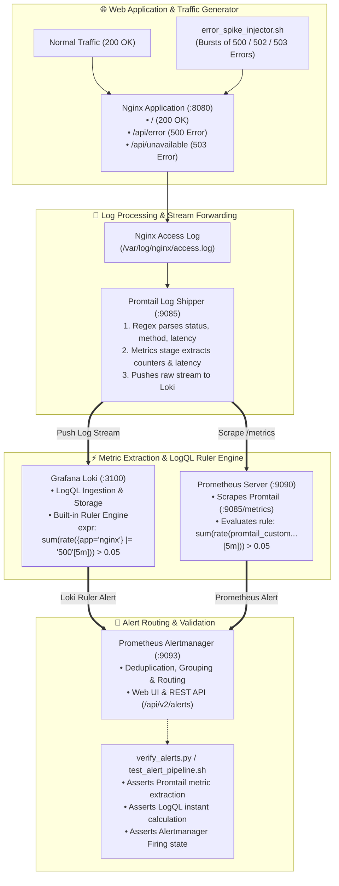
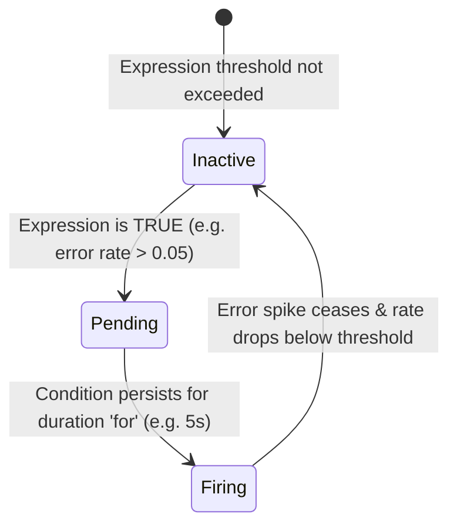

# 🚨 Log-Based Metrics Extraction and Alerting

A comprehensive, production-grade DevOps & SRE educational project demonstrating real-time numerical metric extraction from raw unstructured log streams using **Promtail Metric Pipeline Stages**, **Grafana Loki LogQL Metric Rules & Ruler**, **Prometheus Server**, and **Prometheus Alertmanager**.

---

## 📋 Table of Contents

- [🚨 Log-Based Metrics Extraction and Alerting](#-log-based-metrics-extraction-and-alerting)
  - [📋 Table of Contents](#-table-of-contents)
  - [🎯 Project Overview \& Goals](#-project-overview--goals)
  - [🏗️ System Architecture \& Data Pipeline Flow](#️-system-architecture--data-pipeline-flow)
  - [🧠 Core Concepts for Beginners](#-core-concepts-for-beginners)
    - [1. Why Extract Metrics from Raw Logs?](#1-why-extract-metrics-from-raw-logs)
    - [2. Dual Log-to-Metric Extraction Paradigms](#2-dual-log-to-metric-extraction-paradigms)
    - [3. LogQL Metric Query Expressions Explained](#3-logql-metric-query-expressions-explained)
    - [4. SRE Alerting Lifecycles \& State Machine](#4-sre-alerting-lifecycles--state-machine)
    - [5. Alertmanager Grouping \& Deduplication](#5-alertmanager-grouping--deduplication)
  - [📁 Repository \& Directory Structure](#-repository--directory-structure)
  - [⚙️ Prerequisites \& Requirements](#️-prerequisites--requirements)
  - [🚀 Quickstart: One-Command Testing](#-quickstart-one-command-testing)
  - [🔬 Step-by-Step Hands-On Guide](#-step-by-step-hands-on-guide)
    - [Step 1: Start the Observability Stack](#step-1-start-the-observability-stack)
    - [Step 2: Verify Health Across All 5 Services](#step-2-verify-health-across-all-5-services)
    - [Step 3: Inspect Promtail Extracted Metrics (:9085/metrics)](#step-3-inspect-promtail-extracted-metrics-9085metrics)
    - [Step 4: Query Real-Time Metrics with Loki LogQL](#step-4-query-real-time-metrics-with-loki-logql)
    - [Step 5: Inject an HTTP 500 Error Spike](#step-5-inject-an-http-500-error-spike)
    - [Step 6: Observe Metric Anomaly \& Alert Rule in Prometheus (:9090)](#step-6-observe-metric-anomaly--alert-rule-in-prometheus-9090)
    - [Step 7: Inspect Firing Alerts in Alertmanager (:9093)](#step-7-inspect-firing-alerts-in-alertmanager-9093)
  - [📊 LogQL \& Promtail Metric Reference Cheat Sheet](#-logql--promtail-metric-reference-cheat-sheet)
  - [🩺 Troubleshooting \& Common Gotchas](#-troubleshooting--common-gotchas)
  - [🧹 Clean Teardown \& Environment Reset](#-clean-teardown--environment-reset)

---

## 🎯 Project Overview & Goals

In production systems, not all microservices expose native Prometheus `/metrics` endpoints. Legacy monoliths, third-party reverse proxies (Nginx, HAProxy, Envoy), and uninstrumented batch jobs only emit text or JSON log lines to disk.

Relying on manual human inspection of logs during outages is impossible at scale. **Log-Based Metrics Extraction** bridges this gap by automatically converting unstructured text streams into actionable numerical timeseries:

- **Instant SLI/SLO Calculation**: Derives real-time error rates ($SLI = \frac{\text{HTTP 5xx}}{\text{Total Requests}}$) directly from access logs.
- **Zero Code Modification**: Provides high-resolution observability for third-party or legacy software without touching application source code.
- **Sub-Second Incident Response**: Triggers automated paging alerts via Prometheus Alertmanager within seconds of an error spike.
- **Reduced Storage Costs**: Allows teams to extract long-term historical trends into lightweight timeseries while applying shorter retention policies to high-volume raw logs.

---

## 🏗️ System Architecture & Data Pipeline Flow



---

## 🧠 Core Concepts for Beginners

### 1. Why Extract Metrics from Raw Logs?

| Metric Source | Advantages | Disadvantages | Best Used For |
| :--- | :--- | :--- | :--- |
| **Native Application Metrics** (`/metrics`) | Extremely fast, low CPU overhead, rich custom business context. | Requires source code access, developer time, library dependencies. | Modern in-house microservices (Go, Python, Java). |
| **Log-Extracted Metrics** (Promtail / Loki) | Works on **any** black-box software (Nginx, MySQL, legacy daemons), zero code changes. | Small parsing overhead, depends on log consistency. | Web servers, databases, third-party appliances, audit events. |

---

### 2. Dual Log-to-Metric Extraction Paradigms

This project implements both industry-standard paradigms:

1. **Edge Extraction with Promtail (`metrics` pipeline stage)**:
   - Extracted **at the agent** as logs are read from disk.
   - Promtail exposes Prometheus counters (`promtail_custom_nginx_http_requests_total{status="500"}`) on `:9085/metrics`.
   - **Advantage**: Zero query-time compute overhead on the central log cluster.
2. **Centralized LogQL Extraction with Loki Ruler**:
   - Evaluated **inside Loki** against the stored log stream using LogQL metric expressions.
   - Loki's built-in **Ruler** evaluates rules periodically and fires alerts directly to Alertmanager.
   - **Advantage**: Allows ad-hoc metric generation without changing agent configurations.

---

### 3. LogQL Metric Query Expressions Explained

LogQL allows wrapping log stream selectors with aggregation functions:

- **`rate({app="nginx"} |= "500" [5m])`**: Calculates the per-second rate of log lines matching substring `"500"` over a 5-minute sliding window.
- **`count_over_time({app="nginx"} [5m])`**: Counts the total number of log lines received in the last 5 minutes.
- **`bytes_rate({app="nginx"} [1m])`**: Measures log ingestion bandwidth in bytes per second.
- **`sum by (status) (rate({app="nginx"} | json | status >= 500 [1m]))`**: Parses JSON logs and calculates error rates grouped by HTTP status code.

---

### 4. SRE Alerting Lifecycles & State Machine

Every alert evaluated by Prometheus or Loki Ruler transitions through a 3-stage lifecycle:



1. **`Inactive`**: Error rate is within normal operating limits (0 errors/sec).
2. **`Pending`**: An error burst is detected; timer starts to prevent transient false-positive flap alerts.
3. **`Firing`**: The threshold violation has persisted; Alertmanager notifies on-call responders.

---

### 5. Alertmanager Grouping & Deduplication

When an outage occurs, hundreds of alerts can fire simultaneously. Alertmanager prevents notification storms using:

- **Grouping**: Collates related alerts with matching labels (`job`, `alertname`, `severity`) into a single notification digest.
- **Deduplication**: Ensures identical alert triggers from multiple redundant instances do not result in duplicate emails/Slack messages.
- **Inhibition**: Suppresses low-severity warnings (e.g., `HighLatency`) if a higher-severity alert (e.g., `ServiceDown`) is already active.

---

## 📁 Repository & Directory Structure

```text
09-logging/09-log-based-metrics-extraction-alerting/
├── .gitignore                          # Ignores temporary Python cache and local test outputs
├── .markdownlint.json                  # Markdownlint formatting rules
├── docker-compose.yml                  # Stack definition (Nginx, Promtail, Loki, Prometheus, Alertmanager)
├── cleanup.sh                          # Teardown script (containers, networks, volumes, images)
├── error_spike_injector.sh             # Script generating baseline and sudden bursts of 500 error logs
├── verify_alerts.py                    # Automated test suite validating metrics and Alertmanager (13 assertions)
├── test_alert_pipeline.sh              # End-to-end automated test runner and orchestrator
├── nginx/
│   ├── Dockerfile                      # Nginx image with real file logging and custom endpoints
│   └── nginx.conf                      # Nginx routing with /api/error and custom log format
├── promtail/
│   ├── Dockerfile                      # Multi-stage Promtail image with static healthcheck tools
│   └── promtail-config.yml             # Metrics stage extracting HTTP counters & latency histograms
├── loki/
│   ├── Dockerfile                      # Loki image with Ruler enabled
│   ├── loki-config.yml                 # Loki daemon configuration with Ruler Alertmanager endpoint
│   └── rules/
│       └── fake/
│           └── nginx_alerts.yml        # LogQL metric alerting rules (rate({app="nginx"} |= "500"))
├── prometheus/
│   ├── Dockerfile                      # Prometheus image packaging scrape and alert configurations
│   ├── prometheus.yml                  # Scrape targets for Promtail (:9085) and Loki (:3100)
│   └── alert_rules.yml                 # Prometheus alerting rules for log-extracted metrics
└── alertmanager/
    ├── Dockerfile                      # Alertmanager image packaging routing configuration
    └── alertmanager.yml                # Notification routing, grouping, and deduplication rules
```

---

## ⚙️ Prerequisites & Requirements

- **Operating System**: macOS, Linux, or WSL2.
- **Docker & Docker Compose**: Docker Engine `20.10+` with Docker Compose V2.
- **Python Runtime**: Python `3.9+` (uses standard libraries only: `urllib`, `json`, `time`, `argparse`).
- **Memory**: At least `1.5 GB` free RAM available for Docker.
- **Network Ports**:
  - `8080`: Nginx Web Application.
  - `9085`: Promtail Metrics Endpoint (`/metrics`).
  - `3100`: Loki REST API & LogQL Query Engine.
  - `9090`: Prometheus Web UI & Graph Dashboard.
  - `9093`: Prometheus Alertmanager Web UI.

---

## 🚀 Quickstart: One-Command Testing

To build the complete observability stack, inject baseline traffic followed by an intensive HTTP 500 error spike, and verify log-metric extraction across Promtail, Loki, Prometheus, and Alertmanager:

```bash
cd 09-logging/09-log-based-metrics-extraction-alerting
chmod +x test_alert_pipeline.sh error_spike_injector.sh cleanup.sh
./test_alert_pipeline.sh
```

---

## 🔬 Step-by-Step Hands-On Guide

### Step 1: Start the Observability Stack

Launch all 5 containers in the background:

```bash
docker compose up -d --build
```

Verify that all containers are healthy:

```bash
docker compose ps
```

---

### Step 2: Verify Health Across All 5 Services

Confirm service availability using their respective health endpoints:

```bash
curl -s http://localhost:8080/api/health      # Nginx
curl -s http://localhost:9085/ready           # Promtail
curl -s http://localhost:3100/ready           # Loki
curl -s http://localhost:9090/-/healthy       # Prometheus
curl -s http://localhost:9093/-/healthy       # Alertmanager
```

---

### Step 3: Inspect Promtail Extracted Metrics (`:9085/metrics`)

Promtail automatically extracts metrics configured in [promtail/promtail-config.yml](file:///Users/fabian/Documents/CodeProjects/github.com/fabiankaraben/devops-sre-mini-projects/09-logging/09-log-based-metrics-extraction-alerting/promtail/promtail-config.yml) and exposes them on port `9085`:

```bash
curl -s http://localhost:9085/metrics | grep "promtail_custom_nginx"
```

Notice the extracted metrics:

- `promtail_custom_nginx_http_requests_total{status="200"}`
- `promtail_custom_nginx_http_requests_total{status="500"}`
- `promtail_custom_nginx_request_duration_seconds_bucket`

---

### Step 4: Query Real-Time Metrics with Loki LogQL

Execute an instant metric query against Loki to calculate total log volume over the last 5 minutes:

```bash
curl -G -s "http://localhost:3100/loki/api/v1/query" \
  --data-urlencode 'query=sum(count_over_time({app="nginx"}[5m]))' | jq .
```

---

### Step 5: Inject an HTTP 500 Error Spike

Run the error injector to simulate a sudden production failure (80 HTTP 500/502/503 errors):

```bash
./error_spike_injector.sh --count 80 --baseline 20 --delay 0.02
```

Inspect the calculated error rate in Loki:

```bash
curl -G -s "http://localhost:3100/loki/api/v1/query" \
  --data-urlencode 'query=sum(rate({app="nginx"} |= "500" [5m]))' | jq .
```

Expected output:

```json
{
  "status": "success",
  "data": {
    "resultType": "vector",
    "result": [
      {
        "metric": {},
        "value": [1787777700.0, "0.26666666666666666"]
      }
    ]
  }
}
```

---

### Step 6: Observe Metric Anomaly & Alert Rule in Prometheus (`:9090`)

1. Open your browser to [http://localhost:9090/alerts](http://localhost:9090/alerts).
2. Inspect the **`NginxLogMetric500Spike`** alert:
   - **Expression**: `sum(rate(promtail_custom_nginx_http_requests_total{status=~"5.."}[5m])) > 0.05`
   - **State**: Transitions to **`FIRING`** with `severity: critical`.
3. Open [http://localhost:9090/graph](http://localhost:9090/graph) and graph:

   ```promql
   sum(rate(promtail_custom_nginx_http_requests_total{status=~"5.."}[1m]))
   ```

---

### Step 7: Inspect Firing Alerts in Alertmanager (`:9093`)

1. Open your browser to [http://localhost:9093](http://localhost:9093).
2. Inspect the active alerts received from both Loki Ruler and Prometheus:

```bash
curl -s http://localhost:9093/api/v2/alerts | jq .
```

Sample output:

```json
[
  {
    "labels": {
      "alertname": "NginxLogMetric500Spike",
      "severity": "critical",
      "source": "prometheus-promtail-metric",
      "team": "sre-traffic"
    },
    "annotations": {
      "summary": "HTTP 500 error rate spike detected via Promtail log metric",
      "description": "Log-extracted metric 5xx error rate is 0.26 errors/sec."
    },
    "status": {
      "state": "active"
    }
  }
]
```

---

## 📊 LogQL & Promtail Metric Reference Cheat Sheet

| Metric Objective | Promtail `metrics` Stage Syntax | Loki LogQL Metric Query Syntax |
| :--- | :--- | :--- |
| **Request Counter** | `type: Counter, source: status, action: inc` | `sum(count_over_time({app="nginx"}[5m]))` |
| **Error Rate (req/s)** | `rate(promtail_custom_...{status=~"5.."}[1m])` | `sum(rate({app="nginx"} \|= "500" [1m]))` |
| **Request Latency** | `type: Histogram, source: request_time` | `quantile_over_time(0.95, {app="nginx"} \| unwrap request_time [5m])` |
| **Ingestion Bandwidth** | N/A (Handled via Promtail internal metrics) | `bytes_rate({app="nginx"}[1m])` |

---

## 🩺 Troubleshooting & Common Gotchas

### 1. `failed to start tailer: lstat /proc/1/fd/...: no such file or directory`

- **Cause**: The official `nginx:alpine` Docker image creates symlinks from `/var/log/nginx/access.log` to `/dev/stdout`. When mounted into a shared volume, other containers cannot read cross-container file descriptors.
- **Fix**: Remove the default symlinks in `nginx/Dockerfile` using `rm -f /var/log/nginx/access.log && touch /var/log/nginx/access.log`.

### 2. Promtail Custom Metrics Prefixing

- **Cause**: Promtail automatically prefixes all custom metrics defined in `pipeline_stages` with `promtail_custom_`.
- **Fix**: Target `promtail_custom_nginx_http_requests_total` in Prometheus scrape queries and alert rules.

### 3. Missing Alerts in Alertmanager

- **Cause**: Short rate calculation windows (e.g. `[1m]`) drop to `0` quickly after an error burst finishes.
- **Fix**: Use a 5-minute evaluation window (`[5m]`) with `for: 0s` for rapid, deterministic alert verification during automated tests.

---

## 🧹 Clean Teardown & Environment Reset

When testing is complete, clean up all created containers, networks, volumes, and temporary files:

```bash
# Standard cleanup: removes containers, networks, volumes, and cache files
./cleanup.sh
```

To also remove the locally built Docker images:

```bash
# Full purge: removes containers, networks, volumes, and Docker images
./cleanup.sh --all
```

Verify that the environment is completely clean:

```bash
docker ps -a --filter "name=log-alert-"
docker volume ls --filter "name=log_data"
```
