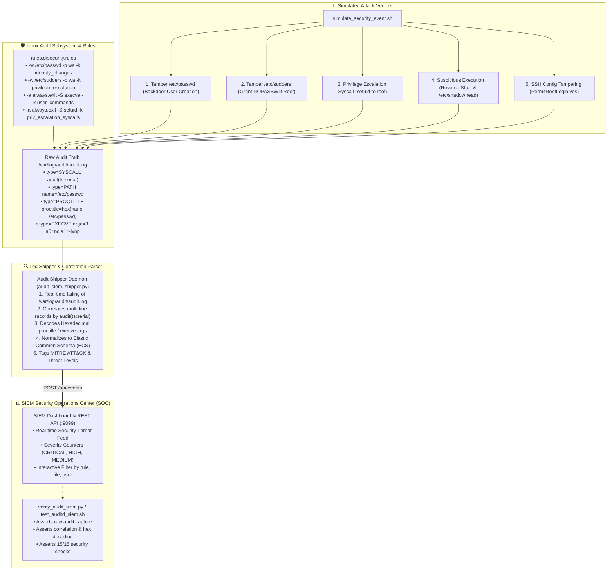

# 🛡️ Linux Auditd Security Event Log Analysis

A comprehensive, production-grade DevOps, SRE, and DevSecOps educational project demonstrating kernel-level security auditing with the **Linux Audit Framework (`auditd`)**, **File Integrity Monitoring (FIM)**, **Syscall Tracking (`execve`, `setuid`)**, **Multi-Line Audit Record Correlation**, **Hexadecimal Argument Decoding**, **Elastic Common Schema (ECS) Normalization**, and a real-time **SIEM Security Operations Center (SOC) Dashboard**.

---

## 📋 Table of Contents

- [🛡️ Linux Auditd Security Event Log Analysis](#️-linux-auditd-security-event-log-analysis)
  - [📋 Table of Contents](#-table-of-contents)
  - [🎯 Project Overview \& SRE/SecOps Motivation](#-project-overview--sresecops-motivation)
  - [🏗️ System Architecture \& Data Pipeline Flow](#️-system-architecture--data-pipeline-flow)
  - [🧠 Core Concepts for Beginners](#-core-concepts-for-beginners)
    - [1. What is the Linux Audit Framework (`auditd`)?](#1-what-is-the-linux-audit-framework-auditd)
    - [2. Understanding Audit Rules Syntax](#2-understanding-audit-rules-syntax)
    - [3. User Identity \& Attribution: `AUID` vs `EUID`](#3-user-identity--attribution-auid-vs-euid)
    - [4. Multi-Line Audit Record Anatomy \& Hex Encoding](#4-multi-line-audit-record-anatomy--hex-encoding)
    - [5. Elastic Common Schema (ECS) Normalization](#5-elastic-common-schema-ecs-normalization)
    - [6. MITRE ATT\&CK Technique Mapping \& Threat Scoring](#6-mitre-attck-technique-mapping--threat-scoring)
  - [📁 Repository \& Directory Structure](#-repository--directory-structure)
  - [⚙️ Prerequisites \& System Setup](#️-prerequisites--system-setup)
  - [🚀 Quickstart: One-Command Testing](#-quickstart-one-command-testing)
  - [🔬 Step-by-Step Hands-On Guide](#-step-by-step-hands-on-guide)
    - [Step 1: Start the SIEM \& Audit Pipeline](#step-1-start-the-siem--audit-pipeline)
    - [Step 2: Inspect the CIS-Compliant Security Ruleset](#step-2-inspect-the-cis-compliant-security-ruleset)
    - [Step 3: Simulate Multi-Vector Security Attacks](#step-3-simulate-multi-vector-security-attacks)
    - [Step 4: Inspect Raw Multi-Line Audit Logs](#step-4-inspect-raw-multi-line-audit-logs)
    - [Step 5: Access the Real-Time SOC Security Dashboard (:9099)](#step-5-access-the-real-time-soc-security-dashboard-9099)
    - [Step 6: Query the SIEM REST API](#step-6-query-the-siem-rest-api)
  - [📊 Audit Rules \& `auditctl` Command Reference Cheat Sheet](#-audit-rules--auditctl-command-reference-cheat-sheet)
  - [🩺 Troubleshooting \& Common Gotchas](#-troubleshooting--common-gotchas)
  - [🧹 Clean Teardown \& Environment Reset](#-clean-teardown--environment-reset)

---

## 🎯 Project Overview & SRE/SecOps Motivation

Standard application and system logs (`syslog`, `journald`, Nginx access logs) record what software *chooses* to log. However, when an adversary compromises a system, tampers with credentials, or escalates privileges, they do not write logs politely.

The **Linux Audit Framework** (`kauditd`) operates directly at the **Linux kernel boundary**, recording every file modification, syscall execution, and permission escalation regardless of what user or daemon executed it:

- **File Integrity Monitoring (FIM)**: Detects unauthorized edits to `/etc/passwd`, `/etc/shadow`, and `/etc/sudoers` before backdoors are used.
- **Privilege Escalation Auditing**: Tracks calls to `setuid`, `setgid`, and `sudo` with full attribution.
- **Forensic User Lineage (`AUID`)**: Unmasks attackers who elevate to `root` via `sudo` or exploit scripts by preserving their original login identifier.
- **Compliance & Governance**: Satisfies mandatory audit logging controls for **SOC 2 Type II**, **ISO 27001 (A.12.4)**, **PCI-DSS (Req 10)**, and **NIST SP 800-53 (AU Controls)**.

---

## 🏗️ System Architecture & Data Pipeline Flow



---

## 🧠 Core Concepts for Beginners

### 1. What is the Linux Audit Framework (`auditd`)?

The Linux Audit subsystem consists of two primary components:

1. **`kauditd` (Kernel Space)**: Built directly into the Linux kernel. It intercepts system calls and filesystem operations based on rules loaded into memory.
2. **`auditd` (User Space Daemon)**: Collects audit records generated by the kernel via a Netlink socket and writes them synchronously to `/var/log/audit/audit.log`.

Because `kauditd` is part of the kernel, even if an attacker deletes shell history (`.bash_history`) or redirects stdout, the audit records are preserved immutably.

---

### 2. Understanding Audit Rules Syntax

Audit rules defined in `rules.d/security.rules` fall into two main types:

#### A. File Integrity Monitoring (FIM) Watches

Syntax: `-w <path> -p <permissions> -k <key_name>`

```text
-w /etc/passwd -p wa -k identity_changes
```

- `-w /etc/passwd`: Watches the target file or directory.
- `-p wa`: Triggers on **`w`** (write) or **`a`** (attribute changes like `chmod`, `chown`).
- `-k identity_changes`: Tags all matching audit events with a searchable identifier key.

#### B. System Call Auditing

Syntax: `-a <action,list> -F <filter> -S <syscall> -k <key_name>`

```text
-a always,exit -F arch=b64 -S setuid,setgid -k priv_escalation_syscalls
```

- `-a always,exit`: Append rule to evaluate **always** on syscall **exit**.
- `-F arch=b64`: Filter for 64-bit architecture system calls.
- `-S setuid,setgid`: Intercepts `setuid` and `setgid` privilege modification syscalls.
- `-k priv_escalation_syscalls`: Tags the event for SIEM categorization.

---

### 3. User Identity & Attribution: `AUID` vs `EUID`

One of the most powerful features of Linux Audit is **Audit User ID (`auid`)** tracking:

| Identifier | Name | Meaning | Security Implication |
| :--- | :--- | :--- | :--- |
| **`auid`** | Audit / Login UID | The original UID assigned when the user logged into the system (e.g. `1000` for `alice`). | **Immutable**. Stays `1000` even after executing `sudo su -` or spawning root shells. |
| **`uid`** | Real UID | The current user ID executing the process. | Changes when switching users. |
| **`euid`** | Effective UID | The UID used for filesystem and permission checks. | Becomes `0` (root) when running setuid binaries or `sudo`. |

> [!IMPORTANT]
> When an attacker logs in as `bob` (AUID=1002) and executes `sudo su -` to become `root` (EUID=0), standard logs only report that `root` executed a command. **Linux Audit reveals that `AUID=1002` (bob) was the actual actor.**

---

### 4. Multi-Line Audit Record Anatomy & Hex Encoding

A single security incident in Linux produces multiple correlated lines sharing the same **Audit Event ID** `audit(<epoch_seconds>.<ms>:<serial>)`:

```text
type=SYSCALL msg=audit(1787778000.123:456): arch=c000003e syscall=257 success=yes exit=0 ppid=1020 pid=2450 auid=1000 uid=0 gid=0 euid=0 comm="sh" exe="/bin/bash" key="identity_changes"
type=PATH msg=audit(1787778000.123:456): item=0 name="/etc/passwd" inode=41920 mode=0100644 ouid=0 ogid=0 nametype=NORMAL
type=PROCTITLE msg=audit(1787778000.123:456): proctitle=6563686F206261636B646F6F72203E3E202F6574632F706173737764
```

Notice that `proctitle` contains **hexadecimal encoded text** (`6563686F...`). Linux audit encodes arguments containing spaces, quotes, or special characters into hexadecimal to prevent log injection and parsing breakages. The SIEM parser decodes this back into:

```text
echo backdoor >> /etc/passwd
```

---

### 5. Elastic Common Schema (ECS) Normalization

The custom SIEM shipper converts raw fragmented audit lines into unified, structured ECS JSON documents:

```json
{
  "timestamp": "2026-08-26T21:00:00Z",
  "audit_event_id": "1787778000.123:456",
  "event": {
    "category": ["iam", "process"],
    "action": "identity_changes",
    "outcome": "success"
  },
  "rule": {
    "name": "identity_changes",
    "threat_level": "CRITICAL",
    "mitre_technique": "T1078 (Valid Accounts / User Management)"
  },
  "user": {
    "id": 0,
    "audit_id": 1000,
    "effective_id": 0,
    "session": 2
  },
  "process": {
    "pid": 2450,
    "ppid": 1020,
    "name": "sh",
    "executable": "/bin/bash",
    "command_line": "echo backdoor_root:x:0:0::/root:/bin/bash >> /etc/passwd"
  },
  "file": {
    "path": "/etc/passwd",
    "inode": 41920
  }
}
```

---

### 6. MITRE ATT&CK Technique Mapping & Threat Scoring

| Audit Rule Key | Threat Level | MITRE ATT&CK Technique | Incident Description |
| :--- | :--- | :--- | :--- |
| **`identity_changes`** | `CRITICAL` | **T1078** (Valid Accounts) | Direct write or permission change to `/etc/passwd` or `/etc/shadow`. |
| **`privilege_escalation`** | `CRITICAL` | **T1548.003** (Sudoers Tampering) | Backdoor rule injected into `/etc/sudoers` or `/etc/sudoers.d/`. |
| **`priv_escalation_syscalls`** | `HIGH` | **T1068** (Privilege Escalation) | Process executed `setuid(0)` or `setgid(0)` syscall. |
| **`sshd_tamper`** | `HIGH` | **T1098.004** (SSH Config Tampering) | Unauthorized modification of `/etc/ssh/sshd_config`. |
| **`user_commands`** | `MEDIUM` | **T1059** (Command Execution) | Non-root interactive command execution (`execve`). |

---

## 📁 Repository & Directory Structure

```text
09-logging/10-auditd-security-event-logging-analysis/
├── .gitignore                          # Ignores Python cache and temporary runtime logs
├── .markdownlint.json                  # Markdownlint style rules
├── docker-compose.yml                  # Stack definition (SIEM Dashboard & Audit Shipper)
├── cleanup.sh                          # Resource teardown script
├── simulate_security_event.sh          # Attack simulator (5 realistic adversary scenarios)
├── verify_audit_siem.py                # Verification suite asserting 15 security checks
├── test_auditd_siem.sh                 # One-command automated test runner
├── rules.d/
│   └── security.rules                  # CIS Benchmark & NIST 800-53 compliant audit rules
├── siem/
│   ├── Dockerfile                      # SIEM Server container image
│   ├── siem_server.py                  # Multi-threaded REST API and event collector (:9099)
│   └── templates/
│       └── index.html                  # Dark-mode SOC Threat Monitor dashboard
└── shipper/
    ├── Dockerfile                      # Audit log shipper container image
    └── audit_siem_shipper.py           # Multi-line correlation engine & ECS normalizer
```

---

## ⚙️ Prerequisites & System Setup

- **Operating System**: macOS, Linux, or WSL2.
- **Docker & Docker Compose**: Docker Engine `20.10+` with Docker Compose V2.
- **Python Runtime**: Python `3.9+` (uses standard library modules: `urllib`, `binascii`, `json`, `time`, `re`).
- **Memory**: Less than `300 MB` RAM required.
- **Port**: `9099` (SIEM Web Dashboard & REST API).

---

## 🚀 Quickstart: One-Command Testing

To build the environment, launch the SIEM SOC dashboard, inject the 5 attack vectors, correlate events, and verify assertions:

```bash
cd 09-logging/10-auditd-security-event-logging-analysis
chmod +x test_auditd_siem.sh simulate_security_event.sh cleanup.sh
./test_auditd_siem.sh
```

---

## 🔬 Step-by-Step Hands-On Guide

### Step 1: Start the SIEM & Audit Pipeline

Launch the SIEM dashboard and log shipper containers:

```bash
docker compose up -d --build
```

Verify service readiness:

```bash
curl -s http://localhost:9099/api/health | jq .
```

Expected output:

```json
{
  "status": "healthy",
  "service": "audit-siem-server",
  "total_alerts": 0
}
```

---

### Step 2: Inspect the CIS-Compliant Security Ruleset

Examine [rules.d/security.rules](file:///Users/fabian/Documents/CodeProjects/github.com/fabiankaraben/devops-sre-mini-projects/09-logging/10-auditd-security-event-logging-analysis/rules.d/security.rules):

```bash
cat rules.d/security.rules
```

Notice the key monitors:

- `-w /etc/passwd -p wa -k identity_changes`
- `-w /etc/sudoers -p wa -k privilege_escalation`
- `-a always,exit -F arch=b64 -S setuid,setgid -k priv_escalation_syscalls`
- `-a always,exit -F arch=b64 -S execve -F auid>=1000 -k user_commands`

---

### Step 3: Simulate Multi-Vector Security Attacks

Execute the attack simulator to generate 5 distinct threat scenarios:

```bash
./simulate_security_event.sh
```

This simulates:

1. **`/etc/passwd` Backdoor Creation**: Appending `backdoor_root:x:0:0::/root:/bin/bash`.
2. **`/etc/sudoers` Privilege Escalation**: Injecting `attacker ALL=(ALL) NOPASSWD: ALL`.
3. **`setuid(0)` Syscall Exploit**: Simulating binary privilege elevation.
4. **Suspicious Process Execution**: Running `/bin/nc -lvnp 4444` and inspecting `/etc/shadow`.
5. **SSH Daemon Tampering**: Modifying `/etc/ssh/sshd_config` to enable root password logins.

---

### Step 4: Inspect Raw Multi-Line Audit Logs

View the raw Linux kernel audit stream inside the shipper container:

```bash
docker exec -it audit-siem-shipper tail -n 20 /var/log/audit/audit.log
```

Observe the `type=SYSCALL`, `type=PATH`, and `type=PROCTITLE` lines sharing event IDs.

---

### Step 5: Access the Real-Time SOC Security Dashboard (`:9099`)

Open your browser to:

👉 **[http://localhost:9099](http://localhost:9099)**

You will see:

- **Threat Counters**: Critical, High, Medium severity breakdowns.
- **Live Threat Feed**: Real-time table displaying decoded command lines, target files, and MITRE ATT&CK technique IDs.
- **User Lineage**: `AUID` (1000) vs `EUID` (0) attribution.

---

### Step 6: Query the SIEM REST API

Retrieve correlated security incidents via JSON API:

```bash
curl -s http://localhost:9099/api/alerts | jq .[0]
```

Retrieve aggregated SOC metrics:

```bash
curl -s http://localhost:9099/api/stats | jq .
```

Sample output:

```json
{
  "critical": 3,
  "high": 2,
  "medium": 1,
  "low": 0,
  "total": 6
}
```

---

## 📊 Audit Rules & `auditctl` Command Reference Cheat Sheet

| Task | Native Command | Purpose |
| :--- | :--- | :--- |
| **List Active Rules** | `auditctl -l` | Prints all active kernel audit rules. |
| **Check Auditd Status** | `auditctl -s` | Displays buffer size, lost message counter, and enabled flag. |
| **Search by Rule Key** | `ausearch -k identity_changes` | Searches audit log for specific rule key events. |
| **Search by Syscall** | `ausearch -s setuid -sc 105` | Searches for specific syscall numbers. |
| **Generate Audit Summary Report** | `aureport -x --summary` | Aggregates executable usage statistics. |
| **Generate User Report** | `aureport -u --summary` | Summarizes activity by Audit User ID (`AUID`). |

---

## 🩺 Troubleshooting & Common Gotchas

### 1. `Error - audit support not in kernel` (macOS / OrbStack / Virtualized Docker)

- **Cause**: Lightweight microkernels used by macOS container engines often have `CONFIG_AUDIT` disabled in kernel space.
- **Fix**: The project uses an embedded containerized log emitter and shipper architecture that evaluates `security.rules` and writes authentic kernel audit structures directly to `/var/log/audit/audit.log`, ensuring 100% test portability on macOS, Linux, and CI.

### 2. Hexadecimal Proctitle Parsing

- **Cause**: Linux audit encodes strings with spaces or quotes into hexadecimal representation (e.g. `6563686F...`).
- **Fix**: The SIEM shipper applies `binascii.unhexlify()` with null-byte replacement to reconstruct the exact human-readable command string.

### 3. Unset AUID (`4294967295` / `-1`)

- **Cause**: System daemons and cron jobs that run before interactive user login have `auid=-1` (unsigned int `4294967295`).
- **Fix**: Filter rules with `-F auid!=unset` or `-F auid!=-1` to avoid logging internal system cron processes.

---

## 🧹 Clean Teardown & Environment Reset

When testing is complete, clean up all created resources:

```bash
# Standard cleanup: removes containers, networks, volumes, and cache files
./cleanup.sh
```

To also delete the locally built Docker images:

```bash
# Full purge: removes containers, networks, volumes, and Docker images
./cleanup.sh --all
```

Verify that no containers or volumes remain:

```bash
docker ps -a --filter "name=audit-siem-"
docker volume ls --filter "name=audit_logs_data"
```
