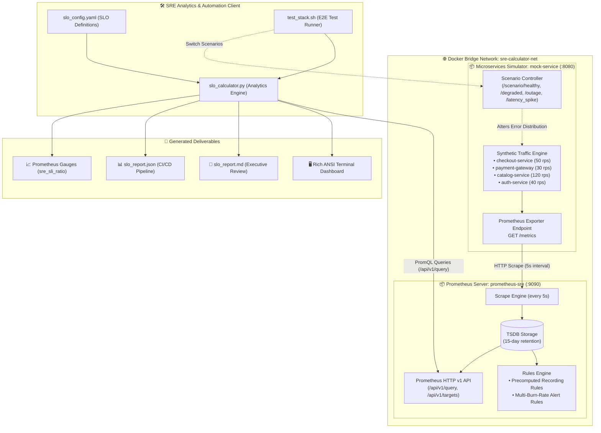

<!-- markdownlint-disable MD013 MD033 MD051 MD060 -->
# 01 - SLI, SLO, and Error Budget Calculator

> An enterprise-grade SRE analytics tool and local observability lab that queries Prometheus metrics across rolling time windows (1h, 24h, 7d, 30d), calculates **Service Level Indicators (SLIs)**, evaluates **Service Level Objectives (SLOs)**, measures **Error Budget Consumption**, computes real-time **Burn Rates**, estimates **Time to Budget Exhaustion**, and enforces automated CI/CD reliability gates.

---

## 📋 Table of Contents

1. [Architectural Overview & Data Flow](#-architectural-overview--data-flow)
   - [System Architecture Diagram](#system-architecture-diagram)
   - [End-to-End Metrics & Calculation Lifecycle](#end-to-end-metrics--calculation-lifecycle)
2. [Theoretical Deep-Dive for Beginners](#-theoretical-deep-dive-for-beginners)
   - [SRE Core Philosophy & Reliability Management](#sre-core-philosophy--reliability-management)
   - [The SRE Trinity: SLI vs. SLO vs. SLA](#the-sre-trinity-sli-vs-slo-vs-sla)
   - [Mathematical Formulations of SLIs & SLOs](#mathematical-formulations-of-slis--slos)
   - [Error Budgets: Balancing Innovation and Reliability](#error-budgets-balancing-innovation-and-reliability)
   - [Allowed Downtime Reference Table across Reliability Tiers](#allowed-downtime-reference-table-across-reliability-tiers)
   - [Error Budget Burn Rate & Multi-Window Mathematics](#error-budget-burn-rate--multi-window-mathematics)
   - [Rolling Windows vs Calendar Windows](#rolling-windows-vs-calendar-windows)
   - [PromQL Strategies for SRE Metrics Extraction](#promql-strategies-for-sre-metrics-extraction)
3. [Repository & Directory Structure](#-repository--directory-structure)
4. [Prerequisites & System Setup](#-prerequisites--system-setup)
5. [Quickstart Guide](#-quickstart-guide)
6. [Step-by-Step Hands-On Guide](#-step-by-step-hands-on-guide)
   - [Step 1: Inspect the Declarative SLO Configuration](#step-1-inspect-the-declarative-slo-configuration)
   - [Step 2: Start the Microservices & Prometheus Stack](#step-2-start-the-microservices--prometheus-stack)
   - [Step 3: Verify Real-Time Metrics Exposition & Prometheus Targets](#step-3-verify-real-time-metrics-exposition--prometheus-targets)
   - [Step 4: Execute the SRE Calculator in Interactive Terminal Mode](#step-4-execute-the-sre-calculator-in-interactive-terminal-mode)
   - [Step 5: Generate Publication-Grade Markdown & JSON Reports](#step-5-generate-publication-grade-markdown--json-reports)
   - [Step 6: Inject Operational Failure Scenarios](#step-6-inject-operational-failure-scenarios)
   - [Step 7: Test Strict CI/CD Reliability Gate Enforcement](#step-7-test-strict-cicd-reliability-gate-enforcement)
   - [Step 8: Execute the Complete Automated Test Suite](#step-8-execute-the-complete-automated-test-suite)
7. [PromQL SRE Query Cheat Sheet](#-promql-sre-query-cheat-sheet)
8. [Troubleshooting & Common Gotchas](#-troubleshooting--common-gotchas)
9. [Resource Teardown & Complete Cleanup](#-resource-teardown--complete-cleanup)

---

## 🏛️ Architectural Overview & Data Flow

### System Architecture Diagram



### End-to-End Metrics & Calculation Lifecycle

1. **Traffic Generation**: The `mock-service` simulates four independent business microservices, generating continuous synthetic HTTP traffic with realistic latency distributions and HTTP status codes.
2. **Prometheus Scraping**: Every 5 seconds, Prometheus pulls raw telemetry from `http://mock-service:8080/metrics` and persists samples into its TSDB.
3. **Continuous Pre-computation**: The Prometheus Rules Engine periodically evaluates recording rules to compute rolling request rates and good/error event ratios.
4. **SLO Query Evaluation**: `slo_calculator.py` reads `slo_config.yaml`, queries the Prometheus HTTP API with custom PromQL expressions across the configured time window (`{window}` $\rightarrow$ `1h`, `24h`, `7d`, `30d`), and extracts total and good event volumes.
5. **Mathematical Derivation**: The engine calculates SLI percentages, compares them against defined SLO targets, determines error budget consumption, evaluates burn rates, and computes time-to-exhaustion (TTE).
6. **Reporting & Gating**: The calculator outputs results to formatted terminal views, Markdown reports, JSON payloads for automated CI/CD quality gates, or Prometheus metric format.

---

## 🧠 Theoretical Deep-Dive for Beginners

### SRE Core Philosophy & Reliability Management

In Site Reliability Engineering (pioneered by Google), **100% availability is the wrong target for virtually all services**. Attempting to achieve 100% uptime:

- Exponentially increases infrastructure and engineering costs.
- Severely restricts release velocity and feature innovation.
- Delivers diminishing returns, because user client networks (cellular, ISP Wi-Fi) rarely achieve more than 99% to 99.9% reliability.

Instead, SRE treats reliability as a quantitative engineering balance managed through **SLIs**, **SLOs**, and **Error Budgets**.

```text
┌─────────────────────────────────────────────────────────────────────────┐
│                      THE SRE BALANCE OF RELIABILITY                     │
├─────────────────────────────────────────────────────────────────────────┤
│                                                                         │
│    Fast Innovation & Releases              System Stability             │
│    (Product Engineering)                   (SRE & Infrastructure)       │
│               │                                      │                  │
│               ▼                                      ▼                  │
│       [ Feature Velocity ] ◀══════════▶ [ Reliability & Uptime ]        │
│                                  ▲                                      │
│                                  │                                      │
│                     ┌────────────────────────┐                          │
│                     │      ERROR BUDGET      │                          │
│                     │  The Shared Currency   │                          │
│                     └────────────────────────┘                          │
│                                                                         │
│   • Budget Remaining (>0%):  Ship features, run chaos tests, refactor. │
│   • Budget Depleted (<=0%):  Freeze releases, focus 100% on stability. │
└─────────────────────────────────────────────────────────────────────────┘
```

---

### The SRE Trinity: SLI vs. SLO vs. SLA

Understanding the distinction between these three terms is fundamental to SRE:

```text
┌─────────────────────────────────────────────────────────────────────────┐
│                        SLI  vs.  SLO  vs.  SLA                          │
├─────────────────────────────────────────────────────────────────────────┤
│                                                                         │
│  1. SLI (Service Level Indicator)   ──▶  "What is the actual state?"   │
│     • A quantifiable metric measuring service performance.              │
│     • Example: 99.92% of requests succeeded over the last 30 days.      │
│                                                                         │
│  2. SLO (Service Level Objective)   ──▶  "What is our internal goal?"   │
│     • A target reliability percentage set by Engineering & Product.     │
│     • Example: Checkout service must maintain >= 99.90% availability.   │
│                                                                         │
│  3. SLA (Service Level Agreement)   ──▶  "What is our contract/penalty?"│
│     • A legal agreement with external customers with financial bounds.  │
│     • Example: If uptime < 99.5%, customer receives a 15% billing credit.│
│                                                                         │
└─────────────────────────────────────────────────────────────────────────┘
```

| Dimension | Service Level Indicator (SLI) | Service Level Objective (SLO) | Service Level Agreement (SLA) |
| :--- | :--- | :--- | :--- |
| **Audience** | SREs, Developers, Observability tools | Product Managers, Engineering Teams | Customers, Legal, Sales |
| **Nature** | Purely mathematical measurement | Internal engineering reliability target | External commercial contract |
| **Consequence of Breach** | None directly (it is raw data) | Release freeze, prioritize reliability fixes | Financial penalties, customer credits, breach of contract |
| **Target Level** | N/A (Measured value) | Stricter (e.g. 99.9%) | More lenient (e.g. 99.0%) to give buffer |

---

### Mathematical Formulations of SLIs & SLOs

Every SLI is structured as a ratio of good events over total valid events:

$$\text{SLI} = \frac{\sum \text{Good Events}}{\sum \text{Total Valid Events}} \times 100\%$$

#### 1. Availability SLI (Request-Based)

Good events are successful responses (typically HTTP non-5xx codes):

$$\text{SLI}_{\text{avail}} = \frac{\sum \text{HTTP Requests with Status} < 500}{\sum \text{All Valid HTTP Requests}} \times 100\%$$

#### 2. Latency SLI (Duration-Based)

Good events are requests served within a satisfactory latency threshold (e.g., $L \le 200\text{ms}$):

$$\text{SLI}_{\text{latency}} = \frac{\sum \text{HTTP Requests with Duration} \le 200\text{ms}}{\sum \text{All Valid HTTP Requests}} \times 100\%$$

---

### Error Budgets: Balancing Innovation and Reliability

The **Error Budget** represents the total allowable unreliability of a service over a designated time window:

$$\text{Error Budget}_{\%} = 100\% - \text{SLO Target}_{\%}$$

$$\text{Allowed Error Rate} = 1 - \frac{\text{SLO Target}_{\%}}{100}$$

$$\text{Actual Error Rate} = 1 - \frac{\text{SLI}_{\%}}{100}$$

#### Error Budget Consumption

$$\text{Budget Consumed}_{\%} = \frac{\text{Actual Error Rate}}{\text{Allowed Error Rate}} \times 100\% = \frac{100\% - \text{SLI}_{\%}}{100\% - \text{SLO Target}_{\%}} \times 100\%$$

#### Remaining Error Budget

$$\text{Remaining Budget}_{\%} = 100\% - \text{Budget Consumed}_{\%}$$

---

### Allowed Downtime Reference Table across Reliability Tiers

The table below illustrates the maximum allowable downtime for various SLO targets across rolling time windows:

| SLO Target ("Nines") | Error Budget (%) | Allowed Downtime / 1 Day | Allowed Downtime / 7 Days | Allowed Downtime / 30 Days | Allowed Downtime / 1 Year |
| :--- | :--- | :--- | :--- | :--- | :--- |
| **99.0% ("Two Nines")** | $1.0\%$ | 14.4 minutes | 1.68 hours | 7.20 hours | 3.65 days |
| **99.5%** | $0.5\%$ | 7.2 minutes | 50.4 minutes | 3.60 hours | 1.83 days |
| **99.9% ("Three Nines")** | $0.1\%$ | 1.44 minutes | 10.08 minutes | **43.20 minutes** | 8.76 hours |
| **99.95%** | $0.05\%$ | 43.2 seconds | 5.04 minutes | **21.60 minutes** | 4.38 hours |
| **99.99% ("Four Nines")** | $0.01\%$ | 8.64 seconds | 1.01 minutes | 4.32 minutes | 52.60 minutes |
| **99.999% ("Five Nines")**| $0.001\%$ | 0.86 seconds | 6.05 seconds | 25.92 seconds | 5.26 minutes |

---

### Error Budget Burn Rate & Multi-Window Mathematics

The **Burn Rate** is the acceleration factor at which an error budget is consumed relative to its planned rate over a window:

$$\text{Burn Rate} = \frac{\text{Observed Error Rate}}{\text{Allowed Error Rate}} = \frac{1 - \text{SLI}}{1 - \text{SLO Target}}$$

```text
┌─────────────────────────────────────────────────────────────────────────┐
│                      BURN RATE INTERPRETATION                           │
├─────────────────────────────────────────────────────────────────────────┤
│  • Burn Rate = 1.0  ──▶ Consumes exactly 100% of budget over the window. │
│                         (Sustainable, on-target operation)              │
│                                                                         │
│  • Burn Rate < 1.0  ──▶ Under-burning budget. High reliability reserve. │
│                         (Safe to deploy features / run experiments)     │
│                                                                         │
│  • Burn Rate = 6.0  ──▶ Consumes 5% of 30d budget in 6 hours.           │
│                         (100% budget consumed in 5 days)                │
│                                                                         │
│  • Burn Rate = 14.4 ──▶ Consumes 2% of 30d budget in 1 hour.            │
│                         (100% budget consumed in 50 hours / 2 days)     │
│                                                                         │
│  • Burn Rate = 1000 ──▶ 100% outage: 100% of 30d budget gone in 43 mins!│
└─────────────────────────────────────────────────────────────────────────┘
```

#### Time to Exhaustion (TTE)

Estimated remaining operational hours before the error budget is entirely consumed:

$$\text{TTE (Hours)} = \frac{\text{Remaining Error Budget}_{\%}}{\text{Burn Rate} \times \left( \frac{100\% - \text{SLO Target}_{\%}}{\text{Window Hours}} \right)}$$

---

### Rolling Windows vs Calendar Windows

SRE standardizes on **Rolling Windows** (e.g. trailing 30 days) rather than calendar months:

- **No Artificial Resets**: On a calendar window, a massive outage on the 31st of the month is "forgotten" on the 1st of the next month, resetting the budget and misrepresenting user experience.
- **Consistent User Experience**: A rolling 30-day window ensures that any 30-day period experienced by users meets the stated reliability target.

---

### PromQL Strategies for SRE Metrics Extraction

Prometheus provides powerful aggregations for calculating rates and histograms over time windows:

#### 1. Availability PromQL

$$\text{SLI Availability Ratio} = \frac{\text{sum}\left(\text{rate}\left(\text{http\_requests\_total}\{\text{status}!\sim\text{"5.."}\}[\{window\}]\right)\right)}{\text{sum}\left(\text{rate}\left(\text{http\_requests\_total}[\{window\}]\right)\right)}$$

#### 2. Latency PromQL (using histogram bucket $\le 0.2\text{s}$)

$$\text{SLI Latency Ratio} = \frac{\text{sum}\left(\text{rate}\left(\text{http\_request\_duration\_seconds\_bucket}\{\text{le}="0.2"\}[\{window\}]\right)\right)}{\text{sum}\left(\text{rate}\left(\text{http\_request\_duration\_seconds\_count}[\{window\}]\right)\right)}$$

---

## 📁 Repository & Directory Structure

```text
10-sre-and-reliability/01-sli-slo-error-budget-calculator/
├── .gitignore                      # Git ignore file for Python cache, test reports & logs
├── Dockerfile.mock                 # Container image packaging the mock microservices simulator
├── Dockerfile.prometheus           # Container image packaging Prometheus with custom configs & rules
├── README.md                       # Comprehensive educational documentation & user guide
├── cleanup.sh                      # Resource teardown script for containers, volumes, networks & images
├── docker-compose.yml              # Multi-container orchestration definition
├── mock_prometheus_metrics.py      # Microservice traffic & metrics simulator with scenario engine
├── prometheus.yml                  # Prometheus scrape configuration
├── requirements.txt                # Minimal Python runtime dependencies (pyyaml, requests)
├── rules/
│   └── slo_recording_rules.yml     # Prometheus recording and multi-burn-rate alerting rules
├── slo_calculator.py               # Core SRE CLI analytics engine & report generator
├── slo_config.yaml                 # Multi-service declarative SLO specification
└── test_stack.sh                   # End-to-end automated validation test harness
```

---

## 🔧 Prerequisites & System Setup

Ensure the following tools are installed on your host system:

- **Docker & Docker Compose**: Docker 24.0+ and Docker Compose v2+.
- **Python 3**: Python 3.9+ (standard library only; `pyyaml` and `requests` are optional).
- **curl**: For interacting with the mock scenario engine.

---

## ⚡ Quickstart Guide

To start the monitoring environment and evaluate your first SLO calculation in less than 30 seconds:

```bash
cd 10-sre-and-reliability/01-sli-slo-error-budget-calculator

# 1. Start the Docker Compose stack
docker compose up -d --build

# 2. Wait 10 seconds for initial scrapes, then calculate SLOs
python3 slo_calculator.py --prometheus-url http://localhost:9090

# 3. Clean up when finished
./cleanup.sh
```

---

## 🚀 Step-by-Step Hands-On Guide

### Step 1: Inspect the Declarative SLO Configuration

Open `slo_config.yaml` to examine how SLOs and SLIs are defined declaratively:

```yaml
version: "1.0"
team: "Core SRE & Platform Reliability"
default_window: "30d"

services:
  - id: "checkout_service_availability"
    name: "Checkout Service Availability"
    service: "checkout-service"
    tier: "tier-1-critical"
    type: "availability"
    description: "Percentage of non-5xx HTTP responses for checkout transactions"
    target: 99.9
    window: "30d"
    good_query: 'sum(rate(http_requests_total{service="checkout-service",status!~"5.."}[{window}]))'
    total_query: 'sum(rate(http_requests_total{service="checkout-service"}[{window}]))'
    burn_rate_thresholds:
      critical: 14.4
      warning: 6.0
```

---

### Step 2: Start the Microservices & Prometheus Stack

Build and start the containerized stack:

```bash
docker compose up -d --build
```

Verify that both containers are running and healthy:

```bash
docker compose ps
```

*Expected Output:*

```text
NAME             IMAGE                            COMMAND                  SERVICE        CREATED         STATUS                   PORTS
mock-service     sre-mock-metrics:latest          "python3 mock_promet…"   mock-service   5 seconds ago   Up 5 seconds (healthy)   0.0.0.0:8080->8080/tcp
prometheus-sre   prometheus-sre-stack:v2.54.1     "/bin/prometheus --c…"   prometheus     5 seconds ago   Up 5 seconds (healthy)   0.0.0.0:9090->9090/tcp
```

---

### Step 3: Verify Real-Time Metrics Exposition & Prometheus Targets

#### Inspect Raw Prometheus Metrics from Mock Service

```bash
curl -s http://localhost:8080/metrics | grep -E "http_requests_total|http_request_duration_seconds" | head -n 15
```

#### Check Active Prometheus Targets

```bash
curl -s http://localhost:9090/api/v1/targets | grep -o '"health":"up"'
```

You should see `"health":"up"` for all configured scrape targets.

---

### Step 4: Execute the SRE Calculator in Interactive Terminal Mode

Run the calculator against the live Prometheus instance:

```bash
python3 slo_calculator.py --prometheus-url http://localhost:9090 --format table
```

*Terminal Dashboard Output:*

```text
========================================================================================================
  📊 SRE SERVICE LEVEL OBJECTIVE (SLO) & ERROR BUDGET CALCULATOR DASHBOARD
========================================================================================================
Team: Core SRE & Platform Reliability | Prometheus: http://localhost:9090 | Generated: 2026-08-23 08:13:03 UTC

  Overall Health:  PASS   |  Total SLOs: 4  |  Healthy: 3  |  Warning: 1  |  Critical: 0  |  Breached: 0

SERVICE & SLO NAME               TIER            WINDOW   TARGET    SLI ACTUAL   BUDGET LEFT        BURN RATE   STATUS        
-------------------------------- --------------- -------- --------- ------------ ------------------ ----------- --------------
Checkout Service Availability    tier-1-critical 30d      99.90%     99.960%   █████░░░  60.0%   0.40x   🟢 HEALTHY     
Payment Gateway Availability     tier-1-critical 30d      99.95%     99.960%   ██░░░░░░  20.0%   0.80x   🟡 WARNING     
Product Catalog Latency          tier-2-standard 30d      95.00%     99.960%   ████████  99.2%   0.01x   🟢 HEALTHY     
Auth Service Availability        tier-1-critical 7d       99.50%     99.960%   ███████░  92.0%   0.08x   🟢 HEALTHY     
========================================================================================================

📌 SRE OPERATIONAL GUIDANCE & BUDGET REMEDIATION:
  ✔ [Checkout Service Availability]: Operating nominally. SLI (99.960%) exceeds target (99.90%).
  ⚡ [Payment Gateway Availability]: Elevated burn rate (0.8x >= 6.0x). Budget remaining: 20.0%. Action: Monitor burn rate progression.
  ✔ [Product Catalog Latency]: Operating nominally. SLI (99.960%) exceeds target (95.00%).
  ✔ [Auth Service Availability]: Operating nominally. SLI (99.960%) exceeds target (99.50%).
```

---

### Step 5: Generate Publication-Grade Markdown & JSON Reports

#### Generate Markdown Report for Team Reviews

```bash
python3 slo_calculator.py --prometheus-url http://localhost:9090 --format markdown --output slo_report.md
cat slo_report.md
```

#### Generate JSON Report for Pipeline Automation

```bash
python3 slo_calculator.py --prometheus-url http://localhost:9090 --format json --output slo_report.json
cat slo_report.json | grep -A 10 "summary"
```

---

### Step 6: Inject Operational Failure Scenarios

The simulator includes real-time operational failure injection via its HTTP REST API.

#### Scenario 1: Minor Degradation (Elevated Burn Rate)

Inject a minor error rate ($0.8\%$ failures) into the services:

```bash
curl -X POST http://localhost:8080/scenario/minor_degradation
sleep 6
python3 slo_calculator.py --prometheus-url http://localhost:9090 --window 1m --format table
```

*Observation*: Notice how the Checkout Availability SLO burn rate surges to $>4.0\text{x}$, triggering a warning state.

#### Scenario 2: Major Catastrophic Outage (SLO Breach)

Simulate a major outage ($18\%$ 5xx failures):

```bash
curl -X POST http://localhost:8080/scenario/major_outage
sleep 6
python3 slo_calculator.py --prometheus-url http://localhost:9090 --window 1m --format table
```

*Observation*: Status changes to `🔴 BREACHED`, error budget is completely exhausted, and SRE guidance advises immediate deployment freezing.

#### Scenario 3: High Latency Degradation

Simulate a severe database slowdown causing latency spikes without HTTP 500 errors:

```bash
curl -X POST http://localhost:8080/scenario/latency_spike
sleep 6
python3 slo_calculator.py --prometheus-url http://localhost:9090 --window 1m --format table
```

*Observation*: Product Catalog Latency drops below its 95% threshold target.

#### Reset to Nominal State

```bash
curl -X POST http://localhost:8080/scenario/healthy
```

---

### Step 7: Test Strict CI/CD Reliability Gate Enforcement

Use the `--strict` flag in CI/CD deployment pipelines (e.g. GitHub Actions, GitLab CI) to automatically block deployments when error budgets are breached:

```bash
# While in healthy state: exits with code 0 (Pipeline Passes)
python3 slo_calculator.py --prometheus-url http://localhost:9090 --strict
echo "Exit Code: $?"

# Simulate outage:
curl -X POST http://localhost:8080/scenario/major_outage
sleep 6

# Strict mode evaluates breach and exits with code 1 (Pipeline Blocked!)
python3 slo_calculator.py --prometheus-url http://localhost:9090 --window 1m --strict
echo "Exit Code: $?"

# Return to healthy
curl -X POST http://localhost:8080/scenario/healthy
```

---

### Step 8: Execute the Complete Automated Test Suite

Run the full end-to-end test suite to validate all 16 automated assertions:

```bash
./test_stack.sh
```

---

## 📊 PromQL SRE Query Cheat Sheet

| Use Case | PromQL Expression |
| :--- | :--- |
| **Availability SLI (30d)** | `sum(rate(http_requests_total{status!~"5.."}[30d])) / sum(rate(http_requests_total[30d])) * 100` |
| **Latency SLI (200ms)** | `sum(rate(http_request_duration_seconds_bucket{le="0.2"}[30d])) / sum(rate(http_request_duration_seconds_count[30d])) * 100` |
| **Current Error Rate** | `1 - (sum(rate(http_requests_total{status!~"5.."}[5m])) / sum(rate(http_requests_total[5m])))` |
| **Burn Rate (99.9% SLO)** | `(1 - (sum(rate(http_requests_total{status!~"5.."}[1h])) / sum(rate(http_requests_total[1h])))) / 0.001` |
| **95th Percentile Latency** | `histogram_quantile(0.95, sum by (le) (rate(http_request_duration_seconds_bucket[5m])))` |
| **Throughput (Requests/sec)**| `sum by (service) (rate(http_requests_total[5m]))` |

---

## 🔍 Troubleshooting & Common Gotchas

### 1. Prometheus Scrape Range Too Large for Fresh TSDB

- **Symptom**: Querying `rate(...[30d])` on a local instance started 20 seconds ago returns empty or flat rates.
- **Cause**: Prometheus `rate()` requires at least 2 samples within the specified range. On fresh environments without 30 days of data, use `--window 1m` or `--window 5m` for instantaneous evaluation.

### 2. Port Conflicts (8080 or 9090 in use)

- **Symptom**: `Bind for 0.0.0.0:8080 failed: port is already allocated`.
- **Solution**: Check running processes with `lsof -i :8080` or `lsof -i :9090` and terminate conflicting containers, or change ports in `docker-compose.yml`.

### 3. Counter Resets on Container Restart

- **Symptom**: Cumulative requests reset to zero when restarting `mock-service`.
- **Solution**: Prometheus `rate()` and `increase()` functions automatically detect counter resets (where current sample < previous sample) and compensate for resets seamlessly.

---

## 🧹 Resource Teardown & Complete Cleanup

To guarantee a clean environment and prevent orphaned resources from affecting other mini-projects, use the provided cleanup script:

### Standard Teardown (Containers, Networks, Volumes & Reports)

```bash
./cleanup.sh
```

*What gets deleted:*

- Docker containers `prometheus-sre` and `mock-service`.
- Docker bridge network `sre-calculator-net`.
- Docker named volume `prometheus_sre_data` (Prometheus TSDB).
- Temporary reports `slo_report.md`, `slo_report.json`, logs, and Python `__pycache__`.

### Complete Purge (Including Docker Container Images)

To also remove the built and downloaded Docker container images:

```bash
./cleanup.sh --all
```

*Result*:

```text
======================================================================
  🧹 Cleaning Up SLI, SLO & Error Budget Calculator Stack
======================================================================

▶ [1/3] Tearing down containers, network, and TSDB named volumes...
  [OK] Containers 'prometheus-sre' and 'mock-service' stopped and removed.
  [OK] Network 'sre-calculator-net' removed.
  [OK] Named volume 'prometheus_sre_data' deleted.

▶ [2/3] Purging Prometheus and Mock Service container images...
  [OK] Docker images 'sre-mock-metrics:latest' and 'prometheus-sre-stack:v2.54.1' removed.

▶ [3/3] Removing local temporary test artifacts, reports and cache...
  [OK] Temporary files and generated reports cleaned.

✨ Environment is completely clean! Ready for subsequent projects.
```
