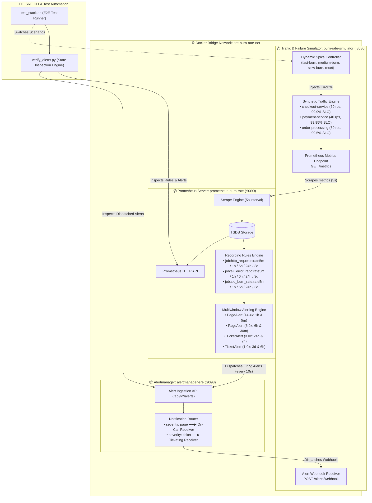
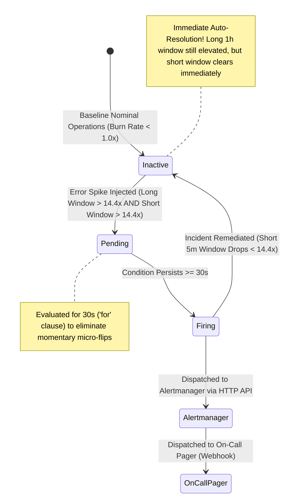

<!-- markdownlint-disable MD013 MD033 MD051 MD060 -->
# 02 - Multiwindow Multi-Burn-Rate Alerting Rules

> A production-grade implementation of the **Google SRE Multiwindow Multi-Burn-Rate Alerting** architecture in **Prometheus** and **Alertmanager**, featuring precomputed time-series recording rules, synthetic error rate spike injection (150x fast burn, 15x medium burn, 3x slow drain), zero alert fatigue, immediate auto-resolution upon incident remediation, and an automated verification test suite.

---

## 📋 Table of Contents

1. [Architectural Overview & Alert Flow](#-architectural-overview--alert-flow)
   - [System Architecture Diagram](#system-architecture-diagram)
   - [Multiwindow Alerting Lifecycle & State Machine](#multiwindow-alerting-lifecycle--state-machine)
2. [Theoretical Deep-Dive for Beginners](#-theoretical-deep-dive-for-beginners)
   - [Why Traditional Alerting Fails at Scale](#why-traditional-alerting-fails-at-scale)
   - [The Google SRE Multiwindow Multi-Burn-Rate Solution](#the-google-sre-multiwindow-multi-burn-rate-solution)
   - [Mathematical Derivation of Error Budget Burn Rates](#mathematical-derivation-of-error-budget-burn-rates)
   - [The Google SRE 30-Day Alerting Matrix](#the-google-sre-30-day-alerting-matrix)
   - [Why the 1/12th Short Window Prevents High Reset Times](#why-the-112th-short-window-prevents-high-reset-times)
   - [Recording Rules Architecture for Efficient Evaluation](#recording-rules-architecture-for-efficient-evaluation)
   - [Alertmanager Routing: Pages vs. Tickets](#alertmanager-routing-pages-vs-tickets)
3. [Repository & Directory Structure](#-repository--directory-structure)
4. [Prerequisites & System Setup](#-prerequisites--system-setup)
5. [Quickstart Guide](#-quickstart-guide)
6. [Step-by-Step Hands-On Guide](#-step-by-step-hands-on-guide)
   - [Step 1: Inspect Prometheus Multi-Burn-Rate Rules](#step-1-inspect-prometheus-multi-burn-rate-rules)
   - [Step 2: Start the Prometheus & Alertmanager Stack](#step-2-start-the-prometheus--alertmanager-stack)
   - [Step 3: Verify Scrape Targets & Prometheus Web UI](#step-3-verify-scrape-targets--prometheus-web-ui)
   - [Step 4: Run the SRE Alert Verification CLI in Baseline Mode](#step-4-run-the-sre-alert-verification-cli-in-baseline-mode)
   - [Step 5: Inject Fast Burn Spike (15% Error Rate) & Trigger 14.4x Page Alert](#step-5-inject-fast-burn-spike-15-error-rate--trigger-144x-page-alert)
   - [Step 6: Verify Alertmanager Notification Routing & Webhook Delivery](#step-6-verify-alertmanager-notification-routing--webhook-delivery)
   - [Step 7: Remediate Traffic & Observe Immediate Multiwindow Auto-Resolution](#step-7-remediate-traffic--observe-immediate-multiwindow-auto-resolution)
   - [Step 8: Execute the Complete Automated Test Suite](#step-8-execute-the-complete-automated-test-suite)
7. [PromQL SRE Alerting Cheat Sheet](#-promql-sre-alerting-cheat-sheet)
8. [Troubleshooting & Common Gotchas](#-troubleshooting--common-gotchas)
9. [Resource Teardown & Complete Cleanup](#-resource-teardown--complete-cleanup)

---

## 🏛️ Architectural Overview & Alert Flow

### System Architecture Diagram



### Multiwindow Alerting Lifecycle & State Machine



---

## 🧠 Theoretical Deep-Dive for Beginners

### Why Traditional Alerting Fails at Scale

Traditional monitoring configurations rely on single-window threshold alerts. Both short and long windows suffer from severe structural flaws:

```text
┌─────────────────────────────────────────────────────────────────────────┐
│                 THE TRADITIONAL ALERTING DILEMMA                        │
├─────────────────────────────────────────────────────────────────────────┤
│                                                                         │
│  Approach 1: Short Window Alerting (e.g. 5-minute Error Rate > 0.1%)   │
│  ───────────────────────────────────────────────────────────────────    │
│  ❌ PROBLEM: Extreme Alert Fatigue & Noise.                              │
│     A momentary burst of 10 failed requests in 5 minutes pages the SRE │
│     at 3 AM, only to auto-resolve 2 minutes later before anyone logs in.│
│                                                                         │
│  Approach 2: Long Window Alerting (e.g. 24-hour Error Rate > 0.1%)     │
│  ─────────────────────────────────────────────────────────────────      │
│  ❌ PROBLEM 1: Unacceptable Detection Delay.                             │
│     A 100% complete blackout takes hours to raise the 24-hour average.  │
│  ❌ PROBLEM 2: Terrible Reset Time (Long Tail Firing).                  │
│     When you fix the bug in 10 minutes, the alert keeps FIRING for the  │
│     next 23 hours because the 24h average remains mathematically high!  │
│                                                                         │
└─────────────────────────────────────────────────────────────────────────┘
```

---

### The Google SRE Multiwindow Multi-Burn-Rate Solution

Google SRE solved this dilemma with **Multiwindow Multi-Burn-Rate Alerting** (detailed in *Site Reliability Engineering: How Google Runs Production Systems* and the *Google SRE Workbook*, Chapter 5).

An alert triggers **ONLY when BOTH conditions are satisfied simultaneously**:

1. **Long Window Condition**: The error rate over the long window exceeds the threshold (ensuring a statistically significant percentage of error budget is being consumed).
2. **Short Window Condition**: The error rate over the short window ($1/12\text{th}$ of the long window) *also* exceeds the threshold (ensuring the problem is **actively occurring right now**).

$$\text{Alert Expression} = \left( \text{BurnRate}_{\text{LongWindow}} > T \right) \;\mathbf{and}\; \left( \text{BurnRate}_{\text{ShortWindow}} > T \right)$$

---

### Mathematical Derivation of Error Budget Burn Rates

The **Burn Rate** is the acceleration multiplier indicating how fast your service is consuming its allotted Error Budget:

$$\text{Burn Rate} = \frac{\text{Observed Error Rate}}{\text{Allowed Error Rate}} = \frac{1 - \text{SLI}}{1 - \text{SLO Target}}$$

#### Example for a 99.9% SLO (30-day Window = 720 Hours)

- $\text{SLO Target} = 99.9\%$
- $\text{Allowed Error Rate} = 100\% - 99.9\% = 0.1\% = 0.001$
- **Baseline (Burn Rate = 1.0)**: Consumes exactly $100\%$ of the budget over the 30-day window (sustainable).
- **14.4x Burn Rate**:
  $$\text{Observed Error Rate} = 14.4 \times 0.001 = 0.0144 = 1.44\% \text{ errors}$$
  $$\text{Budget Consumed in 1 Hour} = \frac{14.4 \text{ hours of budget}}{720 \text{ hours in 30 days}} = 2.0\% \text{ of 30-day budget per hour!}$$
  $$\text{Time to 100% Budget Exhaustion} = \frac{720 \text{ hours}}{14.4} = 50 \text{ hours (2.1 days)}$$

---

### The Google SRE 30-Day Alerting Matrix

The standard Google SRE alerting matrix defines four alert pairs protecting a 30-day (720-hour) rolling SLO:

| Alert Severity | Burn Rate | % Budget Consumed | Long Window | Short Window (1/12th) | Time to 100% Depletion | Channel & Action |
| :--- | :---: | :---: | :---: | :---: | :---: | :--- |
| **Critical Page** | **$14.4\times$** | **$2.0\%$ in 1 hour** | **1 hour** | **5 minutes** | 50 hours (2.1 days) | **Pager (24/7 immediate wake-up)** |
| **High Page** | **$6.0\times$** | **$5.0\%$ in 6 hours** | **6 hours** | **30 minutes** | 120 hours (5 days) | **Pager (immediate response)** |
| **Warning Ticket** | **$3.0\times$** | **$10.0\%$ in 24 hours** | **24 hours** | **2 hours** | 240 hours (10 days) | **Ticketing Queue (next business day)**|
| **Notice Ticket** | **$1.0\times$** | **$10.0\%$ in 3 days** | **3 days** | **6 hours** | 720 hours (30 days) | **Weekly SRE Review / Post-Mortem** |

---

### Why the 1/12th Short Window Prevents High Reset Times

Consider an outage that causes a $15\times$ burn rate for 15 minutes and is then fixed:

```text
Outage Starts                     Outage Fixed (Remediation)
    │                                  │
    ▼                                  ▼
────███████████████████████████████████──────────────────────────────────▶ Time
    ◀──────── 15 minutes ─────────────▶

Single 1h Window Alert:
• Error rate over 1h remains > 14.4x for the NEXT 45 MINUTES!
• Result: On-call engineer continues receiving alerts for a solved issue.

Google Multiwindow Alert (1h Long + 5m Short):
• The 1h Long window remains elevated.
• BUT the 5m Short window drops to 0.0x within 5 minutes of the fix!
• Because BOTH windows must be > 14.4x, the alert RESOLVES IMMEDIATELY!
```

---

### Recording Rules Architecture for Efficient Evaluation

Evaluating multi-window queries directly in alert expressions across millions of raw time series places heavy CPU load on Prometheus. To optimize performance, SRE practices use **Precomputed Recording Rules**:

```text
Raw Metrics: http_requests_total
    │
    ▼ (Evaluated every 5s)
Recording Rules:
├── job:http_requests:rate5m
├── job:http_requests_errors:rate5m
└── job:slo_burn_rate:rate5m  ──▶ (Errors / Total) / Allowed_Error_Rate
    │
    ▼
Alerting Rule Expression:
job:slo_burn_rate:rate1h > 14.4 and job:slo_burn_rate:rate5m > 14.4
```

---

### Alertmanager Routing: Pages vs. Tickets

Not all SLO burn rates warrant waking up an engineer at night. Alertmanager routes alerts according to severity:

```yaml
route:
  group_by: ['alertname', 'service', 'severity']
  routes:
    # Critical and High pages dispatch immediately to 24/7 on-call rotation
    - match:
        severity: page
      receiver: "on-call-pager-receiver"
      group_wait: 2s
      repeat_interval: 15m

    # Moderate and slow budget drains dispatch to asynchronous ticketing queues
    - match:
        severity: ticket
      receiver: "ticketing-queue-receiver"
      group_wait: 10s
      repeat_interval: 4h
```

---

## 📁 Repository & Directory Structure

```text
10-sre-and-reliability/02-multiwindow-multi-burn-rate-alerts/
├── .gitignore                      # Git ignore rules for bytecode, reports & logs
├── Dockerfile.alertmanager         # Container image packaging Alertmanager and routing configuration
├── Dockerfile.prometheus           # Container image packaging Prometheus with multi-burn-rate rules
├── Dockerfile.simulator            # Container image packaging the Python traffic & spike generator
├── README.md                       # Comprehensive educational documentation & user guide
├── alertmanager.yml                # Alertmanager routing and webhook configuration
├── burn_rate_simulator.py          # Microservices traffic engine & real-time failure injection API
├── cleanup.sh                      # Resource teardown script for containers, volumes, networks & images
├── docker-compose.yml              # Multi-container orchestration definition
├── prometheus.yml                  # Prometheus scrape configuration and Alertmanager target
├── requirements.txt                # Python runtime dependencies (pyyaml, requests)
├── rules/
│   └── slo_alerts.yml              # Production Google SRE recording rules & multi-burn-rate alert rules
├── test_stack.sh                   # Automated end-to-end test suite
└── verify_alerts.py                # SRE alert state verification CLI and report generator
```

---

## 🔧 Prerequisites & System Setup

Ensure the following tools are installed on your system:

- **Docker & Docker Compose**: Docker 24.0+ and Docker Compose v2+.
- **Python 3**: Python 3.9+.
- **curl**: For triggering error rate injection endpoints.

---

## ⚡ Quickstart Guide

Start the entire SRE alerting lab in less than 30 seconds:

```bash
cd 10-sre-and-reliability/02-multiwindow-multi-burn-rate-alerts

# 1. Start the Prometheus, Alertmanager & Simulator stack
docker compose up -d --build

# 2. Verify alert states in real-time
python3 verify_alerts.py --format table

# 3. Clean up when finished
./cleanup.sh
```

---

## 🚀 Step-by-Step Hands-On Guide

### Step 1: Inspect Prometheus Multi-Burn-Rate Rules

Open `rules/slo_alerts.yml` to see the exact multiwindow rule logic:

```yaml
- alert: ErrorBudgetBurnRatePage14_4x
  expr: |
    (
      job:slo_burn_rate:rate1h > 14.4
      and
      job:slo_burn_rate:rate5m > 14.4
    )
  for: 30s
  labels:
    severity: page
    urgency: critical
```

---

### Step 2: Start the Prometheus & Alertmanager Stack

Build and start all containerized services:

```bash
docker compose up -d --build
```

Verify that all three services are up and healthy:

```bash
docker compose ps
```

*Expected Output:*

```text
NAME                     IMAGE                               COMMAND                  SERVICE               STATUS
alertmanager-sre         alertmanager-sre-stack:v0.27.0      "/bin/alertmanager -…"   alertmanager          Up (healthy)
burn-rate-simulator      sre-burn-rate-simulator:latest      "python3 burn_rate_s…"   burn-rate-simulator   Up (healthy)
prometheus-burn-rate     prometheus-burn-rate-stack:v2.54.1   "/bin/prometheus --c…"   prometheus            Up (healthy)
```

---

### Step 3: Verify Scrape Targets & Prometheus Web UI

- Open your browser to `http://localhost:9090/alerts` to inspect the Prometheus Alerts dashboard.
- Open `http://localhost:9090/rules` to inspect the recording rules.
- Open `http://localhost:9093` to view the Alertmanager UI.

---

### Step 4: Run the SRE Alert Verification CLI in Baseline Mode

Execute `verify_alerts.py` to inspect real-time burn rates and alert rule states:

```bash
python3 verify_alerts.py --format table
```

*Terminal Dashboard Output:*

```text
========================================================================================================
  🚨 GOOGLE SRE MULTIWINDOW MULTI-BURN-RATE ALERTING DASHBOARD
========================================================================================================
Prometheus: http://localhost:9090 | Alertmanager: http://localhost:9093 | Time: 2026-08-23 08:25:18 UTC

  Active Traffic Profile: [HEALTHY]  |  Error Rate: 0.020%  |  Processed Requests: 1082400  |  Overall SLI: 99.980%

  Alerting State:  NOMINAL (ALL INACTIVE)   |  Total Rules: 4  |  Inactive: 4  |  Pending: 0  |  Firing: 0

ALERT RULE NAME                    SEVERITY   WINDOWS        STATE        1H BURN    5M BURN    ACTIVE  
---------------------------------- ---------- -------------- ------------ ---------- ---------- --------
ErrorBudgetBurnRatePage14_4x       PAGE     1h / 5m        🟢 INACTIVE 0.20x      0.20x      0       
ErrorBudgetBurnRatePage6_0x        PAGE     6h / 30m       🟢 INACTIVE 0.20x      0.20x      0       
ErrorBudgetBurnRateTicket3_0x      TICKET   24h / 2h       🟢 INACTIVE 0.20x      0.20x      0       
ErrorBudgetBurnRateTicket1_0x      TICKET   3d / 6h        🟢 INACTIVE 0.20x      0.20x      0       
========================================================================================================

📬 ALERTMANAGER ACTIVE NOTIFICATIONS (0 Active):
  ✔ No active alerts dispatched to Alertmanager notification receivers.
```

---

### Step 5: Inject Fast Burn Spike (15% Error Rate) & Trigger 14.4x Page Alert

Inject a catastrophic outage profile ($15\%$ HTTP 500 errors) into the simulated `checkout-service`:

```bash
curl -X POST http://localhost:8080/inject/fast-burn
```

Wait 35 seconds for Prometheus to evaluate the 30-second `for` clause, then query the dashboard:

```bash
sleep 35
python3 verify_alerts.py --format table
```

*Expected Dashboard Output:*

```text
========================================================================================================
  🚨 GOOGLE SRE MULTIWINDOW MULTI-BURN-RATE ALERTING DASHBOARD
========================================================================================================
  Active Traffic Profile: [FAST-BURN]  |  Error Rate: 15.000%  |  Processed Requests: 1086000

  Alerting State:  FIRING (1)   |  Total Rules: 4  |  Inactive: 3  |  Pending: 0  |  Firing: 1

ALERT RULE NAME                    SEVERITY   WINDOWS        STATE        1H BURN    5M BURN    ACTIVE  
---------------------------------- ---------- -------------- ------------ ---------- ---------- --------
ErrorBudgetBurnRatePage14_4x       PAGE     1h / 5m        🔴 FIRING   134.58x    134.58x    1       
ErrorBudgetBurnRatePage6_0x        PAGE     6h / 30m       🟢 INACTIVE 134.58x    134.58x    0       
ErrorBudgetBurnRateTicket3_0x      TICKET   24h / 2h       🟢 INACTIVE 134.58x    134.58x    0       
ErrorBudgetBurnRateTicket1_0x      TICKET   3d / 6h        🟢 INACTIVE 134.58x    134.58x    0       
========================================================================================================
```

---

### Step 6: Verify Alertmanager Notification Routing & Webhook Delivery

Inspect incoming alerts forwarded by Alertmanager to our simulated on-call webhook endpoint:

```bash
curl -s http://localhost:8080/alerts/received | grep -E "alertname|severity|summary"
```

---

### Step 7: Remediate Traffic & Observe Immediate Multiwindow Auto-Resolution

Simulate fixing the incident by resetting the traffic generator back to nominal healthy state:

```bash
curl -X POST http://localhost:8080/inject/reset
```

Wait 10 seconds and re-evaluate:

```bash
sleep 10
python3 verify_alerts.py --format table
```

*Observation*: Notice how `ErrorBudgetBurnRatePage14_4x` **immediately auto-resolves to 🟢 INACTIVE**, because the short 5-minute window dropped below $14.4\text{x}$, completely preventing the alert from lingering.

---

### Step 8: Execute the Complete Automated Test Suite

Run the end-to-end test suite asserting all 15 automated validation checks:

```bash
./test_stack.sh
```

---

## 📊 PromQL SRE Alerting Cheat Sheet

| Alert Rule | PromQL Expression | Purpose |
| :--- | :--- | :--- |
| **Total Request Rate (5m)** | `sum by (service) (rate(http_requests_total[5m]))` | 5-minute request throughput |
| **Error Request Rate (5m)** | `sum by (service) (rate(http_requests_total{status=~"5.."}[5m]))` | 5-minute 5xx error volume |
| **Error Ratio (5m)** | `job:http_requests_errors:rate5m / job:http_requests:rate5m` | Current 5-minute error percentage |
| **Burn Rate (5m vs 99.9% SLO)** | `job:sli_error_ratio:rate5m / 0.001` | Short-window burn multiplier |
| **Burn Rate (1h vs 99.9% SLO)** | `job:sli_error_ratio:rate1h / 0.001` | Long-window burn multiplier |
| **14.4x Page Alert Expression** | `job:slo_burn_rate:rate1h > 14.4 and job:slo_burn_rate:rate5m > 14.4` | Catastrophic 2% budget/hour outage |
| **6.0x Page Alert Expression** | `job:slo_burn_rate:rate6h > 6.0 and job:slo_burn_rate:rate30m > 6.0` | Elevated 5% budget/6hr outage |

---

## 🔍 Troubleshooting & Common Gotchas

### 1. Alert Rule Remains in "Pending" State

- **Explanation**: In Prometheus alerting, a rule that evaluates to true first enters the `pending` state for the duration specified in the `for:` clause (e.g. `for: 30s`) before transitioning to `firing`. This prevents false triggers from momentary micro-spikes.

### 2. Alertmanager Fails to Connect to Webhook

- **Explanation**: Ensure that Alertmanager refers to `http://burn-rate-simulator:8080/alerts/webhook` using the Docker Compose service DNS name within the shared `sre-burn-rate-net` bridge network.

### 3. Port Conflicts (8080, 9090, 9093)

- **Solution**: Check if ports are already bound using `lsof -i :9090` or `lsof -i :9093`, stop any competing containers, or modify port allocations in `docker-compose.yml`.

---

## 🧹 Resource Teardown & Complete Cleanup

To cleanly shut down the environment, delete all containers, named volumes, networks, and test reports:

### Standard Teardown (Containers, Networks, Volumes & Reports)

```bash
./cleanup.sh
```

*What gets deleted:*

- Docker containers `prometheus-burn-rate`, `alertmanager-sre`, and `burn-rate-simulator`.
- Docker bridge network `sre-burn-rate-net`.
- Docker named volumes `prometheus_burn_rate_data` and `alertmanager_sre_data`.
- Generated reports `alert_report.md`, `alert_report.json`, logs, and Python `__pycache__`.

### Complete Purge (Including Docker Container Images)

To also remove all built and downloaded container images:

```bash
./cleanup.sh --all
```

*Result:*

```text
======================================================================
  🧹 Cleaning Up Multiwindow Multi-Burn-Rate Alerting Stack
======================================================================

▶ [1/3] Tearing down containers, network, and named volumes...
  [OK] Containers 'prometheus-burn-rate', 'alertmanager-sre', 'burn-rate-simulator' stopped and removed.
  [OK] Network 'sre-burn-rate-net' removed.
  [OK] Named volumes 'prometheus_burn_rate_data' and 'alertmanager_sre_data' deleted.

▶ [2/3] Purging Prometheus, Alertmanager, and Simulator container images...
  [OK] Docker container images removed.

▶ [3/3] Removing local temporary test artifacts, reports and cache...
  [OK] Temporary files and generated reports cleaned.

✨ Environment is completely clean! Ready for subsequent projects.
```
