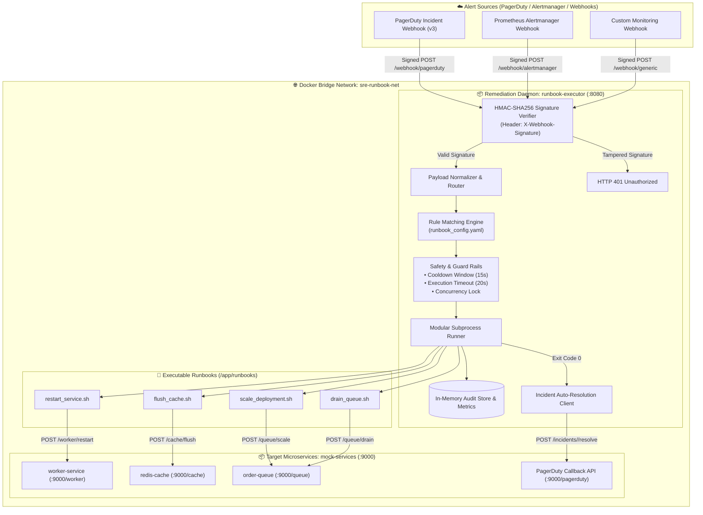
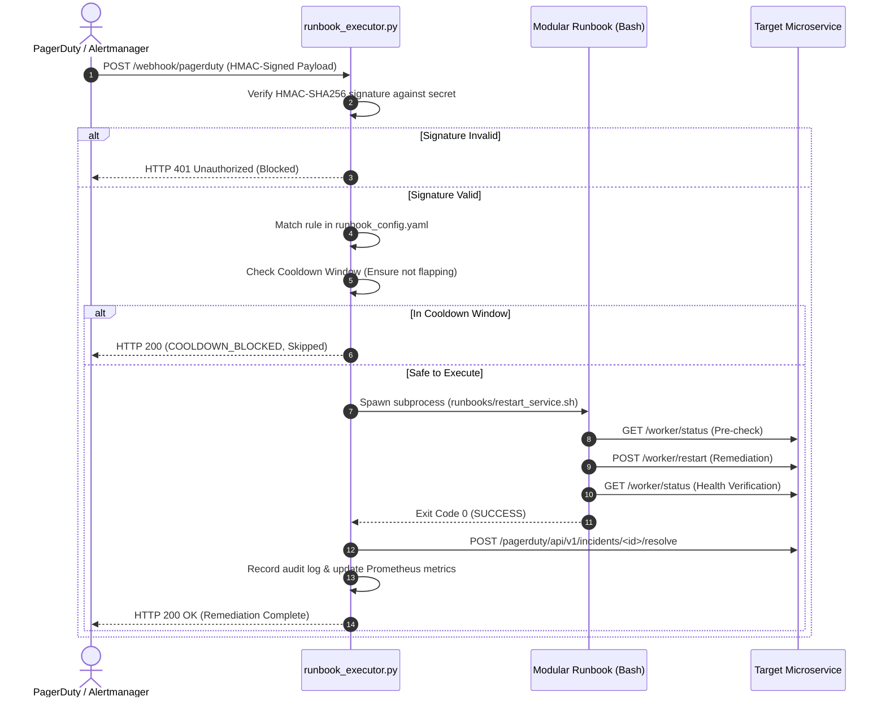

<!-- markdownlint-disable MD013 MD033 MD051 MD060 -->
# 03 - Automated Incident Runbook Executor

> A production-grade **Event-Driven Incident Auto-Remediation Daemon** (Self-Healing System) for SRE teams that listens for PagerDuty, Alertmanager, and Webhook alerts, verifies **HMAC-SHA256 cryptographic signatures** for zero-trust security, maps incident metadata to declarative runbook rules, executes modular remediation scripts with **cooldown safety guards** and **timeouts**, logs structured audit trails, and auto-resolves incidents.

---

## 📋 Table of Contents

1. [Architectural Overview & Remediation Flow](#-architectural-overview--remediation-flow)
   - [System Architecture Diagram](#system-architecture-diagram)
   - [Incident-to-Remediation Lifecycle](#incident-to-remediation-lifecycle)
2. [Theoretical Deep-Dive for Beginners](#-theoretical-deep-dive-for-beginners)
   - [The SRE Incident Lifecycle & MTTR Reduction](#the-sre-incident-lifecycle--mttr-reduction)
   - [What is Event-Driven Auto-Remediation (Self-Healing)?](#what-is-event-driven-auto-remediation-self-healing)
   - [Zero-Trust Security & HMAC-SHA256 Signature Verification](#zero-trust-security--hmac-sha256-signature-verification)
   - [Safety Guards & Blast-Radius Mitigation](#safety-guards--blast-radius-mitigation)
   - [The Modular Runbook Pattern](#the-modular-runbook-pattern)
   - [Audit Logging, Observability & Prometheus Metrics](#audit-logging-observability--prometheus-metrics)
3. [Repository & Directory Structure](#-repository--directory-structure)
4. [Prerequisites & System Setup](#-prerequisites--system-setup)
5. [Quickstart Guide](#-quickstart-guide)
6. [Step-by-Step Hands-On Guide](#-step-by-step-hands-on-guide)
   - [Step 1: Inspect the Declarative Runbook Configuration](#step-1-inspect-the-declarative-runbook-configuration)
   - [Step 2: Start the Executor & Target Services Stack](#step-2-start-the-executor--target-services-stack)
   - [Step 3: Verify Daemon Health & Prometheus Metrics](#step-3-verify-daemon-health--prometheus-metrics)
   - [Step 4: Test HMAC Signature Verification & Security Rejection](#step-4-test-hmac-signature-verification--security-rejection)
   - [Step 5: Incident 1 - Remediate Hung Worker Deadlock via PagerDuty Webhook](#step-5-incident-1---remediate-hung-worker-deadlock-via-pagerduty-webhook)
   - [Step 6: Incident 2 - Remediate Redis Cache OOM via Alertmanager Webhook](#step-6-incident-2---remediate-redis-cache-oom-via-alertmanager-webhook)
   - [Step 7: Incident 3 - Autoscale Worker Pool for Queue Backlog Spikes](#step-7-incident-3---autoscale-worker-pool-for-queue-backlog-spikes)
   - [Step 8: Incident 4 - Replay & Drain Dead-Letter Queues](#step-8-incident-4---replay--drain-dead-letter-queues)
   - [Step 9: Test Cooldown Guards & Inspect Audit History API](#step-9-test-cooldown-guards--inspect-audit-history-api)
   - [Step 10: Execute the Complete Automated Test Suite](#step-10-execute-the-complete-automated-test-suite)
7. [Runbook Script Specification Reference](#-runbook-script-specification-reference)
8. [Troubleshooting & Common Gotchas](#-troubleshooting--common-gotchas)
9. [Resource Teardown & Complete Cleanup](#-resource-teardown--complete-cleanup)

---

## 🏛️ Architectural Overview & Remediation Flow

### System Architecture Diagram



### Incident-to-Remediation Lifecycle



---

## 🧠 Theoretical Deep-Dive for Beginners

### The SRE Incident Lifecycle & MTTR Reduction

In traditional IT operations, incident resolution involves high human friction:

```text
┌─────────────────────────────────────────────────────────────────────────┐
│                      MANUAL vs AUTOMATED INCIDENT RESPONSE               │
├─────────────────────────────────────────────────────────────────────────┤
│                                                                         │
│  Traditional Manual Response (Total MTTR: ~25 - 45 minutes):           │
│  ┌──────────────┐    ┌──────────────┐    ┌──────────────┐    ┌─────────┐│
│  │ 1. Detection │───▶│ 2. Page SRE  │───▶│ 3. Log In &  │───▶│ 4. Run  ││
│  │    (~2 min)  │    │  (~5-10 min) │    │  Investigate │    │ Runbook ││
│  └──────────────┘    └──────────────┘    └──────────────┘    └─────────┘│
│                                                                         │
│  Automated Event-Driven Self-Healing (Total MTTR: ~3 - 5 seconds):      │
│  ┌──────────────┐    ┌────────────────────────────────────────┐         │
│  │ 1. Detection │───▶│ 2. Webhook triggers runbook_executor   │         │
│  │    (~2 min)  │    │    Remediated & Auto-Resolved in 2.5s! │         │
│  └──────────────┘    └────────────────────────────────────────┘         │
│                                                                         │
└─────────────────────────────────────────────────────────────────────────┘
```

- **MTTD (Mean Time to Detect)**: Time from anomaly inception to alert trigger.
- **MTTA (Mean Time to Acknowledge)**: Time for an on-call human to acknowledge a page (**reduced to 0s by auto-remediation**).
- **MTTR (Mean Time to Resolve)**: Time to restore nominal service operations (**reduced by >90%**).

---

### What is Event-Driven Auto-Remediation (Self-Healing)?

Auto-remediation is the automated execution of deterministic operational procedures in response to specific, well-understood observability events.

#### When to Automate a Runbook

According to the *Google SRE Book*:

- **High Frequency, Well-Understood Failure Modes**: E.g., worker deadlocks, transient cache memory saturation, known memory leaks requiring container recycling, queue backlog autoscaling.
- **Deterministic Action**: If an on-call engineer's initial action is always identical (e.g. "Check memory, flush cache, verify recovery"), it must be encoded as code and automated.

---

### Zero-Trust Security & HMAC-SHA256 Signature Verification

A webhook listener that executes scripts on production servers is an attractive attack target. If unauthenticated, an attacker could forge a webhook payload to trigger unauthorized restarts or command execution.

To guarantee zero-trust security:

1. The monitoring platform (PagerDuty/Alertmanager) and the executor share a secret key $K$.
2. The sender computes an **HMAC-SHA256** cryptographic hash over the exact raw HTTP request body $M$:
   $$\text{Signature} = \text{HMAC-SHA256}(K, M)$$
3. The sender transmits this digest in the `X-Webhook-Signature` HTTP header.
4. The executor independently computes the HMAC digest and uses **constant-time string comparison** (`hmac.compare_digest`) to prevent timing attacks. Any request with a missing or mismatched signature is immediately rejected with `HTTP 401 Unauthorized`.

---

### Safety Guards & Blast-Radius Mitigation

Automated remediation systems must implement defensive guardrails to prevent self-inflicted damage:

```text
┌─────────────────────────────────────────────────────────────────────────┐
│                      SAFETY GUARDRAILS IN RUNBOOK EXECUTOR              │
├─────────────────────────────────────────────────────────────────────────┤
│                                                                         │
│  1. Cooldown Windows (Flapping Prevention)                             │
│     • If an alert fires 10 times in 1 minute, the runbook executes once │
│       and subsequent invocations are blocked until the cooldown expires.│
│                                                                         │
│  2. Hard Execution Timeouts                                             │
│     • If a runbook hangs (e.g. frozen network socket), the daemon       │
│       terminates the process after a configured timeout (e.g. 20s).     │
│                                                                         │
│  3. Concurrency Locks                                                   │
│     • Prevents parallel execution of the same runbook against the same  │
│       target service simultaneously.                                    │
│                                                                         │
│  4. Pre-Checks and Post-Verification                                    │
│     • Runbooks must inspect state before modifying, and verify health   │
│       recovery before returning an exit code of 0.                      │
│                                                                         │
└─────────────────────────────────────────────────────────────────────────┘
```

---

### The Modular Runbook Pattern

Rather than writing monolithic python scripts with hardcoded API calls, this project adopts the **Modular Runbook Pattern**:

- **Separation of Concerns**: The executor daemon handles networking, security, authentication, and routing. The runbooks (`runbooks/*.sh`) are independent, modular executable scripts that can be tested in isolation on the command line.
- **Polyglot Extensibility**: Runbooks can be written in Bash, Python, Go, or Ansible playbooks.

---

### Audit Logging, Observability & Prometheus Metrics

Every runbook execution is recorded with full audit metadata:

- `execution_id`, `incident_id`, `rule_id`, `service`
- `status`: `SUCCESS`, `FAILED`, `TIMEOUT`, `COOLDOWN_BLOCKED`
- `duration_seconds`, `exit_code`, `stdout`, `stderr`, `auto_resolved`

The daemon exposes real-time Prometheus metrics on `/metrics`:

- `runbook_executions_total`: Total runbook invocations.
- `runbook_executions_success_total`: Successful remediations.
- `runbook_cooldown_blocked_total`: Executions prevented by cooldown guards.
- `runbook_auto_resolved_total`: Incidents resolved automatically.

---

## 📁 Repository & Directory Structure

```text
10-sre-and-reliability/03-automated-incident-runbook-executor/
├── .gitignore                      # Git ignore rules for Python cache & logs
├── Dockerfile.executor             # Container image packaging Python daemon & runbooks
├── Dockerfile.mock-services        # Container image packaging simulated microservices
├── README.md                       # Comprehensive educational guide & documentation
├── cleanup.sh                      # Resource teardown script for containers, networks & images
├── docker-compose.yml              # Multi-container orchestration definition
├── mock_services.py                # Target microservices simulator with fault injection API
├── requirements.txt                # Python dependencies (pyyaml, requests)
├── runbook_config.yaml             # Declarative alert-to-runbook mapping & safety configuration
├── runbook_executor.py             # Core event-driven webhook daemon & execution engine
├── runbooks/
│   ├── drain_queue.sh              # Dead-letter queue replay & drain runbook
│   ├── flush_cache.sh              # Cache memory pressure eviction runbook
│   ├── restart_service.sh          # Worker service restart & recovery runbook
│   └── scale_deployment.sh         # Dynamic worker replica autoscaling runbook
├── simulate_pagerduty_alert.sh     # CLI tool generating HMAC-signed synthetic alert payloads
└── test_stack.sh                   # End-to-end automated test runner
```

---

## 🔧 Prerequisites & System Setup

Ensure the following tools are installed on your host system:

- **Docker & Docker Compose**: Docker 24.0+ and Docker Compose v2+.
- **Python 3**: Python 3.9+.
- **curl & openssl**: For sending HMAC-signed test alerts.

---

## ⚡ Quickstart Guide

Start the self-healing lab and run your first automated remediation in under 30 seconds:

```bash
cd 10-sre-and-reliability/03-automated-incident-runbook-executor

# 1. Start the Executor and Target Services stack
docker compose up -d --build

# 2. Inject a hung worker deadlock and trigger auto-remediation
curl -X POST http://localhost:9000/fault/hang-worker
./simulate_pagerduty_alert.sh --incident-type=worker-hung

# 3. Clean up when finished
./cleanup.sh
```

---

## 🚀 Step-by-Step Hands-On Guide

### Step 1: Inspect the Declarative Runbook Configuration

Open `runbook_config.yaml` to examine how alerts are mapped to executable scripts:

```yaml
rules:
  - id: "remediate_hung_worker"
    name: "Hung Worker Deadlock Self-Healing"
    match:
      alertname: "HungWorkerDetected"
      service: "worker-service"
      event_type: "trigger"
    runbook: "runbooks/restart_service.sh"
    args: ["worker-service"]
    timeout_seconds: 20
    cooldown_seconds: 15
    auto_resolve: true
```

---

### Step 2: Start the Executor & Target Services Stack

Build and start the containerized environment:

```bash
docker compose up -d --build
```

Verify that both containers are running and healthy:

```bash
docker compose ps
```

*Expected Output:*

```text
NAME                IMAGE                         COMMAND                  SERVICE            STATUS
mock-services       sre-mock-services:latest      "python3 mock_servic…"   mock-services      Up (healthy)
runbook-executor    sre-runbook-executor:latest   "python3 runbook_exe…"   runbook-executor   Up (healthy)
```

---

### Step 3: Verify Daemon Health & Prometheus Metrics

#### Query Daemon Status

```bash
curl -s http://localhost:8080/status | python3 -m json.tool
```

#### Inspect Initial Prometheus Metrics

```bash
curl -s http://localhost:8080/metrics
```

---

### Step 4: Test HMAC Signature Verification & Security Rejection

Attempt to dispatch a forged alert with a tampered HMAC signature:

```bash
./simulate_pagerduty_alert.sh --incident-type=worker-hung --invalid-sig
```

*Observation*: Notice how the executor returns `HTTP 401 Unauthorized` with `{"error": "Unauthorized: Invalid HMAC-SHA256 signature"}`, proving that forged payloads are rejected.

---

### Step 5: Incident 1 - Remediate Hung Worker Deadlock via PagerDuty Webhook

#### 1. Inject Worker Deadlock Fault

```bash
curl -X POST http://localhost:9000/fault/hang-worker
curl -s http://localhost:9000/worker/status | python3 -m json.tool
```

*Status*: `"status": "HUNG_DEADLOCK"`, CPU locked at 99.8%.

#### 2. Dispatch Signed PagerDuty Incident Alert

```bash
./simulate_pagerduty_alert.sh --incident-type=worker-hung --format=pagerduty
```

#### 3. Inspect Target Recovery

```bash
curl -s http://localhost:9000/worker/status | python3 -m json.tool
```

*Status*: `"status": "HEALTHY"`, hung threads cleared, restart count incremented.

---

### Step 6: Incident 2 - Remediate Redis Cache OOM via Alertmanager Webhook

#### 1. Inject Cache Memory Saturation

```bash
curl -X POST http://localhost:9000/fault/fill-cache
curl -s http://localhost:9000/cache/status | python3 -m json.tool
```

*Status*: `"status": "OUT_OF_MEMORY"`, Memory usage at 96.5%.

#### 2. Dispatch Signed Alertmanager Alert

```bash
./simulate_pagerduty_alert.sh --incident-type=cache-oom --format=alertmanager
```

#### 3. Inspect Cache Eviction Recovery

```bash
curl -s http://localhost:9000/cache/status | python3 -m json.tool
```

*Status*: `"status": "HEALTHY"`, memory usage reduced to 4.4%.

---

### Step 7: Incident 3 - Autoscale Worker Pool for Queue Backlog Spikes

#### 1. Inject Queue Backlog Surge

```bash
curl -X POST http://localhost:9000/fault/spike-queue
curl -s http://localhost:9000/queue/status | python3 -m json.tool
```

*Status*: `"pending_messages": 48500`, `"replica_count": 2`.

#### 2. Dispatch Queue Autoscaling Alert

```bash
./simulate_pagerduty_alert.sh --incident-type=queue-backlog --format=generic
```

#### 3. Verify Autoscaling State

```bash
curl -s http://localhost:9000/queue/status | python3 -m json.tool
```

*Status*: Worker replica count dynamically scaled from 2 to 6 replicas.

---

### Step 8: Incident 4 - Replay & Drain Dead-Letter Queues

Dispatch a dead-letter queue alert to trigger automated replaying and draining:

```bash
./simulate_pagerduty_alert.sh --incident-type=dlq-spike --format=pagerduty
curl -s http://localhost:9000/queue/status | grep "dead_letter_count"
```

*Result*: `"dead_letter_count": 0`.

---

### Step 9: Test Cooldown Guards & Inspect Audit History API

#### Test Rapid Flapping Protection

Dispatch two identical alerts in rapid succession:

```bash
./simulate_pagerduty_alert.sh --incident-type=worker-hung
./simulate_pagerduty_alert.sh --incident-type=worker-hung
```

*Observation*: The second request returns `"status": "COOLDOWN_BLOCKED"` with message `"Execution blocked by 15s cooldown policy"`.

#### Inspect Execution Audit Trail

```bash
curl -s http://localhost:8080/history | python3 -m json.tool
```

---

### Step 10: Execute the Complete Automated Test Suite

Run the full end-to-end automated test runner asserting all 18 validation checks:

```bash
./test_stack.sh
```

---

## 🛠️ Runbook Script Specification Reference

| Runbook Script | Target Incident | Action Taken | Recovery Verification |
| :--- | :--- | :--- | :--- |
| [`restart_service.sh`](runbooks/restart_service.sh) | Hung Worker / Deadlock | Sends graceful restart signal via HTTP POST | Probes `/worker/status` until `HEALTHY` |
| [`flush_cache.sh`](runbooks/flush_cache.sh) | Redis Cache OOM | Triggers cache key eviction via HTTP POST | Asserts memory usage `< 10%` |
| [`scale_deployment.sh`](runbooks/scale_deployment.sh) | Queue Backlog Spike | Scales worker consumer replicas to 6 | Validates replica count `== 6` |
| [`drain_queue.sh`](runbooks/drain_queue.sh) | Dead-Letter Queue Surge | Replays and clears dead-letter backlog | Asserts DLQ message count `== 0` |

---

## 🔍 Troubleshooting & Common Gotchas

### 1. HTTP 401 Signature Mismatch

- **Cause**: The HMAC secret used by the alert sender does not match the daemon's `webhook_secret` in `runbook_config.yaml`.
- **Solution**: Check that the `WEBHOOK_SECRET` environment variable or `--secret` argument in `simulate_pagerduty_alert.sh` matches the daemon configuration.

### 2. Runbook Invocations Blocked by Cooldown

- **Cause**: The same remediation rule was triggered more than once within its configured `cooldown_seconds` window (e.g. 15s).
- **Solution**: This is an intended safety guard. Wait for the cooldown period to expire or adjust `cooldown_seconds` in `runbook_config.yaml`.

### 3. Runbook Execution Timeout

- **Cause**: The remediation script took longer than the configured `timeout_seconds` limit (e.g. 20s).
- **Solution**: Inspect the runbook script logs in `/history` to determine which network request or process stalled.

---

## 🧹 Resource Teardown & Complete Cleanup

To cleanly remove all containers, networks, and temporary test artifacts:

### Standard Teardown (Containers, Networks & Reports)

```bash
./cleanup.sh
```

*What gets deleted:*

- Docker containers `runbook-executor` and `mock-services`.
- Docker bridge network `sre-runbook-net`.
- Temporary logs, audit reports, and Python `__pycache__`.

### Complete Purge (Including Docker Container Images)

To also remove the built and downloaded container images:

```bash
./cleanup.sh --all
```

*Result:*

```text
======================================================================
  🧹 Cleaning Up Automated Incident Runbook Executor Stack
======================================================================

▶ [1/3] Tearing down containers and network...
  [OK] Containers 'runbook-executor' and 'mock-services' stopped and removed.
  [OK] Network 'sre-runbook-net' removed.

▶ [2/3] Purging Executor and Mock Services container images...
  [OK] Docker container images removed.

▶ [3/3] Removing local temporary test artifacts, reports and cache...
  [OK] Temporary files cleaned.

✨ Environment is completely clean! Ready for subsequent projects.
```
