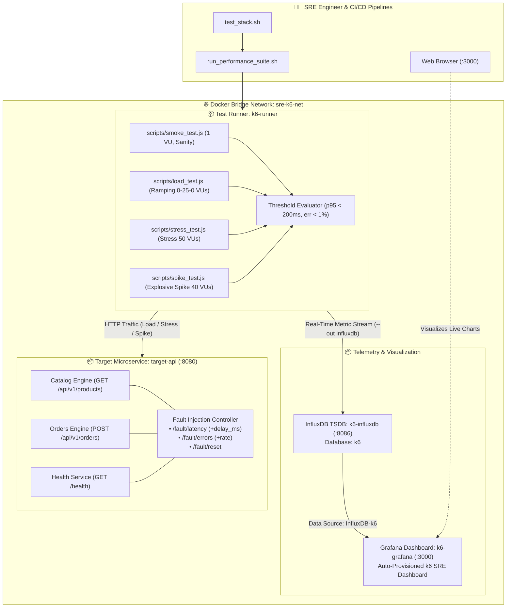
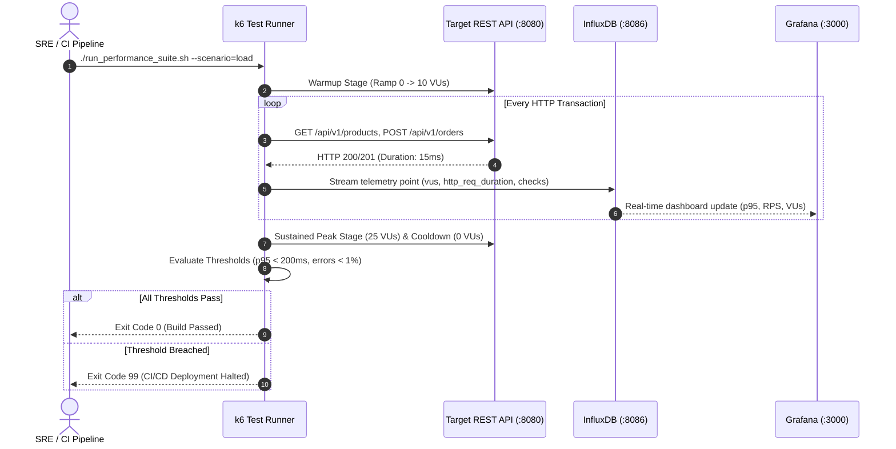

<!-- markdownlint-disable MD013 MD033 MD051 MD060 -->
# 04 - k6 Distributed Performance and Stress Testing

> A production-grade **Distributed Performance, Load & Stress Testing Suite** built with **Grafana k6**, **InfluxDB**, and **Grafana**, targeting a high-throughput e-commerce REST API microservice with realistic multi-stage user journeys, strict percentile latency Service Level Objectives (`p95 < 200ms`, `error_rate < 1%`), real-time telemetry streaming, automated CI/CD threshold quality gates, and self-contained cleanup.

---

## 📋 Table of Contents

1. [Architectural Overview & Telemetry Flow](#-architectural-overview--telemetry-flow)
   - [System Architecture Diagram](#system-architecture-diagram)
   - [k6 Performance Testing Lifecycle & Execution Flow](#k6-performance-testing-lifecycle--execution-flow)
2. [Theoretical Deep-Dive for Beginners](#-theoretical-deep-dive-for-beginners)
   - [The SRE Performance Testing Taxonomies](#the-sre-performance-testing-taxonomies)
   - [Why Averages Lie: The Mathematics of Percentiles (p90, p95, p99)](#why-averages-lie-the-mathematics-of-percentiles-p90-p95-p99)
   - [Core k6 Concepts: VUs, Iterations, Stages & Checks](#core-k6-concepts-vus-iterations-stages--checks)
   - [Thresholds as CI/CD Quality Gates (Automated Halting)](#thresholds-as-cicd-quality-gates-automated-halting)
   - [Real-Time Telemetry Pipeline (k6 ➔ InfluxDB ➔ Grafana)](#real-time-telemetry-pipeline-k6--influxdb--grafana)
3. [Repository & Directory Structure](#-repository--directory-structure)
4. [Prerequisites & System Setup](#-prerequisites--system-setup)
5. [Quickstart Guide](#-quickstart-guide)
6. [Step-by-Step Hands-On Guide](#-step-by-step-hands-on-guide)
   - [Step 1: Inspect k6 Test Scenarios](#step-1-inspect-k6-test-scenarios)
   - [Step 2: Start the Target API, InfluxDB & Grafana Stack](#step-2-start-the-target-api-influxdb--grafana-stack)
   - [Step 3: Verify Target API Endpoints & Grafana Provisioning](#step-3-verify-target-api-endpoints--grafana-provisioning)
   - [Step 4: Execute k6 Smoke Test (Sanity Verification)](#step-4-execute-k6-smoke-test-sanity-verification)
   - [Step 5: Execute k6 Ramping Load Test with InfluxDB Streaming](#step-5-execute-k6-ramping-load-test-with-influxdb-streaming)
   - [Step 6: Query InfluxDB Telemetry Directly via HTTP API](#step-6-query-influxdb-telemetry-directly-via-http-api)
   - [Step 7: Test CI/CD Quality Gate & Threshold Breach Detection](#step-7-test-cicd-quality-gate--threshold-breach-detection)
   - [Step 8: Clear Faults and Execute k6 Traffic Spike Test](#step-8-clear-faults-and-execute-k6-traffic-spike-test)
   - [Step 9: Execute the Complete Automated Test Suite](#step-9-execute-the-complete-automated-test-suite)
7. [k6 CLI & JavaScript Cheat Sheet](#-k6-cli--javascript-cheat-sheet)
8. [Troubleshooting & Common Gotchas](#-troubleshooting--common-gotchas)
9. [Resource Teardown & Complete Cleanup](#-resource-teardown--complete-cleanup)

---

## 🏛️ Architectural Overview & Telemetry Flow

### System Architecture Diagram



### k6 Performance Testing Lifecycle & Execution Flow



---

## 🧠 Theoretical Deep-Dive for Beginners

### The SRE Performance Testing Taxonomies

Performance testing is not a monolithic activity. SRE teams use distinct testing profiles depending on the reliability question being answered:

```text
┌─────────────────────────────────────────────────────────────────────────┐
│                    PERFORMANCE TESTING TAXONOMIES                       │
├─────────────────────────────────────────────────────────────────────────┤
│                                                                         │
│  1. Smoke Testing (Minimal Load: 1-2 VUs, 5-30 seconds)                │
│     • Goal: Sanity check. Verifies test scripts, authentication, and    │
│       basic endpoint connectivity without overwhelming the system.      │
│                                                                         │
│  2. Load Testing (Ramping Stages: Warmup ➔ Peak ➔ Cooldown)            │
│     • Goal: Simulates anticipated everyday peak production traffic.     │
│       Asserts that response times comply with SLOs under expected load. │
│                                                                         │
│  3. Stress Testing (Pushing Beyond Peak: 2x - 5x Capacity)              │
│     • Goal: Identifies the breaking point, maximum throughput ceiling,  │
│       and verifies graceful degradation (e.g. 503 instead of crashing). │
│                                                                         │
│  4. Spike Testing (Instantaneous Shock: 0 ➔ 100 VUs in 3 seconds)       │
│     • Goal: Tests autoscaling responsiveness, connection pool queues,   │
│       and evaluates whether the service recovers quickly without tails. │
│                                                                         │
│  5. Soak / Endurance Testing (Sustained Moderate Load for Hours/Days)   │
│     • Goal: Uncovers memory leaks, connection leaks, database connection│
│       exhaustion, and disk space saturation.                            │
│                                                                         │
└─────────────────────────────────────────────────────────────────────────┘
```

---

### Why Averages Lie: The Mathematics of Percentiles (p90, p95, p99)

In distributed systems, the **arithmetic mean (average)** is dangerously misleading:

```text
Imagine 100 user requests:
• 99 requests take 10ms.
• 1 request hangs for 10,000ms (10 seconds).

Average Latency:
(99 * 10 + 1 * 10000) / 100 = 109.9ms  <-- Looks reasonably acceptable!

BUT for the 1 unlucky user, the system was completely broken.
```

SRE Service Level Objectives (SLOs) are defined using **Percentiles**:

- **$p50$ (Median)**: $50\%$ of requests were faster than this value (typical user experience).
- **$p90$**: $90\%$ of requests were faster than this value.
- **$p95$**: $95\%$ of requests were faster than this value (standard SRE SLO benchmark).
- **$p99$**: $99\%$ of requests were faster than this value (tail latency, catches worst-case database lockouts and garbage collection pauses).

---

### Core k6 Concepts: VUs, Iterations, Stages & Checks

- **Virtual Users (VUs)**: Parallel execution threads running the JavaScript test function in a continuous loop.
- **Iterations**: Total number of completed passes through the `default function ()`.
- **Stages**: Declarative ramp-up and ramp-down profiles:

  ```javascript
  stages: [
    { duration: '10s', target: 20 }, // Ramp up to 20 VUs
    { duration: '30s', target: 20 }, // Stay at 20 VUs
    { duration: '10s', target: 0 },  // Ramp down to 0 VUs
  ]
  ```

- **Checks**: Functional boolean assertions (equivalent to HTTP assertions in unit tests) that do *not* halt execution on failure.
- **Metrics**: Standard and custom telemetry gathered by k6 (`http_req_duration`, `http_req_failed`, `Trend`, `Rate`, `Counter`).

---

### Thresholds as CI/CD Quality Gates (Automated Halting)

In k6, **Thresholds** are programmable pass/fail criteria assigned to any metric:

```javascript
thresholds: {
  'http_req_duration': ['p(95)<200', 'p(99)<350'], // 95% of requests < 200ms
  'http_req_failed': ['rate<0.01'],                 // Error rate < 1%
  'checks': ['rate>0.99'],                          // 99%+ checks pass
}
```

When k6 runs inside a CI/CD pipeline (e.g. GitHub Actions, GitLab CI), if any threshold is violated, **k6 automatically exits with exit code 99**, halting the deployment pipeline before degraded code reaches production.

---

### Real-Time Telemetry Pipeline (k6 ➔ InfluxDB ➔ Grafana)

While terminal summaries are useful after a test finishes, long-running tests require real-time observability:

1. As VUs execute requests, k6 batches telemetry points and writes them over HTTP to InfluxDB via `--out influxdb=http://influxdb:8086/k6`.
2. InfluxDB stores high-cardinality measurements (`http_req_duration`, `vus`, `http_reqs`).
3. Grafana queries InfluxDB every 5 seconds, displaying real-time graphs for RPS throughput, active concurrency, and response time percentiles.

---

## 📁 Repository & Directory Structure

```text
10-sre-and-reliability/04-k6-performance-load-testing-suite/
├── .gitignore                      # Git ignore rules for Python cache, InfluxDB data & logs
├── Dockerfile.api                  # Container image packaging the Target E-Commerce REST API
├── Dockerfile.grafana              # Container image baking auto-provisioned dashboards & datasources
├── Dockerfile.k6                   # Container image packaging the k6 test runner & JavaScript scripts
├── README.md                       # Comprehensive educational documentation & user guide
├── api_server.py                   # High-throughput target REST API microservice with fault injection
├── cleanup.sh                      # Resource teardown script for containers, volumes, networks & images
├── docker-compose.yml              # Multi-container orchestration definition
├── grafana/
│   ├── dashboards/
│   │   ├── dashboard_provider.yaml # Grafana dashboard provider specification
│   │   └── k6_performance_dashboard.json # Preconfigured k6 SRE performance dashboard
│   └── datasources/
│       └── influxdb_datasource.yaml # Auto-provisioned InfluxDB data source configuration
├── requirements.txt                # Python dependencies
├── run_performance_suite.sh        # CLI helper script executing k6 scenarios
├── scripts/
│   ├── load_test.js                # Ramping load test script with multi-stage user journeys
│   ├── smoke_test.js               # Sanity smoke test script (1 VU)
│   ├── spike_test.js               # Explosive traffic spike test script (0 ➔ 40 VUs)
│   └── stress_test.js              # System capacity & breaking point stress test script
└── test_stack.sh                   # Automated end-to-end test suite
```

---

## 🔧 Prerequisites & System Setup

Ensure the following tools are installed on your host system:

- **Docker & Docker Compose**: Docker 24.0+ and Docker Compose v2+.
- **Python 3**: Python 3.9+.
- **curl**: For health checks and fault injection triggers.

---

## ⚡ Quickstart Guide

Start the entire performance testing and telemetry lab in under 30 seconds:

```bash
cd 10-sre-and-reliability/04-k6-performance-load-testing-suite

# 1. Start Target API, InfluxDB & Grafana
docker compose up -d --build

# 2. Run a 5-second smoke test
./run_performance_suite.sh --scenario=smoke

# 3. View live Grafana dashboard at http://localhost:3000
open http://localhost:3000/d/k6-sre-perf-dashboard

# 4. Clean up when finished
./cleanup.sh
```

---

## 🚀 Step-by-Step Hands-On Guide

### Step 1: Inspect k6 Test Scenarios

Open `scripts/load_test.js` to observe how multi-stage user journeys and SLO thresholds are defined:

```javascript
export const options = {
  stages: [
    { duration: '5s', target: 10 },  // Warmup to 10 VUs
    { duration: '15s', target: 25 }, // Peak sustained load at 25 VUs
    { duration: '5s', target: 0 },   // Graceful cooldown
  ],
  thresholds: {
    'http_req_duration': ['p(90)<120', 'p(95)<200', 'p(99)<350'],
    'http_req_failed': ['rate<0.01'],
    'checks': ['rate>0.99'],
  },
};
```

---

### Step 2: Start the Target API, InfluxDB & Grafana Stack

Build and start all containerized services:

```bash
docker compose up -d --build
```

Verify that all containers are healthy:

```bash
docker compose ps
```

*Expected Output:*

```text
NAME           IMAGE                    COMMAND                  SERVICE      STATUS
k6-grafana     k6-grafana-sre:latest    "/run.sh"                grafana      Up (healthy)
k6-influxdb    influxdb:1.8             "/entrypoint.sh infl…"   influxdb     Up (healthy)
target-api     sre-target-api:latest    "python3 api_server.…"   target-api   Up (healthy)
```

---

### Step 3: Verify Target API Endpoints & Grafana Provisioning

#### Query Target API Health

```bash
curl -s http://localhost:8080/health | python3 -m json.tool
```

#### Query Target Catalog

```bash
curl -s "http://localhost:8080/api/v1/products?limit=3" | python3 -m json.tool
```

#### Access Grafana Dashboard

- Open your browser to `http://localhost:3000/d/k6-sre-perf-dashboard`.
- Notice the pre-configured real-time panels for Virtual Users, RPS Throughput, and $p50/p90/p95/p99$ response times.

---

### Step 4: Execute k6 Smoke Test (Sanity Verification)

Run a fast 5-second smoke test with 1 Virtual User to verify API connectivity and response validation:

```bash
./run_performance_suite.sh --scenario=smoke
```

*Terminal Output:*

```text
     █ 01_Healthcheck
       ✓ health status is 200
       ✓ service is healthy

     █ 02_BrowseCatalog
       ✓ catalog status is 200
       ✓ has product items

     █ 04_OrderCheckout
       ✓ order creation status is 201
       ✓ order is confirmed

   ✓ checks.........................: 100.00%
   ✓ http_req_duration..............: avg=15.94ms p(95)=45.61ms 
   ✓ http_req_failed................: 0.00%
```

---

### Step 5: Execute k6 Ramping Load Test with InfluxDB Streaming

Execute the multi-stage load test simulating 25 concurrent Virtual Users browsing and purchasing:

```bash
./run_performance_suite.sh --scenario=load
```

*Observation*: While the test runs, switch to your Grafana browser tab (`http://localhost:3000`) and watch the live telemetry stream with real-time throughput ($70+$ req/s) and sub-50ms percentile response times.

---

### Step 6: Query InfluxDB Telemetry Directly via HTTP API

Verify that k6 wrote time-series measurements directly to InfluxDB:

```bash
curl -s -G "http://localhost:8086/query" \
  --data-urlencode "db=k6" \
  --data-urlencode "q=SELECT mean(value) FROM http_req_duration WHERE time > now() - 5m GROUP BY time(1m)" \
  | python3 -m json.tool
```

---

### Step 7: Test CI/CD Quality Gate & Threshold Breach Detection

Simulate an active production regression by injecting $300\text{ms}$ artificial database latency and a $30\%$ error rate:

```bash
curl -X POST "http://localhost:8080/fault/latency?delay_ms=300"
curl -X POST "http://localhost:8080/fault/errors?rate=0.30"
```

Now execute the smoke test against the degraded API:

```bash
./run_performance_suite.sh --scenario=smoke
```

*Observation*: Notice how k6 detects the SLA violations (`p(95) > 150ms` and `error_rate > 1%`) and **exits with non-zero exit code 99**, successfully proving that automated CI/CD quality gates block degraded code.

---

### Step 8: Clear Faults and Execute k6 Traffic Spike Test

Reset the target API back to nominal baseline:

```bash
curl -X POST http://localhost:8080/fault/reset
```

Execute an explosive traffic spike test surging from $0$ to $40$ VUs in $3$ seconds:

```bash
./run_performance_suite.sh --scenario=spike
```

*Observation*: Notice how the service handles the sudden surge smoothly, processing over $300\text{ req/s}$ with $0\%$ failure rate and sub-$25\text{ms } p95$ response times.

---

### Step 9: Execute the Complete Automated Test Suite

Run the full end-to-end automated test runner asserting all 14 validation checks:

```bash
./test_stack.sh
```

---

## 📊 k6 CLI & JavaScript Cheat Sheet

| Command / Construct | Purpose | Example |
| :--- | :--- | :--- |
| **Run Script** | Executes k6 test | `k6 run scripts/load_test.js` |
| **Stream to InfluxDB** | Outputs real-time metrics | `k6 run --out influxdb=http://localhost:8086/k6 scripts/load_test.js` |
| **Override VUs/Duration** | Dynamically adjust load | `k6 run --vus 50 --duration 30s scripts/smoke_test.js` |
| **Export Summary JSON** | Dumps final test metrics | `k6 run --summary-export=report.json scripts/load_test.js` |
| **Group Construct** | Organizes transaction steps | `group('Browse', function() { ... })` |
| **Check Assertion** | Validates response attributes | `check(res, { 'status is 200': (r) => r.status === 200 })` |
| **Trend Metric** | Tracks custom durations | `const myTrend = new Trend('custom_duration');` |

---

## 🔍 Troubleshooting & Common Gotchas

### 1. k6 Reports `open /scripts/...: operation not permitted`

- **Cause**: On macOS / OrbStack, container volume bind mounts can hit UID permission restrictions.
- **Solution**: The `run_performance_suite.sh` script automatically uses the baked container image `sre-k6-runner:latest` where scripts are copied directly into the image layer.

### 2. InfluxDB Metric Stream Disconnections

- **Cause**: The k6 container cannot reach `http://influxdb:8086` if not attached to the same Docker bridge network.
- **Solution**: Ensure k6 runs with `--network sre-k6-net`.

### 3. Port Conflicts (8080, 8086, 3000)

- **Solution**: Check if ports are already bound using `lsof -i :8080` or `lsof -i :3000`, stop conflicting containers, or modify port mappings in `docker-compose.yml`.

---

## 🧹 Resource Teardown & Complete Cleanup

To cleanly remove all containers, networks, named volumes, and temporary test artifacts:

### Standard Teardown (Containers, Networks, Volumes & Reports)

```bash
./cleanup.sh
```

*What gets deleted:*

- Docker containers `target-api`, `k6-influxdb`, and `k6-grafana`.
- Docker bridge network `sre-k6-net`.
- Docker named volume `influxdb_k6_data`.
- Temporary logs, JSON reports, and Python `__pycache__`.

### Complete Purge (Including Docker Container Images)

To also remove all built and downloaded container images:

```bash
./cleanup.sh --all
```

*Result:*

```text
======================================================================
  🧹 Cleaning Up k6 Performance & Stress Testing Stack
======================================================================

▶ [1/3] Tearing down containers, network, and named volumes...
  [OK] Containers 'target-api', 'k6-influxdb', 'k6-grafana' stopped and removed.
  [OK] Network 'sre-k6-net' removed.
  [OK] Named volume 'influxdb_k6_data' deleted.

▶ [2/3] Purging k6, InfluxDB, Grafana, and Target API container images...
  [OK] Docker container images removed.

▶ [3/3] Removing local temporary test artifacts, reports and cache...
  [OK] Temporary files cleaned.

✨ Environment is completely clean! Ready for subsequent projects.
```
