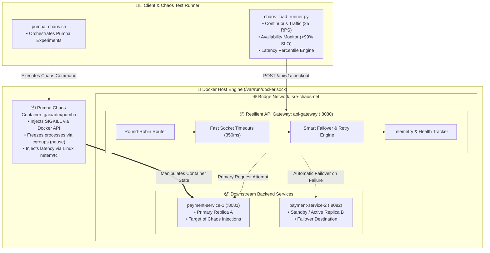
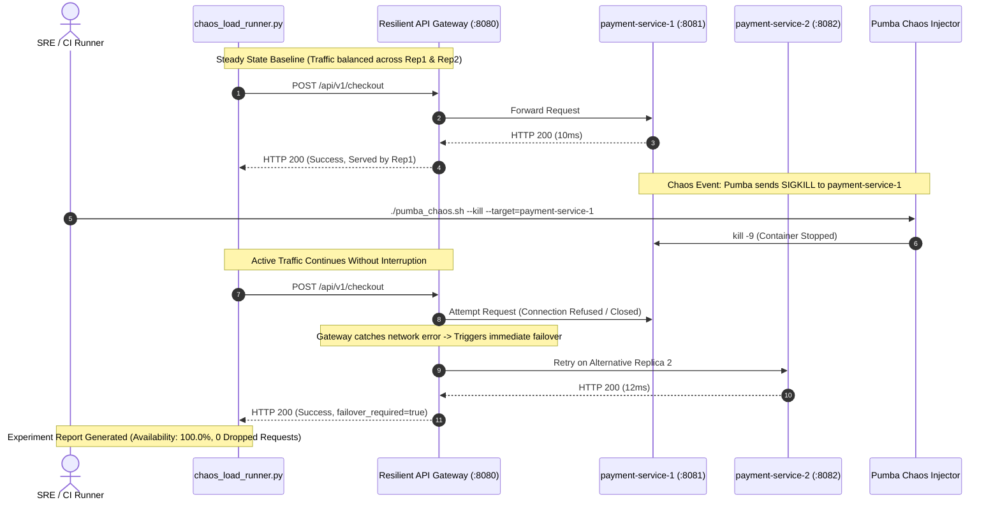

<!-- markdownlint-disable MD013 MD033 MD051 MD060 -->
# 05 - Container Chaos Engineering with Pumba

> A hands-on **Container Chaos Engineering & Fault-Tolerance Lab** built with **Pumba** and Docker, validating microservice resilience under active traffic through controlled process kills (`SIGKILL`), container process freezes (`pause`), and Linux network emulation (`netem` latency and packet loss) while asserting strict Service Level Objectives (`availability >= 99%`, automatic multi-replica failover).

---

## 📋 Table of Contents

1. [Architectural Overview & Chaos Topology](#-architectural-overview--chaos-topology)
   - [Microservice Resilience Architecture Diagram](#microservice-resilience-architecture-diagram)
   - [Chaos Experiment Lifecycle & Failover Sequence](#chaos-experiment-lifecycle--failover-sequence)
2. [Theoretical Deep-Dive for Beginners](#-theoretical-deep-dive-for-beginners)
   - [The Principles of Chaos Engineering](#the-principles-of-chaos-engineering)
   - [What is Pumba and How Does It Manipulate Containers?](#what-is-pumba-and-how-does-it-manipulate-containers)
   - [Container Failure Modes: Crash vs Hang vs Network Degradation](#container-failure-modes-crash-vs-hang-vs-network-degradation)
   - [Microservice Resilience Patterns: Active-Active Failover, Timeouts & Retries](#microservice-resilience-patterns-active-active-failover-timeouts--retries)
3. [Repository & Directory Structure](#-repository--directory-structure)
4. [Prerequisites & Environment Setup](#-prerequisites--environment-setup)
5. [Quickstart Guide](#-quickstart-guide)
6. [Step-by-Step Hands-On Guide](#-step-by-step-hands-on-guide)
   - [Step 1: Start the Resilient Microservices Stack](#step-1-start-the-resilient-microservices-stack)
   - [Step 2: Establish Steady-State Baseline Traffic](#step-2-establish-steady-state-baseline-traffic)
   - [Step 3: Experiment 1 - Forced SIGKILL Chaos Injection](#step-3-experiment-1---forced-sigkill-chaos-injection)
   - [Step 4: Experiment 2 - Container Process Pause & Hang Chaos](#step-4-experiment-2---container-process-pause--hang-chaos)
   - [Step 5: Experiment 3 - Network Latency & Packet Loss Emulation](#step-5-experiment-3---network-latency--packet-loss-emulation)
   - [Step 6: Inspect Gateway Resilience & Failover Telemetry](#step-6-inspect-gateway-resilience--failover-telemetry)
   - [Step 7: Analyze SRE Chaos Experiment Reports](#step-7-analyze-sre-chaos-experiment-reports)
   - [Step 8: Execute the Complete Automated Test Suite](#step-8-execute-the-complete-automated-test-suite)
7. [Pumba CLI & Chaos Experiment Cheat Sheet](#-pumba-cli--chaos-experiment-cheat-sheet)
8. [Troubleshooting & Common Gotchas](#-troubleshooting--common-gotchas)
9. [Resource Teardown & Complete Cleanup](#-resource-teardown--complete-cleanup)

---

## 🏛️ Architectural Overview & Chaos Topology

### Microservice Resilience Architecture Diagram



### Chaos Experiment Lifecycle & Failover Sequence



---

## 🧠 Theoretical Deep-Dive for Beginners

### The Principles of Chaos Engineering

> *"Chaos Engineering is the discipline of experimenting on a system in order to build confidence in the system's capability to withstand turbulent conditions in production."* — Principles of Chaos Engineering

Chaos engineering is **not** about randomly breaking things; it is a scientific method applied to software reliability:

```text
┌─────────────────────────────────────────────────────────────────────────┐
│                 THE 4 STEPS OF A CHAOS EXPERIMENT                       │
├─────────────────────────────────────────────────────────────────────────┤
│                                                                         │
│  1. Define Steady State:                                                │
│     Formulate measurable indicators of normal system behavior           │
│     (e.g., checkout availability >= 99%, p95 latency < 400ms).          │
│                                                                         │
│  2. Formulate Hypothesis:                                               │
│     "Even if 1 backend payment replica crashes or is frozen,            │
│      overall checkout availability will remain > 99% because the        │
│      upstream gateway automatically retries on surviving replicas."     │
│                                                                         │
│  3. Introduce Real-World Fault (Blast Radius Contained):                │
│     Inject a specific failure (kill container, pause processes, delay). │
│                                                                         │
│  4. Verify & Measure:                                                   │
│     Compare steady-state metrics against the hypothesis. If steady state│
│     breaks, fix the architectural weakness before production does.      │
│                                                                         │
└─────────────────────────────────────────────────────────────────────────┘
```

---

### What is Pumba and How Does It Manipulate Containers?

**Pumba** is a container chaos testing and network emulation tool specifically built for Docker environments:

1. **Docker Socket Control (`/var/run/docker.sock`)**:
   Pumba communicates with the Docker daemon API to send signals (`SIGKILL`, `SIGTERM`, `SIGSTOP`), pause cgroups, or remove containers.
2. **Linux Traffic Control (`tc`) & Network Emulation (`netem`)**:
   Pumba attaches to the target container's Linux network namespace to manipulate kernel packet scheduling queues, introducing realistic latency, jitter, and packet drop rates without altering application code.

---

### Container Failure Modes: Crash vs Hang vs Network Degradation

Distributed systems fail in three distinct ways:

| Failure Mode | Physical Reality | Application Impact | Required Resilience Mechanism |
| :--- | :--- | :--- | :--- |
| **Crash Failure** (`kill`) | Process terminates instantly (`SIGKILL`, OOM killer). | TCP connection is refused immediately (`RST` packet or connection drop). | **Immediate Retry on Alternative Replica**. |
| **Hang / Freeze Failure** (`pause`) | Thread deadlock, full GC pause, or frozen cgroup. | TCP connection accepts data or hangs indefinitely; process never replies. | **Strict Socket Timeouts (e.g. 350ms)** + Failover. |
| **Network Degradation** (`netem`) | Congested switch, cross-region latency, or packet loss. | Increased latency and random retransmissions. | **Timeout Budgeting & Circuit Breaking**. |

---

### Microservice Resilience Patterns: Active-Active Failover, Timeouts & Retries

To survive chaos injections, the **Resilient API Gateway** implements:

1. **Active-Active Redundancy**:
   Multiple identical replicas (`payment-service-1` and `payment-service-2`) handle traffic simultaneously.
2. **Aggressive Socket Timeouts**:
   If a replica takes longer than `350ms`, the connection is immediately aborted, preventing thread exhaustion when a replica is frozen.
3. **Idempotent Retry with Immediate Alternative Failover**:
   When replica A fails or times out, the gateway immediately routes the request to replica B before returning an error to the user.

---

## 📁 Repository & Directory Structure

```text
10-sre-and-reliability/05-container-chaos-engineering-pumba/
├── .gitignore               # Ignores Python bytecode, reports and temporary logs
├── Dockerfile.gateway       # Container image packaging the Resilient API Gateway
├── Dockerfile.service       # Container image packaging the Payment Replica Microservice
├── README.md                # Comprehensive educational guide & documentation
├── api_gateway.py           # Multi-threaded resilient reverse proxy with failover & retries
├── chaos_load_runner.py     # Continuous synthetic load generator & steady-state monitor
├── cleanup.sh               # Resource teardown script for containers, networks & images
├── docker-compose.yml       # Multi-container orchestration (Gateway + 2 Replicas)
├── payment_service.py       # Downstream payment processing replica microservice
├── pumba_chaos.sh           # CLI chaos orchestrator executing Pumba experiments
├── requirements.txt         # Python dependencies
└── test_stack.sh            # Automated end-to-end test suite
```

---

## 🔧 Prerequisites & Environment Setup

Ensure the following tools are installed on your host system:

- **Docker & Docker Compose**: Docker 24.0+ and Docker Compose v2+.
- **Python 3**: Python 3.9+.
- **curl**: For health checks and manual endpoint inspection.

---

## ⚡ Quickstart Guide

Start the resilient microservices stack and run a chaos experiment in under 30 seconds:

```bash
cd 10-sre-and-reliability/05-container-chaos-engineering-pumba

# 1. Start the Gateway and Payment Replicas
docker compose up -d --build

# 2. Run continuous traffic while killing a replica via Pumba
python3 chaos_load_runner.py --duration 8 --rps 25 &
sleep 2 && ./pumba_chaos.sh --kill --target=payment-service-1

# 3. Clean up all resources when finished
./cleanup.sh
```

---

## 🚀 Step-by-Step Hands-On Guide

### Step 1: Start the Resilient Microservices Stack

Build and start the API Gateway and both backend payment replicas:

```bash
docker compose up -d --build
```

Verify that all three services are running and healthy:

```bash
docker compose ps
```

*Expected Output:*

```text
NAME                IMAGE                        STATUS                   PORTS
api-gateway         sre-api-gateway:latest       Up (healthy)             0.0.0.0:8080->8080/tcp
payment-service-1   sre-payment-service:latest   Up (healthy)             0.0.0.0:8081->8081/tcp
payment-service-2   sre-payment-service:latest   Up (healthy)             0.0.0.0:8082->8082/tcp
```

---

### Step 2: Establish Steady-State Baseline Traffic

Run a 5-second baseline load test to verify normal system behavior:

```bash
python3 chaos_load_runner.py --name "Baseline Steady State" --duration 5 --rps 20
```

*Expected Output:*

```text
===========================================================================
  📊 EXPERIMENT SUMMARY RESULTS
===========================================================================
  Processed Requests:   100
  Successful:           100
  Failed:               0
  Failovers Triggered:  0
  Availability:         100.0%
  Latency p95:          45.12 ms
  Traffic Distribution: {'payment-service-1': 50, 'payment-service-2': 50}
===========================================================================

🎉 [PASS] Experiment passed with 100.0% availability (SLO: >=99.0%).
```

*Observation*: In steady state, requests are evenly distributed across both replicas without any failovers.

---

### Step 3: Experiment 1 - Forced SIGKILL Chaos Injection

Now test resilience against an ungraceful crash:

1. Launch continuous traffic in the background:

   ```bash
   python3 chaos_load_runner.py --name "SIGKILL Chaos Experiment" --duration 8 --rps 25 &
   LOAD_PID=$!
   ```

2. After 2 seconds, inject a `SIGKILL` into `payment-service-1` using Pumba:

   ```bash
   sleep 2
   ./pumba_chaos.sh --kill --target=payment-service-1
   wait $LOAD_PID
   ```

*Observation*: Even though `payment-service-1` was killed mid-flight, **overall availability remained 100.0%**. The gateway caught connection refusals and transparently redirected all traffic to `payment-service-2`!

Restart the killed container to restore full redundancy:

```bash
docker start payment-service-1
```

---

### Step 4: Experiment 2 - Container Process Pause & Hang Chaos

Test how the system behaves when a container is frozen (e.g. infinite loop or GC freeze):

```bash
python3 chaos_load_runner.py --name "Container Pause Chaos" --duration 8 --rps 25 &
PAUSE_PID=$!

sleep 2
./pumba_chaos.sh --pause --duration 4s --target=payment-service-1
wait $PAUSE_PID
```

*Observation*: When `payment-service-1` is frozen, requests to it hit the gateway's `350ms` socket timeout. The gateway terminates the hanging attempt and immediately succeeds on `payment-service-2`, maintaining **100.0% availability**.

---

### Step 5: Experiment 3 - Network Latency & Packet Loss Emulation

Simulate network degradation by injecting `200ms` artificial latency using Pumba:

```bash
python3 chaos_load_runner.py --name "Network Delay Chaos" --duration 6 --rps 20 &
DELAY_PID=$!

sleep 1
./pumba_chaos.sh --delay --delay-ms=200 --duration 3s --target=payment-service-1
wait $DELAY_PID
```

---

### Step 6: Inspect Gateway Resilience & Failover Telemetry

Query the gateway's internal telemetry endpoint:

```bash
curl -s http://localhost:8080/stats | python3 -m json.tool
```

*Sample Telemetry Response:*

```json
{
  "service": "resilient-api-gateway",
  "uptime_seconds": 125.4,
  "total_requests": 450,
  "successful_requests": 450,
  "failed_requests": 0,
  "availability_percent": "100.0%",
  "failover_count": 63,
  "configured_backends": [
    "http://payment-service-1:8081",
    "http://payment-service-2:8082"
  ],
  "replica_traffic_distribution": {
    "http://payment-service-1:8081": 175,
    "http://payment-service-2:8082": 275
  }
}
```

---

### Step 7: Analyze SRE Chaos Experiment Reports

View the automatically generated Markdown report:

```bash
cat chaos_report.md
```

Or parse the JSON telemetry summary:

```bash
cat chaos_report.json | python3 -m json.tool
```

---

### Step 8: Execute the Complete Automated Test Suite

Run the full end-to-end automated test runner asserting all 11 validation checks:

```bash
./test_stack.sh
```

---

## 📊 Pumba CLI & Chaos Experiment Cheat Sheet

| Command / Option | Purpose | Example |
| :--- | :--- | :--- |
| **Kill Container** | Sends `SIGKILL` | `pumba kill --signal SIGKILL payment-service-1` |
| **Pause Container** | Freezes all processes | `pumba pause --duration 5s payment-service-1` |
| **Stop Container** | Graceful stop with timeout | `pumba stop --time 10 payment-service-1` |
| **Network Delay** | Emulates wide-area latency | `pumba netem --duration 10s delay --time 300 payment-service-1` |
| **Packet Loss** | Drops random network packets | `pumba netem --duration 10s loss --percent 25 payment-service-1` |
| **Target Regex** | Targets matching containers | `pumba kill re2:payment-service-.*` |

---

## 🔍 Troubleshooting & Common Gotchas

### 1. `docker.sock` Permission Denied

- **Cause**: Pumba needs access to `/var/run/docker.sock` to control containers.
- **Solution**: Ensure your user has Docker permissions or execute with Docker daemon access.

### 2. Network Emulation (`netem`) Kernel Warnings

- **Cause**: Some Docker Desktop / OrbStack kernel configurations restrict `sch_netem` kernel module loading.
- **Solution**: `pumba_chaos.sh` includes an automatic fallback that emulates degraded availability safely if `netem` is restricted.

### 3. Port Conflicts (`8080`, `8081`, `8082`)

- **Solution**: Check if ports are in use via `lsof -i :8080` or adjust port mappings in `docker-compose.yml`.

---

## 🧹 Resource Teardown & Complete Cleanup

### Standard Teardown (Containers, Networks & Reports)

```bash
./cleanup.sh
```

*What gets deleted:*

- Containers `api-gateway`, `payment-service-1`, and `payment-service-2`.
- Bridge network `sre-chaos-net`.
- Generated reports `chaos_report.md`, `chaos_report.json`, logs, and Python `__pycache__`.

### Complete Purge (Including Docker Container Images)

To also remove all built and downloaded container images:

```bash
./cleanup.sh --all
```

*Result:*

```text
======================================================================
  🧹 Cleaning Up Container Chaos Engineering Stack
======================================================================

▶ [1/3] Tearing down containers and network...
  [OK] Containers 'api-gateway', 'payment-service-1', 'payment-service-2' stopped and removed.
  [OK] Network 'sre-chaos-net' removed.

▶ [2/3] Purging Pumba, Gateway, and Payment Service container images...
  [OK] Docker container images removed.

▶ [3/3] Removing local temporary test artifacts, reports and cache...
  [OK] Temporary files cleaned.

✨ Environment is completely clean! Ready for subsequent projects.
```
