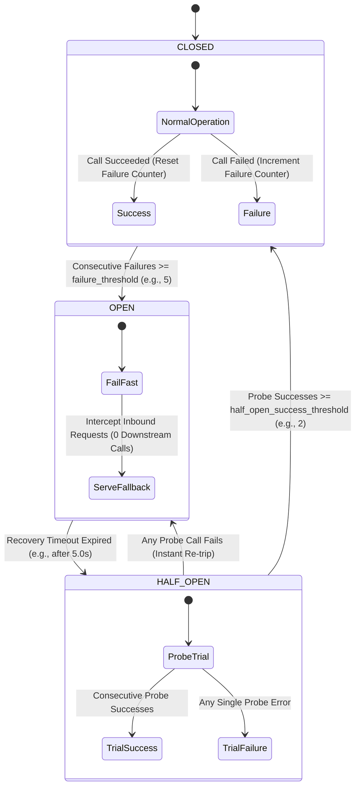
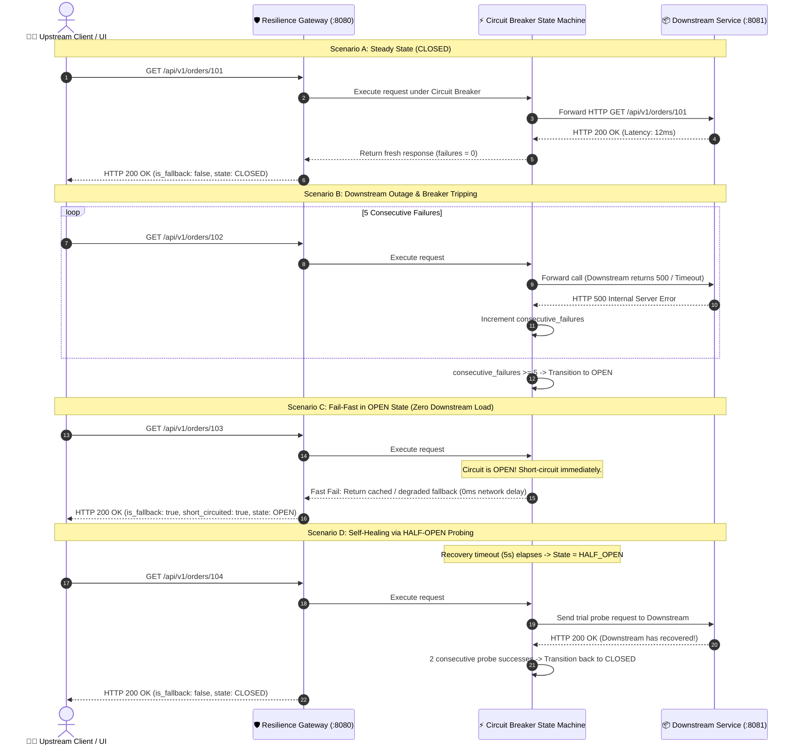

<!-- markdownlint-disable MD013 MD033 MD051 MD060 -->
# 06 - Circuit Breaker and Resilient Retry Engine

> A comprehensive, hands-on **Site Reliability Engineering (SRE) & Microservice Resilience Lab** implementing the **Circuit Breaker Pattern** (`CLOSED`, `OPEN`, `HALF-OPEN` states), **Exponential Backoff with Full Jitter Retries**, and **Graceful Degradation Fallbacks**. Protects upstream clients and downstream services against cascading outages, resource starvation, and thundering herd conditions.

---

## 📋 Table of Contents

1. [Architectural Overview & Resilience Topology](#-architectural-overview--resilience-topology)
   - [Circuit Breaker State Machine Diagram](#circuit-breaker-state-machine-diagram)
   - [Request Flow & Fail-Fast Sequence Diagram](#request-flow--fail-fast-sequence-diagram)
2. [Theoretical Deep-Dive for Beginners](#-theoretical-deep-dive-for-beginners)
   - [The Problem: Cascading Failures & Resource Starvation](#the-problem-cascading-failures--resource-starvation)
   - [The Solution: The Circuit Breaker Pattern](#the-solution-the-circuit-breaker-pattern)
   - [The Three States Explained in Depth](#the-three-states-explained-in-depth)
   - [Retry Strategies: Why Naive Retries Cause Cascading Outages](#retry-strategies-why-naive-retries-cause-cascading-outages)
   - [The Mathematics of Exponential Backoff with Full Jitter](#the-mathematics-of-exponential-backoff-with-full-jitter)
   - [Graceful Degradation & Fallback Design Patterns](#graceful-degradation--fallback-design-patterns)
3. [Repository & Directory Structure](#-repository--directory-structure)
4. [Prerequisites & Environment Setup](#-prerequisites--environment-setup)
5. [Quickstart Guide](#-quickstart-guide)
6. [Step-by-Step Hands-On Guide](#-step-by-step-hands-on-guide)
   - [Step 1: Start the Resilient Microservices Stack](#step-1-start-the-resilient-microservices-stack)
   - [Step 2: Test Steady-State Traffic in CLOSED State](#step-2-test-steady-state-traffic-in-closed-state)
   - [Step 3: Inject Downstream Faults & Trip Breaker to OPEN](#step-3-inject-downstream-faults--trip-breaker-to-open)
   - [Step 4: Verify Fail-Fast Behavior & Graceful Fallback](#step-4-verify-fail-fast-behavior--graceful-fallback)
   - [Step 5: Observe Self-Healing Transition (HALF-OPEN to CLOSED)](#step-5-observe-self-healing-transition-half-open-to-closed)
   - [Step 6: Test Exponential Backoff with Jitter Under Transient Faults](#step-6-test-exponential-backoff-with-jitter-under-transient-faults)
   - [Step 7: Inspect Prometheus Metrics & Telemetry](#step-7-inspect-prometheus-metrics--telemetry)
   - [Step 8: Execute the Complete Automated Test Suite](#step-8-execute-the-complete-automated-test-suite)
7. [Production SRE Best Practices & Anti-Patterns](#-production-sre-best-practices--anti-patterns)
8. [Troubleshooting & Common Gotchas](#-troubleshooting--common-gotchas)
9. [Resource Teardown & Complete Cleanup](#-resource-teardown--complete-cleanup)

---

## 🏛️ Architectural Overview & Resilience Topology

The resilience architecture consists of an edge **Resilience API Gateway / Client Proxy** (`resilience_gateway.py`), an integrated **Circuit Breaker & Backoff Engine** (`circuit_breaker.py`), and a mock backend **Downstream Microservice** (`downstream_service.py`) equipped with programmable chaos fault injection endpoints.

```text
                                 ┌──────────────────────────────────────────────────────────┐
                                 │                 🐳 sre-resilience-net                     │
                                 │                                                          │
   🧑‍💻 User / Client               │  ┌───────────────────────┐    ┌───────────────────────┐  │
 ────── HTTP Request ───────────►│  │  Resilience Gateway   │    │  Downstream Service   │  │
                                 │  │      (:8080)          │    │      (:8081)          │  │
 ◄──── Normal Response ──────────│  │                       │    │                       │  │
       OR                        │  │  ┌─────────────────┐  │    │  ┌─────────────────┐  │  │
 ◄──── Instant Fallback ─────────│  │  │ Circuit Breaker │  ├───►│  │ Order / Payment │  │  │
       (when OPEN)               │  │  │  State Machine  │  │    │  │ Business Logic  │  │  │
                                 │  │  └─────────────────┘  │    │  └─────────────────┘  │  │
                                 │  │  ┌─────────────────┐  │    │  ┌─────────────────┐  │  │
                                 │  │  │ Exponential     │  │    │  │ Chaos Fault     │  │  │
                                 │  │  │ Retry Engine    │  │    │  │ Injection Engine│  │  │
                                 │  │  └─────────────────┘  │    │  └─────────────────┘  │  │
                                 │  │  ┌─────────────────┐  │    │                       │  │
                                 │  │  │ Fallback Cache  │  │    │                       │  │
                                 │  │  └─────────────────┘  │    │                       │  │
                                 │  └───────────────────────┘    └───────────────────────┘  │
                                 └──────────────────────────────────────────────────────────┘
```

---

### Circuit Breaker State Machine Diagram

The Circuit Breaker models three discrete states (`CLOSED`, `OPEN`, `HALF_OPEN`):



---

### Request Flow & Fail-Fast Sequence Diagram



---

## 🧠 Theoretical Deep-Dive for Beginners

### The Problem: Cascading Failures & Resource Starvation

In a microservices ecosystem, service dependencies form a directed graph. When a downstream service experiences high latency, database connection exhaustion, or crashes:

```text
┌──────────────┐      ┌─────────────────┐      ┌────────────────────┐
│ User Browser │ ───► │  Order Gateway  │ ───► │  Inventory Service │ (SLOW / CRASHED)
└──────────────┘      └─────────────────┘      └────────────────────┘
                              │
                    Worker Threads Blocked
                    Sockets Exhausted (SYN_SENT)
                    Memory Saturated
                              ▼
                     GATEWAY CRASHES (Cascading Failure!)
```

1. **Thread Starvation**: The calling service holds open HTTP worker threads waiting for slow downstream socket reads.
2. **Resource Exhaustion**: File descriptors, connection pools, and memory are consumed, preventing the caller from serving unrelated healthy endpoints.
3. **Thundering Herd / Dogpiling**: When the crashed service attempts to restart, thousands of queued client retries hit it simultaneously, knocking it offline again instantly.

---

### The Solution: The Circuit Breaker Pattern

Originally popularized in electrical engineering (to prevent electric currents from setting house wires on fire) and introduced to software architecture by Michael Nygard in *Release It!*, the **Circuit Breaker** acts as a protective wrapper around remote calls.

Instead of endlessly hammering an unhealthy dependency, the circuit breaker **trips open**, intercepting subsequent requests and returning a fallback response **instantly**, allowing the failing downstream service time and breathing room to recover.

---

### The Three States Explained in Depth

| State | Gateway Action | Downstream Network Calls | Next State Transition |
| :--- | :--- | :--- | :--- |
| **`CLOSED`** | Passes all calls through normally. Tracks consecutive failures and resets counter on success. | **Yes** (100% of calls forwarded). | Transitions to **`OPEN`** if `consecutive_failures >= failure_threshold` (e.g. 5). |
| **`OPEN`** | Immediately rejects calls (**fail-fast**). Returns degraded fallback response with ~0ms network delay. | **No** (0 calls reach downstream). | Transitions to **`HALF_OPEN`** after `recovery_timeout` (e.g. 5.0 seconds). |
| **`HALF_OPEN`** | Permits a strictly limited number of **trial probe requests** (`half_open_max_trials`). | **Yes** (only trial probe requests). | Transitions to **`CLOSED`** on consecutive successes (`>= half_open_success_threshold`). Immediately trips to **`OPEN`** on any single failure. |

---

### Retry Strategies: Why Naive Retries Cause Cascading Outages

Retrying failed operations is a natural reaction, but **naive retries are one of the leading causes of large-scale cloud outages**:

1. **Immediate Retries**: Firing 3 requests immediately upon failure triples downstream load at the exact moment the service is struggling.
2. **Fixed-Interval Retries**: If 1,000 clients retry every 1.0 second, their retries align into synchronized waves (traffic spikes), creating destructive resonance.

---

### The Mathematics of Exponential Backoff with Full Jitter

To solve synchronization and traffic storms, resilient systems combine **Exponential Backoff** with **Full Jitter** (as proven by AWS Reliability Research):

$$\text{Ceiling}(attempt) = \min(\text{max\_backoff},\; \text{base\_backoff} \times 2^{attempt})$$

$$\text{Delay}_{\text{Full Jitter}} = \text{Uniform}(0,\; \text{Ceiling}(attempt))$$

```text
Attempt 0: Uniform(0, 0.1s)  -> Range: [0.00s, 0.10s]
Attempt 1: Uniform(0, 0.2s)  -> Range: [0.00s, 0.20s]
Attempt 2: Uniform(0, 0.4s)  -> Range: [0.00s, 0.40s]
Attempt 3: Uniform(0, 0.8s)  -> Range: [0.00s, 0.80s]
```

**Why Full Jitter?** Randomization flattens the retry curve across time, turning spiky shockwaves into a smooth, manageable background trickle.

#### Retry Rules: Retryable vs Non-Retryable Errors

- **Retryable**: HTTP 500 (Internal Server Error), 502 (Bad Gateway), 503 (Service Unavailable), 504 (Gateway Timeout), 429 (Rate Limited), network connection drops, socket timeouts.
- **Non-Retryable**: HTTP 400 (Bad Request), 401 (Unauthorized), 403 (Forbidden), 404 (Not Found), 422 (Unprocessable Entity). Retrying a 404 will never succeed and simply wastes CPU cycles.
- **Circuit Breaker Integration**: If the circuit breaker transitions to `OPEN` during retry attempts, all remaining retries are **aborted immediately** to enforce fail-fast behavior.

---

### Graceful Degradation & Fallback Design Patterns

When a downstream dependency is unavailable, returning an ugly HTTP 500 error degrades user trust. A resilient architecture serves **graceful fallbacks**:

1. **Stale / Cached Data**: Return read-only data cached in Redis or memory (e.g. catalog items, user profile).
2. **Default Static Values**: Return generic recommendations or placeholder widgets.
3. **Asynchronous Queueing**: For write operations (e.g. payment or checkout), accept the transaction into a durable offline queue (Kafka, RabbitMQ, SQS) and notify the user: *"Your order was received and is being processed."*
4. **Feature Degradation**: Temporarily disable non-critical features (e.g. user reviews or personalized recommendations) while keeping core checkout operational.

---

## 📁 Repository & Directory Structure

```text
10-sre-and-reliability/06-circuit-breaker-resilience-pattern/
├── .gitignore                          # Excludes pycache, logs, test artifacts
├── .markdownlint.json                  # Markdownlint rule configurations
├── Dockerfile.downstream               # Lightweight Python 3.11-slim container for downstream service
├── Dockerfile.gateway                  # Python 3.11-slim container for resilience gateway
├── README.md                           # Comprehensive technical and educational documentation
├── circuit_breaker.py                  # Core Circuit Breaker state machine & backoff engine
├── circuit_breaker_test.py             # Multi-threaded concurrency & state machine test suite
├── cleanup.sh                          # Automated resource teardown script
├── docker-compose.yml                  # Multi-container orchestration with isolated bridge network
├── downstream_service.py               # Mock downstream microservice with chaos fault endpoints
├── requirements.txt                    # Python dependencies
├── resilience_gateway.py               # Edge API gateway exposing proxy routes & Prometheus metrics
└── test_stack.sh                       # End-to-end automated test runner & markdown validator
```

---

## 🔧 Prerequisites & Environment Setup

Before running the project, verify that your local environment has the required tools installed:

1. **Docker Engine & Docker Compose**:
   - macOS: [Docker Desktop](https://www.docker.com/products/docker-desktop/) or [OrbStack](https://orbstack.dev/)
   - Linux: `sudo apt-get install docker.io docker-compose-v2`
2. **Python 3.10+**: For running test scripts directly on the host.
3. **curl**: Command-line HTTP client.
4. **pnpm** *(Optional)*: For running `markdownlint-cli` documentation verification.

Verify versions:

```bash
docker --version
docker compose version
python3 --version
curl --version
```

---

## ⚡ Quickstart Guide

Run the entire end-to-end lab and test suite with 3 simple commands:

```bash
# 1. Navigate to the project directory
cd 10-sre-and-reliability/06-circuit-breaker-resilience-pattern

# 2. Grant executable permissions to shell scripts
chmod +x test_stack.sh cleanup.sh circuit_breaker_test.py

# 3. Execute the complete automated test suite
./test_stack.sh
```

---

## 📖 Step-by-Step Hands-On Guide

### Step 1: Start the Resilient Microservices Stack

Launch the multi-container Docker Compose stack in detached mode:

```bash
docker compose up -d --build
```

Verify that both containers are running and healthy:

```bash
docker compose ps
```

*Expected output:*

```text
NAME                 IMAGE                               COMMAND                  SERVICE              STATUS                    PORTS
downstream-service   sre-downstream-service:latest       "python3 downstream_…"   downstream-service   Up (healthy)              0.0.0.0:8081->8081/tcp
resilience-gateway   sre-circuit-breaker-gateway:latest  "python3 resilience_…"   resilience-gateway   Up (healthy)              0.0.0.0:8080->8080/tcp
```

---

### Step 2: Test Steady-State Traffic in CLOSED State

Send a normal order retrieval request through the Resilience Gateway:

```bash
curl -i http://localhost:8080/api/v1/orders/ORD-9001
```

*Expected response (`HTTP 200 OK` with `is_fallback: false` and `circuit_state: "CLOSED"`):*

```json
{
  "gateway_status": "SUCCESS",
  "circuit_state": "CLOSED",
  "is_fallback": false,
  "short_circuited": false,
  "attempts": 1,
  "gateway_latency_ms": 12.45,
  "data": {
    "status": "CONFIRMED",
    "order_id": "ORD-9001",
    "customer_id": "cust_0452",
    "total_amount": 149.99,
    "currency": "USD",
    "items": [
      {
        "item_id": "SKU-PRO-001",
        "name": "Reliability Engineering Handbook",
        "qty": 1,
        "price": 49.99
      },
      {
        "item_id": "SKU-SRV-002",
        "name": "Cloud Observability Platform",
        "qty": 1,
        "price": 100.00
      }
    ]
  }
}
```

Check the circuit state:

```bash
curl -s http://localhost:8080/circuit/state | python3 -m json.tool
```

```json
{
  "name": "order-payment-downstream-breaker",
  "state": "CLOSED",
  "consecutive_failures": 0,
  "consecutive_successes": 0,
  "metrics": {
    "total_requests": 1,
    "successful_requests": 1,
    "failed_requests": 0,
    "fallback_requests": 0,
    "short_circuited_requests": 0
  }
}
```

---

### Step 3: Inject Downstream Faults & Trip Breaker to OPEN

Configure the mock downstream service to simulate a database outage by returning **HTTP 500 errors**:

```bash
curl -s -X POST http://localhost:8081/chaos/faults \
  -H "Content-Type: application/json" \
  -d '{"mode": "error", "error_code": 500, "error_message": "PostgreSQL connection pool exhausted"}'
```

Now, fire **5 consecutive requests** through the gateway to trigger the failure threshold:

```bash
for i in {1..5}; do
  curl -s http://localhost:8080/api/v1/orders/ORD-FAIL-$i | grep -o '"circuit_state": "[^"]*"'
done
```

*Expected output showing progression from CLOSED to OPEN:*

```text
"circuit_state": "CLOSED"
"circuit_state": "CLOSED"
"circuit_state": "CLOSED"
"circuit_state": "CLOSED"
"circuit_state": "OPEN"
```

Inspect the gateway state again:

```bash
curl -s http://localhost:8080/circuit/state | python3 -m json.tool
```

Notice that `"state": "OPEN"` and `"consecutive_failures": 5`.

---

### Step 4: Verify Fail-Fast Behavior & Graceful Fallback

While the circuit breaker is **`OPEN`**, send another request to the gateway:

```bash
curl -i http://localhost:8080/api/v1/orders/ORD-FAIL-FAST
```

*Expected response:*

```http
HTTP/1.0 200 OK
Content-Type: application/json
X-Gateway-Name: Resilience-Gateway
X-Circuit-State: OPEN
X-Fallback-Used: true

{
  "gateway_status": "DEGRADED_FALLBACK",
  "circuit_state": "OPEN",
  "is_fallback": true,
  "short_circuited": true,
  "attempts": 1,
  "gateway_latency_ms": 1.2,
  "data": {
    "order_id": "ORD-FAIL-FAST",
    "customer_id": "cust_cached_unknown",
    "status": "DEGRADED_CACHED",
    "message": "Real-time order details temporarily unavailable. Serving read-only cached snapshot.",
    "items": [
      {
        "item_id": "SKU-PRO-001",
        "name": "Reliability Engineering Handbook (Cached)",
        "qty": 1,
        "price": 49.99
      }
    ],
    "total_amount": 49.99,
    "fallback_served": true
  }
}
```

> [!TIP]
> Notice the response time: **`gateway_latency_ms: 1.2ms`** and **`short_circuited: true`**. No network connection was attempted against the downstream service. The downstream service was completely shielded from load!

---

### Step 5: Observe Self-Healing Transition (HALF-OPEN to CLOSED)

Heal the downstream service by resetting chaos fault injection:

```bash
curl -s -X POST http://localhost:8081/chaos/reset
```

Wait for the recovery timeout window (**5 seconds**) to expire:

```bash
echo "Waiting 5 seconds for recovery timeout..." && sleep 5.5
```

Send the **first trial probe request**:

```bash
curl -s http://localhost:8080/api/v1/orders/ORD-PROBE-1 | python3 -m json.tool
```

Send the **second trial probe request**:

```bash
curl -s http://localhost:8080/api/v1/orders/ORD-PROBE-2 | python3 -m json.tool
```

Inspect the transition history to verify that the circuit self-healed:

```bash
curl -s http://localhost:8080/circuit/history | python3 -m json.tool
```

*Expected history snippet:*

```json
[
  {
    "from_state": "CLOSED",
    "to_state": "OPEN",
    "reason": "Exceeded failure threshold (5/5 consecutive errors)..."
  },
  {
    "from_state": "OPEN",
    "to_state": "HALF_OPEN",
    "reason": "Recovery timeout (5.0s) expired; initiating probe trial."
  },
  {
    "from_state": "HALF_OPEN",
    "to_state": "CLOSED",
    "reason": "Successfully verified 2 probe requests. Circuit fully healed."
  }
]
```

---

### Step 6: Test Exponential Backoff with Jitter Under Transient Faults

Test the payment processing endpoint with graceful fallback:

```bash
curl -s -X POST http://localhost:8080/api/v1/payments/process \
  -H "Content-Type: application/json" \
  -d '{"amount": 250.00, "card_last4": "1234"}' | python3 -m json.tool
```

Now, manually trip the circuit breaker using the administrative endpoint to simulate an emergency operator intervention:

```bash
curl -s -X POST http://localhost:8080/circuit/trip \
  -H "Content-Type: application/json" \
  -d '{"reason": "SRE GameDay chaos drill"}' | python3 -m json.tool
```

Submit a payment while the circuit is tripped:

```bash
curl -s -X POST http://localhost:8080/api/v1/payments/process \
  -H "Content-Type: application/json" \
  -d '{"amount": 250.00, "card_last4": "1234"}' | python3 -m json.tool
```

*Expected response: Payment is accepted into offline durable queue rather than failing with an error:*

```json
{
  "gateway_status": "DEGRADED_FALLBACK",
  "circuit_state": "OPEN",
  "is_fallback": true,
  "short_circuited": true,
  "attempts": 1,
  "data": {
    "transaction_id": "queued_async_1740528000",
    "payment_status": "QUEUED_FOR_RETRY",
    "message": "Payment processing downstream is currently degraded. Transaction accepted into durable offline queue.",
    "amount": 250.0,
    "fallback_served": true
  }
}
```

Reset the circuit back to normal:

```bash
curl -s -X POST http://localhost:8080/circuit/reset \
  -H "Content-Type: application/json" \
  -d '{"reason": "GameDay drill finished"}'
```

---

### Step 7: Inspect Prometheus Metrics & Telemetry

Scrape the `/metrics` endpoint to observe Prometheus metrics:

```bash
curl -s http://localhost:8080/metrics
```

*Expected output:*

```text
# HELP circuit_breaker_state Current state of circuit breaker (0=CLOSED, 1=HALF_OPEN, 2=OPEN)
# TYPE circuit_breaker_state gauge
circuit_breaker_state{name="order-payment-downstream-breaker"} 0
# HELP circuit_breaker_requests_total Total requests processed by circuit breaker
# TYPE circuit_breaker_requests_total counter
circuit_breaker_requests_total{name="order-payment-downstream-breaker"} 14
# HELP circuit_breaker_successful_requests_total Successful requests processed
# TYPE circuit_breaker_successful_requests_total counter
circuit_breaker_successful_requests_total{name="order-payment-downstream-breaker"} 8
# HELP circuit_breaker_failed_requests_total Failed requests recorded
# TYPE circuit_breaker_failed_requests_total counter
circuit_breaker_failed_requests_total{name="order-payment-downstream-breaker"} 6
# HELP circuit_breaker_fallback_requests_total Fallback responses served
# TYPE circuit_breaker_fallback_requests_total counter
circuit_breaker_fallback_requests_total{name="order-payment-downstream-breaker"} 6
# HELP circuit_breaker_short_circuited_total Short-circuited fast-fail requests
# TYPE circuit_breaker_short_circuited_total counter
circuit_breaker_short_circuited_total{name="order-payment-downstream-breaker"} 4
# HELP circuit_breaker_retries_total Total retry attempts executed
# TYPE circuit_breaker_retries_total counter
circuit_breaker_retries_total{name="order-payment-downstream-breaker"} 3
```

---

### Step 8: Execute the Complete Automated Test Suite

Run the full Python concurrency and state transition test suite:

```bash
python3 circuit_breaker_test.py --gateway-url http://localhost:8080 --downstream-url http://localhost:8081
```

*Expected output:*

```text
======================================================================
  🚀 CIRCUIT BREAKER & RETRY ENGINE VALIDATION SUITE
======================================================================
  [PASS] 1. Steady-State Baseline (CLOSED state, 100% success) (0.04s)
  [PASS] 2. Circuit Tripping (Transition to OPEN after 5 consecutive failures) (0.12s)
  [PASS] 3. Fail-Fast Execution (Zero downstream network calls in OPEN state) (0.01s)
  [PASS] 4. Recovery Timeout & Transition to HALF_OPEN probe state (2.23s)
  [PASS] 5. Circuit Self-Healing (HALF_OPEN -> CLOSED on consecutive successes) (0.02s)
  [PASS] 6. Probe Failure Re-trip (HALF_OPEN -> OPEN immediately on probe error) (2.25s)
  [PASS] 7. Exponential Backoff & Jitter Timing Validation (0.28s)
  [PASS] 8. Multi-Threaded Concurrency & Thundering Herd Protection (30 workers) (1.85s)
  [PASS] 9. Operational Controls (Manual Trip & Reset Endpoints) (0.02s)
  [PASS] 10. Prometheus Telemetry & Metrics Export (/metrics) (0.01s)

======================================================================
  📊 GENERATING TEST REPORTS
======================================================================
  [OK] Generated JSON report: test_report.json
  [OK] Generated Markdown report: test_report.md

Results: 10 Passed, 0 Failed of 10 total.
```

---

## 🎯 Production SRE Best Practices & Anti-Patterns

### ✅ SRE Best Practices

1. **Set Socket Timeouts Shorter Than Gateway Timeouts**: Always set client socket timeouts (e.g. 500ms - 1000ms) significantly lower than edge load balancer timeouts (e.g. 30s) to prevent thread pileup.
2. **Combine Circuit Breakers with Fallback Caches**: Never return an unhandled 500 error to users when cached stale data is acceptable for the user experience.
3. **Always Add Jitter to Exponential Backoff**: Eliminates synchronized request waves (thundering herds).
4. **Export Gauges for Circuit States**: Alert your SRE team immediately if `circuit_breaker_state == 2` (OPEN) for more than 60 consecutive seconds.
5. **Differentiate Transient from Permanent Errors**: Only retry idempotent requests and transient status codes (503, 504, 429, timeouts). Never retry client input errors (400, 404, 422).

### ❌ Anti-Patterns to Avoid

- **Infinite Retries (`while True: retry()`)**: Knocks down downstream services indefinitely and exhausts client CPU/memory.
- **Circuit Breakers Without Fallbacks**: Short-circuiting directly to a generic error page without degraded content creates poor user experiences.
- **Sharing Breakers Across Unrelated Endpoints**: Maintain separate Circuit Breaker state machines per distinct downstream service to prevent localized failures from poisoning the entire application.

---

## 🔍 Troubleshooting & Common Gotchas

### 1. Port 8080 or 8081 already in use

If another service is already using port 8080 or 8081:

```bash
# Check what process is occupying the port
lsof -i :8080 -i :8081

# Override ports in docker-compose or run cleanup
./cleanup.sh
```

### 2. Timeout waiting for services to become healthy

If Docker startup is slow, check container logs:

```bash
docker compose logs -f
```

### 3. Circuit breaker trips immediately during tests

Ensure downstream chaos has been reset:

```bash
curl -X POST http://localhost:8081/chaos/reset
curl -X POST http://localhost:8080/circuit/reset -H "Content-Type: application/json" -d '{"reason":"Manual fix"}'
```

---

## 🧹 Resource Teardown & Complete Cleanup

To clean up all resources created during this lab (containers, networks, images, temporary files) and leave your environment completely pristine for subsequent mini-projects:

### Standard Teardown (Containers, Networks & Local Artifacts)

```bash
./cleanup.sh
```

### Complete Deep Cleanup (Including Docker Images & Build Caches)

```bash
./cleanup.sh --all
```

### Manual Teardown Equivalent Commands

If you prefer to run the commands manually:

```bash
# 1. Stop and remove all containers and network
docker compose down -v --remove-orphans

# 2. Remove built Docker container images
docker rmi -f sre-circuit-breaker-gateway:latest sre-downstream-service:latest python:3.11-slim

# 3. Clean local temporary test artifacts and Python cache
rm -f test_report.md test_report.json *.log
find . -type d -name "__pycache__" -exec rm -rf {} +
find . -type d -name ".pytest_cache" -exec rm -rf {} +
```

### Verification of Complete Cleanup

Verify that no leftover containers, volumes, or networks exist:

```bash
docker ps -a --filter "name=resilience-gateway" --filter "name=downstream-service"
docker network ls --filter "name=sre-resilience-net"
```

*Output should be completely empty!*
