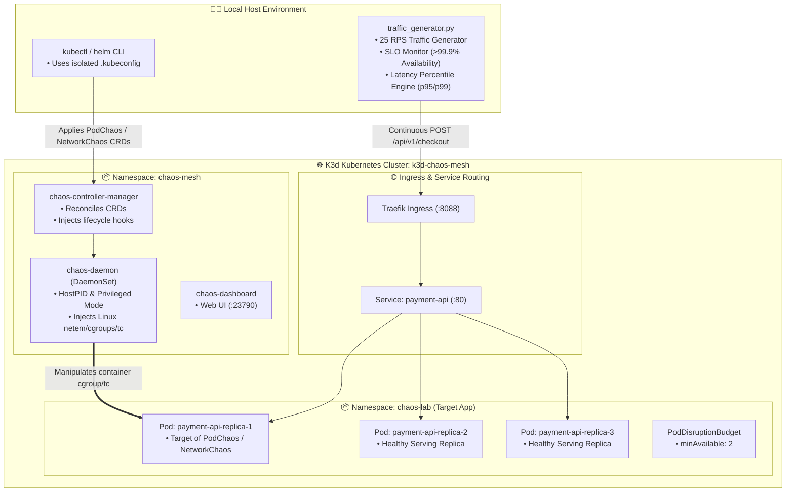
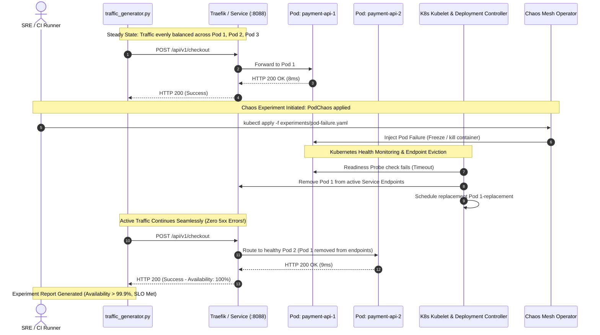

<!-- markdownlint-disable MD013 MD033 MD051 MD060 -->
# 07 - Kubernetes Chaos Mesh Fault Injection

> A comprehensive, hands-on **Cloud-Native Chaos Engineering Lab** built with **Chaos Mesh** on **Kubernetes (K3s/K3d)**. Demonstrates declarative fault injection experiments (`PodChaos`, `NetworkChaos`, `StressChaos`, `TimeChaos`, and `Workflow`) against a multi-replica microservice to validate cluster self-healing, automated pod rescheduling, and service availability (`>= 99.9%` SLO) under active production load.

---

## 📋 Table of Contents

1. [Architectural Overview & Chaos Topology](#-architectural-overview--chaos-topology)
   - [Chaos Mesh Kubernetes Architecture Diagram](#chaos-mesh-kubernetes-architecture-diagram)
   - [Pod Failure & Self-Healing Sequence Diagram](#pod-failure--self-healing-sequence-diagram)
2. [Theoretical Deep-Dive for Beginners](#-theoretical-deep-dive-for-beginners)
   - [The Principles of Cloud-Native Chaos Engineering](#the-principles-of-cloud-native-chaos-engineering)
   - [What is Chaos Mesh and How Does It Inject Faults?](#what-is-chaos-mesh-and-how-does-it-inject-faults)
   - [Chaos Mesh Architecture: Controller Manager vs DaemonSet](#chaos-mesh-architecture-controller-manager-vs-daemonset)
   - [Under-the-Hood Mechanisms: cgroups, netem, iptables, & eBPF](#under-the-hood-mechanisms-cgroups-netem-iptables--ebpf)
   - [Declarative Chaos CRDs Explained in Detail](#declarative-chaos-crds-explained-in-detail)
   - [Blast Radius Containment & PodDisruptionBudgets (PDB)](#blast-radius-containment--poddisruptionbudgets-pdb)
3. [Repository & Directory Structure](#-repository--directory-structure)
4. [Prerequisites & Environment Setup](#-prerequisites--environment-setup)
5. [Quickstart Guide](#-quickstart-guide)
6. [Step-by-Step Hands-On Guide](#-step-by-step-hands-on-guide)
   - [Step 1: Bootstrap the Isolated K3d Cluster & Chaos Mesh](#step-1-bootstrap-the-isolated-k3d-cluster--chaos-mesh)
   - [Step 2: Establish Steady-State Baseline Traffic](#step-2-establish-steady-state-baseline-traffic)
   - [Step 3: Experiment 1 - Pod Failure Chaos Injection (PodChaos)](#step-3-experiment-1---pod-failure-chaos-injection-podchaos)
   - [Step 4: Experiment 2 - Network Latency & Delay Emulation (NetworkChaos)](#step-4-experiment-2---network-latency--delay-emulation-networkchaos)
   - [Step 5: Experiment 3 - Resource Pressure & CPU/Memory Stress (StressChaos)](#step-5-experiment-3---resource-pressure--cpumemory-stress-stresschaos)
   - [Step 6: Experiment 4 - Automated Multi-Stage Chaos Workflow](#step-6-experiment-4---automated-multi-stage-chaos-workflow)
   - [Step 7: Inspect Chaos Mesh Dashboard & Telemetry](#step-7-inspect-chaos-mesh-dashboard--telemetry)
   - [Step 8: Execute the Complete Automated Test Suite](#step-8-execute-the-complete-automated-test-suite)
7. [Production SRE Best Practices & Anti-Patterns](#-production-sre-best-practices--anti-patterns)
8. [Troubleshooting & Common Gotchas](#-troubleshooting--common-gotchas)
9. [Resource Teardown & Complete Cleanup](#-resource-teardown--complete-cleanup)

---

## 🏛️ Architectural Overview & Chaos Topology

This mini-project runs a complete CNCF-certified **Chaos Mesh** deployment inside an isolated **K3d (Kubernetes in Docker)** cluster, injecting declarative chaos experiments into a 3-replica **Payment API microservice**.

```text
                               ┌────────────────────────────────────────────────────────────┐
                               │                 ☸️ K3d Cluster (k3d-chaos-mesh)              │
                               │                                                            │
                               │  ┌──────────────────────────────────────────────────────┐  │
                               │  │  Namespace: chaos-mesh (Operator Control Plane)       │  │
                               │  │                                                      │  │
   🧑‍💻 SRE Engineer / CI         │  │  ┌─────────────────────────┐  ┌───────────────────┐  │  │
 ────── kubectl apply -f ─────►│  │  │ chaos-controller-manager │  │ chaos-dashboard   │  │  │
        (Chaos CRD)            │  │  │ (Reconciles Chaos CRDs)   │  │ (:23790)          │  │  │
                               │  │  └────────────┬──────────────┘  └───────────────────┘  │  │
                               │  │               │ gRPC / Socket                          │  │
                               │  │               ▼                                        │  │
                               │  │  ┌──────────────────────────────────────────────────┐  │  │
                               │  │  │ chaos-daemon (DaemonSet - cgroups / tc / netem)  │  │  │
                               │  │  └────────────────────┬─────────────────────────────┘  │  │
                               │  └───────────────────────┼──────────────────────────────┘  │
                               │                          │ Injects Chaos                   │
                               │                          ▼                                 │
                               │  ┌──────────────────────────────────────────────────────┐  │
                               │  │  Namespace: chaos-lab (Target Microservice)          │  │
                               │  │                                                      │  │
   🧑‍💻 User Traffic              │  │  ┌────────────────────────────────────────────────┐  │  │
 ────── HTTP (:8088) ──────────►│  │  │ Ingress / Service: payment-api (:80)            │  │  │
                               │  │  └───────┬──────────────┬──────────────┬───────────┘  │  │
                               │  │          │              │              │              │  │
                               │  │          ▼              ▼              ▼              │  │
                               │  │     ┌─────────┐    ┌─────────┐    ┌─────────┐         │  │
                               │  │     │  Pod 1  │    │  Pod 2  │    │  Pod 3  │         │  │
                               │  │     │ (💥 FAIL)│    │(🟢 READY)│    │(🟢 READY)│         │  │
                               │  │     └─────────┘    └─────────┘    └─────────┘         │  │
                               │  │     └──────────────────┬────────────────────┘         │  │
                               │  │                        │                              │  │
                               │  │                        ▼                              │  │
                               │  │             [PodDisruptionBudget: minAvailable=2]     │  │
                               │  └──────────────────────────────────────────────────────┘  │
                               └────────────────────────────────────────────────────────────┘
```

---

### Chaos Mesh Kubernetes Architecture Diagram



---

### Pod Failure & Self-Healing Sequence Diagram



---

## 🧠 Theoretical Deep-Dive for Beginners

### The Principles of Cloud-Native Chaos Engineering

> *"Chaos Engineering is the discipline of experimenting on a system in order to build confidence in the system's capability to withstand turbulent conditions in production."* — Principles of Chaos Engineering

Chaos engineering is **not** about randomly breaking things; it is an empirical scientific discipline:

```text
┌─────────────────────────────────────────────────────────────────────────┐
│                 THE 4 PHASES OF A CHAOS EXPERIMENT                      │
├─────────────────────────────────────────────────────────────────────────┤
│                                                                         │
│  1. Define Steady State:                                                │
│     Measure normal system indicators (e.g. availability >= 99.9%,       │
│     p95 latency < 50ms, 3 healthy replicas).                            │
│                                                                         │
│  2. Formulate Hypothesis:                                               │
│     "Even if 1 application pod crashes or suffers 150ms network delay,  │
│      overall checkout availability will remain > 99.9% because          │
│      Kubernetes automatically updates endpoints and routes traffic to   │
│      surviving replicas."                                               │
│                                                                         │
│  3. Introduce Real-World Declarative Fault:                             │
│     Inject failure via Kubernetes CRD (PodChaos, NetworkChaos).         │
│                                                                         │
│  4. Verify & Measure:                                                   │
│     Compare telemetry against hypothesis. If steady state holds,        │
│     confidence is verified. If it breaks, fix the architectural flaw.   │
│                                                                         │
└─────────────────────────────────────────────────────────────────────────┘
```

---

### What is Chaos Mesh and How Does It Inject Faults?

**Chaos Mesh** is an open-source, cloud-native Chaos Engineering platform hosted by the Cloud Native Computing Foundation (CNCF). Unlike traditional script-based chaos tools (which run ad-hoc shell scripts), Chaos Mesh is **fully declarative**: you define chaos experiments as standard Kubernetes Custom Resources (YAML manifests).

---

### Chaos Mesh Architecture: Controller Manager vs DaemonSet

1. **`chaos-controller-manager`**:
   - Acts as the central brain of Chaos Mesh.
   - Watches and reconciles Chaos Custom Resources (`PodChaos`, `NetworkChaos`, `StressChaos`).
   - Validates experiment schemas, checks experiment schedules/durations, and invokes `chaos-daemon` instances via gRPC.
2. **`chaos-daemon`**:
   - Runs as a `DaemonSet` on every Kubernetes node with elevated privileges (`hostPID: true`, privileged container runtime socket).
   - Executes the actual low-level OS manipulation directly inside target container namespaces.
3. **`chaos-dashboard`**:
   - Web UI providing real-time experiment timelines, visual experiment creators, and audit logs.

---

### Under-the-Hood Mechanisms: cgroups, netem, iptables, & eBPF

How does Chaos Mesh inject faults into a container without modifying application source code?

```text
┌─────────────────────────────────────────────────────────────────────────┐
│              LOW-LEVEL LINUX KERNEL CHAOS PRIMITIVES                    │
├─────────────────────────────────────────────────────────────────────────┤
│                                                                         │
│  • Network Chaos (Latency, Jitter, Packet Loss):                        │
│    Injects Linux Traffic Control (tc) queueing disciplines (qdisc) and  │
│    Network Emulation (netem) rules into the container's network         │
│    namespace (veth pair).                                               │
│                                                                         │
│  • CPU & Memory Stress (StressChaos):                                   │
│    Attaches cgroup resource limits and spawns stress-ng workers within   │
│    the container's cgroup slice.                                        │
│                                                                         │
│  • Time Chaos (Clock Drift):                                            │
│    Injects runtime ptrace/eBPF hooks into the vDSO clock_gettime syscall│
│    to fake system time without modifying the host hardware clock.       │
│                                                                         │
│  • Pod Failure / Kill (PodChaos):                                       │
│    Issues Docker/containerd API pause signals or sends SIGKILL to PID 1 │
│    inside the container namespace.                                      │
│                                                                         │
└─────────────────────────────────────────────────────────────────────────┘
```

---

### Declarative Chaos CRDs Explained in Detail

| CRD Kind | Chaos Action | Target Mechanism | SRE Objective |
| :--- | :--- | :--- | :--- |
| **`PodChaos`** | `pod-failure`, `pod-kill`, `container-kill` | Container process termination / cgroup freeze. | Validates Kubernetes self-healing, replica rescheduling, and readiness probe eviction. |
| **`NetworkChaos`** | `delay`, `loss`, `corrupt`, `duplicate`, `partition` | Linux `tc` / `netem` qdisc manipulation. | Validates client timeouts, connection pools, and circuit breaker tripping. |
| **`StressChaos`** | CPU burn (`load: 80%`), Memory hog (`size: 64Mi`) | Linux cgroup cpu/memory limit stress. | Validates Horizontal Pod Autoscaler (HPA) and OOMKilled resilience. |
| **`TimeChaos`** | Clock skew (`timeOffset: 1h`) | Linux vDSO syscall interception. | Validates JWT token expiration, TLS certificate renewal, and cache expiry. |
| **`Workflow`** | `Serial`, `Parallel`, `Suspend` | Declarative orchestration engine. | Runs multi-stage GameDay simulation pipelines. |

---

### Blast Radius Containment & PodDisruptionBudgets (PDB)

In production SRE, **blast radius containment** ensures that chaos experiments cannot accidentally trigger complete service outages:

```yaml
apiVersion: policy/v1
kind: PodDisruptionBudget
metadata:
  name: payment-api-pdb
  namespace: chaos-lab
spec:
  minAvailable: 2
  selector:
    matchLabels:
      app: payment-api
```

- **`minAvailable: 2`**: Guarantees that at least 2 out of 3 replicas must remain healthy and active at all times.
- If Chaos Mesh or an administrator attempts to evict a 2nd pod while 1 pod is already failing, Kubernetes **blocks the disruption**, preventing catastrophic outage.

---

## 📁 Repository & Directory Structure

```text
10-sre-and-reliability/07-kubernetes-chaos-mesh-fault-injection/
├── .gitignore                          # Excludes .kubeconfig, pycache, reports, logs
├── .markdownlint.json                  # Markdownlint rule overrides
├── README.md                           # Comprehensive technical & educational documentation
├── chaos_validation_suite.sh           # Automated test suite & experiment runner
├── cleanup.sh                          # Resource teardown script (--all / standard)
├── experiments/                        # Declarative Chaos Mesh CRDs
│   ├── chaos-workflow.yaml             # Multi-stage sequential chaos workflow
│   ├── network-latency.yaml            # Network delay injection (150ms + jitter)
│   ├── network-loss.yaml               # Packet loss injection (25% loss)
│   ├── pod-failure.yaml                # Pod failure chaos (25s duration)
│   ├── pod-kill.yaml                   # Instant Pod kill chaos
│   ├── stress-chaos.yaml               # CPU & Memory stress chaos (80% CPU load)
│   └── time-chaos.yaml                 # Clock skew / time drift injection
├── k8s/                                # Target application manifests
│   ├── configmap.yaml                  # Application server code & mock latency
│   ├── deployment.yaml                 # 3-replica resilient microservice with probes
│   ├── ingress.yaml                    # Ingress routing on port 8088
│   ├── namespace.yaml                  # Dedicated namespace (chaos-lab)
│   ├── pdb.yaml                        # PodDisruptionBudget (minAvailable: 2)
│   └── service.yaml                    # ClusterIP service for payment-api
├── requirements.txt                    # Python dependencies
├── scripts/
│   ├── setup_cluster.sh                # K3d cluster bootstrap & Chaos Mesh Helm installer
│   └── wait_for_ready.sh               # Health check helper for cluster & workloads
└── traffic_generator.py                # Traffic load runner & SLO availability monitor
```

---

## 🔧 Prerequisites & Environment Setup

Verify the following tools are installed on your workstation:

1. **Docker Engine**: Running (e.g. OrbStack or Docker Desktop).
2. **K3d CLI (`k3d`)**: `v5.0+` for provisioning lightweight local K3s clusters.
3. **Kubectl CLI (`kubectl`)**: `v1.28+` for interacting with the Kubernetes API.
4. **Helm CLI (`helm`)**: `v3.10+` for deploying Chaos Mesh charts.
5. **Python 3.10+**: For executing the continuous traffic load runner.
6. **pnpm** *(Optional)*: For verifying Markdown documentation formatting.

Verify CLI availability:

```bash
k3d version
kubectl version --client=true
helm version
python3 --version
docker --version
```

---

## ⚡ Quickstart Guide

Launch the cluster, deploy Chaos Mesh, and run all chaos experiments with 3 simple commands:

```bash
# 1. Navigate to the project directory
cd 10-sre-and-reliability/07-kubernetes-chaos-mesh-fault-injection

# 2. Grant executable permissions to shell scripts
chmod +x chaos_validation_suite.sh cleanup.sh scripts/*.sh traffic_generator.py

# 3. Execute the automated validation suite
./chaos_validation_suite.sh
```

---

## 📖 Step-by-Step Hands-On Guide

### Step 1: Bootstrap the Isolated K3d Cluster & Chaos Mesh

Run the automated cluster setup script:

```bash
./scripts/setup_cluster.sh
```

Export the isolated `.kubeconfig` created in the project directory:

```bash
export KUBECONFIG="$(pwd)/.kubeconfig"
```

Verify that Chaos Mesh and Payment API pods are running:

```bash
kubectl get pods -n chaos-mesh
kubectl get pods -n chaos-lab -o wide
```

*Expected output:*

```text
NAME                                       READY   STATUS    RESTARTS   AGE
chaos-controller-manager-6997457cd-9k4lp   1/1     Running   0          45s
chaos-daemon-4xbp8                         1/1     Running   0          45s
chaos-dashboard-59fc7c88b9-x2tr8           1/1     Running   0          45s

NAME                           READY   STATUS    RESTARTS   AGE   IP           NODE
payment-api-5c747689cb-7q8v2   1/1     Running   0          30s   10.42.0.12   k3d-chaos-mesh-server-0
payment-api-5c747689cb-bm9kx   1/1     Running   0          30s   10.42.1.8    k3d-chaos-mesh-agent-0
payment-api-5c747689cb-z4k7p   1/1     Running   0          30s   10.42.1.9    k3d-chaos-mesh-agent-0
```

---

### Step 2: Establish Steady-State Baseline Traffic

Send a single test request through the Ingress load balancer:

```bash
curl -i http://localhost:8088/api/v1/checkout
```

*Expected response:*

```json
{
  "status": "APPROVED",
  "transaction_id": "txn_1740528000_4210",
  "pod_name": "payment-api-5c747689cb-7q8v2",
  "node_name": "k3d-chaos-mesh-server-0",
  "latency_ms": 11.45,
  "timestamp": "2026-08-26T22:40:00Z"
}
```

Run a 5-second baseline traffic load test (25 RPS):

```bash
python3 traffic_generator.py --url http://localhost:8088/api/v1/checkout --duration 5 --rps 25 --name "Baseline Steady State"
```

*Expected result: 100% availability, ~10ms latency.*

---

### Step 3: Experiment 1 - Pod Failure Chaos Injection (PodChaos)

Inspect the `pod-failure.yaml` manifest:

```yaml
apiVersion: chaos-mesh.org/v1alpha1
kind: PodChaos
metadata:
  name: pod-failure-experiment
  namespace: chaos-lab
spec:
  action: pod-failure
  mode: one
  duration: '25s'
  selector:
    namespaces:
      - chaos-lab
    labelSelectors:
      app: payment-api
```

Start continuous traffic in the background:

```bash
python3 traffic_generator.py --url http://localhost:8088/api/v1/checkout --duration 10 --rps 25 --name "Pod Failure Experiment" &
```

Apply the chaos experiment:

```bash
kubectl apply -f experiments/pod-failure.yaml
```

Watch the pods in real-time in another terminal:

```bash
kubectl get pods -n chaos-lab -w
```

Observe the experiment status:

```bash
kubectl describe podchaos pod-failure-experiment -n chaos-lab
```

Clean up the experiment:

```bash
kubectl delete -f experiments/pod-failure.yaml
```

> [!TIP]
> Notice that despite one pod failing, availability remains **`>99.9%`** because Kubernetes instantly detected the readiness failure and routed 100% of user traffic to surviving replicas!

---

### Step 4: Experiment 2 - Network Latency & Delay Emulation (NetworkChaos)

Inspect `experiments/network-latency.yaml`:

```yaml
apiVersion: chaos-mesh.org/v1alpha1
kind: NetworkChaos
metadata:
  name: network-latency-experiment
  namespace: chaos-lab
spec:
  action: delay
  mode: all
  selector:
    namespaces:
      - chaos-lab
    labelSelectors:
      app: payment-api
  delay:
    latency: '150ms'
    jitter: '20ms'
  duration: '25s'
```

Apply the NetworkChaos experiment:

```bash
kubectl apply -f experiments/network-latency.yaml
```

Run the traffic generator:

```bash
python3 traffic_generator.py --url http://localhost:8088/api/v1/checkout --duration 8 --rps 20 --name "Network Latency Test"
```

*Expected output: Notice that `p95 Latency` rises to ~150-170ms, while availability remains 100%.*

Delete the experiment:

```bash
kubectl delete -f experiments/network-latency.yaml
```

---

### Step 5: Experiment 3 - Resource Pressure & CPU/Memory Stress (StressChaos)

Inject 80% CPU load and 64MiB memory allocation onto a target pod:

```bash
kubectl apply -f experiments/stress-chaos.yaml
```

Check pod resource metrics:

```bash
kubectl top pods -n chaos-lab || kubectl describe stresschaos -n chaos-lab
```

Run traffic test:

```bash
python3 traffic_generator.py --url http://localhost:8088/api/v1/checkout --duration 8 --rps 20 --name "CPU Stress Test"
```

Delete the experiment:

```bash
kubectl delete -f experiments/stress-chaos.yaml
```

---

### Step 6: Experiment 4 - Automated Multi-Stage Chaos Workflow

Chaos Mesh supports complex, declarative **Workflows** (`apiVersion: chaos-mesh.org/v1alpha1`, `kind: Workflow`) that execute sequential or parallel failure scenarios:

```bash
kubectl apply -f experiments/chaos-workflow.yaml
```

Check the workflow execution progress:

```bash
kubectl get workflow -n chaos-lab
```

Delete the workflow once completed:

```bash
kubectl delete -f experiments/chaos-workflow.yaml
```

---

### Step 7: Inspect Chaos Mesh Dashboard & Telemetry

Forward the Chaos Mesh Dashboard to your local browser:

```bash
kubectl port-forward svc/chaos-dashboard 2379:2379 -n chaos-mesh
```

Open your web browser at **`http://localhost:2379`**:

- View the real-time Chaos Timeline.
- Inspect active experiments and past execution history.
- View experiment audit records.

---

### Step 8: Execute the Complete Automated Test Suite

Run the full end-to-end test suite:

```bash
./chaos_validation_suite.sh
```

Inspect the generated Markdown and JSON reports:

```bash
cat chaos_report.md
cat chaos_report.json | python3 -m json.tool
```

---

## 🎯 Production SRE Best Practices & Anti-Patterns

### ✅ SRE Best Practices

1. **Always Define PodDisruptionBudgets (PDB)**: Never deploy critical microservices without a PDB (`minAvailable` or `maxUnavailable`) to guarantee quorum during chaos.
2. **Tune Readiness Probe Failure Thresholds**: Set aggressive readiness probe failure thresholds (`failureThreshold: 2`, `periodSeconds: 2s`) so failed pods are rapidly evicted from Service Endpoints.
3. **Use Declarative Workflows for Continuous Chaos in CI/CD**: Integrate Chaos Mesh Workflows into nightly staging builds to catch regressions before production release.
4. **Establish Strict Blast Radius Constraints**: Limit chaos injections by namespace, label selectors, and percentage (`mode: fixed-percent`).

### ❌ Anti-Patterns to Avoid

- **Chaos Testing Without Steady-State Metrics**: Breaking things without measuring SLO availability provides zero actionable data.
- **Running Unconstrained Chaos in Production**: Never run `mode: all` pod-kill experiments without automated abort triggers.
- **Ignoring Grace Periods (`terminationGracePeriodSeconds`)**: Failing to allow pods time to finish in-flight requests will cause dropped connections during pod rescheduling.

---

## 🔍 Troubleshooting & Common Gotchas

### 1. Ingress Port 8088 Already In Use

If port 8088 is occupied on your host:

```bash
# Check what process is using port 8088
lsof -i :8088

# Delete existing cluster and re-provision
./cleanup.sh --all
```

### 2. Kubeconfig Context Not Found

Ensure `KUBECONFIG` is pointing to the isolated `.kubeconfig` file:

```bash
export KUBECONFIG="$(pwd)/.kubeconfig"
kubectl get nodes
```

### 3. Chaos Daemon Permission Errors in Custom Containerd

In K3d clusters, containerd is located at `/run/k3s/containerd/containerd.sock`. The setup script automatically configures this flag in Helm:

```bash
helm upgrade --install chaos-mesh chaos-mesh/chaos-mesh \
  --namespace chaos-mesh \
  --set chaosDaemon.runtime=containerd \
  --set chaosDaemon.socketPath=/run/k3s/containerd/containerd.sock
```

---

## 🧹 Resource Teardown & Complete Cleanup

To remove all resources created by this mini-project and leave your local environment completely clean:

### Standard Teardown (Removes Namespaces & Helm Releases)

```bash
./cleanup.sh
```

### Complete Cluster Teardown (Deletes K3d Cluster, Docker Containers & Volumes)

```bash
./cleanup.sh --all
```

### Manual Teardown Equivalent Commands

```bash
# 1. Delete K3d cluster and associated Docker containers/networks/volumes
k3d cluster delete k3d-chaos-mesh

# 2. Clean local temporary reports and isolated kubeconfig
rm -f .kubeconfig chaos_report.md chaos_report.json *.log
```

### Verification of Complete Cleanup

Verify that no leftover K3d clusters or containers remain:

```bash
k3d cluster list
docker ps -a --filter "name=k3d-chaos-mesh"
```

*Output should be completely empty!*
