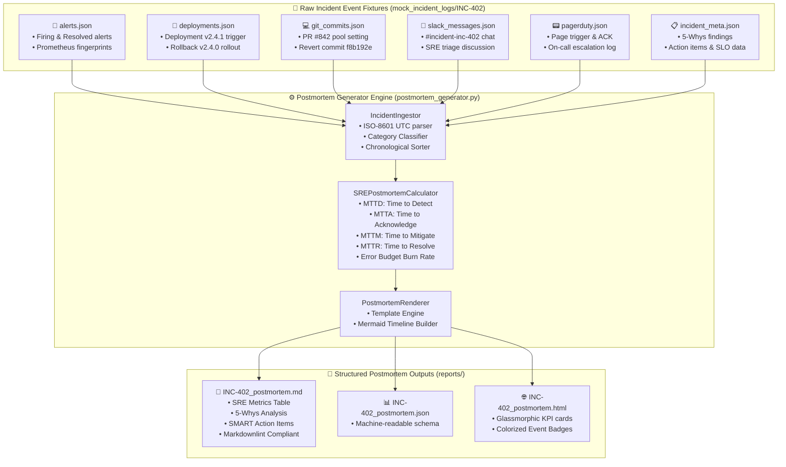

<!-- markdownlint-disable MD013 MD033 MD051 MD060 -->
# 08 - Incident Timeline and Postmortem Generator

> A production-grade **SRE Incident Timeline & Blameless Postmortem Generator** CLI tool. Aggregates heterogeneous event streams from **Prometheus / Alertmanager alerts**, **Git commits & Pull Requests**, **CI/CD deployment logs**, **Slack / ChatOps incident discussions**, and **PagerDuty escalation events** into structured, Google SRE-compliant postmortem documents with automated **MTTD, MTTA, MTTM, MTTR** metrics, 5-Whys Root Cause Analysis (RCA), and preventative SMART action items.

---

## 📋 Table of Contents

1. [Architectural Overview & Aggregation Topology](#-architectural-overview--aggregation-topology)
   - [Event Ingestion & Processing Flow Diagram](#event-ingestion--processing-flow-diagram)
   - [Visual Incident Progression Timeline Diagram](#visual-incident-progression-timeline-diagram)
2. [Theoretical Deep-Dive for Beginners](#-theoretical-deep-dive-for-beginners)
   - [The SRE Philosophy of Blameless Postmortems](#the-sre-philosophy-of-blameless-postmortems)
   - [Core SRE Incident Operational Metrics (MTTD, MTTA, MTTM, MTTR)](#core-sre-incident-operational-metrics-mttd-mtta-mttm-mttr)
   - [SLO Error Budget Consumption & Business Impact](#slo-error-budget-consumption--business-impact)
   - [The 5-Whys Root Cause Analysis (RCA) Methodology](#the-5-whys-root-cause-analysis-rca-methodology)
   - [Designing SMART Preventative Action Items](#designing-smart-preventative-action-items)
   - [Event Normalization & Timestamp Alignment Mechanics](#event-normalization--timestamp-alignment-mechanics)
3. [Repository & Directory Structure](#-repository--directory-structure)
4. [Prerequisites & Environment Setup](#-prerequisites--environment-setup)
5. [Quickstart Guide](#-quickstart-guide)
6. [Step-by-Step Hands-On Guide](#-step-by-step-hands-on-guide)
   - [Step 1: Discover Available Incident Fixtures](#step-1-discover-available-incident-fixtures)
   - [Step 2: Generate Postmortem for INC-402 (Database Connection Exhaustion)](#step-2-generate-postmortem-for-inc-402-database-connection-exhaustion)
   - [Step 3: Inspect Generated Markdown Report Structure](#step-3-inspect-generated-markdown-report-structure)
   - [Step 4: Generate JSON and Interactive HTML Formats](#step-4-generate-json-and-interactive-html-formats)
   - [Step 5: Generate Postmortems for Additional Outage Scenarios](#step-5-generate-postmortems-for-additional-outage-scenarios)
   - [Step 6: Execute in Validation Mode](#step-6-execute-in-validation-mode)
   - [Step 7: Containerized Execution with Docker Compose](#step-7-containerized-execution-with-docker-compose)
   - [Step 8: Execute the Complete Automated Test Suite](#step-8-execute-the-complete-automated-test-suite)
7. [Production SRE Incident Command Cheat Sheet & Anti-Patterns](#-production-sre-incident-command-cheat-sheet--anti-patterns)
8. [Troubleshooting & Common Gotchas](#-troubleshooting--common-gotchas)
9. [Resource Teardown & Complete Cleanup](#-resource-teardown--complete-cleanup)

---

## 🏛️ Architectural Overview & Aggregation Topology

During a major production incident, valuable forensic data is scattered across multiple disparate platforms: monitoring alerts in Prometheus/Alertmanager, ChatOps discussions in Slack, code changes in Git commits, release triggers in CI/CD pipelines, and escalation logs in PagerDuty.

The **Incident Timeline and Postmortem Generator** ingests these heterogeneous streams, normalizes timestamps into UTC, sorts events chronologically, calculates SRE recovery metrics, and renders production-ready postmortem reports.

```text
 ┌──────────────────────┐    ┌──────────────────────┐    ┌──────────────────────┐
 │  🚨 Prometheus Alerts│    │  🚀 CI/CD Deployments│    │  💻 Git Commits & PRs│
 │  (Alertmanager JSON) │    │  (GitHub Actions)    │    │  (Commit & Diff Log) │
 └──────────┬───────────┘    └──────────┬───────────┘    └──────────┬───────────┘
            │                           │                           │
            │                           ▼                           │
            │                ┌─────────────────────┐                │
            └───────────────►│  Incident Ingestor  │◄───────────────┘
                             │  (postmortem_gen.py)│
            ┌───────────────►│                     │◄───────────────┐
            │                └──────────┬──────────┘                │
            │                           │                           │
 ┌──────────┴───────────┐               ▼                ┌──────────┴───────────┐
 │  💬 Slack / ChatOps  │    ┌─────────────────────┐     │  📟 PagerDuty Pages  │
 │  (#incident-channel) │    │ SRE Metrics Engine  │     │  (On-Call Escalation)│
 └──────────────────────┘    │ (MTTD, MTTA, MTTR)  │     └──────────────────────┘
                             └──────────┬──────────┘
                                        │
                                        ▼
                             ┌─────────────────────┐
                             │  Postmortem Exporter│
                             └──────────┬──────────┘
                                        │
            ┌───────────────────────────┼───────────────────────────┐
            ▼                           ▼                           ▼
 ┌──────────────────────┐    ┌──────────────────────┐    ┌──────────────────────┐
 │  📄 Markdown Report  │    │  📊 JSON Schema API  │    │  🌐 Interactive HTML │
 │  (INC-402_postmortem)│    │  (Data Export)       │    │  (Visual Dashboard)  │
 └──────────────────────┘    └──────────────────────┘    └──────────────────────┘
```

---

### Event Ingestion & Processing Flow Diagram



---

### Visual Incident Progression Timeline Diagram

```mermaid
timeline
    title Incident Lifecycle Timeline (INC-402: DB Pool Exhaustion)
    14:20 : [TRIGGER] Production deployment of checkout-api v2.4.1 completes
    14:26 : [DETECTION] Prometheus alert 'CheckoutServiceHigh5xxErrorRate' fires (28.4% errors)
    14:29 : [ACKNOWLEDGE] On-Call SRE acknowledges PagerDuty page
    14:30 : [DECLARE] SRE declares P1 - Critical Outage in #incident-inc-402
    14:34 : [DIAGNOSIS] DBA confirms DB CPU is 18%; bottleneck is client connection pool
    14:40 : [ROOT CAUSE] Engineer identifies PR #842 reduced max_connections from 50 to 10
    14:44 : [MITIGATION] Emergency canary rollback to v2.4.0 triggered
    14:48 : [DEPLOYED] Rollback v2.4.0 fully deployed to all 10 pods
    14:53 : [RECOVERY] Connection pool alert resolves (active connections: 24/50)
    14:55 : [RESOLVED] 5xx Error rate drops to 0.02% & Incident Commander declares RESOLVED
```

---

## 🧠 Theoretical Deep-Dive for Beginners

### The SRE Philosophy of Blameless Postmortems

> *"You cannot change the human condition, but you can change the conditions under which humans work."* — Dr. James Reason

In Google Site Reliability Engineering, a **Blameless Postmortem** is founded on the core assumption that engineers are skilled, well-intentioned professionals making the best decisions possible with the information they have at the time:

```text
┌─────────────────────────────────────────────────────────────────────────┐
│               BLAMELESS vs BLAMEFUL INCIDENT CULTURE                    │
├─────────────────────────────────────────────────────────────────────────┤
│                                                                         │
│  ❌ Blameful Culture (Punitive):                                        │
│     • "Who pushed the broken configuration?"                            │
│     • Leads to fear, covering up mistakes, and delayed reporting.       │
│     • Systemic vulnerabilities remain unaddressed.                      │
│                                                                         │
│  ✅ Blameless SRE Culture (Systemic):                                   │
│     • "Why did the CI/CD pipeline allow untested pool configs to pass?" │
│     • "Why was there no automated canary analysis to catch the 500s?"   │
│     • "How can we design the deployment guardrail so that this failure  │
│        is impossible to reproduce?"                                     │
│                                                                         │
└─────────────────────────────────────────────────────────────────────────┘
```

---

### Core SRE Incident Operational Metrics (MTTD, MTTA, MTTM, MTTR)

Measuring the speed of incident response provides quantitative feedback to improve monitoring alerts, escalation pathways, and deployment safeguards:

```text
 ───[ Incident Start ]───────────────────────────────────────────────────► (14:20)
           │
           │  ◄── MTTD: Mean Time to Detect (6m) ──►
           ▼
     [ 1st Alert Fires ]─────────────────────────────────────────────────► (14:26)
           │
           │  ◄── MTTA: Mean Time to Acknowledge (3m) ──►
           ▼
     [ Responder ACK ]───────────────────────────────────────────────────► (14:29)
           │
           │  ◄── MTTM: Mean Time to Mitigate (19m) ──►
           ▼
     [ Mitigation Deployed (Rollback) ]──────────────────────────────────► (14:48)
           │
           │  ◄── Recovery Window (7m) ──►
           ▼
     [ Incident Resolved ]───────────────────────────────────────────────► (14:55)
           ▲
           └────── MTTR: Mean Time to Resolve / Recover (35m) ───────────┘
```

#### Formulas

$$\text{MTTD} = T_{\text{first\_alert\_fired}} - T_{\text{incident\_start}}$$

$$\text{MTTA} = T_{\text{responder\_acknowledged}} - T_{\text{first\_alert\_fired}}$$

$$\text{MTTM} = T_{\text{mitigation\_deployed}} - T_{\text{responder\_acknowledged}}$$

$$\text{MTTR} = T_{\text{incident\_resolved}} - T_{\text{incident\_start}}$$

$$\text{Total Outage Duration} = T_{\text{incident\_resolved}} - T_{\text{first\_alert\_fired}}$$

---

### SLO Error Budget Consumption & Business Impact

For an application with a **99.9% Availability SLO** over a 30-day window (allowing a total monthly error budget of `0.1%` $\approx 43.2$ minutes of downtime):

$$\text{Error Budget Consumed (\%)} = \frac{\text{Failed Requests During Outage}}{\text{Total Allowed Monthly Failed Requests}} \times 100\%$$

In `INC-402`, `14,200` checkout requests failed during the 35-minute outage, burning **`42.8%`** of the team's entire monthly error budget in under an hour.

---

### The 5-Whys Root Cause Analysis (RCA) Methodology

The 5-Whys technique drills down past immediate symptoms to identify the root systemic defect:

```text
Symptom: Checkout requests failing with HTTP 500
  ├── Why #1? Connection pool was 100% saturated (10/10 active connections).
  │     ├── Why #2? Release v2.4.1 lowered max_connections from 50 to 10.
  │     │     ├── Why #3? A memory optimization PR mistakenly copied test settings to production.
  │     │     │     ├── Why #4? Staging synthetic tests ran with low concurrency (2 RPS) and did not fail.
  │     │     │     │     └── Why #5? CI/CD pipeline lacked automated blocking load testing (k6) gates!
```

---

### Designing SMART Preventative Action Items

Every postmortem must generate concrete action items categorized according to SRE action types:

| Category | SRE Objective | Example from INC-402 |
|---|---|---|
| **`PREVENT`** | Prevent the exact failure mode from ever reoccurring. | Add automated pre-deployment k6 load testing step in CI/CD pipeline. |
| **`MITIGATE`** | Reduce the impact or duration if the failure happens again. | Implement progressive Canary Deployments (10% $\to$ 100%) with auto-rollback. |
| **`DETECT`** | Detect the failure mode faster next time (lower MTTD). | Add Multi-Window Multi-Burn-Rate alert on DB pool saturation (>80%). |
| **`PROCESS`** | Improve operational documentation, runbooks, and triage. | Update Runbook for emergency database connection pool resizing. |

---

### Event Normalization & Timestamp Alignment Mechanics

Real-world tools emit timestamps in varying formats (ISO-8601 with milliseconds, epoch timestamps, UTC offsets). The generator standardizes all inputs into an immutable `TimelineEvent` object:

```python
@dataclass
class TimelineEvent:
    timestamp_utc: str       # "2026-08-26 14:26:00 UTC"
    epoch_timestamp: float    # 1787754360.0
    source: str              # ALERT, DEPLOYMENT, GIT_COMMIT, SLACK, PAGERDUTY
    category: str            # TRIGGER, DETECTION, DIAGNOSIS, MITIGATION, RESOLUTION
    actor: str               # "@alex.sre (Alex Rivera - Staff SRE)"
    summary: str             # "Alert FIRING: CheckoutServiceHigh5xxErrorRate..."
    details: Dict[str, Any]  # Original raw payload
    severity: Optional[str]  # CRITICAL, WARNING, INFO
```

---

## 📁 Repository & Directory Structure

```text
10-sre-and-reliability/08-incident-timeline-postmortem-generator/
├── .gitignore                          # Excludes pycache, generated reports, logs
├── .markdownlint.json                  # Markdownlint rule configurations
├── Dockerfile                          # Production container image definition
├── README.md                           # Comprehensive educational documentation
├── cleanup.sh                          # Resource teardown script (--all / standard)
├── docker-compose.yml                  # Docker Compose definition
├── mock_incident_logs/                 # Realistic incident datasets
│   ├── INC-305/                        # DNS Resolution Failure Outage (P2)
│   │   ├── alerts.json
│   │   ├── deployments.json
│   │   ├── git_commits.json
│   │   ├── incident_meta.json
│   │   ├── pagerduty.json
│   │   └── slack_messages.json
│   ├── INC-402/                        # Database Pool Exhaustion Outage (P1 - Primary)
│   │   ├── alerts.json
│   │   ├── deployments.json
│   │   ├── git_commits.json
│   │   ├── incident_meta.json
│   │   ├── metrics_timeseries.json
│   │   ├── pagerduty.json
│   │   └── slack_messages.json
│   └── INC-501/                        # Kubernetes OOMKilled Cascading Outage (P2)
│       ├── alerts.json
│       ├── deployments.json
│       ├── git_commits.json
│       ├── incident_meta.json
│       ├── pagerduty.json
│       └── slack_messages.json
├── postmortem_generator.py             # CLI Postmortem Generator & SRE Metrics Engine
├── reports/                            # Generated postmortem output files (.md, .json, .html)
├── requirements.txt                    # Minimal dependencies
├── test_generator.py                   # Unittest suite for timeline & metrics math
└── test_stack.sh                       # End-to-end automated test runner script
```

---

## 🔧 Prerequisites & Environment Setup

Verify the following tools are available:

1. **Python 3.10+**: For running the CLI generator and unit tests.
2. **Docker & Docker Compose**: For containerized execution.
3. **pnpm** *(Optional)*: For running `markdownlint-cli` validation.

Check tool availability:

```bash
python3 --version
docker --version
pnpm --version
```

---

## ⚡ Quickstart Guide

Generate your first blameless postmortem report in 3 simple commands:

```bash
# 1. Navigate to project directory
cd 10-sre-and-reliability/08-incident-timeline-postmortem-generator

# 2. Grant executable permissions
chmod +x postmortem_generator.py test_generator.py test_stack.sh cleanup.sh

# 3. Generate complete postmortem reports for incident INC-402
./postmortem_generator.py --incident-id INC-402 --format all
```

---

## 📖 Step-by-Step Hands-On Guide

### Step 1: Discover Available Incident Fixtures

List all mock incident datasets available in `mock_incident_logs/`:

```bash
./postmortem_generator.py --list-incidents
```

*Expected output:*

```text
Available Incidents in /.../mock_incident_logs:
  • INC-305
  • INC-402
  • INC-501
```

---

### Step 2: Generate Postmortem for INC-402 (Database Connection Exhaustion)

Run the generator for the primary P1 outage scenario:

```bash
./postmortem_generator.py --incident-id INC-402 --format all --output-dir reports
```

*Expected console summary:*

```text
2026-08-26 19:55:18 [INFO] Ingesting incident data for [INC-402]...
2026-08-26 19:55:18 [INFO] Calculated SRE Metrics: MTTD=6m 0s, MTTA=3m 0s, MTTM=19m 0s, MTTR=35m 0s, Availability=70.57%
2026-08-26 19:55:18 [INFO] Generated Markdown Postmortem: reports/INC-402_postmortem.md
2026-08-26 19:55:18 [INFO] Generated JSON Postmortem: reports/INC-402_postmortem.json
2026-08-26 19:55:18 [INFO] Generated HTML Postmortem: reports/INC-402_postmortem.html

======================================================================
  🎉 Postmortem Generation Complete for [INC-402]
======================================================================
  • MARKDOWN: reports/INC-402_postmortem.md
  • JSON    : reports/INC-402_postmortem.json
  • HTML    : reports/INC-402_postmortem.html

  ⏱️  MTTD: 6m 0s | MTTA: 3m 0s | MTTM: 19m 0s | MTTR: 35m 0s
  📊 Availability: 70.57% | Error Budget Burn: 42.8%
```

---

### Step 3: Inspect Generated Markdown Report Structure

Inspect the generated Markdown postmortem document:

```bash
cat reports/INC-402_postmortem.md
```

Observe that it includes:

1. **Executive Summary & Impact Assessment**: Detailed customer request failure counts and revenue loss.
2. **Key SRE Operational Metrics Table**: Formal calculation of MTTD, MTTA, MTTM, MTTR.
3. **Incident Response Team**: Roles and assignees.
4. **Visual Mermaid Timeline Diagram**: Visual chronological progression.
5. **Unified Chronological Timeline Table**: Merged alerts, commits, deployments, and ChatOps chat.
6. **5-Whys Root Cause Analysis**: Structured findings.
7. **Lessons Learned**: What went well, what went poorly, and where we got lucky.
8. **Preventative Action Items**: SMART action items with owners, priorities, and Jira tracking links.

---

### Step 4: Generate JSON and Interactive HTML Formats

Inspect the generated JSON schema (ideal for SIEM, Datadog, or Jira automation integrations):

```bash
cat reports/INC-402_postmortem.json | python3 -m json.tool | head -n 35
```

Open the interactive HTML dashboard report in your browser:

```bash
open reports/INC-402_postmortem.html
# Or for Linux:
# xdg-open reports/INC-402_postmortem.html
```

---

### Step 5: Generate Postmortems for Additional Outage Scenarios

Generate postmortems for Kubernetes OOMKilled (`INC-501`) and CoreDNS Conntrack (`INC-305`) incidents:

```bash
./postmortem_generator.py --incident-id INC-501 --format all
./postmortem_generator.py --incident-id INC-305 --format all
```

Verify that all generated reports exist:

```bash
ls -la reports/
```

---

### Step 6: Execute in Validation Mode

Validate incident fixture integrity without writing files to disk:

```bash
./postmortem_generator.py --incident-id INC-402 --validate
```

---

### Step 7: Containerized Execution with Docker Compose

Run the generator inside an isolated Docker container:

```bash
# Build image and run postmortem generator
docker compose run --rm postmortem-generator --incident-id INC-402 --format all
```

---

### Step 8: Execute the Complete Automated Test Suite

Run the full end-to-end test suite:

```bash
./test_stack.sh
```

*Expected output: All 6 test stages and 9 assertions pass!*

---

## 🎯 Production SRE Incident Command Cheat Sheet & Anti-Patterns

### ✅ SRE Best Practices

1. **Assign Clear Incident Roles Early**: Designate an Incident Commander (IC), Technical Lead (TL), and Communications Lead (CL) to prevent communication overload.
2. **Mitigate First, Root Cause Later**: Prioritize immediate customer traffic recovery (e.g. rollback, traffic shedding, scaling) before spending time investigating low-level code defects.
3. **Use Explicit SMART Action Items**: Every action item must have a single human owner, priority (`P0`/`P1`/`P2`), target date, and Jira issue ticket.
4. **Publish Postmortems Internally**: Share postmortems transparently across engineering teams to distribute organizational knowledge.

### ❌ Anti-Patterns to Avoid

- **The "Human Error" Fallacy**: Concluding that "operator misconfiguration" was the root cause. The real question is: *Why did the system allow an invalid configuration to reach production?*
- **Skipping Postmortems for "Minor" Incidents**: Near-misses and P2 incidents often share the same systemic root causes as P0 disasters.
- **Unassigned or Vague Action Items**: Action items like *"Improve database monitoring"* without an owner or deadline will never be completed.

---

## 🔍 Troubleshooting & Common Gotchas

### 1. Missing Incident Directory

If you see `FileNotFoundError: Incident data directory not found`:

```bash
# Verify the incident ID exists in mock_incident_logs/
./postmortem_generator.py --list-incidents
```

### 2. Markdownlint Formatting Warnings

All generated Markdown files are configured with standard frontmatter overrides:

```markdown
<!-- markdownlint-disable MD013 MD033 MD051 MD060 -->
```

Validate manually using `pnpm dlx markdownlint-cli`:

```bash
pnpm dlx markdownlint-cli reports/*.md
```

---

## 🧹 Resource Teardown & Complete Cleanup

To remove all generated reports, Docker containers, images, and temporary files:

### Standard Cleanup (Removes Reports & Caches)

```bash
./cleanup.sh
```

### Complete Cleanup (Purges Docker Containers & Images)

```bash
./cleanup.sh --all
```

### Manual Teardown Equivalent Commands

```bash
# 1. Remove Docker images and containers
docker compose down --remove-orphans
docker rmi sre-incident-postmortem-generator:latest 2>/dev/null || true

# 2. Remove local generated reports and python caches
rm -rf reports/
find . -type d -name "__pycache__" -exec rm -rf {} +
```

### Verification of Clean State

```bash
docker ps -a --filter "name=incident-postmortem"
docker images "sre-incident-postmortem-generator"
```

*Output will confirm zero leftover resources!*
