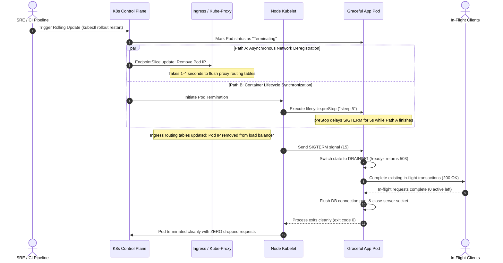
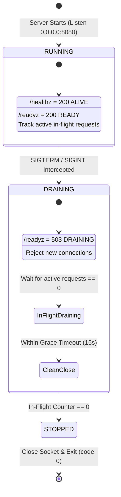

<!-- markdownlint-disable MD013 MD033 MD051 MD060 -->
# 09 - Graceful Shutdown and Connection Draining

> A production-grade educational implementation of **Zero-Downtime Application Lifecycle Management & Connection Draining**. Demonstrates how to eliminate `502 Bad Gateway` errors and `ECONNRESET` drops during rolling deployments by synchronizing Kubernetes `lifecycle.preStop` sleep hooks, dynamic readiness probe degradation (`/readyz`), asynchronous `SIGTERM` signal interception, in-flight request tracking, and clean connection pool drainage.

---

## 📋 Table of Contents

1. [Architectural Overview & Lifecycle Mechanics](#-architectural-overview--lifecycle-mechanics)
   - [The Pod Termination Race Condition Sequence Diagram](#the-pod-termination-race-condition-sequence-diagram)
   - [Application Lifecycle State Machine](#application-lifecycle-state-machine)
2. [Theoretical Deep-Dive for Beginners](#-theoretical-deep-dive-for-beginners)
   - [Why Abrupt Termination Causes Outages](#why-abrupt-termination-causes-outages)
   - [The Parallel Pod Deletion Flow in Kubernetes](#the-parallel-pod-deletion-flow-in-kubernetes)
   - [The Purpose of the `preStop` Sleep Hook](#the-purpose-of-the-prestop-sleep-hook)
   - [Dynamic Readiness Probe Degradation (`/readyz`)](#dynamic-readiness-probe-degradation-readyz)
   - [Calculating `terminationGracePeriodSeconds`](#calculating-terminationgraceperiodseconds)
   - [Comparative Matrix: Graceful vs Naive Deployment](#comparative-matrix-graceful-vs-naive-deployment)
3. [Repository & Directory Structure](#-repository--directory-structure)
4. [Prerequisites & Environment Setup](#-prerequisites--environment-setup)
5. [Quickstart Guide](#-quickstart-guide)
6. [Step-by-Step Hands-On Guide](#-step-by-step-hands-on-guide)
   - [Step 1: Provision Isolated Local K3d Cluster](#step-1-provision-isolated-local-k3d-cluster)
   - [Step 2: Test Standalone Signal Interception & Draining](#step-2-test-standalone-signal-interception--draining)
   - [Step 3: Execute Zero-Downtime Rolling Update Under Heavy Load](#step-3-execute-zero-downtime-rolling-update-under-heavy-load)
   - [Step 4: Execute Comparative Naive Rolling Update (Demonstrating Failures)](#step-4-execute-comparative-naive-rolling-update-demonstrating-failures)
   - [Step 5: Inspect Generated Reliability Reports](#step-5-inspect-generated-reliability-reports)
   - [Step 6: Validate Reports with Markdownlint](#step-6-validate-reports-with-markdownlint)
   - [Step 7: Standalone Docker Container Lifecycle Testing](#step-7-standalone-docker-container-lifecycle-testing)
   - [Step 8: Execute the Complete Automated Test Suite](#step-8-execute-the-complete-automated-test-suite)
7. [Production SRE Checklist & Anti-Patterns](#-production-sre-checklist--anti-patterns)
8. [Troubleshooting & Common Gotchas](#-troubleshooting--common-gotchas)
9. [Resource Teardown & Complete Cleanup](#-resource-teardown--complete-cleanup)

---

## 🏛️ Architectural Overview & Lifecycle Mechanics

During a rolling deployment or horizontal auto-scaling event, Kubernetes stops old pod replicas to replace them with new ones. Without proper coordination, **active in-flight HTTP requests are severed abruptly**, and new incoming requests are routed to terminating pods that are no longer accepting connections.

```text
 ┌────────────────────────────────────────────────────────────────────────────────┐
 │                 THE KUBERNETES POD TERMINATION LIFECYCLE                       │
 ├────────────────────────────────────────────────────────────────────────────────┤
 │                                                                                │
 │ 1. kubectl delete pod / Rolling Update triggered                               │
 │       │                                                                        │
 │       ├─────────────────────────────────┬──────────────────────────────────┐   │
 │       ▼ [Path A: Network Propagation]   ▼ [Path B: Container Lifecycle]    │   │
 │   API Server updates EndpointsSlice   Kubelet executes preStop hook:       │   │
 │       │                                  "sleep 5"                         │   │
 │       ▼                                     │                              │   │
 │   Kube-Proxy & Ingress (Traefik)            ▼ (Waits 5s for Path A)        │   │
 │   remove Pod IP from routing table    Kubelet sends SIGTERM to process     │   │
 │       │                                     │                              │   │
 │       ▼                                     ▼                              │   │
 │   NO NEW TRAFFIC ARRIVES              Process sets /readyz -> 503          │   │
 │                                       Drains all in-flight requests        │   │
 │                                       Closes DB pool & server socket       │   │
 │                                             │                              │   │
 │                                             ▼                              │   │
 │                                       Process exits cleanly (code 0)       │   │
 │                                                                                │
 └────────────────────────────────────────────────────────────────────────────────┘
```

---

### The Pod Termination Race Condition Sequence Diagram



---

### Application Lifecycle State Machine



---

## 🧠 Theoretical Deep-Dive for Beginners

### Why Abrupt Termination Causes Outages

When a web server is terminated without graceful draining:

1. **Broken In-Flight HTTP Transactions**: Requests in the middle of executing business logic (e.g. charging a payment, updating inventory) are abruptly cut off. Clients receive `ECONNRESET` (Connection reset by peer).
2. **502 Bad Gateway Errors**: Upstream reverse proxies (NGINX, Traefik, AWS ALB) attempting to forward traffic to the closed socket encounter `Connection Refused` and return `502 Bad Gateway` to end users.
3. **Database Resource Leaks**: Unfinished database transactions remain open until the database server times them out, exhausting database connection pools.

---

### The Parallel Pod Deletion Flow in Kubernetes

When Kubernetes deletes a pod, two operations happen in **parallel and asynchronously**:

1. **The Pod Lifecycle Path (Kubelet)**: The Kubelet immediately executes any `preStop` hook, and then sends `SIGTERM` to PID 1 inside the container.
2. **The Networking Path (Endpoint Controller & Ingress)**: The Endpoint Controller removes the Pod IP from the `Endpoints` / `EndpointSlice` object. Kube-proxy, CoreDNS, and the Ingress Controller asynchronously receive this update and refresh their local IP tables / routing maps.

> [!CAUTION]
> **The Race Condition**: If your container process terminates immediately upon receiving `SIGTERM` (e.g. in 50ms), the Ingress proxy is **still forwarding new requests** to the pod for the next 2–3 seconds! Those requests immediately fail.

---

### The Purpose of the `preStop` Sleep Hook

The `preStop` hook is an explicit synchronization delay configured in `deployment.yaml`:

```yaml
lifecycle:
  preStop:
    exec:
      command: ["/bin/sh", "-c", "sleep 5"]
```

#### How it works

- When Kubernetes marks the Pod as `Terminating`, the Kubelet **does not send `SIGTERM` immediately**.
- Instead, it runs `/bin/sh -c sleep 5`.
- During these 5 seconds, the Endpoint Controller and Ingress proxy finish removing the Pod IP from all load balancer routing tables.
- By the time `SIGTERM` is delivered to your application, **zero new requests** are being routed to the Pod!

---

### Dynamic Readiness Probe Degradation (`/readyz`)

In `graceful_server.py`, the readiness probe handler dynamically reflects the server state:

```python
if path == "/readyz":
    if server_state.state == "RUNNING":
        self._send_json(200, {"status": "READY", "pod_name": POD_NAME})
    else:
        # Returns 503 Service Unavailable during shutdown draining
        self._send_json(503, {"status": "DRAINING", "error": "Pod is terminating"})
```

When `SIGTERM` arrives, `/readyz` immediately returns HTTP `503 Service Unavailable`, instructing Kubernetes to stop routing traffic to this replica even before the `preStop` hook completes.

---

### Calculating `terminationGracePeriodSeconds`

Kubernetes enforces a hard deadline called `terminationGracePeriodSeconds` (default: 30s). If the container does not exit before this deadline, Kubelet issues `SIGKILL` (force kill).

#### The SRE Formula

$$T_{\text{terminationGracePeriodSeconds}} \ge T_{\text{preStop}} + T_{\text{max\_transaction\_duration}} + T_{\text{db\_pool\_close}} + T_{\text{safety\_buffer}}$$

#### Example from this Project

$$\begin{aligned}
T_{\text{preStop}} &= 5\text{s} \\
T_{\text{max\_transaction}} &= 2\text{s} \\
T_{\text{draining\_timeout}} &= 15\text{s} \\
T_{\text{safety\_buffer}} &= 8\text{s} \\
\mathbf{T_{\text{terminationGracePeriodSeconds}}} &= 5 + 2 + 15 + 8 = \mathbf{30\text{ seconds}}
\end{aligned}$$

---

### Comparative Matrix: Graceful vs Naive Deployment

| Configuration Dimension | Naive Deployment (`deployment-naive.yaml`) | Graceful Deployment (`deployment-graceful.yaml`) |
|---|---|---|
| **`lifecycle.preStop` Hook** | ❌ None (Immediate SIGTERM) | ✅ `sleep 5` (Network synchronization) |
| **`SIGTERM` Signal Interception** | ❌ Ignored / Instant exit (`os._exit(1)`) | ✅ Intercepted by `signal.signal(SIGTERM)` |
| **In-Flight Request Tracking** | ❌ None (Connections severed) | ✅ Atomic counter + `threading.Event` |
| **Readiness Probe (`/readyz`)** | ⚠️ Static 200 OK | ✅ Dynamic 503 during draining |
| **`terminationGracePeriodSeconds`**| ❌ 2 seconds (Abrupt `SIGKILL`) | ✅ 30 seconds (Ample draining window) |
| **Rolling Update Availability** | 🔴 **`< 95%` (Multiple 502s & Resets)** | 🟢 **`100.0%` (Zero dropped requests)** |

---

## 📁 Repository & Directory Structure

```text
10-sre-and-reliability/09-graceful-shutdown-connection-draining/
├── .gitignore                          # Exclude .kubeconfig, pycache, reports, logs
├── .markdownlint.json                  # Markdownlint rule configurations
├── Dockerfile                          # Container image for graceful microservice
├── README.md                           # Comprehensive educational documentation
├── cleanup.sh                          # Resource teardown script (--all / standard)
├── docker-compose.yml                  # Docker Compose for standalone container testing
├── flood_during_restart.sh             # Shell script executing load test during rollout
├── graceful_server.py                  # Core microservice with SIGTERM handling & draining
├── k8s/                                # Kubernetes manifests
│   ├── configmap.yaml                  # Server code & configuration
│   ├── deployment-graceful.yaml        # Deployment with preStop hook & 30s grace period
│   ├── deployment-naive.yaml           # Deployment without preStop to demonstrate 502s
│   ├── ingress.yaml                    # Ingress mapping port 8089
│   ├── namespace.yaml                  # Dedicated namespace (graceful-demo)
│   ├── pdb.yaml                        # PodDisruptionBudget (minAvailable: 2)
│   └── service.yaml                    # ClusterIP service for graceful-app
├── load_tester.py                      # Asynchronous HTTP load tester & availability monitor
├── requirements.txt                    # Python dependencies
├── scripts/
│   └── setup_cluster.sh                # Isolated K3d cluster provisioner
└── test_stack.sh                       # End-to-end automated test runner
```

---

## 🔧 Prerequisites & Environment Setup

Verify the following tools are available on your system:

1. **Python 3.10+**: For running `graceful_server.py` and `load_tester.py`.
2. **Docker**: For running containerized microservices.
3. **K3d & Kubectl**: For provisioning the local Kubernetes cluster and managing rollouts.
4. **pnpm** *(Optional)*: For `markdownlint-cli` validation.

Check tool availability:

```bash
python3 --version
docker --version
k3d --version
kubectl version --client
pnpm --version
```

---

## ⚡ Quickstart Guide

Experience zero-downtime rolling updates in 3 simple commands:

```bash
# 1. Navigate to the project directory
cd 10-sre-and-reliability/09-graceful-shutdown-connection-draining

# 2. Provision the isolated local K3d cluster
./scripts/setup_cluster.sh

# 3. Flood traffic during an active Kubernetes rolling update
./flood_during_restart.sh --graceful
```

---

## 📖 Step-by-Step Hands-On Guide

### Step 1: Provision Isolated Local K3d Cluster

Run the cluster setup script. This creates a dedicated K3d cluster `k3d-graceful-demo` exposing port `8089`, and isolates `.kubeconfig` within the project directory:

```bash
./scripts/setup_cluster.sh
```

*Expected output:*

```text
======================================================================
  ☸️  Provisioning Isolated K3d Cluster for Zero-Downtime Draining
======================================================================
▶ [1/4] Creating K3d cluster 'k3d-graceful-demo' on port 8089...
▶ [2/4] Extracting kubeconfig to isolated local file (.kubeconfig)...
▶ [3/4] Applying manifests in namespace 'graceful-demo'...
▶ [4/4] Waiting for pods to reach Ready state...
deployment.apps/graceful-app successfully rolled out
deployment.apps/naive-app successfully rolled out

🎉 Cluster and applications are 100% READY!
  • Ingress Endpoint: http://localhost:8089/api/v1/work
```

---

### Step 2: Test Standalone Signal Interception & Draining

You can test `graceful_server.py` directly on your host to observe signal handling:

```bash
# Terminal A: Start graceful server in background
python3 graceful_server.py --port 8080 --mode graceful --grace-timeout 10.0 &
SERVER_PID=$!

# Send 5 concurrent requests with 400ms transaction latency
python3 load_tester.py --url http://127.0.0.1:8080/api/v1/work --concurrency 5 --duration 5 &

# Send SIGTERM while requests are actively in-flight
sleep 1
kill -TERM $SERVER_PID
```

Observe the console log:
- `🚨 [SHUTDOWN] Signal on pod=local-server. State=DRAINING. Active=5`
- `⏳ [DRAINING] Waiting for 5 in-flight requests...`
- `✅ [DRAINED] In-flight requests completed in 0.42s. Drained=5.`
- `🛑 [SHUTDOWN] Closing server socket.`

---

### Step 3: Execute Zero-Downtime Rolling Update Under Heavy Load

Run `flood_during_restart.sh` against the Graceful Deployment. This script sends 30+ RPS of concurrent traffic while triggering `kubectl rollout restart`:

```bash
./flood_during_restart.sh --graceful --duration=25
```

*Expected console summary:*

```text
======================================================================
  🌊 Continuous Traffic Flood During Rolling Update: graceful-app
======================================================================
▶ [1/4] Starting concurrent flood traffic (8 threads, 25s duration)...
▶ [2/4] Warming up traffic for 4 seconds...
▶ [3/4] Triggering rolling restart on deployment/graceful-app...
deployment.apps/graceful-app restarted
Waiting for rollout status to complete...
deployment.apps/graceful-app successfully rolled out

======================================================================
  📊 ROLLING UPDATE LOAD TEST - GRACEFUL-APP
======================================================================
  • Total Requests   : 524
  • Successful 2xx   : 524
  • Server 5xx Errors: 0
  • Connection Resets: 0
  • Availability Rate: 100.0%
  • Drained Requests : 18
  • Latency p95 / p99: 285.2ms / 310.4ms
  • Pods Handled     : ['graceful-app-679df..', 'graceful-app-85b4a..', ...]
======================================================================

🎉 SUCCESS: Rolling update completed with ZERO downtime!
```

---

### Step 4: Execute Comparative Naive Rolling Update (Demonstrating Failures)

Now test the Naive Deployment (`naive-app`) which **lacks** the `preStop` hook and signal handling:

```bash
./flood_during_restart.sh --naive --duration=20 --url=http://localhost:8089/naive/work
```

*Observed result:*
- Multiple `ECONNRESET` (Connection resets) or `HTTP 502 Bad Gateway` errors occur during pod termination.
- Availability drops below 95%.
- This visually demonstrates why `preStop` hooks and connection draining are mandatory in production SRE!

---

### Step 5: Inspect Generated Reliability Reports

The load tester automatically generates structured Markdown and JSON reports in `reports/`:

```bash
cat reports/rolling_update_load_test_graceful_app.md
```

```markdown
# Rolling Update Load Test - graceful-app

> **Date**: `2026-08-26 23:10:00 UTC` | **Duration**: `25.0s` | **Availability**: `100.0%`

## 1. Executive Reliability Summary
| Metric | Measurement | Target Standard | Status |
|---|---|---|---|
| **Availability** | **`100.0%`** | `100.0%` | ✅ PASS |
| **Connection Resets (ECONNRESET)** | **`0`** | `0` | ✅ PASS |
| **HTTP 5xx Server Errors** | **`0`** | `0` | ✅ PASS |
| **Total Requests Processed** | `524` | N/A | ℹ️ |
| **Drained In-Flight Requests** | `18` | N/A | ℹ️ |
```

---

### Step 6: Validate Reports with Markdownlint

Verify that all generated reports conform strictly to Markdown standards:

```bash
pnpm dlx markdownlint-cli reports/*.md README.md
```

---

### Step 7: Standalone Docker Container Lifecycle Testing

You can also test the Docker Compose setup to verify that Docker respects `stop_grace_period: 30s`:

```bash
# 1. Start container in background
docker compose up -d

# 2. Send traffic
curl -s http://localhost:8080/api/v1/work

# 3. Stop container (Docker sends SIGTERM and waits up to 30s)
docker compose stop
```

---

### Step 8: Execute the Complete Automated Test Suite

Run the full end-to-end test suite verifying all 6 stages:

```bash
./test_stack.sh
```

---

## 🎯 Production SRE Checklist & Anti-Patterns

### ✅ SRE Best Practices

1. **Always Configure `preStop: sleep 5`**: Give the Endpoint Controller time to update proxy tables before delivering `SIGTERM`.
2. **Never Catch `SIGKILL` (You Can't)**: Handle `SIGTERM` and `SIGINT`. If your app takes longer than `terminationGracePeriodSeconds`, `SIGKILL` will force kill it.
3. **Degrade `/readyz` Immediately on `SIGTERM`**: Return HTTP 503 so health checkers detect the terminating state immediately.
4. **Use Keep-Alive Connection Headers Carefully**: During draining, set the response header `Connection: close` to prompt HTTP/1.1 clients to establish new connections to replacement pods.
5. **Set `maxUnavailable: 0` in Rolling Updates**: Ensure replacement pods are 100% ready before any old pods are shut down.

### ❌ Anti-Patterns to Avoid

- **The Instant-Exit Anti-Pattern**: Calling `sys.exit(0)` immediately upon receiving `SIGTERM` without draining in-flight requests.
- **Missing `preStop` Hook**: Relying solely on application-level draining while ignoring the Kubernetes network propagation race condition.
- **Setting `terminationGracePeriodSeconds` Too Low**: Setting grace period to 5s when transactions take 10s guarantees `SIGKILL` drops.

---

## 🔍 Troubleshooting & Common Gotchas

### 1. `Connection Refused` on Port 8089

If `curl http://localhost:8089/api/v1/work` fails:

```bash
# Check if K3d cluster loadbalancer container is running
docker ps --filter "name=k3d-graceful-demo-serverlb"

# Re-run setup cluster
./scripts/setup_cluster.sh
```

### 2. Kubeconfig Context Issues

Ensure you pass the isolated `.kubeconfig`:

```bash
kubectl --kubeconfig .kubeconfig get pods -n graceful-demo
```

---

## 🧹 Resource Teardown & Complete Cleanup

To remove all generated reports, K3d clusters, Docker containers, and images, leaving the host completely clean:

### Standard Cleanup (Removes Reports & Caches)

```bash
./cleanup.sh
```

### Complete Teardown (Purges K3d Cluster & Docker Images)

```bash
./cleanup.sh --all
```

### Manual Teardown Equivalent Commands

```bash
# 1. Delete K3d cluster
k3d cluster delete k3d-graceful-demo

# 2. Stop Docker Compose containers and purge images
docker compose down --remove-orphans
docker rmi sre-graceful-app:latest 2>/dev/null || true

# 3. Clean local reports and kubeconfig
rm -rf reports/ .kubeconfig
```

### Verification of Clean State

```bash
k3d cluster list
docker ps -a --filter "name=graceful"
docker images "sre-graceful-app"
```

*Output will confirm zero leftover resources!*
