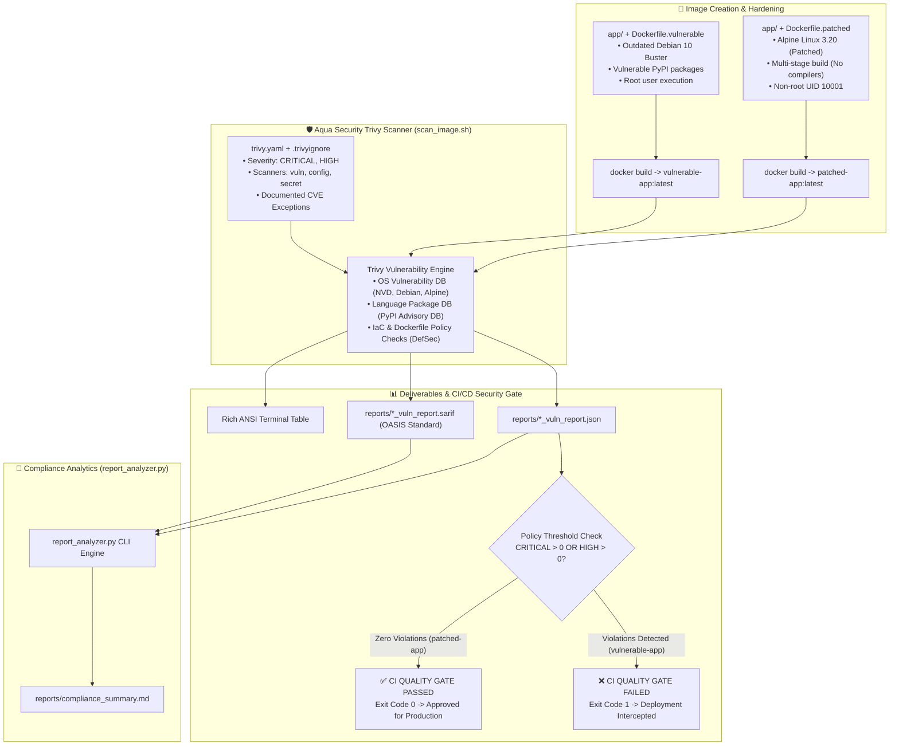

<!-- markdownlint-disable MD013 MD033 MD051 MD060 -->
# 02 - Container Image Vulnerability Scanning with Trivy

> An enterprise-grade **Container DevSecOps** pipeline using **Aqua Security Trivy** to inspect Docker images for OS package CVEs, language dependencies (SCA), container misconfigurations, and hardcoded credentials, outputting **SARIF** compliance reports and enforcing automated CI/CD quality gates.

---

## 📋 Table of Contents

1. [Architectural Overview & Lifecycle](#-architectural-overview--lifecycle)
   - [Container Security Scanning Workflow](#container-security-scanning-workflow)
   - [The Container Attack Surface Matrix](#the-container-attack-surface-matrix)
2. [Theoretical Deep-Dive for Beginners](#-theoretical-deep-dive-for-beginners)
   - [Why Container Vulnerability Scanning is Vital](#why-container-vulnerability-scanning-is-vital)
   - [Anatomy of a CVE & CVSS v3.1 Scoring](#anatomy-of-a-cve--cvss-v31-scoring)
   - [EPSS: Exploit Prediction Scoring System](#epss-exploit-prediction-scoring-system)
   - [Scanning Layers: OS Packages vs. Language SCA vs. Container Misconfigurations](#scanning-layers-os-packages-vs-language-sca-vs-container-misconfigurations)
   - [SARIF (Static Analysis Results Interchange Format) Deep-Dive](#sarif-static-analysis-results-interchange-format-deep-dive)
   - [Risk Acceptance Management: The `.trivyignore` Pattern](#risk-acceptance-management-the-trivyignore-pattern)
3. [Repository & Directory Structure](#-repository--directory-structure)
4. [Prerequisites & System Setup](#-prerequisites--system-setup)
5. [Quickstart Guide](#-quickstart-guide)
6. [Step-by-Step Hands-On Guide](#-step-by-step-hands-on-guide)
   - [Step 1: Inspect Vulnerable vs. Patched Dockerfile Architectures](#step-1-inspect-vulnerable-vs-patched-dockerfile-architectures)
   - [Step 2: Build the Container Images](#step-2-build-the-container-images)
   - [Step 3: Scan the Vulnerable Image & Observe CI Security Gate Blocking](#step-3-scan-the-vulnerable-image--observe-ci-security-gate-blocking)
   - [Step 4: Scan the Hardened Patched Image & Verify Policy Pass](#step-4-scan-the-hardened-patched-image--verify-policy-pass)
   - [Step 5: Apply Risk-Acceptance Policies with `.trivyignore`](#step-5-apply-risk-acceptance-policies-with-trivyignore)
   - [Step 6: Parse SARIF & JSON Artifacts with `report_analyzer.py`](#step-6-parse-sarif--json-artifacts-with-report_analyzerpy)
   - [Step 7: Run the Complete Automated Test Suite](#step-7-run-the-complete-automated-test-suite)
7. [Enterprise Remediation & Hardening Guide](#-enterprise-remediation--hardening-guide)
8. [Troubleshooting & Common Gotchas](#-troubleshooting--common-gotchas)
9. [Resource Teardown & Complete Cleanup](#-resource-teardown--complete-cleanup)

---

## 🏛️ Architectural Overview & Lifecycle

### Container Security Scanning Workflow



### The Container Attack Surface Matrix

A container image is not a black box; it contains multiple distinct layers where security vulnerabilities can enter:

```text
┌─────────────────────────────────────────────────────────────────────────┐
│                    CONTAINER IMAGE ATTACK SURFACE                       │
├─────────────────────────────────────────────────────────────────────────┤
│                                                                         │
│  [ Application Layer ]     Flask, Requests, Urllib3, Jinja2             │
│                            💥 SCA Vulnerabilities (Language dependencies)│
│                                                                         │
│  [ Configuration Layer ]   USER root, missing HEALTHCHECK, open ports    │
│                            ⚠️ Misconfigurations & Policy Violations    │
│                                                                         │
│  [ System Libraries ]      glibc, OpenSSL, libcrypto, zlib, libcurl     │
│                            🔒 OS Package CVEs                           │
│                                                                         │
│  [ Base Image OS ]         Debian, Ubuntu, Alpine, Distroless           │
│                            🏛️ Base OS Vulnerabilities & Kernel Surface  │
│                                                                         │
└─────────────────────────────────────────────────────────────────────────┘
```

---

## 🧠 Theoretical Deep-Dive for Beginners

### Why Container Vulnerability Scanning is Vital

Containers bundle an entire operating system root filesystem (userland libraries, package managers, system binaries) alongside application code.

When deploying a container:

- A vulnerability in an underlying library (such as OpenSSL or curl) exposes your application to Remote Code Execution (RCE), Denial of Service (DoS), or privilege escalation.
- Deploying outdated base images inherits hundreds of known vulnerabilities that attackers can exploit through automated bot scanners.
- **Trivy** provides an automated security gate in CI/CD, catching vulnerabilities before container images are pushed to artifact registries (Docker Hub, Amazon ECR, Google Artifact Registry).

---

### Anatomy of a CVE & CVSS v3.1 Scoring

A **CVE (Common Vulnerabilities and Exposures)** is a standardized identifier for a publicly disclosed cybersecurity flaw (e.g. `CVE-2023-32681`).

Vulnerabilities are evaluated using the **CVSS (Common Vulnerability Scoring System)**:

$$0.0 \le \text{CVSS Base Score} \le 10.0$$

#### CVSS v3.1 Severity Rating Scale

| CVSS Base Score | Severity Level | Production CI/CD Policy Action | SLA Remediation Timeframe |
| :--- | :--- | :--- | :--- |
| **$9.0 - 10.0$** | **CRITICAL** | ❌ **Block Deployment Immediately** | Immediate (< 24 to 48 hours) |
| **$7.0 - 8.9$** | **HIGH** | ❌ **Block Deployment** | High Priority (< 7 to 14 days) |
| **$4.0 - 6.9$** | **MEDIUM** | ⚠️ Warning (Allow with monitoring) | Standard Sprint Cycle (< 30 days) |
| **$0.1 - 3.9$** | **LOW** | ℹ️ Informational (Log only) | Best-effort / Routine maintenance |

---

### EPSS: Exploit Prediction Scoring System

While CVSS measures the **severity** of a vulnerability if exploited, **EPSS (Exploit Prediction Scoring System)** measures the **probability** (0.0 to 1.0 / 0% to 100%) that a vulnerability will be actively weaponized and exploited in the wild within 30 days.

Combining CVSS with EPSS helps DevSecOps teams prioritize vulnerabilities that have active in-the-wild exploits over theoretical flaws.

---

### Scanning Layers: OS Packages vs. Language SCA vs. Container Misconfigurations

Trivy inspects three distinct security layers in a single pass:

1. **OS Package Scanning**: Examines installed operating system packages (`dpkg`, `apk`, `rpm`) against national vulnerability databases.
2. **Software Composition Analysis (SCA)**: Inspects language lockfiles and manifests (`requirements.txt`, `package-lock.json`, `go.sum`, `Cargo.lock`) to identify vulnerable third-party libraries.
3. **Container Misconfiguration (DefSec / IaC)**: Evaluates the `Dockerfile` for unsafe patterns:
   - Running as `root` (`USER root` or missing `USER` directive).
   - Missing `HEALTHCHECK` instructions.
   - Storing secrets in environment variables (`ENV API_KEY=...`).
   - Using `:latest` unpinned base image tags.

---

### SARIF (Static Analysis Results Interchange Format) Deep-Dive

**SARIF (OASIS Standard v2.1.0)** is an open, JSON-based format for exchanging static analysis and vulnerability scanning results between security tools and developer platforms.

Key benefits of SARIF:

- **Universal Platform Ingestion**: GitHub Security Code Scanning, GitLab Security Dashboard, Azure DevOps, and DefectDojo natively ingest SARIF files.
- **Inline PR Annotations**: Vulnerabilities appear directly on GitHub pull requests with line numbers and remediation suggestions.
- **Unified Schema**: Allows organizations to aggregate findings from Trivy, Gitleaks, Semgrep, and Checkov in one standardized pipeline format.

---

### Risk Acceptance Management: The `.trivyignore` Pattern

In enterprise environments, not every detected CVE has an available vendor patch, or the affected code path may be completely unreachable due to network architecture or compensating controls (e.g., WAF, internal VPC).

The `.trivyignore` file allows teams to declare **audited, documented risk exemptions**:

```text
# Syntax: CVE-ID with mandatory justification comment
# Accepted Risk: Header injection in urllib3; mitigated by Cloudflare WAF
CVE-2019-11236
```

---

## 📁 Repository & Directory Structure

```text
11-security-devsecops/02-container-vulnerability-scanning-trivy/
├── .gitignore                      # Excludes scan reports, caches, and test artifacts
├── .markdownlint.json              # Markdownlint rule configurations
├── .trivyignore                    # Documented vulnerability exception rules
├── trivy.yaml                      # Declarative Trivy scanner configuration
├── Dockerfile.vulnerable           # Outdated base image + vulnerable dependencies + root user
├── Dockerfile.patched              # Hardened minimal base + non-root user + patched packages
├── docker-compose.yml              # Sandbox environment with target images & Trivy scanner
├── requirements.txt                # Python analytics requirements
├── scan_image.sh                   # Core automation script for scanning & CI gate enforcement
├── report_analyzer.py              # CLI tool to parse SARIF/JSON & export compliance scorecards
├── test_scanning_pipeline.sh       # Automated E2E test runner validating both image scans
├── cleanup.sh                      # Teardown script for containers, volumes, and images
├── README.md                       # Comprehensive beginner-friendly documentation
└── app/
    ├── app.py                      # Flask REST microservice API
    ├── requirements-vulnerable.txt # Outdated packages with known CVEs (requests 2.20.0, urllib3 1.24.1)
    └── requirements-patched.txt    # Modern secure dependencies (Flask 3.0+, requests 2.32+)
```

---

## 🔧 Prerequisites & System Setup

- **Docker**: Version 24.0+
- **Docker Compose**: Version 2.20+
- **Python**: 3.10+ (for `report_analyzer.py` CLI)
- **Trivy CLI** (Optional): If Trivy is not installed locally, `scan_image.sh` automatically invokes the official `aquasec/trivy:latest` Docker container seamlessly!

---

## 🚀 Quickstart Guide

To execute the automated end-to-end vulnerability scanning test suite:

```bash
# 1. Navigate to the project directory
cd 11-security-devsecops/02-container-vulnerability-scanning-trivy

# 2. Run the automated test suite
./test_scanning_pipeline.sh
```

---

## 📖 Step-by-Step Hands-On Guide

### Step 1: Inspect Vulnerable vs. Patched Dockerfile Architectures

Compare the anti-patterns in `Dockerfile.vulnerable` with the hardened patterns in `Dockerfile.patched`:

#### `Dockerfile.vulnerable` (Anti-patterns)

- Base: `python:3.8-slim-buster` (contains unpatched Debian 10 Buster OS CVEs).
- Packages: Installs outdated dependencies from `app/requirements-vulnerable.txt`.
- Execution: Runs as default `root` user without `HEALTHCHECK`.

#### `Dockerfile.patched` (Best practices)

- Multi-stage build with `python:3.11-alpine`.
- Non-root user: `USER 10001:10001` (`appuser`).
- Minimal attack surface: No build tools (`gcc`) in final runtime image.
- Native Python `HEALTHCHECK` instruction.

---

### Step 2: Build the Container Images

Build both images locally:

```bash
# Build the vulnerable demonstration image
docker build -t vulnerable-app:latest -f Dockerfile.vulnerable .

# Build the hardened patched image
docker build -t patched-app:latest -f Dockerfile.patched .
```

---

### Step 3: Scan the Vulnerable Image & Observe CI Security Gate Blocking

Scan the vulnerable container image with severity filtering and strict exit coding:

```bash
./scan_image.sh --strict vulnerable-app:latest
```

Sample output:

```text
======================================================================
  🛡️  AQUA TRIVY CONTAINER SECURITY SCANNER
======================================================================
 Target Image     : vulnerable-app:latest
 Severities       : CRITICAL,HIGH
 Scanners         : vuln,config,secret
 Policy Ignore    : .trivyignore
 Strict Mode      : true
======================================================================

▶ [1/3] Executing Vulnerability & Misconfiguration Scan...
  [OK] JSON report exported to: reports/vulnerable-app_latest_vuln_report.json
  [OK] SARIF report exported to: reports/vulnerable-app_latest_vuln_report.sarif

▶ [2/3] Rendering Vulnerability Table...
┌──────────────────┬────────────────┬──────────┬───────────────────┬───────────────┐
│ Library          │ Vulnerability  │ Severity │ Installed Version │ Fixed Version │
├──────────────────┼────────────────┼──────────┼───────────────────┼───────────────┤
│ urllib3          │ CVE-2023-43804 │ HIGH     │ 1.24.1            │ 1.26.17       │
│ requests         │ CVE-2023-32681 │ HIGH     │ 2.20.0            │ 2.31.0        │
│ Werkzeug         │ CVE-2023-25577 │ HIGH     │ 0.15.3            │ 2.2.3         │
│ Jinja2           │ CVE-2024-34064 │ HIGH     │ 2.10.1            │ 3.1.4         │
└──────────────────┴────────────────┴──────────┴───────────────────┴───────────────┘

▶ [3/3] Evaluating Security Gate Policy...
  • CRITICAL Vulnerabilities : 0
  • HIGH Vulnerabilities     : 4
  • Total CVEs Flagged       : 4

❌ SECURITY GATE STATUS: FAILED
Policy Violation: Image 'vulnerable-app:latest' contains 4 High severity vulnerabilities.
Remediation: Upgrade base image, update pinned dependencies in requirements.txt, or add documented exemption to .trivyignore.
```

The script exits with code `1`, successfully blocking the vulnerable image from being deployed!

---

### Step 4: Scan the Hardened Patched Image & Verify Policy Pass

Scan the hardened `patched-app:latest` image:

```bash
./scan_image.sh --strict patched-app:latest
```

Sample output:

```text
======================================================================
  🛡️  AQUA TRIVY CONTAINER SECURITY SCANNER
======================================================================
 Target Image     : patched-app:latest
 Severities       : CRITICAL,HIGH
 Scanners         : vuln,config,secret
 Strict Mode      : true
======================================================================

▶ [1/3] Executing Vulnerability & Misconfiguration Scan...
  [OK] JSON report exported to: reports/patched-app_latest_vuln_report.json
  [OK] SARIF report exported to: reports/patched-app_latest_vuln_report.sarif

▶ [2/3] Rendering Vulnerability Table...
patched-app:latest (alpine 3.20.2)
==================================
Total: 0 (CRITICAL: 0, HIGH: 0)

▶ [3/3] Evaluating Security Gate Policy...
  • CRITICAL Vulnerabilities : 0
  • HIGH Vulnerabilities     : 0
  • Total CVEs Flagged       : 0

✅ SECURITY GATE STATUS: PASSED
Image 'patched-app:latest' meets all compliance criteria (0 Critical / High CVEs). Ready for deployment!
```

---

### Step 5: Apply Risk-Acceptance Policies with `.trivyignore`

Review `.trivyignore`:

```text
# Accepted Risk: HTTP Header injection in legacy urllib3
CVE-2019-11236

# Accepted Risk: Credentials stripping on HTTP redirect in legacy requests
CVE-2018-18074
```

When scanning with `--ignore-file .trivyignore`, Trivy filters out explicitly documented CVEs, demonstrating how security teams manage approved exceptions.

---

### Step 6: Parse SARIF & JSON Artifacts with `report_analyzer.py`

Parse the generated scan reports into formatted terminal scorecards and executive Markdown reports:

```bash
# Parse JSON report and generate Markdown scorecard
python3 report_analyzer.py \
    --json-report reports/vulnerable-app_latest_vuln_report.json \
    --image "vulnerable-app:latest" \
    --markdown-out reports/compliance_summary.md

# Parse SARIF standard report
python3 report_analyzer.py \
    --sarif-report reports/vulnerable-app_latest_vuln_report.sarif \
    --image "vulnerable-app:latest"
```

View the generated executive summary in `reports/compliance_summary.md`.

---

### Step 7: Run the Complete Automated Test Suite

Execute `test_scanning_pipeline.sh` to run the full automated verification test suite:

```bash
./test_scanning_pipeline.sh
```

Sample output:

```text
======================================================================
  🧪 STARTING TRIVY CONTAINER VULNERABILITY SCANNING TEST SUITE
======================================================================
▶ [Step 0/6] Validating environment dependencies...
  [PASS] Docker CLI is available
  [PASS] Python 3 is available
▶ [Step 1/6] Building vulnerable and patched container images...
  [PASS] Build vulnerable-app:latest (Dockerfile.vulnerable)
  [PASS] Build patched-app:latest (Dockerfile.patched)
▶ [Step 2/6] Scanning vulnerable-app:latest (Expecting Gate FAILURE)...
  [PASS] Trivy CI security gate BLOCKS vulnerable-app:latest with non-zero exit code
  [PASS] Vulnerable image JSON report generated
  [PASS] Vulnerable image SARIF report generated
▶ [Step 3/6] Scanning patched-app:latest (Expecting Gate SUCCESS)...
  [PASS] Trivy CI security gate PASSES patched-app:latest with exit code 0
  [PASS] Patched image JSON report generated
  [PASS] Patched image SARIF report generated
▶ [Step 4/6] Verifying .trivyignore risk-acceptance filtering...
  [PASS] .trivyignore exception policy file is present
▶ [Step 5/6] Validating report_analyzer.py CLI and Executive Summary...
  [PASS] report_analyzer.py parsed JSON and exported Markdown scorecard
  [PASS] report_analyzer.py parsed SARIF report successfully
  [PASS] report_analyzer.py strict mode correctly flags vulnerable report
  [PASS] report_analyzer.py strict mode passes clean report
▶ [Step 6/6] Validating generated report artifacts...
  [PASS] Executive Markdown report contains structured compliance matrix

======================================================================
  📊 TEST SUITE SUMMARY
  Total Tests Evaluated : 13
  Passed                : 13
  Failed                : 0
======================================================================
🎉 ALL TRIVY CONTAINER VULNERABILITY SCANNING TESTS PASSED!
```

---

## 🛡️ Enterprise Remediation & Hardening Guide

When Trivy flags vulnerabilities during container scans:

1. **Base Image Modernization**:
   - Migrate from unmaintained distributions (Debian Buster/Stretch) to modern minimal distributions (Alpine Linux, Wolfi OS, or Google Distroless).
2. **Multi-Stage Build Pattern**:
   - Compile dependencies in a temporary builder stage and copy only required runtime artifacts to the final container.
3. **Dependency Pinning & Automated Upgrades**:
   - Use Renovate or Dependabot to keep third-party dependencies updated automatically.
4. **Least-Privilege Container Runtime**:
   - Never run container processes as `root`. Specify `USER 10001:10001` or configure Kubernetes `securityContext.runAsNonRoot: true`.

---

## 🔍 Troubleshooting & Common Gotchas

### 1. Permission Denied on `/var/run/docker.sock`

- **Cause**: User lacks permissions to access the Docker daemon socket when running Trivy in a container.
- **Fix**: Ensure your user is part of the `docker` group (`sudo usermod -aG docker $USER`) or use OrbStack / Docker Desktop.

### 2. Rate Limiting on GitHub Vulnerability Database Download

- **Cause**: Initial Trivy DB download exceeds anonymous GitHub API rate limits.
- **Fix**: Set `GITHUB_TOKEN` environment variable (`export GITHUB_TOKEN=your_token`) or allow Trivy cache persistence in `.trivy_cache/`.

---

## 🧹 Resource Teardown & Complete Cleanup

To remove all created containers, Docker images, named volumes, caches, and report files:

```bash
# Standard cleanup: Removes containers, networks, volumes, and reports
./cleanup.sh

# Complete purge: Also purges vulnerable-app, patched-app, and Trivy images
./cleanup.sh --all
```

Sample output:

```text
======================================================================
  🧹 Cleaning Up Trivy Container Scanning Resources
======================================================================
▶ [1/3] Tearing down containers, network, and Trivy cache volumes...
  [OK] Compose containers and networks stopped and removed.
  [OK] Named volume 'trivy_security_cache' deleted.

▶ [2/3] Purging container images (vulnerable, patched, base OS)...
  [OK] Docker images 'vulnerable-app:latest' and 'patched-app:latest' removed.

▶ [3/3] Removing local temporary reports, cache, and Python artifacts...
  [OK] Generated scan reports and caches cleaned.

✨ Environment is completely clean! Ready for subsequent projects.
```
