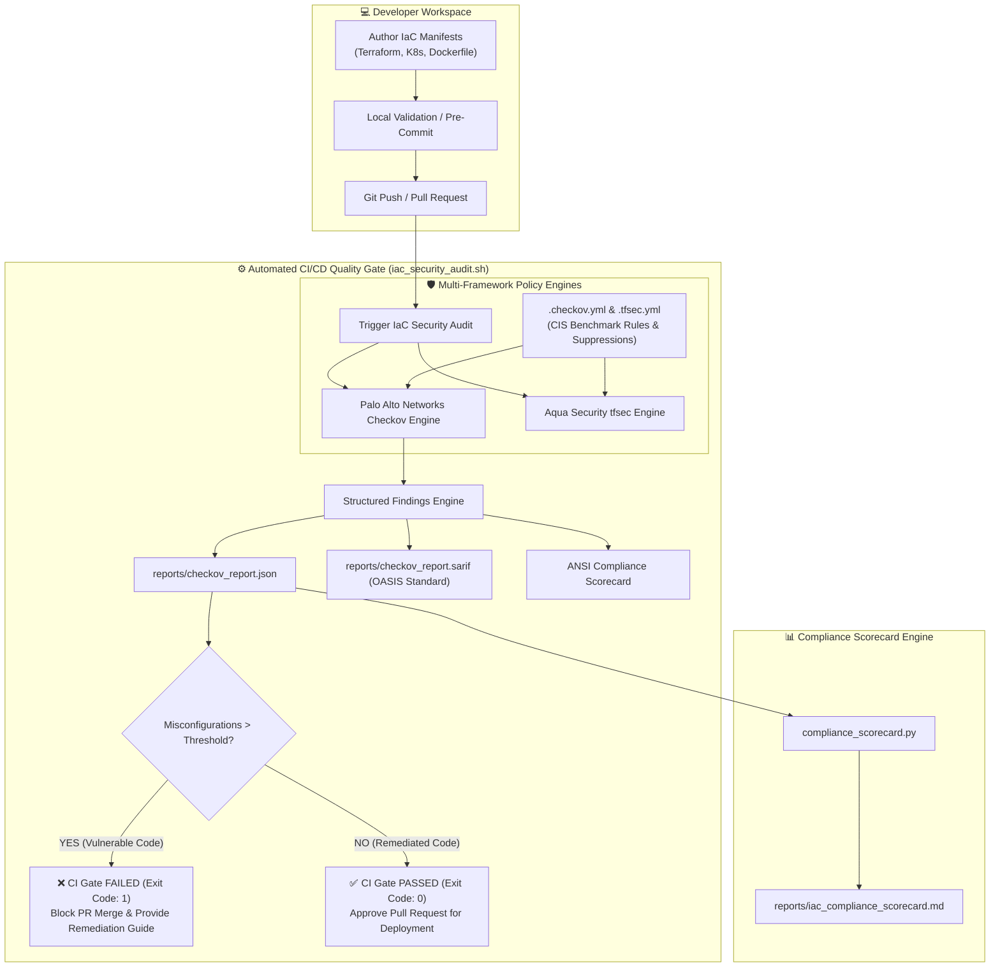

# 🛡️ Mini-Project 11-03: IaC Security Scanning with Checkov and tfsec

A production-grade, educational DevSecOps laboratory demonstrating **Policy-as-Code (PaC)** and **Infrastructure as Code (IaC) Security Scanning**. This project shows how to integrate automated security scanning into CI/CD pipelines to catch cloud misconfigurations, privilege escalations, unencrypted data stores, and regulatory compliance violations across **Terraform (AWS)**, **Kubernetes Manifests**, and **Dockerfiles** before code is ever provisioned into live environments.

---

## 📑 Table of Contents

- [🌟 Overview \& Pedagogical Objectives](#-overview--pedagogical-objectives)
  - [🏛️ Shift-Left Security \& Policy-as-Code Architecture](#️-shift-left-security--policy-as-code-architecture)
  - [🔍 Checkov vs. tfsec: Understanding the Engines](#-checkov-vs-tfsec-understanding-the-engines)
  - [📊 Industry Compliance Frameworks \& Standards](#-industry-compliance-frameworks--standards)
  - [📁 Repository Structure](#-repository-structure)
  - [⚙️ Prerequisites \& Tooling](#️-prerequisites--tooling)
  - [🚀 Step-by-Step Hands-On Guide](#-step-by-step-hands-on-guide)
    - [Step 1: Audit Vulnerable Infrastructure (Observing Policy Violations)](#step-1-audit-vulnerable-infrastructure-observing-policy-violations)
    - [Step 2: Audit Remediated Infrastructure (Observing Compliance Passing)](#step-2-audit-remediated-infrastructure-observing-compliance-passing)
    - [Step 3: Framework-Specific Auditing (Terraform, Kubernetes, Docker)](#step-3-framework-specific-auditing-terraform-kubernetes-docker)
    - [Step 4: Generate Executive Compliance Scorecards (Markdown \& SARIF)](#step-4-generate-executive-compliance-scorecards-markdown--sarif)
    - [Step 5: Run the Automated End-to-End Test Suite](#step-5-run-the-automated-end-to-end-test-suite)
  - [🛡️ Comparative Breakdown: Vulnerable vs. Remediated IaC](#️-comparative-breakdown-vulnerable-vs-remediated-iac)
    - [1. Terraform (AWS S3, Security Groups, EBS, RDS, IAM)](#1-terraform-aws-s3-security-groups-ebs-rds-iam)
    - [2. Kubernetes (Pod Security Standards \& Hardening)](#2-kubernetes-pod-security-standards--hardening)
    - [3. Dockerfile (Container Image Hardening)](#3-dockerfile-container-image-hardening)
  - [🧹 Teardown \& Environment Cleanup](#-teardown--environment-cleanup)
  - [📚 References \& Further Reading](#-references--further-reading)

---

## 🌟 Overview & Pedagogical Objectives

In traditional infrastructure management, security reviews occurred late in the deployment lifecycle or after incidents in production. **Shift-Left Security** moves vulnerability and compliance detection directly into the developer workflow and automated CI/CD pipelines.

```text
Traditional Model:  [Code] -> [Build] -> [Deploy to Prod] -> [Manual Audit] ❌ (Late, costly fixes)
Shift-Left Model:   [Code] -> [IaC Static Analysis (Checkov)] -> [CI Gate] -> [Secure Deploy] ✅
```

By completing this mini-project, you will learn to:

1. **Enforce Policy-as-Code (PaC)**: Automatically evaluate declarative infrastructure files against hundreds of built-in CIS (Center for Internet Security) Benchmarks and NIST controls.
2. **Audit Multi-Framework IaC**: Inspect Terraform configurations, Kubernetes YAML definitions, and Dockerfiles within a single unified pipeline.
3. **Handle Risk Acceptance & Suppressions**: Document legitimate architectural exceptions using structured inline annotations (`#checkov:skip`) and configuration files without bypassing security audits unreviewed.
4. **Export Standardized Security Artifacts**: Generate **OASIS SARIF v2.1.0** (Static Analysis Results Interchange Format) files for native GitHub Advanced Security / GitLab SAST visualization and automated executive Markdown scorecards.
5. **Implement CI/CD Quality Gates**: Enforce hard blockers (`exit code 1`) in automated pull request pipelines when non-compliant infrastructure is proposed.

---

## 🏛️ Shift-Left Security & Policy-as-Code Architecture

The scanning workflow is illustrated in the diagram below:



---

## 🔍 Checkov vs. tfsec: Understanding the Engines

Both **Checkov** and **tfsec** are prominent open-source static analysis tools for infrastructure code. Here is how they compare:

| Feature / Aspect | Checkov (by Palo Alto Networks / Prisma Cloud) | tfsec (by Aqua Security / Trivy family) |
| :--- | :--- | :--- |
| **Primary Focus** | Multi-Framework Policy-as-Code scanner | Dedicated Terraform security scanner |
| **Supported Frameworks** | Terraform, Kubernetes, Dockerfile, CloudFormation, ARM, Helm, Serverless | Terraform HCL2 parsing & modules |
| **Rule Engine** | Python AST & Graph-based context engine | Go-based HCL parser with custom Rego / YAML rules |
| **Compliance Mapping** | Built-in CIS AWS/Azure/GCP, NIST SP 800-53, SOC2, HIPAA, PCI-DSS | AWS, Azure, GCP security best practices |
| **Graph-Based Analysis** | Evaluates inter-resource relationships (e.g., Security Group attached to ENI) | Contextual evaluation within Terraform scope |
| **Output Formats** | CLI, JSON, SARIF v2.1.0, JUnit XML, CycloneDX, CSV | CLI, JSON, SARIF, CSV, Checkstyle |

---

## 📊 Industry Compliance Frameworks & Standards

The checks evaluated in this project directly align with global industry standards:

- **CIS AWS Foundations Benchmark**: Guides secure configuration for IAM, S3, RDS, CloudTrail, KMS, and VPC networking.
- **CIS Kubernetes Benchmark & Pod Security Standards (Restricted Profile)**: Mandates immutable filesystems, non-root user execution, dropped Linux capabilities, and resource boundaries.
- **NIST SP 800-53 (Rev 5)**: Security and privacy controls for federal information systems (Access Control, Cryptographic Protection, Audit and Accountability).
- **SOC 2 Type II**: Security, confidentiality, and availability compliance for SaaS and cloud workloads.

---

## 📁 Repository Structure

```text
11-security-devsecops/03-iac-security-scanning-checkov-tfsec/
├── .gitignore                         # Excludes reports, temporary caches, and logs
├── .markdownlint.json                 # Markdownlint validation rules
├── .checkov.yml                       # Declarative Checkov Policy-as-Code configuration
├── .tfsec.yml                         # tfsec scanner rule configuration
├── Dockerfile                         # Containerized Checkov & tfsec scanner sandbox
├── docker-compose.yml                 # Docker Compose stack for isolated scanning
├── requirements.txt                   # Python requirements (pyyaml)
├── iac_security_audit.sh              # Core scanning automation & CI gate script
├── compliance_scorecard.py            # CLI tool to parse SARIF/JSON & print compliance scorecards
├── test_iac_scanning.sh               # Automated E2E verification test suite (17 assertions)
├── cleanup.sh                         # Resource teardown script for containers, volumes, and images
├── README.md                          # Comprehensive beginner-friendly documentation
└── iac_fixtures/
    ├── vulnerable_infrastructure/     # Flawed manifests with intentional security anti-patterns
    │   ├── terraform/
    │   │   ├── main.tf                # Public S3, open SG 0.0.0.0/0, unencrypted EBS/RDS, wildcard IAM
    │   │   └── variables.tf
    │   ├── kubernetes/
    │   │   ├── deployment.yaml        # Privileged, root user, missing limits, writable FS
    │   │   └── service.yaml
    │   └── docker/
    │       ├── Dockerfile.insecure    # Unpinned base, root execution, missing healthcheck, exposed secret
    │       ├── app.py
    │       └── requirements.txt
    └── remediated_infrastructure/     # Hardened manifests meeting 100% compliance
        ├── terraform/
        │   ├── main.tf                # Encrypted S3/EBS/RDS, scoped SG, least-privilege IAM, lifecycle
        │   ├── variables.tf
        │   └── outputs.tf
        ├── kubernetes/
        │   ├── deployment.yaml        # Non-root UID 10001, read-only FS, limits, dropped caps, probes
        │   ├── networkpolicy.yaml     # Scoped ingress/egress network isolation policy
        │   └── service.yaml
        └── docker/
            ├── Dockerfile.hardened    # Multi-stage minimal Alpine, non-root, native HEALTHCHECK
            ├── app.py
            └── requirements.txt
```

---

## ⚙️ Prerequisites & Tooling

To execute and verify this mini-project, the following tools are recommended:

1. **Docker / OrbStack**: For executing containerized Checkov and tfsec security scanners with zero local environment pollution.
2. **Bash (v4+)**: For executing orchestration and test scripts.
3. **Python (3.9+)**: For running `compliance_scorecard.py`.
4. **Node.js & pnpm** *(Optional)*: For verifying documentation with `markdownlint-cli`.

---

## 🚀 Step-by-Step Hands-On Guide

### Step 1: Audit Vulnerable Infrastructure (Observing Policy Violations)

Run the security audit against the deliberately misconfigured manifests:

```bash
cd 11-security-devsecops/03-iac-security-scanning-checkov-tfsec

# Run audit in standard observation mode
./iac_security_audit.sh --target vulnerable
```

**Expected Behavior**:
Checkov evaluates the Terraform, Kubernetes, and Dockerfile manifests and detects **over 60 security violations**, generating structured reports in `reports/vulnerable_checkov_report.json` and `reports/vulnerable_checkov_report.sarif`.

To test CI/CD pull request gate blocking, pass the `--strict` flag:

```bash
./iac_security_audit.sh --target vulnerable --strict
# Expected Exit Code: 1 (Build Failed)
```

---

### Step 2: Audit Remediated Infrastructure (Observing Compliance Passing)

Execute the audit against the production-hardened manifests:

```bash
# Run audit in strict CI mode
./iac_security_audit.sh --target remediated --strict
# Expected Exit Code: 0 (Build Passed)
```

**Expected Output**:

```text
======================================================================
  📊 IaC SECURITY & COMPLIANCE SCORECARD: REMEDIATED
======================================================================
 • Overall Compliance Score : 100.0%
 • Total Evaluated Checks   : 221
 • Passed Checks            : 215
 • Failed Misconfigurations : 0
 • Suppressed / Skipped     : 6
----------------------------------------------------------------------
Framework Breakdown:
  [terraform] -> Passed: 60 | Failed: 0 | Skipped: 6
  [kubernetes] -> Passed: 90 | Failed: 0 | Skipped: 0
  [dockerfile] -> Passed: 65 | Failed: 0 | Skipped: 0
======================================================================

✅ CI/CD QUALITY GATE: PASSED
All evaluated IaC manifests meet compliance standards (0 violations detected). Ready for deployment!
```

---

### Step 3: Framework-Specific Auditing (Terraform, Kubernetes, Docker)

You can narrow your security audit to specific infrastructure frameworks using the `--framework` flag:

```bash
# Scan only Terraform HCL manifests
./iac_security_audit.sh --target remediated --framework terraform

# Scan only Kubernetes workload manifests
./iac_security_audit.sh --target remediated --framework kubernetes

# Scan only Docker container definitions
./iac_security_audit.sh --target remediated --framework dockerfile
```

---

### Step 4: Generate Executive Compliance Scorecards (Markdown & SARIF)

Use the built-in `compliance_scorecard.py` tool to parse generated audit reports and export Markdown scorecards suitable for PR descriptions or compliance audits:

```bash
python3 compliance_scorecard.py \
    --json-report reports/vulnerable_checkov_report.json \
    --sarif-report reports/vulnerable_checkov_report.sarif \
    --target-name "Payment Gateway Staging" \
    --markdown-out reports/iac_compliance_scorecard.md
```

Inspect the generated scorecard:

```bash
cat reports/iac_compliance_scorecard.md
```

---

### Step 5: Run the Automated End-to-End Test Suite

Execute the automated test suite to validate all 17 security test assertions:

```bash
./test_iac_scanning.sh
```

**Test Verification Summary**:

- `[PASS]` Docker CLI is available
- `[PASS]` Python 3 is available for scorecard analysis
- `[PASS]` Vulnerable IaC fixtures are present (Terraform, K8s, Dockerfile)
- `[PASS]` Remediated IaC fixtures are present (Terraform, K8s, Dockerfile)
- `[PASS]` Checkov CI gate BLOCKS vulnerable infrastructure (non-zero exit code)
- `[PASS]` Vulnerable infrastructure JSON audit report generated
- `[PASS]` Vulnerable infrastructure SARIF v2.1.0 report generated
- `[PASS]` Checkov CI gate PASSES remediated infrastructure (exit code 0)
- `[PASS]` Remediated infrastructure JSON audit report generated
- `[PASS]` Remediated infrastructure SARIF v2.1.0 report generated
- `[PASS]` Framework filter: Terraform scan executed successfully
- `[PASS]` Framework filter: Kubernetes scan executed successfully
- `[PASS]` Framework filter: Dockerfile scan executed successfully
- `[PASS]` compliance_scorecard.py successfully parsed JSON & SARIF reports
- `[PASS]` Executive Markdown scorecard contains structured compliance matrix
- `[PASS]` compliance_scorecard.py strict mode correctly flags violations with exit code 1
- `[PASS]` compliance_scorecard.py strict mode passes clean infrastructure with exit code 0

---

## 🛡️ Comparative Breakdown: Vulnerable vs. Remediated IaC

### 1. Terraform (AWS S3, Security Groups, EBS, RDS, IAM)

#### S3 Storage Bucket

- **Vulnerable Anti-Pattern**:
  - Bucket has `public-read` ACL.
  - Server-side encryption disabled (`CKV_AWS_19`, `CKV_AWS_145`).
  - Object versioning disabled (`CKV_AWS_21`).
  - S3 Public Access Block disabled (`CKV2_AWS_6`).
- **Remediated Hardening**:
  - Dedicated `aws_kms_key` encryption with customer-managed key rotation.
  - Explicit `aws_s3_bucket_public_access_block` enabling all 4 block settings.
  - Object versioning and S3 access logging enabled to a dedicated log bucket.
  - Lifecycle rules archiving objects to `GLACIER` and aborting failed multipart uploads (`CKV_AWS_300`).

#### Security Groups & Networking

- **Vulnerable Anti-Pattern**:
  - Ingress allows `0.0.0.0/0` on SSH port 22 and RDP port 3389 (`CKV_AWS_24`, `CKV_AWS_25`).
  - Missing rule descriptions (`CKV_AWS_23`).
- **Remediated Hardening**:
  - Ingress restricted to corporate CIDR blocks (`10.0.0.0/16`, `10.0.1.0/24`).
  - Every ingress/egress rule includes a clear purpose description.

#### Databases & Storage

- **Vulnerable Anti-Pattern**:
  - Plaintext EBS volume (`encrypted = false`, `CKV_AWS_3`).
  - RDS `publicly_accessible = true`, unencrypted storage (`CKV_AWS_16`), hardcoded password (`CKV_AWS_20`), backup retention set to 0 (`CKV_AWS_133`).
- **Remediated Hardening**:
  - EBS volume encrypted with KMS (`encrypted = true`).
  - RDS configured with `manage_master_user_password = true` (AWS Secrets Manager integration), `storage_encrypted = true`, `multi_az = true`, `backup_retention_period = 14`, enhanced monitoring, and CloudWatch audit log exports.

---

### 2. Kubernetes (Pod Security Standards & Hardening)

#### Pod & Container Security

- **Vulnerable Anti-Pattern**:
  - Container runs as root (`runAsNonRoot: false`, `CKV_K8S_23`).
  - Container runs in privileged mode (`privileged: true`, `CKV_K8S_16`).
  - Writable root filesystem (`readOnlyRootFilesystem: false`, `CKV_K8S_22`).
  - No CPU or memory limits configured (Denial of Service risk, `CKV_K8S_10`, `CKV_K8S_11`).
- **Remediated Hardening**:
  - Container runs under dedicated non-root user (`runAsUser: 10001`, `runAsNonRoot: true`).
  - `allowPrivilegeEscalation: false` and `privileged: false`.
  - Kernel capabilities stripped via `capabilities.drop: ["ALL"]`.
  - `readOnlyRootFilesystem: true` with ephemeral `/tmp` and cache `emptyDir` volumes.
  - Strict `resources.requests` and `resources.limits` for CPU and Memory.
  - Pinned container image digest and `NetworkPolicy` traffic restrictions.

---

### 3. Dockerfile (Container Image Hardening)

- **Vulnerable Anti-Pattern**:
  - Base image uses unpinned `:latest` tag (`CKV_DOCKER_7`).
  - Runs as default `root` user (`CKV_DOCKER_3`).
  - Missing `HEALTHCHECK` instruction (`CKV_DOCKER_2`).
  - Secret token hardcoded in `ENV` instruction (`CKV_DOCKER_1`).
  - Uses `ADD` instead of `COPY` (`CKV_DOCKER_4`).
- **Remediated Hardening**:
  - Pinned minimal Alpine base (`python:3.11.8-alpine3.19`).
  - Multi-stage build separating compilation dependencies from final runtime.
  - Dedicated system user (`USER 10001:10001`).
  - Native standard library `HEALTHCHECK` configured.
  - Secrets removed from build definitions.

---

## 🧹 Teardown & Environment Cleanup

To ensure a clean environment before moving to the next project, run the provided teardown script:

```bash
# Standard cleanup: removes containers, networks, volumes, reports, and caches
./cleanup.sh
```

To perform a complete purge, including the pulled Docker scanner images (`bridgecrew/checkov:latest`, `aquasec/tfsec:latest`, `checkov-iac-scanner:v1.0.0`):

```bash
# Complete purge: also deletes Docker scanner images
./cleanup.sh --all
```

**Cleanup Output**:

```text
======================================================================
  🧹 Cleaning Up IaC Security Scanning Resources
======================================================================

▶ [1/3] Tearing down containers and compose networks...
  [OK] Compose containers and networks stopped and removed.

▶ [2/3] Purging Docker images...
  [OK] Scanner images 'checkov-iac-scanner:v1.0.0', 'bridgecrew/checkov', and 'aquasec/tfsec' removed.

▶ [3/3] Removing local temporary reports, cache, and Python artifacts...
  [OK] Generated scan reports and caches cleaned.

✨ Environment is completely clean! Ready for subsequent projects.
```

---

## 📚 References & Further Reading

- [Checkov Documentation (Palo Alto Networks / Prisma Cloud)](https://www.checkov.io/)
- [tfsec Documentation (Aqua Security)](https://aquasecurity.github.io/tfsec/)
- [CIS AWS Foundations Benchmark](https://www.cisecurity.org/benchmark/amazon_web_services)
- [Kubernetes Pod Security Standards](https://kubernetes.io/docs/concepts/security/pod-security-standards/)
- [OASIS SARIF v2.1.0 Standard Specification](https://docs.oasis-open.org/sarif/sarif/v2.1.0/sarif-v2.1.0.html)
