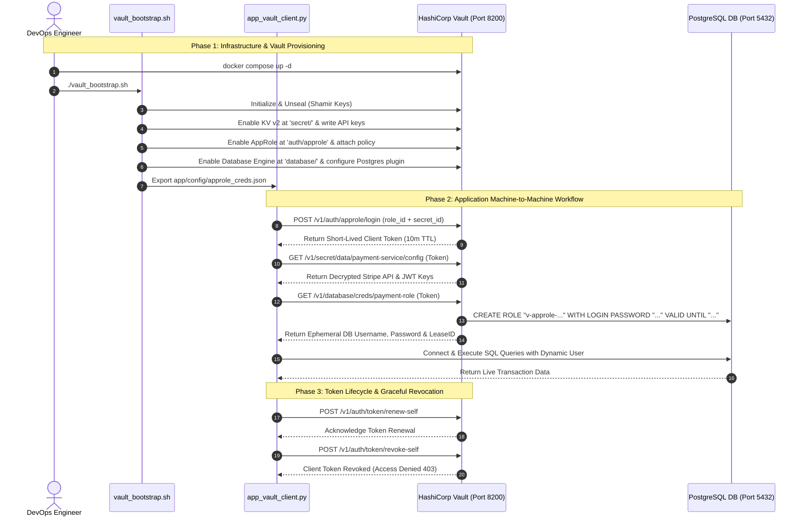

# 🔐 Mini-Project 11-04: HashiCorp Vault Secrets Engine Deployment

A production-grade, educational DevSecOps laboratory demonstrating **Centralized Secrets Management**, **Machine-to-Machine AppRole Authentication**, and **Dynamic Ephemeral Database Credentials** using HashiCorp Vault and PostgreSQL. This project teaches how to eliminate hardcoded credentials and static passwords by deploying a production-like Vault environment with automated provisioning, versioned key-value storage, and automatic credential lease lifecycles.

---

## 📑 Table of Contents

- [🌟 Overview \& Pedagogical Objectives](#-overview--pedagogical-objectives)
  - [The Secret Management Problem: Static vs. Dynamic Secrets](#the-secret-management-problem-static-vs-dynamic-secrets)
  - [Core Learning Goals](#core-learning-goals)
- [🏛️ HashiCorp Vault Architecture \& Core Concepts](#️-hashicorp-vault-architecture--core-concepts)
  - [1. The Barrier, Storage \& Shamir's Secret Sharing](#1-the-barrier-storage--shamirs-secret-sharing)
  - [2. Authentication Backends (Machine-to-Machine AppRole)](#2-authentication-backends-machine-to-machine-approle)
  - [3. Secrets Engines: KV v2 vs. Dynamic Database Engine](#3-secrets-engines-kv-v2-vs-dynamic-database-engine)
  - [4. Lease Lifecycles, Renewal \& Revocation Trees](#4-lease-lifecycles-renewal--revocation-trees)
- [🔄 Architecture \& Sequence Workflow](#-architecture--sequence-workflow)
- [📁 Repository Structure](#-repository-structure)
- [⚙️ Prerequisites \& Environment Setup](#️-prerequisites--environment-setup)
- [🚀 Step-by-Step Hands-On Guide](#-step-by-step-hands-on-guide)
  - [Step 1: Launch Vault \& PostgreSQL Infrastructure Stack](#step-1-launch-vault--postgresql-infrastructure-stack)
  - [Step 2: Bootstrap Vault Storage, Engines \& AppRole](#step-2-bootstrap-vault-storage-engines--approle)
  - [Step 3: Execute Python Application Client](#step-3-execute-python-application-client)
  - [Step 4: Verify Dynamic DB Credential Generation via Vault REST API](#step-4-verify-dynamic-db-credential-generation-via-vault-rest-api)
  - [Step 5: Run the Automated Verification Test Suite](#step-5-run-the-automated-verification-test-suite)
- [🛡️ Security Policies \& Principle of Least Privilege](#️-security-policies--principle-of-least-privilege)
- [🧹 Teardown \& Environment Cleanup](#-teardown--environment-cleanup)
- [📚 References \& Further Reading](#-references--further-reading)

---

## 🌟 Overview & Pedagogical Objectives

### The Secret Management Problem: Static vs. Dynamic Secrets

In legacy software deployments, microservices often share static database passwords and API tokens hardcoded in configuration files, Docker environment variables, or Git repositories. This creates major security risks:

1. **Secret Sprawl**: Passwords end up in logs, environment variables, and commit histories.
2. **Infinite Lifespans**: If a static database credential leaks, attackers retain access indefinitely until manual password rotation occurs.
3. **Shared Identities**: Multiple microservice replicas share the same database user, making audit logging and forensics difficult.

**HashiCorp Vault** solves this with **Dynamic Secrets**:

```text
Legacy Architecture:  [Microservice] ---> Static Shared Password ---> [PostgreSQL Database] ❌ (Leak = Permanent Breach)
Vault Dynamic Model:  [Microservice] ---> Request 15m Credential ---> [Vault Engine] ---> Ephemeral User ---> [Database] ✅
```

### Core Learning Goals

By completing this mini-project, you will learn to:

1. **Deploy & Configure HashiCorp Vault**: Understand the barrier encryption model, server listeners, and storage backends.
2. **Unseal Vault via Shamir's Secret Sharing**: Manage unseal keys and master barrier encryption keys.
3. **Implement Machine-to-Machine AppRole Authentication**: Securely distribute `RoleID` and `SecretID` to authenticate headless workloads.
4. **Manage Versioned KV v2 Secrets**: Store, retrieve, and version-control static application keys (e.g., Stripe API tokens, JWT signing keys).
5. **Provision Ephemeral Database Users**: Configure Vault's PostgreSQL database plugin to generate on-demand, unique database users with strict TTL leases.
6. **Handle Token Lifecycle & Revocation**: Implement token lookup, lease renewal loops, and automated revocation upon application exit.

---

## 🏛️ HashiCorp Vault Architecture & Core Concepts

### 1. The Barrier, Storage & Shamir's Secret Sharing

Vault operates behind a cryptographic **Barrier**. All data stored in the configured backend (file, in-memory, Raft, or Consul) is encrypted using an internal **Master Key** (AES-256-GCM).

- **Initialization**: When Vault is first initialized, it generates the Master Key and splits it using **Shamir's Secret Sharing Algorithm** into unseal key shards.
- **Unsealing**: Vault starts in a sealed state where no secrets can be decrypted. To unseal Vault, a quorum of key holders must provide their key shards to reconstruct the Master Key in memory.

### 2. Authentication Backends (Machine-to-Machine AppRole)

Vault supports multiple authentication backends (Userpass, GitHub, AWS IAM, Kubernetes, AppRole). For non-human machine workloads, **AppRole** is the industry standard:

- **Role ID**: A quasi-static identifier representing the application service (similar to a username).
- **Secret ID**: A high-entropy, short-lived secret token generated dynamically (similar to a password or single-use token).

When the application presents both `role_id` and `secret_id` to `/v1/auth/approle/login`, Vault evaluates policy attachments and returns a **Client Token** with a defined TTL (e.g., 10 minutes).

### 3. Secrets Engines: KV v2 vs. Dynamic Database Engine

Vault organizes data into pluggable **Secrets Engines**:

| Secrets Engine | Mount Path | Secret Type | Behavior & Purpose |
| :--- | :--- | :--- | :--- |
| **KV Version 2** | `secret/data/` | Static Versioned Secrets | Stores encrypted key-value pairs (API tokens, third-party credentials) with historical version tracking and soft-delete capabilities. |
| **Database Engine** | `database/creds/` | Dynamic Ephemeral Secrets | Generates unique PostgreSQL database users on demand with strict time-to-live (TTL) limits. When the lease expires, Vault drops the role automatically. |

### 4. Lease Lifecycles, Renewal & Revocation Trees

Every secret generated by Vault (except root-level static data) has an associated **Lease**:

- **Lease ID**: A unique path tracking the provisioned credential (e.g., `database/creds/payment-role/xyz123`).
- **TTL (Time To Live)**: The lifespan of the credential (e.g., 900 seconds).
- **Renewal**: Applications can call `/v1/sys/leases/renew` to extend the lease before it expires.
- **Revocation**: When a token or lease expires or is revoked, Vault deletes the database role from PostgreSQL and invalidates child tokens across the revocation tree.

---

## 🔄 Architecture & Sequence Workflow



---

## 📁 Repository Structure

```text
11-security-devsecops/04-hashicorp-vault-secrets-engine/
├── .gitignore                         # Excludes runtime data, tokens, keys, and caches
├── .markdownlint.json                 # Markdownlint validation rules
├── docker-compose.yml                 # Vault server & PostgreSQL database stack
├── config/
│   └── vault.hcl                      # Vault server configuration reference
├── policies/
│   ├── payment-app-policy.hcl         # Least-privilege HCL policy for payment microservice
│   └── admin-policy.hcl               # Administrative management policy
├── vault_bootstrap.sh                 # Bootstrap script configuring engines, roles, & secrets
├── app_vault_client.py                # Python client application using hvac & dynamic DB auth
├── requirements.txt                   # Python requirements (hvac, psycopg2-binary)
├── test_vault_pipeline.sh             # Automated E2E verification test suite (14 assertions)
├── cleanup.sh                         # Resource teardown script for containers, volumes, & images
├── README.md                          # Comprehensive beginner-friendly documentation
└── app/
    ├── config/                        # Staging directory for generated AppRole credentials
    │   └── .gitkeep
    └── sql/
        └── init.sql                   # Database schema initialization script
```

---

## ⚙️ Prerequisites & Environment Setup

To run and test this mini-project locally:

1. **Docker / OrbStack**: Ensure Docker engine is running.
2. **Python (3.9+)**: For running `app_vault_client.py`.
3. **curl & jq**: For interacting with the Vault REST API.

---

## 🚀 Step-by-Step Hands-On Guide

### Step 1: Launch Vault & PostgreSQL Infrastructure Stack

Navigate to the project directory and launch the multi-container stack:

```bash
cd 11-security-devsecops/04-hashicorp-vault-secrets-engine

# Start Vault and PostgreSQL in the background
docker compose up -d
```

Verify that both containers are running and healthy:

```bash
docker compose ps
```

You can open the **Vault Web UI** in your browser at `http://localhost:8200`.

---

### Step 2: Bootstrap Vault Storage, Engines & AppRole

Run the automated bootstrapping script:

```bash
./vault_bootstrap.sh
```

**What this script does**:

1. Initializes Vault with Shamir secret shares and exports unseal keys to `vault_init_keys.json`.
2. Unseals Vault in memory.
3. Enables the **KV v2 Secrets Engine** at `secret/` and stores mock payment API keys.
4. Uploads the security policy [`policies/payment-app-policy.hcl`](policies/payment-app-policy.hcl).
5. Enables **AppRole Authentication** at `auth/approle`, binds `payment-service-role`, and writes `RoleID` and `SecretID` to `app/config/approle_creds.json`.
6. Enables the **Database Secrets Engine** at `database/`, connects to PostgreSQL, and configures the dynamic `payment-role` with a 15-minute lease TTL.

---

### Step 3: Execute Python Application Client

Run the Python application client to demonstrate the complete machine-to-machine workflow:

```bash
python3 app_vault_client.py
```

**Observed Terminal Output**:

```text
======================================================================
  🚀 STARTING VAULT APPLICATION CLIENT DEMO
======================================================================

▶ [1/5] Authenticating via AppRole (9d864da2...)...
  [$OK$] Authenticated successfully!
  • Client Token       : hvs.CAES...
  • Policies Attached  : ['default', 'payment-app-policy']
  • Token TTL (Lease)  : 600 seconds (10m)

▶ [2/5] Fetching Static KV v2 Secrets ('secret/data/payment-service/config')...
  [$OK$] KV v2 Secrets retrieved successfully (Version: 1):
  • Stripe API Key     : sk_live_51MOCK...
  • JWT Signing Token  : super-secret-jwt...
  • Encryption Salt    : c4ca4238a0b923820dcc509a6f75849b
  • Environment Target : production

▶ [3/5] Requesting Dynamic DB Credentials ('database/creds/payment-role')...
  [$OK$] Ephemeral database credentials provisioned by Vault:
  • Dynamic DB User    : v-approle-payment--M1d9su0uT0257XfG5WKj-1787539152
  • Dynamic DB Pass    : wKsQdL...
  • Lease Identifier   : database/creds/payment-role/VWyjr87wjXgzSFIwCYioxnJa
  • Lease TTL          : 900s (15 minutes)

▶ [4/5] Connecting to PostgreSQL (127.0.0.1:5432/payment_db) with Dynamic User...
  [$OK$] Query executed successfully! Retrieved live transactions.

▶ [5/5] Demonstrating Token Renewal & Graceful Revocation...
  [$OK$] Client token renewed. New lease TTL: 600 seconds
  [$OK$] Client token revoked successfully.
  [$OK$] Verified: Revoked token access is denied (HTTP 403 Forbidden).

🎉 ALL VAULT SECRETS ENGINE DEMONSTRATIONS COMPLETED SUCCESSFULLY!
```

---

### Step 4: Verify Dynamic DB Credential Generation via Vault REST API

You can inspect dynamic user creation directly using `curl`:

```bash
# 1. Extract AppRole credentials
ROLE_ID=$(python3 -c "import json; print(json.load(open('app/config/approle_creds.json'))['role_id'])")
SECRET_ID=$(python3 -c "import json; print(json.load(open('app/config/approle_creds.json'))['secret_id'])")

# 2. Login via AppRole to obtain a token
CLIENT_TOKEN=$(curl -s -X POST "http://127.0.0.1:8200/v1/auth/approle/login" \
    -d "{\"role_id\": \"${ROLE_ID}\", \"secret_id\": \"${SECRET_ID}\"}" | \
    python3 -c "import sys, json; print(json.load(sys.stdin)['auth']['client_token'])")

# 3. Generate on-demand database credentials
curl -s -H "X-Vault-Token: ${CLIENT_TOKEN}" "http://127.0.0.1:8200/v1/database/creds/payment-role"
```

Notice that each request generates a brand-new, unique username (`v-approle-payment-...`) with its own lease timer!

---

### Step 5: Run the Automated Verification Test Suite

Execute the automated test suite to validate all 14 assertions:

```bash
./test_vault_pipeline.sh
```

**Test Verification Summary**:

- `[PASS]` Docker CLI is available
- `[PASS]` Python 3 is available
- `[PASS]` curl CLI is available
- `[PASS]` Vault server container reached healthy state
- `[PASS]` vault_bootstrap.sh executed successfully
- `[PASS]` Vault unseal keys & root token generated
- `[PASS]` AppRole credentials exported to app/config/approle_creds.json
- `[PASS]` app_vault_client.py completed full AppRole & Dynamic DB workflow
- `[PASS]` AppRole login via REST API returned valid client token
- `[PASS]` KV v2 secret 'stripe_api_key' decrypted and verified
- `[PASS]` Dynamic database user generated with 'v-approle-payment-' prefix
- `[PASS]` Vault lease identifier assigned for dynamic database user
- `[PASS]` Vault blocks invalid AppRole SecretID with HTTP 400/401
- `[PASS]` Vault rejects revoked token with HTTP 403/401 Forbidden

---

## 🛡️ Security Policies & Principle of Least Privilege

The payment microservice operates under a strict least-privilege policy ([`policies/payment-app-policy.hcl`](policies/payment-app-policy.hcl)):

```hcl
# Read-only access to versioned payment secrets
path "secret/data/payment-service/*" {
  capabilities = ["read"]
}

# Generate ephemeral PostgreSQL credentials
path "database/creds/payment-role" {
  capabilities = ["read"]
}

# Self token renewal and graceful revocation
path "auth/token/renew-self" {
  capabilities = ["update"]
}

path "auth/token/revoke-self" {
  capabilities = ["update"]
}
```

The application cannot read secrets from other services (e.g., `secret/data/user-service/*`) or perform administrative functions.

---

## 🧹 Teardown & Environment Cleanup

To ensure a completely clean environment before moving to the next project, run the provided teardown script:

```bash
# Standard cleanup: removes containers, networks, volumes, tokens, and caches
./cleanup.sh
```

To perform a complete purge, including the pulled Docker images (`hashicorp/vault:1.15.5`, `postgres:15-alpine`):

```bash
# Complete purge: also deletes Docker base images
./cleanup.sh --all
```

**Cleanup Output**:

```text
======================================================================
  🧹 Cleaning Up HashiCorp Vault Secrets Engine Resources
======================================================================

▶ [1/3] Tearing down containers, volumes, and networks...
  [OK] Vault and Postgres containers and named volumes removed.

▶ [2/3] Purging Docker images...
  [OK] Docker images 'hashicorp/vault:1.15.5' and 'postgres:15-alpine' removed.

▶ [3/3] Removing local temporary tokens, credentials, and caches...
  [OK] Generated credentials and local caches cleaned.

✨ Environment is completely clean! Ready for subsequent projects.
```

---

## 📚 References & Further Reading

- [HashiCorp Vault Official Documentation](https://developer.hashicorp.com/vault/docs)
- [Vault AppRole Authentication Method Guide](https://developer.hashicorp.com/vault/docs/auth/approle)
- [Vault Database Secrets Engine Documentation](https://developer.hashicorp.com/vault/docs/secrets/databases)
- [hvac: Python Client for HashiCorp Vault](https://hvac.readthedocs.io/en/stable/)
- [Shamir's Secret Sharing Explained](https://en.wikipedia.org/wiki/Shamir%27s_secret_sharing)
