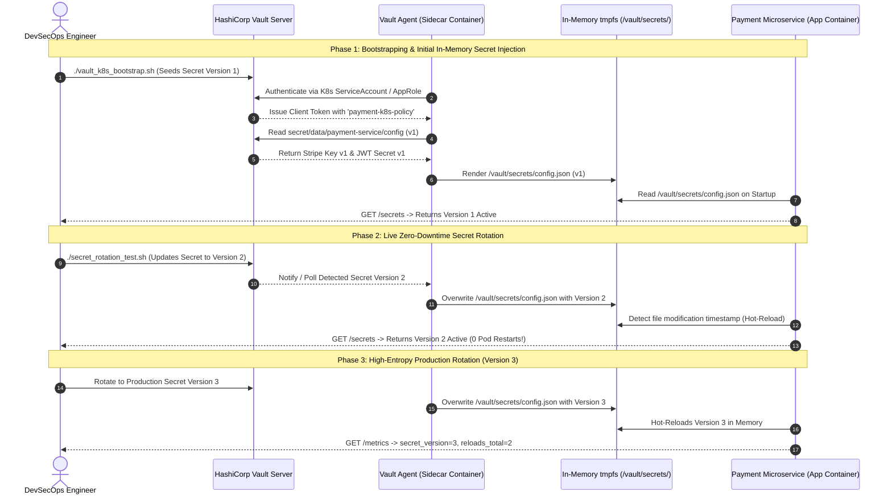

# ☸️ Mini-Project 11-05: Vault Agent Sidecar Secret Injector for Kubernetes

A production-grade, educational DevSecOps laboratory demonstrating **Dynamic In-Memory Secret Injection** and **Zero-Downtime Secret Rotation** on Kubernetes using HashiCorp Vault, the Vault Agent Mutating Admission Webhook, and Consul Templates. This project teaches how to eliminate base64-encoded Kubernetes Secret objects and disk-persisted credentials by injecting secrets directly into application RAM via shared `tmpfs` in-memory volumes.

---

## 📑 Table of Contents

- [🌟 Overview \& Pedagogical Objectives](#-overview--pedagogical-objectives)
  - [The Kubernetes Secret Problem: Why Base64 Is Not Enough](#the-kubernetes-secret-problem-why-base64-is-not-enough)
  - [The Vault Agent Sidecar Solution](#the-vault-agent-sidecar-solution)
  - [Core Learning Goals](#core-learning-goals)
- [🏛️ Vault Agent Injector Architecture \& Kubernetes Mechanics](#️-vault-agent-injector-architecture--kubernetes-mechanics)
  - [1. Mutating Admission Webhook Controller](#1-mutating-admission-webhook-controller)
  - [2. Init Container vs. Sidecar Container](#2-init-container-vs-sidecar-container)
  - [3. Shared In-Memory Volumes (RAM-Backed tmpfs)](#3-shared-in-memory-volumes-ram-backed-tmpfs)
  - [4. Consul Template Formatting \& Secret Transformation](#4-consul-template-formatting--secret-transformation)
- [🔄 Architecture \& Live Rotation Sequence Workflow](#-architecture--live-rotation-sequence-workflow)
- [📁 Repository Structure](#-repository-structure)
- [⚙️ Prerequisites \& Environment Options](#️-prerequisites--environment-options)
- [🚀 Step-by-Step Hands-On Guide](#-step-by-step-hands-on-guide)
  - [Step 1: Launch Vault \& Payment Application Stack](#step-1-launch-vault--payment-application-stack)
  - [Step 2: Bootstrap Vault Storage, Policies \& Sidecar Daemon](#step-2-bootstrap-vault-storage-policies--sidecar-daemon)
  - [Step 3: Verify Initial In-Memory Secret Consumption (Version 1)](#step-3-verify-initial-in-memory-secret-consumption-version-1)
  - [Step 4: Execute Live Zero-Downtime Secret Rotation (v1 -\> v2 -\> v3)](#step-4-execute-live-zero-downtime-secret-rotation-v1---v2---v3)
  - [Step 5: Run the Automated End-to-End Test Suite](#step-5-run-the-automated-end-to-end-test-suite)
- [☸️ Native Kubernetes Deployment Guide (K3s / K3d / Minikube)](#️-native-kubernetes-deployment-guide-k3s--k3d--minikube)
- [🛡️ Security Policies \& Pod Annotations Reference](#️-security-policies--pod-annotations-reference)
- [🧹 Teardown \& Environment Cleanup](#-teardown--environment-cleanup)
- [📚 References \& Further Reading](#-references--further-reading)

---

## 🌟 Overview & Pedagogical Objectives

### The Kubernetes Secret Problem: Why Base64 Is Not Enough

In standard Kubernetes workflows, developers often store sensitive data using native `Secret` resources or inject them as container environment variables:

```yaml
# ❌ Anti-Pattern: Native Kubernetes Secret
apiVersion: v1
kind: Secret
metadata:
  name: payment-secret
data:
  stripe_key: c2tfbGl2ZV9TRUNSRVRfS0VZ # Plain Base64, NOT encrypted!
```

This creates severe security vulnerabilities:

1. **Base64 is Encoding, Not Encryption**: Anyone with read access to the namespace or `kubectl get secret` can decode credentials instantly (`echo ... | base64 -d`).
2. **Environment Variable Sprawl**: Secrets injected via `env` remain visible in `docker inspect`, `/proc/$PID/environ`, crash reports, and application log dumps.
3. **Static Lifespans & Downtime on Rotation**: To update an environment variable secret, the entire Pod must be killed and recreated (`RollingUpdate`), causing potential downtime and cache invalidation.

### The Vault Agent Sidecar Solution

The **Vault Agent Sidecar Injector** replaces static secrets with dynamic in-memory injection:

```text
Traditional Kubernetes: [Git/Manifest] -> [k8s Secret (Base64)] -> [Pod Env Vars] ❌ (Leaked in logs & etcd)
Vault Agent Sidecar:   [Vault Cluster] -> [RAM tmpfs Volume]    -> [In-Memory App] ✅ (Zero disk, live rotation)
```

### Core Learning Goals

By completing this mini-project, you will learn to:

1. **Configure Mutating Admission Webhooks**: Understand how the Vault Kubernetes Injector intercepts Pod scheduling to automatically add sidecars.
2. **Author Consul Templates**: Transform raw Vault KV v2 secrets into custom structured files (JSON, dotenv, YAML, certificates).
3. **Isolate Secrets to In-Memory RAM Storage**: Mount secrets into `/vault/secrets/` backed by `tmpfs` so sensitive data is never written to node disks.
4. **Implement Zero-Downtime Secret Rotation**: Rotate API keys and database passwords in Vault and watch the running application hot-reload credentials without killing containers.
5. **Enforce Least-Privilege Pod Authentication**: Leverage Kubernetes `ServiceAccount` tokens and TokenReview APIs to authenticate pods to Vault.

---

## 🏛️ Vault Agent Injector Architecture & Kubernetes Mechanics

### 1. Mutating Admission Webhook Controller

When you deploy the Vault Helm chart with the injector enabled (`vault-k8s`), it registers a **MutatingWebhookConfiguration** with the Kubernetes API server.

When a pod manifest matching `vault.hashicorp.com/agent-inject: "true"` is submitted:

1. The API Server sends the Pod specification to the Vault Injector webhook.
2. The Webhook mutates the Pod definition by adding a shared `emptyDir` in-memory volume, an init container, and a sidecar container.
3. The API Server schedules the modified multi-container Pod to a worker node.

### 2. Init Container vs. Sidecar Container

The injector adds two specialized containers to the application Pod:

```text
[Pod Lifecycle]
  │
  ├── 1. Init Container (vault-agent-init):
  │      • Authenticates with Vault using Pod ServiceAccount JWT.
  │      • Renders initial secrets into /vault/secrets/.
  │      • Exits with Code 0 once secrets are ready.
  │
  ├── 2. Application Container (payment-service):
  │      • Starts only AFTER init container completes.
  │      • Reads /vault/secrets/config.json immediately on boot.
  │
  └── 3. Sidecar Container (vault-agent):
         • Runs continuously alongside the application.
         • Renews token leases and monitors Vault for changes.
         • Re-renders templates in memory when secrets rotate.
```

### 3. Shared In-Memory Volumes (RAM-Backed tmpfs)

Secrets rendered by Vault Agent are written to a shared `emptyDir` volume:

```yaml
volumes:
  - name: vault-secrets
    emptyDir:
      medium: Memory # Backed by Linux tmpfs RAM!
```

This guarantees that:

- Secrets exist only in ephemeral RAM.
- Secrets are never written to physical node storage (SSD/HDD).
- If the node loses power or the pod terminates, all secrets vanish instantly.

### 4. Consul Template Formatting & Secret Transformation

Vault Agent includes the **Consul Template** engine, allowing arbitrary formatting:

```text
# Raw Vault KV v2 Payload:
{"data": {"stripe_api_key": "sk_live_...", "jwt_secret": "xyz..."}}

# Rendered as config.json:
{
  "stripe_api_key": "sk_live_...",
  "jwt_secret": "xyz...",
  "rendered_at": "2026-08-24T00:00:00Z"
}

# Rendered as app.env:
STRIPE_API_KEY="sk_live_..."
JWT_SECRET="xyz..."
```

---

## 🔄 Architecture & Live Rotation Sequence Workflow



---

## 📁 Repository Structure

```text
11-security-devsecops/05-vault-agent-sidecar-injector-k8s/
├── .gitignore                         # Excludes runtime tokens, logs, and caches
├── .markdownlint.json                 # Markdownlint validation rules
├── docker-compose.yml                 # Vault server & Payment App stack
├── config/
│   ├── vault.hcl                      # Vault server configuration
│   └── vault-agent-config.hcl         # Vault Agent sidecar configuration & templates
├── policies/
│   └── payment-k8s-policy.hcl         # Least-privilege policy for payment service
├── k8s/
│   ├── serviceaccount.yaml            # Dedicated K8s ServiceAccount
│   ├── rbac.yaml                      # ClusterRoleBinding for token review
│   ├── deployment.yaml                # Pod Deployment with Vault Agent injector annotations
│   ├── service.yaml                   # ClusterIP Service for payment application
│   └── vault-injector-values.yaml     # Helm values for Vault K8s injector
├── app/
│   ├── app.py                         # Microservice watching in-memory secrets and serving API
│   ├── Dockerfile                     # Lightweight container definition
│   └── requirements.txt               # Flask dependencies
├── vault_k8s_bootstrap.sh             # Configures Vault engines, auth, and initial secrets
├── secret_rotation_test.sh            # Live secret rotation test script (v1 -> v2 -> v3)
├── test_vault_sidecar_pipeline.sh     # Automated E2E verification test suite (14 assertions)
├── cleanup.sh                         # Resource teardown script for containers, volumes, & images
└── README.md                          # Comprehensive beginner-friendly documentation
```

---

## ⚙️ Prerequisites & Environment Options

This project supports two testing modes:

1. **Zero-Dependency Docker Simulation (Default)**: Uses `docker-compose.yml` to launch Vault, the Vault Agent Sidecar daemon, and the Payment Microservice sharing an in-memory volume. Requires only **Docker** and **Bash**.
2. **Native Kubernetes Cluster (Optional)**: Uses `k8s/*.yaml` manifests to deploy on local K3s, K3d, or Minikube clusters.

---

## 🚀 Step-by-Step Hands-On Guide

### Step 1: Launch Vault & Payment Application Stack

Start the base infrastructure stack:

```bash
cd 11-security-devsecops/05-vault-agent-sidecar-injector-k8s

# Build application image and start Vault + App containers
docker compose up -d --build
```

---

### Step 2: Bootstrap Vault Storage, Policies & Sidecar Daemon

Initialize Vault, load security policies, and start the Vault Agent sidecar:

```bash
./vault_k8s_bootstrap.sh
```

**What this step accomplishes**:

- Initializes and unseals Vault in memory.
- Enables the **KV v2 Secrets Engine** at `secret/` and writes initial **Version 1** secrets.
- Uploads [`policies/payment-k8s-policy.hcl`](policies/payment-k8s-policy.hcl).
- Configures the `payment-k8s-role` AppRole.
- Spawns the `vault-agent-sidecar` container with Consul template rendering into `/vault/secrets/config.json` and `/vault/secrets/app.env`.

---

### Step 3: Verify Initial In-Memory Secret Consumption (Version 1)

Query the payment microservice API:

```bash
# Check service health
curl -s http://localhost:8080/health

# Inspect active in-memory secrets
curl -s http://localhost:8080/secrets
```

**Expected JSON Output**:

```json
{
  "service": "payment-service",
  "secret_version": "1",
  "reload_count": 1,
  "last_reload_time": "2026-08-24T00:15:00Z",
  "secrets": {
    "stripe_api_key_masked": "sk_live_...281X",
    "stripe_api_key_raw": "sk_live_v1_INITIAL_KEY_99281X",
    "jwt_secret_preview": "jwt-hmac-s...",
    "database_password": "DbSecretPasswordV1_Alpha2026!",
    "rendered_at": "2026-08-24T00:15:00Z"
  }
}
```

---

### Step 4: Execute Live Zero-Downtime Secret Rotation (v1 -> v2 -> v3)

Run the automated rotation test to simulate production secret updates:

```bash
./secret_rotation_test.sh
```

**Observed Terminal Output**:

```text
======================================================================
  🔄 LIVE ZERO-DOWNTIME SECRET ROTATION TEST
======================================================================
 Target App URL   : http://127.0.0.1:8080
 Vault Server     : http://127.0.0.1:8200
======================================================================

▶ [1/4] Inspecting Initial In-Memory Secret State (Version 1)...
  • Current Active Version : v1
  • Masked Stripe Key      : sk_live_...281X

▶ [2/4] Rotating Secrets in Vault (Writing Version 2)...
  [OK] Vault KV v2 secret updated to Version 2.
  [WAIT] Waiting for Vault Agent Sidecar to re-render in-memory template...
  [SUCCESS] Application hot-reloaded to Version 2 without restart!
  • New Masked Stripe Key : sk_live_...192A

▶ [3/4] Rotating Secrets in Vault (Writing Version 3)...
  [OK] Vault KV v2 secret updated to Version 3.
  [WAIT] Waiting for Vault Agent Sidecar to re-render in-memory template...
  [SUCCESS] Application hot-reloaded to Version 3 without restart!
  • New Masked Stripe Key : sk_live_...301Z

▶ [4/4] Validating Application Health & Hot-Reload Metrics...
# HELP payment_service_secret_version Current active secret version
# TYPE payment_service_secret_version gauge
payment_service_secret_version 3
# HELP payment_service_secret_reloads_total Total hot-reloads of secrets
# TYPE payment_service_secret_reloads_total counter
payment_service_secret_reloads_total 3

🎉 ZERO-DOWNTIME LIVE SECRET ROTATION VALIDATED SUCCESSFULLY!
```

---

### Step 5: Run the Automated End-to-End Test Suite

Run the full verification suite covering all 14 assertions:

```bash
./test_vault_sidecar_pipeline.sh
```

**Test Verification Summary**:

- `[PASS]` Docker CLI is available
- `[PASS]` Python 3 is available
- `[PASS]` curl CLI is available
- `[PASS]` Kubernetes manifest files exist in k8s/
- `[PASS]` k8s/deployment.yaml contains 'vault.hashicorp.com/agent-inject' annotation
- `[PASS]` k8s/deployment.yaml contains Consul Template configuration
- `[PASS]` Vault Server container started and responsive
- `[PASS]` vault_k8s_bootstrap.sh executed successfully
- `[PASS]` Vault Agent Sidecar daemon is active
- `[PASS]` Payment Service HTTP API is healthy (HTTP 200)
- `[PASS]` Payment Service loaded Version 1 secret from in-memory /vault/secrets/config.json
- `[PASS]` secret_rotation_test.sh completed full rotation lifecycle (v1 -> v2 -> v3)
- `[PASS]` Prometheus metrics report active secret version 3
- `[PASS]` Prometheus metrics track secret hot-reload event counter

---

## ☸️ Native Kubernetes Deployment Guide (K3s / K3d / Minikube)

If you have a local Kubernetes cluster running, you can deploy using the native manifests in [`k8s/`](k8s/):

```bash
# 1. Install Vault with Helm & Agent Injector Enabled
helm repo add hashicorp https://helm.releases.hashicorp.com
helm repo update
helm install vault hashicorp/vault -f k8s/vault-injector-values.yaml

# 2. Apply ServiceAccount and RBAC
kubectl apply -f k8s/serviceaccount.yaml
kubectl apply -f k8s/rbac.yaml

# 3. Deploy Payment Microservice
kubectl apply -f k8s/deployment.yaml
kubectl apply -f k8s/service.yaml

# 4. Verify Sidecar Injection
kubectl get pods -l app=payment-service
# Pod READY column should show 2/2 containers (payment-service + vault-agent)!
```

---

## 🛡️ Security Policies & Pod Annotations Reference

### Vault Injector Annotations in `k8s/deployment.yaml`

| Annotation | Description |
| :--- | :--- |
| `vault.hashicorp.com/agent-inject: "true"` | Signals the Mutating Webhook to inject the sidecar. |
| `vault.hashicorp.com/role: "payment-k8s-role"` | Specifies the Vault role to authenticate against. |
| `vault.hashicorp.com/agent-inject-secret-config.json` | Path to the Vault KV secret to retrieve. |
| `vault.hashicorp.com/agent-inject-template-config.json` | Custom Consul template defining the output file format. |
| `vault.hashicorp.com/agent-pre-populate-only: "false"` | Keeps the sidecar alive for continuous rotation. |

---

## 🧹 Teardown & Environment Cleanup

To ensure a clean environment before moving to the next project:

```bash
# Standard cleanup: removes containers, networks, volumes, and temporary caches
./cleanup.sh
```

To perform a complete purge, including built and pulled Docker images:

```bash
# Complete purge: also deletes Docker images
./cleanup.sh --all
```

**Cleanup Output**:

```text
======================================================================
  🧹 Cleaning Up Vault Kubernetes Sidecar Resources
======================================================================

▶ [1/3] Tearing down containers, volumes, and networks...
  [OK] Vault and Payment App containers and named volumes removed.

▶ [2/3] Purging Docker images...
  [OK] Docker images 'payment-service:v1.0.0' and 'hashicorp/vault:1.15.5' removed.

▶ [3/3] Removing local temporary tokens, credentials, and caches...
  [OK] Generated credentials and local caches cleaned.

✨ Environment is completely clean! Ready for subsequent projects.
```

---

## 📚 References & Further Reading

- [Vault Agent Sidecar Injector Documentation](https://developer.hashicorp.com/vault/docs/platform/k8s/injector)
- [Vault Agent Template Syntax & Consul Template](https://developer.hashicorp.com/vault/docs/agent-and-proxy/agent/template)
- [Kubernetes Mutating Admission Webhooks](https://kubernetes.io/docs/reference/access-authn-authz/extensible-admission-controllers/)
- [Kubernetes Pod Security Standards](https://kubernetes.io/docs/concepts/security/pod-security-standards/)
