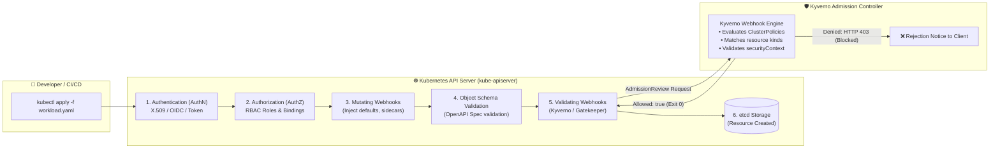

<!-- markdownlint-disable MD013 MD033 MD051 MD060 -->
# 07 - Kubernetes Admission Control with Kyverno & Gatekeeper

> An enterprise-grade **Kubernetes DevSecOps & Zero-Trust Governance** project demonstrating dynamic admission control using **Kyverno** and **OPA Gatekeeper** to enforce cluster-wide security policies: disallowing privileged containers, mandating read-only root filesystems, requiring non-root UIDs, blocking mutable `:latest` image tags, and enforcing resource limits.

---

## 📋 Table of Contents

1. [Architectural Overview & Admission Lifecycle](#-architectural-overview--admission-lifecycle)
   - [The Kubernetes Dynamic Admission Control Pipeline](#the-kubernetes-dynamic-admission-control-pipeline)
   - [Policy Enforcement Architecture](#policy-enforcement-architecture)
2. [Theoretical Deep-Dive for Beginners](#-theoretical-deep-dive-for-beginners)
   - [Why RBAC is Not Enough: The Need for Admission Control](#why-rbac-is-not-enough-the-need-for-admission-control)
   - [Mutating vs. Validating Admission Webhooks](#mutating-vs-validating-admission-webhooks)
   - [Kyverno vs. OPA Gatekeeper Compared](#kyverno-vs-opa-gatekeeper-compared)
   - [Kubernetes Pod Security Standards (PSS) Alignment](#kubernetes-pod-security-standards-pss-alignment)
   - [The 5 Critical Governance Policies Explained](#the-5-critical-governance-policies-explained)
3. [Repository & Directory Structure](#-repository--directory-structure)
4. [Prerequisites & System Setup](#-prerequisites--system-setup)
5. [Quickstart Guide](#-quickstart-guide)
6. [Step-by-Step Hands-On Guide](#-step-by-step-hands-on-guide)
   - [Step 1: Inspect Security Policies & Workloads](#step-1-inspect-security-policies--workloads)
   - [Step 2: Provision the Local K3d Cluster & Deploy Kyverno](#step-2-provision-the-local-k3d-cluster--deploy-kyverno)
   - [Step 3: Verify Admission Webhook Pod Health](#step-3-verify-admission-webhook-pod-health)
   - [Step 4: Register ClusterPolicies with the Admission Webhook](#step-4-register-clusterpolicies-with-the-admission-webhook)
   - [Step 5: Deploy the Compliant Hardened Workload](#step-5-deploy-the-compliant-hardened-workload)
   - [Step 6: Test Individual Policy Violations & Observe Admission Denials](#step-6-test-individual-policy-violations--observe-admission-denials)
   - [Step 7: Run the Complete Automated Policy Audit Suite](#step-7-run-the-complete-automated-policy-audit-suite)
7. [Enterprise Production Best Practices](#-enterprise-production-best-practices)
8. [Troubleshooting & Common Gotchas](#-troubleshooting--common-gotchas)
9. [Resource Teardown & Complete Cleanup](#-resource-teardown--complete-cleanup)

---

## 🏛️ Architectural Overview & Admission Lifecycle

### The Kubernetes Dynamic Admission Control Pipeline

Every API request sent to the Kubernetes API server traverses a strict sequence of validation stages before state changes are persisted to `etcd`:



### Policy Enforcement Architecture

```text
┌───────────────────────────────────────────────────────────────────────────┐
│              KUBERNETES CLUSTER ADMISSION CONTROL BOUNDARY                │
├───────────────────────────────────────────────────────────────────────────┤
│                                                                           │
│   [ Non-Compliant Pod ] ──▶ [ Kube-APIServer ] ──▶ [ Kyverno Webhook ]    │
│   • Privileged: true                                      │               │
│   • runAsUser: 0 (root)                                   ▼               │
│   • image: nginx:latest                            ❌ HTTP 403 FORBIDDEN  │
│   • writable rootfs                                (Deployment Rejected)  │
│   • missing limits                                                        │
│                                                                           │
│   [ Hardened Pod ]      ──▶ [ Kube-APIServer ] ──▶ [ Kyverno Webhook ]    │
│   • runAsNonRoot: true                                    │               │
│   • runAsUser: 10001                                      ▼               │
│   • readOnlyRootFilesystem: true                   ✅ ADMITTED (HTTP 201) │
│   • image: nginx:1.27.0-alpine                     (Persisted to etcd)    │
│   • CPU/Memory requests & limits                                          │
│                                                                           │
└───────────────────────────────────────────────────────────────────────────┘
```

---

## 🧠 Theoretical Deep-Dive for Beginners

### Why RBAC is Not Enough: The Need for Admission Control

Kubernetes **Role-Based Access Control (RBAC)** answers the question:
> *"Is this user or ServiceAccount authorized to perform action `[create, update, delete]` on resource `[pods, deployments]` in namespace `[prod]`?"*

However, RBAC **cannot** inspect the internal fields or security attributes of a resource manifest:

- RBAC cannot prevent a developer with `create pods` permission from launching a `privileged: true` container that mounts `/dev` or `/proc` from the host node.
- RBAC cannot prevent a developer from running containers as root (`UID 0`) or deploying unpinned images with the mutable `:latest` tag.

**Admission Controllers** solve this fundamental gap by inspecting, validating, and mutating the exact JSON payload of every resource before it is accepted.

### Mutating vs. Validating Admission Webhooks

Kubernetes supports two distinct types of dynamic admission webhooks:

| Webhook Type | Execution Phase | Function | Example Use Case |
| :--- | :--- | :--- | :--- |
| **Mutating Webhook** | Executed *before* schema validation | Modifies the incoming object manifest before admission. | Automatically injecting Vault sidecar agents, adding default labels, setting default resource limits. |
| **Validating Webhook** | Executed *after* mutating webhooks and schema validation | Evaluates object fields against security policies; returns an **Accept (Allow)** or **Reject (Deny)** decision with an error reason. | Blocking privileged containers, enforcing read-only root filesystems, requiring non-root UIDs. |

### Kyverno vs. OPA Gatekeeper Compared

Both Kyverno and OPA (Open Policy Agent) Gatekeeper are CNCF-graduated/incubating policy engines:

| Dimension | Kyverno | OPA Gatekeeper |
| :--- | :--- | :--- |
| **Policy Language** | **Pure YAML / JSON** (Familiar to Kubernetes operators) | **Rego** (Specialized declarative query language) |
| **Learning Curve** | Gentle / Intuitive for DevOps & K8s engineers | Moderate to steep (Requires mastering Rego syntax) |
| **Capabilities** | Validation, Mutation, Generation, Image Verification (Cosign) | Validation, Mutation, External Data auditing |
| **CRD Model** | `ClusterPolicy` / `Policy` | `ConstraintTemplate` + `Constraint` |
| **Adoption Target** | Cloud-native Kubernetes-first environments | Multi-platform enterprise governance (K8s, Terraform, Envoy) |

> [!TIP]
> This repository provides ready-to-use policy manifests for **both** Kyverno (`policies/kyverno/`) and OPA Gatekeeper (`policies/gatekeeper/`), allowing you to compare both paradigms directly.

### Kubernetes Pod Security Standards (PSS) Alignment

The Kubernetes project classifies workload security into three distinct **Pod Security Standards (PSS)** levels:

1. **Privileged**: Unrestricted policies; provides widest permissions (used by system daemons, CNI plugins, and storage drivers).
2. **Baseline**: Minimally restrictive policy; prevents known privilege escalation exploits while maintaining high compatibility.
3. **Restricted**: Hardened zero-trust policy; enforces best practices for container isolation (non-root, read-only root fs, dropped capabilities, no privilege escalation).

The policies in this project implement the **Restricted** standard.

### The 5 Critical Governance Policies Explained

```text
┌─────────────────────────────────────────────────────────────────────────┐
│                    THE 5 PILLARS OF POD GOVERNANCE                      │
├─────────────────────────────────────────────────────────────────────────┤
│                                                                         │
│  1. [ Disallow Privileged Containers ]                                  │
│     Blocks container breakout to host devices & kernel capabilities.     │
│                                                                         │
│  2. [ Require Read-Only Root Filesystem ]                               │
│     Prevents runtime payload drops, malware downloads & script patching.│
│                                                                         │
│  3. [ Require Run As Non-Root User ]                                    │
│     Ensures UID > 0, limiting kernel attack surface if container breaks.│
│                                                                         │
│  4. [ Disallow ':latest' Image Tags ]                                   │
│     Guarantees deterministic, reproducible, and immutable deployments.  │
│                                                                         │
│  5. [ Require CPU & Memory Requests and Limits ]                        │
│     Prevents 'Noisy Neighbor' denial of service & node OOM panics.      │
│                                                                         │
└─────────────────────────────────────────────────────────────────────────┘
```

---

## 📁 Repository & Directory Structure

```text
11-security-devsecops/07-kyverno-gatekeeper-admission-policies/
├── .gitignore                          # Excludes logs, temporary files, and reports
├── .markdownlint.json                  # Markdown linter configuration
├── README.md                           # Comprehensive educational documentation
├── admission_policy_audit.sh           # Automated audit test suite (6 test scenarios)
├── cleanup.sh                          # Resource teardown and cleanup automation
├── deploy_admission_controller.sh      # Automated cluster & Kyverno provisioner
├── policies/
│   ├── gatekeeper/                     # OPA Gatekeeper ConstraintTemplates & Constraints
│   │   ├── constraints/
│   │   │   └── security-constraints.yaml
│   │   └── templates/
│   │       ├── k8spspprivilegedcontainer.yaml
│   │       ├── k8spspreadonlyrootfilesystem.yaml
│   │       ├── k8spsprunasnonroot.yaml
│   │       └── k8srequiredtags.yaml
│   └── kyverno/                        # Kyverno ClusterPolicy manifests
│       ├── disallow-latest-tag.yaml
│       ├── disallow-privileged-containers.yaml
│       ├── require-read-only-root-filesystem.yaml
│       ├── require-resource-requests-limits.yaml
│       └── require-run-as-non-root.yaml
└── workloads/                          # Compliant & Non-Compliant test manifests
    ├── compliant-pod.yaml              # Hardened compliant pod (Expected: ALLOW)
    ├── non-compliant-latest-tag.yaml   # Uses ':latest' tag (Expected: BLOCK)
    ├── non-compliant-no-resources.yaml # Missing requests/limits (Expected: BLOCK)
    ├── non-compliant-privileged.yaml   # privileged: true (Expected: BLOCK)
    ├── non-compliant-root-user.yaml    # runAsUser: 0 (Expected: BLOCK)
    └── non-compliant-writable-fs.yaml  # readOnlyRootFilesystem: false (Expected: BLOCK)
```

---

## 🔧 Prerequisites & System Setup

To run this mini-project locally, ensure the following tools are installed:

- **Docker Engine** (or OrbStack): Container runtime for local nodes.
- **k3d**: Lightweight local K3s cluster manager (`brew install k3d` or `curl -s https://raw.githubusercontent.com/k3d-io/k3d/main/install.sh | bash`).
- **kubectl**: Kubernetes command-line tool.
- **Helm**: Kubernetes package manager (`brew install helm`).

Verify your environment:

```bash
docker info >/dev/null && echo "Docker is running"
k3d version
kubectl version --client
helm version
```

---

## ⚡ Quickstart Guide

Deploy the admission controller, apply policies, and run the automated audit suite in one command:

```bash
# 1. Navigate to the project directory
cd 11-security-devsecops/07-kyverno-gatekeeper-admission-policies

# 2. Run the automated audit suite (auto-provisions cluster & Kyverno if needed)
./admission_policy_audit.sh

# 3. Clean up all resources when finished
./cleanup.sh --all
```

---

## 🚀 Step-by-Step Hands-On Guide

### Step 1: Inspect Security Policies & Workloads

Examine the declarative Kyverno `ClusterPolicy` definition for disallowing privileged containers:

```bash
cat policies/kyverno/disallow-privileged-containers.yaml
```

Notice the `validationFailureAction: Enforce` setting, which instructs the admission webhook to reject non-compliant requests rather than merely auditing them.

Next, inspect the compliant workload definition in `workloads/compliant-pod.yaml` to see how it complies with all 5 policies (non-root UID `10001`, `readOnlyRootFilesystem: true`, pinned tag `nginx:1.27.0-alpine`, resource limits).

### Step 2: Provision the Local K3d Cluster & Deploy Kyverno

Execute the deployment bootstrap script:

```bash
./deploy_admission_controller.sh
```

This script:

1. Creates a lightweight local K3d cluster named `admission-sandbox`.
2. Installs the Kyverno Helm chart into the `kyverno` namespace.
3. Waits for all admission controller pods to reach `Ready` state.
4. Creates the `admission-security-demo` test namespace.
5. Enrolls all 5 `ClusterPolicy` manifests.

### Step 3: Verify Admission Webhook Pod Health

Check that Kyverno admission controller pods are running:

```bash
kubectl get pods -n kyverno
```

*Expected output:*

```text
NAME                                            READY   STATUS    RESTARTS   AGE
kyverno-admission-controller-6c5fc6bfdb-vhmtf   1/1     Running   0          2m
kyverno-background-controller-fb75764b9-qk2mv   1/1     Running   0          2m
kyverno-cleanup-controller-678c76fc74-jj4sq     1/1     Running   0          2m
kyverno-reports-controller-8b5b76555-z6nsg      1/1     Running   0          2m
```

### Step 4: Register ClusterPolicies with the Admission Webhook

Confirm that all 5 `ClusterPolicy` resources are active:

```bash
kubectl get clusterpolicies
```

*Expected output:*

```text
NAME                                 BACKGROUND   VALIDATE ACTION   READY
disallow-latest-tag                  true         Enforce           true
disallow-privileged-containers       true         Enforce           true
require-read-only-root-filesystem    true         Enforce           true
require-resource-requests-limits     true         Enforce           true
require-run-as-non-root              true         Enforce           true
```

### Step 5: Deploy the Compliant Hardened Workload

Apply the compliant pod manifest:

```bash
kubectl apply -f workloads/compliant-pod.yaml
```

*Expected output:*

```text
pod/secure-compliant-pod created
```

Verify the running pod:

```bash
kubectl get pods -n admission-security-demo
```

### Step 6: Test Individual Policy Violations & Observe Admission Denials

Now, attempt deploying each non-compliant workload to observe real-time admission webhook enforcement:

#### Test 6A: Privileged Container Interception

```bash
kubectl apply -f workloads/non-compliant-privileged.yaml
```

*Expected admission rejection:*

```text
Error from server: error when creating "workloads/non-compliant-privileged.yaml":
admission webhook "validate.kyverno.svc-fail" denied the request: 
resource Pod/admission-security-demo/test-violation-privileged was blocked due to the following policies: 

disallow-privileged-containers:
  validate-privileged: 'validation error: Privileged containers are not allowed. Set securityContext.privileged to false.'
```

#### Test 6B: Root User (UID 0) Interception

```bash
kubectl apply -f workloads/non-compliant-root-user.yaml
```

*Expected admission rejection:*

```text
Error from server: error when creating "workloads/non-compliant-root-user.yaml":
admission webhook "validate.kyverno.svc-fail" denied the request: 
resource Pod/admission-security-demo/test-violation-root-user was blocked due to the following policies: 

require-run-as-non-root:
  check-run-as-non-root: 'validation error: Running as root is not allowed. Set securityContext.runAsNonRoot to true.'
```

#### Test 6C: Writable Root Filesystem Interception

```bash
kubectl apply -f workloads/non-compliant-writable-fs.yaml
```

*Expected admission rejection:*

```text
Error from server: error when creating "workloads/non-compliant-writable-fs.yaml":
admission webhook "validate.kyverno.svc-fail" denied the request: 

require-read-only-root-filesystem:
  validate-read-only-root-filesystem: 'validation error: A read-only root filesystem is required. Set securityContext.readOnlyRootFilesystem to true.'
```

#### Test 6D: `:latest` Image Tag Interception

```bash
kubectl apply -f workloads/non-compliant-latest-tag.yaml
```

*Expected admission rejection:*

```text
Error from server: error when creating "workloads/non-compliant-latest-tag.yaml":
admission webhook "validate.kyverno.svc-fail" denied the request: 

disallow-latest-tag:
  validate-image-tag: 'validation error: Using '':latest'' tag or untagged images is prohibited. Use an explicit semantic tag or digest.'
```

#### Test 6E: Unbounded CPU/Memory Interception

```bash
kubectl apply -f workloads/non-compliant-no-resources.yaml
```

*Expected admission rejection:*

```text
Error from server: error when creating "workloads/non-compliant-no-resources.yaml":
admission webhook "validate.kyverno.svc-fail" denied the request: 

require-resource-requests-limits:
  validate-resources: 'validation error: CPU and memory resource requests and limits are mandatory for all containers.'
```

### Step 7: Run the Complete Automated Policy Audit Suite

Run the automated test suite to validate all 6 scenarios in sequence and generate an executive compliance scorecard:

```bash
./admission_policy_audit.sh
```

*Terminal output:*

```text
======================================================================
  🛡️  KUBERNETES ADMISSION POLICY GOVERNANCE AUDIT SUITE
======================================================================
 Target Namespace : admission-security-demo
 Cluster Context  : k3d-admission-sandbox
 Reports Target   : .../reports/admission_audit_report.md
======================================================================

▶ [Test 1/6] Evaluating Policy: Baseline / Hardened Pod
  Decision   : [ADMITTED - ALLOW]
  Result     : [PASS] Workload met all security standards.

▶ [Test 2/6] Evaluating Policy: disallow-privileged-containers
  Decision   : [INTERCEPTED - DENY]
  Result     : [PASS] Admission controller blocked non-compliant workload.

▶ [Test 3/6] Evaluating Policy: require-run-as-non-root
  Decision   : [INTERCEPTED - DENY]
  Result     : [PASS] Admission controller blocked non-compliant workload.

▶ [Test 4/6] Evaluating Policy: require-read-only-root-filesystem
  Decision   : [INTERCEPTED - DENY]
  Result     : [PASS] Admission controller blocked non-compliant workload.

▶ [Test 5/6] Evaluating Policy: disallow-latest-tag
  Decision   : [INTERCEPTED - DENY]
  Result     : [PASS] Admission controller blocked non-compliant workload.

▶ [Test 6/6] Evaluating Policy: require-resource-requests-limits
  Decision   : [INTERCEPTED - DENY]
  Result     : [PASS] Admission controller blocked non-compliant workload.

======================================================================
  📊 ADMISSION POLICY AUDIT SCORECARD
======================================================================
 Total Audited Tests : 6
 Tests Passed        : 6
 Tests Failed        : 0
 Audit Report Saved  : .../reports/admission_audit_report.md
======================================================================

🎉 ALL ADMISSION POLICIES ENFORCED SUCCESSFULLY! (100% COMPLIANCE)
```

View the generated Markdown audit report:

```bash
cat reports/admission_audit_report.md
```

---

## 🛡️ Enterprise Production Best Practices

| Best Practice | Recommendation | Rationale |
| :--- | :--- | :--- |
| **Phased Rollout (`Audit` -> `Enforce`)** | Start new policies with `validationFailureAction: Audit` before switching to `Enforce`. | Prevents accidental disruption of legacy or production workloads while identifying non-compliant services. |
| **Webhook `failurePolicy` Management** | Use `failurePolicy: Fail` for critical security policies; `failurePolicy: Ignore` for non-critical policies during control-plane maintenance. | Balances security posture against cluster availability during webhook upgrades. |
| **Namespace Exclusion** | Exclude `kube-system`, `kyverno`, and infrastructure namespaces from restrictive policies. | Prevents bricking cluster bootstrapping and CNI/storage daemonsets. |
| **CI/CD Shift-Left Validation** | Run `kyverno-cli apply` or `conftest` during pull request CI builds. | Catches policy violations before code merges, providing fast feedback to developers. |

---

## ❓ Troubleshooting & Common Gotchas

### 1. `error when creating: admission webhook "validate.kyverno.svc" connection refused`

- **Cause**: Kyverno admission controller pods are still starting up or initializing TLS certificates.
- **Remedy**: Wait 15-30 seconds and verify with `kubectl get pods -n kyverno`. The webhook automatically becomes available once certificates are issued.

### 2. `error: no matching resources found`

- **Cause**: Manifest was applied without specifying the target namespace or policies are scoped to a different namespace.
- **Remedy**: Ensure you are targeting the `admission-security-demo` namespace (`-n admission-security-demo`).

---

## 🧹 Resource Teardown & Complete Cleanup

To clean up test workloads, namespaces, Kyverno policies, and local reports while preserving the K3d cluster:

```bash
# Standard cleanup: removes test namespaces, pods, policies, and reports
./cleanup.sh
```

To perform a **complete teardown** including deleting the local K3d cluster:

```bash
# Complete teardown: removes k3d cluster 'admission-sandbox' and all artifacts
./cleanup.sh --all
```

*Terminal verification confirmation:*

```text
======================================================================
  🧹 Cleaning Up Kubernetes Admission Control Sandbox Resources
======================================================================
▶ [1/3] Removing test workloads and demo namespace...
  [OK] Namespace 'admission-security-demo' and associated pods removed.

▶ [2/3] Removing Kyverno ClusterPolicies & Helm deployment...
  [OK] Kyverno ClusterPolicies removed.
  [OK] Kyverno Helm release and namespace removed.

▶ [3/3] Deleting K3d cluster 'admission-sandbox' & local reports...
  [OK] K3d cluster 'admission-sandbox' deleted.
  [OK] Generated audit reports and logs removed.

✨ Environment is clean! Ready for subsequent projects.
```
