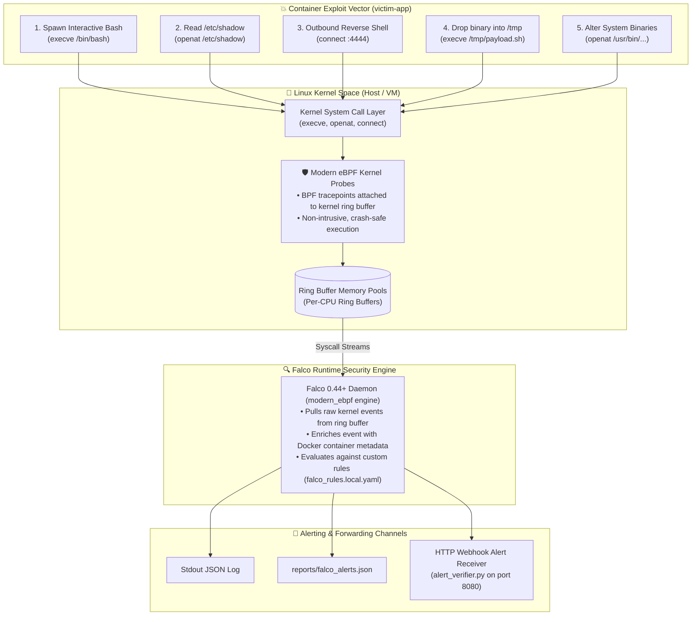

<!-- markdownlint-disable MD013 MD033 MD051 MD060 -->
# 08 - Runtime Threat Detection with Falco and eBPF

> An enterprise-grade **Kubernetes & Container Runtime Security** project demonstrating real-time behavioral anomaly and threat detection using **Falco 0.44+** with modern **eBPF** (Extended Berkeley Packet Filter) kernel probes to intercept interactive shells, unauthorized credential reads, reverse shells, memory-dropped payloads, and system tampering.

---

## 📋 Table of Contents

1. [Architectural Overview & Threat Detection Lifecycle](#-architectural-overview--threat-detection-lifecycle)
   - [The Linux Kernel to Falco eBPF Event Pipeline](#the-linux-kernel-to-falco-ebpf-event-pipeline)
   - [Container Security Boundary Architecture](#container-security-boundary-architecture)
2. [Theoretical Deep-Dive for Beginners](#-theoretical-deep-dive-for-beginners)
   - [Why Static Scanning is Not Enough: The Need for Runtime Security](#why-static-scanning-is-not-enough-the-need-for-runtime-security)
   - [What is eBPF (Extended Berkeley Packet Filter)?](#what-is-ebpf-extended-berkeley-packet-filter)
   - [Modern eBPF vs. Legacy Kernel Modules (`modern_ebpf` vs. `kmod`)](#modern-ebpf-vs-legacy-kernel-modules-modern_ebpf-vs-kmod)
   - [Anatomy of a Falco Security Rule](#anatomy-of-a-falco-security-rule)
   - [MITRE ATT&CK for Containers Tactics Alignment](#mitre-attck-for-containers-tactics-alignment)
   - [The 5 Core Runtime Security Scenarios Explained](#the-5-core-runtime-security-scenarios-explained)
3. [Repository & Directory Structure](#-repository--directory-structure)
4. [Prerequisites & System Setup](#-prerequisites--system-setup)
5. [Quickstart Guide](#-quickstart-guide)
6. [Step-by-Step Hands-On Guide](#-step-by-step-hands-on-guide)
   - [Step 1: Inspect Custom Falco Security Rules](#step-1-inspect-custom-falco-security-rules)
   - [Step 2: Inspect Falco Engine Configuration](#step-2-inspect-falco-engine-configuration)
   - [Step 3: Launch the Runtime Security Sandbox](#step-3-launch-the-runtime-security-sandbox)
   - [Step 4: Verify eBPF Probe Attachment & Container Health](#step-4-verify-ebpf-probe-attachment--container-health)
   - [Step 5: Execute Threat Simulations via `simulate_threats.sh`](#step-5-execute-threat-simulations-via-simulate_threatssh)
   - [Step 6: Ingest & Verify Alerts via `alert_verifier.py`](#step-6-ingest--verify-alerts-via-alert_verifierpy)
   - [Step 7: Run the Full Automated Test Suite](#step-7-run-the-full-automated-test-suite)
7. [Enterprise Production Best Practices](#-enterprise-production-best-practices)
8. [Troubleshooting & Common Gotchas](#-troubleshooting--common-gotchas)
9. [Resource Teardown & Complete Cleanup](#-resource-teardown--complete-cleanup)

---

## 🏛️ Architectural Overview & Threat Detection Lifecycle

### The Linux Kernel to Falco eBPF Event Pipeline

Falco attaches verified **eBPF programs** to Linux kernel tracepoints (`sys_enter`, `sys_exit`), monitoring low-level system calls (such as `execve`, `openat`, `connect`, `socket`) across all running containers in real time with near-zero latency:



### Container Security Boundary Architecture

```text
┌───────────────────────────────────────────────────────────────────────────┐
│              CONTAINER RUNTIME THREAT DETECTION SANDBOX                   │
├───────────────────────────────────────────────────────────────────────────┤
│                                                                           │
│   [ victim-payment-app ]  ──(Syscalls)──▶  [ Linux Host Kernel ]          │
│   • Runs Payment Microservice                      │                      │
│   • Attacker attempts exploits:                    ▼                      │
│     - /bin/bash spawn                     [ Modern eBPF Probes ]          │
│     - cat /etc/shadow                              │                      │
│     - nc -w 1 127.0.0.1 4444                       ▼                      │
│     - execute from /tmp                   [ Kernel Ring Buffers ]         │
│     - write to /usr/bin                            │                      │
│                                                    ▼                      │
│                                           [ Falco eBPF Engine ]           │
│                                                    │                      │
│                      ┌─────────────────────────────┴───────────┐          │
│                      ▼                                         ▼          │
│            [ Real-Time JSON Log ]                 [ HTTP Alert Webhook ]  │
│            /reports/falco_alerts.json             [ alert-verifier:8080 ] │
│                                                                           │
└───────────────────────────────────────────────────────────────────────────┘
```

---

## 🧠 Theoretical Deep-Dive for Beginners

### Why Static Scanning is Not Enough: The Need for Runtime Security

Modern DevSecOps pipelines commonly include static vulnerability scanners (like Trivy) and admission controllers (like Kyverno). However, **static and admission controls cannot prevent runtime threats**:

- **Zero-Day Vulnerabilities & Logic Flaws**: An application might pass all static image scans with 0 CVEs, yet contain an application flaw (like Log4Shell, SQLi, or RCE) that allows an attacker to spawn a reverse shell at runtime.
- **Compromised Credentials & Insider Threats**: An attacker with valid credentials can execute unauthorized commands inside existing, legitimate pods.
- **Living-off-the-Land (LotL) Attacks**: Attackers leverage binaries already present in container images (e.g., `curl`, `netcat`, `python`, `tar`) without introducing detectable malware signatures.

**Falco** provides the crucial third layer of defense: **Real-Time Behavioral Runtime Monitoring**.

### What is eBPF (Extended Berkeley Packet Filter)?

eBPF is a revolutionary Linux kernel technology that allows developers to run sandboxed programs inside the Linux kernel without changing kernel source code or loading dangerous kernel modules:

```text
┌─────────────────────────────────────────────────────────────────────────┐
│                    eBPF EXECUTION LIFECYCLE                             │
├─────────────────────────────────────────────────────────────────────────┤
│                                                                         │
│  [ C / eBPF Code ] ──▶ [ Clang/LLVM Bytecode ] ──▶ [ Kernel Verifier ]  │
│                                                            │            │
│  ✅ Safe (Guaranteed no crashes, loops or panics)          ▼            │
│  ────────────────────────────────────────────────▶ [ JIT Compiler ]    │
│                                                            │            │
│                                                            ▼            │
│                                                [ Native Kernel Hooks ]  │
│                                                                         │
└─────────────────────────────────────────────────────────────────────────┘
```

### Modern eBPF vs. Legacy Kernel Modules (`modern_ebpf` vs. `kmod`)

| Dimension | Modern eBPF (`modern_ebpf`) | Kernel Module (`kmod`) |
| :--- | :--- | :--- |
| **Safety** | **100% Kernel-Verified** (Cannot panic or crash host) | Can trigger Kernel Panics (BSOD) if bugs occur |
| **Kernel Headers Required** | **No** (Uses BPF Type Format / CO-RE) | Yes (Must compile kernel headers per kernel version) |
| **Container Engine Support** | Native container engine introspection | Generic syscall capture |
| **Portability** | High (Works across Linux distributions out of the box) | Low (Strict kernel version lock) |
| **Falco Engine Mode** | `engine.kind: modern_ebpf` | `engine.kind: kmod` |

### Anatomy of a Falco Security Rule

Every Falco rule is declared in YAML using four fundamental building blocks:

```yaml
- rule: Rule Display Name
  desc: Human-readable description of the security threat.
  condition: <Boolean expression evaluating event filters and fields>
  output: <Formatted string detailing user, container, process, and syscall fields>
  priority: [EMERGENCY | ALERT | CRITICAL | ERROR | WARNING | NOTICE | INFO | DEBUG]
  tags: [container, mitre_execution, T1059]
```

Key filter fields used by Falco rules:

- `evt.type`: System call name (`execve`, `openat`, `connect`, `socket`).
- `proc.name` / `proc.cmdline` / `proc.exepath`: Process name and command-line arguments.
- `proc.cwd`: Current working directory of the executing process.
- `fd.name` / `fd.rport`: File descriptor path, remote IP, and remote port.
- `container.name` / `container.id`: Docker/Kubernetes container identifier.

### MITRE ATT&CK for Containers Tactics Alignment

The rules implemented in this project map directly to the official **MITRE ATT&CK for Containers Matrix**:

| MITRE ATT&CK Tactic | Technique ID | Falco Rule Name | Security Implication |
| :--- | :--- | :--- | :--- |
| **Execution / Initial Access** | **T1059** | `Terminal Shell Spawned in Container` | Interactive remote command execution inside container. |
| **Credential Access** | **T1003** | `Read Sensitive Credential File` | Dumping `/etc/shadow` or sudoers to steal user password hashes. |
| **Command and Control** | **T1571** | `Outbound Reverse Shell Connection` | Establishing remote shell back to attacker listener port (`4444`). |
| **Defense Evasion / Execution** | **T1027** | `Execution from Writable Directory /tmp` | Dropping executable malware payloads into `/tmp` or `/dev/shm`. |
| **Persistence / Tampering** | **T1543** | `System Binary Directory Modification` | Modifying system binaries in `/usr/bin` or installing backdoors. |

---

## 📁 Repository & Directory Structure

```text
11-security-devsecops/08-runtime-threat-detection-falco-ebpf/
├── .gitignore                          # Excludes generated logs and reports
├── .markdownlint.json                  # Markdown linter configuration
├── Dockerfile.alert_verifier           # Container image for Python webhook receiver
├── Dockerfile.falco                    # Hardened Falco 0.44 image with baked custom rules
├── README.md                           # Comprehensive educational documentation
├── alert_verifier.py                   # Real-time webhook listener & MITRE threat auditor
├── cleanup.sh                          # Automated resource teardown and image purge script
├── docker-compose.yml                  # Complete multi-container runtime sandbox
├── simulate_threats.sh                 # Exploit simulation triggering 5 attack vectors
├── test_falco_pipeline.sh              # Automated end-to-end test suite (9 test checks)
├── app/
│   ├── Dockerfile                      # Target victim application container image
│   └── app.py                          # Mock Payment Gateway microservice
├── config/
│   └── falco.yaml                      # Falco 0.44 modern_ebpf engine configuration
└── rules/
    └── falco_rules.local.yaml          # Custom security rules mapped to MITRE ATT&CK
```

---

## 🔧 Prerequisites & System Setup

To run this mini-project locally, ensure the following tools are installed:

- **Docker Engine** (or OrbStack with Linux VM): Container runtime providing kernel eBPF support.
- **Docker Compose**: Container orchestration tool.
- **Python 3**: For running `alert_verifier.py` CLI analysis.

Verify your environment:

```bash
docker info >/dev/null && echo "Docker is running"
docker compose version
python3 --version
```

---

## ⚡ Quickstart Guide

Launch the sandbox, simulate the 5 exploit vectors, and run the automated verification suite with a single command:

```bash
# 1. Navigate to the project directory
cd 11-security-devsecops/08-runtime-threat-detection-falco-ebpf

# 2. Run the end-to-end test suite
./test_falco_pipeline.sh

# 3. Clean up all resources when finished
./cleanup.sh --all
```

---

## 🚀 Step-by-Step Hands-On Guide

### Step 1: Inspect Custom Falco Security Rules

Examine the custom declarative rules in `rules/falco_rules.local.yaml`:

```bash
cat rules/falco_rules.local.yaml
```

Notice how rules define reusable lists (`shell_binaries`, `reverse_shell_ports`), macros (`spawned_process`, `container`), and priority ratings (`CRITICAL`, `WARNING`).

### Step 2: Inspect Falco Engine Configuration

Examine `config/falco.yaml`:

```bash
cat config/falco.yaml
```

Key configuration parameters:

- `engine.kind: modern_ebpf`: Enables kernel eBPF probes.
- `load_plugins: [container]`: Resolves container IDs and names from the Docker runtime socket.
- `http_output.url: "http://alert-verifier:8080/alerts"`: Dispatches real-time JSON webhooks to the verification receiver.

### Step 3: Launch the Runtime Security Sandbox

Start all three containers in detached mode:

```bash
docker compose up -d --build
```

Verify that all three services are running:

```bash
docker compose ps
```

*Expected output:*

```text
NAME                   IMAGE                         STATUS         PORTS
falco-alert-verifier   falco-alert-verifier:latest   Up 10 seconds  0.0.0.0:8765->8080/tcp
falco-ebpf-engine      falco-ebpf-engine:latest      Up 10 seconds  
victim-payment-app     victim-app:latest             Up 10 seconds  0.0.0.0:8085->8080/tcp
```

### Step 4: Verify eBPF Probe Attachment & Container Health

Inspect Falco startup logs to confirm successful eBPF ring buffer initialization:

```bash
docker logs falco-ebpf-engine | head -n 25
```

*Expected output:*

```text
Falco version: 0.44.1 (aarch64)
Falco initialized with configuration files: /etc/falco/falco.yaml
Loaded plugin 'container@0.7.1'
Enabled event sources: syscall
Opening 'syscall' source with modern BPF probe.
One ring buffer every '1' CPUs.
The chosen syscall buffer dimension is: 8388608 bytes (8 MBs)
```

### Step 5: Execute Threat Simulations via `simulate_threats.sh`

Run the exploit simulation script against the running victim container:

```bash
./simulate_threats.sh
```

*Terminal output:*

```text
======================================================================
  💥 CONTAINER RUNTIME THREAT & EXPLOIT SIMULATOR
======================================================================
 Target Container : victim-payment-app
 Delay Interval   : 2s
======================================================================

▶ [Threat 1/5] Simulating Interactive Shell Spawn inside Container...
  [ACTION] Executing /bin/bash via docker exec...
  [TRIGGERED] Shell spawned (Rule: 'Terminal Shell Spawned in Container')

▶ [Threat 2/5] Simulating Unauthorized Read on /etc/shadow...
  [ACTION] Attempting cat /etc/shadow...
  [TRIGGERED] Credential read executed (Rule: 'Read Sensitive Credential File')

▶ [Threat 3/5] Simulating Outbound Reverse Shell to Port 4444...
  [ACTION] Initiating connection via netcat to 127.0.0.1:4444...
  [TRIGGERED] Reverse shell connection attempted (Rule: 'Outbound Reverse Shell Connection')

▶ [Threat 4/5] Simulating Malicious Binary Execution from /tmp...
  [ACTION] Dropping and executing payload at /tmp/malicious_payload.sh...
  [TRIGGERED] Binary launched from /tmp (Rule: 'Execution from Writable Directory /tmp')

▶ [Threat 5/5] Simulating Tampering with /usr/bin/tamper_probe...
  [ACTION] Writing modification probe to /usr/bin...
  [TRIGGERED] File modification probe written (Rule: 'System Binary Directory Modification')

======================================================================
  ✅ ALL 5 THREAT VECTORS SIMULATED SUCCESSFULLY
======================================================================
```

### Step 6: Ingest & Verify Alerts via `alert_verifier.py`

Copy the recorded webhook alerts from the alert receiver and audit the findings:

```bash
# 1. Fetch captured alerts JSON from receiver
mkdir -p reports
docker cp falco-alert-verifier:/app/reports/received_alerts.json ./reports/received_alerts.json

# 2. Run the audit verifier
python3 alert_verifier.py --audit --log-file reports/received_alerts.json
```

*Terminal output:*

```text
======================================================================
  🛡️  FALCO eBPF RUNTIME THREAT DETECTION AUDIT SCORECARD
======================================================================
 Raw Alerts Logged   : 10 security events
 Expected Threats    : 5 attack scenarios
 Intercepted / Caught: 5
 Undetected / Missed : 0
======================================================================

📋 Threat Detection Enforcement Matrix:

  ✅ [DETECTED] Threat #1: Terminal Shell Spawned in Container
     • MITRE ATT&CK: Execution / Initial Access (T1059)
     • Severity    : Warning
     • Alert Detail: Warning Notice Interactive shell spawned in container...

  ✅ [DETECTED] Threat #2: Read Sensitive Credential File
     • MITRE ATT&CK: Credential Access (T1003)
     • Severity    : Critical
     • Alert Detail: Critical Warning Sensitive credential file accessed for read...

  ✅ [DETECTED] Threat #3: Outbound Reverse Shell Connection
     • MITRE ATT&CK: Command and Control (T1571)
     • Severity    : Critical
     • Alert Detail: Critical Outbound reverse shell connection detected...

  ✅ [DETECTED] Threat #4: Execution from Writable Directory /tmp
     • MITRE ATT&CK: Defense Evasion (T1027)
     • Severity    : Warning
     • Alert Detail: Warning Process execution from temporary writable directory...

  ✅ [DETECTED] Threat #5: System Binary Directory Modification
     • MITRE ATT&CK: Persistence / Tampering (T1543)
     • Severity    : Warning
     • Alert Detail: Warning Modification attempt to system binary directory...

======================================================================
```

### Step 7: Run the Full Automated Test Suite

Execute `test_falco_pipeline.sh` to run the entire automated end-to-end verification pipeline:

```bash
./test_falco_pipeline.sh
```

*Terminal output:*

```text
======================================================================
  🧪 STARTING FALCO eBPF RUNTIME THREAT DETECTION TEST SUITE
======================================================================
▶ [Step 0/5] Validating runtime dependencies...
  [PASS] Docker CLI is available
  [PASS] Python 3 is available
▶ [Step 1/5] Launching Falco eBPF sandbox containers...
  [PASS] Falco eBPF engine container is active
  [PASS] Victim target workload container is active
  [PASS] Webhook alert receiver daemon is active
▶ [Step 2/5] Validating Falco rules and eBPF engine status...
  [PASS] Falco custom security rules syntax validation passed
▶ [Step 3/5] Executing 5 simulated container exploit attacks...
  [PASS] simulate_threats.sh executed all 5 attack scenarios
▶ [Step 4/5] Auditing captured security events against MITRE ATT&CK rules...
  [PASS] alert_verifier.py verified 100% detection rate across all threats
▶ [Step 5/5] Verifying executive Markdown compliance report...
  [PASS] Executive Threat Detection Markdown report generated

======================================================================
  📊 TEST SUITE SUMMARY
======================================================================
  Tests Passed : 9
  Tests Failed : 0
  Total Tests  : 9
======================================================================

🎉 ALL FALCO eBPF RUNTIME THREAT TESTS PASSED!
```

---

## 🛡️ Enterprise Production Best Practices

| Best Practice | Recommendation | Rationale |
| :--- | :--- | :--- |
| **Ring Buffer Tuning** | Set `modern_ebpf.cpus_for_each_buffer: 1` or `2` and buffer size `8MB+` on high-throughput nodes. | Prevents kernel event drops during sudden spikes in process executions or network connections. |
| **Alert Routing with Falcosidekick** | Deploy **Falcosidekick** to fan-out alerts to 50+ integrations (Slack, Teams, PagerDuty, AWS SQS, Elasticsearch, Datadog). | Offloads alert distribution from the core Falco kernel collector daemon. |
| **Automated Response Actions** | Couple Falco webhooks with Kubernetes Operators (e.g., Kured, Kubearmor, or Kyverno) to **kill compromised pods** or isolate network policies automatically. | Minimizes Mean Time to Remediate (MTTR) during active breaches. |
| **Rule Exceptions & Tuning** | Use structured `exceptions` blocks rather than disabling rules when whitelisting authorized CI/CD or diagnostic containers. | Keeps security posture intact while eliminating operational alert fatigue. |

---

## ❓ Troubleshooting & Common Gotchas

### 1. `Error: Could not find configuration file at /etc/falco/falco.yaml`

- **Cause**: Volume mount path misconfiguration or missing permissions when mounting host directories.
- **Remedy**: Bake the configuration directly into `Dockerfile.falco` using `COPY config/falco.yaml /etc/falco/falco.yaml` as implemented in this repository.

### 2. `Runtime error: cannot register plugin libcontainer.so: found another plugin with name container`

- **Cause**: Duplicate plugin loading (e.g., declaring `load_plugins: [container]` both in `falco.yaml` and drop-in `/etc/falco/config.d/`).
- **Remedy**: Remove duplicate references and ensure `load_plugins: [container]` is declared only once.

---

## 🧹 Resource Teardown & Complete Cleanup

To remove containers, networks, volumes, and temporary reports while preserving Docker images:

```bash
# Standard cleanup: removes containers, networks, and reports
./cleanup.sh
```

To perform a **complete purge** including built Docker images:

```bash
# Complete purge: removes containers, networks, reports, and Docker images
./cleanup.sh --all
```

*Terminal verification confirmation:*

```text
======================================================================
  🧹 Cleaning Up Falco eBPF Threat Detection Sandbox Resources
======================================================================
▶ [1/3] Tearing down Docker Compose containers and networks...
  [OK] Containers (falco-ebpf-engine, falco-alert-verifier, victim-payment-app) removed.

▶ [2/3] Removing built Docker images...
  [OK] Docker images purged.

▶ [3/3] Cleaning local logs and report artifacts...
  [OK] Local reports and temporary logs removed.

✨ Environment is clean! Ready for subsequent projects.
```
